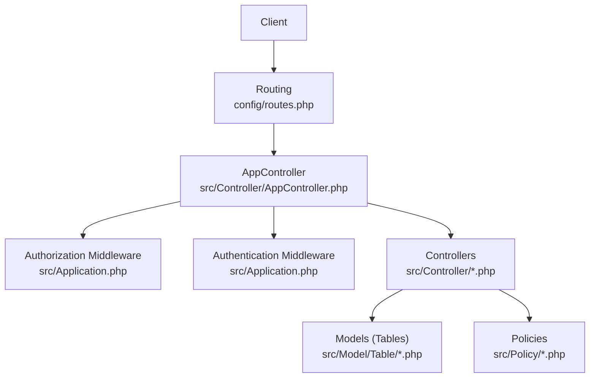
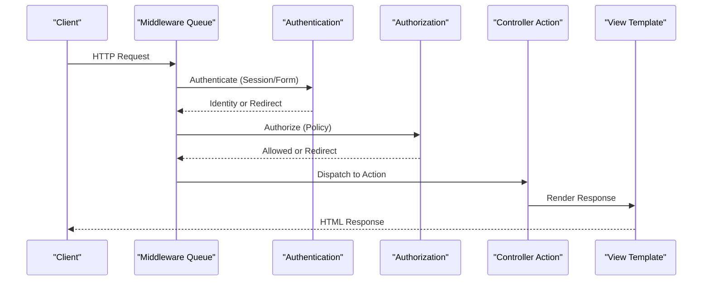
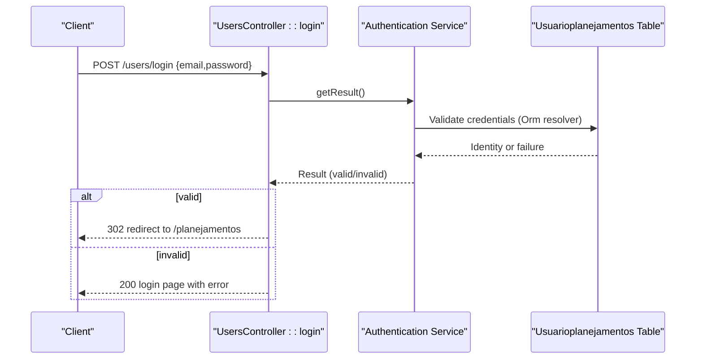
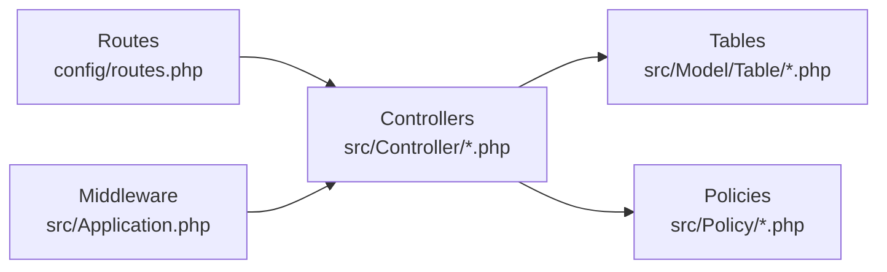

# API Reference

<cite>
**Referenced Files in This Document**
- [Application.php](file://src/Application.php)
- [AppController.php](file://src/Controller/AppController.php)
- [UsersController.php](file://src/Controller/UsersController.php)
- [PlanejamentosController.php](file://src/Controller/PlanejamentosController.php)
- [DocentesController.php](file://src/Controller/DocentesController.php)
- [SalasController.php](file://src/Controller/SalasController.php)
- [DisciplinasController.php](file://src/Controller/DisciplinasController.php)
- [HorariosController.php](file://src/Controller/HorariosController.php)
- [DiasController.php](file://src/Controller/DiasController.php)
- [routes.php](file://config/routes.php)
- [app.php](file://config/app.php)
- [UserPolicy.php](file://src/Policy/UserPolicy.php)
- [UsuarioplanejamentosTable.php](file://src/Model/Table/UsuarioplanejamentosTable.php)
- [Usuarioplanejamento.php](file://src/Model/Entity/Usuarioplanejamento.php)
</cite>

## Table of Contents
1. Introduction
2. Project Structure
3. Core Components
4. Architecture Overview
5. Detailed Component Analysis
6. Dependency Analysis
7. Performance Considerations
8. Troubleshooting Guide
9. Conclusion

## Introduction
This document provides an API reference for the planejamento5 academic planning system. The application is a CakePHP 5 web application that exposes standard controller actions (index, view, add, edit, delete) and additional endpoints such as listing and grade views. Authentication uses session-based mechanisms with form login, and authorization is enforced via policies.

The endpoints are served under the default CakePHP routing scheme. There is no dedicated /api prefix; controllers are accessed by their names and actions. Responses are HTML templates by default. For programmatic consumption, clients should use HTTP cookies to maintain sessions and handle redirects appropriately.

## Project Structure
The application follows a conventional MVC layout:
- Controllers define HTTP endpoints and business orchestration.
- Policies enforce authorization rules.
- Models (Tables/Entities) encapsulate data access and validation.
- Routes map URLs to controller actions.
- Application bootstrap configures middleware, authentication, and authorization.

**Diagram sources**
- [routes.php:50-79](file://config/routes.php#L50-L79)
- [Application.php:73-122](file://src/Application.php#L73-L122)
- [AppController.php:40-53](file://src/Controller/AppController.php#L40-L53)

**Section sources**
- [routes.php:50-79](file://config/routes.php#L50-L79)
- [Application.php:73-122](file://src/Application.php#L73-L122)

## Core Components
- Authentication: Session authenticator and Form authenticator using email/password against the Usuarioplanejamentos table. Unauthenticated redirect configured to /users/login.
- Authorization: Policy-based checks per resource. Some controllers explicitly skip authorization for read-only endpoints.
- CSRF protection enabled via middleware.
- Body parsing enabled for JSON/form bodies.

Key configuration points:
- Authenticators and identifiers are registered in the application service.
- Authorization middleware is configured with redirect behavior for unauthenticated/forbidden requests.
- Session defaults are set in app configuration.

**Section sources**
- [Application.php:124-162](file://src/Application.php#L124-L162)
- [Application.php:73-122](file://src/Application.php#L73-L122)
- [app.php:419-421](file://config/app.php#L419-L421)

## Architecture Overview
The request lifecycle:
1. Request enters routing layer.
2. Middleware applies CSRF, body parsing, authentication, and authorization.
3. Controller action executes, optionally skipping authorization for public reads.
4. Views render responses (HTML).

**Diagram sources**
- [Application.php:73-122](file://src/Application.php#L73-L122)
- [AppController.php:40-53](file://src/Controller/AppController.php#L40-L53)

## Detailed Component Analysis

### Authentication Endpoints (Users)
Base path: /users

- POST /users/login
  - Purpose: Authenticate user via email/password and establish a session.
  - Method: POST (GET also supported to display login form).
  - Headers: Content-Type: application/x-www-form-urlencoded or application/json (body parser enabled).
  - Body fields:
    - email: string (required)
    - password: string (required)
  - Response:
    - On success: 302 redirect to /planejamentos (dashboard).
    - On failure: 200 with login page showing error flash message.
  - Notes: Uses form authenticator with Password identifier against Usuarioplanejamentos table.

- GET /users/logout
  - Purpose: Destroy current session and redirect.
  - Response: 302 redirect to login or configured logout target.

- GET /users/profile
  - Purpose: View current user profile (requires authentication).
  - Response: 200 HTML profile view or redirect to login if not authenticated.

Security and policy:
- Login/logout/profile are allowed without authentication.
- User management policies restrict operations based on role and ownership.

Example client flow:
- Send POST /users/login with email and password.
- Maintain cookie across subsequent requests.
- Access protected endpoints; server will redirect to /users/login if session missing.

**Section sources**
- [Application.php:124-155](file://src/Application.php#L124-L155)
- [UsersController.php:20-77](file://src/Controller/UsersController.php#L20-L77)
- [UserPolicy.php:1-38](file://src/Policy/UserPolicy.php#L1-L38)
- [UsuarioplanejamentosTable.php:1-43](file://src/Model/Table/UsuarioplanejamentosTable.php#L1-L43)
- [Usuarioplanejamento.php:1-38](file://src/Model/Entity/Usuarioplanejamento.php#L1-L38)

### Schedule Management (Planejamentos)
Base path: /planejamentos

- GET /planejamentos
  - Purpose: List schedules with optional filtering and pagination.
  - Query parameters:
    - semestre: integer (optional) — filter by semester.
  - Sorting: Supports sortableFields including id, disciplina, docente, semestre, dia, horario, sala.
  - Response: 200 HTML index view with paginated results.

- GET /planejamentos/{id}
  - Purpose: View a single schedule detail.
  - Path parameter: id (integer).
  - Response: 200 HTML view.

- GET /planejamentos/add
  - Purpose: Display add form.
  - Query parameters:
    - configuraplanejamento_id: integer (optional) — preselect planning configuration.
  - Response: 200 HTML form.

- POST /planejamentos
  - Purpose: Create a new schedule.
  - Body fields (form-encoded):
    - disciplina_id: integer (required)
    - docente_id: integer (optional)
    - sala_id: integer (optional)
    - dia_id: integer (optional)
    - horario_id: integer (optional)
    - turno: string (auto-computed from horario_id)
    - periodo: integer (auto-computed from disciplina)
    - configuraplanejamento_id: integer (optional)
  - Behavior:
    - If horario_id in {1,2,3,4}, turno becomes diurno; otherwise noturno.
    - periodo derived from disciplina’s period fields.
  - Response:
    - Success: 302 redirect to index.
    - Failure: 200 with errors.

- GET /planejamentos/edit/{id}
  - Purpose: Edit existing schedule.
  - Path parameter: id (integer).
  - Query parameters:
    - configuraplanejamento_id: integer (optional).
  - Response: 200 HTML form.

- PATCH|POST|PUT /planejamentos/{id}
  - Purpose: Update schedule.
  - Body fields: same as create.
  - Response:
    - Success: 302 redirect to index.
    - Failure: 200 with errors.

- DELETE|POST /planejamentos/{id}
  - Purpose: Delete schedule.
  - Response:
    - Success: 302 redirect to index.
    - Failure: 200 with error.

- GET /planejamentos/listar
  - Purpose: List all schedules grouped by configuration, sorted by semester descending.
  - Response: 200 HTML list view.

Notes:
- index and view are publicly accessible; other actions require authorization.
- Authorization may be skipped for certain read endpoints.

**Section sources**
- [PlanejamentosController.php:11-256](file://src/Controller/PlanejamentosController.php#L11-L256)

### Faculty Administration (Docentes)
Base path: /docentes

- GET /docentes
  - Purpose: List faculty with filters and availability context.
  - Query parameters:
    - status: string (optional) — normalized aliases supported (e.g., ativo/active/activo).
    - departamento: string (optional).
    - configuraplanejamento_id: integer (optional) — show only available faculty for this configuration.
  - Response: 200 HTML index view with lists and availability mapping.

- GET /docentes/{id}
  - Purpose: View faculty details.
  - Response: 200 HTML view.

- GET /docentes/add
  - Purpose: Add faculty form.
  - Response: 200 HTML form.

- POST /docentes
  - Purpose: Create faculty.
  - Body fields include nome, cpf, siape, departamento, tipocargo, periodo_diurno, periodo_noturno, status, email, etc.
  - Response:
    - Success: 302 redirect to view/{id}.
    - Failure: 200 with errors.

- GET /docentes/edit/{id}
  - Purpose: Edit faculty form.
  - Response: 200 HTML form.

- PATCH|POST|PUT /docentes/{id}
  - Purpose: Update faculty.
  - Response:
    - Success: 302 redirect to view/{id}.
    - Failure: 200 with errors.

- DELETE|POST /docentes/{id}
  - Purpose: Delete faculty.
  - Response:
    - Success: 302 redirect to index.
    - Failure: 200 with error.

Notes:
- index and view are publicly accessible; other actions require authorization.
- Status normalization supports multiple language variants.

**Section sources**
- [DocentesController.php:1-247](file://src/Controller/DocentesController.php#L1-L247)

### Classroom Management (Salas)
Base path: /salas

- GET /salas
  - Purpose: List classrooms.
  - Response: 200 HTML index view.

- GET /salas/{id}
  - Purpose: View classroom detail.
  - Response: 200 HTML view.

- GET /salas/add
  - Purpose: Add classroom form.
  - Response: 200 HTML form.

- POST /salas
  - Purpose: Create classroom.
  - Response:
    - Success: 302 redirect to index.
    - Failure: 200 with errors.

- GET /salas/edit/{id}
  - Purpose: Edit classroom form.
  - Response: 200 HTML form.

- PATCH|POST|PUT /salas/{id}
  - Purpose: Update classroom.
  - Response:
    - Success: 302 redirect to index.
    - Failure: 200 with errors.

- DELETE|POST /salas/{id}
  - Purpose: Delete classroom.
  - Response:
    - Success: 302 redirect to index.
    - Failure: 200 with error.

Notes:
- index and view are publicly accessible; other actions require authorization.

**Section sources**
- [SalasController.php:1-121](file://src/Controller/SalasController.php#L1-L121)

### Course Definitions (Disciplinas)
Base path: /disciplinas

- GET /disciplinas
  - Purpose: List courses with filters.
  - Query parameters:
    - curriculo: string (optional).
    - periodo_diurno: integer (optional).
    - periodo_noturno: integer (optional).
  - Response: 200 HTML index view.

- GET /disciplinas/grade
  - Purpose: Generate course timetable grid for selected semester.
  - Query parameters:
    - semestre: integer (optional).
  - Response: 200 HTML grade view.

- GET /disciplinas/{id}
  - Purpose: View course detail.
  - Response: 200 HTML view.

- GET /disciplinas/add
  - Purpose: Add course form.
  - Response: 200 HTML form.

- POST /disciplinas
  - Purpose: Create course.
  - Response:
    - Success: 302 redirect to index.
    - Failure: 200 with errors.

- GET /disciplinas/edit/{id}
  - Purpose: Edit course form.
  - Response: 200 HTML form.

- PATCH|POST|PUT /disciplinas/{id}
  - Purpose: Update course.
  - Response:
    - Success: 302 redirect to view/{id}.
    - Failure: 200 with errors.

- DELETE|POST /disciplinas/{id}
  - Purpose: Delete course.
  - Response:
    - Success: 302 redirect to index.
    - Failure: 200 with error.

Notes:
- index, view, and grade are publicly accessible; other actions require authorization.

**Section sources**
- [DisciplinasController.php:1-231](file://src/Controller/DisciplinasController.php#L1-L231)

### Time Slot Management (Horarios)
Base path: /horarios

- GET /horarios
  - Purpose: List time slots.
  - Response: 200 HTML index view.

- GET /horarios/{id}
  - Purpose: View time slot detail.
  - Response: 200 HTML view.

- GET /horarios/add
  - Purpose: Add time slot form.
  - Response: 200 HTML form.

- POST /horarios
  - Purpose: Create time slot.
  - Response:
    - Success: 302 redirect to index.
    - Failure: 200 with errors.

- GET /horarios/edit/{id}
  - Purpose: Edit time slot form.
  - Response: 200 HTML form.

- PATCH|POST|PUT /horarios/{id}
  - Purpose: Update time slot.
  - Response:
    - Success: 302 redirect to index.
    - Failure: 200 with errors.

- DELETE|POST /horarios/{id}
  - Purpose: Delete time slot.
  - Response:
    - Success: 302 redirect to index.
    - Failure: 200 with error.

Notes:
- index and view are publicly accessible; other actions require authorization.

**Section sources**
- [HorariosController.php:1-121](file://src/Controller/HorariosController.php#L1-L121)

### Day Management (Dias)
Base path: /dias

- GET /dias
  - Purpose: List days.
  - Response: 200 HTML index view.

- GET /dias/{id}
  - Purpose: View day detail.
  - Response: 200 HTML view.

- GET /dias/add
  - Purpose: Add day form.
  - Response: 200 HTML form.

- POST /dias
  - Purpose: Create day.
  - Response:
    - Success: 302 redirect to index.
    - Failure: 200 with errors.

- GET /dias/edit/{id}
  - Purpose: Edit day form.
  - Response: 200 HTML form.

- PATCH|POST|PUT /dias/{id}
  - Purpose: Update day.
  - Response:
    - Success: 302 redirect to index.
    - Failure: 200 with errors.

- DELETE|POST /dias/{id}
  - Purpose: Delete day.
  - Response:
    - Success: 302 redirect to index.
    - Failure: 200 with error.

Notes:
- index and view are publicly accessible; other actions require authorization.

**Section sources**
- [DiasController.php:1-121](file://src/Controller/DiasController.php#L1-L121)

### Authentication Flow Sequence

**Diagram sources**
- [UsersController.php:29-50](file://src/Controller/UsersController.php#L29-L50)
- [Application.php:132-152](file://src/Application.php#L132-L152)
- [UsuarioplanejamentosTable.php:1-43](file://src/Model/Table/UsuarioplanejamentosTable.php#L1-L43)

## Dependency Analysis
- Controllers depend on Tables for data access and on Policies for authorization decisions.
- Application registers Authentication and Authorization middleware, which intercepts requests before controller dispatch.
- CSRF protection ensures state-changing requests include valid tokens when rendering forms.

**Diagram sources**
- [routes.php:50-79](file://config/routes.php#L50-L79)
- [Application.php:73-122](file://src/Application.php#L73-L122)

**Section sources**
- [routes.php:50-79](file://config/routes.php#L50-L79)
- [Application.php:73-122](file://src/Application.php#L73-L122)

## Performance Considerations
- Pagination: Most list endpoints use paginate(), which limits result sets and supports sorting. Use query parameters to narrow results where possible (e.g., semestre, status, departamento).
- Contain associations: Read-heavy endpoints load related entities; ensure only necessary relations are contained to reduce queries.
- Filtering: Prefer server-side filters over client-side processing to minimize payload sizes.
- Caching: Static assets are cached via middleware; consider enabling route caching for large route sets in production.
- Database indexes: Ensure foreign keys and frequently filtered columns (e.g., semestre, status, departamento) are indexed.

[No sources needed since this section provides general guidance]

## Troubleshooting Guide
Common issues and resolutions:
- Redirect loop to /users/login:
  - Ensure cookies are enabled and session storage is configured correctly.
  - Verify fullBaseUrl is set in production to avoid host header injection protections.
- Unauthorized access:
  - Check policy implementations and whether authorization is skipped for specific actions.
- Validation errors:
  - Inspect entity validation rules (e.g., email uniqueness, required fields).
- CSRF failures:
  - Confirm forms include CSRF tokens when submitting state-changing requests.

Operational notes:
- Error handling is configured globally; in debug mode, detailed stack traces are shown. In production, generic errors are returned.
- Flash messages indicate success/failure for mutations.

**Section sources**
- [Application.php:73-122](file://src/Application.php#L73-L122)
- [app.php:176-183](file://config/app.php#L176-L183)
- [UsuarioplanejamentosTable.php:24-41](file://src/Model/Table/UsuarioplanejamentosTable.php#L24-L41)

## Conclusion
The planejamento5 system provides a comprehensive set of endpoints for managing academic schedules, faculty, classrooms, courses, time slots, and days. Authentication is session-based with form login, and authorization is policy-driven. Clients should maintain cookies across requests and handle redirects for protected resources. For robust integrations, implement retry logic, respect pagination, and apply input validation aligned with server-side rules.

[No sources needed since this section summarizes without analyzing specific files]