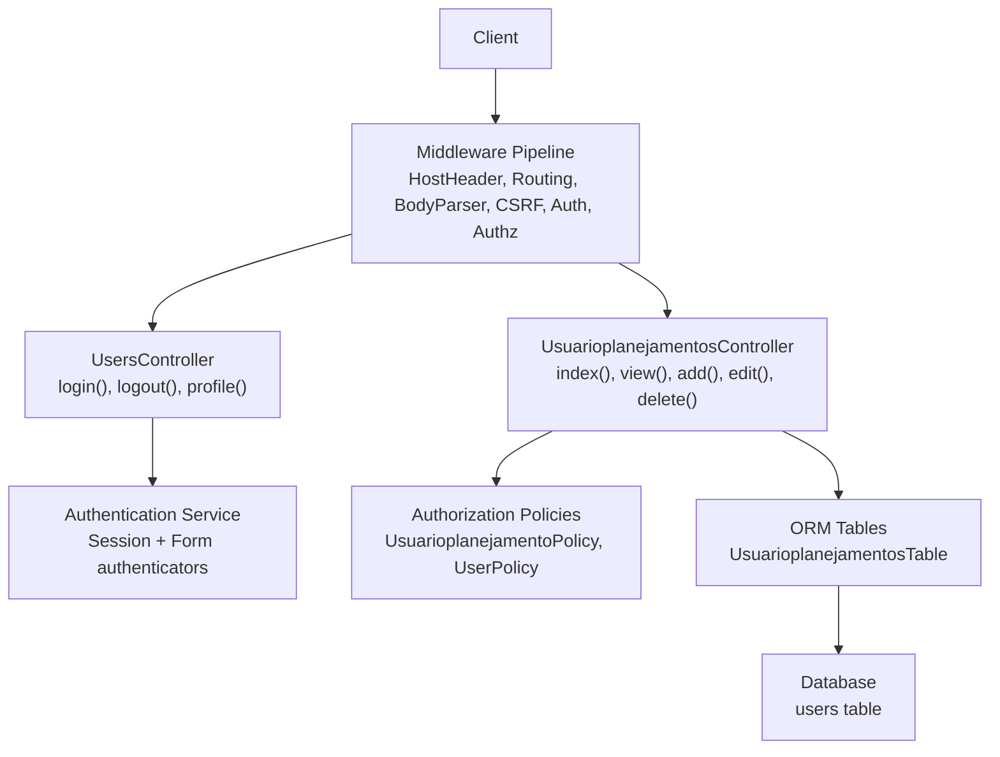
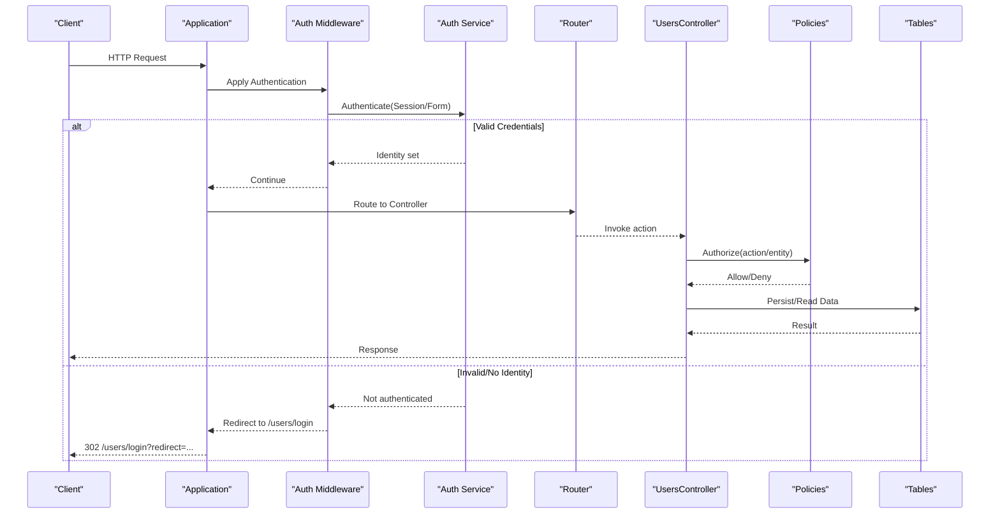
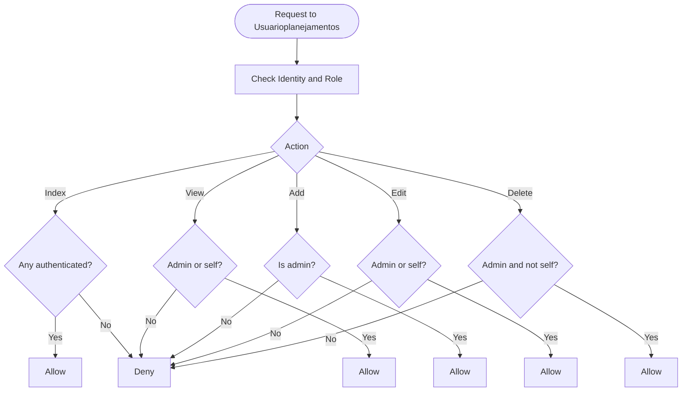
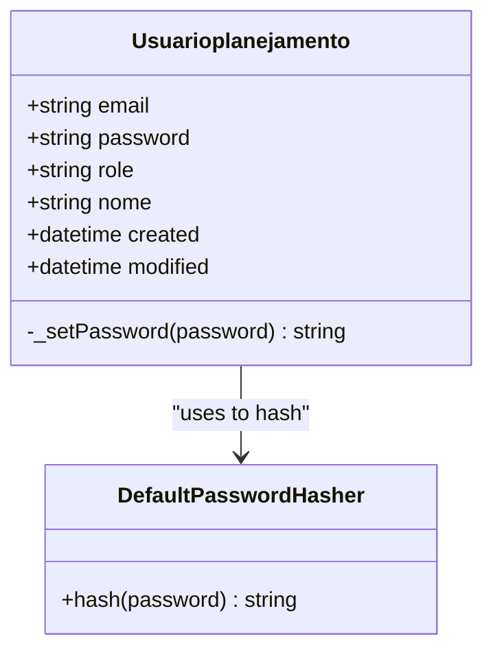
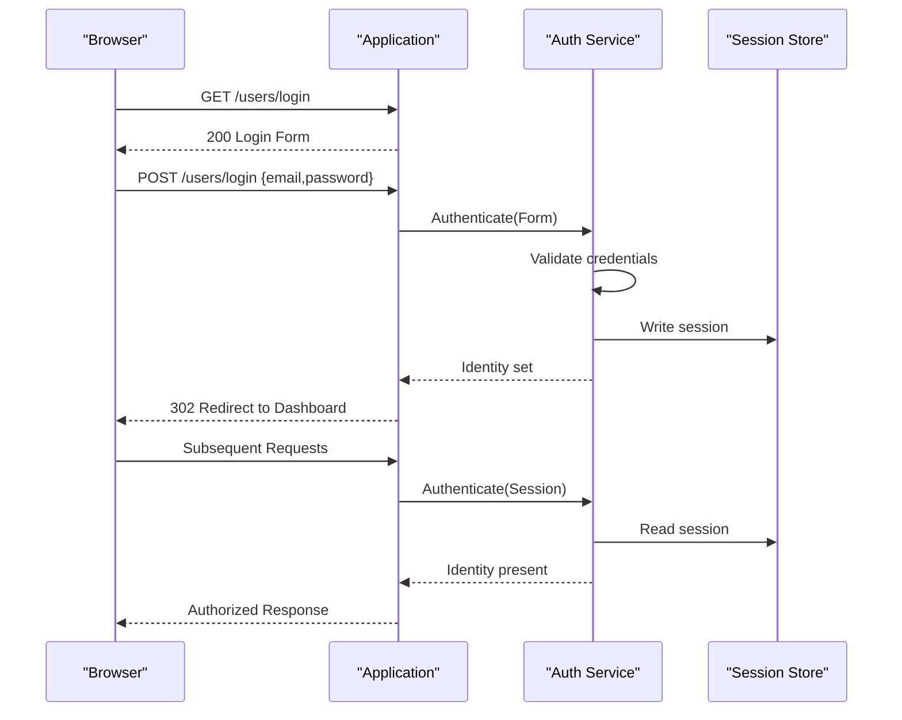
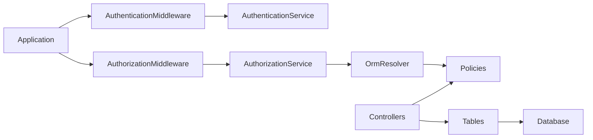

# Authentication & User Management API

<cite>
**Referenced Files in This Document**
- [Application.php](file://src/Application.php)
- [AppController.php](file://src/Controller/AppController.php)
- [UsersController.php](file://src/Controller/UsersController.php)
- [UsuarioplanejamentosController.php](file://src/Controller/UsuarioplanejamentosController.php)
- [UsuarioplanejamentoPolicy.php](file://src/Policy/UsuarioplanejamentoPolicy.php)
- [UserPolicy.php](file://src/Policy/UserPolicy.php)
- [Usuarioplanejamento.php](file://src/Model/Entity/Usuarioplanejamento.php)
- [UsuarioplanejamentosTable.php](file://src/Model/Table/UsuarioplanejamentosTable.php)
- [routes.php](file://config/routes.php)
- [app.php](file://config/app.php)
- [sessions.sql](file://config/schema/sessions.sql)
- [login.php](file://templates/Users/login.php)
</cite>

## Table of Contents
1. Introduction
2. Project Structure
3. Core Components
4. Architecture Overview
5. Detailed Component Analysis
6. Dependency Analysis
7. Performance Considerations
8. Troubleshooting Guide
9. Conclusion

## Introduction
This document describes the authentication and user management capabilities of the planejamento5 system, focusing on:
- Login/logout flows via GET /users/login and POST /users/login
- User profile management endpoints mapped to Usuarioplanejamentos (GET, POST, PUT/PATCH, DELETE)
- Role-based access control with admin and user roles
- Session-based authentication flow
- Password security measures
- Authorization policies and permission checks
- Request/response schemas for tokens, profiles, and permissions
- Example workflows and secure consumption patterns with error handling

Note: The application uses CakePHP conventions and fallback routes. Endpoints are served as HTML forms and redirects by default. For JSON APIs, enable JSON parsing and adjust responses accordingly.

## Project Structure
The authentication and authorization stack is implemented through middleware, controllers, policies, entities, and tables:
- Middleware: Host header validation, CSRF protection, body parsing, authentication, authorization
- Controllers: Users (login/logout/profile), Usuarioplanejamentos (CRUD)
- Policies: UsuarioplanejamentoPolicy and UserPolicy define role-based permissions
- Entity: Usuarioplanejamento handles password hashing and field visibility
- Table: UsuarioplanejamentosTable defines validation rules and ORM mapping
- Routes: Fallback routing maps URLs to controller actions
- Templates: Login form template for GET /users/login

**Diagram sources**
- [Application.php:80-122](file://src/Application.php#L80-L122)
- [UsersController.php:13-77](file://src/Controller/UsersController.php#L13-L77)
- [UsuarioplanejamentosController.php:10-85](file://src/Controller/UsuarioplanejamentosController.php#L10-L85)
- [UsuarioplanejamentoPolicy.php:9-35](file://src/Policy/UsuarioplanejamentoPolicy.php#L9-L35)
- [UserPolicy.php:9-37](file://src/Policy/UserPolicy.php#L9-L37)
- [UsuarioplanejamentosTable.php:9-42](file://src/Model/Table/UsuarioplanejamentosTable.php#L9-L42)

**Section sources**
- [Application.php:80-122](file://src/Application.php#L80-L122)
- [routes.php:52-79](file://config/routes.php#L52-L79)

## Core Components
- Authentication service configuration:
  - Authenticators: Session first, then Form with Email/Password fields
  - Resolver: ORM-backed user model Usuarioplanejamentos
  - Unauthenticated redirect to /users/login with redirect query parameter
- Authorization service:
  - OrmResolver binds policies to entities
  - Redirect unauthorized requests to /users/login
- Controllers:
  - UsersController exposes login, logout, and profile actions
  - UsuarioplanejamentosController provides CRUD operations with policy checks
- Policies:
  - UsuarioplanejamentoPolicy enforces admin-only create/delete and self/admin edit/view
  - UserPolicy mirrors similar logic for a User entity alias
- Entity and Table:
  - Usuarioplanejamento hashes passwords on write and hides them from output
  - UsuarioplanejamentosTable validates email uniqueness and required fields

**Section sources**
- [Application.php:124-162](file://src/Application.php#L124-L162)
- [UsersController.php:13-77](file://src/Controller/UsersController.php#L13-L77)
- [UsuarioplanejamentosController.php:10-85](file://src/Controller/UsuarioplanejamentosController.php#L10-L85)
- [UsuarioplanejamentoPolicy.php:9-35](file://src/Policy/UsuarioplanejamentoPolicy.php#L9-L35)
- [UserPolicy.php:9-37](file://src/Policy/UserPolicy.php#L9-L37)
- [Usuarioplanejamento.php:12-37](file://src/Model/Entity/Usuarioplanejamento.php#L12-L37)
- [UsuarioplanejamentosTable.php:9-42](file://src/Model/Table/UsuarioplanejamentosTable.php#L9-L42)

## Architecture Overview
The request lifecycle integrates multiple layers:
- Host header validation prevents host injection attacks
- Routing resolves URLs to controllers
- Body parser enables array access to request data
- CSRF protection secures state-changing requests
- Authentication middleware establishes identity via session or form credentials
- Authorization middleware enforces policies before controller actions

**Diagram sources**
- [Application.php:80-122](file://src/Application.php#L80-L122)
- [Application.php:124-162](file://src/Application.php#L124-L162)
- [UsersController.php:29-60](file://src/Controller/UsersController.php#L29-L60)

## Detailed Component Analysis

### Authentication Endpoints

#### GET /users/login
- Purpose: Render login form
- Behavior:
  - Displays a form requesting email and password
  - No authentication required
- Response:
  - HTML page with login form
- Security:
  - CSRF token included in form submission
  - Secure cookie flags configured at middleware level

**Section sources**
- [routes.php:52-79](file://config/routes.php#L52-L79)
- [login.php:1-48](file://templates/Users/login.php#L1-L48)
- [Application.php:101-105](file://src/Application.php#L101-L105)

#### POST /users/login
- Purpose: Authenticate using email and password
- Request body:
  - email: string (required)
  - password: string (required)
- Behavior:
  - Authentication service attempts login via Form authenticator
  - On success: sets session identity and redirects to dashboard
  - On failure: shows error message and re-renders login form
- Response:
  - 302 redirect on success
  - 200 with login form on failure
- Error handling:
  - Flash messages indicate invalid credentials

**Section sources**
- [Application.php:134-152](file://src/Application.php#L134-L152)
- [UsersController.php:29-50](file://src/Controller/UsersController.php#L29-L50)

#### Logout
- Purpose: Terminate current session
- Behavior:
  - Clears session identity
  - Redirects to login page
- Response:
  - 302 redirect to /users/login
- Notes:
  - Accessible without authentication; typically used after successful login

**Section sources**
- [UsersController.php:55-60](file://src/Controller/UsersController.php#L55-L60)

### User Profile Management Endpoints

Endpoints map to Usuarioplanejamentos controller actions via CakePHP conventions:
- GET /usuarioplanejamentos -> index()
- POST /usuarioplanejamentos -> add()
- PUT /usuarioplanejamentos/{id} -> edit() (also supports PATCH)
- DELETE /usuarioplanejamentos/{id} -> delete()

#### GET /usuarioplanejamentos
- Purpose: List users
- Authorization:
  - Requires any authenticated user (policy allows non-null identity)
- Response:
  - HTML list of users (default behavior)
- Notes:
  - Authorization can be skipped in controller if needed for testing

**Section sources**
- [UsuarioplanejamentosController.php:19-24](file://src/Controller/UsuarioplanejamentosController.php#L19-L24)
- [UsuarioplanejamentoPolicy.php:11-14](file://src/Policy/UsuarioplanejamentoPolicy.php#L11-L14)

#### POST /usuarioplanejamentos
- Purpose: Create a new user
- Request body:
  - email: string (required, unique)
  - password: string (required on create)
  - role: string (required, max length 20)
  - nome: string (optional)
- Authorization:
  - Admin only
- Behavior:
  - Validates input
  - Hashes password automatically
  - Saves user and redirects to index
- Response:
  - 302 redirect on success
  - 200 with form on failure

**Section sources**
- [UsuarioplanejamentosController.php:33-49](file://src/Controller/UsuarioplanejamentosController.php#L33-L49)
- [UsuarioplanejamentoPolicy.php:21-24](file://src/Policy/UsuarioplanejamentoPolicy.php#L21-L24)
- [UsuarioplanejamentosTable.php:24-41](file://src/Model/Table/UsuarioplanejamentosTable.php#L24-L41)
- [Usuarioplanejamento.php:30-36](file://src/Model/Entity/Usuarioplanejamento.php#L30-L36)

#### PUT /usuarioplanejamentos/{id}
- Purpose: Update an existing user
- Request body:
  - email: string (optional update)
  - password: string (optional; ignored if empty)
  - role: string (optional update)
  - nome: string (optional update)
- Authorization:
  - Admin or the user themselves
- Behavior:
  - Loads user entity
  - Removes empty password field to avoid overwriting
  - Saves changes and redirects
- Response:
  - 302 redirect on success
  - 200 with form on failure

**Section sources**
- [UsuarioplanejamentosController.php:51-71](file://src/Controller/UsuarioplanejamentosController.php#L51-L71)
- [UsuarioplanejamentoPolicy.php:26-29](file://src/Policy/UsuarioplanejamentoPolicy.php#L26-L29)

#### DELETE /usuarioplanejamentos/{id}
- Purpose: Delete a user
- Authorization:
  - Admin only and cannot delete self
- Behavior:
  - Loads user entity
  - Deletes record
  - Redirects to index
- Response:
  - 302 redirect to index

**Section sources**
- [UsuarioplanejamentosController.php:73-84](file://src/Controller/UsuarioplanejamentosController.php#L73-L84)
- [UsuarioplanejamentoPolicy.php:31-34](file://src/Policy/UsuarioplanejamentoPolicy.php#L31-L34)

### Role-Based Access Control and Policies

Roles:
- admin: Full access to user management
- user: Limited access; can view/edit own profile

Policy summary:
- Index: Any authenticated user
- View: Admin or self
- Add: Admin only
- Edit: Admin or self
- Delete: Admin only and not self

**Diagram sources**
- [UsuarioplanejamentoPolicy.php:11-34](file://src/Policy/UsuarioplanejamentoPolicy.php#L11-L34)

**Section sources**
- [UsuarioplanejamentoPolicy.php:9-35](file://src/Policy/UsuarioplanejamentoPolicy.php#L9-L35)
- [UserPolicy.php:9-37](file://src/Policy/UserPolicy.php#L9-L37)

### Password Security Measures
- Password hashing:
  - Entity overrides setter to hash passwords using a secure hasher when provided
- Output masking:
  - Password field is hidden from serialized output
- Validation:
  - Required on create, optional on update
  - Max length enforced

**Diagram sources**
- [Usuarioplanejamento.php:12-37](file://src/Model/Entity/Usuarioplanejamento.php#L12-L37)

**Section sources**
- [Usuarioplanejamento.php:12-37](file://src/Model/Entity/Usuarioplanejamento.php#L12-L37)
- [UsuarioplanejamentosTable.php:24-41](file://src/Model/Table/UsuarioplanejamentosTable.php#L24-L41)

### Session-Based Authentication Flow
- Session authenticator is loaded first, enabling persistent logins across requests
- Form authenticator validates email/password against ORM-backed user model
- Unauthenticated requests redirect to /users/login with redirect parameter preserved
- CSRF protection ensures form submissions are valid

**Diagram sources**
- [Application.php:124-155](file://src/Application.php#L124-L155)
- [Application.php:101-105](file://src/Application.php#L101-L105)

**Section sources**
- [Application.php:124-155](file://src/Application.php#L124-L155)
- [app.php:375-421](file://config/app.php#L375-L421)
- [sessions.sql:8-15](file://config/schema/sessions.sql#L8-L15)

### Request/Response Schemas

#### Authentication Tokens
- Mechanism: Session-based cookies
- Cookie attributes:
  - HttpOnly enabled via CSRF middleware configuration
- Lifecycle:
  - Created on successful login
  - Cleared on logout
- Storage:
  - PHP sessions by default; database schema available for persistence

**Section sources**
- [Application.php:101-105](file://src/Application.php#L101-L105)
- [app.php:375-421](file://config/app.php#L375-L421)
- [sessions.sql:8-15](file://config/schema/sessions.sql#L8-L15)

#### User Profiles
- Fields:
  - id: integer primary key
  - email: string, unique, required on create
  - password: string, hashed, required on create
  - role: string, allowed values include admin/user
  - nome: string, optional
  - created: datetime
  - modified: datetime
- Output:
  - password excluded from serialization

**Section sources**
- [Usuarioplanejamento.php:14-28](file://src/Model/Entity/Usuarioplanejamento.php#L14-L28)
- [UsuarioplanejamentosTable.php:11-22](file://src/Model/Table/UsuarioplanejamentosTable.php#L11-L22)
- [UsuarioplanejamentosTable.php:24-41](file://src/Model/Table/UsuarioplanejamentosTable.php#L24-L41)

#### Permission Structures
- Roles:
  - admin: full access
  - user: limited access
- Policy methods:
  - canIndex, canView, canAdd, canEdit, canDelete
- Enforcement:
  - Authorization middleware and explicit authorize() calls in controllers

**Section sources**
- [UsuarioplanejamentoPolicy.php:11-34](file://src/Policy/UsuarioplanejamentoPolicy.php#L11-L34)
- [UserPolicy.php:12-36](file://src/Policy/UserPolicy.php#L12-L36)

### Example Workflows

#### Login Workflow
- Steps:
  - GET /users/login to render form
  - POST /users/login with email and password
  - On success, receive 302 redirect to dashboard
  - On failure, receive 200 with login form and error flash message
- Errors:
  - Invalid credentials result in error message and re-rendered form

**Section sources**
- [UsersController.php:29-50](file://src/Controller/UsersController.php#L29-L50)
- [login.php:1-48](file://templates/Users/login.php#L1-L48)

#### Session Management
- Maintain session across requests
- Ensure CSRF token is included in state-changing requests
- Configure secure cookie settings and timeouts appropriately

**Section sources**
- [Application.php:101-105](file://src/Application.php#L101-L105)
- [app.php:375-421](file://config/app.php#L375-L421)

#### Secure API Consumption Patterns
- Always send HTTPS requests
- Include CSRF token for POST/PUT/DELETE
- Handle redirects and errors gracefully
- Avoid logging sensitive fields like passwords

[No sources needed since this section provides general guidance]

## Dependency Analysis
Key dependencies:
- Authentication and Authorization services integrated via middleware
- Policies bound to entities via OrmResolver
- Controllers depend on components for authentication and authorization
- Entities and tables enforce security and validation

**Diagram sources**
- [Application.php:80-122](file://src/Application.php#L80-L122)
- [Application.php:157-162](file://src/Application.php#L157-L162)

**Section sources**
- [Application.php:80-122](file://src/Application.php#L80-L122)
- [Application.php:157-162](file://src/Application.php#L157-L162)

## Performance Considerations
- Use database-backed sessions for scalability in multi-server environments
- Enable route caching if many routes are defined
- Minimize unnecessary policy checks by skipping authorization where appropriate (use cautiously)
- Keep password hashing overhead minimal by avoiding redundant updates

[No sources needed since this section provides general guidance]

## Troubleshooting Guide
Common issues:
- Host header injection:
  - Ensure App.fullBaseUrl is configured in production
- CSRF failures:
  - Verify CSRF token is included in form submissions
- Unauthorized redirects:
  - Confirm unauthenticated actions are correctly whitelisted
- Password not updating:
  - Ensure password field is provided when intended; empty passwords are ignored on update

**Section sources**
- [Application.php:80-83](file://src/Application.php#L80-L83)
- [Application.php:101-105](file://src/Application.php#L101-L105)
- [UsersController.php:20-24](file://src/Controller/UsersController.php#L20-L24)
- [UsuarioplanejamentosController.php:56-61](file://src/Controller/UsuarioplanejamentosController.php#L56-L61)

## Conclusion
The planejamento5 system implements robust session-based authentication and role-based authorization for user management. Login/logout flows are straightforward, while user profile endpoints enforce strict policies to protect data integrity. Passwords are securely hashed and never exposed in outputs. For API clients, ensure proper handling of redirects, CSRF tokens, and secure transport.

[No sources needed since this section summarizes without analyzing specific files]