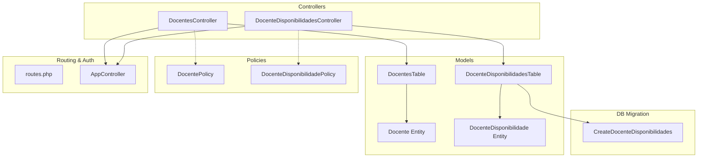
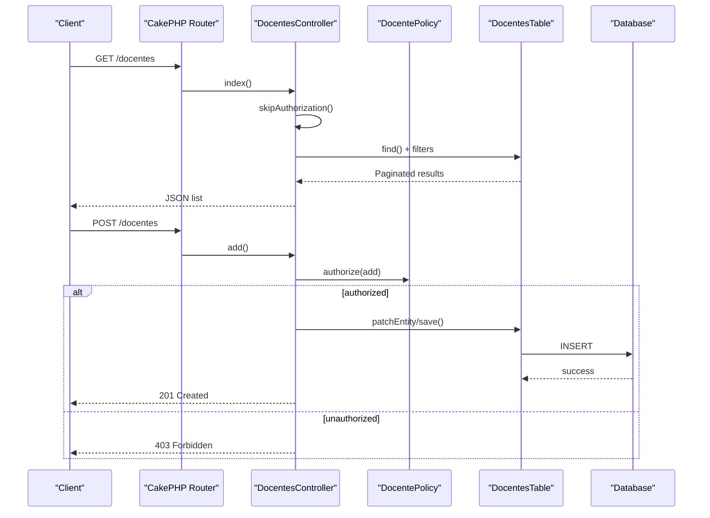
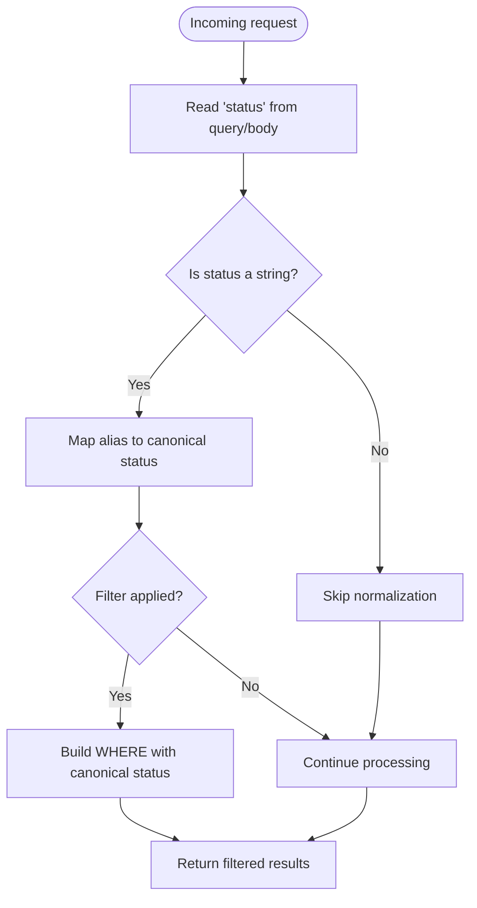
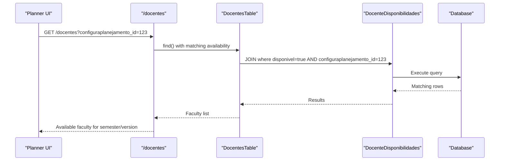
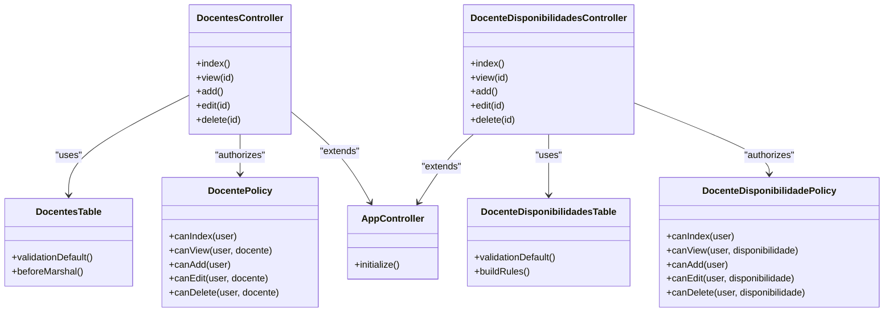

# Faculty Management API

<cite>
**Referenced Files in This Document**
- [DocentesController.php](file://src/Controller/DocentesController.php)
- [DocenteDisponibilidadesController.php](file://src/Controller/DocenteDisponibilidadesController.php)
- [DocentesTable.php](file://src/Model/Table/DocentesTable.php)
- [DocenteDisponibilidadesTable.php](file://src/Model/Table/DocenteDisponibilidadesTable.php)
- [Docente.php](file://src/Model/Entity/Docente.php)
- [DocenteDisponibilidade.php](file://src/Model/Entity/DocenteDisponibilidade.php)
- [DocentePolicy.php](file://src/Policy/DocentePolicy.php)
- [DocenteDisponibilidadePolicy.php](file://src/Policy/DocenteDisponibilidadePolicy.php)
- [AppController.php](file://src/Controller/AppController.php)
- [routes.php](file://config/routes.php)
- [20260613100000_CreateDocenteDisponibilidades.php](file://config/Migrations/20260613100000_CreateDocenteDisponibilidades.php)
</cite>

## Table of Contents
1. Introduction
2. Project Structure
3. Core Components
4. Architecture Overview
5. Detailed Component Analysis
6. Dependency Analysis
7. Performance Considerations
8. Troubleshooting Guide
9. Conclusion

## Introduction
This document provides API documentation for faculty management endpoints in the planejamento5 system. It covers:
- CRUD operations for faculty members (GET, POST, PUT, DELETE)
- Availability management endpoints per planning configuration (semester/version)
- Status normalization and filtering
- Authorization requirements
- Request/response schemas and validation rules
- Examples for profile management, availability scheduling, and bulk operations

Note: The application uses CakePHP fallback routing, so controller actions are accessible via RESTful URLs under /docentes and /docente-disponibilidades.

## Project Structure
The faculty management feature is implemented with controllers, models (tables/entities), policies, and a migration for availability records.

**Diagram sources**
- [DocentesController.php](file://src/Controller/DocentesController.php)
- [DocenteDisponibilidadesController.php](file://src/Controller/DocenteDisponibilidadesController.php)
- [DocentesTable.php](file://src/Model/Table/DocentesTable.php)
- [DocenteDisponibilidadesTable.php](file://src/Model/Table/DocenteDisponibilidadesTable.php)
- [Docente.php](file://src/Model/Entity/Docente.php)
- [DocenteDisponibilidade.php](file://src/Model/Entity/DocenteDisponibilidade.php)
- [DocentePolicy.php](file://src/Policy/DocentePolicy.php)
- [DocenteDisponibilidadePolicy.php](file://src/Policy/DocenteDisponibilidadePolicy.php)
- [AppController.php](file://src/Controller/AppController.php)
- [routes.php](file://config/routes.php)
- [20260613100000_CreateDocenteDisponibilidades.php](file://config/Migrations/20260613100000_CreateDocenteDisponibilidades.php)

**Section sources**
- [DocentesController.php](file://src/Controller/DocentesController.php)
- [DocenteDisponibilidadesController.php](file://src/Controller/DocenteDisponibilidadesController.php)
- [DocentesTable.php](file://src/Model/Table/DocentesTable.php)
- [DocenteDisponibilidadesTable.php](file://src/Model/Table/DocenteDisponibilidadesTable.php)
- [Docente.php](file://src/Model/Entity/Docente.php)
- [DocenteDisponibilidade.php](file://src/Model/Entity/DocenteDisponibilidade.php)
- [DocentePolicy.php](file://src/Policy/DocentePolicy.php)
- [DocenteDisponibilidadePolicy.php](file://src/Policy/DocenteDisponibilidadePolicy.php)
- [AppController.php](file://src/Controller/AppController.php)
- [routes.php](file://config/routes.php)
- [20260613100000_CreateDocenteDisponibilidades.php](file://config/Migrations/20260613100000_CreateDocenteDisponibilidades.php)

## Core Components
- DocentesController: Implements index, view, add, edit, delete for faculty. Supports filtering by status, department, and availability for a planning configuration. Normalizes status values to canonical forms.
- DocenteDisponibilidadesController: Implements index, view, add, edit, delete for faculty availability per planning configuration.
- DocentesTable: Defines validation rules and marshaling behavior that normalizes status aliases to canonical values.
- DocenteDisponibilidadesTable: Defines validation and referential integrity rules for availability records.
- Policies: Enforce role-based authorization for read/write/delete operations.
- AppController: Loads Authentication and Authorization components globally.
- routes.php: Uses fallbacks to map RESTful URLs to controller actions.
- Migration: Creates the availability table with unique constraint on (docente_id, configuraplanejamento_id).

**Section sources**
- [DocentesController.php](file://src/Controller/DocentesController.php)
- [DocenteDisponibilidadesController.php](file://src/Controller/DocenteDisponibilidadesController.php)
- [DocentesTable.php](file://src/Model/Table/DocentesTable.php)
- [DocenteDisponibilidadesTable.php](file://src/Model/Table/DocenteDisponibilidadesTable.php)
- [DocentePolicy.php](file://src/Policy/DocentePolicy.php)
- [DocenteDisponibilidadePolicy.php](file://src/Policy/DocenteDisponibilidadePolicy.php)
- [AppController.php](file://src/Controller/AppController.php)
- [routes.php](file://config/routes.php)
- [20260613100000_CreateDocenteDisponibilidades.php](file://config/Migrations/20260613100000_CreateDocenteDisponibilidades.php)

## Architecture Overview
The API follows MVC patterns with policy-based authorization and ORM-backed persistence.

**Diagram sources**
- [DocentesController.php](file://src/Controller/DocentesController.php)
- [DocentePolicy.php](file://src/Policy/DocentePolicy.php)
- [DocentesTable.php](file://src/Model/Table/DocentesTable.php)
- [routes.php](file://config/routes.php)

## Detailed Component Analysis

### Faculty Endpoints (/docentes)
Base URL: /docentes

- GET /docentes
  - Purpose: List all faculty with optional filters.
  - Query parameters:
    - status: Filter by normalized status. Accepts aliases like active/inactive/retired; normalized to canonical values internally.
    - departamento: Filter by department string.
    - configuraplanejamento_id: Filter to faculty marked available for a specific planning configuration.
  - Response: Array of faculty entities with fields defined in the Docente entity.
  - Authorization: Public (authorization skipped in controller).
  - Validation: Server-side validation enforced by DocentesTable.

- GET /docentes/{id}
  - Purpose: Retrieve details for a single faculty member.
  - Path parameter: id (integer).
  - Response: Single faculty entity with related Planejamento and DocenteDisponibilidades (with Configuraplanejamentos).
  - Authorization: Public (authorization skipped in controller).

- POST /docentes
  - Purpose: Create a new faculty member.
  - Request body: Fields from Docente entity. Default status set to active if not provided.
  - Response: Created faculty entity or validation errors.
  - Authorization: Requires role admin or editor (policy check).
  - Validation: See DocentesTable validationDefault.

- PUT /docentes/{id}
  - Purpose: Update an existing faculty member.
  - Path parameter: id (integer).
  - Request body: Partial or full update using allowed fields.
  - Response: Updated faculty entity or validation errors.
  - Authorization: Requires role admin or editor (policy check).

- DELETE /docentes/{id}
  - Purpose: Remove a faculty member.
  - Path parameter: id (integer).
  - Response: Success or error message.
  - Authorization: Requires role admin (policy check).

Status normalization and aliases:
- Canonical statuses: ativo (active), aposentado (retired), inativo (inactive).
- Accepted aliases include active/inactive/activo/inactivo/retired.
- Normalization occurs during marshaling in DocentesTable beforeMarshal.

Filtering behavior:
- status: Maps aliases to canonical values and filters IN clause.
- departamento: Exact match filter.
- configuraplanejamento_id: Matches faculty who have a disponivel=true availability record for the given configuration.

Request/Response schema (Faculty):
- Fields:
  - id: integer
  - nome: string (required, max 200)
  - cpf: string (optional)
  - siape: string (optional)
  - cress: string (optional)
  - regiao: string (optional)
  - telefone: string (optional)
  - celular: string (optional)
  - email: string (optional, validated as email)
  - dataingresso: date (optional)
  - tipocargo: string (optional)
  - departamento: string (optional)
  - dataegresso: date (optional)
  - motivoegresso: string (optional)
  - observacoes: string (optional)
  - status: string (normalized to canonical values)
  - created: datetime
  - modified: datetime

Validation rules:
- nome required on create and non-empty.
- email must be valid format when present.
- Dates must be valid date format when present.
- status normalized via beforeMarshal.

Authorization requirements:
- GET index/view: Public (skipped).
- POST add: admin/editor.
- PUT edit: admin/editor.
- DELETE delete: admin only.

Examples:
- List active faculty: GET /docentes?status=active
- Filter by department: GET /docentes?departamento=Computer%20Science
- Filter by availability for a planning config: GET /docentes?configuraplanejamento_id=123
- Create faculty: POST /docentes with {nome, email, status:"active", ...}
- Update faculty: PUT /docentes/42 with partial payload
- Delete faculty: DELETE /docentes/42

**Section sources**
- [DocentesController.php](file://src/Controller/DocentesController.php)
- [DocentesTable.php](file://src/Model/Table/DocentesTable.php)
- [Docente.php](file://src/Model/Entity/Docente.php)
- [DocentePolicy.php](file://src/Policy/DocentePolicy.php)

### Availability Endpoints (/docente-disponibilidades)
Base URL: /docente-disponibilidades

- GET /docente-disponibilidades
  - Purpose: List availability records across planning configurations.
  - Query parameters:
    - docente_id: Optional filter by faculty ID.
  - Response: Array of availability entities with associated Docente and Configuraplanejamentos.
  - Authorization: Public (authorization skipped in controller).

- GET /docente-disponibilidades/{id}
  - Purpose: View a single availability record.
  - Path parameter: id (integer).
  - Response: Single availability entity with related Docente and Configuraplanejamentos.
  - Authorization: Public (authorization skipped in controller).

- POST /docente-disponibilidades
  - Purpose: Create a new availability record for a faculty member and planning configuration.
  - Request body:
    - docente_id: integer (required)
    - configuraplanejamento_id: integer (required)
    - disponivel: boolean (required)
    - motivo: string (optional, max 100)
    - observacoes: string (optional)
  - Response: Created availability entity or validation errors.
  - Authorization: Requires role admin or editor (policy check).
  - Validation: Referential integrity enforced (must exist in Docentes and Configuraplanejamentos).

- PUT /docente-disponibilidades/{id}
  - Purpose: Update an existing availability record.
  - Path parameter: id (integer).
  - Request body: Same fields as create; partial updates supported.
  - Response: Updated availability entity or validation errors.
  - Authorization: Requires role admin or editor (policy check).

- DELETE /docente-disponibilidades/{id}
  - Purpose: Remove an availability record.
  - Path parameter: id (integer).
  - Response: Success or error message.
  - Authorization: Requires role admin (policy check).

Availability schema:
- Fields:
  - id: integer
  - docente_id: integer (required)
  - configuraplanejamento_id: integer (required)
  - disponivel: boolean (required)
  - motivo: string (optional, max 100)
  - observacoes: text (optional)
  - created: datetime
  - modified: datetime

Constraints:
- Unique constraint on (docente_id, configuraplanejamento_id) ensures one availability record per faculty per planning configuration.

Examples:
- Create availability: POST /docente-disponibilidades with {docente_id: 1, configuraplanejamento_id: 123, disponivel: true}
- Update availability: PUT /docente-disponibilidades/5 with {disponivel: false, motivo: "Sabbatical"}
- List for a faculty: GET /docente-disponibilidades?docente_id=1

**Section sources**
- [DocenteDisponibilidadesController.php](file://src/Controller/DocenteDisponibilidadesController.php)
- [DocenteDisponibilidadesTable.php](file://src/Model/Table/DocenteDisponibilidadesTable.php)
- [DocenteDisponibilidade.php](file://src/Model/Entity/DocenteDisponibilidade.php)
- [DocenteDisponibilidadePolicy.php](file://src/Policy/DocenteDisponibilidadePolicy.php)
- [20260613100000_CreateDocenteDisponibilidades.php](file://config/Migrations/20260613100000_CreateDocenteDisponibilidades.php)

### Status Management and Filtering
- Canonical statuses:
  - ativo (active)
  - aposentado (retired)
  - inativo (inactive)
- Aliases accepted:
  - active -> ativo
  - inactive -> inativo
  - activo/inactivo -> ativo/inativo
  - retired -> aposentado
- Behavior:
  - beforeMarshal normalizes incoming status values to canonical forms.
  - Index action supports filtering by status alias and displays normalized labels.

Flowchart: Status normalization and filtering

**Diagram sources**
- [DocentesTable.php](file://src/Model/Table/DocentesTable.php)
- [DocentesController.php](file://src/Controller/DocentesController.php)

**Section sources**
- [DocentesTable.php](file://src/Model/Table/DocentesTable.php)
- [DocentesController.php](file://src/Controller/DocentesController.php)

### Integration with Scheduling Conflicts
- Availability records link faculty to planning configurations (semesters/versions).
- The index endpoint can filter faculty by availability for a specific configuration, enabling planners to see who is available for a given semester/version.
- Unique constraint prevents duplicate availability entries per faculty per configuration.

Conceptual workflow diagram (availability-driven filtering)

[No sources needed since this diagram shows conceptual workflow, not actual code structure]

## Dependency Analysis
Relationships between components and their responsibilities:

**Diagram sources**
- [DocentesController.php](file://src/Controller/DocentesController.php)
- [DocenteDisponibilidadesController.php](file://src/Controller/DocenteDisponibilidadesController.php)
- [DocentesTable.php](file://src/Model/Table/DocentesTable.php)
- [DocenteDisponibilidadesTable.php](file://src/Model/Table/DocenteDisponibilidadesTable.php)
- [DocentePolicy.php](file://src/Policy/DocentePolicy.php)
- [DocenteDisponibilidadePolicy.php](file://src/Policy/DocenteDisponibilidadePolicy.php)
- [AppController.php](file://src/Controller/AppController.php)

**Section sources**
- [DocentesController.php](file://src/Controller/DocentesController.php)
- [DocenteDisponibilidadesController.php](file://src/Controller/DocenteDisponibilidadesController.php)
- [DocentesTable.php](file://src/Model/Table/DocentesTable.php)
- [DocenteDisponibilidadesTable.php](file://src/Model/Table/DocenteDisponibilidadesTable.php)
- [DocentePolicy.php](file://src/Policy/DocentePolicy.php)
- [DocenteDisponibilidadePolicy.php](file://src/Policy/DocenteDisponibilidadePolicy.php)
- [AppController.php](file://src/Controller/AppController.php)

## Performance Considerations
- Use pagination for large lists (implemented in both controllers).
- Prefer filtering at the database level (status, department, availability) to reduce payload size.
- Avoid unnecessary contains in list endpoints; use targeted queries.
- Leverage indexes on foreign keys and unique constraints for availability lookups.

## Troubleshooting Guide
Common issues and resolutions:
- Unauthorized access:
  - Ensure user has appropriate role (admin/editor for write operations; admin for delete).
  - Check policy methods and identity role.
- Validation errors:
  - Verify required fields (e.g., nome for faculty; docente_id/configuraplanejamento_id/disponivel for availability).
  - Confirm email format and date formats when provided.
- Duplicate availability:
  - Unique constraint on (docente_id, configuraplanejamento_id) will prevent duplicates.
- Status not recognized:
  - Use canonical values or accepted aliases; normalization occurs server-side.

**Section sources**
- [DocentePolicy.php](file://src/Policy/DocentePolicy.php)
- [DocenteDisponibilidadePolicy.php](file://src/Policy/DocenteDisponibilidadePolicy.php)
- [DocentesTable.php](file://src/Model/Table/DocentesTable.php)
- [DocenteDisponibilidadesTable.php](file://src/Model/Table/DocenteDisponibilidadesTable.php)
- [20260613100000_CreateDocenteDisponibilidades.php](file://config/Migrations/20260613100000_CreateDocenteDisponibilidades.php)

## Conclusion
The faculty management API provides robust CRUD operations for faculty profiles and availability scheduling tied to planning configurations. Status normalization simplifies client usage by accepting multiple aliases. Role-based authorization protects sensitive operations, while database constraints ensure data integrity. Use the documented filters and schemas to integrate effectively into academic planning workflows.