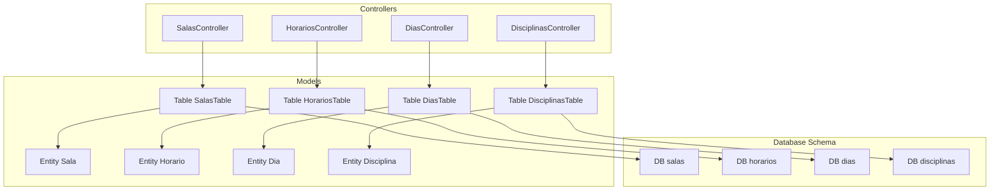
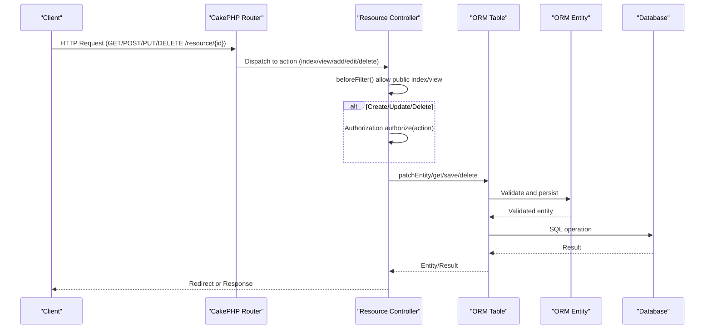
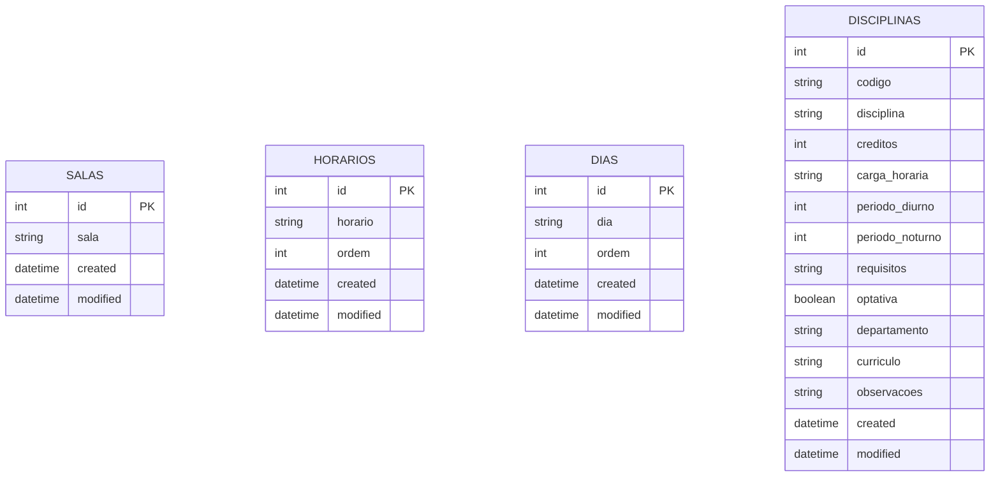
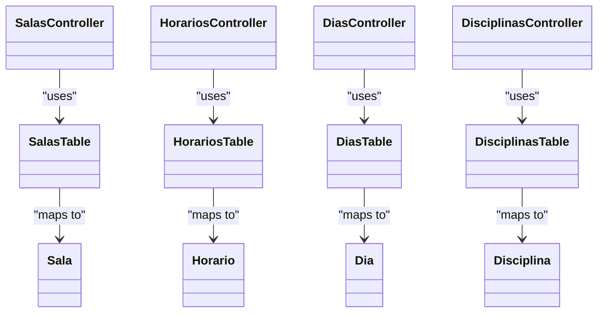

# Resource Management API

<cite>
**Referenced Files in This Document**
- [SalasController.php](file://src/Controller/SalasController.php)
- [HorariosController.php](file://src/Controller/HorariosController.php)
- [DiasController.php](file://src/Controller/DiasController.php)
- [DisciplinasController.php](file://src/Controller/DisciplinasController.php)
- [Sala.php](file://src/Model/Entity/Sala.php)
- [Horario.php](file://src/Model/Entity/Horario.php)
- [Dia.php](file://src/Model/Entity/Dia.php)
- [Disciplina.php](file://src/Model/Entity/Disciplina.php)
- [SalasTable.php](file://src/Model/Table/SalasTable.php)
- [HorariosTable.php](file://src/Model/Table/HorariosTable.php)
- [DiasTable.php](file://src/Model/Table/DiasTable.php)
- [DisciplinasTable.php](file://src/Model/Table/DisciplinasTable.php)
- [20260612030432_CreateSalas.php](file://config/Migrations/20260612030432_CreateSalas.php)
- [20260612030431_CreateHorarios.php](file://config/Migrations/20260612030431_CreateHorarios.php)
- [20260612030430_CreateDias.php](file://config/Migrations/20260612030430_CreateDias.php)
- [20260618004511_AddCurriculoToDisciplinas.php](file://config/Migrations/20260618004511_AddCurriculoToDisciplinas.php)
- [routes.php](file://config/routes.php)
</cite>

## Table of Contents
1. [Introduction](#introduction)
2. [Project Structure](#project-structure)
3. [Core Components](#core-components)
4. [Architecture Overview](#architecture-overview)
5. [Detailed Component Analysis](#detailed-component-analysis)
6. [Dependency Analysis](#dependency-analysis)
7. [Performance Considerations](#performance-considerations)
8. [Troubleshooting Guide](#troubleshooting-guide)
9. [Conclusion](#conclusion)
10. [Appendices](#appendices)

## Introduction
This document provides API documentation for resource management endpoints in the planejamento5 system, focusing on classrooms (salas), time slots (horarios), days (dias), and courses (disciplinas). It covers CRUD operations, request/response schemas, validation rules, and integration patterns for academic resource allocation. The application uses CakePHP conventions with RESTful routing via fallbacks, and controllers implement standard index/view/add/edit/delete actions. Entities and Tables define data structures and validation constraints. Migrations define database schema fields.

## Project Structure
The resource management features are implemented through dedicated controllers, entities, tables, and migrations:
- Controllers handle HTTP requests and responses for each resource.
- Entities represent domain objects and accessible fields.
- Tables provide ORM configuration, relationships, and validation rules.
- Migrations define persistent schema.

**Diagram sources**
- [SalasController.php](file://src/Controller/SalasController.php)
- [HorariosController.php](file://src/Controller/HorariosController.php)
- [DiasController.php](file://src/Controller/DiasController.php)
- [DisciplinasController.php](file://src/Controller/DisciplinasController.php)
- [Sala.php](file://src/Model/Entity/Sala.php)
- [Horario.php](file://src/Model/Entity/Horario.php)
- [Dia.php](file://src/Model/Entity/Dia.php)
- [Disciplina.php](file://src/Model/Entity/Disciplina.php)
- [SalasTable.php](file://src/Model/Table/SalasTable.php)
- [HorariosTable.php](file://src/Model/Table/HorariosTable.php)
- [DiasTable.php](file://src/Model/Table/DiasTable.php)
- [DisciplinasTable.php](file://src/Model/Table/DisciplinasTable.php)
- [20260612030432_CreateSalas.php](file://config/Migrations/20260612030432_CreateSalas.php)
- [20260612030431_CreateHorarios.php](file://config/Migrations/20260612030431_CreateHorarios.php)
- [20260612030430_CreateDias.php](file://config/Migrations/20260612030430_CreateDias.php)
- [20260618004511_AddCurriculoToDisciplinas.php](file://config/Migrations/20260618004511_AddCurriculoToDisciplinas.php)

**Section sources**
- [routes.php](file://config/routes.php)

## Core Components
- Classroom resource (salas): manages room identifiers; current schema does not include capacity or equipment fields.
- Time slot resource (horarios): defines period labels and ordering.
- Day-of-week resource (dias): defines day labels and ordering.
- Course resource (disciplinas): defines course metadata including curriculum information and scheduling periods.

Key behaviors:
- Authentication allows public access to index and view actions for all resources.
- Authorization is enforced for add/edit/delete via policies.
- Validation rules are defined at the Table layer.
- Timestamps are managed automatically by the Timestamp behavior.

**Section sources**
- [SalasController.php](file://src/Controller/SalasController.php)
- [HorariosController.php](file://src/Controller/HorariosController.php)
- [DiasController.php](file://src/Controller/DiasController.php)
- [DisciplinasController.php](file://src/Controller/DisciplinasController.php)
- [SalasTable.php](file://src/Model/Table/SalasTable.php)
- [HorariosTable.php](file://src/Model/Table/HorariosTable.php)
- [DiasTable.php](file://src/Model/Table/DiasTable.php)
- [DisciplinasTable.php](file://src/Model/Table/DisciplinasTable.php)

## Architecture Overview
The API follows a standard MVC pattern:
- Routes map URLs to controller actions using CakePHP fallbacks.
- Controllers orchestrate authorization, entity patching, persistence, and redirects.
- Tables enforce validation and manage timestamps.
- Entities expose accessible fields.
- Migrations define the underlying database schema.

**Diagram sources**
- [SalasController.php](file://src/Controller/SalasController.php)
- [HorariosController.php](file://src/Controller/HorariosController.php)
- [DiasController.php](file://src/Controller/DiasController.php)
- [DisciplinasController.php](file://src/Controller/DisciplinasController.php)
- [SalasTable.php](file://src/Model/Table/SalasTable.php)
- [HorariosTable.php](file://src/Model/Table/HorariosTable.php)
- [DiasTable.php](file://src/Model/Table/DiasTable.php)
- [DisciplinasTable.php](file://src/Model/Table/DisciplinasTable.php)
- [routes.php](file://config/routes.php)

## Detailed Component Analysis

### Classrooms (Salas)
Endpoints:
- GET /salas
- POST /salas
- PUT /salas/{id}
- DELETE /salas/{id}

Behavior:
- Public read-only access to index and view.
- Authorization required for create/update/delete.
- Uses pagination for listing.

Request/Response Schemas:
- Create/Update payload:
  - sala: string, required, max length 100
- Response:
  - id: integer
  - sala: string
  - created: datetime
  - modified: datetime

Validation Rules:
- sala: scalar, non-empty, max 100 characters

Notes:
- Capacity and equipment specifications are not present in the current schema. If needed, extend the schema and entity/table accordingly.

**Section sources**
- [SalasController.php](file://src/Controller/SalasController.php)
- [Sala.php](file://src/Model/Entity/Sala.php)
- [SalasTable.php](file://src/Model/Table/SalasTable.php)
- [20260612030432_CreateSalas.php](file://config/Migrations/20260612030432_CreateSalas.php)

### Time Slots (Horarios)
Endpoints:
- GET /horarios
- POST /horarios
- PUT /horarios/{id}
- DELETE /horarios/{id}

Behavior:
- Public read-only access to index and view.
- Authorization required for create/update/delete.
- Uses pagination for listing.

Request/Response Schemas:
- Create/Update payload:
  - horario: string, required, max length 50
  - ordem: integer, required
- Response:
  - id: integer
  - horario: string
  - ordem: integer
  - created: datetime
  - modified: datetime

Validation Rules:
- horario: scalar, non-empty, max 50 characters
- ordem: integer, required

Notes:
- Ordering field supports consistent display order across UI components.

**Section sources**
- [HorariosController.php](file://src/Controller/HorariosController.php)
- [Horario.php](file://src/Model/Entity/Horario.php)
- [HorariosTable.php](file://src/Model/Table/HorariosTable.php)
- [20260612030431_CreateHorarios.php](file://config/Migrations/20260612030431_CreateHorarios.php)

### Days (Dias)
Endpoints:
- GET /dias
- POST /dias
- PUT /dias/{id}
- DELETE /dias/{id}

Behavior:
- Public read-only access to index and view.
- Authorization required for create/update/delete.
- Uses pagination for listing.

Request/Response Schemas:
- Create/Update payload:
  - dia: string, required, max length 50
  - ordem: integer, required
- Response:
  - id: integer
  - dia: string
  - ordem: integer
  - created: datetime
  - modified: datetime

Validation Rules:
- dia: scalar, non-empty, max 50 characters
- ordem: integer, required

Notes:
- Ordering field supports consistent display order across UI components.

**Section sources**
- [DiasController.php](file://src/Controller/DiasController.php)
- [Dia.php](file://src/Model/Entity/Dia.php)
- [DiasTable.php](file://src/Model/Table/DiasTable.php)
- [20260612030430_CreateDias.php](file://config/Migrations/20260612030430_CreateDias.php)

### Courses (Disciplinas)
Endpoints:
- GET /disciplinas
- POST /disciplinas
- PUT /disciplinas/{id}
- DELETE /disciplinas/{id}

Behavior:
- Public read-only access to index, view, and grade.
- Authorization required for create/update/delete.
- Supports filtering by curriculo, periodo_diurno, and periodo_noturno via query parameters.

Request/Response Schemas:
- Create/Update payload:
  - codigo: string, required, max length 50
  - disciplina: string, required, max length 200
  - creditos: integer, optional
  - carga_horaria: string, optional
  - periodo_diurno: integer in [1..8], optional
  - periodo_noturno: integer in [1..10], optional
  - requisitos: string, optional
  - optativa: boolean, optional
  - departamento: string, optional
  - curriculo: string, max length 4, optional
  - observacoes: string, optional
- Response:
  - id: integer
  - codigo: string
  - disciplina: string
  - creditos: integer|null
  - carga_horaria: string|null
  - periodo_diurno: integer|null
  - periodo_noturno: integer|null
  - requisitos: string|null
  - optativa: boolean|null
  - departamento: string|null
  - curriculo: string|null
  - observacoes: string|null
  - created: datetime
  - modified: datetime

Validation Rules:
- codigo: scalar, non-empty, max 50 characters
- disciplina: scalar, non-empty, max 200 characters
- creditos: integer, optional
- carga_horaria: scalar, optional
- periodo_diurno: integer in list [1..8], optional
- periodo_noturno: integer in list [1..10], optional
- requisitos: scalar, optional
- optativa: boolean, optional
- departamento: scalar, optional
- curriculo: scalar, max length 4, optional
- observacoes: scalar, optional

Notes:
- Curriculum information is supported via curriculo field.
- Filtering endpoints support combined filters for curriculo and period ranges.

**Section sources**
- [DisciplinasController.php](file://src/Controller/DisciplinasController.php)
- [Disciplina.php](file://src/Model/Entity/Disciplina.php)
- [DisciplinasTable.php](file://src/Model/Table/DisciplinasTable.php)
- [20260618004511_AddCurriculoToDisciplinas.php](file://config/Migrations/20260618004511_AddCurriculoToDisciplinas.php)

### Data Models Diagram

**Diagram sources**
- [20260612030432_CreateSalas.php](file://config/Migrations/20260612030432_CreateSalas.php)
- [20260612030431_CreateHorarios.php](file://config/Migrations/20260612030431_CreateHorarios.php)
- [20260612030430_CreateDias.php](file://config/Migrations/20260612030430_CreateDias.php)
- [20260618004511_AddCurriculoToDisciplinas.php](file://config/Migrations/20260618004511_AddCurriculoToDisciplinas.php)

## Dependency Analysis
- Controllers depend on their respective Table classes for persistence and validation.
- Tables depend on Entities for field accessibility and behaviors.
- Routing relies on CakePHP fallbacks to connect controller actions to URLs.
- No explicit conflict prevention logic is implemented in the analyzed controllers; conflicts would be handled at higher layers (e.g., Planejamento model or service layer).

**Diagram sources**
- [SalasController.php](file://src/Controller/SalasController.php)
- [HorariosController.php](file://src/Controller/HorariosController.php)
- [DiasController.php](file://src/Controller/DiasController.php)
- [DisciplinasController.php](file://src/Controller/DisciplinasController.php)
- [SalasTable.php](file://src/Model/Table/SalasTable.php)
- [HorariosTable.php](file://src/Model/Table/HorariosTable.php)
- [DiasTable.php](file://src/Model/Table/DiasTable.php)
- [DisciplinasTable.php](file://src/Model/Table/DisciplinasTable.php)
- [Sala.php](file://src/Model/Entity/Sala.php)
- [Horario.php](file://src/Model/Entity/Horario.php)
- [Dia.php](file://src/Model/Entity/Dia.php)
- [Disciplina.php](file://src/Model/Entity/Disciplina.php)

**Section sources**
- [routes.php](file://config/routes.php)

## Performance Considerations
- Use pagination for large lists (already applied in controllers).
- Avoid unnecessary contains in queries when only basic fields are needed.
- Leverage indexes on frequently filtered fields (e.g., curriculo, periodo_diurno, periodo_noturno) if added to schema.
- Cache reference data like dias and horarios if accessed frequently.

[No sources needed since this section provides general guidance]

## Troubleshooting Guide
Common issues:
- Validation errors: Check Table validation rules for required fields and constraints.
- Authorization failures: Ensure proper authentication and policy permissions for add/edit/delete.
- Missing fields: Verify that request payloads match expected schemas and lengths.
- Database schema mismatches: Confirm migrations have been applied and fields exist.

Operational notes:
- Controllers use Flash messages for success/error feedback in web flows.
- Debugging can be enabled via framework tools; avoid leaving debug statements in production.

**Section sources**
- [SalasController.php](file://src/Controller/SalasController.php)
- [HorariosController.php](file://src/Controller/HorariosController.php)
- [DiasController.php](file://src/Controller/DiasController.php)
- [DisciplinasController.php](file://src/Controller/DisciplinasController.php)
- [SalasTable.php](file://src/Model/Table/SalasTable.php)
- [HorariosTable.php](file://src/Model/Table/HorariosTable.php)
- [DiasTable.php](file://src/Model/Table/DiasTable.php)
- [DisciplinasTable.php](file://src/Model/Table/DisciplinasTable.php)

## Conclusion
The resource management API provides foundational CRUD capabilities for classrooms, time slots, days, and courses. Validation and access control are enforced at the controller and table layers. While classroom capacity and equipment are not currently modeled, the architecture supports extension. For conflict prevention and utilization tracking, additional services or models should integrate these resources into planning workflows.

[No sources needed since this section summarizes without analyzing specific files]

## Appendices

### Integration Patterns for Academic Resource Allocation
- Reference data: Maintain dias and horarios as canonical lists; use ordem for consistent ordering.
- Course definitions: Use curriculo and period fields to align courses with scheduling constraints.
- Planning layer: Integrate with Planejamento-related models to assign resources while enforcing availability and preventing conflicts.

[No sources needed since this section doesn't analyze specific files]