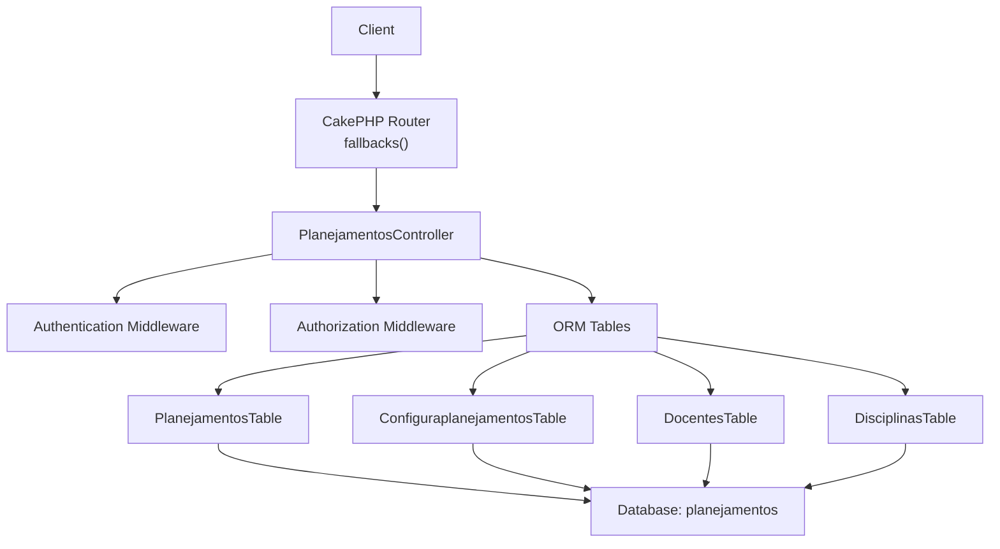
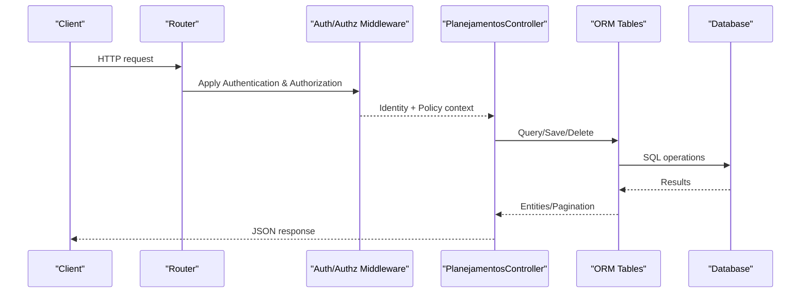
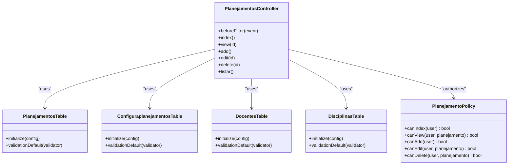

# Schedule Management API

<cite>
**Referenced Files in This Document**
- [PlanejamentosController.php](file://src/Controller/PlanejamentosController.php)
- [PlanejamentosTable.php](file://src/Model/Table/PlanejamentosTable.php)
- [Planejamento.php](file://src/Model/Entity/Planejamento.php)
- [ConfiguraplanejamentosTable.php](file://src/Model/Table/ConfiguraplanejamentosTable.php)
- [DocentesTable.php](file://src/Model/Table/DocentesTable.php)
- [DisciplinasTable.php](file://src/Model/Table/DisciplinasTable.php)
- [PlanejamentoPolicy.php](file://src/Policy/PlanejamentoPolicy.php)
- [routes.php](file://config/routes.php)
- [Application.php](file://src/Application.php)
</cite>

## Table of Contents
1. [Introduction](#introduction)
2. [Project Structure](#project-structure)
3. [Core Components](#core-components)
4. [Architecture Overview](#architecture-overview)
5. [Detailed Component Analysis](#detailed-component-analysis)
6. [Dependency Analysis](#dependency-analysis)
7. [Performance Considerations](#performance-considerations)
8. [Troubleshooting Guide](#troubleshooting-guide)
9. [Conclusion](#conclusion)

## Introduction
This document provides API documentation for the schedule management endpoints in the planejamento5 system. It covers CRUD operations for academic schedules (Planejamentos), including filtering by semester and related entities such as course, faculty member, and classroom. The endpoints are implemented using CakePHP conventions with Authentication and Authorization middleware enabled.

## Project Structure
The schedule management feature is centered around the Planejamentos controller and its associated model, entity, policy, and related tables. Routes are configured via CakePHP fallbacks, which map standard RESTful URLs to controller actions.

**Diagram sources**
- [routes.php:50-79](file://config/routes.php#L50-L79)
- [PlanejamentosController.php:1-256](file://src/Controller/PlanejamentosController.php#L1-L256)
- [PlanejamentosTable.php:1-57](file://src/Model/Table/PlanejamentosTable.php#L1-L57)
- [ConfiguraplanejamentosTable.php:1-62](file://src/Model/Table/ConfiguraplanejamentosTable.php#L1-L62)
- [DocentesTable.php:1-126](file://src/Model/Table/DocentesTable.php#L1-L126)
- [DisciplinasTable.php:1-85](file://src/Model/Table/DisciplinasTable.php#L1-L85)

**Section sources**
- [routes.php:50-79](file://config/routes.php#L50-L79)
- [Application.php:106-116](file://src/Application.php#L106-L116)

## Core Components
- Controller: PlanejamentosController implements index, view, add, edit, delete, and listar actions.
- Model: PlanejamentosTable defines relationships and validation rules.
- Entity: Planejamento defines accessible fields.
- Policy: PlanejamentoPolicy enforces authorization rules per action.
- Related Models: ConfiguraplanejamentosTable (semesters), DocentesTable (faculty), DisciplinasTable (courses).

Key responsibilities:
- Filtering schedules by semester via query parameter.
- Enforcing authentication and authorization policies.
- Validating input data and deriving derived fields (turno, periodo).
- Returning paginated results for listing.

**Section sources**
- [PlanejamentosController.php:11-15](file://src/Controller/PlanejamentosController.php#L11-L15)
- [PlanejamentosController.php:17-67](file://src/Controller/PlanejamentosController.php#L17-L67)
- [PlanejamentosController.php:83-127](file://src/Controller/PlanejamentosController.php#L83-L127)
- [PlanejamentosController.php:129-173](file://src/Controller/PlanejamentosController.php#L129-L173)
- [PlanejamentosController.php:175-187](file://src/Controller/PlanejamentosController.php#L175-L187)
- [PlanejamentosTable.php:11-40](file://src/Model/Table/PlanejamentosTable.php#L11-L40)
- [PlanejamentosTable.php:42-55](file://src/Model/Table/PlanejamentosTable.php#L42-L55)
- [Planejamento.php:13-25](file://src/Model/Entity/Planejamento.php#L13-L25)
- [PlanejamentoPolicy.php:11-44](file://src/Policy/PlanejamentoPolicy.php#L11-L44)

## Architecture Overview
The API follows a standard MVC pattern with middleware-based security. Requests are routed to controller actions, which use the ORM to interact with related tables. Authentication uses session and form authenticators; authorization uses policies mapped to controller actions.

**Diagram sources**
- [Application.php:106-116](file://src/Application.php#L106-L116)
- [Application.php:124-155](file://src/Application.php#L124-L155)
- [PlanejamentosController.php:17-67](file://src/Controller/PlanejamentosController.php#L17-L67)

## Detailed Component Analysis

### GET /planejamentos (Index with filtering)
- Method: GET
- URL: /planejamentos
- Authentication: Optional (index is unauthenticated)
- Authorization: Skipped for index
- Query Parameters:
  - semestre: Filter schedules by semester string from Configuraplanejamentos.semestre
- Response:
  - Paginated list of schedules with related entities (Disciplinas, Docentes, Configuraplanejamentos, Salas, Dias, Horarios)
  - Additional context: semestresList (unique semesters), selectedSemestre
- Validation: None on input; server filters by provided semester if present
- Business Logic:
  - Builds a query with contains for related tables
  - Applies matching filter on Configuraplanejamentos.semestre when semestre is provided
  - Returns paginated results

Example Request:
- GET /planejamentos?semestre=2025-1

Example Response (JSON):
{
  "meta": {
    "count": 12,
    "page": 1,
    "perPage": 20,
    "totalPages": 1
  },
  "data": [
    {
      "id": 1,
      "disciplina_id": 10,
      "docente_id": 5,
      "configuraplanejamento_id": 3,
      "periodo": 2,
      "turno": "diurno",
      "sala_id": 7,
      "dia_id": 2,
      "horario_id": 1,
      "observacoes": null,
      "created": "2025-01-10T08:00:00Z",
      "modified": "2025-01-10T08:00:00Z",
      "disciplina": { "id": 10, "disciplina": "Mathematics I" },
      "docente": { "id": 5, "nome": "Dr. Silva" },
      "configuraplanejamento": { "id": 3, "semestre": "2025-1" },
      "sala": { "id": 7, "sala": "Room A" },
      "dia": { "id": 2, "dia": "Monday" },
      "horario": { "id": 1, "horario": "08:00-09:40" }
    }
  ]
}

Notes:
- Sorting fields supported include id, disciplina, docente, semestre, dia, horario, sala.
- If no semestre is provided, all schedules are returned.

**Section sources**
- [PlanejamentosController.php:11-15](file://src/Controller/PlanejamentosController.php#L11-L15)
- [PlanejamentosController.php:17-67](file://src/Controller/PlanejamentosController.php#L17-L67)

### GET /planejamentos/{id} (View specific schedule)
- Method: GET
- URL: /planejamentos/{id}
- Authentication: Optional (view is unauthenticated)
- Authorization: Skipped for view
- Path Parameter:
  - id: Integer primary key of the schedule
- Response:
  - Single schedule object with related entities (Disciplinas, Docentes, Configuraplanejamentos, Salas, Dias, Horarios)
- Error Responses:
  - 404 Not Found if the schedule does not exist

Example Request:
- GET /planejamentos/1

Example Response (JSON):
{
  "id": 1,
  "disciplina_id": 10,
  "docente_id": 5,
  "configuraplanejamento_id": 3,
  "periodo": 2,
  "turno": "diurno",
  "sala_id": 7,
  "dia_id": 2,
  "horario_id": 1,
  "observacoes": null,
  "created": "2025-01-10T08:00:00Z",
  "modified": "2025-01-10T08:00:00Z",
  "disciplina": { "id": 10, "disciplina": "Mathematics I" },
  "docente": { "id": 5, "nome": "Dr. Silva" },
  "configuraplanejamento": { "id": 3, "semestre": "2025-1" },
  "sala": { "id": 7, "sala": "Room A" },
  "dia": { "id": 2, "dia": "Monday" },
  "horario": { "id": 1, "horario": "08:00-09:40" }
}

**Section sources**
- [PlanejamentosController.php:11-15](file://src/Controller/PlanejamentosController.php#L11-L15)
- [PlanejamentosController.php:69-81](file://src/Controller/PlanejamentosController.php#L69-L81)

### POST /planejamentos (Create new schedule)
- Method: POST
- URL: /planejamentos
- Authentication: Required (add requires authenticated user)
- Authorization: Requires role != null (any authenticated user can add)
- Request Body (JSON):
  - disciplina_id: integer, required
  - configuraplanejamento_id: integer, required
  - docente_id: integer, optional
  - horario_id: integer, optional (used to derive turno)
  - sala_id: integer, optional
  - dia_id: integer, optional
  - observacoes: string, optional
- Derived Fields:
  - turno: set automatically based on horario_id (1-4 => diurno; otherwise noturno)
  - periodo: set automatically based on disciplina_id (uses disciplina.periodo_diurno or disciplina.periodo_noturno)
- Validation Rules:
  - disciplina_id must be a non-empty integer
  - configuraplanejamento_id must be a non-empty integer
  - Other fields are integers or scalars and allow empty values
- Success Response:
  - 201 Created with the created schedule object
- Error Responses:
  - 400 Bad Request if validation fails
  - 401 Unauthorized if not authenticated
  - 403 Forbidden if authorization fails
  - 422 Unprocessable Entity if business logic constraints fail (e.g., missing disciplina selection)

Example Request:
POST /planejamentos
{
  "disciplina_id": 10,
  "configuraplanejamento_id": 3,
  "docente_id": 5,
  "horario_id": 1,
  "sala_id": 7,
  "dia_id": 2,
  "observacoes": "First class of the semester"
}

Example Response (JSON):
{
  "id": 1,
  "disciplina_id": 10,
  "docente_id": 5,
  "configuraplanejamento_id": 3,
  "periodo": 2,
  "turno": "diurno",
  "sala_id": 7,
  "dia_id": 2,
  "horario_id": 1,
  "observacoes": "First class of the semester",
  "created": "2025-01-10T08:00:00Z",
  "modified": "2025-01-10T08:00:00Z"
}

Business Logic Constraints:
- If disciplina_id is provided, periodo is derived from the discipline’s diurnal or nocturnal period.
- If disciplina_id is missing, creation fails with an error indicating a discipline must be selected.

**Section sources**
- [PlanejamentosController.php:83-127](file://src/Controller/PlanejamentosController.php#L83-L127)
- [PlanejamentosTable.php:42-55](file://src/Model/Table/PlanejamentosTable.php#L42-L55)
- [DisciplinasTable.php:52-59](file://src/Model/Table/DisciplinasTable.php#L52-L59)

### PUT /planejamentos/{id} (Update existing schedule)
- Method: PUT (also supports PATCH via controller handling)
- URL: /planejamentos/{id}
- Authentication: Required (edit requires authenticated user)
- Authorization: Requires role in ['admin', 'editor']
- Path Parameter:
  - id: integer primary key of the schedule
- Request Body (JSON):
  - Same fields as create; updated fields will overwrite existing values
- Derived Fields:
  - turno: set automatically based on horario_id (1-4 => diurno; otherwise noturno)
  - periodo: set automatically based on disciplina_id (uses disciplina.periodo_diurno or disciplina.periodo_noturno)
- Validation Rules:
  - Same as create
- Success Response:
  - 200 OK with the updated schedule object
- Error Responses:
  - 400 Bad Request if validation fails
  - 401 Unauthorized if not authenticated
  - 403 Forbidden if authorization fails
  - 404 Not Found if the schedule does not exist
  - 422 Unprocessable Entity if business logic constraints fail

Example Request:
PUT /planejamentos/1
{
  "docente_id": 6,
  "sala_id": 8,
  "observacoes": "Updated room and notes"
}

Example Response (JSON):
{
  "id": 1,
  "disciplina_id": 10,
  "docente_id": 6,
  "configuraplanejamento_id": 3,
  "periodo": 2,
  "turno": "diurno",
  "sala_id": 8,
  "dia_id": 2,
  "horario_id": 1,
  "observacoes": "Updated room and notes",
  "created": "2025-01-10T08:00:00Z",
  "modified": "2025-01-11T10:30:00Z"
}

**Section sources**
- [PlanejamentosController.php:129-173](file://src/Controller/PlanejamentosController.php#L129-L173)
- [PlanejamentosTable.php:42-55](file://src/Model/Table/PlanejamentosTable.php#L42-L55)
- [DisciplinasTable.php:52-59](file://src/Model/Table/DisciplinasTable.php#L52-L59)

### DELETE /planejamentos/{id} (Delete schedule)
- Method: DELETE (controller also accepts POST for compatibility)
- URL: /planejamentos/{id}
- Authentication: Required (delete requires authenticated user)
- Authorization: Requires role == 'admin'
- Path Parameter:
  - id: integer primary key of the schedule
- Success Response:
  - 204 No Content on successful deletion
- Error Responses:
  - 401 Unauthorized if not authenticated
  - 403 Forbidden if authorization fails
  - 404 Not Found if the schedule does not exist

Example Request:
DELETE /planejamentos/1

Example Response:
- 204 No Content

**Section sources**
- [PlanejamentosController.php:175-187](file://src/Controller/PlanejamentosController.php#L175-L187)

### Additional Endpoint: GET /planejamentos/listar (Grouped listing)
- Method: GET
- URL: /planejamentos/listar
- Authentication: Optional (authorization skipped)
- Response:
  - Paginated list grouped by Configuraplanejamentos.semestre (descending order)
  - Includes related entities similar to index

Use Case:
- Useful for UI views that group schedules by semester without additional filtering.

**Section sources**
- [PlanejamentosController.php:189-207](file://src/Controller/PlanejamentosController.php#L189-L207)

## Dependency Analysis
The following diagram shows how the controller depends on models and policies, and how authentication/authorization middleware integrates.

**Diagram sources**
- [PlanejamentosController.php:1-256](file://src/Controller/PlanejamentosController.php#L1-L256)
- [PlanejamentosTable.php:1-57](file://src/Model/Table/PlanejamentosTable.php#L1-L57)
- [ConfiguraplanejamentosTable.php:1-62](file://src/Model/Table/ConfiguraplanejamentosTable.php#L1-L62)
- [DocentesTable.php:1-126](file://src/Model/Table/DocentesTable.php#L1-L126)
- [DisciplinasTable.php:1-85](file://src/Model/Table/DisciplinasTable.php#L1-L85)
- [PlanejamentoPolicy.php:1-46](file://src/Policy/PlanejamentoPolicy.php#L1-L46)

**Section sources**
- [PlanejamentosController.php:1-256](file://src/Controller/PlanejamentosController.php#L1-L256)
- [PlanejamentoPolicy.php:1-46](file://src/Policy/PlanejamentoPolicy.php#L1-L46)

## Performance Considerations
- Use pagination for large datasets (already applied in index and listar).
- Minimize N+1 queries by leveraging contains in queries (implemented in index and view).
- Cache frequently accessed reference data (semestresList, disciplines, docentes) if needed.
- Avoid unnecessary deep contains for read-only endpoints unless required by clients.

[No sources needed since this section provides general guidance]

## Troubleshooting Guide
Common issues and resolutions:
- 401 Unauthorized: Ensure the client has a valid session or form login credentials. Check Application authentication configuration.
- 403 Forbidden: Verify user roles match policy requirements (e.g., admin for delete, editor/admin for edit).
- 404 Not Found: Confirm the schedule ID exists before update/delete requests.
- 400/422 Validation Errors: Validate required fields (disciplina_id, configuraplanejamento_id) and ensure referenced IDs exist.
- Derived Field Issues: Confirm horario_id maps correctly to turno and disciplina_id maps to periodo.

**Section sources**
- [Application.php:124-155](file://src/Application.php#L124-L155)
- [PlanejamentoPolicy.php:21-34](file://src/Policy/PlanejamentoPolicy.php#L21-L34)
- [PlanejamentosController.php:83-127](file://src/Controller/PlanejamentosController.php#L83-L127)
- [PlanejamentosController.php:129-173](file://src/Controller/PlanejamentosController.php#L129-L173)

## Conclusion
The schedule management API provides comprehensive CRUD operations for academic schedules with robust filtering, validation, and authorization. Clients should authenticate for write operations and adhere to the documented request/response schemas. For multi-semester scheduling integration, leverage the semestre filter and related Configuraplanejamentos data to manage schedules across different academic periods.

[No sources needed since this section summarizes without analyzing specific files]