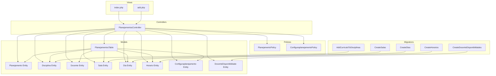
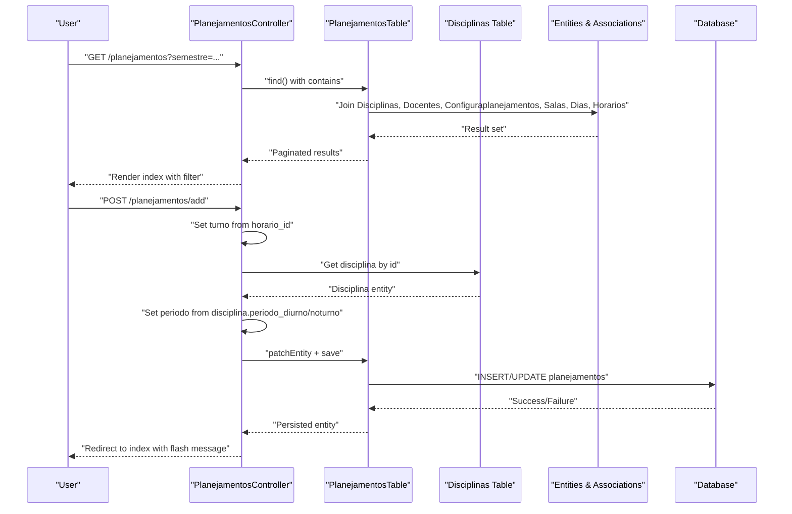
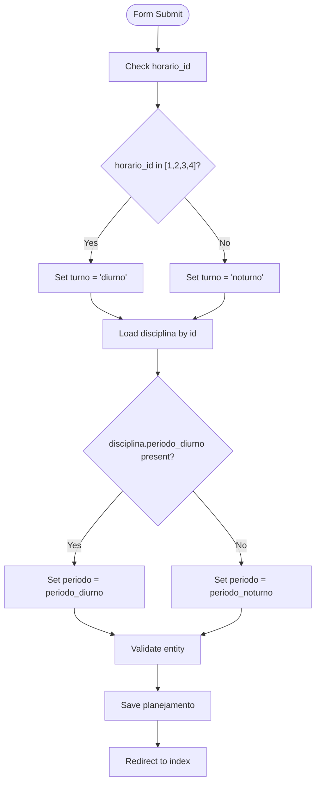
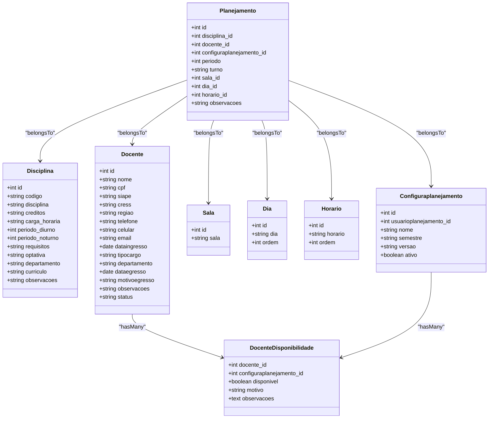
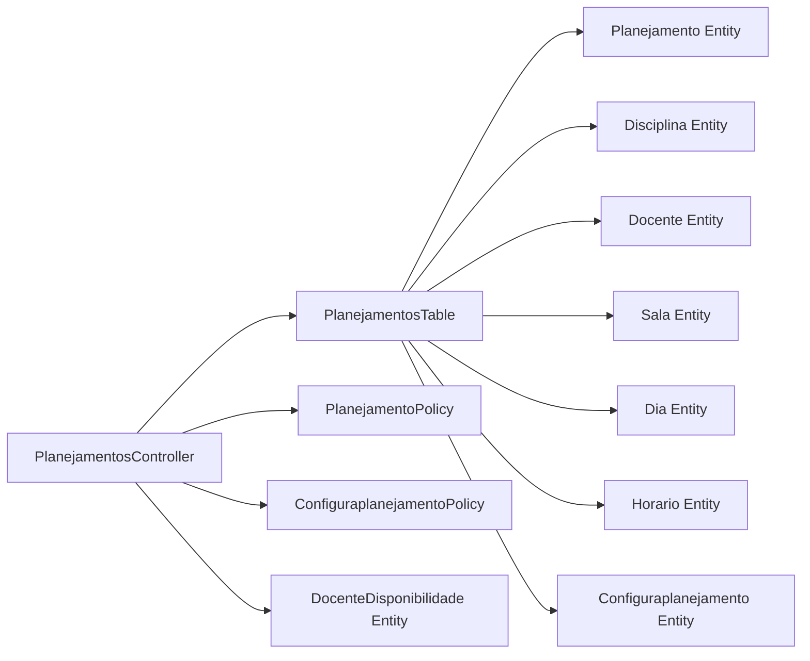

# Academic Planning Management

<cite>
**Referenced Files in This Document**
- [PlanejamentosController.php](file://src/Controller/PlanejamentosController.php)
- [PlanejamentosTable.php](file://src/Model/Table/PlanejamentosTable.php)
- [Planejamento Entity.php](file://src/Model/Entity/Planejamento.php)
- [Disciplina Entity.php](file://src/Model/Entity/Disciplina.php)
- [Docente Entity.php](file://src/Model/Entity/Docente.php)
- [Sala Entity.php](file://src/Model/Entity/Sala.php)
- [Dia Entity.php](file://src/Model/Entity/Dia.php)
- [Horario Entity.php](file://src/Model/Entity/Horario.php)
- [Configuraplanejamento Entity.php](file://src/Model/Entity/Configuraplanejamento.php)
- [DocenteDisponibilidade Entity.php](file://src/Model/Entity/DocenteDisponibilidade.php)
- [index.php (Planejamentos view)](file://templates/Planejamentos/index.php)
- [add.php (Planejamentos view)](file://templates/Planejamentos/add.php)
- [CreateDias migration](file://config/Migrations/20260612030430_CreateDias.php)
- [CreateHorarios migration](file://config/Migrations/20260612030431_CreateHorarios.php)
- [CreateSalas migration](file://config/Migrations/20260612030432_CreateSalas.php)
- [CreateDocenteDisponibilidades migration](file://config/Migrations/20260613100000_CreateDocenteDisponibilidades.php)
- [AddCurriculoToDisciplinas migration](file://config/Migrations/20260618004511_AddCurriculoToDisciplinas.php)
- [PlanejamentoPolicy.php](file://src/Policy/PlanejamentoPolicy.php)
- [ConfiguraplanejamentoPolicy.php](file://src/Policy/ConfiguraplanejamentoPolicy.php)
</cite>

## Table of Contents
1. Introduction
2. Project Structure
3. Core Components
4. Architecture Overview
5. Detailed Component Analysis
6. Dependency Analysis
7. Performance Considerations
8. Troubleshooting Guide
9. Conclusion

## Introduction
This document explains the academic planning management system focused on creating, editing, and managing academic schedules (planejamentos) with multi-semester support. It covers the scheduling workflow including course assignment to faculty members, classroom allocation, time slot management, filtering by semester, validation rules, and business logic for automatic period assignment based on discipline type and time slot selection. Practical examples are provided for schedule creation, bulk operations, and advanced search functionality. The relationships between planejamentos and related entities (disciplinas, docentes, salas, dias, horarios) are detailed.

## Project Structure
The system follows a typical CakePHP MVC structure:
- Controllers handle HTTP requests and orchestrate data flow
- Models define entities, table behaviors, and validation
- Templates render views for user interaction
- Migrations define database schema
- Policies enforce authorization rules

**Diagram sources**
- [PlanejamentosController.php](file://src/Controller/PlanejamentosController.php)
- [PlanejamentosTable.php](file://src/Model/Table/PlanejamentosTable.php)
- [Planejamento Entity.php](file://src/Model/Entity/Planejamento.php)
- [Disciplina Entity.php](file://src/Model/Entity/Disciplina.php)
- [Docente Entity.php](file://src/Model/Entity/Docente.php)
- [Sala Entity.php](file://src/Model/Entity/Sala.php)
- [Dia Entity.php](file://src/Model/Entity/Dia.php)
- [Horario Entity.php](file://src/Model/Entity/Horario.php)
- [Configuraplanejamento Entity.php](file://src/Model/Entity/Configuraplanejamento.php)
- [DocenteDisponibilidade Entity.php](file://src/Model/Entity/DocenteDisponibilidade.php)
- [index.php (Planejamentos view)](file://templates/Planejamentos/index.php)
- [add.php (Planejamentos view)](file://templates/Planejamentos/add.php)
- [CreateDias migration](file://config/Migrations/20260612030430_CreateDias.php)
- [CreateHorarios migration](file://config/Migrations/20260612030431_CreateHorarios.php)
- [CreateSalas migration](file://config/Migrations/20260612030432_CreateSalas.php)
- [CreateDocenteDisponibilidades migration](file://config/Migrations/20260613100000_CreateDocenteDisponibilidades.php)
- [AddCurriculoToDisciplinas migration](file://config/Migrations/20260618004511_AddCurriculoToDisciplinas.php)
- [PlanejamentoPolicy.php](file://src/Policy/PlanejamentoPolicy.php)
- [ConfiguraplanejamentoPolicy.php](file://src/Policy/ConfiguraplanejamentoPolicy.php)

**Section sources**
- [PlanejamentosController.php](file://src/Controller/PlanejamentosController.php)
- [PlanejamentosTable.php](file://src/Model/Table/PlanejamentosTable.php)
- [index.php (Planejamentos view)](file://templates/Planejamentos/index.php)
- [add.php (Planejamentos view)](file://templates/Planejamentos/add.php)

## Core Components
- Planejamento entity represents an academic schedule entry linking a discipline to a teacher, room, day, time slot, and semester configuration.
- PlanejamentosTable defines associations and validation rules for the schedule entries.
- PlanejamentosController implements CRUD operations, filtering by semester, automatic turno and periodo assignment, and related data population.
- Views provide UI for listing, adding, and editing schedules with semester filtering and form controls.
- Policies control access to create, edit, delete, and manage versions or clones.

Key responsibilities:
- Multi-semester support via Configuraplanejamento (semestre).
- Automatic assignment of turno (day/night shift) based on horario_id.
- Automatic assignment of periodo (period number) based on disciplina’s configured periods.
- Filtering by semestre in index listing.
- Optional docente availability filtering per semestre.

**Section sources**
- [Planejamento Entity.php](file://src/Model/Entity/Planejamento.php)
- [PlanejamentosTable.php](file://src/Model/Table/PlanejamentosTable.php)
- [PlanejamentosController.php](file://src/Controller/PlanejamentosController.php)
- [index.php (Planejamentos view)](file://templates/Planejamentos/index.php)
- [add.php (Planejamentos view)](file://templates/Planejamentos/add.php)
- [PlanejamentoPolicy.php](file://src/Policy/PlanejamentoPolicy.php)
- [ConfiguraplanejamentoPolicy.php](file://src/Policy/ConfiguraplanejamentoPolicy.php)

## Architecture Overview
The scheduling workflow is centered around the controller handling user actions, applying business rules, validating inputs, and persisting changes through the ORM.

**Diagram sources**
- [PlanejamentosController.php](file://src/Controller/PlanejamentosController.php)
- [PlanejamentosTable.php](file://src/Model/Table/PlanejamentosTable.php)
- [Disciplina Entity.php](file://src/Model/Entity/Disciplina.php)

## Detailed Component Analysis

### Scheduling Workflow and Business Logic
- Turno assignment: Based on horario_id values, the controller sets turno to diurno or noturno.
- Periodo assignment: Based on selected disciplina, the controller chooses periodo_diurno if available; otherwise, it uses periodo_noturno.
- Docente filtering: When a configuraplanejamento_id is selected, only docentes marked as available for that configuration are shown.
- Semestre filtering: Index supports filtering by semestre via query parameter.

**Diagram sources**
- [PlanejamentosController.php](file://src/Controller/PlanejamentosController.php)
- [Disciplina Entity.php](file://src/Model/Entity/Disciplina.php)

**Section sources**
- [PlanejamentosController.php](file://src/Controller/PlanejamentosController.php)
- [Disciplina Entity.php](file://src/Model/Entity/Disciplina.php)

### Data Model and Relationships
The core model centers on Planejamento with strong associations to related entities.

**Diagram sources**
- [Planejamento Entity.php](file://src/Model/Entity/Planejamento.php)
- [Disciplina Entity.php](file://src/Model/Entity/Disciplina.php)
- [Docente Entity.php](file://src/Model/Entity/Docente.php)
- [Sala Entity.php](file://src/Model/Entity/Sala.php)
- [Dia Entity.php](file://src/Model/Entity/Dia.php)
- [Horario Entity.php](file://src/Model/Entity/Horario.php)
- [Configuraplanejamento Entity.php](file://src/Model/Entity/Configuraplanejamento.php)
- [DocenteDisponibilidade Entity.php](file://src/Model/Entity/DocenteDisponibilidade.php)
- [PlanejamentosTable.php](file://src/Model/Table/PlanejamentosTable.php)

**Section sources**
- [PlanejamentosTable.php](file://src/Model/Table/PlanejamentosTable.php)
- [Planejamento Entity.php](file://src/Model/Entity/Planejamento.php)
- [Disciplina Entity.php](file://src/Model/Entity/Disciplina.php)
- [Docente Entity.php](file://src/Model/Entity/Docente.php)
- [Sala Entity.php](file://src/Model/Entity/Sala.php)
- [Dia Entity.php](file://src/Model/Entity/Dia.php)
- [Horario Entity.php](file://src/Model/Entity/Horario.php)
- [Configuraplanejamento Entity.php](file://src/Model/Entity/Configuraplanejamento.php)
- [DocenteDisponibilidade Entity.php](file://src/Model/Entity/DocenteDisponibilidade.php)

### Validation Rules
- Required fields: disciplina_id, configuraplanejamento_id
- Optional fields: docente_id, periodo, turno, sala_id, dia_id, horario_id, observacoes
- Type constraints enforced via integer/scalar checks

These rules ensure basic integrity before persistence.

**Section sources**
- [PlanejamentosTable.php](file://src/Model/Table/PlanejamentosTable.php)

### Filtering and Search
- Semester filtering: The index action reads the semestre query parameter and applies a matching condition against Configuraplanejamentos.semestre.
- Sorting: Configurable sortable fields include ID, discipline name, teacher name, semester, day, time slot, and room.
- List view: Displays all relevant fields and provides actions to view, edit, and delete.

Practical example:
- To list schedules for a specific semester, append ?semestre=<value> to the URL. The view also includes a dropdown to select a semester and auto-submit.

**Section sources**
- [PlanejamentosController.php](file://src/Controller/PlanejamentosController.php)
- [index.php (Planejamentos view)](file://templates/Planejamentos/index.php)

### Conflict Detection
- No explicit conflict detection logic is implemented in the analyzed files.
- Recommendations:
  - Add uniqueness constraints at the database level to prevent duplicate assignments (e.g., same sala/dia/horario for multiple planejamentos).
  - Implement server-side validation to detect overlaps for docentes and salas within the same semestre.
  - Provide user feedback when conflicts are detected during add/edit.

[No sources needed since this section proposes enhancements without analyzing specific files]

### Authorization and Roles
- Index and view are publicly accessible (authorization skipped).
- Add requires authenticated users.
- Edit requires admin or editor roles.
- Delete requires admin role.
- Clone and version creation are restricted to admin/editor roles.

**Section sources**
- [PlanejamentoPolicy.php](file://src/Policy/PlanejamentoPolicy.php)
- [ConfiguraplanejamentoPolicy.php](file://src/Policy/ConfiguraplanejamentoPolicy.php)
- [PlanejamentosController.php](file://src/Controller/PlanejamentosController.php)

### Database Schema Foundations
- Days (dias): day label and order.
- Time slots (horarios): time label and order.
- Rooms (salas): room label.
- Teacher availability (docente_disponibilidades): links docentes to configurations with availability flags and reasons.
- Discipline curriculum field added via migration.

**Section sources**
- [CreateDias migration](file://config/Migrations/20260612030430_CreateDias.php)
- [CreateHorarios migration](file://config/Migrations/20260612030431_CreateHorarios.php)
- [CreateSalas migration](file://config/Migrations/20260612030432_CreateSalas.php)
- [CreateDocenteDisponibilidades migration](file://config/Migrations/20260613100000_CreateDocenteDisponibilidades.php)
- [AddCurriculoToDisciplinas migration](file://config/Migrations/20260618004511_AddCurriculoToDisciplinas.php)

## Dependency Analysis
The controller depends on multiple tables/entities and orchestrates data loading and business logic. The table layer defines associations and validation. Policies gate access.

**Diagram sources**
- [PlanejamentosController.php](file://src/Controller/PlanejamentosController.php)
- [PlanejamentosTable.php](file://src/Model/Table/PlanejamentosTable.php)
- [Planejamento Policy.php](file://src/Policy/PlanejamentoPolicy.php)
- [Configuraplanejamento Policy.php](file://src/Policy/ConfiguraplanejamentoPolicy.php)

**Section sources**
- [PlanejamentosController.php](file://src/Controller/PlanejamentosController.php)
- [PlanejamentosTable.php](file://src/Model/Table/PlanejamentosTable.php)
- [PlanejamentoPolicy.php](file://src/Policy/PlanejamentoPolicy.php)
- [ConfiguraplanejamentoPolicy.php](file://src/Policy/ConfiguraplanejamentoPolicy.php)

## Performance Considerations
- Use pagination for large lists to reduce memory usage and improve response times.
- Limit result sets for dropdowns (e.g., limit 200 for disciplines and docentes) to avoid heavy forms.
- Prefer contain joins to fetch only necessary related data.
- Consider caching frequently accessed reference data (dias, horarios, salas) if they change infrequently.
- Avoid N+1 queries by using appropriate contains and indexes on foreign keys.

[No sources needed since this section provides general guidance]

## Troubleshooting Guide
Common issues and resolutions:
- Missing disciplina selection: The controller enforces disciplina selection and redirects with an error message if none is provided.
- Incorrect turno assignment: Ensure horario_id values align with expected ranges; verify mapping logic in the controller.
- Incorrect periodo assignment: Confirm disciplina has valid periodo_diurno or periodo_noturno values.
- Docente availability filtering: If no docentes appear, check DocenteDisponibilidades for the selected configuraplanejamento_id and ensure status is active.
- Permission errors: Verify user roles match policy requirements for add/edit/delete operations.

Operational tips:
- Use the semester filter to narrow down results quickly.
- Clear filters by removing the query parameter or using the clear link in the view.
- For bulk operations, consider implementing batch endpoints or CLI commands to update multiple planejamentos efficiently.

**Section sources**
- [PlanejamentosController.php](file://src/Controller/PlanejamentosController.php)
- [index.php (Planejamentos view)](file://templates/Planejamentos/index.php)
- [PlanejamentoPolicy.php](file://src/Policy/PlanejamentoPolicy.php)

## Conclusion
The academic planning management system provides robust tools for creating and managing academic schedules across multiple semesters. It automates key aspects like turno and periodo assignment, supports semester-based filtering, and enforces basic validation and authorization. While conflict detection is not currently implemented, the architecture allows straightforward extension to include overlap checks for docentes and salas. With careful attention to performance and usability, the system can scale to handle complex scheduling scenarios.

[No sources needed since this section summarizes without analyzing specific files]