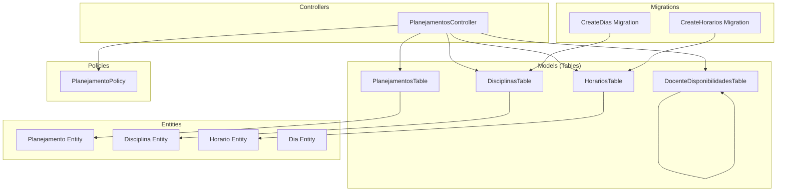
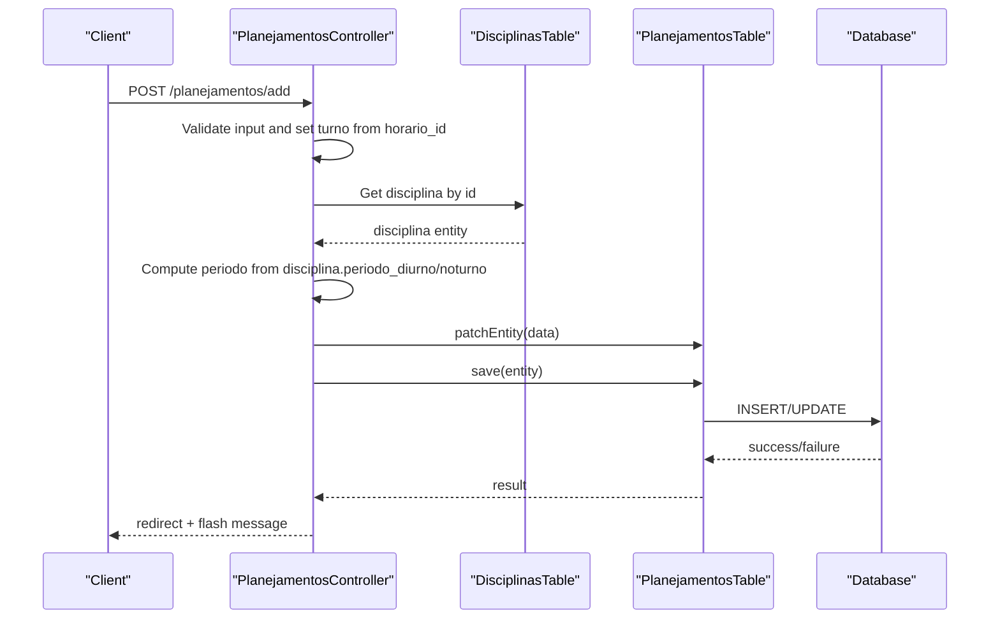
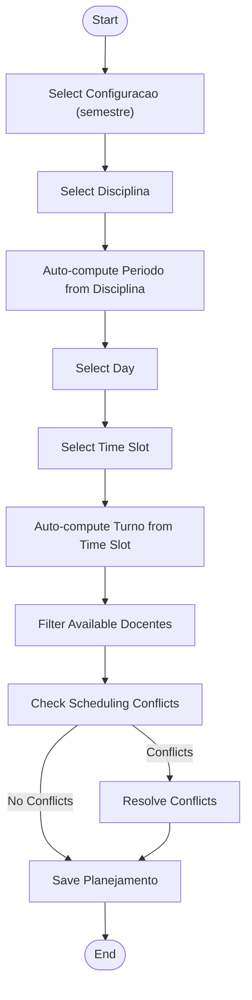
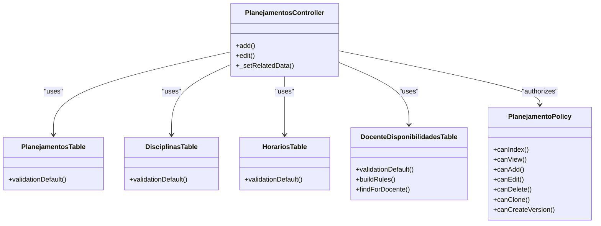

# Business Logic and Validation Rules

<cite>
**Referenced Files in This Document**
- [PlanejamentosController.php](file://src/Controller/PlanejamentosController.php)
- [PlanejamentosTable.php](file://src/Model/Table/PlanejamentosTable.php)
- [DisciplinasTable.php](file://src/Model/Table/DisciplinasTable.php)
- [HorariosTable.php](file://src/Model/Table/HorariosTable.php)
- [DocenteDisponibilidadesTable.php](file://src/Model/Table/DocenteDisponibilidadesTable.php)
- [PlanejamentoPolicy.php](file://src/Policy/PlanejamentoPolicy.php)
- [Planejamento.php](file://src/Model/Entity/Planejamento.php)
- [Disciplina.php](file://src/Model/Entity/Disciplina.php)
- [Horario.php](file://src/Model/Entity/Horario.php)
- [Dia.php](file://src/Model/Entity/Dia.php)
- [20260612030431_CreateHorarios.php](file://config/Migrations/20260612030431_CreateHorarios.php)
- [20260612030430_CreateDias.php](file://config/Migrations/20260612030430_CreateDias.php)
</cite>

## Table of Contents
1. Introduction
2. Project Structure
3. Core Components
4. Architecture Overview
5. Detailed Component Analysis
6. Dependency Analysis
7. Performance Considerations
8. Troubleshooting Guide
9. Conclusion

## Introduction
This document explains the business logic and validation rules for the academic planning system with a focus on:
- Automatic assignment of the turno field based on horario_id ranges
- Period calculation from discipline properties
- Faculty availability filtering
- Validation rules, custom validations, and constraint enforcement
- Authorization policies and permission-based operations
- Complex validation scenarios, error messages, and rule override mechanisms
- Data consistency checks, conflict detection, and business rule exceptions

The goal is to provide both technical depth and accessible explanations for developers and stakeholders.

## Project Structure
The relevant business logic spans controllers, model tables, entities, policies, and migrations:
- Controllers orchestrate request handling, apply business rules, and coordinate persistence
- Tables define validation rules, relationships, and query helpers
- Entities expose mass-assignment access controls
- Policies enforce authorization per action
- Migrations define schema structure used by the application

**Diagram sources**
- [PlanejamentosController.php](file://src/Controller/PlanejamentosController.php)
- [PlanejamentosTable.php](file://src/Model/Table/PlanejamentosTable.php)
- [DisciplinasTable.php](file://src/Model/Table/DisciplinasTable.php)
- [HorariosTable.php](file://src/Model/Table/HorariosTable.php)
- [DocenteDisponibilidadesTable.php](file://src/Model/Table/DocenteDisponibilidadesTable.php)
- [PlanejamentoPolicy.php](file://src/Policy/PlanejamentoPolicy.php)
- [Planejamento.php](file://src/Model/Entity/Planejamento.php)
- [Disciplina.php](file://src/Model/Entity/Disciplina.php)
- [Horario.php](file://src/Model/Entity/Horario.php)
- [Dia.php](file://src/Model/Entity/Dia.php)
- [20260612030431_CreateHorarios.php](file://config/Migrations/20260612030431_CreateHorarios.php)
- [20260612030430_CreateDias.php](file://config/Migrations/20260612030430_CreateDias.php)

**Section sources**
- [PlanejamentosController.php](file://src/Controller/PlanejamentosController.php)
- [PlanejamentosTable.php](file://src/Model/Table/PlanejamentosTable.php)
- [DisciplinasTable.php](file://src/Model/Table/DisciplinasTable.php)
- [HorariosTable.php](file://src/Model/Table/HorariosTable.php)
- [DocenteDisponibilidadesTable.php](file://src/Model/Table/DocenteDisponibilidadesTable.php)
- [PlanejamentoPolicy.php](file://src/Policy/PlanejamentoPolicy.php)
- [Planejamento.php](file://src/Model/Entity/Planejamento.php)
- [Disciplina.php](file://src/Model/Entity/Disciplina.php)
- [Horario.php](file://src/Model/Entity/Horario.php)
- [Dia.php](file://src/Model/Entity/Dia.php)
- [20260612030431_CreateHorarios.php](file://config/Migrations/20260612030431_CreateHorarios.php)
- [20260612030430_CreateDias.php](file://config/Migrations/20260612030430_CreateDias.php)

## Core Components
- Planejamento entity defines accessible fields including disciplina_id, docente_id, configuraplanejamento_id, periodo, turno, sala_id, dia_id, and horario_id.
- Disciplinas table validates period fields periodo_diurno and periodo_noturno as integers within allowed lists.
- Horarios table validates horario and ordem presence and types.
- DocenteDisponibilidades table enforces existence constraints and provides a finder helper for filtering by docente_id.
- Planejamentos controller implements automatic assignment of turno and periodo, and filters docentes by availability.

Key responsibilities:
- Automatic turno assignment based on horario_id ranges
- Period selection based on disciplina properties
- Availability filtering for docentes
- Basic validation via Table validators
- Authorization via Policy

**Section sources**
- [Planejamento.php](file://src/Model/Entity/Planejamento.php)
- [DisciplinasTable.php](file://src/Model/Table/DisciplinasTable.php)
- [HorariosTable.php](file://src/Model/Table/HorariosTable.php)
- [DocenteDisponibilidadesTable.php](file://src/Model/Table/DocenteDisponibilidadesTable.php)
- [PlanejamentosController.php](file://src/Controller/PlanejamentosController.php)

## Architecture Overview
The core flow for creating or editing a planejamento involves:
- Controller receives POST/PATCH data
- Applies business rules to compute turno and periodo
- Patches entity and persists
- Uses related data helpers to populate dropdowns and filter available docentes

**Diagram sources**
- [PlanejamentosController.php](file://src/Controller/PlanejamentosController.php)
- [DisciplinasTable.php](file://src/Model/Table/DisciplinasTable.php)
- [PlanejamentosTable.php](file://src/Model/Table/PlanejamentosTable.php)

## Detailed Component Analysis

### Automatic Assignment of Turno Based on Horario_id Ranges
Business rule:
- If horario_id is in {1, 2, 3, 4}, then turno = diurno
- Otherwise, turno = noturno

Implementation location:
- add() method applies this rule before saving
- edit() method applies the same rule before saving

Complex scenario considerations:
- Ensure horario_id exists and is valid
- Guard against missing or null horario_id
- Provide user feedback if required fields are missing

Customization points:
- The range mapping can be centralized in a helper or behavior for reuse across add/edit flows
- Error messages should be localized and clear

**Section sources**
- [PlanejamentosController.php](file://src/Controller/PlanejamentosController.php)

### Period Calculation From Discipline Properties
Business rule:
- If disciplina has periodo_diurno set, use it; otherwise, fallback to periodo_noturno
- Convert to integer for storage

Implementation location:
- add() and edit() methods fetch disciplina by id and compute periodo accordingly

Edge cases:
- disciplina_id missing: show error and redirect
- Both periodo_diurno and periodo_noturno empty: consider defaulting or prompting user

Validation alignment:
- DisciplinasTable ensures periodo_diurno and periodo_noturno are integers within allowed lists

**Section sources**
- [PlanejamentosController.php](file://src/Controller/PlanejamentosController.php)
- [DisciplinasTable.php](file://src/Model/Table/DisciplinasTable.php)

### Faculty Availability Filtering
Business rule:
- When a configuraplanejamento_id is provided, only docentes marked as available for that configuration are shown
- Active status filtering is also applied

Implementation location:
- _setRelatedData() builds docentes list using matching on DocenteDisponibilidades.disponivel = true
- Current docente is preserved even if filtered out

Complex scenario considerations:
- Handle cases where no docentes are available
- Maintain current selection when editing to avoid confusion

**Section sources**
- [PlanejamentosController.php](file://src/Controller/PlanejamentosController.php)
- [DocenteDisponibilidadesTable.php](file://src/Model/Table/DocenteDisponibilidadesTable.php)

### Validation Rules and Constraint Enforcement
Field-level validations:
- DisciplinasTable:
  - codigo: scalar, max length, required on create, not empty
  - disciplina: scalar, max length, required on create, not empty
  - creditos: integer, allow empty
  - carga_horaria: scalar, allow empty
  - periodo_diurno: integer, in allowed list, allow empty
  - periodo_noturno: integer, in allowed list, allow empty
  - requisitos: scalar, allow empty
  - optativa: boolean, allow empty
  - departamento: scalar, allow empty on create
  - curriculo: scalar, max length, allow empty
  - observacoes: scalar, allow empty on create
- HorariosTable:
  - horario: scalar, max length, required on create, not empty
  - ordem: integer, required on create, not empty
- DocenteDisponibilidadesTable:
  - docente_id: integer, not empty
  - configuraplanejamento_id: integer, not empty
  - disponivel: boolean, not empty
  - motivo: scalar, max length, allow empty
  - observacoes: scalar, allow empty
  - Existence rules enforced via buildRules for foreign keys
- PlanejamentosTable:
  - disciplina_id: integer, not empty
  - docente_id: integer, allow empty
  - configuraplanejamento_id: integer, not empty
  - periodo: integer, allow empty
  - turno: scalar, allow empty
  - sala_id: integer, allow empty
  - dia_id: integer, allow empty
  - horario_id: integer, allow empty
  - observacoes: scalar, allow empty

Custom validation opportunities:
- Cross-field validation for periodo vs turno consistency
- Conflict detection for scheduling overlaps (e.g., same docente, day, time slot)
- Business rule overrides via behaviors or service layer

Error messages:
- Use localized messages for validation failures
- Provide actionable guidance (e.g., select a disciplina)

**Section sources**
- [DisciplinasTable.php](file://src/Model/Table/DisciplinasTable.php)
- [HorariosTable.php](file://src/Model/Table/HorariosTable.php)
- [DocenteDisponibilidadesTable.php](file://src/Model/Table/DocenteDisponibilidadesTable.php)
- [PlanejamentosTable.php](file://src/Model/Table/PlanejamentosTable.php)

### Authorization Policies and Access Control
Authorization rules:
- Index and View: open access (skip authorization in controller)
- Add: requires authenticated user
- Edit: requires role admin or editor
- Delete: requires role admin
- Clone: requires role admin
- CreateVersion: requires role admin or editor

Policy implementation:
- PlanejamentoPolicy defines canIndex, canView, canAdd, canEdit, canDelete, canClone, canCreateVersion

Access control notes:
- Some actions skip authorization explicitly in controller; ensure this aligns with security requirements
- Role-based checks rely on user->role attribute

**Section sources**
- [PlanejamentoPolicy.php](file://src/Policy/PlanejamentoPolicy.php)
- [PlanejamentosController.php](file://src/Controller/PlanejamentosController.php)

### Data Consistency Checks and Conflict Detection
Current state:
- No explicit conflict detection implemented in the analyzed files
- Foreign key existence rules exist for DocenteDisponibilidadesTable

Recommended enhancements:
- Implement uniqueness constraints at the database level for overlapping schedules (docente_id, dia_id, horario_id)
- Add validation rules to detect conflicts before save
- Introduce a service or behavior to encapsulate conflict detection logic

Conflict detection algorithm outline:
- For a given docente_id, dia_id, and horario_id, check existing planejamentos
- If any overlap exists, return error with details
- Allow exceptions for specific roles or configurations if needed

**Section sources**
- [DocenteDisponibilidadesTable.php](file://src/Model/Table/DocenteDisponibilidadesTable.php)

### Custom Error Messages and Rule Override Mechanisms
Guidance:
- Centralize error messages in localization files
- Use validator->addError() for custom messages tied to specific fields
- Consider adding a Behavior to PlanejamentosTable to centralize cross-field validations and override defaults

Override patterns:
- Extend validationDefault() to add conditional rules
- Use RulesChecker for complex cross-entity constraints
- Introduce a service layer to encapsulate business rule overrides and logging

**Section sources**
- [PlanejamentosTable.php](file://src/Model/Table/PlanejamentosTable.php)
- [DocenteDisponibilidadesTable.php](file://src/Model/Table/DocenteDisponibilidadesTable.php)

### Conceptual Overview
Conceptual workflow for scheduling a new class session:

[No sources needed since this diagram shows conceptual workflow, not actual code structure]

## Dependency Analysis
Relationships among components:
- Controller depends on multiple Tables for data operations
- Tables define relationships and validation rules
- Policies enforce authorization for controller actions
- Migrations define schema used by Tables

**Diagram sources**
- [PlanejamentosController.php](file://src/Controller/PlanejamentosController.php)
- [PlanejamentosTable.php](file://src/Model/Table/PlanejamentosTable.php)
- [DisciplinasTable.php](file://src/Model/Table/DisciplinasTable.php)
- [HorariosTable.php](file://src/Model/Table/HorariosTable.php)
- [DocenteDisponibilidadesTable.php](file://src/Model/Table/DocenteDisponibilidadesTable.php)
- [PlanejamentoPolicy.php](file://src/Policy/PlanejamentoPolicy.php)

**Section sources**
- [PlanejamentosController.php](file://src/Controller/PlanejamentosController.php)
- [PlanejamentosTable.php](file://src/Model/Table/PlanejamentosTable.php)
- [DisciplinasTable.php](file://src/Model/Table/DisciplinasTable.php)
- [HorariosTable.php](file://src/Model/Table/HorariosTable.php)
- [DocenteDisponibilidadesTable.php](file://src/Model/Table/DocenteDisponibilidadesTable.php)
- [PlanejamentoPolicy.php](file://src/Policy/PlanejamentoPolicy.php)

## Performance Considerations
- Avoid N+1 queries by using contain() appropriately in index and view actions
- Limit list sizes for dropdowns (already limited to 200 in some places)
- Cache frequently accessed reference data (dias, horarios, salas) if appropriate
- Use indexes on foreign keys and frequently filtered columns (e.g., configuraplanejamento_id, disponivel)

[No sources needed since this section provides general guidance]

## Troubleshooting Guide
Common issues and resolutions:
- Missing disciplina_id during add/edit:
  - Symptom: Flash error prompting to select a disciplina
  - Resolution: Ensure disciplina selection is mandatory before submission
- Invalid horario_id:
  - Symptom: turno may be assigned incorrectly
  - Resolution: Validate horario_id exists and belongs to expected ranges
- No available docentes:
  - Symptom: Dropdown empty after selecting configuracao
  - Resolution: Verify DocenteDisponibilidades entries and disponivel flag
- Authorization errors:
  - Symptom: Unauthorized access to edit/delete
  - Resolution: Confirm user role matches policy requirements

**Section sources**
- [PlanejamentosController.php](file://src/Controller/PlanejamentosController.php)
- [PlanejamentoPolicy.php](file://src/Policy/PlanejamentoPolicy.php)

## Conclusion
The academic planning system implements core business logic primarily in the controller and table layers:
- Automatic turno assignment based on horario_id ranges
- Period calculation derived from disciplina properties
- Faculty availability filtering based on configuracao and disponivel flags
- Validation rules defined in tables with basic constraint enforcement
- Authorization policies controlling access per action

To enhance robustness:
- Centralize business rules in behaviors or services
- Implement comprehensive conflict detection and uniqueness constraints
- Standardize error messages and provide clearer user guidance
- Review authorization skips and align with security requirements

[No sources needed since this section summarizes without analyzing specific files]