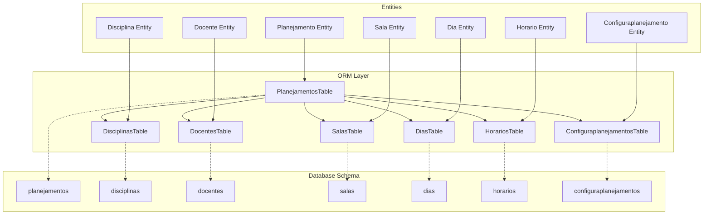
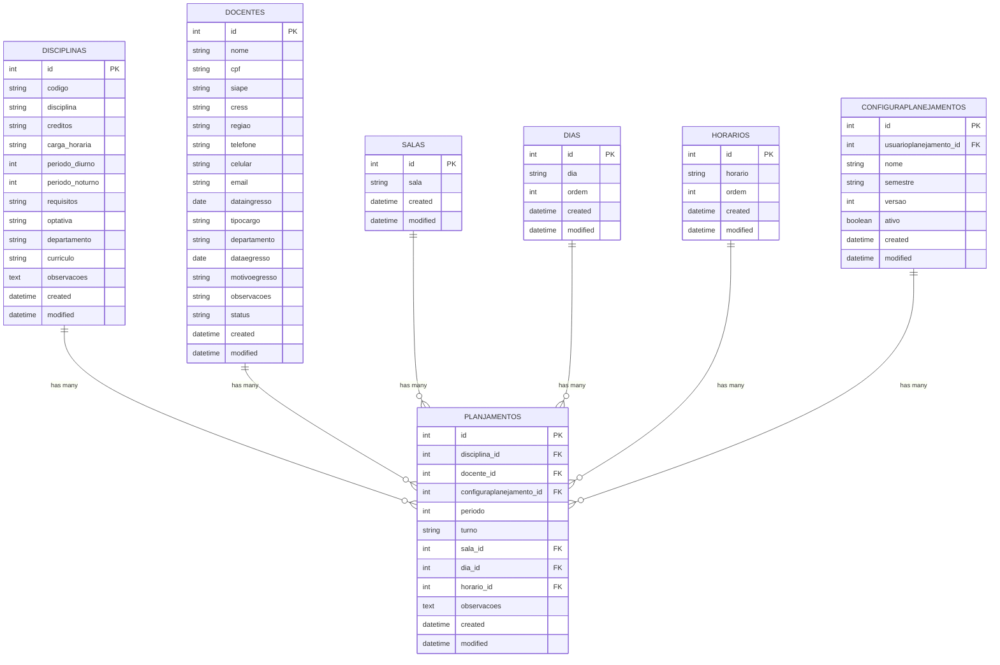
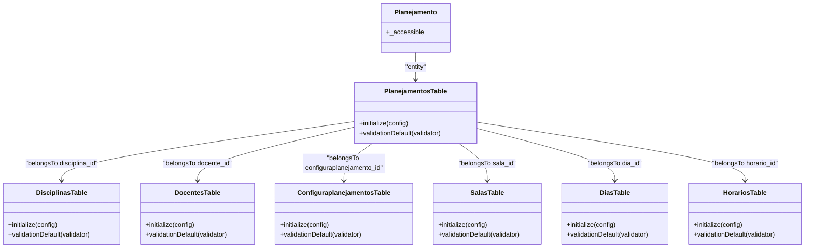
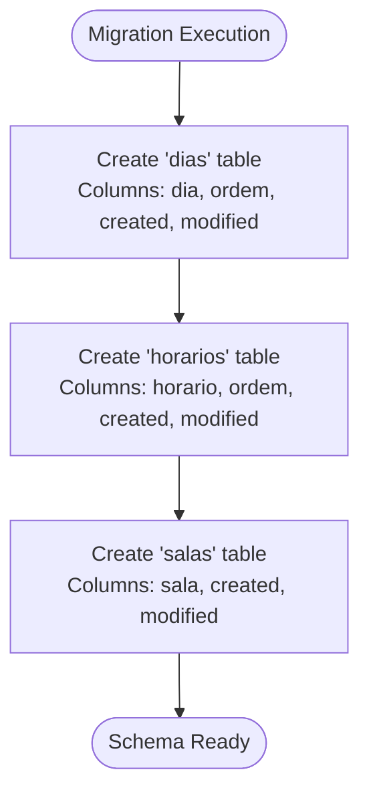
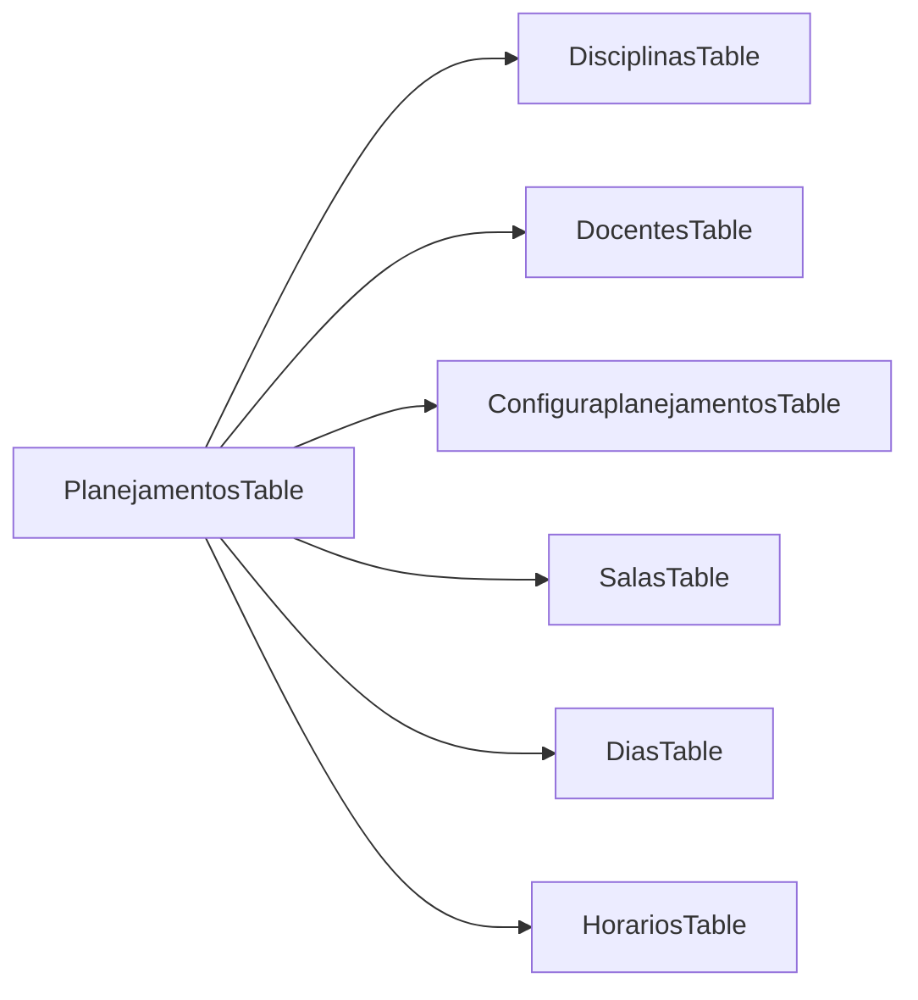

# Data Relationships and Entity Mapping

<cite>
**Referenced Files in This Document**
- [PlanejamentosTable.php](file://src/Model/Table/PlanejamentosTable.php)
- [Planejamento.php](file://src/Model/Entity/Planejamento.php)
- [DisciplinasTable.php](file://src/Model/Table/DisciplinasTable.php)
- [DocentesTable.php](file://src/Model/Table/DocentesTable.php)
- [SalasTable.php](file://src/Model/Table/SalasTable.php)
- [DiasTable.php](file://src/Model/Table/DiasTable.php)
- [HorariosTable.php](file://src/Model/Table/HorariosTable.php)
- [ConfiguraplanejamentosTable.php](file://src/Model/Table/ConfiguraplanejamentosTable.php)
- [20260612030430_CreateDias.php](file://config/Migrations/20260612030430_CreateDias.php)
- [20260612030431_CreateHorarios.php](file://config/Migrations/20260612030431_CreateHorarios.php)
- [20260612030432_CreateSalas.php](file://config/Migrations/20260612030432_CreateSalas.php)
</cite>

## Table of Contents
1. [Introduction](#introduction)
2. [Project Structure](#project-structure)
3. [Core Components](#core-components)
4. [Architecture Overview](#architecture-overview)
5. [Detailed Component Analysis](#detailed-component-analysis)
6. [Dependency Analysis](#dependency-analysis)
7. [Performance Considerations](#performance-considerations)
8. [Troubleshooting Guide](#troubleshooting-guide)
9. [Conclusion](#conclusion)

## Introduction
This document explains the data relationships and entity mapping for the academic planning system with a focus on the Planejamento entity and its associations to Disciplinas, Docentes, Salas, Dias, Horarios, and Configuraplanejamentos. It covers CakePHP ORM association types (belongsTo/hasMany), foreign key constraints, validation rules, referential integrity, migration structure, and practical guidance for querying related data and eager loading strategies.

## Project Structure
The application follows CakePHP conventions:
- Entities define accessible fields and metadata.
- Tables declare associations, behaviors, and validation rules.
- Migrations define database schema and column constraints.

**Diagram sources**
- [PlanejamentosTable.php:11-40](file://src/Model/Table/PlanejamentosTable.php#L11-L40)
- [DisciplinasTable.php:15-27](file://src/Model/Table/DisciplinasTable.php#L15-L27)
- [DocentesTable.php:26-42](file://src/Model/Table/DocentesTable.php#L26-L42)
- [SalasTable.php:33-41](file://src/Model/Table/SalasTable.php#L33-L41)
- [DiasTable.php:33-41](file://src/Model/Table/DiasTable.php#L33-L41)
- [HorariosTable.php:33-41](file://src/Model/Table/HorariosTable.php#L33-L41)
- [ConfiguraplanejamentosTable.php:11-31](file://src/Model/Table/ConfiguraplanejamentosTable.php#L11-L31)

**Section sources**
- [PlanejamentosTable.php:11-40](file://src/Model/Table/PlanejamentosTable.php#L11-L40)
- [DisciplinasTable.php:15-27](file://src/Model/Table/DisciplinasTable.php#L15-L27)
- [DocentesTable.php:26-42](file://src/Model/Table/DocentesTable.php#L26-L42)
- [SalasTable.php:33-41](file://src/Model/Table/SalasTable.php#L33-L41)
- [DiasTable.php:33-41](file://src/Model/Table/DiasTable.php#L33-L41)
- [HorariosTable.php:33-41](file://src/Model/Table/HorariosTable.php#L33-L41)
- [ConfiguraplanejamentosTable.php:11-31](file://src/Model/Table/ConfiguraplanejamentosTable.php#L11-L31)

## Core Components
- Planejamento is the central scheduling record linking course offerings to instructors, rooms, days, time slots, and planning configurations.
- Referenced entities provide master/reference data:
  - Disciplinas: courses offered.
  - Docentes: faculty members.
  - Salas: classrooms.
  - Dias: weekdays or calendar days.
  - Horarios: time slots.
  - Configuraplanejamentos: planning sessions/semesters.

Key association definitions:
- Planejamento belongsTo Disciplinas via disciplina_id (INNER join).
- Planejamento belongsTo Docentes via docente_id (INNER join).
- Planejamento belongsTo Configuraplanejamentos via configuraplanejamento_id (INNER join).
- Planejamento optionally belongsTo Salas via sala_id.
- Planejamento optionally belongsTo Dias via dia_id.
- Planejamento optionally belongsTo Horarios via horario_id.

Validation highlights:
- disciplina_id and configuraplanejamento_id are required integers.
- Other foreign keys (docente_id, sala_id, dia_id, horario_id) are optional integers.
- Additional fields like periodo, turno, observacoes are scalar and allow empty values.

**Section sources**
- [PlanejamentosTable.php:11-55](file://src/Model/Table/PlanejamentosTable.php#L11-L55)
- [Planejamento.php:13-25](file://src/Model/Entity/Planejamento.php#L13-L25)

## Architecture Overview
The ORM layer defines relationships between tables using belongsTo and hasMany. The database schema enforces column presence and types through migrations. While explicit foreign key constraints are not declared in the provided migrations, referential integrity is primarily enforced by application-level validation and required joins.

**Diagram sources**
- [PlanejamentosTable.php:11-40](file://src/Model/Table/PlanejamentosTable.php#L11-L40)
- [DisciplinasTable.php:15-27](file://src/Model/Table/DisciplinasTable.php#L15-L27)
- [DocentesTable.php:26-42](file://src/Model/Table/DocentesTable.php#L26-L42)
- [SalasTable.php:33-41](file://src/Model/Table/SalasTable.php#L33-L41)
- [DiasTable.php:33-41](file://src/Model/Table/DiasTable.php#L33-L41)
- [HorariosTable.php:33-41](file://src/Model/Table/HorariosTable.php#L33-L41)
- [ConfiguraplanejamentosTable.php:11-31](file://src/Model/Table/ConfiguraplanejamentosTable.php#L11-L31)

## Detailed Component Analysis

### Planejamento Entity and Associations
- Association types:
  - belongsTo Disciplinas (foreignKey: disciplina_id; INNER join).
  - belongsTo Docentes (foreignKey: docente_id; INNER join).
  - belongsTo Configuraplanejamentos (foreignKey: configuraplanejamento_id; INNER join).
  - belongsTo Salas (foreignKey: sala_id; default join).
  - belongsTo Dias (foreignKey: dia_id; default join).
  - belongsTo Horarios (foreignKey: horario_id; default join).
- Validation rules ensure required foreign keys and field types.
- Entity accessibility allows mass assignment for all relevant fields.

**Diagram sources**
- [PlanejamentosTable.php:11-55](file://src/Model/Table/PlanejamentosTable.php#L11-L55)
- [Planejamento.php:13-25](file://src/Model/Entity/Planejamento.php#L13-L25)
- [DisciplinasTable.php:15-27](file://src/Model/Table/DisciplinasTable.php#L15-L27)
- [DocentesTable.php:26-42](file://src/Model/Table/DocentesTable.php#L26-L42)
- [ConfiguraplanejamentosTable.php:11-31](file://src/Model/Table/ConfiguraplanejamentosTable.php#L11-L31)
- [SalasTable.php:33-58](file://src/Model/Table/SalasTable.php#L33-L58)
- [DiasTable.php:33-63](file://src/Model/Table/DiasTable.php#L33-L63)
- [HorariosTable.php:33-63](file://src/Model/Table/HorariosTable.php#L33-L63)

**Section sources**
- [PlanejamentosTable.php:11-55](file://src/Model/Table/PlanejamentosTable.php#L11-L55)
- [Planejamento.php:13-25](file://src/Model/Entity/Planejamento.php#L13-L25)

### Reference Entities Overview
- Disciplinas: hasMany Planejamento via disciplina_id. Includes validation for code, name, credits, hours, periods, requirements, optionality, department, curriculum, and observations.
- Docentes: hasMany Planejamento via docente_id. Includes extensive validation for personal and employment details, plus normalization logic for status values.
- Salas: hasMany Planejamento via sala_id. Validates room name presence.
- Dias: hasMany Planejamento via dia_id. Validates day label and order.
- Horarios: hasMany Planejamento via horario_id. Validates time slot label and order.
- Configuraplanejamentos: hasMany Planejamento via configuraplanejamento_id; also belongsTo Usuarioplanejamentos. Validates user reference, name, semester, version, and active flag.

**Section sources**
- [DisciplinasTable.php:15-83](file://src/Model/Table/DisciplinasTable.php#L15-L83)
- [DocentesTable.php:26-125](file://src/Model/Table/DocentesTable.php#L26-L125)
- [SalasTable.php:33-58](file://src/Model/Table/SalasTable.php#L33-L58)
- [DiasTable.php:33-63](file://src/Model/Table/DiasTable.php#L33-L63)
- [HorariosTable.php:33-63](file://src/Model/Table/HorariosTable.php#L33-L63)
- [ConfiguraplanejamentosTable.php:11-60](file://src/Model/Table/ConfiguraplanejamentosTable.php#L11-L60)

### Database Schema and Migrations
Migrations define core columns and constraints for reference tables:
- dias: non-null day label and order; timestamps.
- horarios: non-null time slot label and order; timestamps.
- salas: non-null room label; timestamps.

These migrations establish the foundational reference data used by Planejamento.

**Diagram sources**
- [20260612030430_CreateDias.php:16-38](file://config/Migrations/20260612030430_CreateDias.php#L16-L38)
- [20260612030431_CreateHorarios.php:16-38](file://config/Migrations/20260612030431_CreateHorarios.php#L16-L38)
- [20260612030432_CreateSalas.php:16-33](file://config/Migrations/20260612030432_CreateSalas.php#L16-L33)

**Section sources**
- [20260612030430_CreateDias.php:16-38](file://config/Migrations/20260612030430_CreateDias.php#L16-L38)
- [20260612030431_CreateHorarios.php:16-38](file://config/Migrations/20260612030431_CreateHorarios.php#L16-L38)
- [20260612030432_CreateSalas.php:16-33](file://config/Migrations/20260612030432_CreateSalas.php#L16-L33)

### Querying Related Data and Eager Loading
- To load Planejamento with associated references efficiently, use CakePHP’s contain strategy to avoid N+1 queries.
- For required associations (INNER joins), configure joinType as needed in the Table definition.
- Example patterns:
  - Load a single Planejamento with Disciplinas, Docentes, and Configuraplanejamentos eagerly.
  - List Planejamentos with minimal includes for performance.
  - Filter by reference attributes (e.g., discipline code or instructor name) using joined conditions.

Note: These are conceptual usage patterns; implement them using CakePHP ORM methods available on the respective Table classes.

[No sources needed since this section provides general guidance]

### Cascade Operations and Data Integrity
- No cascade delete/update behaviors are defined in the referenced Table files.
- Deletion of referenced entities (e.g., a Disciplina) will not automatically remove dependent Planejamentos unless explicitly handled at the application level or via database-level constraints.
- Application-level validation ensures required foreign keys exist before saving Planejamento records.

**Section sources**
- [PlanejamentosTable.php:11-55](file://src/Model/Table/PlanejamentosTable.php#L11-L55)

## Dependency Analysis
The Planejamento entity depends on multiple reference entities. The direction of dependency is from Planejamento to each reference via foreign keys.

**Diagram sources**
- [PlanejamentosTable.php:11-40](file://src/Model/Table/PlanejamentosTable.php#L11-L40)

**Section sources**
- [PlanejamentosTable.php:11-40](file://src/Model/Table/PlanejamentosTable.php#L11-L40)

## Performance Considerations
- Use contain() to eagerly load only necessary associations when listing or viewing Planejamento records.
- Prefer INNER joins for required associations where configured to reduce query complexity.
- Avoid loading large collections of related entities without pagination or filtering.
- Index foreign key columns at the database level if not already present to improve join performance.

[No sources needed since this section provides general guidance]

## Troubleshooting Guide
Common issues and resolutions:
- Missing required foreign keys: Ensure disciplina_id and configuraplanejamento_id are provided and valid integers.
- Empty optional references: Validate that sala_id, dia_id, and horario_id are set appropriately when needed.
- Join behavior: If expected related data is missing, verify joinType settings and whether the association is required (INNER) or optional.
- Validation errors: Check validator messages for fields such as periodo, turno, and observacoes.

**Section sources**
- [PlanejamentosTable.php:42-55](file://src/Model/Table/PlanejamentosTable.php#L42-L55)

## Conclusion
The Planejamento entity serves as the central scheduling record, linking to essential reference entities through well-defined belongsTo associations. Validation rules enforce data integrity at the application level, while migrations establish the schema for reference tables. For optimal performance and correctness, use eager loading strategies and consider adding database-level foreign key constraints and indexes as needed.