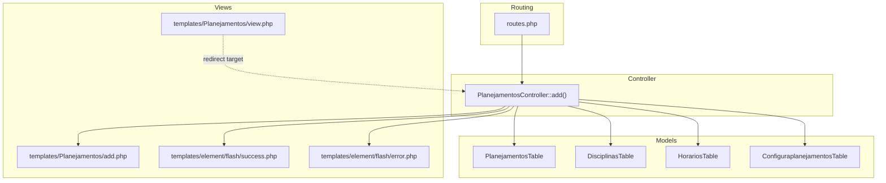
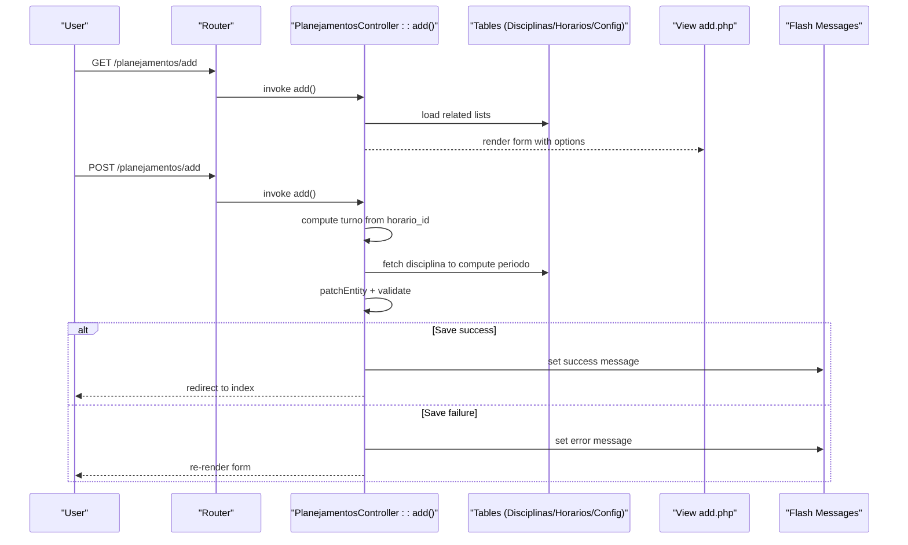
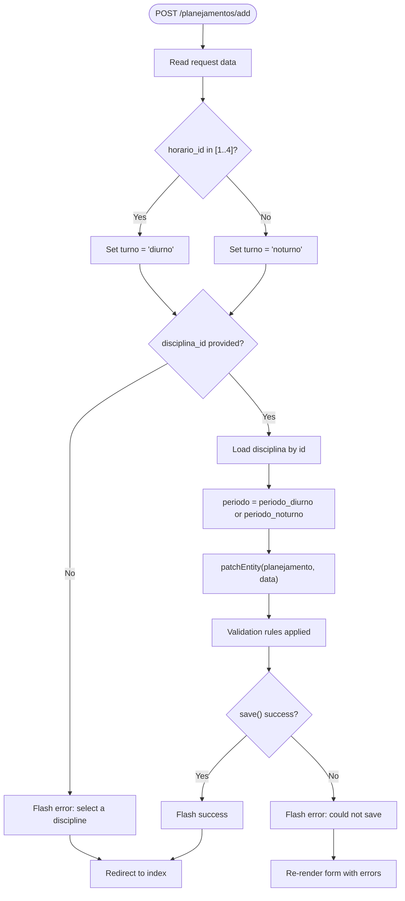
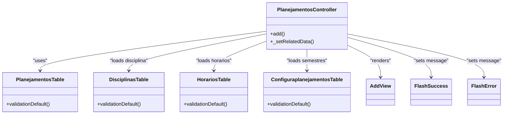

# Schedule Creation Workflow

<cite>
**Referenced Files in This Document**
- [PlanejamentosController.php](file://src/Controller/PlanejamentosController.php)
- [add.php](file://templates/Planejamentos/add.php)
- [view.php](file://templates/Planejamentos/view.php)
- [PlanejamentosTable.php](file://src/Model/Table/PlanejamentosTable.php)
- [DisciplinasTable.php](file://src/Model/Table/DisciplinasTable.php)
- [HorariosTable.php](file://src/Model/Table/HorariosTable.php)
- [ConfiguraplanejamentosTable.php](file://src/Model/Table/ConfiguraplanejamentosTable.php)
- [CreateHorarios.php](file://config/Migrations/20260612030431_CreateHorarios.php)
- [routes.php](file://config/routes.php)
- [success.php](file://templates/element/flash/success.php)
- [error.php](file://templates/element/flash/error.php)
</cite>

## Table of Contents
1. [Introduction](#introduction)
2. [Project Structure](#project-structure)
3. [Core Components](#core-components)
4. [Architecture Overview](#architecture-overview)
5. [Detailed Component Analysis](#detailed-component-analysis)
6. [Dependency Analysis](#dependency-analysis)
7. [Performance Considerations](#performance-considerations)
8. [Troubleshooting Guide](#troubleshooting-guide)
9. [Conclusion](#conclusion)

## Introduction
This document explains the end-to-end workflow for creating new academic schedules (planejamentos) in the system. It covers form rendering, data binding, validation, and business logic including automatic assignment of shift (turno) based on time slot selection and automatic period calculation based on discipline properties. Practical examples, user feedback mechanisms, and error handling are also documented.

## Project Structure
The schedule creation feature spans controller actions, view templates, model tables, and flash message elements:
- Controller action add() orchestrates form display, data processing, auto-computation, persistence, and redirection with feedback.
- View template add.php renders the form fields and pre-selects semester configuration when provided via query parameter.
- Model tables define relationships and validation rules for core entities involved in scheduling.
- Flash templates provide success and error messages to users after save operations.

**Diagram sources**
- [routes.php:52-79](file://config/routes.php#L52-L79)
- [PlanejamentosController.php:83-127](file://src/Controller/PlanejamentosController.php#L83-L127)
- [add.php:1-32](file://templates/Planejamentos/add.php#L1-L32)
- [view.php:1-45](file://templates/Planejamentos/view.php#L1-L45)
- [PlanejamentosTable.php:11-40](file://src/Model/Table/PlanejamentosTable.php#L11-L40)
- [DisciplinasTable.php:29-83](file://src/Model/Table/DisciplinasTable.php#L29-L83)
- [HorariosTable.php:33-63](file://src/Model/Table/HorariosTable.php#L33-L63)
- [ConfiguraplanejamentosTable.php:11-61](file://src/Model/Table/ConfiguraplanejamentosTable.php#L11-L61)
- [success.php:1-19](file://templates/element/flash/success.php#L1-L19)
- [error.php:1-19](file://templates/element/flash/error.php#L1-L19)

**Section sources**
- [routes.php:52-79](file://config/routes.php#L52-L79)
- [PlanejamentosController.php:83-127](file://src/Controller/PlanejamentosController.php#L83-L127)
- [add.php:1-32](file://templates/Planejamentos/add.php#L1-L32)
- [view.php:1-45](file://templates/Planejamentos/view.php#L1-L45)
- [PlanejamentosTable.php:11-40](file://src/Model/Table/PlanejamentosTable.php#L11-L40)
- [DisciplinasTable.php:29-83](file://src/Model/Table/DisciplinasTable.php#L29-L83)
- [HorariosTable.php:33-63](file://src/Model/Table/HorariosTable.php#L33-L63)
- [ConfiguraplanejamentosTable.php:11-61](file://src/Model/Table/ConfiguraplanejamentosTable.php#L11-L61)
- [success.php:1-19](file://templates/element/flash/success.php#L1-L19)
- [error.php:1-19](file://templates/element/flash/error.php#L1-L19)

## Core Components
- Controller add(): Handles GET to render the form and POST to process submission. It computes turno and periodo before saving and provides user feedback via flash messages.
- Form template add.php: Renders select lists for disciplina, semestre (configuraplanejamento), docente, dia, horario, sala, and an optional observacoes textarea. Includes a helper note about docente filtering by availability.
- Model validations:
  - PlanejamentosTable: Defines required integer fields and allowed empty fields; enforces presence of disciplina_id and configuraplanejamento_id.
  - DisciplinasTable: Validates periodo_diurno and periodo_noturno ranges used for automatic period calculation.
  - HorariosTable: Ensures time slot entries exist and are valid.
  - ConfiguraplanejamentosTable: Provides semester configurations used to group and filter schedules.
- Flash templates: Render success and error alerts to inform users of outcomes.

Key responsibilities:
- Data binding: The form posts to add(), which reads request data and patches the entity.
- Business logic: Auto-set turno from horario_id; auto-set periodo from selected disciplina’s diurnal or nocturnal period.
- User feedback: Success and error messages displayed via flash elements.

**Section sources**
- [PlanejamentosController.php:83-127](file://src/Controller/PlanejamentosController.php#L83-L127)
- [add.php:1-32](file://templates/Planejamentos/add.php#L1-L32)
- [PlanejamentosTable.php:42-55](file://src/Model/Table/PlanejamentosTable.php#L42-L55)
- [DisciplinasTable.php:47-59](file://src/Model/Table/DisciplinasTable.php#L47-L59)
- [HorariosTable.php:49-63](file://src/Model/Table/HorariosTable.php#L49-L63)
- [ConfiguraplanejamentosTable.php:33-60](file://src/Model/Table/ConfiguraplanejamentosTable.php#L33-L60)
- [success.php:1-19](file://templates/element/flash/success.php#L1-L19)
- [error.php:1-19](file://templates/element/flash/error.php#L1-L19)

## Architecture Overview
The schedule creation flow follows MVC patterns:
- Routing directs / to PlanejamentosController index; add/edit routes follow CakePHP conventions.
- add() prepares related data (disciplines, semesters, teachers filtered by availability, days, times, rooms).
- On POST, it applies business rules (turno and periodo), validates, persists, and redirects with feedback.

**Diagram sources**
- [routes.php:52-79](file://config/routes.php#L52-L79)
- [PlanejamentosController.php:83-127](file://src/Controller/PlanejamentosController.php#L83-L127)
- [add.php:1-32](file://templates/Planejamentos/add.php#L1-L32)
- [success.php:1-19](file://templates/element/flash/success.php#L1-L19)
- [error.php:1-19](file://templates/element/flash/error.php#L1-L19)

## Detailed Component Analysis

### Controller add() Workflow
Responsibilities:
- Prepare empty entity and authorize access.
- Pre-fill configuraplanejamento_id from query parameter if present.
- Load related dropdown data via _setRelatedData().
- On POST:
  - Compute turno based on horario_id range.
  - Fetch disciplina and compute periodo using periodo_diurno or periodo_noturno.
  - Patch entity, validate, persist, and redirect with flash messages.

**Diagram sources**
- [PlanejamentosController.php:98-123](file://src/Controller/PlanejamentosController.php#L98-L123)
- [DisciplinasTable.php:47-59](file://src/Model/Table/DisciplinasTable.php#L47-L59)
- [success.php:1-19](file://templates/element/flash/success.php#L1-L19)
- [error.php:1-19](file://templates/element/flash/error.php#L1-L19)

**Section sources**
- [PlanejamentosController.php:83-127](file://src/Controller/PlanejamentosController.php#L83-L127)

### Form Fields and Validation Rules
Form fields rendered by add.php:
- Disciplina (select): Required by validation.
- Semestre (configuraplanejamento_id, select): Required by validation; supports preselection via query parameter and auto-refreshes docentes list.
- Docente (select): Optional; filtered by availability when a semester is selected.
- Dia (select): Optional.
- Horário (select): Optional; drives turno computation.
- Sala (select): Optional.
- Observações (textarea): Optional.

Validation rules enforced by PlanejamentosTable:
- disciplina_id: integer, not empty.
- configuraplanejamento_id: integer, not empty.
- docente_id, periodo, turno, sala_id, dia_id, horario_id, observacoes: allow empty.

Additional constraints relevant to automatic calculations:
- DisciplinasTable ensures periodo_diurno ∈ [1..8] and periodo_noturno ∈ [1..10].

User interaction patterns:
- Selecting a semester updates available docentes via server-side filtering.
- Selecting a time slot determines turno automatically.
- Selecting a discipline determines periodo automatically.

**Section sources**
- [add.php:8-26](file://templates/Planejamentos/add.php#L8-L26)
- [PlanejamentosTable.php:42-55](file://src/Model/Table/PlanejamentosTable.php#L42-L55)
- [DisciplinasTable.php:47-59](file://src/Model/Table/DisciplinasTable.php#L47-L59)

### Automatic Assignment Logic

#### Turno (shift) based on horario_id
- If horario_id is in {1, 2, 3, 4}, turno is set to diurnal.
- Otherwise, turno is set to nocturnal.

This mapping aligns with how time slots are grouped in other parts of the application (e.g., grade views).

**Section sources**
- [PlanejamentosController.php:100-105](file://src/Controller/PlanejamentosController.php#L100-L105)
- [HorariosTable.php:49-63](file://src/Model/Table/HorariosTable.php#L49-L63)

#### Periodo (period) based on disciplina properties
- When a disciplina is selected, the controller loads the discipline and sets periodo to:
  - periodo_diurno if available; otherwise
  - periodo_noturno.
- Discipline validation ensures these values fall within expected ranges.

**Section sources**
- [PlanejamentosController.php:106-114](file://src/Controller/PlanejamentosController.php#L106-L114)
- [DisciplinasTable.php:47-59](file://src/Model/Table/DisciplinasTable.php#L47-L59)

### Data Binding and Persistence
- Request data is read and patched into the Planejamento entity.
- Related lists are refreshed after patching to reflect any changes (e.g., updated docente list based on selected semester).
- Entity is saved; on success, a success flash message is shown and the user is redirected to the index. On failure, an error flash message is shown and the form is re-rendered.

**Section sources**
- [PlanejamentosController.php:115-123](file://src/Controller/PlanejamentosController.php#L115-L123)
- [success.php:1-19](file://templates/element/flash/success.php#L1-L19)
- [error.php:1-19](file://templates/element/flash/error.php#L1-L19)

### Practical Examples

Example 1: Morning class
- Select a disciplina with periodo_diurno set.
- Select a horario_id in {1, 2, 3, 4}.
- System sets turno to diurnal and periodo to the discipline’s periodo_diurno value.
- Choose a day, room, and optionally a teacher (filtered by availability if a semester is selected).
- Submit to create the schedule.

Example 2: Evening class
- Select a disciplina with periodo_noturno set.
- Select a horario_id outside {1, 2, 3, 4}.
- System sets turno to nocturnal and periodo to the discipline’s periodo_noturno value.
- Complete remaining fields and submit.

Example 3: Missing discipline
- If no disciplina is selected, the controller shows an error flash and redirects to the index.

These scenarios demonstrate correct course-faculty-room-time assignments and automatic field computations.

[No sources needed since this section synthesizes behavior already analyzed above]

## Dependency Analysis
The schedule creation feature depends on several models and templates:
- Controller depends on Tables for data loading and persistence.
- View depends on controller-provided variables for dropdown options.
- Flash templates depend on controller messages.

**Diagram sources**
- [PlanejamentosController.php:83-127](file://src/Controller/PlanejamentosController.php#L83-L127)
- [PlanejamentosTable.php:11-40](file://src/Model/Table/PlanejamentosTable.php#L11-L40)
- [DisciplinasTable.php:29-83](file://src/Model/Table/DisciplinasTable.php#L29-L83)
- [HorariosTable.php:33-63](file://src/Model/Table/HorariosTable.php#L33-L63)
- [ConfiguraplanejamentosTable.php:11-61](file://src/Model/Table/ConfiguraplanejamentosTable.php#L11-L61)
- [add.php:1-32](file://templates/Planejamentos/add.php#L1-L32)
- [success.php:1-19](file://templates/element/flash/success.php#L1-L19)
- [error.php:1-19](file://templates/element/flash/error.php#L1-L19)

**Section sources**
- [PlanejamentosController.php:83-127](file://src/Controller/PlanejamentosController.php#L83-L127)
- [PlanejamentosTable.php:11-40](file://src/Model/Table/PlanejamentosTable.php#L11-L40)
- [DisciplinasTable.php:29-83](file://src/Model/Table/DisciplinasTable.php#L29-L83)
- [HorariosTable.php:33-63](file://src/Model/Table/HorariosTable.php#L33-L63)
- [ConfiguraplanejamentosTable.php:11-61](file://src/Model/Table/ConfiguraplanejamentosTable.php#L11-L61)
- [add.php:1-32](file://templates/Planejamentos/add.php#L1-L32)
- [success.php:1-19](file://templates/element/flash/success.php#L1-L19)
- [error.php:1-19](file://templates/element/flash/error.php#L1-L19)

## Performance Considerations
- Related data loading: The controller loads multiple lists (disciplines, semesters, teachers, days, times, rooms). Ensure database indexes exist on foreign keys and frequently filtered columns (e.g., status, disponivel flags) to keep queries fast.
- Teacher filtering: Filtering docentes by availability per semester uses matching queries; ensure appropriate indexes on availability tables to avoid slow joins.
- Pagination: The index/list endpoints use pagination; verify page sizes and sorting fields are indexed where necessary.

[No sources needed since this section provides general guidance]

## Troubleshooting Guide
Common issues and resolutions:
- Missing disciplina: The controller requires a disciplina to compute periodo. If omitted, an error flash is shown and the user is redirected to the index. Ensure a disciplina is selected before submitting.
- Invalid periodo values: Discipline validation restricts periodo_diurno and periodo_noturno to specific ranges. Update discipline records to valid values if errors occur during save.
- Time slot mismatch: If horario_id does not match expected ranges, turno may be computed as nocturnal. Verify horario definitions and IDs.
- Flash messages not visible: Confirm that flash templates are included in layouts and that messages are being set by the controller.

Operational references:
- Error path when disciplina is missing.
- Success and error flash templates.

**Section sources**
- [PlanejamentosController.php:106-114](file://src/Controller/PlanejamentosController.php#L106-L114)
- [DisciplinasTable.php:47-59](file://src/Model/Table/DisciplinasTable.php#L47-L59)
- [success.php:1-19](file://templates/element/flash/success.php#L1-L19)
- [error.php:1-19](file://templates/element/flash/error.php#L1-L19)

## Conclusion
The schedule creation workflow integrates form input, validation, and business rules to automate key fields like turno and periodo. By selecting a disciplina and a time slot, users benefit from intelligent defaults while retaining control over faculty, room, and day assignments. Clear flash messaging guides users through successful saves and common errors, ensuring a smooth scheduling experience.

[No sources needed since this section summarizes without analyzing specific files]