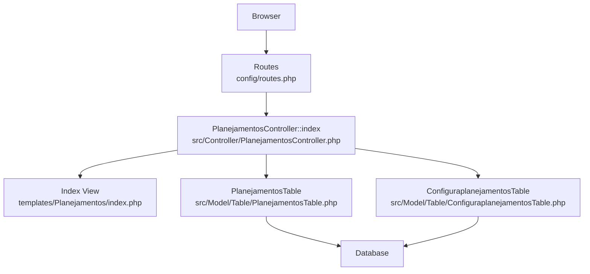
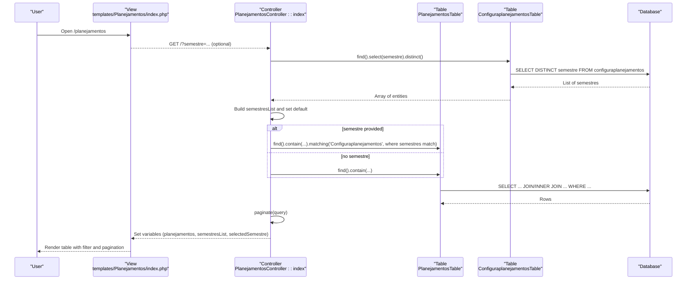
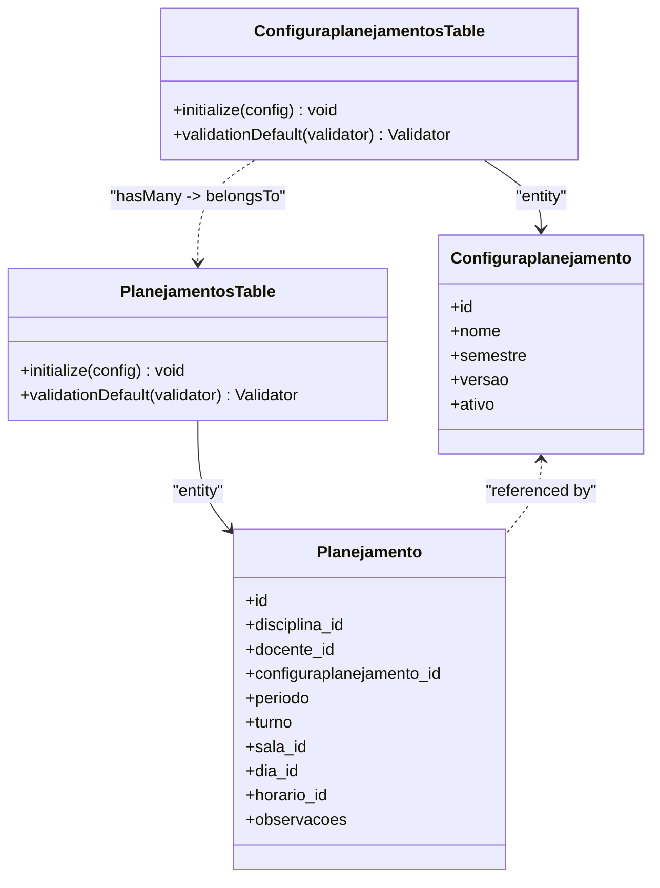
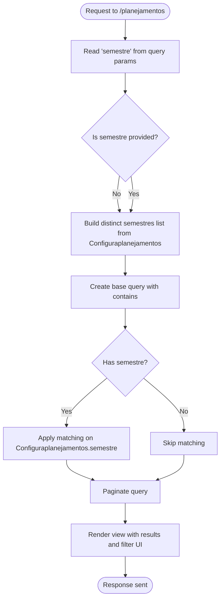
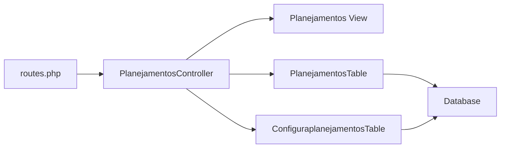

# Semester Filtering System

<cite>
**Referenced Files in This Document**
- [PlanejamentosController.php](file://src/Controller/PlanejamentosController.php)
- [ConfiguraplanejamentosController.php](file://src/Controller/ConfiguraplanejamentosController.php)
- [index.php (Planejamentos view)](file://templates/Planejamentos/index.php)
- [PlanejamentosTable.php](file://src/Model/Table/PlanejamentosTable.php)
- [ConfiguraplanejamentosTable.php](file://src/Model/Table/ConfiguraplanejamentosTable.php)
- [routes.php](file://config/routes.php)
</cite>

## Table of Contents
1. [Introduction](#introduction)
2. [Project Structure](#project-structure)
3. [Core Components](#core-components)
4. [Architecture Overview](#architecture-overview)
5. [Detailed Component Analysis](#detailed-component-analysis)
6. [Dependency Analysis](#dependency-analysis)
7. [Performance Considerations](#performance-considerations)
8. [Troubleshooting Guide](#troubleshooting-guide)
9. [Conclusion](#conclusion)

## Introduction
This document explains the semester filtering system used in the academic planning interface. It covers how unique semestres are extracted from Configuraplanejamentos, how dynamic filter dropdowns are built and rendered, and how selected values are applied to query filters using CakePHP’s matching method. It also documents URL parameter handling, pagination integration, default behavior when no filter is provided, and performance considerations for large datasets.

## Project Structure
The semester filtering feature spans controllers, models, views, and routing:
- Controller logic extracts the semestre query parameter, builds a list of unique semestres, applies filtering via matching, and paginates results.
- The view renders a GET form with a dropdown populated by the unique semestres and persists the selection through the URL.
- Model tables define relationships between Planejamentos and Configuraplanejamentos, enabling efficient joins and matching.
- Routing maps the application root to the Planejamentos index action where filtering occurs.

**Diagram sources**
- [routes.php:52-79](file://config/routes.php#L52-L79)
- [PlanejamentosController.php:17-67](file://src/Controller/PlanejamentosController.php#L17-L67)
- [index.php (Planejamentos view):1-85](file://templates/Planejamentos/index.php#L1-L85)
- [PlanejamentosTable.php:11-40](file://src/Model/Table/PlanejamentosTable.php#L11-L40)
- [ConfiguraplanejamentosTable.php:11-31](file://src/Model/Table/ConfiguraplanejamentosTable.php#L11-L31)

**Section sources**
- [routes.php:52-79](file://config/routes.php#L52-L79)
- [PlanejamentosController.php:17-67](file://src/Controller/PlanejamentosController.php#L17-L67)
- [index.php (Planejamentos view):1-85](file://templates/Planejamentos/index.php#L1-L85)
- [PlanejamentosTable.php:11-40](file://src/Model/Table/PlanejamentosTable.php#L11-L40)
- [ConfiguraplanejamentosTable.php:11-31](file://src/Model/Table/ConfiguraplanejamentosTable.php#L11-L31)

## Core Components
- PlanejamentosController::index
  - Reads the semestre query parameter.
  - Builds a distinct list of semestres from Configuraplanejamentos.
  - Applies a filter using matching when a semestre is selected.
  - Paginates the resulting query.
- Index View (Planejamentos)
  - Renders a GET form with a dropdown of available semestres.
  - Submits on change and shows a clear-filter link when a filter is active.
- Model Tables
  - ConfiguraplanejamentosTable defines the one-to-many relationship to Planejamentos.
  - PlanejamentosTable defines belongsTo Configuraplanejamentos, enabling matching.

Key responsibilities:
- Extracting unique semestres: done via a distinct select over Configuraplanejamentos.semestre.
- Building dynamic dropdown: options are derived from the distinct list and passed to the view.
- Applying filters: uses matching to join Configuraplanejamentos and constrain by semestre.
- Pagination: integrates seamlessly with the filtered query.

**Section sources**
- [PlanejamentosController.php:17-67](file://src/Controller/PlanejamentosController.php#L17-L67)
- [index.php (Planejamentos view):13-37](file://templates/Planejamentos/index.php#L13-L37)
- [ConfiguraplanejamentosTable.php:24-31](file://src/Model/Table/ConfiguraplanejamentosTable.php#L24-L31)
- [PlanejamentosTable.php:27-30](file://src/Model/Table/PlanejamentosTable.php#L27-L30)

## Architecture Overview
The semester filtering workflow connects user interaction to database queries through CakePHP’s ORM and paginator.

**Diagram sources**
- [PlanejamentosController.php:17-67](file://src/Controller/PlanejamentosController.php#L17-L67)
- [index.php (Planejamentos view):13-37](file://templates/Planejamentos/index.php#L13-L37)
- [PlanejamentosTable.php:11-40](file://src/Model/Table/PlanejamentosTable.php#L11-L40)
- [ConfiguraplanejamentosTable.php:11-31](file://src/Model/Table/ConfiguraplanejamentosTable.php#L11-L31)

## Detailed Component Analysis

### Controller Logic: PlanejamentosController::index
Responsibilities:
- Read semestre from request query parameters.
- Query Configuraplanejamentos for distinct semestres.
- Build a map for the dropdown options.
- Construct the main query with contains for related data.
- Apply matching filter when semestre is present.
- Paginate and pass variables to the view.

Implementation highlights:
- Distinct extraction: selects only the semestre field and applies distinct ordering by DESC.
- Matching usage: adds a subquery constraint on Configuraplanejamentos.semestre equal to the selected value.
- Pagination configuration: includes sortable fields across joined tables.

Example behaviors:
- With semestre=2025-2: returns planejamentos whose associated configuraplanejamento has semestre 2025-2.
- Without semestre: returns all planejamentos (no matching clause).

URL parameter handling:
- Uses getQuery('semestre') to read the filter.
- The view submits via GET so the parameter persists in the URL.

Default filtering behavior:
- If no semestre is provided, the filter is not applied; all records are returned.

Pagination integration:
- Results are paginated after applying any filter, preserving sortability across joined columns.

**Section sources**
- [PlanejamentosController.php:17-67](file://src/Controller/PlanejamentosController.php#L17-L67)

### View: templates/Planejamentos/index.php
Responsibilities:
- Render a GET form with a dropdown of semestres.
- Populate options with an empty “All Semestres” plus the distinct list.
- Auto-submit on change to apply the filter immediately.
- Provide a clear-filter link that removes the semestre parameter.
- Display the filtered table and pagination controls.

Filter display details:
- The dropdown label is shown inline.
- When a filter is active, a clear button appears next to the form.

Pagination display:
- Standard paginator helpers render page navigation and counters.

**Section sources**
- [index.php (Planejamentos view):13-37](file://templates/Planejamentos/index.php#L13-L37)
- [index.php (Planejamentos view):38-85](file://templates/Planejamentos/index.php#L38-L85)

### Data Relationships: Configuraplanejamentos and Planejamentos
Relationships:
- Configuraplanejamentos hasMany Planejamentos via configuraplanejamento_id.
- Planejamentos belongsTo Configuraplanejamentos via configuraplanejamento_id.

These relationships enable:
- Efficient matching and contain operations.
- Access to semestre from Planejamento entities through configured associations.

Entity accessors:
- Entities expose fields like semestre and id, allowing safe rendering in views.

**Section sources**
- [ConfiguraplanejamentosTable.php:24-31](file://src/Model/Table/ConfiguraplanejamentosTable.php#L24-L31)
- [PlanejamentosTable.php:27-30](file://src/Model/Table/PlanejamentosTable.php#L27-L30)
- [Configuraplanejamento.php:13-21](file://src/Model/Entity/Configuraplanejamento.php#L13-L21)
- [Planejamento.php:13-25](file://src/Model/Entity/Planejamento.php#L13-L25)

### Class Diagram: Entity and Table Relationships

**Diagram sources**
- [ConfiguraplanejamentosTable.php:11-31](file://src/Model/Table/ConfiguraplanejamentosTable.php#L11-L31)
- [PlanejamentosTable.php:11-40](file://src/Model/Table/PlanejamentosTable.php#L11-L40)
- [Configuraplanejamento.php:13-21](file://src/Model/Entity/Configuraplanejamento.php#L13-L21)
- [Planejamento.php:13-25](file://src/Model/Entity/Planejamento.php#L13-L25)

### Flowchart: Filter Application Logic

**Diagram sources**
- [PlanejamentosController.php:17-67](file://src/Controller/PlanejamentosController.php#L17-L67)
- [index.php (Planejamentos view):13-37](file://templates/Planejamentos/index.php#L13-L37)

## Dependency Analysis
- Controller depends on:
  - Request object for query parameters.
  - ORM tables for querying and matching.
  - Paginator for result slicing.
- View depends on:
  - Variables provided by controller (planejamentos, semestresList, selectedSemestre).
  - Form and HTML helpers for rendering.
- Tables depend on:
  - Database schema and defined associations.

Potential coupling points:
- The matching condition references Configuraplanejamentos.semestre; changes to field names or aliases would require updates in both controller and view sorting.

External integrations:
- CakePHP ORM and paginator.
- Routing maps the root path to Planejamentos::index.

**Diagram sources**
- [routes.php:52-79](file://config/routes.php#L52-L79)
- [PlanejamentosController.php:17-67](file://src/Controller/PlanejamentosController.php#L17-L67)
- [index.php (Planejamentos view):1-85](file://templates/Planejamentos/index.php#L1-L85)
- [PlanejamentosTable.php:11-40](file://src/Model/Table/PlanejamentosTable.php#L11-L40)
- [ConfiguraplanejamentosTable.php:11-31](file://src/Model/Table/ConfiguraplanejamentosTable.php#L11-L31)

**Section sources**
- [routes.php:52-79](file://config/routes.php#L52-L79)
- [PlanejamentosController.php:17-67](file://src/Controller/PlanejamentosController.php#L17-L67)
- [index.php (Planejamentos view):1-85](file://templates/Planejamentos/index.php#L1-L85)
- [PlanejamentosTable.php:11-40](file://src/Model/Table/PlanejamentosTable.php#L11-L40)
- [ConfiguraplanejamentosTable.php:11-31](file://src/Model/Table/ConfiguraplanejamentosTable.php#L11-L31)

## Performance Considerations
- Distinct semestres query:
  - Selecting only the semestre field reduces payload size.
  - Ensure an index on configuraplanejamentos.semestre if the dataset grows significantly.
- Matching vs contains:
  - Using matching generates a subquery join; it is efficient but can be expensive without proper indexes.
  - Avoid unnecessary contains when not needed in listing views.
- Sorting and pagination:
  - Sortable fields include joined tables; ensure indexes on frequently sorted columns (e.g., disciplina, docente, semestre).
  - Keep page sizes reasonable to limit memory usage.
- Large datasets:
  - Consider adding composite indexes if filtering and sorting combine multiple columns.
  - Monitor generated SQL for N+1 issues; use contains judiciously.

[No sources needed since this section provides general guidance]

## Troubleshooting Guide
Common issues and resolutions:
- Filter not applied:
  - Verify the semestre query parameter exists in the URL and matches expected values.
  - Confirm the dropdown form submits via GET and onchange triggers submission.
- Empty dropdown:
  - Check that Configuraplanejamentos contains at least one record with a non-empty semestre.
  - Validate the distinct query runs successfully and returns results.
- Incorrect results after selecting a semestre:
  - Ensure matching targets Configuraplanejamentos.semestre and not another field.
  - Confirm foreign key relationships are intact between Planejamentos and Configuraplanejamentos.
- Pagination loses filter:
  - Ensure paginator links preserve query parameters; CakePHP’s paginator typically maintains them automatically.
  - If custom pagination links are used, explicitly pass the semestre parameter.

**Section sources**
- [PlanejamentosController.php:17-67](file://src/Controller/PlanejamentosController.php#L17-L67)
- [index.php (Planejamentos view):13-37](file://templates/Planejamentos/index.php#L13-L37)

## Conclusion
The semester filtering system leverages CakePHP’s ORM matching to efficiently filter Planejamentos by the semestre attribute stored in Configuraplanejamentos. The view presents a simple GET-based filter UI that persists selections in the URL and integrates cleanly with pagination. For scalability, ensure appropriate database indexes and careful use of contains/matching to maintain performance as data grows.

[No sources needed since this section summarizes without analyzing specific files]