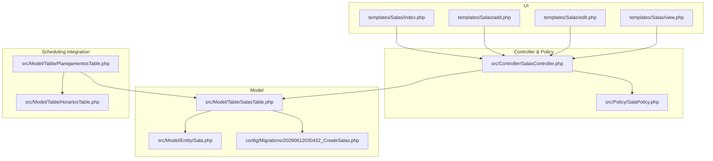
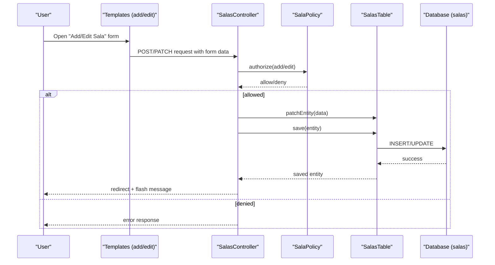
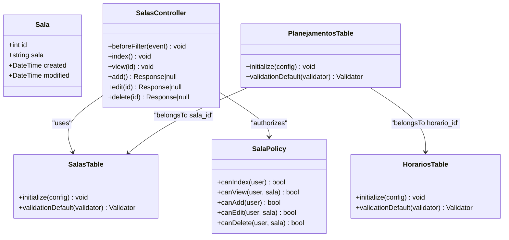
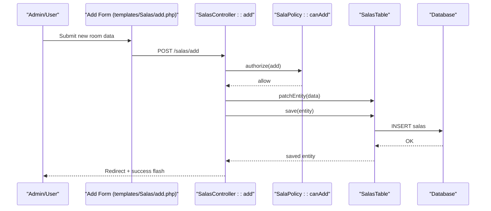
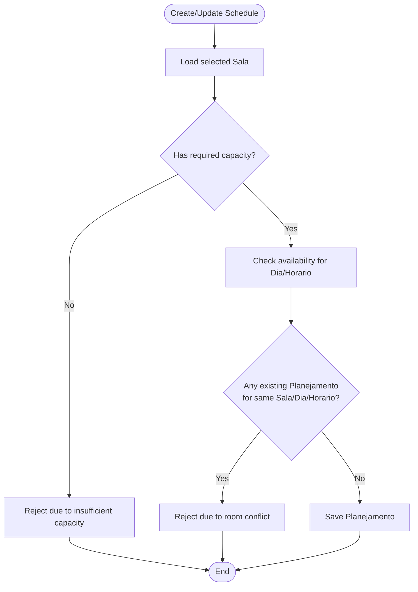
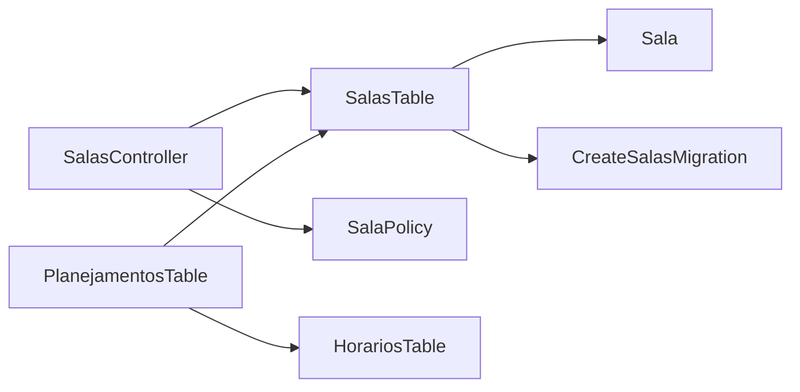

# Classroom Resource Management

<cite>
**Referenced Files in This Document**
- [Sala.php](file://src/Model/Entity/Sala.php)
- [SalasTable.php](file://src/Model/Table/SalasTable.php)
- [SalasController.php](file://src/Controller/SalasController.php)
- [SalaPolicy.php](file://src/Policy/SalaPolicy.php)
- [20260612030432_CreateSalas.php](file://config/Migrations/20260612030432_CreateSalas.php)
- [index.php](file://templates/Salas/index.php)
- [add.php](file://templates/Salas/add.php)
- [edit.php](file://templates/Salas/edit.php)
- [view.php](file://templates/Salas/view.php)
- [PlanejamentosTable.php](file://src/Model/Table/PlanejamentosTable.php)
- [HorariosTable.php](file://src/Model/Table/HorariosTable.php)
</cite>

## Table of Contents
1. [Introduction](#introduction)
2. [Project Structure](#project-structure)
3. [Core Components](#core-components)
4. [Architecture Overview](#architecture-overview)
5. [Detailed Component Analysis](#detailed-component-analysis)
6. [Dependency Analysis](#dependency-analysis)
7. [Performance Considerations](#performance-considerations)
8. [Troubleshooting Guide](#troubleshooting-guide)
9. [Conclusion](#conclusion)

## Introduction
This document describes the classroom resource management functionality centered on the Sala (classroom) entity and its integration with the scheduling system. It covers the complete lifecycle of classroom administration, including capacity management, equipment specifications, availability scheduling, validation rules, business constraints, conflict prevention, and performance considerations for large inventories.

The current implementation provides a foundational model and controller for managing classrooms, with UI templates that expose additional attributes such as location, capacity, resources, and observations. The scheduling subsystem references classrooms via foreign keys to support assignment and conflict detection at schedule creation time.

## Project Structure
Classroom management spans the following layers:
- Data access and persistence: Entity, Table, Migration
- Business logic and authorization: Controller, Policy
- User interface: Templates for listing, viewing, adding, editing
- Scheduling integration: Planning table referencing classrooms and time slots

**Diagram sources**
- [SalasController.php:1-121](file://src/Controller/SalasController.php#L1-L121)
- [SalaPolicy.php:1-36](file://src/Policy/SalaPolicy.php#L1-L36)
- [SalasTable.php:1-60](file://src/Model/Table/SalasTable.php#L1-L60)
- [Sala.php:1-29](file://src/Model/Entity/Sala.php#L1-L29)
- [20260612030432_CreateSalas.php:1-35](file://config/Migrations/20260612030432_CreateSalas.php#L1-L35)
- [index.php:1-60](file://templates/Salas/index.php#L1-L60)
- [add.php:1-20](file://templates/Salas/add.php#L1-L20)
- [edit.php:1-20](file://templates/Salas/edit.php#L1-L20)
- [view.php:1-51](file://templates/Salas/view.php#L1-L51)
- [PlanejamentosTable.php:1-57](file://src/Model/Table/PlanejamentosTable.php#L1-L57)
- [HorariosTable.php:1-65](file://src/Model/Table/HorariosTable.php#L1-L65)

**Section sources**
- [SalasController.php:1-121](file://src/Controller/SalasController.php#L1-L121)
- [SalaPolicy.php:1-36](file://src/Policy/SalaPolicy.php#L1-L36)
- [SalasTable.php:1-60](file://src/Model/Table/SalasTable.php#L1-L60)
- [Sala.php:1-29](file://src/Model/Entity/Sala.php#L1-L29)
- [20260612030432_CreateSalas.php:1-35](file://config/Migrations/20260612030432_CreateSalas.php#L1-L35)
- [index.php:1-60](file://templates/Salas/index.php#L1-L60)
- [add.php:1-20](file://templates/Salas/add.php#L1-L20)
- [edit.php:1-20](file://templates/Salas/edit.php#L1-L20)
- [view.php:1-51](file://templates/Salas/view.php#L1-L51)
- [PlanejamentosTable.php:1-57](file://src/Model/Table/PlanejamentosTable.php#L1-L57)
- [HorariosTable.php:1-65](file://src/Model/Table/HorariosTable.php#L1-L65)

## Core Components
- Sala Entity: Defines the data shape and accessible fields for classroom records.
- SalasTable: Configures table mapping, display field, primary key, timestamp behavior, and validation rules.
- SalasController: Exposes CRUD endpoints with authorization checks and flash messaging.
- SalaPolicy: Enforces role-based permissions for index, view, add, edit, delete.
- Migrations: Define the salas table schema with timestamps.
- Templates: Provide UI for listing, viewing, creating, and editing classrooms; they reference additional attributes like location, capacity, resources, and observations.
- Scheduling Integration: PlanejamentosTable links classrooms to schedules via sala_id and uses HorariosTable for time slot definitions.

Key responsibilities:
- Data integrity: Validation rules ensure required fields and length limits.
- Authorization: Role-based policies restrict write operations to admin/editor roles.
- Persistence: Timestamps are managed automatically by the Timestamp behavior.
- UI consistency: Templates render all relevant attributes and provide navigation actions.

**Section sources**
- [Sala.php:1-29](file://src/Model/Entity/Sala.php#L1-L29)
- [SalasTable.php:1-60](file://src/Model/Table/SalasTable.php#L1-L60)
- [SalasController.php:1-121](file://src/Controller/SalasController.php#L1-L121)
- [SalaPolicy.php:1-36](file://src/Policy/SalaPolicy.php#L1-L36)
- [20260612030432_CreateSalas.php:1-35](file://config/Migrations/20260612030432_CreateSalas.php#L1-L35)
- [index.php:1-60](file://templates/Salas/index.php#L1-L60)
- [add.php:1-20](file://templates/Salas/add.php#L1-L20)
- [edit.php:1-20](file://templates/Salas/edit.php#L1-L20)
- [view.php:1-51](file://templates/Salas/view.php#L1-L51)
- [PlanejamentosTable.php:1-57](file://src/Model/Table/PlanejamentosTable.php#L1-L57)
- [HorariosTable.php:1-65](file://src/Model/Table/HorariosTable.php#L1-L65)

## Architecture Overview
The classroom management follows a standard MVC pattern with policy-based authorization and ORM-backed persistence. The scheduling subsystem integrates through foreign keys to link classrooms with days and time slots.

**Diagram sources**
- [SalasController.php:55-97](file://src/Controller/SalasController.php#L55-L97)
- [SalaPolicy.php:21-29](file://src/Policy/SalaPolicy.php#L21-L29)
- [SalasTable.php:33-58](file://src/Model/Table/SalasTable.php#L33-L58)
- [20260612030432_CreateSalas.php:16-33](file://config/Migrations/20260612030432_CreateSalas.php#L16-L33)

## Detailed Component Analysis

### Sala Entity and Schema
- Entity fields: id, sala, created, modified. Accessible fields include sala and timestamps.
- Database schema: salas table includes sala (string), created (datetime), modified (datetime).
- UI expectations: Templates reference additional fields localizacao, lotacao, recursos, observacoes. These fields are not declared in the current entity or migration but are rendered in views.

Recommendations:
- Extend the entity to declare additional properties and mark them accessible if they exist in the database.
- Add corresponding columns in the database via migrations to align with UI expectations.

**Section sources**
- [Sala.php:1-29](file://src/Model/Entity/Sala.php#L1-L29)
- [20260612030432_CreateSalas.php:16-33](file://config/Migrations/20260612030432_CreateSalas.php#L16-L33)
- [index.php:17-34](file://templates/Salas/index.php#L17-L34)
- [add.php:9-14](file://templates/Salas/add.php#L9-L14)
- [edit.php:9-14](file://templates/Salas/edit.php#L9-L14)
- [view.php:14-31](file://templates/Salas/view.php#L14-L31)

### SalasTable Validation and Behavior
- Table configuration: sets table name, display field, primary key, and adds Timestamp behavior.
- Validation rules: sala is scalar, max length 100, required on create, non-empty string.

Business constraints:
- Ensure unique room names if needed (not currently enforced).
- Validate numeric capacity (lotacao) when added to the model.
- Optionally enforce minimum capacity greater than zero.

**Section sources**
- [SalasTable.php:33-58](file://src/Model/Table/SalasTable.php#L33-L58)

### SalasController Lifecycle
- beforeFilter: Allows public access to index and view.
- index: Paginates all salas.
- view: Loads a single sala by id.
- add: Authorizes add, patches entity from request data, saves, redirects with flash messages.
- edit: Authorizes edit, patches entity, saves, redirects with flash messages.
- delete: Authorizes delete, deletes entity, redirects with flash messages.

Authorization:
- Uses Authorization component to skip or enforce authorization per action.
- Policies determine who can add, edit, or delete based on user roles.

**Section sources**
- [SalasController.php:19-25](file://src/Controller/SalasController.php#L19-L25)
- [SalasController.php:32-39](file://src/Controller/SalasController.php#L32-L39)
- [SalasController.php:48-53](file://src/Controller/SalasController.php#L48-L53)
- [SalasController.php:60-74](file://src/Controller/SalasController.php#L60-L74)
- [SalasController.php:83-97](file://src/Controller/SalasController.php#L83-L97)
- [SalasController.php:106-119](file://src/Controller/SalasController.php#L106-L119)

### SalaPolicy Permissions
- canIndex: Always true.
- canView: Always true.
- canAdd: Allowed for admin and editor roles.
- canEdit: Allowed for admin and editor roles.
- canDelete: Allowed only for admin role.

Guidelines:
- Restrict deletion to administrators to prevent accidental loss of classroom records.
- Consider adding ownership or department-based policies if multi-department usage is introduced.

**Section sources**
- [SalaPolicy.php:11-34](file://src/Policy/SalaPolicy.php#L11-L34)

### Scheduling Integration and Availability Patterns
- PlanejamentosTable defines belongsTo relationships with Disciplinas, Docentes, Configuraplanejamentos, Salas, Dias, and Horarios.
- sala_id is an integer field allowing empty values, indicating optional room assignment during planning.
- HorariosTable defines time slots with ordering, used to schedule sessions.

Availability patterns:
- A classroom is available for a specific day/time combination unless a conflicting Planejamento exists.
- Capacity-based decisions should compare lotacao against expected attendance derived from course enrollment or class size.

Integration points:
- When creating or updating a Planejamento, validate that the selected sala is free for the chosen dia/horario.
- If lotacao is provided, verify it meets or exceeds the required capacity for the scheduled session.

**Section sources**
- [PlanejamentosTable.php:19-40](file://src/Model/Table/PlanejamentosTable.php#L19-L40)
- [PlanejamentosTable.php:42-55](file://src/Model/Table/PlanejamentosTable.php#L42-L55)
- [HorariosTable.php:33-63](file://src/Model/Table/HorariosTable.php#L33-L63)

### Class Diagram: Entities and Relationships

**Diagram sources**
- [Sala.php:1-29](file://src/Model/Entity/Sala.php#L1-L29)
- [SalasTable.php:33-58](file://src/Model/Table/SalasTable.php#L33-L58)
- [SalasController.php:19-119](file://src/Controller/SalasController.php#L19-L119)
- [SalaPolicy.php:11-34](file://src/Policy/SalaPolicy.php#L11-L34)
- [PlanejamentosTable.php:11-55](file://src/Model/Table/PlanejamentosTable.php#L11-L55)
- [HorariosTable.php:33-63](file://src/Model/Table/HorariosTable.php#L33-L63)

### Sequence Diagram: Room Creation Flow

**Diagram sources**
- [add.php:1-20](file://templates/Salas/add.php#L1-L20)
- [SalasController.php:60-74](file://src/Controller/SalasController.php#L60-L74)
- [SalaPolicy.php:21-24](file://src/Policy/SalaPolicy.php#L21-L24)
- [SalasTable.php:33-58](file://src/Model/Table/SalasTable.php#L33-L58)
- [20260612030432_CreateSalas.php:16-33](file://config/Migrations/20260612030432_CreateSalas.php#L16-L33)

### Flowchart: Conflict Prevention and Capacity-Based Scheduling

[No sources needed since this diagram shows conceptual workflow, not actual code structure]

## Dependency Analysis
- Controller depends on Table and Policy for authorization.
- Table depends on Entity and Migrations for schema alignment.
- Scheduling depends on both Sala and Horario entities via foreign keys.

**Diagram sources**
- [SalasController.php:1-121](file://src/Controller/SalasController.php#L1-L121)
- [SalasTable.php:1-60](file://src/Model/Table/SalasTable.php#L1-L60)
- [Sala.php:1-29](file://src/Model/Entity/Sala.php#L1-L29)
- [20260612030432_CreateSalas.php:1-35](file://config/Migrations/20260612030432_CreateSalas.php#L1-L35)
- [PlanejamentosTable.php:1-57](file://src/Model/Table/PlanejamentosTable.php#L1-L57)
- [HorariosTable.php:1-65](file://src/Model/Table/HorariosTable.php#L1-L65)

**Section sources**
- [SalasController.php:1-121](file://src/Controller/SalasController.php#L1-L121)
- [SalasTable.php:1-60](file://src/Model/Table/SalasTable.php#L1-L60)
- [Sala.php:1-29](file://src/Model/Entity/Sala.php#L1-L29)
- [20260612030432_CreateSalas.php:1-35](file://config/Migrations/20260612030432_CreateSalas.php#L1-L35)
- [PlanejamentosTable.php:1-57](file://src/Model/Table/PlanejamentosTable.php#L1-L57)
- [HorariosTable.php:1-65](file://src/Model/Table/HorariosTable.php#L1-L65)

## Performance Considerations
- Pagination: Use paginated queries for large classroom inventories to reduce memory footprint and improve load times.
- Indexing: Add database indexes on frequently queried fields such as sala (if uniqueness is enforced), and foreign keys in planejamentos (sala_id, dia_id, horario_id).
- Query optimization: Avoid N+1 queries by using contain or joins when loading related data for lists and views.
- Caching: Consider caching static room metadata (e.g., capacity, resources) if accessed frequently and rarely changed.
- Validation efficiency: Keep validation rules minimal and focused on essential constraints to reduce overhead.

[No sources needed since this section provides general guidance]

## Troubleshooting Guide
Common issues and resolutions:
- Missing fields in entity/schema mismatch:
  - Symptom: UI renders fields like localizacao, lotacao, recursos, observacoes, but entity/migration do not define them.
  - Resolution: Update the entity to declare these properties and extend the migration to add corresponding columns.
- Unauthorized access errors:
  - Symptom: Users cannot add/edit/delete rooms.
  - Resolution: Verify user roles match policy requirements (admin/editor for add/edit, admin for delete).
- Validation failures:
  - Symptom: Saving fails due to missing or invalid sala name.
  - Resolution: Ensure sala is present, non-empty, and within length limits.
- Scheduling conflicts:
  - Symptom: Attempted schedule assignment overlaps with existing ones.
  - Resolution: Implement conflict checks before saving Planejamento entries for the same sala/dia/horario.

**Section sources**
- [SalasTable.php:49-58](file://src/Model/Table/SalasTable.php#L49-L58)
- [SalaPolicy.php:21-34](file://src/Policy/SalaPolicy.php#L21-L34)
- [index.php:17-34](file://templates/Salas/index.php#L17-L34)
- [add.php:9-14](file://templates/Salas/add.php#L9-L14)
- [edit.php:9-14](file://templates/Salas/edit.php#L9-L14)
- [view.php:14-31](file://templates/Salas/view.php#L14-L31)

## Conclusion
The classroom resource management module provides a solid foundation for managing Sala entities with basic CRUD operations, validation, and role-based authorization. To fully support capacity management, equipment specifications, and availability scheduling, extend the entity and schema to include additional attributes, implement robust validation and conflict prevention in the scheduling layer, and optimize queries and indexing for scalability. With these enhancements, the system will enable reliable capacity-based scheduling decisions and seamless integration with the broader scheduling framework.