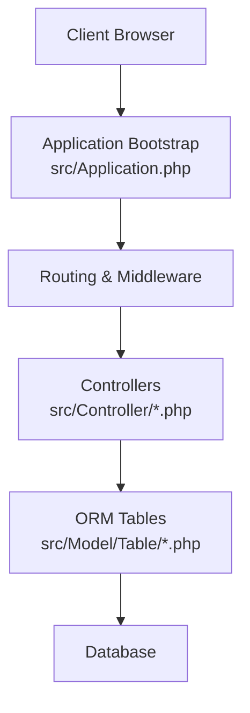
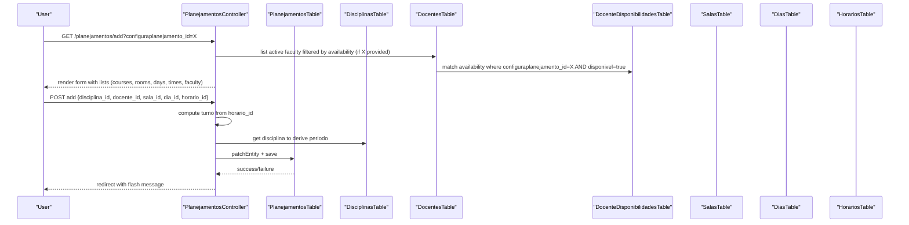
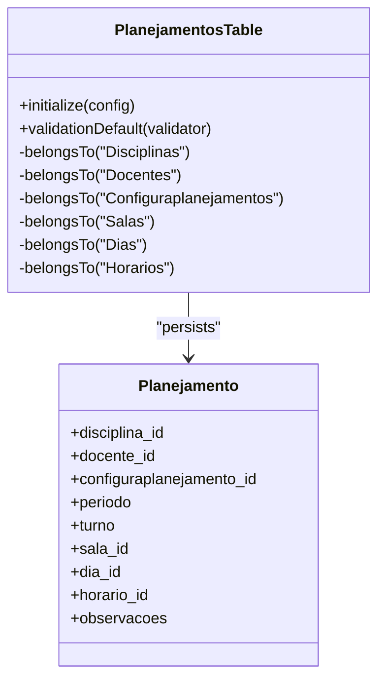
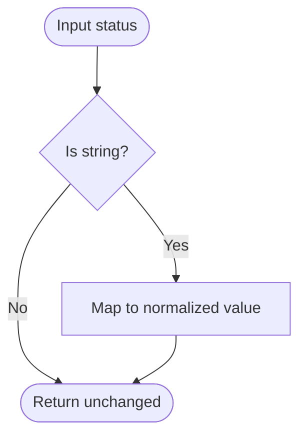
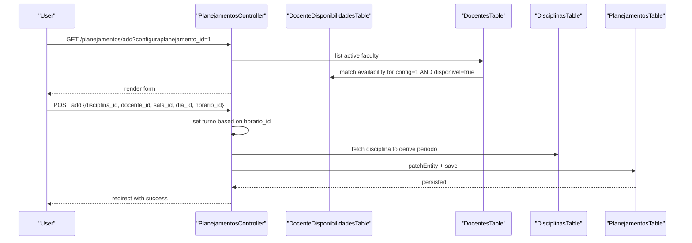
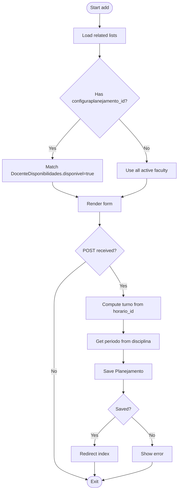
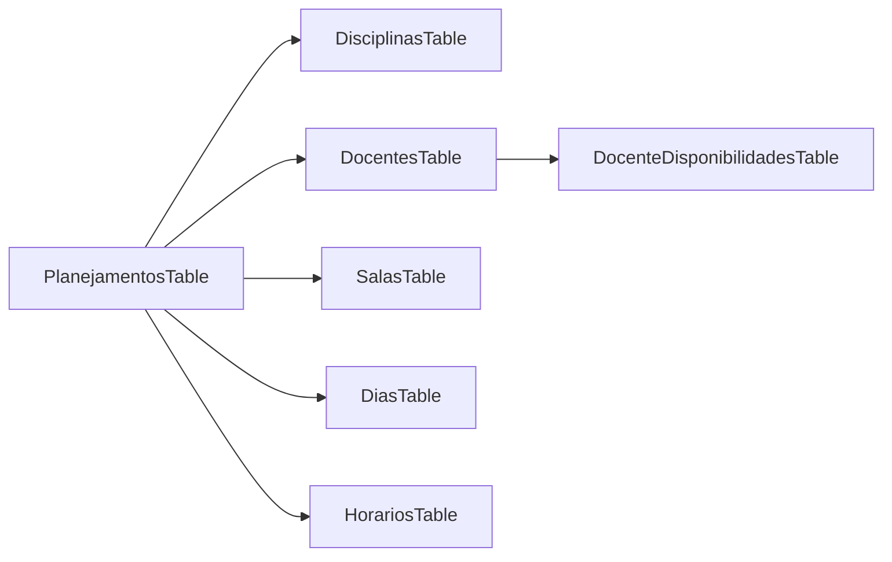

# Core Features

<cite>
**Referenced Files in This Document**
- [README.md](file://README.md)
- [composer.json](file://composer.json)
- [config/app.php](file://config/app.php)
- [src/Application.php](file://src/Application.php)
- [src/Model/Table/PlanejamentosTable.php](file://src/Model/Table/PlanejamentosTable.php)
- [src/Model/Table/DisciplinasTable.php](file://src/Model/Table/DisciplinasTable.php)
- [src/Model/Table/DocentesTable.php](file://src/Model/Table/DocentesTable.php)
- [src/Model/Table/SalasTable.php](file://src/Model/Table/SalasTable.php)
- [src/Model/Table/HorariosTable.php](file://src/Model/Table/HorariosTable.php)
- [src/Model/Table/DiasTable.php](file://src/Model/Table/DiasTable.php)
- [src/Model/Table/DocenteDisponibilidadesTable.php](file://src/Model/Table/DocenteDisponibilidadesTable.php)
- [src/Model/Entity/Planejamento.php](file://src/Model/Entity/Planejamento.php)
- [src/Model/Entity/Disciplina.php](file://src/Model/Entity/Disciplina.php)
- [src/Model/Entity/Docente.php](file://src/Model/Entity/Docente.php)
- [src/Model/Entity/Sala.php](file://src/Model/Entity/Sala.php)
- [src/Model/Entity/Horario.php](file://src/Model/Entity/Horario.php)
- [src/Model/Entity/Dia.php](file://src/Model/Entity/Dia.php)
- [src/Controller/PlanejamentosController.php](file://src/Controller/PlanejamentosController.php)
</cite>

## Table of Contents
1. Introduction
2. Project Structure
3. Core Components
4. Architecture Overview
5. Detailed Component Analysis
6. Dependency Analysis
7. Performance Considerations
8. Troubleshooting Guide
9. Conclusion

## Introduction
This document explains the core features of the planejamento5 academic planning system, focusing on:
- Academic schedule management (planejamentos)
- Faculty administration (docentes)
- Classroom resource management (salas)
- Course definition (disciplinas)
- Time slot scheduling (horarios)
- Day-of-week management (dias)
- Faculty availability (docente_disponibilidades)

It provides both conceptual overviews for users and technical details for developers extending functionality, including business rules, validation constraints, data flows, and integration patterns between features.

## Project Structure
The application follows a standard CakePHP 5 structure with MVC layers:
- Controllers handle HTTP requests and orchestrate domain logic
- Tables define ORM relationships, validation, and query helpers
- Entities represent domain records and field accessibility
- Configuration is centralized under config/
- Middleware handles authentication, authorization, CSRF, and routing

**Diagram sources**
- [src/Application.php:73-122](file://src/Application.php#L73-L122)
- [src/Controller/PlanejamentosController.php:17-67](file://src/Controller/PlanejamentosController.php#L17-L67)

**Section sources**
- [README.md:1-59](file://README.md#L1-L59)
- [composer.json:1-60](file://composer.json#L1-L60)
- [config/app.php:277-343](file://config/app.php#L277-L343)
- [src/Application.php:73-122](file://src/Application.php#L73-L122)

## Core Components
- Planejamento (schedule): central record linking course, faculty, room, day, time slot, and configuration context; includes derived fields like turno and periodo.
- Disciplina (course): defines course metadata, credits, workload, period slots, prerequisites, optional status, department, curriculum code, and notes.
- Docente (faculty): manages personal and employment details, contact info, department, status normalization, and availability linkage.
- Sala (room): simple catalog of rooms.
- Horario (time slot): ordered time slots used to derive turnos and periods.
- Dia (day): ordered days of the week.
- DocenteDisponibilidade (availability): per-faculty availability flags within a planning configuration.

Key responsibilities:
- Validation and normalization at Table layer
- Relationships and joins via ORM
- Derived values computed during controller processing (e.g., turno from horario_id; periodo from disciplina)

**Section sources**
- [src/Model/Table/PlanejamentosTable.php:11-55](file://src/Model/Table/PlanejamentosTable.php#L11-L55)
- [src/Model/Entity/Planejamento.php:13-25](file://src/Model/Entity/Planejamento.php#L13-L25)
- [src/Model/Table/DisciplinasTable.php:15-83](file://src/Model/Table/DisciplinasTable.php#L15-L83)
- [src/Model/Entity/Disciplina.php:33-47](file://src/Model/Entity/Disciplina.php#L33-L47)
- [src/Model/Table/DocentesTable.php:26-125](file://src/Model/Table/DocentesTable.php#L26-L125)
- [src/Model/Entity/Docente.php:37-55](file://src/Model/Entity/Docente.php#L37-L55)
- [src/Model/Table/SalasTable.php:33-58](file://src/Model/Table/SalasTable.php#L33-L58)
- [src/Model/Entity/Sala.php:23-27](file://src/Model/Entity/Sala.php#L23-L27)
- [src/Model/Table/HorariosTable.php:33-63](file://src/Model/Table/HorariosTable.php#L33-L63)
- [src/Model/Entity/Horario.php:24-29](file://src/Model/Entity/Horario.php#L24-L29)
- [src/Model/Table/DiasTable.php:33-63](file://src/Model/Table/DiasTable.php#L33-L63)
- [src/Model/Entity/Dia.php:24-29](file://src/Model/Entity/Dia.php#L24-L29)
- [src/Model/Table/DocenteDisponibilidadesTable.php:13-74](file://src/Model/Table/DocenteDisponibilidadesTable.php#L13-L74)

## Architecture Overview
The system uses CakePHP’s middleware stack for security and request handling, controllers to coordinate operations, and ORM tables for persistence and validation. The main workflow for creating or editing an academic schedule involves selecting a planning configuration, choosing a course and available faculty, assigning a room, day, and time slot, then deriving turno and periodo automatically.

**Diagram sources**
- [src/Controller/PlanejamentosController.php:83-127](file://src/Controller/PlanejamentosController.php#L83-L127)
- [src/Model/Table/DocenteDisponibilidadesTable.php:66-74](file://src/Model/Table/DocenteDisponibilidadesTable.php#L66-L74)
- [src/Model/Table/DocentesTable.php:35-42](file://src/Model/Table/DocentesTable.php#L35-L42)

## Detailed Component Analysis

### Academic Schedule Management (Planejamentos)
Purpose:
- Create, edit, delete, and list academic schedules that bind a course, faculty member, room, day, and time slot within a planning configuration context.

Business rules and derived fields:
- Turno is derived from horario_id: slots 1–4 map to diurno; others map to noturno.
- Periodo is derived from the selected disciplina: prefer periodo_diurno if present; otherwise use periodo_noturno.
- Required fields include disciplina_id and configuraplanejamento_id; other fields are optional.

Validation and relationships:
- Requires integer discipline and configuration IDs; allows empty strings for optional foreign keys.
- Belongs-to relations to Disciplinas, Docentes, Configuraplanejamentos, Salas, Dias, Horarios.

Common operations:
- Add/Edit: populate related lists, compute derived fields, persist entity.
- Index/View: paginate with contains for all related entities; filter by semestre via matching.

**Diagram sources**
- [src/Model/Table/PlanejamentosTable.php:11-55](file://src/Model/Table/PlanejamentosTable.php#L11-L55)
- [src/Model/Entity/Planejamento.php:13-25](file://src/Model/Entity/Planejamento.php#L13-L25)

**Section sources**
- [src/Controller/PlanejamentosController.php:83-127](file://src/Controller/PlanejamentosController.php#L83-L127)
- [src/Controller/PlanejamentosController.php:129-173](file://src/Controller/PlanejamentosController.php#L129-L173)
- [src/Model/Table/PlanejamentosTable.php:11-55](file://src/Model/Table/PlanejamentosTable.php#L11-L55)
- [src/Model/Entity/Planejamento.php:13-25](file://src/Model/Entity/Planejamento.php#L13-L25)

### Faculty Administration (Docentes)
Purpose:
- Maintain faculty profiles and normalize status values across inputs.

Business rules:
- Status normalization maps common variants to canonical values:
  - 'active'/'activo' -> 'ativo'
  - 'retired' -> 'aposentado'
  - 'inactive'/'inactivo' -> 'inativo'

Validation:
- Name required; email validated when present; dates allowed but optional; other fields allow empty strings.

Integration:
- HasMany relationships to Planejamentos and DocenteDisponibilidades.

**Diagram sources**
- [src/Model/Table/DocentesTable.php:114-125](file://src/Model/Table/DocentesTable.php#L114-L125)

**Section sources**
- [src/Model/Table/DocentesTable.php:26-125](file://src/Model/Table/DocentesTable.php#L26-L125)
- [src/Model/Entity/Docente.php:37-55](file://src/Model/Entity/Docente.php#L37-L55)

### Classroom Resource Management (Salas)
Purpose:
- Catalog rooms used for scheduling.

Validation:
- Room name required and limited in length.

**Section sources**
- [src/Model/Table/SalasTable.php:33-58](file://src/Model/Table/SalasTable.php#L33-L58)
- [src/Model/Entity/Sala.php:23-27](file://src/Model/Entity/Sala.php#L23-L27)

### Course Definition (Disciplinas)
Purpose:
- Define courses with attributes such as code, name, credits, workload, period slots, prerequisites, optional status, department, curriculum code, and notes.

Validation:
- Code and name required; credit and workload optional; period slots constrained to specific ranges; optional boolean flag; curriculum code limited to 4 characters.

Relationships:
- HasMany Planejamentos.

**Section sources**
- [src/Model/Table/DisciplinasTable.php:15-83](file://src/Model/Table/DisciplinasTable.php#L15-L83)
- [src/Model/Entity/Disciplina.php:33-47](file://src/Model/Entity/Disciplina.php#L33-L47)

### Time Slot Scheduling (Horarios)
Purpose:
- Define ordered time slots used to derive turno and contribute to period assignment.

Validation:
- Horário text required; ordem integer required.

**Section sources**
- [src/Model/Table/HorariosTable.php:33-63](file://src/Model/Table/HorariosTable.php#L33-L63)
- [src/Model/Entity/Horario.php:24-29](file://src/Model/Entity/Horario.php#L24-L29)

### Day-of-Week Management (Dias)
Purpose:
- Define ordered days of the week.

Validation:
- Dia text required; ordem integer required.

**Section sources**
- [src/Model/Table/DiasTable.php:33-63](file://src/Model/Table/DiasTable.php#L33-L63)
- [src/Model/Entity/Dia.php:24-29](file://src/Model/Entity/Dia.php#L24-L29)

### Faculty Availability (DocenteDisponibilidades)
Purpose:
- Track per-faculty availability within a planning configuration context.

Validation and rules:
- Required: docente_id, configuraplanejamento_id, disponivel (boolean).
- Optional: motivo (max length), observacoes.
- Existence rules ensure referenced docentes and configuraplanejamentos exist.

Query helper:
- findForDocente filters by docente_id when provided.

**Section sources**
- [src/Model/Table/DocenteDisponibilidadesTable.php:13-74](file://src/Model/Table/DocenteDisponibilidadesTable.php#L13-L74)

## Architecture Overview
End-to-end flow for creating a schedule:

**Diagram sources**
- [src/Controller/PlanejamentosController.php:83-127](file://src/Controller/PlanejamentosController.php#L83-L127)
- [src/Model/Table/DocenteDisponibilidadesTable.php:66-74](file://src/Model/Table/DocenteDisponibilidadesTable.php#L66-L74)

## Detailed Component Analysis

### Creating a Schedule (Add Flow)
Steps:
- Load related lists (courses, rooms, days, times, faculty). If a configuration is provided, filter faculty by availability.
- On submit, compute turno from horario_id and periodo from disciplina.
- Persist the schedule and respond with a flash message.

**Diagram sources**
- [src/Controller/PlanejamentosController.php:83-127](file://src/Controller/PlanejamentosController.php#L83-L127)
- [src/Model/Table/DocenteDisponibilidadesTable.php:66-74](file://src/Model/Table/DocenteDisponibilidadesTable.php#L66-L74)

**Section sources**
- [src/Controller/PlanejamentosController.php:83-127](file://src/Controller/PlanejamentosController.php#L83-L127)

### Editing a Schedule (Edit Flow)
Similar to add, but loads existing entity and preserves current docente if it becomes unavailable due to filtering.

**Section sources**
- [src/Controller/PlanejamentosController.php:129-173](file://src/Controller/PlanejamentosController.php#L129-L173)

### Listing and Filtering Schedules (Index)
- Paginates schedules with full associations.
- Supports filtering by semestre via matching Configuraplanejamentos.semestre.

**Section sources**
- [src/Controller/PlanejamentosController.php:17-67](file://src/Controller/PlanejamentosController.php#L17-L67)

### Viewing a Schedule (View)
- Loads a single schedule with all related entities.

**Section sources**
- [src/Controller/PlanejamentosController.php:69-81](file://src/Controller/PlanejamentosController.php#L69-L81)

### Deleting a Schedule (Delete)
- Deletes by ID after method checks and authorization.

**Section sources**
- [src/Controller/PlanejamentosController.php:175-187](file://src/Controller/PlanejamentosController.php#L175-L187)

## Dependency Analysis
High-level dependencies among core components:

**Diagram sources**
- [src/Model/Table/PlanejamentosTable.php:19-39](file://src/Model/Table/PlanejamentosTable.php#L19-L39)
- [src/Model/Table/DocentesTable.php:35-42](file://src/Model/Table/DocentesTable.php#L35-L42)
- [src/Model/Table/DocenteDisponibilidadesTable.php:22-29](file://src/Model/Table/DocenteDisponibilidadesTable.php#L22-L29)

**Section sources**
- [src/Model/Table/PlanejamentosTable.php:19-39](file://src/Model/Table/PlanejamentosTable.php#L19-L39)
- [src/Model/Table/DocentesTable.php:35-42](file://src/Model/Table/DocentesTable.php#L35-L42)
- [src/Model/Table/DocenteDisponibilidadesTable.php:22-29](file://src/Model/Table/DocenteDisponibilidadesTable.php#L22-L29)

## Performance Considerations
- Use pagination for large lists (already applied in index/listar).
- Prefer contains/matching to minimize N+1 queries when rendering views.
- Keep validation rules tight to reduce database writes and retries.
- Avoid unnecessary heavy queries in beforeFilter or list actions; cache static lookups if needed.

[No sources needed since this section provides general guidance]

## Troubleshooting Guide
Common issues and resolutions:
- Missing disciplina selection: controller enforces selection and redirects with an error message.
- Unavailable faculty: when a configuration is selected, only available faculty are shown; if the current faculty becomes unavailable, the controller preserves them for editing.
- Status normalization: input variations for faculty status are normalized; verify expected canonical values.

Operational tips:
- Ensure configured fullBaseUrl and host header settings are correct to avoid security middleware rejections.
- Verify database connection settings in app configuration.

**Section sources**
- [src/Controller/PlanejamentosController.php:107-114](file://src/Controller/PlanejamentosController.php#L107-L114)
- [src/Controller/PlanejamentosController.php:234-242](file://src/Controller/PlanejamentosController.php#L234-L242)
- [src/Model/Table/DocentesTable.php:114-125](file://src/Model/Table/DocentesTable.php#L114-L125)
- [src/Application.php:80-83](file://src/Application.php#L80-L83)
- [config/app.php:277-343](file://config/app.php#L277-L343)

## Conclusion
The planejamento5 system models academic scheduling around a central Planejamento entity linked to courses, faculty, rooms, days, and time slots. Business logic is implemented primarily in controllers for derived fields and in tables for validation and relationships. Faculty availability integrates with planning configurations to constrain scheduling options. The architecture leverages CakePHP’s middleware, ORM, and validation to provide a robust foundation for extending functionality while maintaining clear separation of concerns.