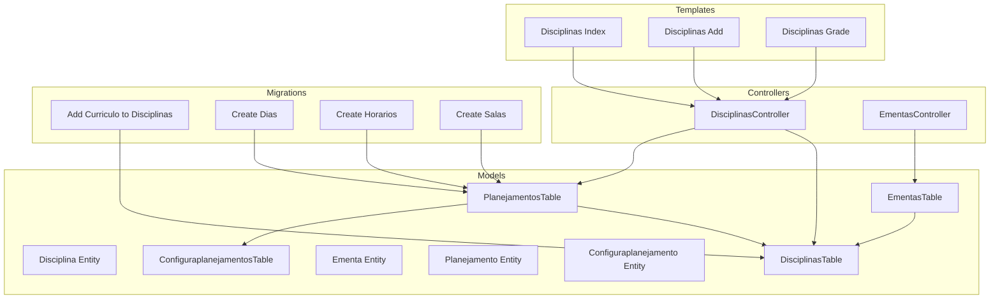
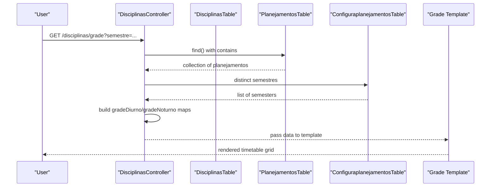
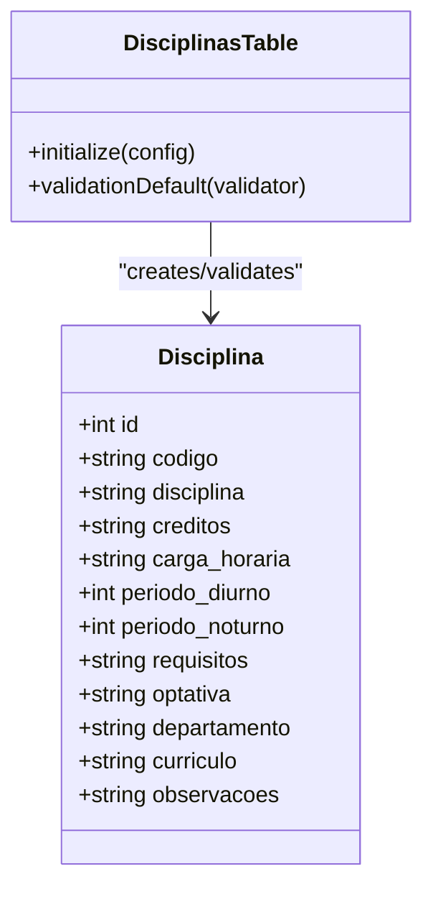
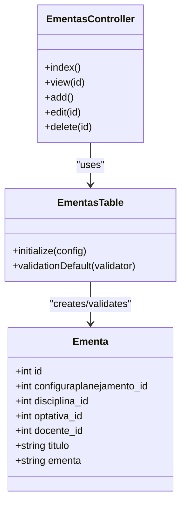
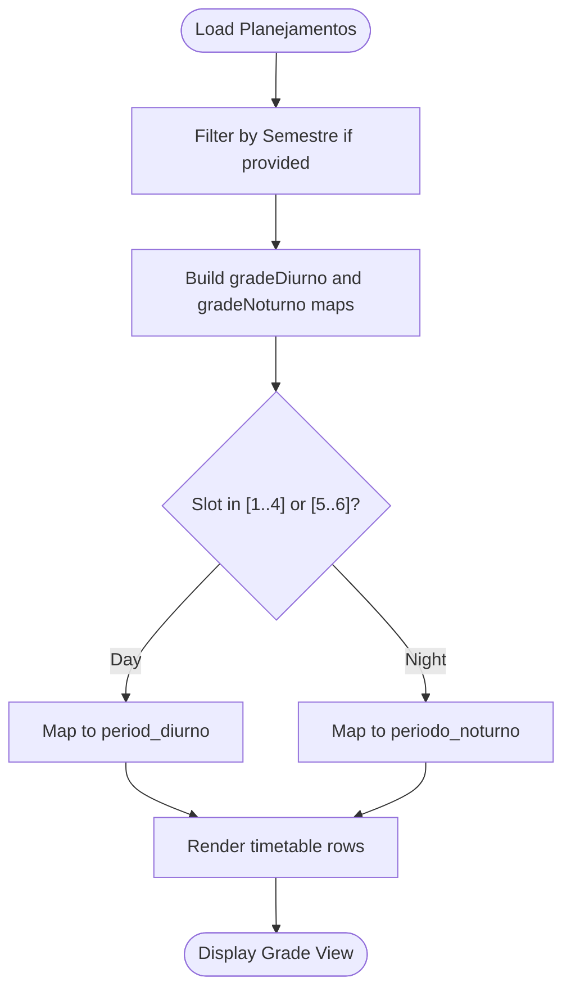
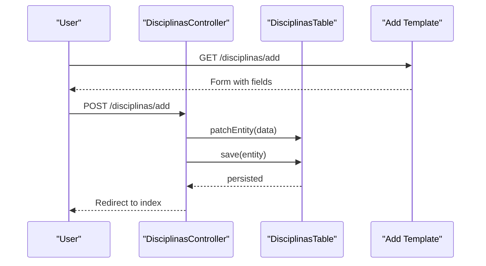
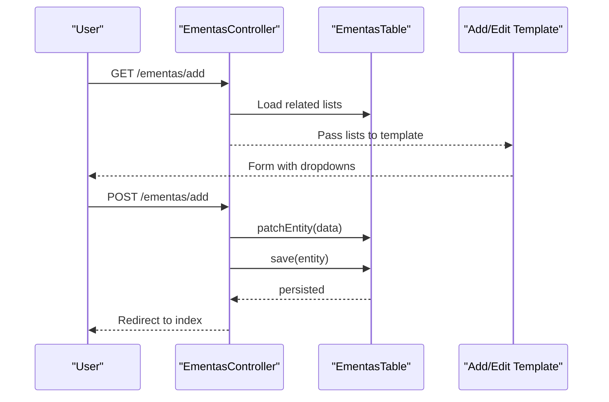
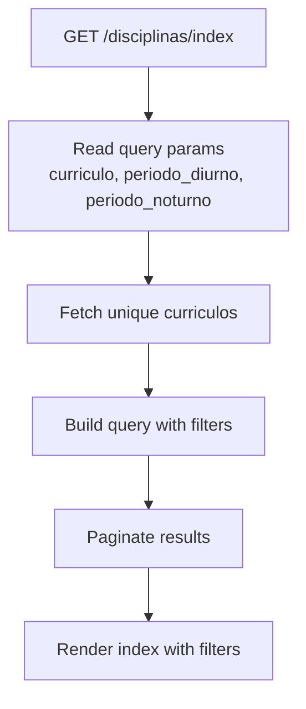
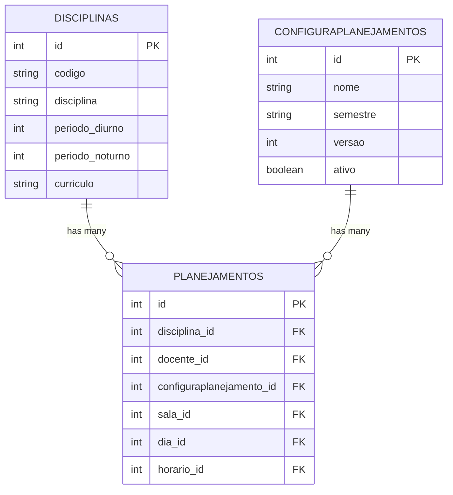
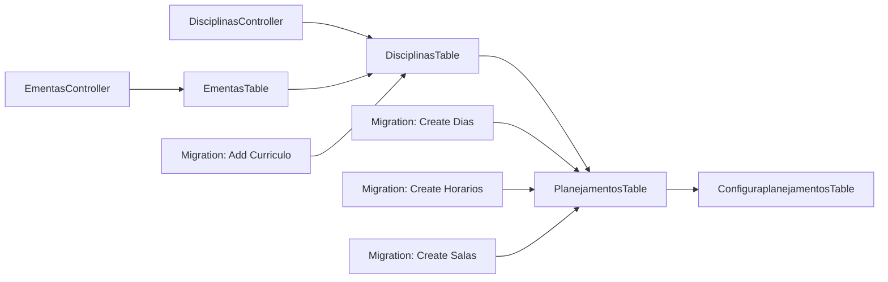

# Course and Curriculum Management

<cite>
**Referenced Files in This Document**
- [Disciplina.php](file://src/Model/Entity/Disciplina.php)
- [Ementa.php](file://src/Model/Entity/Ementa.php)
- [Planejamento.php](file://src/Model/Entity/Planejamento.php)
- [Configuraplanejamento.php](file://src/Model/Entity/Configuraplanejamento.php)
- [DisciplinasTable.php](file://src/Model/Table/DisciplinasTable.php)
- [EmentasTable.php](file://src/Model/Table/EmentasTable.php)
- [PlanejamentosTable.php](file://src/Model/Table/PlanejamentosTable.php)
- [ConfiguraplanejamentosTable.php](file://src/Model/Table/ConfiguraplanejamentosTable.php)
- [DisciplinasController.php](file://src/Controller/DisciplinasController.php)
- [EmentasController.php](file://src/Controller/EmentasController.php)
- [20260618004511_AddCurriculoToDisciplinas.php](file://config/Migrations/20260618004511_AddCurriculoToDisciplinas.php)
- [20260612030430_CreateDias.php](file://config/Migrations/20260612030430_CreateDias.php)
- [20260612030431_CreateHorarios.php](file://config/Migrations/20260612030431_CreateHorarios.php)
- [20260612030432_CreateSalas.php](file://config/Migrations/20260612030432_CreateSalas.php)
- [index.php (Disciplinas)](file://templates/Disciplinas/index.php)
- [add.php (Disciplinas)](file://templates/Disciplinas/add.php)
- [grade.php (Disciplinas)](file://templates/Disciplinas/grade.php)
</cite>

## Table of Contents
1. [Introduction](#introduction)
2. [Project Structure](#project-structure)
3. [Core Components](#core-components)
4. [Architecture Overview](#architecture-overview)
5. [Detailed Component Analysis](#detailed-component-analysis)
6. [Dependency Analysis](#dependency-analysis)
7. [Performance Considerations](#performance-considerations)
8. [Troubleshooting Guide](#troubleshooting-guide)
9. [Conclusion](#conclusion)

## Introduction
This document explains the course and curriculum management system with a focus on the Disciplina entity, curriculum linkage, Ementa (syllabus) management, and how course properties influence scheduling and timetable generation. It also documents configuration options for course periods (day/night), prerequisite handling, and curriculum dependencies, and provides concrete examples from the codebase for creating courses, managing syllabi, and viewing schedules.

## Project Structure
The system follows a typical CakePHP MVC structure:
- Entities define data models and field accessibility.
- Tables define relationships, behaviors, and validation rules.
- Controllers implement CRUD operations and business logic for listing, filtering, and rendering views.
- Templates render user interfaces for adding, editing, listing, and viewing entities.
- Migrations define database schema changes.

**Diagram sources**
- [Disciplina.php:1-49](file://src/Model/Entity/Disciplina.php#L1-L49)
- [DisciplinasTable.php:1-85](file://src/Model/Table/DisciplinasTable.php#L1-L85)
- [Ementa.php:1-34](file://src/Model/Entity/Ementa.php#L1-L34)
- [EmentasTable.php:1-55](file://src/Model/Table/EmentasTable.php#L1-L55)
- [Planejamento.php:1-27](file://src/Model/Entity/Planejamento.php#L1-L27)
- [PlanejamentosTable.php:1-57](file://src/Model/Table/PlanejamentosTable.php#L1-L57)
- [Configuraplanejamento.php:1-23](file://src/Model/Entity/Configuraplanejamento.php#L1-L23)
- [ConfiguraplanejamentosTable.php:1-62](file://src/Model/Table/ConfiguraplanejamentosTable.php#L1-L62)
- [DisciplinasController.php:1-231](file://src/Controller/DisciplinasController.php#L1-L231)
- [EmentasController.php:1-102](file://src/Controller/EmentasController.php#L1-L102)
- [index.php (Disciplinas):1-27](file://templates/Disciplinas/index.php#L1-L27)
- [add.php (Disciplinas):1-26](file://templates/Disciplinas/add.php#L1-L26)
- [grade.php (Disciplinas):62-128](file://templates/Disciplinas/grade.php#L62-L128)
- [20260618004511_AddCurriculoToDisciplinas.php:1-27](file://config/Migrations/20260618004511_AddCurriculoToDisciplinas.php#L1-L27)
- [20260612030430_CreateDias.php:1-40](file://config/Migrations/20260612030430_CreateDias.php#L1-L40)
- [20260612030431_CreateHorarios.php:1-40](file://config/Migrations/20260612030431_CreateHorarios.php#L1-L40)
- [20260612030432_CreateSalas.php:1-35](file://config/Migrations/20260612030432_CreateSalas.php#L1-L35)

**Section sources**
- [Disciplina.php:1-49](file://src/Model/Entity/Disciplina.php#L1-L49)
- [DisciplinasTable.php:1-85](file://src/Model/Table/DisciplinasTable.php#L1-L85)
- [Ementa.php:1-34](file://src/Model/Entity/Ementa.php#L1-L34)
- [EmentasTable.php:1-55](file://src/Model/Table/EmentasTable.php#L1-L55)
- [Planejamento.php:1-27](file://src/Model/Entity/Planejamento.php#L1-L27)
- [PlanejamentosTable.php:1-57](file://src/Model/Table/PlanejamentosTable.php#L1-L57)
- [Configuraplanejamento.php:1-23](file://src/Model/Entity/Configuraplanejamento.php#L1-L23)
- [ConfiguraplanejamentosTable.php:1-62](file://src/Model/Table/ConfiguraplanejamentosTable.php#L1-L62)
- [DisciplinasController.php:1-231](file://src/Controller/DisciplinasController.php#L1-L231)
- [EmentasController.php:1-102](file://src/Controller/EmentasController.php#L1-L102)
- [index.php (Disciplinas):1-27](file://templates/Disciplinas/index.php#L1-L27)
- [add.php (Disciplinas):1-26](file://templates/Disciplinas/add.php#L1-L26)
- [grade.php (Disciplinas):62-128](file://templates/Disciplinas/grade.php#L62-L128)
- [20260618004511_AddCurriculoToDisciplinas.php:1-27](file://config/Migrations/20260618004511_AddCurriculoToDisciplinas.php#L1-L27)
- [20260612030430_CreateDias.php:1-40](file://config/Migrations/20260612030430_CreateDias.php#L1-L40)
- [20260612030431_CreateHorarios.php:1-40](file://config/Migrations/20260612030431_CreateHorarios.php#L1-L40)
- [20260612030432_CreateSalas.php:1-35](file://config/Migrations/20260612030432_CreateSalas.php#L1-L35)

## Core Components
- Disciplina (Course): Represents a course with attributes such as code, name, credits, workload, allowed periods (day/night), prerequisites, optional status, department, curriculum identifier, and notes.
- Ementa (Syllabus): A syllabus record linked to a planning configuration, a course, an elective (optional), and a teacher.
- Planejamento (Schedule Entry): A concrete scheduling instance linking a course, teacher, room, day, time slot, and planning configuration.
- Configuraplanejamento (Planning Configuration): Identifies a semester/version context used to group schedule entries.

Key relationships:
- Ementas belongs to Disciplinas, Configuraplanejamentos, Optativas, Docentes.
- Planejamentos belongs to Disciplinas, Docentes, Configuraplanejamentos, Salas, Dias, Horarios.
- Disciplinas has many Planejamentos.

Validation and constraints:
- Periods are constrained to specific ranges for day and night shifts.
- Curriculum is a short string field used to group courses into curricula.

**Section sources**
- [Disciplina.php:1-49](file://src/Model/Entity/Disciplina.php#L1-L49)
- [DisciplinasTable.php:29-83](file://src/Model/Table/DisciplinasTable.php#L29-L83)
- [Ementa.php:1-34](file://src/Model/Entity/Ementa.php#L1-L34)
- [EmentasTable.php:11-53](file://src/Model/Table/EmentasTable.php#L11-L53)
- [Planejamento.php:1-27](file://src/Model/Entity/Planejamento.php#L1-L27)
- [PlanejamentosTable.php:11-55](file://src/Model/Table/PlanejamentosTable.php#L11-L55)
- [Configuraplanejamento.php:1-23](file://src/Model/Entity/Configuraplanejamento.php#L1-L23)
- [ConfiguraplanejamentosTable.php:11-61](file://src/Model/Table/ConfiguraplanejamentosTable.php#L11-L61)

## Architecture Overview
The system exposes controllers for courses and syllabi, which interact with tables to persist and retrieve data. The grade view aggregates schedule entries by period and time slot to produce a timetable-like display.

**Diagram sources**
- [DisciplinasController.php:73-171](file://src/Controller/DisciplinasController.php#L73-L171)
- [PlanejamentosTable.php:11-40](file://src/Model/Table/PlanejamentosTable.php#L11-L40)
- [ConfiguraplanejamentosTable.php:11-31](file://src/Model/Table/ConfiguraplanejamentosTable.php#L11-L31)
- [grade.php (Disciplinas):93-128](file://templates/Disciplinas/grade.php#L93-L128)

## Detailed Component Analysis

### Disciplina (Course) Model and Validation
- Fields include identifiers, academic metadata, period availability, prerequisites, optional flag, department, curriculum, and notes.
- Validation enforces presence and length limits for code and name, numeric ranges for periods, and optional fields for other attributes.
- Accessible fields allow mass assignment via form submissions.

**Diagram sources**
- [Disciplina.php:1-49](file://src/Model/Entity/Disciplina.php#L1-L49)
- [DisciplinasTable.php:15-83](file://src/Model/Table/DisciplinasTable.php#L15-L83)

**Section sources**
- [Disciplina.php:1-49](file://src/Model/Entity/Disciplina.php#L1-L49)
- [DisciplinasTable.php:29-83](file://src/Model/Table/DisciplinasTable.php#L29-L83)

### Ementa (Syllabus) Management
- Syllabus records link to a planning configuration, a course, optionally an elective, and a teacher.
- Controller supports listing, viewing, adding, editing, and deleting syllabi, loading related lists for dropdowns.

**Diagram sources**
- [Ementa.php:1-34](file://src/Model/Entity/Ementa.php#L1-L34)
- [EmentasTable.php:11-53](file://src/Model/Table/EmentasTable.php#L11-L53)
- [EmentasController.php:1-102](file://src/Controller/EmentasController.php#L1-L102)

**Section sources**
- [Ementa.php:1-34](file://src/Model/Entity/Ementa.php#L1-L34)
- [EmentasTable.php:11-53](file://src/Model/Table/EmentasTable.php#L11-L53)
- [EmentasController.php:1-102](file://src/Controller/EmentasController.php#L1-L102)

### Scheduling Integration and Timetable Generation
- Schedule entries (Planejamentos) connect courses, teachers, rooms, days, time slots, and planning configurations.
- The grade view groups entries by period and time slot to render a timetable grid for day and night shifts.
- Day and night shift time slots are distinguished by ID ranges; course period availability determines placement.

**Diagram sources**
- [DisciplinasController.php:111-132](file://src/Controller/DisciplinasController.php#L111-L132)
- [grade.php (Disciplinas):119-128](file://templates/Disciplinas/grade.php#L119-L128)

**Section sources**
- [PlanejamentosTable.php:11-40](file://src/Model/Table/PlanejamentosTable.php#L11-L40)
- [DisciplinasController.php:73-171](file://src/Controller/DisciplinasController.php#L73-L171)
- [grade.php (Disciplinas):93-128](file://templates/Disciplinas/grade.php#L93-L128)

### Course Creation Workflow Example
- The add form collects course attributes including curriculum, periods, prerequisites, and department.
- The controller persists the entity using patch/save and redirects after success.

**Diagram sources**
- [add.php (Disciplinas):1-26](file://templates/Disciplinas/add.php#L1-L26)
- [DisciplinasController.php:180-195](file://src/Controller/DisciplinasController.php#L180-L195)

**Section sources**
- [add.php (Disciplinas):1-26](file://templates/Disciplinas/add.php#L1-L26)
- [DisciplinasController.php:180-195](file://src/Controller/DisciplinasController.php#L180-L195)

### Syllabus Management Workflow Example
- The add/edit forms load related lists (planning config, course, elective, teacher).
- The controller persists the syllabus and redirects upon success.

**Diagram sources**
- [EmentasController.php:41-63](file://src/Controller/EmentasController.php#L41-L63)

**Section sources**
- [EmentasController.php:41-63](file://src/Controller/EmentasController.php#L41-L63)

### Curriculum Dependencies and Filtering
- Courses can be grouped by curriculum using the curriculo field.
- The index action supports filtering by curriculum and by period availability (day/night).
- Unique curriculum values are fetched for dropdown selection.

**Diagram sources**
- [DisciplinasController.php:20-71](file://src/Controller/DisciplinasController.php#L20-L71)
- [index.php (Disciplinas):1-27](file://templates/Disciplinas/index.php#L1-L27)

**Section sources**
- [DisciplinasController.php:20-71](file://src/Controller/DisciplinasController.php#L20-L71)
- [index.php (Disciplinas):1-27](file://templates/Disciplinas/index.php#L1-L27)

### Configuration Options for Course Periods and Prerequisites
- Periods:
  - Day shift: integer values 1–8.
  - Night shift: integer values 1–10.
- Prerequisites: stored as a scalar field (requisitos), allowing free-form text descriptions.
- Curriculum: short string field (up to 4 characters) used to group courses.

**Section sources**
- [DisciplinasTable.php:51-76](file://src/Model/Table/DisciplinasTable.php#L51-L76)
- [20260618004511_AddCurriculoToDisciplinas.php:16-25](file://config/Migrations/20260618004511_AddCurriculoToDisciplinas.php#L16-L25)

### Relationship with Scheduling System and Timetable Impact
- Course period availability directly affects where a course appears in the timetable:
  - If a schedule entry’s time slot falls within day IDs (1–4), it must match the course’s day period.
  - If within night IDs (5–6), it must match the course’s night period.
- Planning configuration ties schedule entries to a semester/version context.

**Diagram sources**
- [DisciplinasTable.php:15-27](file://src/Model/Table/DisciplinasTable.php#L15-L27)
- [PlanejamentosTable.php:11-40](file://src/Model/Table/PlanejamentosTable.php#L11-L40)
- [ConfiguraplanejamentosTable.php:11-31](file://src/Model/Table/ConfiguraplanejamentosTable.php#L11-L31)

**Section sources**
- [DisciplinasController.php:111-132](file://src/Controller/DisciplinasController.php#L111-L132)
- [PlanejamentosTable.php:11-40](file://src/Model/Table/PlanejamentosTable.php#L11-L40)
- [ConfiguraplanejamentosTable.php:11-31](file://src/Model/Table/ConfiguraplanejamentosTable.php#L11-L31)

## Dependency Analysis
- Controllers depend on their respective tables for persistence and queries.
- Tables declare relationships to other tables (e.g., Planejamentos depends on Disciplinas, Docentes, Configuraplanejamentos, Salas, Dias, Horarios).
- Migrations ensure schema alignment for new fields like curriculo and foundational entities like dias, horarios, salas.

**Diagram sources**
- [DisciplinasController.php:1-231](file://src/Controller/DisciplinasController.php#L1-L231)
- [EmentasController.php:1-102](file://src/Controller/EmentasController.php#L1-L102)
- [DisciplinasTable.php:15-27](file://src/Model/Table/DisciplinasTable.php#L15-L27)
- [EmentasTable.php:11-34](file://src/Model/Table/EmentasTable.php#L11-L34)
- [PlanejamentosTable.php:11-40](file://src/Model/Table/PlanejamentosTable.php#L11-L40)
- [ConfiguraplanejamentosTable.php:11-31](file://src/Model/Table/ConfiguraplanejamentosTable.php#L11-L31)
- [20260618004511_AddCurriculoToDisciplinas.php:16-25](file://config/Migrations/20260618004511_AddCurriculoToDisciplinas.php#L16-L25)
- [20260612030430_CreateDias.php:16-37](file://config/Migrations/20260612030430_CreateDias.php#L16-L37)
- [20260612030431_CreateHorarios.php:16-37](file://config/Migrations/20260612030431_CreateHorarios.php#L16-L37)
- [20260612030432_CreateSalas.php:16-32](file://config/Migrations/20260612030432_CreateSalas.php#L16-L32)

**Section sources**
- [DisciplinasController.php:1-231](file://src/Controller/DisciplinasController.php#L1-L231)
- [EmentasController.php:1-102](file://src/Controller/EmentasController.php#L1-L102)
- [DisciplinasTable.php:15-27](file://src/Model/Table/DisciplinasTable.php#L15-L27)
- [EmentasTable.php:11-34](file://src/Model/Table/EmentasTable.php#L11-L34)
- [PlanejamentosTable.php:11-40](file://src/Model/Table/PlanejamentosTable.php#L11-L40)
- [ConfiguraplanejamentosTable.php:11-31](file://src/Model/Table/ConfiguraplanejamentosTable.php#L11-L31)
- [20260618004511_AddCurriculoToDisciplinas.php:16-25](file://config/Migrations/20260618004511_AddCurriculoToDisciplinas.php#L16-L25)
- [20260612030430_CreateDias.php:16-37](file://config/Migrations/20260612030430_CreateDias.php#L16-L37)
- [20260612030431_CreateHorarios.php:16-37](file://config/Migrations/20260612030431_CreateHorarios.php#L16-L37)
- [20260612030432_CreateSalas.php:16-32](file://config/Migrations/20260612030432_CreateSalas.php#L16-L32)

## Performance Considerations
- Use pagination for large lists (already applied in controllers).
- Limit contains to only needed associations when building grade views to reduce N+1 queries.
- Cache frequently accessed reference data (dias, horarios, salas) if they change infrequently.
- Avoid unnecessary distinct queries; leverage database indexes on filtered columns (e.g., curriculo, periodo_diurno, periodo_noturno).

[No sources needed since this section provides general guidance]

## Troubleshooting Guide
Common issues and resolutions:
- Curriculum conflicts:
  - Symptom: Courses appear under wrong curriculum filters or not at all.
  - Resolution: Ensure curriculo values are consistent and non-null for intended grouping; verify filter parameters in the index action.
- Period mismatch in timetable:
  - Symptom: A course does not show in the expected day/night grid.
  - Resolution: Confirm that the schedule entry’s time slot ID aligns with the course’s period availability (day vs night) and that the course has the corresponding period set.
- Missing prerequisites information:
  - Symptom: Students cannot see required prior courses.
  - Resolution: Populate the requisitos field for each course; consider extending validation or UI hints to guide users.
- Syllabus not linked correctly:
  - Symptom: Syllabus shows no course or teacher.
  - Resolution: Verify foreign keys (disciplina_id, docente_id, configuraplanejamento_id) when creating or editing the syllabus.

**Section sources**
- [DisciplinasController.php:20-71](file://src/Controller/DisciplinasController.php#L20-L71)
- [DisciplinasController.php:111-132](file://src/Controller/DisciplinasController.php#L111-L132)
- [EmentasController.php:41-63](file://src/Controller/EmentasController.php#L41-L63)

## Conclusion
The system provides robust course and curriculum management through well-defined entities and tables, clear validation rules, and practical controllers for CRUD operations. The Ementa module enables syllabus administration tied to planning contexts. Scheduling integration leverages course period availability to generate accurate timetables. By adhering to the documented configuration options and relationships, administrators can maintain coherent curricula and avoid common scheduling conflicts.