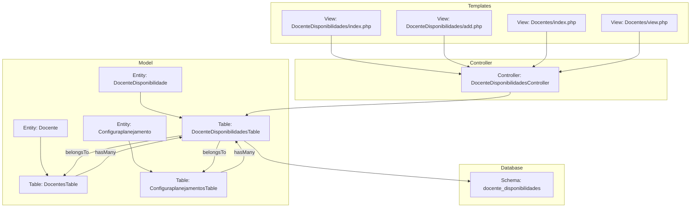
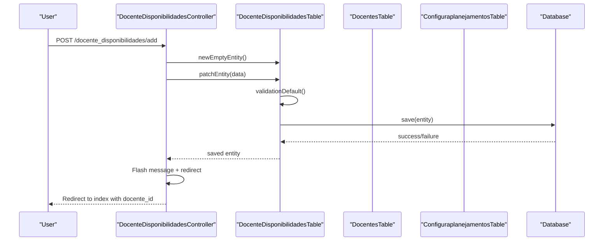
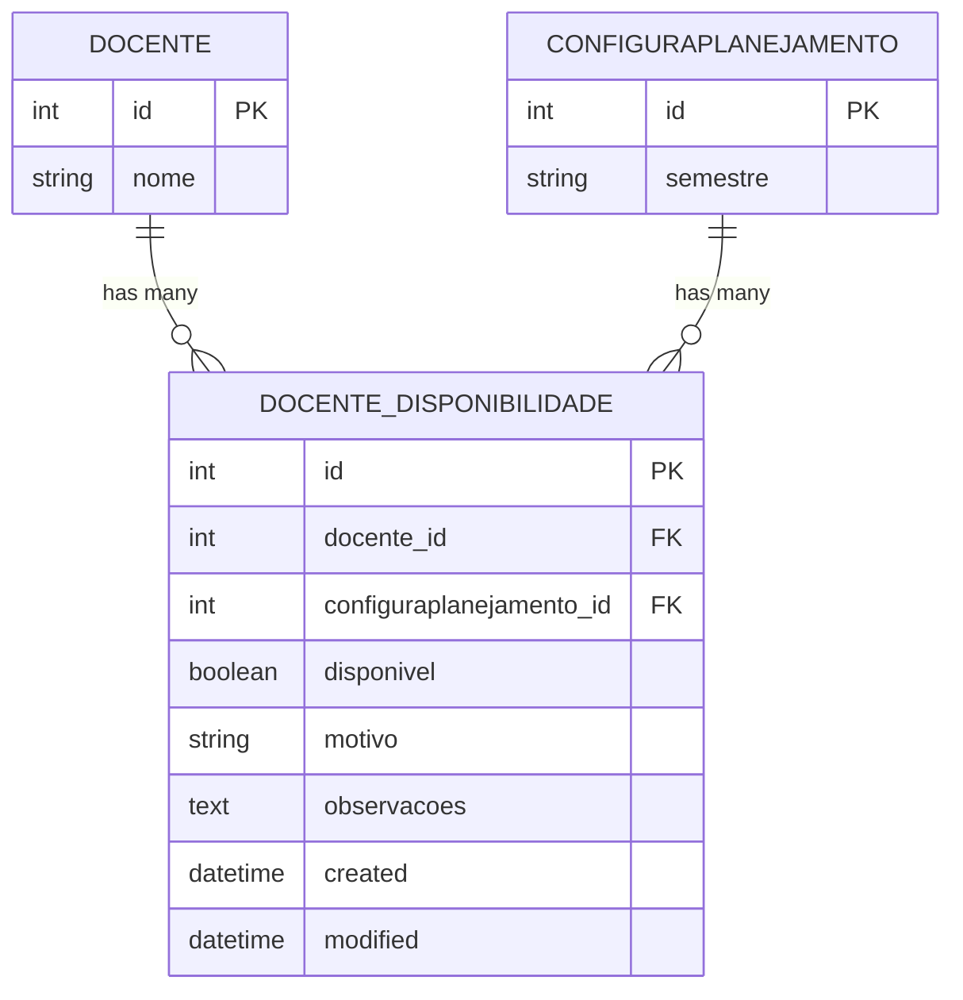
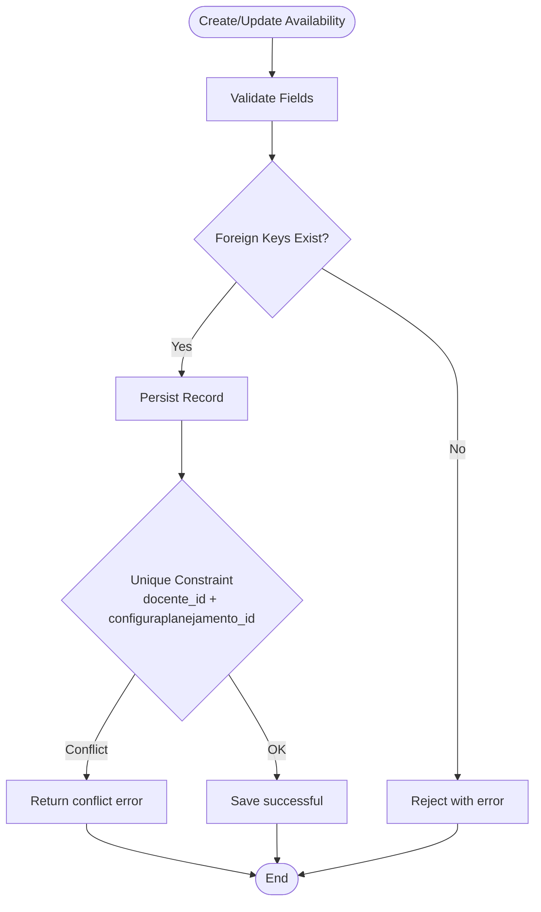
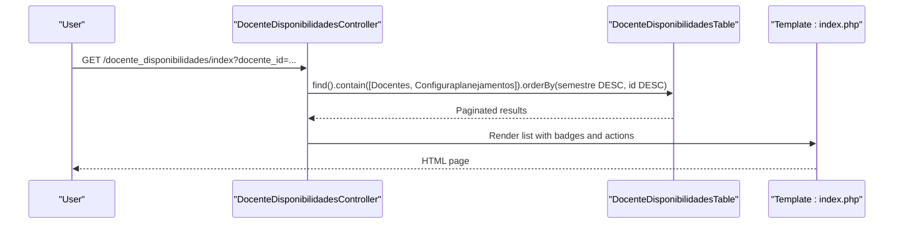
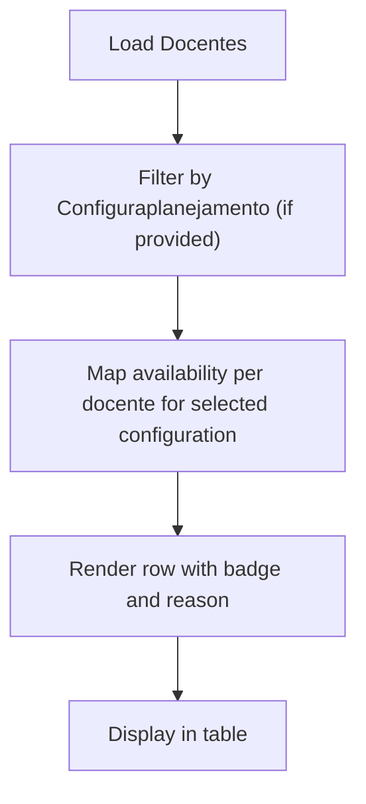
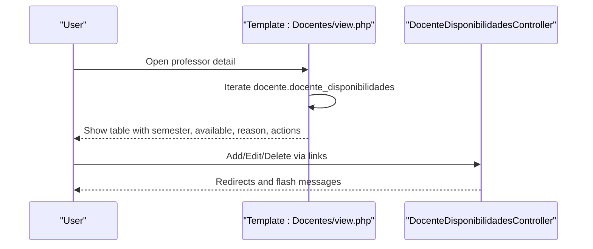
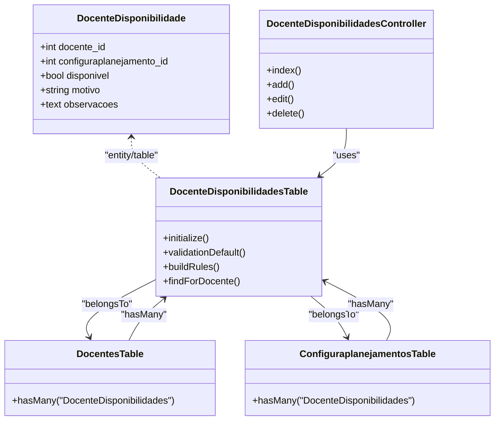

# Faculty Availability Management

<cite>
**Referenced Files in This Document**
- [DocenteDisponibilidade.php](file://src/Model/Entity/DocenteDisponibilidade.php)
- [DocenteDisponibilidadesTable.php](file://src/Model/Table/DocenteDisponibilidadesTable.php)
- [DocenteDisponibilidadesController.php](file://src/Controller/DocenteDisponibilidadesController.php)
- [20260613100000_CreateDocenteDisponibilidades.php](file://config/Migrations/20260613100000_CreateDocenteDisponibilidades.php)
- [Configuraplanejamento.php](file://src/Model/Entity/Configuraplanejamento.php)
- [ConfiguraplanejamentosTable.php](file://src/Model/Table/ConfiguraplanejamentosTable.php)
- [Docente.php](file://src/Model/Entity/Docente.php)
- [DocentesTable.php](file://src/Model/Table/DocentesTable.php)
- [index.php (DocenteDisponibilidades)](file://templates/DocenteDisponibilidades/index.php)
- [add.php (DocenteDisponibilidades)](file://templates/DocenteDisponibilidades/add.php)
- [index.php (Docentes)](file://templates/Docentes/index.php)
- [view.php (Docentes)](file://templates/Docentes/view.php)
</cite>

## Table of Contents
1. [Introduction](#introduction)
2. [Project Structure](#project-structure)
3. [Core Components](#core-components)
4. [Architecture Overview](#architecture-overview)
5. [Detailed Component Analysis](#detailed-component-analysis)
6. [Dependency Analysis](#dependency-analysis)
7. [Performance Considerations](#performance-considerations)
8. [Troubleshooting Guide](#troubleshooting-guide)
9. [Conclusion](#conclusion)
10. [Appendices](#appendices)

## Introduction
This document explains the faculty availability management system with a focus on the DocenteDisponibilidade entity and its relationship to Configuraplanejamento for semester-specific availability tracking. It covers how availability is set per planning configuration, how multiple semesters are supported, and how conflicts are prevented at the database level. It also documents the workflow for creating, updating, and querying availability records, as well as how availability is displayed inline on the main faculty listing page. Finally, it outlines validation constraints, business rules, and common issues such as overlapping availability and their resolution strategies.

## Project Structure
The availability feature follows CakePHP conventions:
- Entity and Table layers define data access, relationships, and validation.
- Controller handles HTTP requests and orchestrates persistence.
- Templates render lists, forms, and views.
- Migrations define the database schema and constraints.

**Diagram sources**
- [DocenteDisponibilidade.php:1-22](file://src/Model/Entity/DocenteDisponibilidade.php#L1-L22)
- [DocenteDisponibilidadesTable.php:1-77](file://src/Model/Table/DocenteDisponibilidadesTable.php#L1-L77)
- [Docente.php:1-57](file://src/Model/Entity/Docente.php#L1-L57)
- [DocentesTable.php:1-126](file://src/Model/Table/DocentesTable.php#L1-L126)
- [Configuraplanejamento.php:1-23](file://src/Model/Entity/Configuraplanejamento.php#L1-L23)
- [ConfiguraplanejamentosTable.php:1-62](file://src/Model/Table/ConfiguraplanejamentosTable.php#L1-L62)
- [DocenteDisponibilidadesController.php:1-118](file://src/Controller/DocenteDisponibilidadesController.php#L1-L118)
- [index.php (DocenteDisponibilidades):1-61](file://templates/DocenteDisponibilidades/index.php#L1-L61)
- [add.php (DocenteDisponibilidades):1-21](file://templates/DocenteDisponibilidades/add.php#L1-L21)
- [index.php (Docentes):1-166](file://templates/Docentes/index.php#L1-L166)
- [view.php (Docentes):100-125](file://templates/Docentes/view.php#L100-L125)

**Section sources**
- [DocenteDisponibilidade.php:1-22](file://src/Model/Entity/DocenteDisponibilidade.php#L1-L22)
- [DocenteDisponibilidadesTable.php:1-77](file://src/Model/Table/DocenteDisponibilidadesTable.php#L1-L77)
- [DocenteDisponibilidadesController.php:1-118](file://src/Controller/DocenteDisponibilidadesController.php#L1-L118)
- [index.php (DocenteDisponibilidades):1-61](file://templates/DocenteDisponibilidades/index.php#L1-L61)
- [add.php (DocenteDisponibilidades):1-21](file://templates/DocenteDisponibilidades/add.php#L1-L21)
- [index.php (Docentes):1-166](file://templates/Docentes/index.php#L1-L166)
- [view.php (Docentes):100-125](file://templates/Docentes/view.php#L100-L125)

## Core Components
- DocenteDisponibilidade entity defines accessible fields for mass assignment and exposes related associations (docente, configuraplanejamento).
- DocenteDisponibilidadesTable configures table metadata, behaviors, belongsTo associations to Docentes and Configuraplanejamentos, validation rules, and existence rules.
- DocenteDisponibilidadesController provides CRUD endpoints with authorization handling, prefilling from query parameters, pagination, and flash messages.
- Templates provide list and add forms, and display availability inline on the faculty index view.

Key responsibilities:
- Data integrity via validation and existence checks.
- Semester scoping through Configuraplanejamento.semestre.
- Inline availability display on the faculty listing by joining or mapping availability per professor and selected planning configuration.

**Section sources**
- [DocenteDisponibilidade.php:1-22](file://src/Model/Entity/DocenteDisponibilidade.php#L1-L22)
- [DocenteDisponibilidadesTable.php:1-77](file://src/Model/Table/DocenteDisponibilidadesTable.php#L1-L77)
- [DocenteDisponibilidadesController.php:1-118](file://src/Controller/DocenteDisponibilidadesController.php#L1-L118)
- [index.php (DocenteDisponibilidades):1-61](file://templates/DocenteDisponibilidades/index.php#L1-L61)
- [add.php (DocenteDisponibilidades):1-21](file://templates/DocenteDisponibilidades/add.php#L1-L21)
- [index.php (Docentes):1-166](file://templates/Docentes/index.php#L1-L166)

## Architecture Overview
Availability is scoped per planning configuration (semester). Each professor can have one availability record per planning configuration due to a unique constraint. The controller manages creation, update, deletion, and listing. Views present availability inline on the faculty index and detail pages.

**Diagram sources**
- [DocenteDisponibilidadesController.php:44-75](file://src/Controller/DocenteDisponibilidadesController.php#L44-L75)
- [DocenteDisponibilidadesTable.php:32-64](file://src/Model/Table/DocenteDisponibilidadesTable.php#L32-L64)
- [20260613100000_CreateDocenteDisponibilidades.php:1-48](file://config/Migrations/20260613100000_CreateDocenteDisponibilidades.php#L1-L48)

## Detailed Component Analysis

### Database Schema and Relationships
- Table: docente_disponibilidades
  - Columns: id (PK), docente_id (FK), configuraplanejamento_id (FK), disponivel (boolean default true), motivo (string max 100), observacoes (text), created, modified
  - Indexes: docente_id, configuraplanejamento_id, unique(docente_id, configuraplanejamento_id)
- Relationships:
  - belongsTo Docentes (via docente_id)
  - belongsTo Configuraplanejamentos (via configuraplanejamento_id)
  - Docentes hasMany DocenteDisponibilidades
  - Configuraplanejamentos hasMany DocenteDisponibilidades

**Diagram sources**
- [20260613100000_CreateDocenteDisponibilidades.php:1-48](file://config/Migrations/20260613100000_CreateDocenteDisponibilidades.php#L1-L48)
- [DocenteDisponibilidadesTable.php:22-30](file://src/Model/Table/DocenteDisponibilidadesTable.php#L22-L30)
- [DocentesTable.php:35-42](file://src/Model/Table/DocentesTable.php#L35-L42)
- [ConfiguraplanejamentosTable.php:24-31](file://src/Model/Table/ConfiguraplanejamentosTable.php#L24-L31)

**Section sources**
- [20260613100000_CreateDocenteDisponibilidades.php:1-48](file://config/Migrations/20260613100000_CreateDocenteDisponibilidades.php#L1-L48)
- [DocenteDisponibilidadesTable.php:13-30](file://src/Model/Table/DocenteDisponibilidadesTable.php#L13-L30)
- [DocentesTable.php:35-42](file://src/Model/Table/DocentesTable.php#L35-L42)
- [ConfiguraplanejamentosTable.php:24-31](file://src/Model/Table/ConfiguraplanejamentosTable.php#L24-L31)

### Entity and Validation Rules
- Accessible fields include foreign keys, status flag, reason, notes, timestamps, and associated entities.
- Validation:
  - docente_id must be integer and not empty
  - configuraplanejamento_id must be integer and not empty
  - disponivel must be boolean and not empty
  - motivo optional scalar with max length 100
  - observacoes optional scalar
- Existence rules enforce referential integrity to Docentes and Configuraplanejamentos.

**Diagram sources**
- [DocenteDisponibilidadesTable.php:32-64](file://src/Model/Table/DocenteDisponibilidadesTable.php#L32-L64)
- [20260613100000_CreateDocenteDisponibilidades.php:42-45](file://config/Migrations/20260613100000_CreateDocenteDisponibilidades.php#L42-L45)

**Section sources**
- [DocenteDisponibilidade.php:10-20](file://src/Model/Entity/DocenteDisponibilidade.php#L10-L20)
- [DocenteDisponibilidadesTable.php:32-64](file://src/Model/Table/DocenteDisponibilidadesTable.php#L32-L64)

### Controller Workflow
- Index: Lists all availability records with contains for Docente and Configuraplanejamento, ordered by semester descending then id descending; supports filtering by docente_id via query parameter.
- Add: Pre-fills docente_id and configuraplanejamento_id from query params; validates and saves; redirects back to index with docente_id filter.
- Edit: Loads existing record, patches, saves, redirects similarly.
- Delete: Removes record and redirects to index filtered by original docente_id.

**Diagram sources**
- [DocenteDisponibilidadesController.php:17-34](file://src/Controller/DocenteDisponibilidadesController.php#L17-L34)
- [index.php (DocenteDisponibilidades):1-61](file://templates/DocenteDisponibilidades/index.php#L1-L61)

**Section sources**
- [DocenteDisponibilidadesController.php:17-116](file://src/Controller/DocenteDisponibilidadesController.php#L17-L116)
- [index.php (DocenteDisponibilidades):1-61](file://templates/DocenteDisponibilidades/index.php#L1-L61)

### Integration with Faculty Listing Page
- The Docentes index template shows an inline “Disponibilidade” column that reflects availability for the current planning configuration context.
- If an availability record exists for the professor and selected configuration, it displays Yes/No and optionally the reason.
- If no record exists, it shows “Not provided”.

**Diagram sources**
- [index.php (Docentes):106-138](file://templates/Docentes/index.php#L106-L138)

**Section sources**
- [index.php (Docentes):106-138](file://templates/Docentes/index.php#L106-L138)

### Viewing and Managing Availability per Professor
- The Docentes view template includes a section titled “Disponibilidade por Semestre” that lists each professor’s availability across configurations, with links to add/edit/delete.

**Diagram sources**
- [view.php (Docentes):100-125](file://templates/Docentes/view.php#L100-L125)
- [DocenteDisponibilidadesController.php:44-116](file://src/Controller/DocenteDisponibilidadesController.php#L44-L116)

**Section sources**
- [view.php (Docentes):100-125](file://templates/Docentes/view.php#L100-L125)
- [DocenteDisponibilidadesController.php:44-116](file://src/Controller/DocenteDisponibilidadesController.php#L44-L116)

## Dependency Analysis
- DocenteDisponibilidadesTable depends on Docentes and Configuraplanejamentos via belongsTo associations.
- DocentesTable declares hasMany DocenteDisponibilidades.
- ConfiguraplanejamentosTable declares hasMany DocenteDisponibilidades.
- Controller uses fetchTable to access models and orchestrate operations.
- Templates consume controller-provided data and render availability inline.

**Diagram sources**
- [DocenteDisponibilidade.php:1-22](file://src/Model/Entity/DocenteDisponibilidade.php#L1-L22)
- [DocenteDisponibilidadesTable.php:13-30](file://src/Model/Table/DocenteDisponibilidadesTable.php#L13-L30)
- [DocentesTable.php:35-42](file://src/Model/Table/DocentesTable.php#L35-L42)
- [ConfiguraplanejamentosTable.php:24-31](file://src/Model/Table/ConfiguraplanejamentosTable.php#L24-L31)
- [DocenteDisponibilidadesController.php:17-116](file://src/Controller/DocenteDisponibilidadesController.php#L17-L116)

**Section sources**
- [DocenteDisponibilidadesTable.php:13-30](file://src/Model/Table/DocenteDisponibilidadesTable.php#L13-L30)
- [DocentesTable.php:35-42](file://src/Model/Table/DocentesTable.php#L35-L42)
- [ConfiguraplanejamentosTable.php:24-31](file://src/Model/Table/ConfiguraplanejamentosTable.php#L24-L31)
- [DocenteDisponibilidadesController.php:17-116](file://src/Controller/DocenteDisponibilidadesController.php#L17-L116)

## Performance Considerations
- Use contains to eager-load Docente and Configuraplanejamento when listing availability to avoid N+1 queries.
- Leverage indexes on docente_id and configuraplanejamento_id for fast lookups and joins.
- The unique constraint on (docente_id, configuraplanejamento_id) prevents duplicate records per professor per semester, ensuring O(1) lookup semantics for availability per professor per configuration.
- Pagination reduces payload size for large datasets.

[No sources needed since this section provides general guidance]

## Troubleshooting Guide
Common issues and resolutions:
- Duplicate availability per professor per semester:
  - Cause: Attempting to create a second record for the same (docente_id, configuraplanejamento_id).
  - Resolution: Update the existing record instead of creating a new one. The unique constraint will reject duplicates.
- Missing professor or semester reference:
  - Cause: Foreign key does not exist in referenced tables.
  - Resolution: Ensure valid docente_id and configuraplanejamento_id values before saving.
- Invalid form data:
  - Cause: Missing required fields or invalid types.
  - Resolution: Provide required fields (docente_id, configuraplanejamento_id, disponivel) and ensure correct types.
- Inline availability not showing on faculty index:
  - Cause: No availability record for the selected planning configuration.
  - Resolution: Create an availability record for the professor and the chosen configuration.

Operational tips:
- When adding availability, prefill docente_id and configuraplanejamento_id via query parameters to streamline user input.
- After save/update/delete, the controller redirects to the index filtered by docente_id for consistent navigation.

**Section sources**
- [20260613100000_CreateDocenteDisponibilidades.php:42-45](file://config/Migrations/20260613100000_CreateDocenteDisponibilidades.php#L42-L45)
- [DocenteDisponibilidadesTable.php:32-64](file://src/Model/Table/DocenteDisponibilidadesTable.php#L32-L64)
- [DocenteDisponibilidadesController.php:44-116](file://src/Controller/DocenteDisponibilidadesController.php#L44-L116)
- [index.php (Docentes):106-138](file://templates/Docentes/index.php#L106-L138)

## Conclusion
The faculty availability management system provides a robust, semester-scoped way to track professor availability using a simple boolean flag and supporting metadata. The unique constraint ensures one availability record per professor per planning configuration, preventing overlaps. The controller and templates offer straightforward CRUD operations and inline visibility on the faculty listing. Validation and existence rules maintain data integrity, while indexes support efficient queries. For advanced scenarios like time-slot conflicts, additional modeling would be required beyond the current design.

[No sources needed since this section summarizes without analyzing specific files]

## Appendices

### API Workflows and Examples

- Create availability record:
  - Endpoint: POST /docente_disponibilidades/add
  - Inputs: docente_id, configuraplanejamento_id, disponivel, motivo, observacoes
  - Behavior: Validates inputs, enforces existence rules, persists record, redirects to index with docente_id filter.
  - References:
    - [DocenteDisponibilidadesController.php:44-75](file://src/Controller/DocenteDisponibilidadesController.php#L44-L75)
    - [DocenteDisponibilidadesTable.php:32-64](file://src/Model/Table/DocenteDisponibilidadesTable.php#L32-L64)
    - [add.php (DocenteDisponibilidades):1-21](file://templates/DocenteDisponibilidades/add.php#L1-L21)

- Update availability status:
  - Endpoint: PATCH/POST /docente_disponibilidades/edit/{id}
  - Inputs: Same as create, limited to existing record.
  - Behavior: Patches entity, validates, saves, redirects.
  - References:
    - [DocenteDisponibilidadesController.php:77-98](file://src/Controller/DocenteDisponibilidadesController.php#L77-L98)
    - [DocenteDisponibilidadesTable.php:32-64](file://src/Model/Table/DocenteDisponibilidadesTable.php#L32-L64)

- Query available professors for a specific period:
  - Approach: Filter DocenteDisponibilidades by configuraplanejamento_id and disponivel = true; join or contain Docente to retrieve names.
  - References:
    - [DocenteDisponibilidadesController.php:17-34](file://src/Controller/DocenteDisponibilidadesController.php#L17-L34)
    - [DocenteDisponibilidadesTable.php:22-30](file://src/Model/Table/DocenteDisponibilidadesTable.php#L22-L30)

- Display availability inline on faculty listing:
  - Template logic maps availability per professor for the selected planning configuration and renders badges and reasons.
  - References:
    - [index.php (Docentes):106-138](file://templates/Docentes/index.php#L106-L138)

**Section sources**
- [DocenteDisponibilidadesController.php:17-116](file://src/Controller/DocenteDisponibilidadesController.php#L17-L116)
- [DocenteDisponibilidadesTable.php:22-30](file://src/Model/Table/DocenteDisponibilidadesTable.php#L22-L30)
- [add.php (DocenteDisponibilidades):1-21](file://templates/DocenteDisponibilidades/add.php#L1-L21)
- [index.php (Docentes):106-138](file://templates/Docentes/index.php#L106-L138)