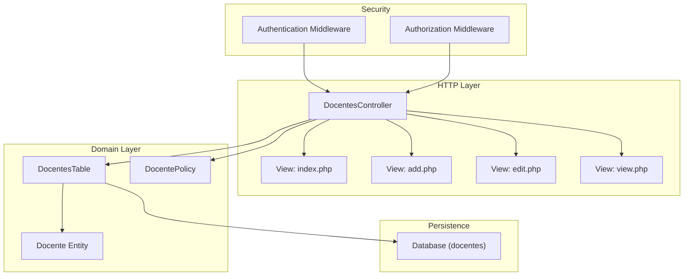
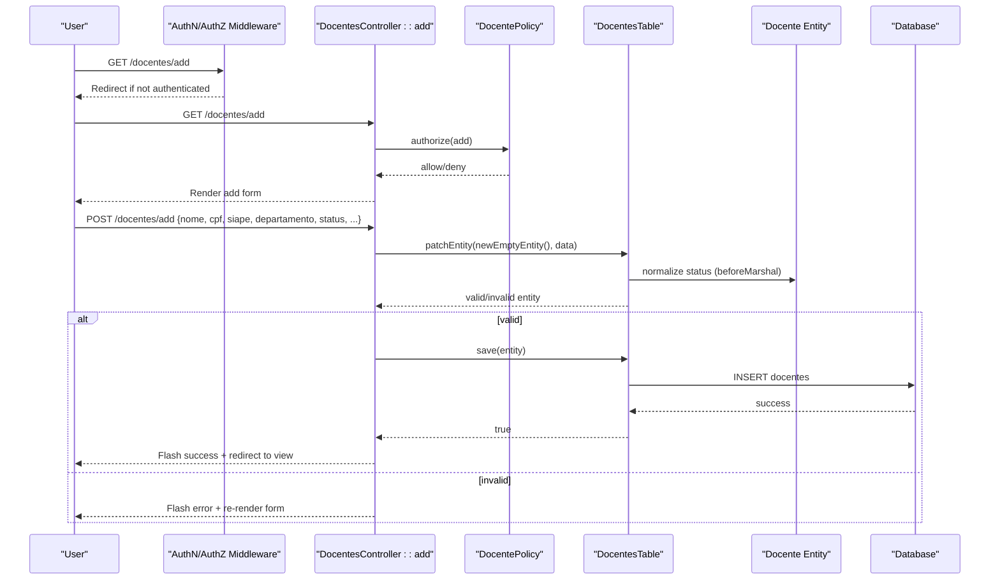
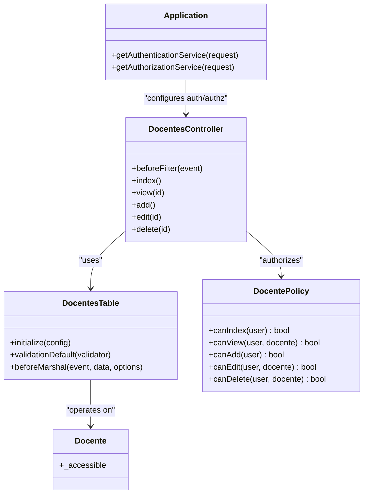

# Faculty CRUD Operations

<cite>
**Referenced Files in This Document**
- [DocentesController.php](file://src/Controller/DocentesController.php)
- [DocentesTable.php](file://src/Model/Table/DocentesTable.php)
- [Docente.php](file://src/Model/Entity/Docente.php)
- [DocentePolicy.php](file://src/Policy/DocentePolicy.php)
- [index.php](file://templates/Docentes/index.php)
- [add.php](file://templates/Docentes/add.php)
- [edit.php](file://templates/Docentes/edit.php)
- [view.php](file://templates/Docentes/view.php)
- [AppController.php](file://src/Controller/AppController.php)
- [Application.php](file://src/Application.php)
</cite>

## Table of Contents
1. [Introduction](#introduction)
2. [Project Structure](#project-structure)
3. [Core Components](#core-components)
4. [Architecture Overview](#architecture-overview)
5. [Detailed Component Analysis](#detailed-component-analysis)
6. [Dependency Analysis](#dependency-analysis)
7. [Performance Considerations](#performance-considerations)
8. [Troubleshooting Guide](#troubleshooting-guide)
9. [Conclusion](#conclusion)

## Introduction
This document explains the complete faculty (Docente) lifecycle: creation, reading, updating, and deletion. It covers authentication and authorization requirements, form handling, validation rules, data persistence via DocentesTable, filtering and pagination on the index page, and common operational scenarios such as bulk operations, search patterns, and error handling.

## Project Structure
The faculty feature follows a standard CakePHP MVC layout:
- Controller: DocentesController handles HTTP requests for listing, viewing, adding, editing, and deleting faculty members.
- Model: DocentesTable defines table configuration, relationships, validation, and normalization logic; Docente entity declares accessible fields.
- Policy: DocentePolicy enforces role-based permissions for index, view, add, edit, and delete actions.
- Views: templates/Docentes/* render forms and lists with filters, sorting, and pagination.
- Application bootstrap configures Authentication and Authorization middleware and services.

**Diagram sources**
- [DocentesController.php](file://src/Controller/DocentesController.php)
- [DocentesTable.php](file://src/Model/Table/DocentesTable.php)
- [Docente.php](file://src/Model/Entity/Docente.php)
- [DocentePolicy.php](file://src/Policy/DocentePolicy.php)
- [index.php](file://templates/Docentes/index.php)
- [add.php](file://templates/Docentes/add.php)
- [edit.php](file://templates/Docentes/edit.php)
- [view.php](file://templates/Docentes/view.php)
- [Application.php](file://src/Application.php)

**Section sources**
- [DocentesController.php](file://src/Controller/DocentesController.php)
- [DocentesTable.php](file://src/Model/Table/DocentesTable.php)
- [Docente.php](file://src/Model/Entity/Docente.php)
- [DocentePolicy.php](file://src/Policy/DocentePolicy.php)
- [index.php](file://templates/Docentes/index.php)
- [add.php](file://templates/Docentes/add.php)
- [edit.php](file://templates/Docentes/edit.php)
- [view.php](file://templates/Docentes/view.php)
- [AppController.php](file://src/Controller/AppController.php)
- [Application.php](file://src/Application.php)

## Core Components
- DocentesController: Implements index, view, add, edit, delete; manages filters, pagination, availability display, and flash messages.
- DocentesTable: Configures table name, primary key, display field, behaviors, relationships, validation rules, and status normalization.
- Docente Entity: Declares mass-assignable fields.
- DocentePolicy: Role-based access control for index, view, add, edit, delete.
- Views: Provide filter UI, sortable columns, pagination controls, and forms for create/update.

Key responsibilities:
- Authentication: Session and Form authenticators configured at application level; controller marks index and view as unauthenticated.
- Authorization: Policies enforce admin/editor roles for write operations; index and view are open by policy.
- Validation: Required nome; optional cpf, siape, email, etc.; date fields validated when present.
- Normalization: Status values normalized to canonical Portuguese values before save.

**Section sources**
- [DocentesController.php](file://src/Controller/DocentesController.php)
- [DocentesTable.php](file://src/Model/Table/DocentesTable.php)
- [Docente.php](file://src/Model/Entity/Docente.php)
- [DocentePolicy.php](file://src/Policy/DocentePolicy.php)
- [index.php](file://templates/Docentes/index.php)
- [add.php](file://templates/Docentes/add.php)
- [edit.php](file://templates/Docentes/edit.php)
- [view.php](file://templates/Docentes/view.php)
- [Application.php](file://src/Application.php)

## Architecture Overview
End-to-end flow for creating a new faculty member:

**Diagram sources**
- [DocentesController.php](file://src/Controller/DocentesController.php)
- [DocentesTable.php](file://src/Model/Table/DocentesTable.php)
- [Docente.php](file://src/Model/Entity/Docente.php)
- [DocentePolicy.php](file://src/Policy/DocentePolicy.php)
- [Application.php](file://src/Application.php)

## Detailed Component Analysis

### DocentesController
Responsibilities:
- Before filter: Marks index and view as unauthenticated.
- index(): Builds filtered and paginated list with sortable fields; supports filters by status, departamento, and availability for a planning configuration; loads active/current configuration to show availability column.
- view($id): Loads a single faculty with related Planejamento and DocenteDisponibilidades.
- add(): Authorizes add, creates empty entity with default status, processes POST, persists, flashes result, redirects to view.
- edit($id): Authorizes edit, normalizes status for display, processes PATCH/POST/PUT, persists, flashes result, redirects to view.
- delete($id): Allows only POST/DELETE, authorizes delete, deletes record, flashes result, redirects to index.

Filtering details:
- status: Accepts canonical or alias values; normalized internally.
- departamento: Exact match on department string.
- configuraplanejamento_id: Shows only faculty marked available for the selected planning configuration.

Pagination and sorting:
- Default order by nome ASC.
- Sortable fields include id, nome, cpf, siape, departamento, tipocargo, periodos, status, email.

Error handling:
- Uses Flash component for success/error messages on create/update/delete.

**Section sources**
- [DocentesController.php](file://src/Controller/DocentesController.php)
- [index.php](file://templates/Docentes/index.php)

### DocentesTable
Responsibilities:
- initialize(): Sets table name, display field, primary key, Timestamp behavior; defines hasMany relationships to Planejamentos and DocenteDisponibilidades.
- validationDefault(): Defines scalar types, lengths, presence, and emptiness rules; validates email format; allows optional dates.
- beforeMarshal(): Normalizes incoming status values to canonical Portuguese values using a mapping.

Validation highlights:
- nome: required on create, max length 200.
- cpf, siape, cress, regiao, telefone, celular, departamento, email, tipocargo, observacoes, status: allowed empty unless otherwise specified.
- dataingresso, dataegresso: validated as dates when provided.

Normalization map:
- English aliases like active/inactive/retired mapped to Portuguese canonical values.

**Section sources**
- [DocentesTable.php](file://src/Model/Table/DocentesTable.php)

### Docente Entity
- Declares all accessible fields for mass assignment, including timestamps created and modified.

**Section sources**
- [Docente.php](file://src/Model/Entity/Docente.php)

### DocentePolicy
- canIndex: always allowed.
- canView: always allowed.
- canAdd: allowed for roles admin and editor.
- canEdit: allowed for roles admin and editor.
- canDelete: allowed for role admin only.

**Section sources**
- [DocentePolicy.php](file://src/Policy/DocentePolicy.php)

### Views and Forms
- index.php: Provides filter form (status, departamento, availability), displays sortable columns, shows availability badge per planning configuration, includes paginator controls.
- add.php and edit.php: Render full faculty form with options for department and position type; status select with canonical values; saves via POST/PATCH.
- view.php: Displays faculty details and associated availability records with links to manage them.

**Section sources**
- [index.php](file://templates/Docentes/index.php)
- [add.php](file://templates/Docentes/add.php)
- [edit.php](file://templates/Docentes/edit.php)
- [view.php](file://templates/Docentes/view.php)

### Authentication and Authorization Setup
- Application-level middleware registers Authentication and Authorization components.
- Authentication service uses Session and Form authenticators; login URL configured.
- Authorization service uses OrmResolver to resolve policies.
- AppController loads Flash, Authentication, Authorization components and sets global unauthenticated actions.
- DocentesController overrides unauthenticated actions to include index and view.

**Section sources**
- [Application.php](file://src/Application.php)
- [AppController.php](file://src/Controller/AppController.php)
- [DocentesController.php](file://src/Controller/DocentesController.php)

## Dependency Analysis
High-level dependencies among core components:

**Diagram sources**
- [DocentesController.php](file://src/Controller/DocentesController.php)
- [DocentesTable.php](file://src/Model/Table/DocentesTable.php)
- [Docente.php](file://src/Model/Entity/Docente.php)
- [DocentePolicy.php](file://src/Policy/DocentePolicy.php)
- [Application.php](file://src/Application.php)

**Section sources**
- [DocentesController.php](file://src/Controller/DocentesController.php)
- [DocentesTable.php](file://src/Model/Table/DocentesTable.php)
- [Docente.php](file://src/Model/Entity/Docente.php)
- [DocentePolicy.php](file://src/Policy/DocentePolicy.php)
- [Application.php](file://src/Application.php)

## Performance Considerations
- Filtering queries use simple WHERE clauses and distinct selections for dropdowns; consider indexing frequently filtered columns (e.g., status, departamento) if datasets grow large.
- Availability filter uses matching with a join condition; ensure foreign keys and relevant indexes exist on DocenteDisponibilidades.configuraplanejamento_id and disponivel.
- Pagination is applied to the final query; avoid loading unnecessary associations in index to reduce overhead.
- The active configuration lookup runs once per index request; cache if needed.

[No sources needed since this section provides general guidance]

## Troubleshooting Guide
Common issues and resolutions:
- Unauthorized access on add/edit/delete: Ensure user has appropriate role (admin/editor for add/edit; admin for delete). Check DocentePolicy and session identity.
- Status not saving as expected: Verify input uses canonical values or recognized aliases; normalization occurs in beforeMarshal.
- Validation errors on submit: Confirm nome is present and within length limits; check email format if provided; review other field constraints.
- Filters not working: Ensure query parameters match expected names (status, departamento, configuraplanejamento_id); verify availability option corresponds to an existing planning configuration.
- Missing availability info: Availability depends on DocenteDisponibilidades records; confirm related records exist for the selected configuration.

Operational patterns:
- Bulk operations: Not implemented in controller; implement via a separate action that accepts multiple IDs and applies changes within a transaction.
- Search functionality: Extend index with a text search parameter and apply LIKE conditions on nome/siape/cpf; integrate into the filter form.
- Error handling: Use Flash messages consistently; log exceptions where appropriate; return to previous page with preserved filters.

**Section sources**
- [DocentesController.php](file://src/Controller/DocentesController.php)
- [DocentesTable.php](file://src/Model/Table/DocentesTable.php)
- [DocentePolicy.php](file://src/Policy/DocentePolicy.php)
- [index.php](file://templates/Docentes/index.php)

## Conclusion
The faculty CRUD system provides a secure, validated, and user-friendly interface for managing faculty members. Authentication and authorization are enforced through middleware and policies, while validation and normalization ensure data integrity. The index page offers robust filtering and sorting with pagination. Extensibility points exist for bulk operations and advanced search without disrupting existing flows.