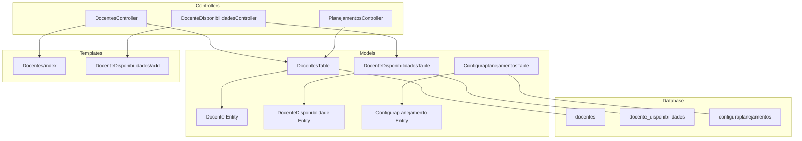
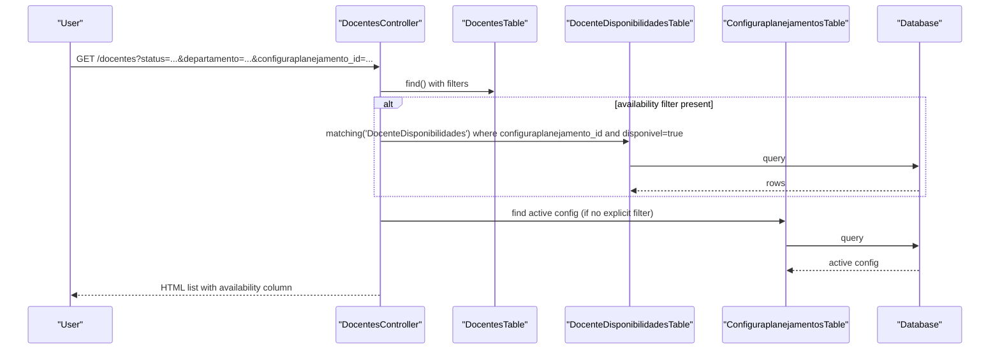
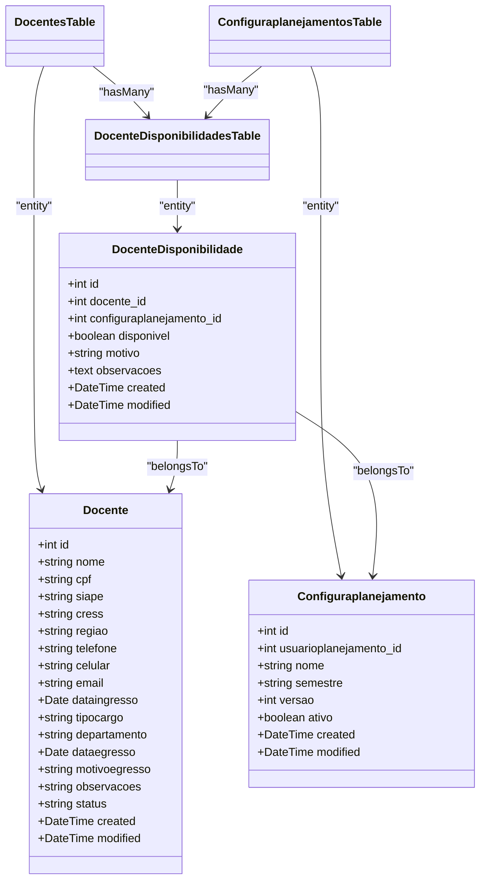
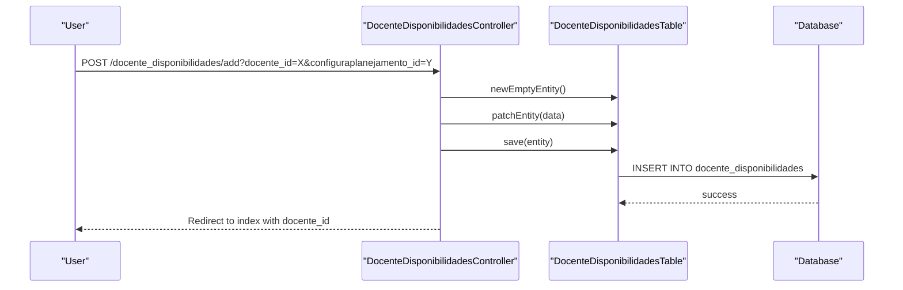
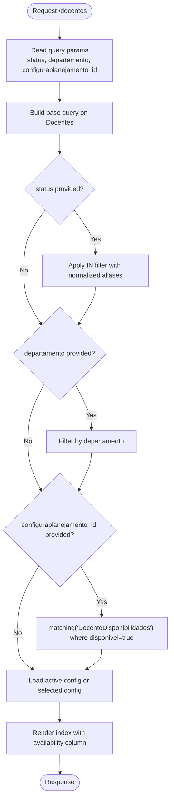
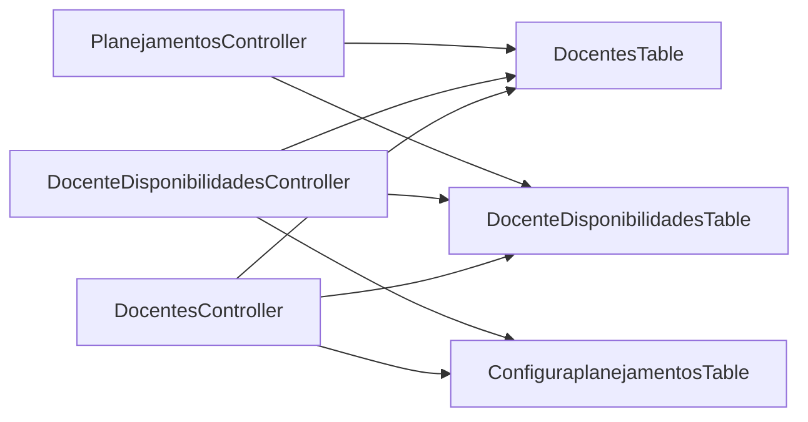

# Faculty Management

<cite>
**Referenced Files in This Document**
- [DocentesController.php](file://src/Controller/DocentesController.php)
- [DocenteDisponibilidadesController.php](file://src/Controller/DocenteDisponibilidadesController.php)
- [PlanejamentosController.php](file://src/Controller/PlanejamentosController.php)
- [DocentesTable.php](file://src/Model/Table/DocentesTable.php)
- [DocenteDisponibilidadesTable.php](file://src/Model/Table/DocenteDisponibilidadesTable.php)
- [ConfiguraplanejamentosTable.php](file://src/Model/Table/ConfiguraplanejamentosTable.php)
- [Docente.php](file://src/Model/Entity/Docente.php)
- [DocenteDisponibilidade.php](file://src/Model/Entity/DocenteDisponibilidade.php)
- [Configuraplanejamento.php](file://src/Model/Entity/Configuraplanejamento.php)
- [20260613100000_CreateDocenteDisponibilidades.php](file://config/Migrations/20260613100000_CreateDocenteDisponibilidades.php)
- [index.php (Docentes)](file://templates/Docentes/index.php)
- [add.php (DocenteDisponibilidades)](file://templates/DocenteDisponibilidades/add.php)
</cite>

## Table of Contents
1. [Introduction](#introduction)
2. [Project Structure](#project-structure)
3. [Core Components](#core-components)
4. [Architecture Overview](#architecture-overview)
5. [Detailed Component Analysis](#detailed-component-analysis)
6. [Dependency Analysis](#dependency-analysis)
7. [Performance Considerations](#performance-considerations)
8. [Troubleshooting Guide](#troubleshooting-guide)
9. [Conclusion](#conclusion)

## Introduction
This document explains the faculty management system with a focus on:
- Managing faculty profiles and personal information
- Tracking faculty status (active/inactive/retired)
- Recording availability preferences per semester via docente_disponibilidades
- Integrating availability into scheduling workflows
- Configuration options for filtering and validation constraints
- Relationships with scheduling conflicts and resource allocation
- Common issues and solutions, such as availability conflicts

The system is implemented using CakePHP conventions with controllers, tables/entities, migrations, and templates.

## Project Structure
Key components related to faculty management:
- Controllers: DocentesController, DocenteDisponibilidadesController, PlanejamentoController
- Models: DocentesTable, DocenteDisponibilidadesTable, ConfiguraplanejamentosTable; Entities Docente, DocenteDisponibilidade, Configuraplanejamento
- Database migration: CreateDocenteDisponibilidades
- Templates: Docentes index view, DocenteDisponibilidades add form

**Diagram sources**
- [DocentesController.php](file://src/Controller/DocentesController.php)
- [DocenteDisponibilidadesController.php](file://src/Controller/DocenteDisponibilidadesController.php)
- [PlanejamentosController.php](file://src/Controller/PlanejamentosController.php)
- [DocentesTable.php](file://src/Model/Table/DocentesTable.php)
- [DocenteDisponibilidadesTable.php](file://src/Model/Table/DocenteDisponibilidadesTable.php)
- [ConfiguraplanejamentosTable.php](file://src/Model/Table/ConfiguraplanejamentosTable.php)
- [Docente.php](file://src/Model/Entity/Docente.php)
- [DocenteDisponibilidade.php](file://src/Model/Entity/DocenteDisponibilidade.php)
- [Configuraplanejamento.php](file://src/Model/Entity/Configuraplanejamento.php)
- [index.php (Docentes)](file://templates/Docentes/index.php)
- [add.php (DocenteDisponibilidades)](file://templates/DocenteDisponibilidades/add.php)

**Section sources**
- [DocentesController.php](file://src/Controller/DocentesController.php)
- [DocenteDisponibilidadesController.php](file://src/Controller/DocenteDisponibilidadesController.php)
- [PlanejamentosController.php](file://src/Controller/PlanejamentosController.php)
- [DocentesTable.php](file://src/Model/Table/DocentesTable.php)
- [DocenteDisponibilidadesTable.php](file://src/Model/Table/DocenteDisponibilidadesTable.php)
- [ConfiguraplanejamentosTable.php](file://src/Model/Table/ConfiguraplanejamentosTable.php)
- [Docente.php](file://src/Model/Entity/Docente.php)
- [DocenteDisponibilidade.php](file://src/Model/Entity/DocenteDisponibilidade.php)
- [Configuraplanejamento.php](file://src/Model/Entity/Configuraplanejamento.php)
- [index.php (Docentes)](file://templates/Docentes/index.php)
- [add.php (DocenteDisponibilidades)](file://templates/DocenteDisponibilidades/add.php)

## Core Components
- Faculty profile entity and table:
  - Fields include name, identifiers (CPF/SIAPE/CRESS), region, phone/mobile/email, entry/exit dates, position type, department, observations, and status.
  - Status normalization maps common aliases to canonical values (e.g., active -> ativo).
- Availability tracking:
  - Per-faculty, per-semester availability records indicate whether a professor is available for scheduling, with optional reason and notes.
  - Unique constraint ensures one availability record per faculty per planning configuration (semester/version).
- Scheduling integration:
  - When creating or editing schedules, only active faculty are shown by default.
  - If a planning configuration is selected, only faculty marked available for that configuration are included.

Operational highlights:
- Adding a new faculty member sets default status to active.
- Filtering supports status, department, and availability by planning configuration.
- Availability can be added/edited/deleted per faculty and per planning configuration.

**Section sources**
- [Docente.php](file://src/Model/Entity/Docente.php)
- [DocentesTable.php](file://src/Model/Table/DocentesTable.php)
- [DocenteDisponibilidade.php](file://src/Model/Entity/DocenteDisponibilidade.php)
- [DocenteDisponibilidadesTable.php](file://src/Model/Table/DocenteDisponibilidadesTable.php)
- [20260613100000_CreateDocenteDisponibilidades.php](file://config/Migrations/20260613100000_CreateDocenteDisponibilidades.php)
- [DocentesController.php](file://src/Controller/DocentesController.php)
- [DocenteDisponibilidadesController.php](file://src/Controller/DocenteDisponibilidadesController.php)
- [PlanejamentosController.php](file://src/Controller/PlanejamentosController.php)

## Architecture Overview
The system follows MVC patterns:
- Controllers handle HTTP requests, apply filters, and orchestrate model operations.
- Tables define relationships, validations, and rules.
- Entities expose accessible fields.
- Migrations define database schema and constraints.
- Templates render UI and forms.

**Diagram sources**
- [DocentesController.php](file://src/Controller/DocentesController.php)
- [DocenteDisponibilidadesTable.php](file://src/Model/Table/DocenteDisponibilidadesTable.php)
- [ConfiguraplanejamentosTable.php](file://src/Model/Table/ConfiguraplanejamentosTable.php)

## Detailed Component Analysis

### Faculty Profile Management (Docentes)
Responsibilities:
- CRUD operations for faculty members
- Default status assignment when adding
- Status alias normalization and display labels
- Filtering by status, department, and availability

Key behaviors:
- Before saving, status values are normalized to canonical forms.
- Index action builds dropdowns for departments and statuses from existing data.
- Availability column shows current availability for an active or selected planning configuration.

Validation constraints:
- Name required and limited length
- Email validated format if provided
- Dates validated if provided
- Optional fields allowed for many attributes

Status handling:
- Canonical statuses: ativo, aposentado, inativo
- Aliases supported for input flexibility

Example usage paths:
- Add a new faculty member: controller method creates entity with default status, validates, saves, redirects to view.
- Edit faculty: loads entity, normalizes status, patches with request data, saves.
- Filter faculty: applies WHERE clauses based on query parameters; uses matching for availability filter.

**Section sources**
- [DocentesController.php](file://src/Controller/DocentesController.php)
- [DocentesTable.php](file://src/Model/Table/DocentesTable.php)
- [Docente.php](file://src/Model/Entity/Docente.php)
- [index.php (Docentes)](file://templates/Docentes/index.php)

### Availability Preferences (DocenteDisponibilidades)
Purpose:
- Track per-faculty availability per planning configuration (semester/version)
- Store boolean availability flag, optional reason, and notes

Data model:
- Foreign keys to docentes and configuraplanejamentos
- Unique composite key prevents duplicate availability entries per faculty per configuration
- Timestamps automatically managed

Validation and rules:
- Required integer IDs for both foreign keys
- Boolean availability required
- Reason limited length
- Existence rules ensure referential integrity

Operations:
- List with optional faculty filter
- Add/Edit/Delete with prefilling from query parameters
- Display links back to faculty view

Example usage paths:
- Add availability: controller prepopulates docente_id/configuraplanejamento_id from query, validates, saves, redirects to index filtered by faculty.
- Edit availability: load entity, patch, save, redirect.
- Delete availability: remove record and redirect.

**Section sources**
- [DocenteDisponibilidadesController.php](file://src/Controller/DocenteDisponibilidadesController.php)
- [DocenteDisponibilidadesTable.php](file://src/Model/Table/DocenteDisponibilidadesTable.php)
- [DocenteDisponibilidade.php](file://src/Model/Entity/DocenteDisponibilidade.php)
- [20260613100000_CreateDocenteDisponibilidades.php](file://config/Migrations/20260613100000_CreateDocenteDisponibilidades.php)
- [add.php (DocenteDisponibilidades)](file://templates/DocenteDisponibilidades/add.php)

### Planning Configuration (Configuraplanejamento)
Role:
- Represents a planning period (semester/version) used to scope availability and schedules
- Has an active flag to determine default context for availability display

Relationships:
- One-to-many with DocenteDisponibilidades
- Used by scheduling to scope faculty selection

**Section sources**
- [ConfiguraplanejamentosTable.php](file://src/Model/Table/ConfiguraplanejamentosTable.php)
- [Configuraplanejamento.php](file://src/Model/Entity/Configuraplanejamento.php)

### Integration with Scheduling System
When building schedule forms:
- Only active faculty are included by default
- If a planning configuration is selected, only faculty marked available for that configuration are listed
- Current selection is preserved even if not in filtered list

This ensures scheduling respects both faculty status and availability preferences.

**Section sources**
- [PlanejamentosController.php](file://src/Controller/PlanejamentosController.php)

### Class Diagram (Entities and Tables)

**Diagram sources**
- [Docente.php](file://src/Model/Entity/Docente.php)
- [DocenteDisponibilidade.php](file://src/Model/Entity/DocenteDisponibilidade.php)
- [Configuraplanejamento.php](file://src/Model/Entity/Configuraplanejamento.php)
- [DocentesTable.php](file://src/Model/Table/DocentesTable.php)
- [DocenteDisponibilidadesTable.php](file://src/Model/Table/DocenteDisponibilidadesTable.php)
- [ConfiguraplanejamentosTable.php](file://src/Model/Table/ConfiguraplanejamentosTable.php)

### Sequence Diagram: Add Availability

**Diagram sources**
- [DocenteDisponibilidadesController.php](file://src/Controller/DocenteDisponibilidadesController.php)
- [DocenteDisponibilidadesTable.php](file://src/Model/Table/DocenteDisponibilidadesTable.php)

### Flowchart: Faculty Filtering Logic

**Diagram sources**
- [DocentesController.php](file://src/Controller/DocentesController.php)

## Dependency Analysis
- DocentesController depends on:
  - DocentesTable for queries and persistence
  - DocenteDisponibilidadesTable for availability matching
  - ConfiguraplanejamentosTable for active configuration lookup
- DocenteDisponibilidadesController depends on:
  - DocenteDisponibilidadesTable for CRUD
  - DocentesTable and ConfiguraplanejamentosTable for list forms
- PlanejamentoController depends on:
  - DocentesTable for listing eligible faculty
  - DocenteDisponibilidadesTable for availability-based filtering

**Diagram sources**
- [DocentesController.php](file://src/Controller/DocentesController.php)
- [DocenteDisponibilidadesController.php](file://src/Controller/DocenteDisponibilidadesController.php)
- [PlanejamentosController.php](file://src/Controller/PlanejamentosController.php)
- [DocentesTable.php](file://src/Model/Table/DocentesTable.php)
- [DocenteDisponibilidadesTable.php](file://src/Model/Table/DocenteDisponibilidadesTable.php)
- [ConfiguraplanejamentosTable.php](file://src/Model/Table/ConfiguraplanejamentosTable.php)

**Section sources**
- [DocentesController.php](file://src/Controller/DocentesController.php)
- [DocenteDisponibilidadesController.php](file://src/Controller/DocenteDisponibilidadesController.php)
- [PlanejamentosController.php](file://src/Controller/PlanejamentosController.php)

## Performance Considerations
- Use pagination for large lists of faculty and availability records.
- Avoid unnecessary contains; only load related entities when needed.
- Leverage indexes defined in the migration for frequent filters (docente_id, configuraplanejamento_id).
- Normalize status once during marshalling to reduce repeated checks.
- Cache dropdown lists (departments, statuses, configurations) if they change infrequently.

[No sources needed since this section provides general guidance]

## Troubleshooting Guide
Common issues and resolutions:
- Availability conflict:
  - Symptom: Attempting to create a second availability record for the same faculty and planning configuration fails due to unique constraint.
  - Resolution: Update the existing record instead of creating a new one.
- Faculty not appearing in scheduling:
  - Cause: Faculty status is not active or not available for the selected planning configuration.
  - Resolution: Ensure status is active and create/update availability for the relevant configuration.
- Status normalization mismatch:
  - Symptom: Inputting non-canonical status values leads to unexpected behavior.
  - Resolution: Use supported aliases; the system normalizes them internally.
- Missing availability column value:
  - Cause: No availability record exists for the active or selected configuration.
  - Resolution: Add an availability record for the faculty and configuration.

**Section sources**
- [20260613100000_CreateDocenteDisponibilidades.php](file://config/Migrations/20260613100000_CreateDocenteDisponibilidades.php)
- [DocentesController.php](file://src/Controller/DocentesController.php)
- [PlanejamentosController.php](file://src/Controller/PlanejamentosController.php)

## Conclusion
The faculty management system provides robust tools for managing faculty profiles, tracking availability per semester, and integrating these preferences into scheduling. Validation and normalization ensure data quality, while relationships and constraints maintain consistency across the system. By following the documented workflows and addressing common issues, administrators can efficiently manage faculty resources and avoid scheduling conflicts.