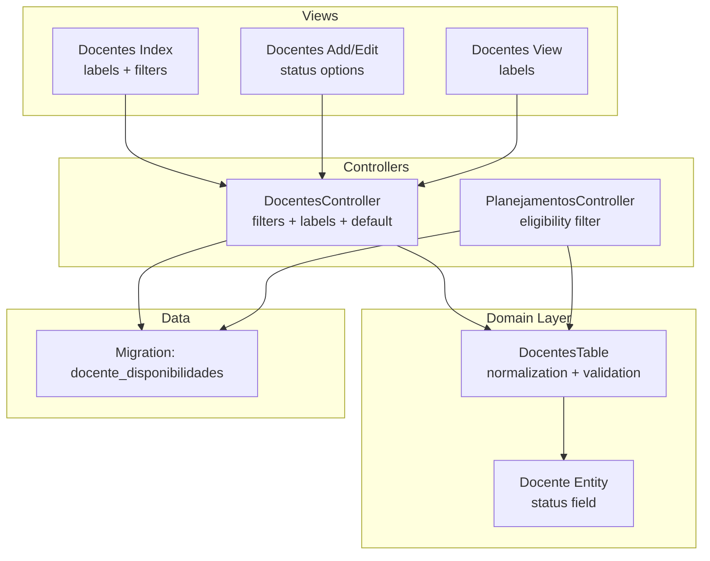
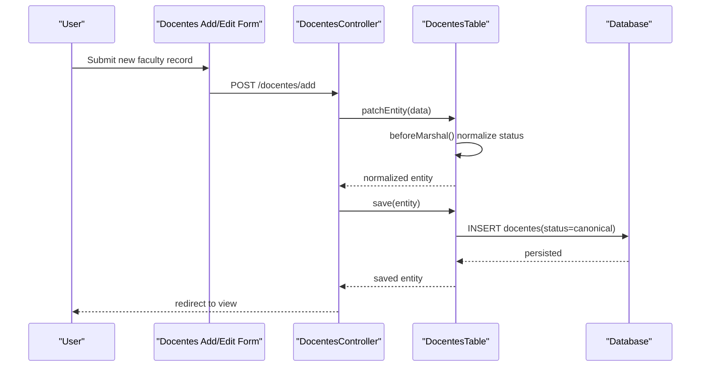
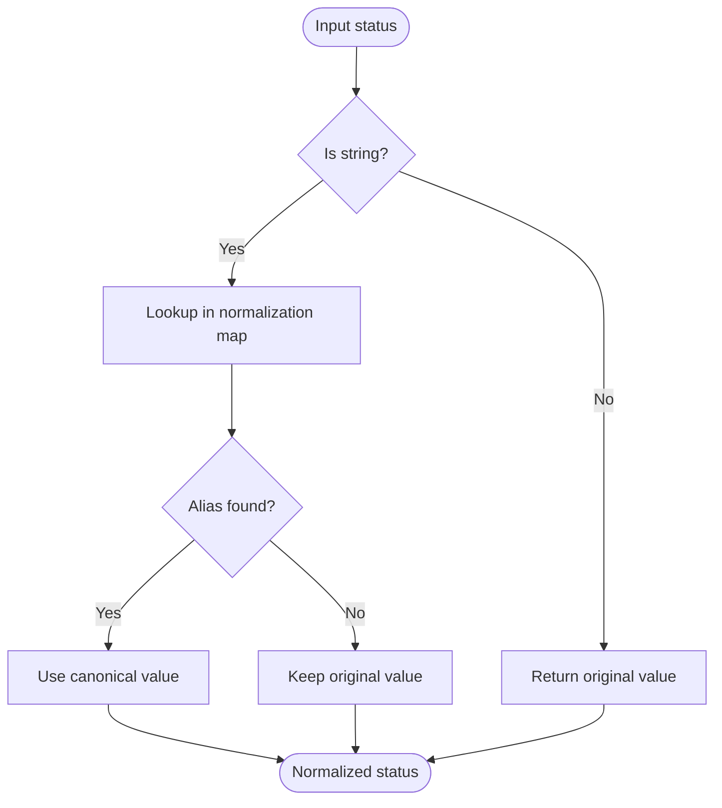
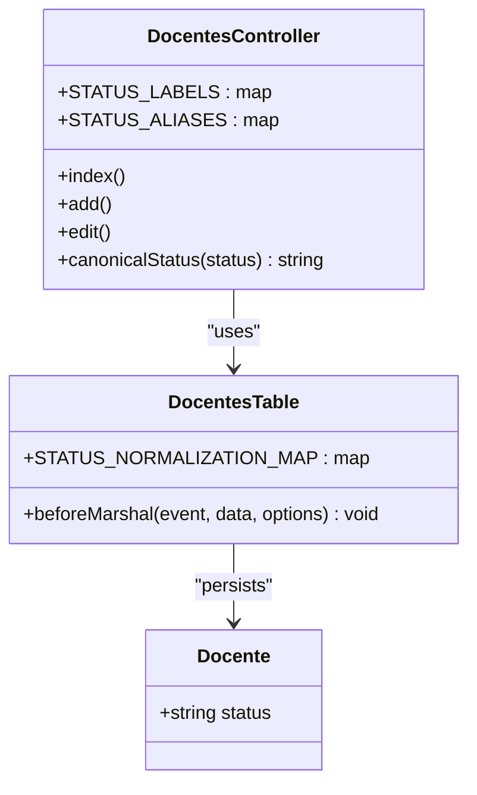
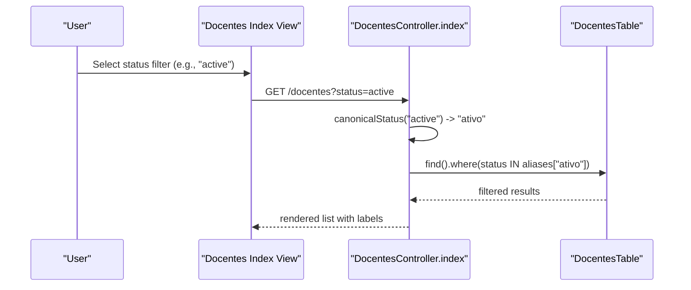
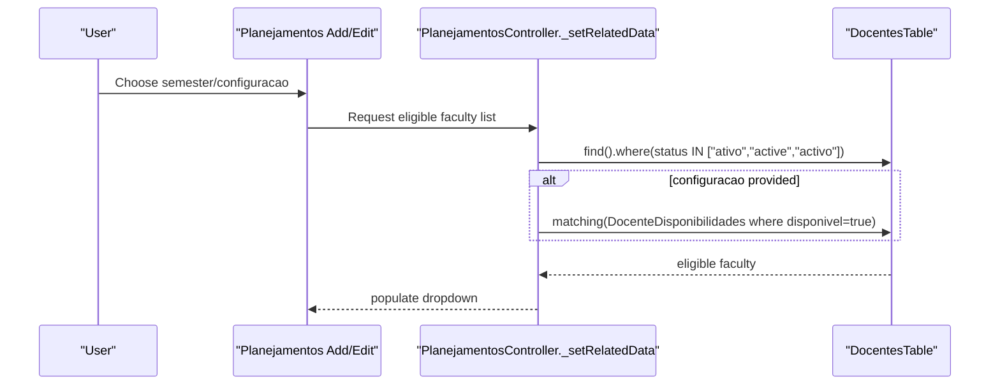
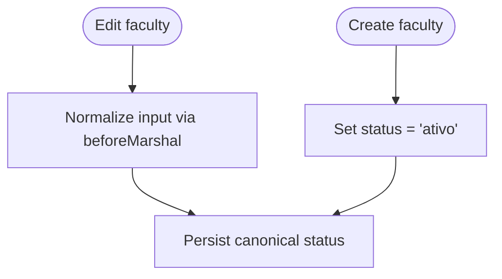
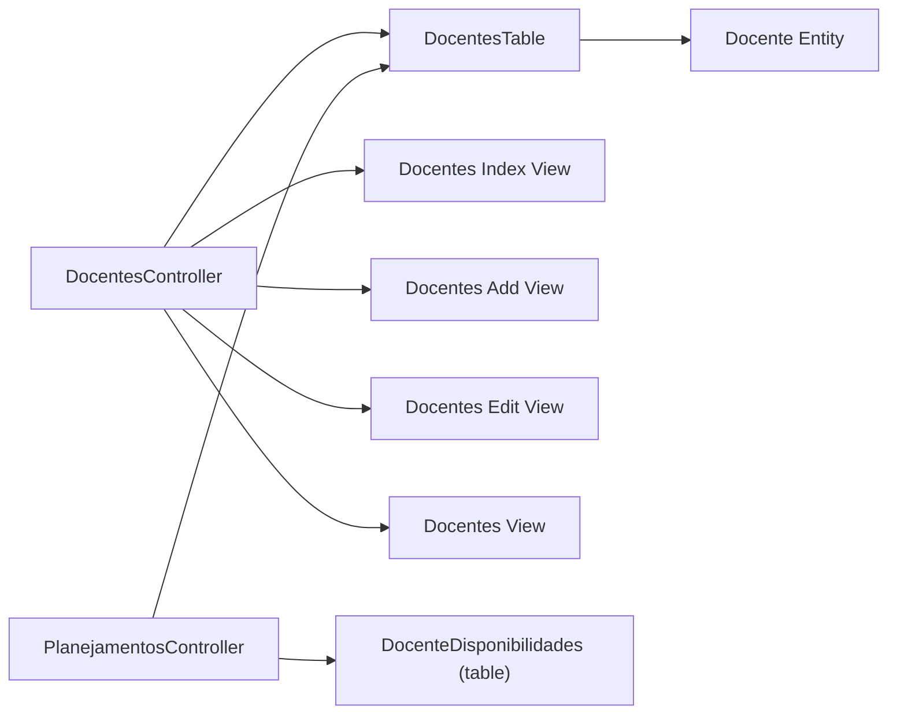

# Faculty Status Tracking

<cite>
**Referenced Files in This Document**
- [DocentesTable.php](file://src/Model/Table/DocentesTable.php)
- [Docente.php](file://src/Model/Entity/Docente.php)
- [DocentesController.php](file://src/Controller/DocentesController.php)
- [PlanejamentosController.php](file://src/Controller/PlanejamentosController.php)
- [add.php (Docentes)](file://templates/Docentes/add.php)
- [edit.php (Docentes)](file://templates/Docentes/edit.php)
- [index.php (Docentes)](file://templates/Docentes/index.php)
- [view.php (Docentes)](file://templates/Docentes/view.php)
- [CreateDocenteDisponibilidades.php](file://config/Migrations/20260613100000_CreateDocenteDisponibilidades.php)
</cite>

## Table of Contents
1. Introduction
2. Project Structure
3. Core Components
4. Architecture Overview
5. Detailed Component Analysis
6. Dependency Analysis
7. Performance Considerations
8. Troubleshooting Guide
9. Conclusion

## Introduction
This document explains the faculty status tracking system used to manage the lifecycle and scheduling eligibility of faculty members. The system implements a three-tier canonical status model:
- ativo (active)
- aposentado (retired)
- inativo (inactive)

It also provides an aliasing mechanism that accepts multiple language variations for user input, such as active/activo/inactive/inactivo, and normalizes them into canonical values. Status influences how faculty appear in lists, filters, and scheduling workflows. In particular, only active faculty are eligible for automatic schedule generation and are included when filtering by availability.

## Project Structure
The status logic is implemented primarily in the Docente domain layer (Table and Entity), with controller-level support for UI display and filtering. Scheduling flows use the status to restrict eligible faculty during planning operations.

**Diagram sources**
- [DocentesTable.php:15-21](file://src/Model/Table/DocentesTable.php#L15-L21)
- [Docente.php:26](file://src/Model/Entity/Docente.php#L26)
- [DocentesController.php:16-26](file://src/Controller/DocentesController.php#L16-L26)
- [PlanejamentosController.php:217-231](file://src/Controller/PlanejamentosController.php#L217-L231)
- [index.php (Docentes):6-15](file://templates/Docentes/index.php#L6-L15)
- [add.php (Docentes):23-32](file://templates/Docentes/add.php#L23-L32)
- [edit.php (Docentes):23-32](file://templates/Docentes/edit.php#L23-L32)
- [CreateDocenteDisponibilidades.php:10-45](file://config/Migrations/20260613100000_CreateDocenteDisponibilidades.php#L10-L45)

**Section sources**
- [DocentesTable.php:15-21](file://src/Model/Table/DocentesTable.php#L15-L21)
- [Docente.php:26](file://src/Model/Entity/Docente.php#L26)
- [DocentesController.php:16-26](file://src/Controller/DocentesController.php#L16-L26)
- [PlanejamentosController.php:217-231](file://src/Controller/PlanejamentosController.php#L217-L231)
- [index.php (Docentes):6-15](file://templates/Docentes/index.php#L6-L15)
- [add.php (Docentes):23-32](file://templates/Docentes/add.php#L23-L32)
- [edit.php (Docentes):23-32](file://templates/Docentes/edit.php#L23-L32)
- [CreateDocenteDisponibilidades.php:10-45](file://config/Migrations/20260613100000_CreateDocenteDisponibilidades.php#L10-L45)

## Core Components
- Canonical statuses:
  - ativo (active)
  - aposentado (retired)
  - inativo (inactive)
- Aliases accepted from input:
  - active, activo → ativo
  - retired → aposentado
  - inactive, inactivo → inativo
- Normalization occurs at marshaling time so stored values are always canonical.
- Default status on creation is active.
- Filtering and visibility:
  - Lists and filters accept aliases but match against canonical sets.
  - Scheduling eligibility includes only active faculty; retired and inactive are excluded from automatic schedule generation.

Key implementation points:
- Normalization map and beforeMarshal hook ensure consistent storage.
- Controller defines label mappings and alias expansion for queries and UI.
- Views render localized labels and provide filter controls.

**Section sources**
- [DocentesTable.php:15-21](file://src/Model/Table/DocentesTable.php#L15-L21)
- [DocentesTable.php:114-124](file://src/Model/Table/DocentesTable.php#L114-L124)
- [DocentesController.php:16-26](file://src/Controller/DocentesController.php#L16-L26)
- [DocentesController.php:88-90](file://src/Controller/DocentesController.php#L88-L90)
- [DocentesController.php:186](file://src/Controller/DocentesController.php#L186)
- [index.php (Docentes):6-15](file://templates/Docentes/index.php#L6-L15)
- [add.php (Docentes):23-32](file://templates/Docentes/add.php#L23-L32)
- [edit.php (Docentes):23-32](file://templates/Docentes/edit.php#L23-L32)

## Architecture Overview
The status pipeline spans data entry, normalization, persistence, querying, and UI rendering.

**Diagram sources**
- [DocentesController.php:183-200](file://src/Controller/DocentesController.php#L183-L200)
- [DocentesTable.php:114-124](file://src/Model/Table/DocentesTable.php#L114-L124)
- [Docente.php:26](file://src/Model/Entity/Docente.php#L26)

## Detailed Component Analysis

### Status Alias Mapping and Normalization
- Input aliases are mapped to canonical values via a constant map and applied during marshaling.
- Unknown or empty values pass through unchanged, allowing optional status fields.

**Diagram sources**
- [DocentesTable.php:15-21](file://src/Model/Table/DocentesTable.php#L15-L21)
- [DocentesTable.php:114-124](file://src/Model/Table/DocentesTable.php#L114-L124)

**Section sources**
- [DocentesTable.php:15-21](file://src/Model/Table/DocentesTable.php#L15-L21)
- [DocentesTable.php:114-124](file://src/Model/Table/DocentesTable.php#L114-L124)

### Three-Tier Status Model and Labels
- Canonical statuses: ativo, aposentado, inativo.
- Display labels are defined centrally and used across controllers and views to present human-friendly text.

**Diagram sources**
- [DocentesController.php:16-26](file://src/Controller/DocentesController.php#L16-L26)
- [DocentesController.php:202-211](file://src/Controller/DocentesController.php#L202-L211)
- [DocentesTable.php:15-21](file://src/Model/Table/DocentesTable.php#L15-L21)
- [Docente.php:26](file://src/Model/Entity/Docente.php#L26)

**Section sources**
- [DocentesController.php:16-26](file://src/Controller/DocentesController.php#L16-L26)
- [DocentesController.php:202-211](file://src/Controller/DocentesController.php#L202-L211)
- [DocentesTable.php:15-21](file://src/Model/Table/DocentesTable.php#L15-L21)
- [Docente.php:26](file://src/Model/Entity/Docente.php#L26)

### Visibility and Filtering in Faculty Lists
- The index page supports filtering by status using query parameters.
- Filters expand aliases to canonical sets for matching.
- The UI shows localized labels for each status.

**Diagram sources**
- [DocentesController.php:34-90](file://src/Controller/DocentesController.php#L34-L90)
- [DocentesController.php:202-211](file://src/Controller/DocentesController.php#L202-L211)
- [index.php (Docentes):6-15](file://templates/Docentes/index.php#L6-L15)

**Section sources**
- [DocentesController.php:34-90](file://src/Controller/DocentesController.php#L34-L90)
- [index.php (Docentes):6-15](file://templates/Docentes/index.php#L6-L15)

### Scheduling Eligibility and Automatic Generation
- Only active faculty are considered eligible for scheduling.
- When a planning configuration (semester/version) is selected, the system further filters to those marked available for that configuration.
- Retired and inactive faculty are excluded from these lists.

**Diagram sources**
- [PlanejamentosController.php:217-231](file://src/Controller/PlanejamentosController.php#L217-L231)
- [CreateDocenteDisponibilidades.php:10-45](file://config/Migrations/20260613100000_CreateDocenteDisponibilidades.php#L10-L45)

**Section sources**
- [PlanejamentosController.php:217-231](file://src/Controller/PlanejamentosController.php#L217-L231)
- [CreateDocenteDisponibilidades.php:10-45](file://config/Migrations/20260613100000_CreateDocenteDisponibilidades.php#L10-L45)

### Status Transitions and Defaults
- Default status on creation is active.
- Transitions are performed via edit forms; normalization ensures any alias input becomes canonical.

**Diagram sources**
- [DocentesController.php:186](file://src/Controller/DocentesController.php#L186)
- [DocentesTable.php:114-124](file://src/Model/Table/DocentesTable.php#L114-L124)

**Section sources**
- [DocentesController.php:186](file://src/Controller/DocentesController.php#L186)
- [DocentesTable.php:114-124](file://src/Model/Table/DocentesTable.php#L114-L124)

### Status-Based Queries and Examples
- Filter by canonical or alias:
  - Query with status=active expands to include both active and activo variants.
- Availability-based queries:
  - Combine status filter with availability records for a specific planning configuration.

Examples (descriptive):
- List all active faculty: apply status filter with "active" or "ativo".
- Show available faculty for a semester: add availability filter where disponivel=true for the chosen configuration.
- Retrieve retired faculty: filter by "retired" or "aposentado".

**Section sources**
- [DocentesController.php:88-90](file://src/Controller/DocentesController.php#L88-L90)
- [PlanejamentosController.php:223-231](file://src/Controller/PlanejamentosController.php#L223-L231)

### Reporting and Analytics
- The current codebase does not implement dedicated reporting endpoints or analytics dashboards for status metrics.
- Ad-hoc reports can be derived by exporting filtered faculty lists (by status, department, or availability) and aggregating counts externally.

[No sources needed since this section provides general guidance]

## Dependency Analysis
The following diagram highlights key dependencies related to status handling and scheduling eligibility.

**Diagram sources**
- [DocentesController.php:16-26](file://src/Controller/DocentesController.php#L16-L26)
- [DocentesTable.php:15-21](file://src/Model/Table/DocentesTable.php#L15-L21)
- [PlanejamentosController.php:217-231](file://src/Controller/PlanejamentosController.php#L217-L231)
- [Docente.php:26](file://src/Model/Entity/Docente.php#L26)
- [index.php (Docentes):6-15](file://templates/Docentes/index.php#L6-L15)
- [add.php (Docentes):23-32](file://templates/Docentes/add.php#L23-L32)
- [edit.php (Docentes):23-32](file://templates/Docentes/edit.php#L23-L32)
- [view.php (Docentes):10-19](file://templates/Docentes/view.php#L10-L19)

**Section sources**
- [DocentesController.php:16-26](file://src/Controller/DocentesController.php#L16-L26)
- [DocentesTable.php:15-21](file://src/Model/Table/DocentesTable.php#L15-L21)
- [PlanejamentosController.php:217-231](file://src/Controller/PlanejamentosController.php#L217-L231)
- [Docente.php:26](file://src/Model/Entity/Docente.php#L26)
- [index.php (Docentes):6-15](file://templates/Docentes/index.php#L6-L15)
- [add.php (Docentes):23-32](file://templates/Docentes/add.php#L23-L32)
- [edit.php (Docentes):23-32](file://templates/Docentes/edit.php#L23-L32)
- [view.php (Docentes):10-19](file://templates/Docentes/view.php#L10-L19)

## Performance Considerations
- Normalization occurs once per marshal operation; it is lightweight and avoids repeated lookups.
- Status filtering uses simple IN clauses with small alias sets, which are efficient.
- Availability filtering leverages indexed foreign keys in the availability table to speed up matching.

[No sources needed since this section provides general guidance]

## Troubleshooting Guide
Common issues and resolutions:
- Unexpected status values in database:
  - Ensure no direct SQL writes bypass beforeMarshal normalization.
  - Validate that incoming requests use supported aliases or canonical values.
- Faculty missing from scheduling dropdowns:
  - Confirm status is canonical "ativo" (or alias).
  - Verify availability record exists and disponivel=true for the selected configuration.
- UI displays raw values instead of labels:
  - Check that views use the label mapping for the stored status.

**Section sources**
- [DocentesTable.php:114-124](file://src/Model/Table/DocentesTable.php#L114-L124)
- [PlanejamentosController.php:217-231](file://src/Controller/PlanejamentosController.php#L217-L231)
- [index.php (Docentes):6-15](file://templates/Docentes/index.php#L6-L15)

## Conclusion
The faculty status tracking system enforces a clear three-tier canonical model while supporting flexible input via aliases. Normalization guarantees consistency, and status directly governs visibility and scheduling eligibility. Active faculty are included in scheduling workflows; retired and inactive faculty are excluded. The design keeps status logic centralized in the domain layer and exposes it consistently through controllers and views.