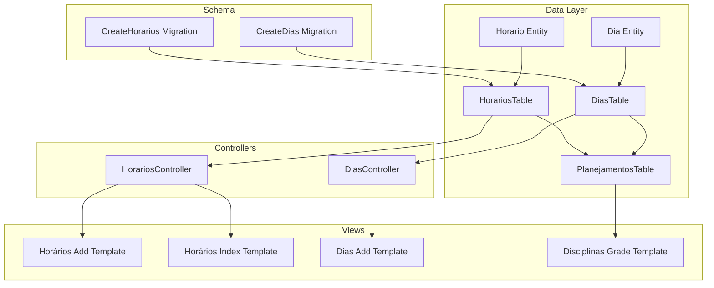
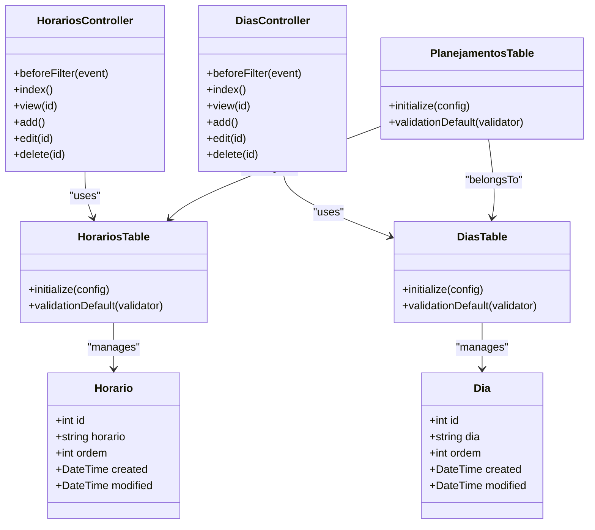
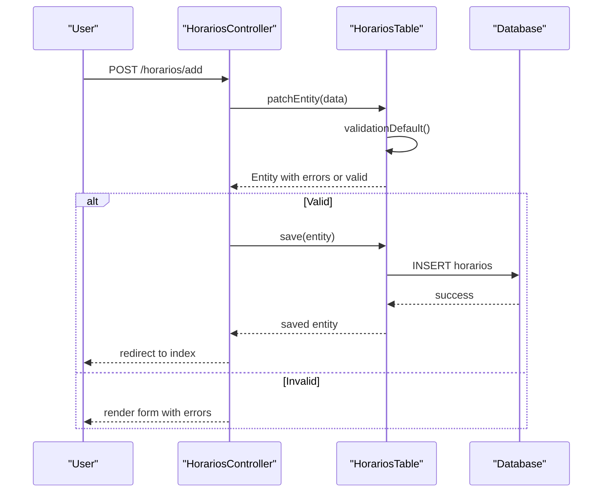
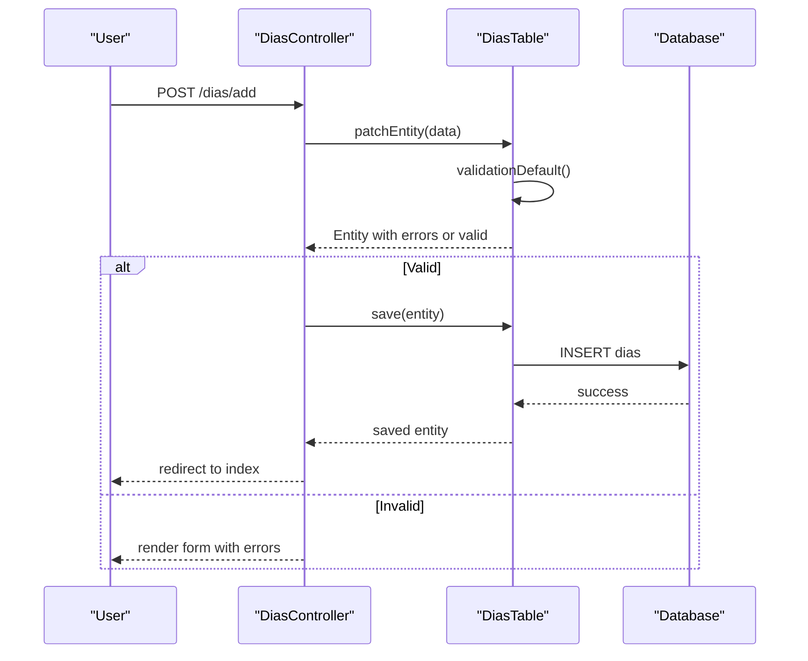
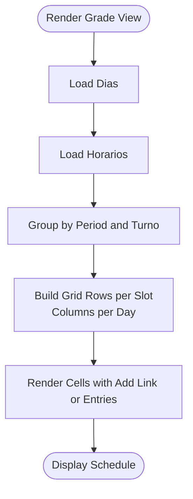
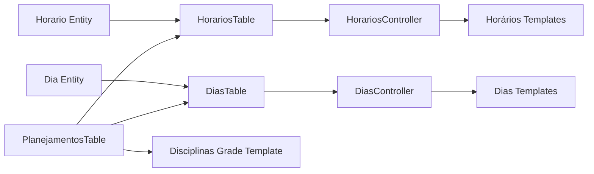

# Time Slot and Day Management

<cite>
**Referenced Files in This Document**
- [Horario.php](file://src/Model/Entity/Horario.php)
- [Dia.php](file://src/Model/Entity/Dia.php)
- [HorariosTable.php](file://src/Model/Table/HorariosTable.php)
- [DiasTable.php](file://src/Model/Table/DiasTable.php)
- [CreateHorarios.php](file://config/Migrations/20260612030431_CreateHorarios.php)
- [CreateDias.php](file://config/Migrations/20260612030430_CreateDias.php)
- [HorariosController.php](file://src/Controller/HorariosController.php)
- [DiasController.php](file://src/Controller/DiasController.php)
- [add.php (Horários)](file://templates/Horarios/add.php)
- [add.php (Dias)](file://templates/Dias/add.php)
- [index.php (Horários)](file://templates/Horarios/index.php)
- [PlanejamentosTable.php](file://src/Model/Table/PlanejamentosTable.php)
- [grade.php](file://templates/Disciplinas/grade.php)
</cite>

## Table of Contents
1. [Introduction](#introduction)
2. [Project Structure](#project-structure)
3. [Core Components](#core-components)
4. [Architecture Overview](#architecture-overview)
5. [Detailed Component Analysis](#detailed-component-analysis)
6. [Dependency Analysis](#dependency-analysis)
7. [Performance Considerations](#performance-considerations)
8. [Troubleshooting Guide](#troubleshooting-guide)
9. [Conclusion](#conclusion)
10. [Appendices](#appendices)

## Introduction
This document explains the time slot and day-of-week management system used by the scheduling application. It focuses on:
- Horario entity for defining time periods (e.g., morning/afternoon/evening slots)
- Dia entity for weekday management
- Validation rules, persistence, and controller flows
- Integration with the main scheduling system via Planejamento entities
- Practical usage examples through templates and controllers
- Guidelines for responsive design, accessibility, animations, transitions, cross-browser compatibility, and performance optimization for calendar views

The goal is to provide both technical depth and practical guidance for building robust, accessible, and performant time-based interfaces.

## Project Structure
The time slot and day management features are implemented using CakePHP conventions:
- Entities define data models and mass-assignment policies
- Tables configure database mapping, behaviors, and validation
- Migrations define schema structure
- Controllers handle HTTP requests and orchestrate persistence
- Templates render forms and grid views that compose days and time slots into a schedule

**Diagram sources**
- [Horario.php:1-31](file://src/Model/Entity/Horario.php#L1-L31)
- [Dia.php:1-31](file://src/Model/Entity/Dia.php#L1-L31)
- [HorariosTable.php:1-65](file://src/Model/Table/HorariosTable.php#L1-L65)
- [DiasTable.php:1-65](file://src/Model/Table/DiasTable.php#L1-L65)
- [CreateHorarios.php:1-40](file://config/Migrations/20260612030431_CreateHorarios.php#L1-L40)
- [CreateDias.php:1-40](file://config/Migrations/20260612030430_CreateDias.php#L1-L40)
- [HorariosController.php:1-121](file://src/Controller/HorariosController.php#L1-L121)
- [DiasController.php:1-121](file://src/Controller/DiasController.php#L1-L121)
- [add.php (Horários):1-17](file://templates/Horarios/add.php#L1-L17)
- [index.php (Horários):1-54](file://templates/Horarios/index.php#L1-L54)
- [add.php (Dias):1-17](file://templates/Dias/add.php#L1-L17)
- [PlanejamentosTable.php:1-57](file://src/Model/Table/PlanejamentosTable.php#L1-L57)
- [grade.php:1-129](file://templates/Disciplinas/grade.php#L1-L129)

**Section sources**
- [Horario.php:1-31](file://src/Model/Entity/Horario.php#L1-L31)
- [Dia.php:1-31](file://src/Model/Entity/Dia.php#L1-L31)
- [HorariosTable.php:1-65](file://src/Model/Table/HorariosTable.php#L1-L65)
- [DiasTable.php:1-65](file://src/Model/Table/DiasTable.php#L1-L65)
- [CreateHorarios.php:1-40](file://config/Migrations/20260612030431_CreateHorarios.php#L1-L40)
- [CreateDias.php:1-40](file://config/Migrations/20260612030430_CreateDias.php#L1-L40)
- [HorariosController.php:1-121](file://src/Controller/HorariosController.php#L1-L121)
- [DiasController.php:1-121](file://src/Controller/DiasController.php#L1-L121)
- [add.php (Horários):1-17](file://templates/Horarios/add.php#L1-L17)
- [index.php (Horários):1-54](file://templates/Horarios/index.php#L1-L54)
- [add.php (Dias):1-17](file://templates/Dias/add.php#L1-L17)
- [PlanejamentosTable.php:1-57](file://src/Model/Table/PlanejamentosTable.php#L1-L57)
- [grade.php:1-129](file://templates/Disciplinas/grade.php#L1-L129)

## Core Components
- Horario entity represents a time slot definition with fields for label and ordering.
- Dia entity represents a weekday definition with fields for label and ordering.
- HorariosTable configures table mapping, timestamp behavior, and validation rules for time slots.
- DiasTable configures table mapping, timestamp behavior, and validation rules for weekdays.
- Migrations create the underlying tables and columns.
- Controllers expose CRUD endpoints for managing time slots and weekdays.
- Templates provide forms and listing pages for user interaction.
- Planejamento integrates days and time slots into actual schedules.

Key responsibilities:
- Data modeling and access control via entities
- Persistence configuration and validation via tables
- Schema evolution via migrations
- Request handling and authorization via controllers
- Presentation and user workflows via templates
- Scheduling composition via relationships in Planejamento

**Section sources**
- [Horario.php:1-31](file://src/Model/Entity/Horario.php#L1-L31)
- [Dia.php:1-31](file://src/Model/Entity/Dia.php#L1-L31)
- [HorariosTable.php:1-65](file://src/Model/Table/HorariosTable.php#L1-L65)
- [DiasTable.php:1-65](file://src/Model/Table/DiasTable.php#L1-L65)
- [CreateHorarios.php:1-40](file://config/Migrations/20260612030431_CreateHorarios.php#L1-L40)
- [CreateDias.php:1-40](file://config/Migrations/20260612030430_CreateDias.php#L1-L40)
- [HorariosController.php:1-121](file://src/Controller/HorariosController.php#L1-L121)
- [DiasController.php:1-121](file://src/Controller/DiasController.php#L1-L121)
- [add.php (Horários):1-17](file://templates/Horarios/add.php#L1-L17)
- [index.php (Horários):1-54](file://templates/Horarios/index.php#L1-L54)
- [add.php (Dias):1-17](file://templates/Dias/add.php#L1-L17)
- [PlanejamentosTable.php:1-57](file://src/Model/Table/PlanejamentosTable.php#L1-L57)

## Architecture Overview
The system follows a layered architecture:
- Presentation layer: Controllers and templates
- Domain layer: Entities and Tables
- Infrastructure layer: Database schema via migrations

**Diagram sources**
- [Horario.php:1-31](file://src/Model/Entity/Horario.php#L1-L31)
- [Dia.php:1-31](file://src/Model/Entity/Dia.php#L1-L31)
- [HorariosTable.php:1-65](file://src/Model/Table/HorariosTable.php#L1-L65)
- [DiasTable.php:1-65](file://src/Model/Table/DiasTable.php#L1-L65)
- [HorariosController.php:1-121](file://src/Controller/HorariosController.php#L1-L121)
- [DiasController.php:1-121](file://src/Controller/DiasController.php#L1-L121)
- [PlanejamentosTable.php:1-57](file://src/Model/Table/PlanejamentosTable.php#L1-L57)

## Detailed Component Analysis

### Horario (Time Slot) Component
Purpose:
- Define discrete time periods used across schedules
- Provide an ordered list for rendering consistent time grids

Implementation highlights:
- Entity defines accessible fields for mass assignment
- Table sets display field, primary key, and timestamp behavior
- Validation enforces presence and length constraints for labels and order

Usage patterns:
- Create new time slots via controller add flow
- List and manage existing slots via index view
- Reference slots in scheduling grid cells

**Diagram sources**
- [HorariosController.php:55-74](file://src/Controller/HorariosController.php#L55-L74)
- [HorariosTable.php:49-63](file://src/Model/Table/HorariosTable.php#L49-L63)
- [CreateHorarios.php:16-38](file://config/Migrations/20260612030431_CreateHorarios.php#L16-L38)

**Section sources**
- [Horario.php:1-31](file://src/Model/Entity/Horario.php#L1-L31)
- [HorariosTable.php:33-63](file://src/Model/Table/HorariosTable.php#L33-L63)
- [HorariosController.php:55-74](file://src/Controller/HorariosController.php#L55-L74)
- [CreateHorarios.php:16-38](file://config/Migrations/20260612030431_CreateHorarios.php#L16-L38)
- [add.php (Horários):1-17](file://templates/Horarios/add.php#L1-L17)
- [index.php (Horários):1-54](file://templates/Horarios/index.php#L1-L54)

### Dia (Day of Week) Component
Purpose:
- Represent weekdays used in scheduling grids
- Maintain ordering for consistent display

Implementation highlights:
- Entity defines accessible fields for mass assignment
- Table sets display field, primary key, and timestamp behavior
- Validation enforces presence and length constraints for labels and order

Usage patterns:
- Create weekdays via controller add flow
- List and manage weekdays via index view
- Reference weekdays in scheduling grid cells

**Diagram sources**
- [DiasController.php:55-74](file://src/Controller/DiasController.php#L55-L74)
- [DiasTable.php:49-63](file://src/Model/Table/DiasTable.php#L49-L63)
- [CreateDias.php:16-38](file://config/Migrations/20260612030430_CreateDias.php#L16-L38)

**Section sources**
- [Dia.php:1-31](file://src/Model/Entity/Dia.php#L1-L31)
- [DiasTable.php:33-63](file://src/Model/Table/DiasTable.php#L33-L63)
- [DiasController.php:55-74](file://src/Controller/DiasController.php#L55-L74)
- [CreateDias.php:16-38](file://config/Migrations/20260612030430_CreateDias.php#L16-L38)
- [add.php (Dias):1-17](file://templates/Dias/add.php#L1-L17)

### Integration with Scheduling System (Planejamento)
Purpose:
- Bind specific days and time slots to scheduled items
- Support filtering and rendering of grade views

Implementation highlights:
- Relationships defined in PlanejamentoTable link to Dias and Horarios
- Validation ensures required foreign keys for scheduling entries
- Templates compose days and time slots into period-specific grids

**Diagram sources**
- [PlanejamentosTable.php:19-40](file://src/Model/Table/PlanejamentosTable.php#L19-L40)
- [grade.php:20-83](file://templates/Disciplinas/grade.php#L20-L83)

**Section sources**
- [PlanejamentosTable.php:11-40](file://src/Model/Table/PlanejamentosTable.php#L11-L40)
- [grade.php:1-129](file://templates/Disciplinas/grade.php#L1-L129)

## Dependency Analysis
- Entities depend only on framework base classes
- Tables depend on entities and configure behaviors and validators
- Controllers depend on tables and orchestrate request/response cycles
- Templates depend on controllers’ view variables and use helpers for UI
- Scheduling grid depends on relationships between Planejamento, Dias, and Horarios

**Diagram sources**
- [Horario.php:1-31](file://src/Model/Entity/Horario.php#L1-L31)
- [Dia.php:1-31](file://src/Model/Entity/Dia.php#L1-L31)
- [HorariosTable.php:1-65](file://src/Model/Table/HorariosTable.php#L1-L65)
- [DiasTable.php:1-65](file://src/Model/Table/DiasTable.php#L1-L65)
- [HorariosController.php:1-121](file://src/Controller/HorariosController.php#L1-L121)
- [DiasController.php:1-121](file://src/Controller/DiasController.php#L1-L121)
- [PlanejamentosTable.php:1-57](file://src/Model/Table/PlanejamentosTable.php#L1-L57)
- [grade.php:1-129](file://templates/Disciplinas/grade.php#L1-L129)

**Section sources**
- [HorariosTable.php:1-65](file://src/Model/Table/HorariosTable.php#L1-L65)
- [DiasTable.php:1-65](file://src/Model/Table/DiasTable.php#L1-L65)
- [HorariosController.php:1-121](file://src/Controller/HorariosController.php#L1-L121)
- [DiasController.php:1-121](file://src/Controller/DiasController.php#L1-L121)
- [PlanejamentosTable.php:1-57](file://src/Model/Table/PlanejamentosTable.php#L1-L57)
- [grade.php:1-129](file://templates/Disciplinas/grade.php#L1-L129)

## Performance Considerations
- Use pagination for large lists of time slots and weekdays to reduce payload size
- Prefer indexed queries on frequently filtered fields (e.g., ordem) if needed
- Cache lookup tables (days and time slots) when rendered repeatedly across views
- Minimize N+1 queries by using containments in table associations
- Keep template logic simple; precompute groupings in controllers or services
- Avoid heavy client-side processing; leverage server-side rendering for initial load
- Use efficient CSS frameworks and avoid excessive DOM manipulation for calendar grids

[No sources needed since this section provides general guidance]

## Troubleshooting Guide
Common issues and resolutions:
- Validation failures on creation/edit:
  - Ensure required fields (label and order) are present and within allowed lengths
  - Check error messages returned by the validator and displayed in templates
- Authorization errors:
  - Verify beforeFilter allows public access where intended
  - Confirm authorization checks pass for add/edit/delete actions
- Missing relationships in schedule grid:
  - Validate foreign keys (dia_id, horario_id) exist and are correctly referenced
  - Inspect association definitions in PlanejamentoTable

Operational references:
- Controller add/edit flows and flash messages
- Table validation rules
- Template rendering of forms and lists

**Section sources**
- [HorariosController.php:55-97](file://src/Controller/HorariosController.php#L55-L97)
- [DiasController.php:55-97](file://src/Controller/DiasController.php#L55-L97)
- [HorariosTable.php:49-63](file://src/Model/Table/HorariosTable.php#L49-L63)
- [DiasTable.php:49-63](file://src/Model/Table/DiasTable.php#L49-L63)
- [add.php (Horários):1-17](file://templates/Horarios/add.php#L1-L17)
- [add.php (Dias):1-17](file://templates/Dias/add.php#L1-L17)

## Conclusion
The time slot and day management system provides a solid foundation for scheduling:
- Clear separation of concerns across entities, tables, controllers, and templates
- Robust validation and persistence mechanisms
- Seamless integration into the broader scheduling grid
- Opportunities for further enhancements such as conflict detection, advanced UX, and performance optimizations

[No sources needed since this section summarizes without analyzing specific files]

## Appendices

### Usage Examples (Code Snippet Paths)
- Creating a time slot:
  - [HorariosController::add:55-74](file://src/Controller/HorariosController.php#L55-L74)
  - [HorariosTable::validationDefault:49-63](file://src/Model/Table/HorariosTable.php#L49-L63)
  - [Horários Add Template:1-17](file://templates/Horarios/add.php#L1-L17)
- Configuring a weekday:
  - [DiasController::add:55-74](file://src/Controller/DiasController.php#L55-L74)
  - [DiasTable::validationDefault:49-63](file://src/Model/Table/DiasTable.php#L49-L63)
  - [Dias Add Template:1-17](file://templates/Dias/add.php#L1-L17)
- Listing time slots:
  - [Horários Index Template:1-54](file://templates/Horarios/index.php#L1-L54)
- Integrating into schedule grid:
  - [PlanejamentosTable associations:19-40](file://src/Model/Table/PlanejamentosTable.php#L19-L40)
  - [Disciplinas Grade Template:20-83](file://templates/Disciplinas/grade.php#L20-L83)

### Responsive Design Guidelines for Time-Based Interfaces
- Use fluid grids and flexible column widths for day/time cells
- Collapse or stack content on small screens; consider horizontal scrolling for wide grids
- Increase touch targets for interactive cells and buttons
- Provide clear visual hierarchy for headers and labels

### Accessibility Compliance
- Use semantic HTML elements (tables, headings, lists) appropriately
- Provide ARIA labels and roles for dynamic controls
- Ensure sufficient color contrast and keyboard navigation support
- Offer text alternatives for icons and status indicators

### Animation Patterns and Transitions
- Animate cell additions/removals with subtle fade/slide effects
- Transition between periods with smooth scroll or highlight changes
- Respect reduced motion preferences via media queries

### Cross-Browser Compatibility
- Test grid layouts across major browsers and devices
- Normalize styles and ensure consistent flexbox/grid behavior
- Polyfill or fallback for older browsers if necessary

### Conflict Resolution and Scheduling Constraints
- Detect overlapping assignments at the same day and time slot
- Enforce resource constraints (room, instructor availability)
- Surface conflicts to users with actionable feedback

[No sources needed since this section provides general guidance]