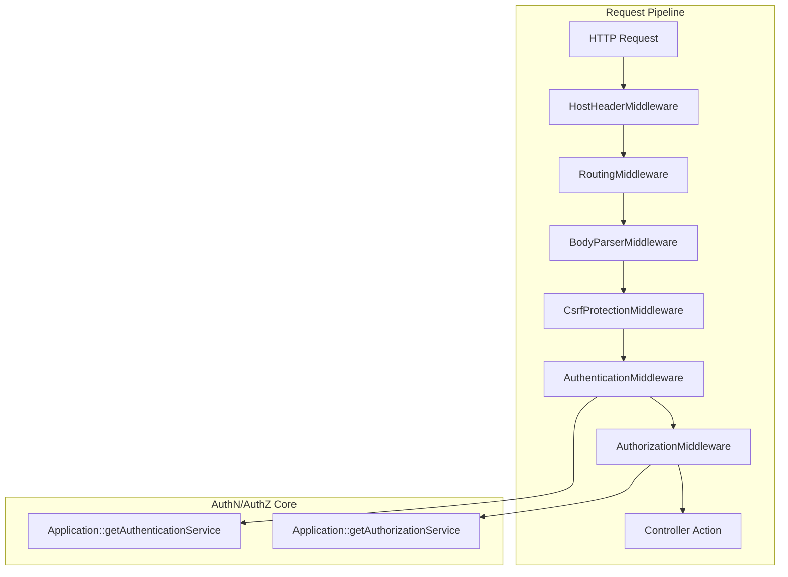
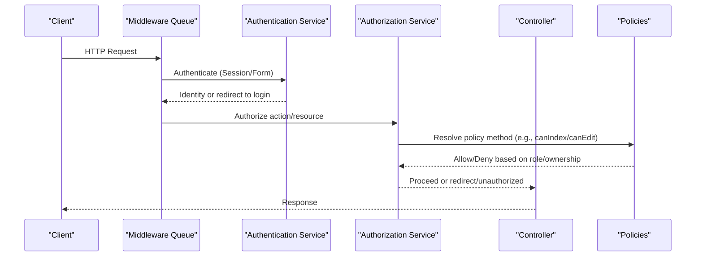
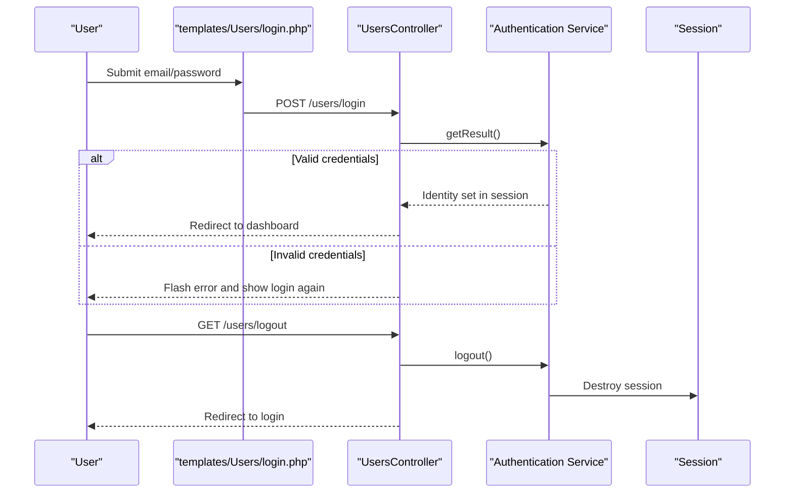
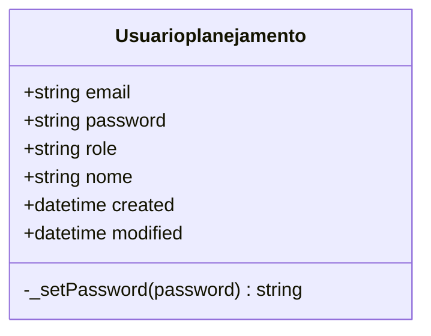
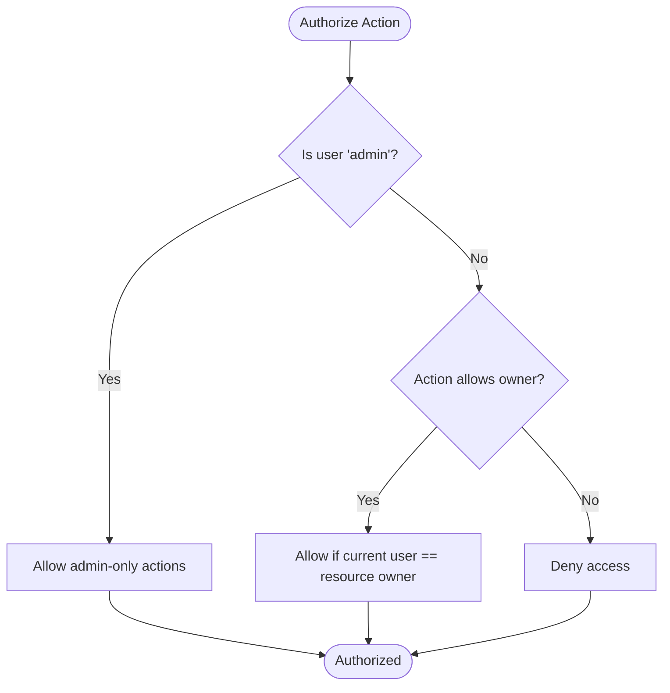
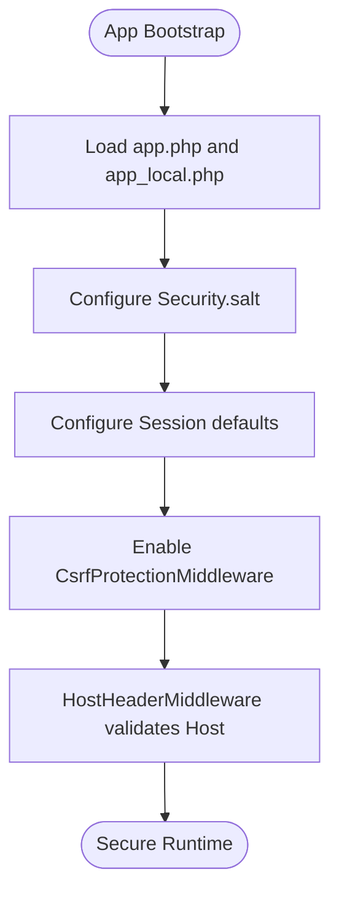
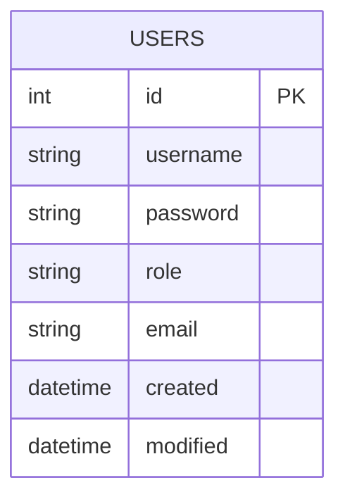
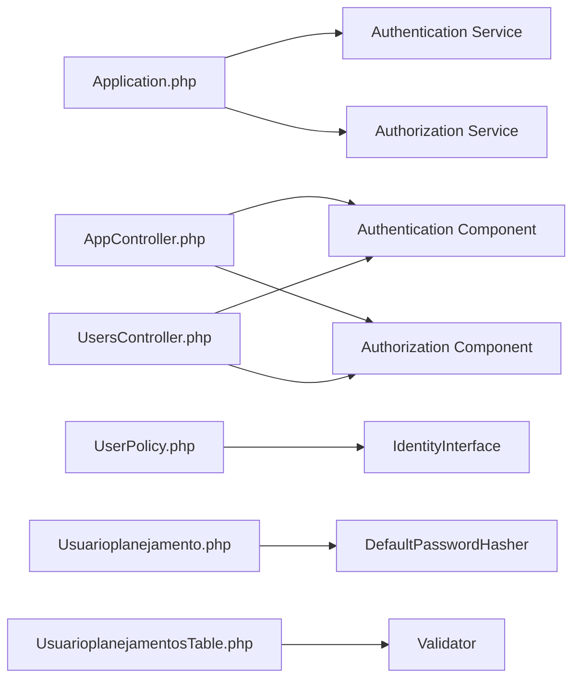

# User Authentication and Authorization

<cite>
**Referenced Files in This Document**
- [Application.php](file://src/Application.php)
- [AppController.php](file://src/Controller/AppController.php)
- [UsersController.php](file://src/Controller/UsersController.php)
- [UsuarioplanejamentosTable.php](file://src/Model/Table/UsuarioplanejamentosTable.php)
- [Usuarioplanejamento.php](file://src/Model/Entity/Usuarioplanejamento.php)
- [UserPolicy.php](file://src/Policy/UserPolicy.php)
- [DisciplinaPolicy.php](file://src/Policy/DisciplinaPolicy.php)
- [ConfiguraplanejamentoPolicy.php](file://src/Policy/ConfiguraplanejamentoPolicy.php)
- [HostHeaderMiddleware.php](file://src/Middleware/HostHeaderMiddleware.php)
- [app.php](file://config/app.php)
- [bootstrap.php](file://config/bootstrap.php)
- [20260612021814_CreateUsers.php](file://config/Migrations/20260612021814_CreateUsers.php)
- [login.php](file://templates/Users/login.php)
</cite>

## Table of Contents
1. [Introduction](#introduction)
2. [Project Structure](#project-structure)
3. [Core Components](#core-components)
4. [Architecture Overview](#architecture-overview)
5. [Detailed Component Analysis](#detailed-component-analysis)
6. [Dependency Analysis](#dependency-analysis)
7. [Performance Considerations](#performance-considerations)
8. [Troubleshooting Guide](#troubleshooting-guide)
9. [Conclusion](#conclusion)

## Introduction
This document explains the user authentication and authorization system implemented in the application. It covers:
- Role-based access control (RBAC) with admin and user roles
- The User entity structure and password hashing
- Session handling and login/logout workflows
- Policy-based authorization patterns across resources
- Security measures, best practices, and troubleshooting guidance

The system uses CakePHP’s Authentication and Authorization plugins with a policy-driven approach to enforce permissions per resource and action.

## Project Structure
Authentication and authorization are wired at the application level and enforced via middleware, controllers, entities, tables, and policies. Key locations:
- Application bootstrap and middleware pipeline
- Controllers for authentication flows
- ORM table/entity for users
- Policies for RBAC decisions
- Configuration for sessions and security settings
- Database migration defining the users schema

**Diagram sources**
- [Application.php:73-122](file://src/Application.php#L73-L122)
- [HostHeaderMiddleware.php:32-57](file://src/Middleware/HostHeaderMiddleware.php#L32-L57)

**Section sources**
- [Application.php:73-122](file://src/Application.php#L73-L122)
- [AppController.php:40-53](file://src/Controller/AppController.php#L40-L53)

## Core Components
- Authentication service configuration: form authenticator using email/password against the Usuarioplanejamentos model; session authenticator enabled first.
- Authorization service configured with an ORM resolver that maps controller actions to policy methods.
- AppController loads Flash, Authentication, and Authorization components globally.
- UsersController exposes login, logout, and profile endpoints; marks these as unauthenticated.
- UsuarioplanejamentosTable defines validation rules and timestamps.
- Usuarioplanejamento entity hashes passwords on write and hides them from output.
- Policies implement role checks (admin vs user) and ownership checks where applicable.

**Section sources**
- [Application.php:124-162](file://src/Application.php#L124-L162)
- [AppController.php:40-53](file://src/Controller/AppController.php#L40-L53)
- [UsersController.php:13-24](file://src/Controller/UsersController.php#L13-L24)
- [UsuarioplanejamentosTable.php:11-41](file://src/Model/Table/UsuarioplanejamentosTable.php#L11-L41)
- [Usuarioplanejamento.php:14-36](file://src/Model/Entity/Usuarioplanejamento.php#L14-L36)
- [UserPolicy.php:12-36](file://src/Policy/UserPolicy.php#L12-L36)

## Architecture Overview
The request lifecycle integrates authentication and authorization early in the middleware stack. After routing and body parsing, CSRF protection is applied, then authentication resolves identity, followed by authorization checking against policies.

**Diagram sources**
- [Application.php:107-122](file://src/Application.php#L107-L122)
- [Application.php:124-162](file://src/Application.php#L124-L162)
- [AppController.php:46-53](file://src/Controller/AppController.php#L46-L53)

## Detailed Component Analysis

### Authentication Flow (Login/Logout/Profile)
- Login template collects email and password.
- UsersController allows GET/POST to login, checks result validity, flashes messages, and redirects upon success.
- Logout clears session and redirects.
- Profile requires identity; otherwise redirects to login.

**Diagram sources**
- [login.php:14-36](file://templates/Users/login.php#L14-L36)
- [UsersController.php:29-60](file://src/Controller/UsersController.php#L29-L60)
- [Application.php:132-152](file://src/Application.php#L132-L152)

**Section sources**
- [UsersController.php:13-76](file://src/Controller/UsersController.php#L13-L76)
- [login.php:14-36](file://templates/Users/login.php#L14-L36)

### User Entity and Password Security
- The Usuarioplanejamento entity overrides the password setter to hash values using a secure hasher before persistence.
- Passwords are hidden from array serialization to prevent accidental exposure.
- Validation ensures required fields and length constraints.

**Diagram sources**
- [Usuarioplanejamento.php:14-36](file://src/Model/Entity/Usuarioplanejamento.php#L14-L36)

**Section sources**
- [Usuarioplanejamento.php:14-36](file://src/Model/Entity/Usuarioplanejamento.php#L14-L36)
- [UsuarioplanejamentosTable.php:24-41](file://src/Model/Table/UsuarioplanejamentosTable.php#L24-L41)

### Role-Based Access Control (RBAC)
- Roles used: admin and user (with editor referenced in some policies).
- UserPolicy enforces:
  - Only admins can list/add users.
  - Users can view/edit their own records; admins can view/edit any.
  - Admins can delete users except themselves.
- Other policies demonstrate role checks and ownership checks:
  - ConfiguraplanejamentoPolicy: owners or admins can edit; only admins can delete/clone.
  - DisciplinaPolicy: editors/admins can add/edit; only admins can delete.

**Diagram sources**
- [UserPolicy.php:12-36](file://src/Policy/UserPolicy.php#L12-L36)
- [ConfiguraplanejamentoPolicy.php:27-42](file://src/Policy/ConfiguraplanejamentoPolicy.php#L27-L42)
- [DisciplinaPolicy.php:21-34](file://src/Policy/DisciplinaPolicy.php#L21-L34)

**Section sources**
- [UserPolicy.php:12-36](file://src/Policy/UserPolicy.php#L12-L36)
- [ConfiguraplanejamentoPolicy.php:21-42](file://src/Policy/ConfiguraplanejamentoPolicy.php#L21-L42)
- [DisciplinaPolicy.php:11-34](file://src/Policy/DisciplinaPolicy.php#L11-L34)

### Session Handling and Security Settings
- Sessions default to PHP engine; database-backed sessions are supported via provided SQL schema.
- CSRF protection is enabled with HttpOnly cookies.
- Host header validation prevents host injection in production.
- Security salt is loaded from configuration.

**Diagram sources**
- [app.php:419-421](file://config/app.php#L419-L421)
- [app.php:80-82](file://config/app.php#L80-L82)
- [bootstrap.php:194](file://config/bootstrap.php#L194)
- [Application.php:103-105](file://src/Application.php#L103-L105)
- [HostHeaderMiddleware.php:32-57](file://src/Middleware/HostHeaderMiddleware.php#L32-L57)

**Section sources**
- [app.php:419-421](file://config/app.php#L419-L421)
- [app.php:80-82](file://config/app.php#L80-L82)
- [bootstrap.php:194](file://config/bootstrap.php#L194)
- [Application.php:103-105](file://src/Application.php#L103-L105)
- [HostHeaderMiddleware.php:32-57](file://src/Middleware/HostHeaderMiddleware.php#L32-L57)

### Database Schema for Users
- Migration creates the users table with username, password, role, email, created, and modified columns.
- The ORM table maps to this table and sets display field and primary key.

**Diagram sources**
- [20260612021814_CreateUsers.php:16-48](file://config/Migrations/20260612021814_CreateUsers.php#L16-L48)

**Section sources**
- [20260612021814_CreateUsers.php:16-48](file://config/Migrations/20260612021814_CreateUsers.php#L16-L48)
- [UsuarioplanejamentosTable.php:11-22](file://src/Model/Table/UsuarioplanejamentosTable.php#L11-L22)

## Dependency Analysis
- Application wires Authentication and Authorization middlewares and services.
- Controllers rely on components loaded in AppController.
- Policies depend on IdentityInterface and entity types to make decisions.
- Entities use password hashing utilities; tables provide validation.

**Diagram sources**
- [Application.php:107-162](file://src/Application.php#L107-L162)
- [AppController.php:46-53](file://src/Controller/AppController.php#L46-L53)
- [UsersController.php:13-24](file://src/Controller/UsersController.php#L13-L24)
- [UserPolicy.php:12-36](file://src/Policy/UserPolicy.php#L12-L36)
- [Usuarioplanejamento.php:30-36](file://src/Model/Entity/Usuarioplanejamento.php#L30-L36)
- [UsuarioplanejamentosTable.php:24-41](file://src/Model/Table/UsuarioplanejamentosTable.php#L24-L41)

**Section sources**
- [Application.php:107-162](file://src/Application.php#L107-L162)
- [AppController.php:46-53](file://src/Controller/AppController.php#L46-L53)
- [UsersController.php:13-24](file://src/Controller/UsersController.php#L13-L24)
- [UserPolicy.php:12-36](file://src/Policy/UserPolicy.php#L12-L36)
- [Usuarioplanejamento.php:30-36](file://src/Model/Entity/Usuarioplanejamento.php#L30-L36)
- [UsuarioplanejamentosTable.php:24-41](file://src/Model/Table/UsuarioplanejamentosTable.php#L24-L41)

## Performance Considerations
- Prefer database-backed sessions in multi-server deployments to avoid sticky sessions.
- Keep policy logic lightweight; avoid heavy queries inside policy methods.
- Use explicit authorization checks only where needed; skip authorization for public read endpoints when appropriate.
- Ensure fullBaseUrl is set in production to avoid unnecessary host resolution overhead.

[No sources needed since this section provides general guidance]

## Troubleshooting Guide
Common issues and resolutions:
- Login fails repeatedly:
  - Verify form fields map to email/password and the correct user model is used.
  - Confirm password hashing is active in the entity.
- Unauthorized redirects to login unexpectedly:
  - Check which actions are marked unauthenticated in controllers.
  - Review policy methods for overly restrictive conditions.
- Host header errors in production:
  - Ensure App.fullBaseUrl is configured and matches the incoming Host header.
- Session not persisting:
  - Validate session configuration and storage backend availability.
- CSRF errors:
  - Ensure forms include CSRF tokens and cookie settings are correct.

**Section sources**
- [Application.php:132-152](file://src/Application.php#L132-L152)
- [Usuarioplanejamento.php:30-36](file://src/Model/Entity/Usuarioplanejamento.php#L30-L36)
- [UsersController.php:13-24](file://src/Controller/UsersController.php#L13-L24)
- [HostHeaderMiddleware.php:32-57](file://src/Middleware/HostHeaderMiddleware.php#L32-L57)
- [app.php:419-421](file://config/app.php#L419-L421)
- [Application.php:103-105](file://src/Application.php#L103-L105)

## Conclusion
The application implements a robust, policy-driven authorization model with clear separation between authentication and authorization concerns. RBAC is enforced through dedicated policies, while password security and session management follow established CakePHP patterns. Proper configuration of fullBaseUrl, CSRF, and host validation further hardens the system. For future enhancements, consider introducing more granular roles and fine-grained ownership checks where necessary.