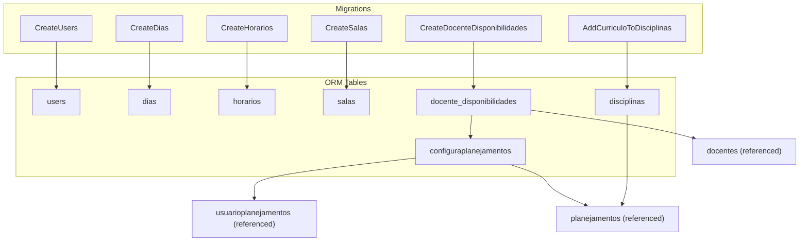
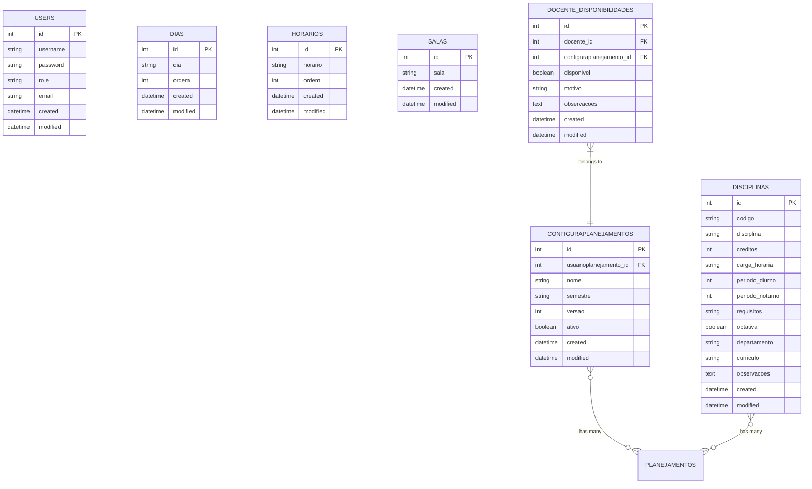
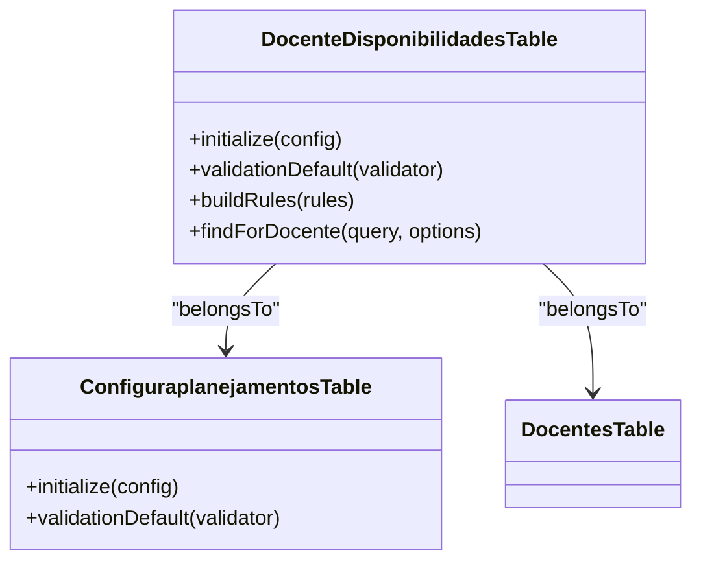
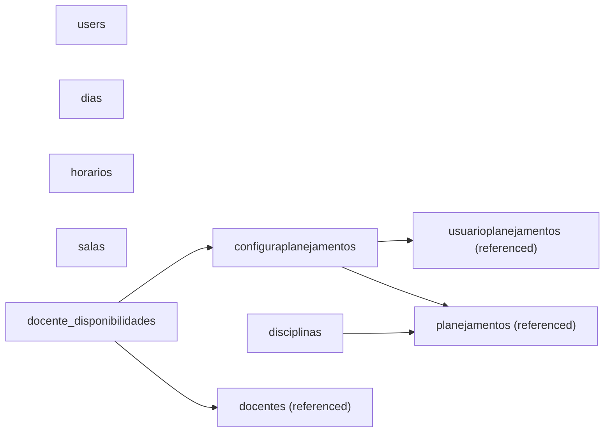

# Database Schema

<cite>
**Referenced Files in This Document**
- [20260612021814_CreateUsers.php](file://config/Migrations/20260612021814_CreateUsers.php)
- [20260612030430_CreateDias.php](file://config/Migrations/20260612030430_CreateDias.php)
- [20260612030431_CreateHorarios.php](file://config/Migrations/20260612030431_CreateHorarios.php)
- [20260612030432_CreateSalas.php](file://config/Migrations/20260612030432_CreateSalas.php)
- [20260613100000_CreateDocenteDisponibilidades.php](file://config/Migrations/20260613100000_CreateDocenteDisponibilidades.php)
- [20260618004511_AddCurriculoToDisciplinas.php](file://config/Migrations/20260618004511_AddCurriculoToDisciplinas.php)
- [DiasTable.php](file://src/Model/Table/DiasTable.php)
- [HorariosTable.php](file://src/Model/Table/HorariosTable.php)
- [SalasTable.php](file://src/Model/Table/SalasTable.php)
- [DocenteDisponibilidadesTable.php](file://src/Model/Table/DocenteDisponibilidadesTable.php)
- [ConfiguraplanejamentosTable.php](file://src/Model/Table/ConfiguraplanejamentosTable.php)
- [DisciplinasTable.php](file://src/Model/Table/DisciplinasTable.php)
</cite>

## Table of Contents
1. [Introduction](#introduction)
2. [Project Structure](#project-structure)
3. [Core Components](#core-components)
4. [Architecture Overview](#architecture-overview)
5. [Detailed Component Analysis](#detailed-component-analysis)
6. [Dependency Analysis](#dependency-analysis)
7. [Performance Considerations](#performance-considerations)
8. [Troubleshooting Guide](#troubleshooting-guide)
9. [Conclusion](#conclusion)
10. [Appendices](#appendices)

## Introduction
This document describes the database schema and data model for the planejamento5 academic planning system. It focuses on entities such as users, schedules (time slots), faculty members, classrooms, courses, days, and availability records. The documentation consolidates information from migration files and ORM table definitions to present a complete view of primary keys, foreign keys, indexes, constraints, validation rules, and relationships. It also outlines data access patterns, performance considerations, lifecycle management, migration paths, security measures, and sample queries.

## Project Structure
The database schema is defined through CakePHP migrations and enforced via ORM table classes. Migrations create tables and indexes; table classes define behaviors, relationships, and validation rules.

**Diagram sources**
- [20260612021814_CreateUsers.php:16-48](file://config/Migrations/20260612021814_CreateUsers.php#L16-L48)
- [20260612030430_CreateDias.php:16-38](file://config/Migrations/20260612030430_CreateDias.php#L16-L38)
- [20260612030431_CreateHorarios.php:16-38](file://config/Migrations/20260612030431_CreateHorarios.php#L16-L38)
- [20260612030432_CreateSalas.php:16-33](file://config/Migrations/20260612030432_CreateSalas.php#L16-L33)
- [20260613100000_CreateDocenteDisponibilidades.php:8-46](file://config/Migrations/20260613100000_CreateDocenteDisponibilidades.php#L8-L46)
- [20260618004511_AddCurriculoToDisciplinas.php:16-25](file://config/Migrations/20260618004511_AddCurriculoToDisciplinas.php#L16-L25)
- [ConfiguraplanejamentosTable.php:11-31](file://src/Model/Table/ConfiguraplanejamentosTable.php#L11-L31)
- [DocenteDisponibilidadesTable.php:13-30](file://src/Model/Table/DocenteDisponibilidadesTable.php#L13-L30)
- [DisciplinasTable.php:15-27](file://src/Model/Table/DisciplinasTable.php#L15-L27)

**Section sources**
- [20260612021814_CreateUsers.php:16-48](file://config/Migrations/20260612021814_CreateUsers.php#L16-L48)
- [20260612030430_CreateDias.php:16-38](file://config/Migrations/20260612030430_CreateDias.php#L16-L38)
- [20260612030431_CreateHorarios.php:16-38](file://config/Migrations/20260612030431_CreateHorarios.php#L16-L38)
- [20260612030432_CreateSalas.php:16-33](file://config/Migrations/20260612030432_CreateSalas.php#L16-L33)
- [20260613100000_CreateDocenteDisponibilidades.php:8-46](file://config/Migrations/20260613100000_CreateDocenteDisponibilidades.php#L8-L46)
- [20260618004511_AddCurriculoToDisciplinas.php:16-25](file://config/Migrations/20260618004511_AddCurriculoToDisciplinas.php#L16-L25)
- [DiasTable.php:33-41](file://src/Model/Table/DiasTable.php#L33-L41)
- [HorariosTable.php:33-41](file://src/Model/Table/HorariosTable.php#L33-L41)
- [SalasTable.php:33-41](file://src/Model/Table/SalasTable.php#L33-L41)
- [DocenteDisponibilidadesTable.php:13-30](file://src/Model/Table/DocenteDisponibilidadesTable.php#L13-L30)
- [ConfiguraplanejamentosTable.php:11-31](file://src/Model/Table/ConfiguraplanejamentosTable.php#L11-L31)
- [DisciplinasTable.php:15-27](file://src/Model/Table/DisciplinasTable.php#L15-L27)

## Core Components
This section summarizes each core entity with its fields, types, constraints, and relationships.

- Users
  - Fields: username, password, role, email, created, modified
  - Primary key: id (implicit)
  - Constraints: Not null on username, password, role, email, created, modified
  - Timestamps: managed by application logic or framework behavior where applicable
  - Purpose: Authentication and authorization context

- Days (dias)
  - Fields: dia (string), ordem (integer), created, modified
  - Primary key: id (implicit)
  - Validation: dia required and non-empty; ordem required and integer
  - Behavior: Timestamp behavior enabled
  - Purpose: Represents weekdays used in scheduling

- Time Slots (horarios)
  - Fields: horario (string), ordem (integer), created, modified
  - Primary key: id (implicit)
  - Validation: horario required and non-empty; ordem required and integer
  - Behavior: Timestamp behavior enabled
  - Purpose: Represents class periods or time blocks

- Classrooms (salas)
  - Fields: sala (string), created, modified
  - Primary key: id (implicit)
  - Validation: sala required and non-empty
  - Behavior: Timestamp behavior enabled
  - Purpose: Physical rooms available for scheduling

- Faculty Availability (docente_disponibilidades)
  - Fields: docente_id, configuraplanejamento_id, disponivel (boolean), motivo (string), observacoes (text), created, modified
  - Primary key: id (implicit)
  - Indexes: docente_id, configuraplanejamento_id, unique(docente_id, configuraplanejamento_id)
  - Relationships: belongsTo Docentes, belongsTo Configuraplanejamentos
  - Validation: integer checks for IDs, boolean check for disponivel, optional text fields
  - Purpose: Records faculty availability per planning configuration

- Planning Configuration (configuraplanejamentos)
  - Fields: usuarioplanejamento_id, nome, semestre, versao, ativo, created, modified
  - Primary key: id (implicit)
  - Relationships: belongsTo Usuarioplanejamentos, hasMany Planejamentos, hasMany DocenteDisponibilidades
  - Validation: nome and semestre required; numeric and boolean fields allowed empty
  - Purpose: A planning instance tied to a user and containing multiple plans

- Courses (disciplinas)
  - Fields: codigo, disciplina, creditos, carga_horaria, periodo_diurno, periodo_noturno, requisitos, optativa, departamento, curriculo, observacoes, created, modified
  - Primary key: id (implicit)
  - Relationships: hasMany Planejamentos
  - Validation: codigo and disciplina required; period fields constrained to specific lists; curriculo limited length
  - Purpose: Catalog of academic courses

Note: Some referenced tables (e.g., docentes, usuarioplanejamentos, planejamentos) are not defined in the provided migrations but are referenced by relationships in table classes. Their schemas are assumed to exist elsewhere in the project.

**Section sources**
- [20260612021814_CreateUsers.php:16-48](file://config/Migrations/20260612021814_CreateUsers.php#L16-L48)
- [20260612030430_CreateDias.php:16-38](file://config/Migrations/20260612030430_CreateDias.php#L16-L38)
- [20260612030431_CreateHorarios.php:16-38](file://config/Migrations/20260612030431_CreateHorarios.php#L16-L38)
- [20260612030432_CreateSalas.php:16-33](file://config/Migrations/20260612030432_CreateSalas.php#L16-L33)
- [20260613100000_CreateDocenteDisponibilidades.php:8-46](file://config/Migrations/20260613100000_CreateDocenteDisponibilidades.php#L8-L46)
- [20260618004511_AddCurriculoToDisciplinas.php:16-25](file://config/Migrations/20260618004511_AddCurriculoToDisciplinas.php#L16-L25)
- [DiasTable.php:33-63](file://src/Model/Table/DiasTable.php#L33-L63)
- [HorariosTable.php:33-63](file://src/Model/Table/HorariosTable.php#L33-L63)
- [SalasTable.php:33-58](file://src/Model/Table/SalasTable.php#L33-L58)
- [DocenteDisponibilidadesTable.php:13-56](file://src/Model/Table/DocenteDisponibilidadesTable.php#L13-L56)
- [ConfiguraplanejamentosTable.php:11-60](file://src/Model/Table/ConfiguraplanejamentosTable.php#L11-L60)
- [DisciplinasTable.php:15-83](file://src/Model/Table/DisciplinasTable.php#L15-L83)

## Architecture Overview
The data architecture centers around planning configurations that aggregate plans, courses, days, time slots, classrooms, and faculty availability. While detailed plan and schedule tables are not included in the provided migrations, the existing entities form the foundation for building schedules.

[No diagram sources since this diagram shows conceptual structure without mapping to specific source lines]

## Detailed Component Analysis

### Users
- Purpose: System authentication and role-based access control
- Key fields: username, password, role, email
- Constraints: All core fields are mandatory at the database level
- Security implications: Password storage should use secure hashing; role field drives permissions

**Section sources**
- [20260612021814_CreateUsers.php:16-48](file://config/Migrations/20260612021814_CreateUsers.php#L16-L48)

### Days (dias)
- Purpose: Enumerates weekdays for timetable construction
- Key fields: dia (name), ordem (ordering)
- Validation: Presence and type enforcement in ORM
- Usage: Referenced by higher-level scheduling entities (not shown here)

**Section sources**
- [20260612030430_CreateDias.php:16-38](file://config/Migrations/20260612030430_CreateDias.php#L16-L38)
- [DiasTable.php:33-63](file://src/Model/Table/DiasTable.php#L33-L63)

### Time Slots (horarios)
- Purpose: Defines class periods or time blocks
- Key fields: horario (label), ordem (ordering)
- Validation: Presence and type enforcement in ORM
- Usage: Referenced by scheduling entities (not shown here)

**Section sources**
- [20260612030431_CreateHorarios.php:16-38](file://config/Migrations/20260612030431_CreateHorarios.php#L16-L38)
- [HorariosTable.php:33-63](file://src/Model/Table/HorariosTable.php#L33-L63)

### Classrooms (salas)
- Purpose: Available physical locations for teaching
- Key fields: sala (identifier/name)
- Validation: Presence enforcement in ORM

**Section sources**
- [20260612030432_CreateSalas.php:16-33](file://config/Migrations/20260612030432_CreateSalas.php#L16-L33)
- [SalasTable.php:33-58](file://src/Model/Table/SalasTable.php#L33-L58)

### Faculty Availability (docente_disponibilidades)
- Purpose: Captures whether a faculty member is available within a planning configuration
- Key fields: docente_id, configuraplanejamento_id, disponivel, motivo, observacoes
- Indexes: Indexed by docente_id and configuraplanejamento_id; unique constraint on their pair
- Relationships:
  - belongsTo Docentes
  - belongsTo Configuraplanejamentos
- Validation: Integer presence for IDs; boolean for disponivel; optional text fields

**Diagram sources**
- [DocenteDisponibilidadesTable.php:13-30](file://src/Model/Table/DocenteDisponibilidadesTable.php#L13-L30)
- [ConfiguraplanejamentosTable.php:11-31](file://src/Model/Table/ConfiguraplanejamentosTable.php#L11-L31)

**Section sources**
- [20260613100000_CreateDocenteDisponibilidades.php:8-46](file://config/Migrations/20260613100000_CreateDocenteDisponibilidades.php#L8-L46)
- [DocenteDisponibilidadesTable.php:13-75](file://src/Model/Table/DocenteDisponibilidadesTable.php#L13-L75)

### Planning Configuration (configuraplanejamentos)
- Purpose: Groups plans under a named semester/version and ties them to a user
- Key fields: usuarioplanejamento_id, nome, semestre, versao, ativo
- Relationships:
  - belongsTo Usuarioplanejamentos
  - hasMany Planejamentos
  - hasMany DocenteDisponibilidades
- Validation: nome and semestre required; numeric and boolean fields allow empty values

**Section sources**
- [ConfiguraplanejamentosTable.php:11-60](file://src/Model/Table/ConfiguraplanejamentosTable.php#L11-L60)

### Courses (disciplinas)
- Purpose: Academic course catalog with attributes like credits, workload, prerequisites, and curriculum code
- Key fields: codigo, disciplina, creditos, carga_horaria, periodo_diurno, periodo_noturno, requisitos, optativa, departamento, curriculo, observacoes
- Relationships: hasMany Planejamentos
- Validation: Required fields for identification; enumerated ranges for diurnal/nocturnal periods; curriculo length limit

**Section sources**
- [20260618004511_AddCurriculoToDisciplinas.php:16-25](file://config/Migrations/20260618004511_AddCurriculoToDisciplinas.php#L16-L25)
- [DisciplinasTable.php:15-83](file://src/Model/Table/DisciplinasTable.php#L15-L83)

## Dependency Analysis
Relationships among core entities:

**Diagram sources**
- [DocenteDisponibilidadesTable.php:13-30](file://src/Model/Table/DocenteDisponibilidadesTable.php#L13-L30)
- [ConfiguraplanejamentosTable.php:11-31](file://src/Model/Table/ConfiguraplanejamentosTable.php#L11-L31)
- [DisciplinasTable.php:15-27](file://src/Model/Table/DisciplinasTable.php#L15-L27)

**Section sources**
- [DocenteDisponibilidadesTable.php:13-30](file://src/Model/Table/DocenteDisponibilidadesTable.php#L13-L30)
- [ConfiguraplanejamentosTable.php:11-31](file://src/Model/Table/ConfiguraplanejamentosTable.php#L11-L31)
- [DisciplinasTable.php:15-27](file://src/Model/Table/DisciplinasTable.php#L15-L27)

## Performance Considerations
- Indexing strategy
  - docente_disponibilidades: indexed by docente_id and configuraplanejamento_id; unique composite index prevents duplicate availability entries per planning configuration
- Query optimization
  - Use existsIn rules and foreign key constraints to avoid expensive joins when validating referential integrity
  - Prefer filtering by configured IDs (e.g., configuraplanejamento_id) to reduce result sets
- Data normalization
  - Days and time slots are normalized reference tables; keep them small and ordered via ordem fields
- Caching considerations
  - Reference data (dias, horarios, salas) can be cached at the application layer if frequently accessed
  - Avoid caching volatile availability data unless invalidated promptly on updates

[No sources needed since this section provides general guidance]

## Troubleshooting Guide
Common issues and resolutions:
- Missing foreign key references
  - Ensure referenced tables (docentes, usuarioplanejamentos, planejamentos) exist before inserting into dependent tables
- Duplicate availability entries
  - The unique index on (docente_id, configuraplanejamento_id) will prevent duplicates; handle errors accordingly
- Validation failures
  - Check ORM validation rules for required fields and allowed value ranges (e.g., periodo_diurno/noturno)
- Timestamp inconsistencies
  - Confirm that the Timestamp behavior is active for tables that rely on automatic created/modified updates

**Section sources**
- [DocenteDisponibilidadesTable.php:58-64](file://src/Model/Table/DocenteDisponibilidadesTable.php#L58-L64)
- [DocenteDisponibilidadesTable.php:32-56](file://src/Model/Table/DocenteDisponibilidadesTable.php#L32-L56)
- [DisciplinasTable.php:29-83](file://src/Model/Table/DisciplinasTable.php#L29-L83)

## Conclusion
The planejamento5 database schema establishes foundational entities for academic planning: users, days, time slots, classrooms, courses, planning configurations, and faculty availability. Strong validation rules and indexes support data integrity and efficient querying. While some higher-level scheduling tables are not included in the provided migrations, the existing structure provides a solid base for extending the model to full timetable generation and management.

[No sources needed since this section summarizes without analyzing specific files]

## Appendices

### Data Lifecycle Management
- Retention policies
  - No explicit archival mechanisms are defined in the provided migrations; consider adding soft-delete flags or partitioning strategies for large historical datasets
- Archival procedures
  - Implement periodic archiving of completed planning configurations and associated plans based on business needs

[No sources needed since this section provides general guidance]

### Data Migration Paths and Version Management
- Migration order
  - CreateUsers -> CreateDias -> CreateHorarios -> CreateSalas -> CreateDocenteDisponibilidades -> AddCurriculoToDisciplinas
- Evolution guidelines
  - Always add new columns via migrations; preserve backward compatibility by allowing nulls initially and enforcing constraints later
  - Use unique indexes carefully to avoid conflicts during rollouts

**Section sources**
- [20260612021814_CreateUsers.php:16-48](file://config/Migrations/20260612021814_CreateUsers.php#L16-L48)
- [20260612030430_CreateDias.php:16-38](file://config/Migrations/20260612030430_CreateDias.php#L16-L38)
- [20260612030431_CreateHorarios.php:16-38](file://config/Migrations/20260612030431_CreateHorarios.php#L16-L38)
- [20260612030432_CreateSalas.php:16-33](file://config/Migrations/20260612030432_CreateSalas.php#L16-L33)
- [20260613100000_CreateDocenteDisponibilidades.php:8-46](file://config/Migrations/20260613100000_CreateDocenteDisponibilidades.php#L8-L46)
- [20260618004511_AddCurriculoToDisciplinas.php:16-25](file://config/Migrations/20260618004511_AddCurriculoToDisciplinas.php#L16-L25)

### Security Measures and Access Control
- Authentication and roles
  - Users table includes role and email; ensure passwords are hashed securely
- Authorization
  - Role-based access control should gate operations on planning configurations and availability records
- Privacy
  - Limit exposure of personal data; apply least privilege principles for database users

[No sources needed since this section provides general guidance]

### Sample Queries and Common Data Manipulation Patterns
- Retrieve all days ordered by position
  - SELECT * FROM dias ORDER BY ordem;
- Retrieve all time slots ordered by position
  - SELECT * FROM horarios ORDER BY ordem;
- List classrooms
  - SELECT * FROM salas;
- Get faculty availability for a planning configuration
  - SELECT * FROM docente_disponibilidades WHERE configuraplanejamento_id = ?;
- Filter availability by faculty member
  - SELECT * FROM docente_disponibilidades WHERE docente_id = ?;
- Insert a new day entry
  - INSERT INTO dias (dia, ordem, created, modified) VALUES (?, ?, NOW(), NOW());
- Update a course’s curriculum code
  - UPDATE disciplinas SET curriculo = ? WHERE id = ?;

[No sources needed since these are illustrative examples]