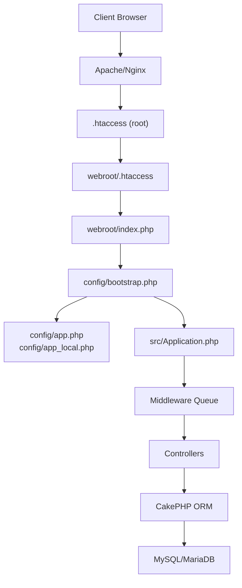
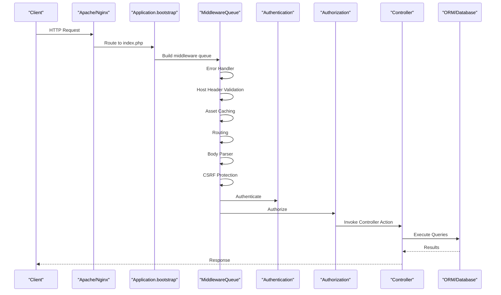
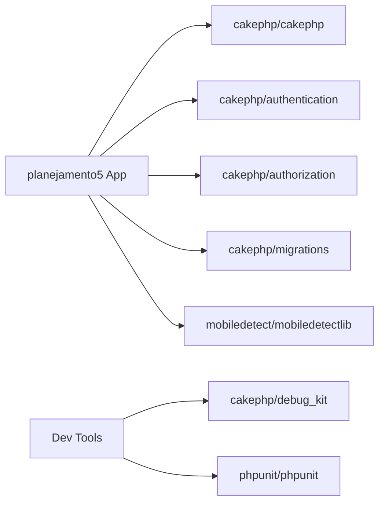
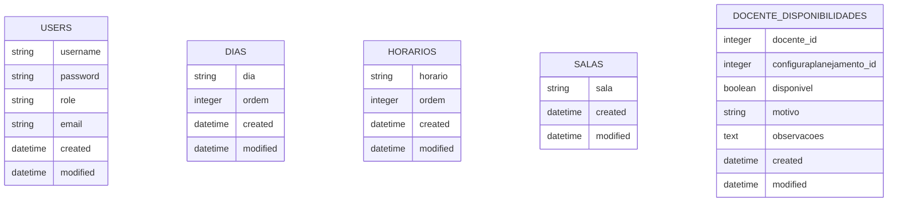

# Deployment & Operations

<cite>
**Referenced Files in This Document**
- [README.md](file://README.md)
- [composer.json](file://composer.json)
- [config/app.php](file://config/app.php)
- [config/app_local.example.php](file://config/app_local.example.php)
- [config/bootstrap.php](file://config/bootstrap.php)
- [src/Application.php](file://src/Application.php)
- [src/Middleware/HostHeaderMiddleware.php](file://src/Middleware/HostHeaderMiddleware.php)
- [src/Controller/AppController.php](file://src/Controller/AppController.php)
- [.htaccess](file://.htaccess)
- [webroot/.htaccess](file://webroot/.htaccess)
- [config/schema/sessions.sql](file://config/schema/sessions.sql)
- [config/Migrations/20260612021814_CreateUsers.php](file://config/Migrations/20260612021814_CreateUsers.php)
- [config/Migrations/20260612030430_CreateDias.php](file://config/Migrations/20260612030430_CreateDias.php)
- [config/Migrations/20260612030431_CreateHorarios.php](file://config/Migrations/20260612030431_CreateHorarios.php)
- [config/Migrations/20260612030432_CreateSalas.php](file://config/Migrations/20260612030432_CreateSalas.php)
- [config/Migrations/20260613100000_CreateDocenteDisponibilidades.php](file://config/Migrations/20260613100000_CreateDocenteDisponibilidades.php)
</cite>

## Table of Contents
1. Introduction
2. Project Structure
3. Core Components
4. Architecture Overview
5. Detailed Component Analysis
6. Dependency Analysis
7. Performance Considerations
8. Troubleshooting Guide
9. Conclusion
10. Appendices

## Introduction
This document provides comprehensive deployment and operations guidance for the planejamento5 academic planning system, a CakePHP 5 application. It covers production deployment checklists, environment configuration, database setup, performance optimization, monitoring and logging, backup and disaster recovery, scaling and high availability, security hardening, SSL management, firewall configuration, and troubleshooting.

## Project Structure
The application follows standard CakePHP conventions:
- Web entry points under webroot with Apache rewrite rules
- Application bootstrap and configuration under config
- Middleware and controllers under src
- Database migrations under config/Migrations
- Static assets under webroot

**Diagram sources**
- [.htaccess:1-13](file://.htaccess#L1-L13)
- [webroot/.htaccess:1-6](file://webroot/.htaccess#L1-L6)
- [config/bootstrap.php:87-100](file://config/bootstrap.php#L87-L100)
- [config/app.php:10-136](file://config/app.php#L10-L136)
- [src/Application.php:73-122](file://src/Application.php#L73-L122)

**Section sources**
- [README.md:11-35](file://README.md#L11-L35)
- [.htaccess:1-13](file://.htaccess#L1-L13)
- [webroot/.htaccess:1-6](file://webroot/.htaccess#L1-L6)
- [config/bootstrap.php:87-100](file://config/bootstrap.php#L87-L100)
- [config/app.php:10-136](file://config/app.php#L10-L136)
- [src/Application.php:73-122](file://src/Application.php#L73-L122)

## Core Components
- Runtime and dependencies: PHP >= 8.2, CakePHP 5.3.x, Authentication and Authorization plugins, Migrations, DebugKit (dev).
- Configuration: app.php (global), app_local.php (environment-specific overrides), bootstrap.php (initialization).
- Security middleware: Host header validation to prevent Host Header Injection.
- Authentication and authorization: Session-based authentication, form login, policy-driven authorization.
- Logging: File-based debug/error/query logs.
- Caching: File cache engines for default, model metadata, and translations.
- Email: Default mail transport; SMTP configurable via environment or local config.
- Sessions: PHP file sessions by default; database-backed sessions available via schema.

Key operational implications:
- Production must set full base URL and security salt.
- Cache directories must be writable.
- Log directories must be writable.
- Database credentials must be configured securely.
- Host header validation enforces correct host configuration in production.

**Section sources**
- [composer.json:7-22](file://composer.json#L7-L22)
- [config/app.php:20-20](file://config/app.php#L20-L20)
- [config/app.php:80-82](file://config/app.php#L80-L82)
- [config/app.php:100-136](file://config/app.php#L100-L136)
- [config/app.php:348-373](file://config/app.php#L348-L373)
- [config/app.php:419-421](file://config/app.php#L419-L421)
- [config/app.php:277-343](file://config/app.php#L277-L343)
- [config/app_local.example.php:40-78](file://config/app_local.example.php#L40-L78)
- [config/bootstrap.php:105-108](file://config/bootstrap.php#L105-L108)
- [src/Application.php:73-122](file://src/Application.php#L73-L122)
- [src/Controller/AppController.php:46-53](file://src/Controller/AppController.php#L46-L53)

## Architecture Overview
Production request flow includes HTTP server routing, CakePHP bootstrap, middleware pipeline (error handling, host validation, asset caching, routing, body parsing, CSRF, authentication, authorization), controller execution, ORM queries, and response rendering.

**Diagram sources**
- [src/Application.php:73-122](file://src/Application.php#L73-L122)
- [src/Middleware/HostHeaderMiddleware.php:32-57](file://src/Middleware/HostHeaderMiddleware.php#L32-L57)
- [config/bootstrap.php:130-131](file://config/bootstrap.php#L130-L131)

## Detailed Component Analysis

### Server Requirements and Environment Setup
- PHP version: >= 8.2
- Extensions: MySQL driver, mbstring, intl, OpenSSL, JSON, PDO
- Web server: Apache with mod_rewrite enabled; Nginx equivalent rewrites supported
- Directory structure: webroot is the document root; root .htaccess forwards to webroot
- Environment variables: Use APP_FULL_BASE_URL, SECURITY_SALT, DATABASE_URL, EMAIL_TRANSPORT_DEFAULT_URL, LOG_*_URL, CACHE_*_URL
- Local overrides: Copy app_local.example.php to app_local.php and configure per-environment values

Operational checklist:
- Ensure PHP version meets requirement
- Enable required PHP extensions
- Configure Apache/Nginx to serve from webroot
- Set APP_FULL_BASE_URL to HTTPS domain in production
- Generate and store a strong SECURITY_SALT
- Configure Datasources.default with secure credentials
- Make cache and log directories writable by the web server user
- Disable debug mode in production

**Section sources**
- [composer.json:7-15](file://composer.json#L7-L15)
- [config/app.php:52-71](file://config/app.php#L52-L71)
- [config/app.php:80-82](file://config/app.php#L80-L82)
- [config/app.php:277-343](file://config/app.php#L277-L343)
- [config/app_local.example.php:40-78](file://config/app_local.example.php#L40-L78)
- [.htaccess:7-12](file://.htaccess#L7-L12)
- [webroot/.htaccess:1-6](file://webroot/.htaccess#L1-L6)

### Database Setup and Migrations
- Default driver: MySQL/MariaDB with utf8mb4 encoding
- Required tables include users, dias, horarios, salas, docente_disponibilidades, plus others implied by controllers/entities
- Session storage can use PHP files or database-backed sessions using provided schema
- Run migrations to create/update schema

Steps:
- Create database and user with least privilege
- Configure Datasources.default connection parameters
- Apply migrations to initialize schema
- Optionally enable database-backed sessions by loading sessions table schema

**Section sources**
- [config/app.php:277-343](file://config/app.php#L277-L343)
- [config/app.php:419-421](file://config/app.php#L419-L421)
- [config/schema/sessions.sql:8-15](file://config/schema/sessions.sql#L8-L15)
- [config/Migrations/20260612021814_CreateUsers.php:16-48](file://config/Migrations/20260612021814_CreateUsers.php#L16-L48)
- [config/Migrations/20260612030430_CreateDias.php:16-38](file://config/Migrations/20260612030430_CreateDias.php#L16-L38)
- [config/Migrations/20260612030431_CreateHorarios.php:16-38](file://config/Migrations/20260612030431_CreateHorarios.php#L16-L38)
- [config/Migrations/20260612030432_CreateSalas.php:16-33](file://config/Migrations/20260612030432_CreateSalas.php#L16-L33)
- [config/Migrations/20260613100000_CreateDocenteDisponibilidades.php:8-46](file://config/Migrations/20260613100000_CreateDocenteDisponibilidades.php#L8-L46)

### File Permissions and Writable Directories
- Cache directory: Must be writable by the web server process
- Log directory: Must be writable by the web server process
- Uploads and temporary directories: If used, ensure proper permissions
- Ownership: Prefer running PHP-FPM/Apache worker under a dedicated user/group

**Section sources**
- [config/app.php:100-136](file://config/app.php#L100-L136)
- [config/app.php:348-373](file://config/app.php#L348-L373)

### Security Hardening
- Host header validation: Enforced in production unless debug is true
- Full base URL: Required in production to prevent Host Header Injection
- CSRF protection: Enabled with httponly cookie flag
- Authentication: Session + Form authenticators configured
- Authorization: Policy-based checks integrated
- Salt: Strong random value required for encryption and hashing

Best practices:
- Set APP_FULL_BASE_URL to HTTPS domain
- Generate and rotate SECURITY_SALT periodically
- Keep debug false in production
- Restrict access to sensitive paths
- Use HTTPS-only cookies and HSTS at reverse proxy level

**Section sources**
- [src/Middleware/HostHeaderMiddleware.php:32-57](file://src/Middleware/HostHeaderMiddleware.php#L32-L57)
- [config/app.php:80-82](file://config/app.php#L80-L82)
- [src/Application.php:103-105](file://src/Application.php#L103-L105)
- [src/Application.php:124-155](file://src/Application.php#L124-L155)
- [src/Controller/AppController.php:46-53](file://src/Controller/AppController.php#L46-L53)

### SSL Certificate Management
- Terminate TLS at reverse proxy (Nginx/Apache)
- Redirect HTTP to HTTPS
- Configure certificate renewal automation (e.g., ACME/Let’s Encrypt)
- Ensure APP_FULL_BASE_URL uses https scheme

[No sources needed since this section provides general guidance]

### Firewall Configuration
- Allow inbound HTTP/HTTPS only
- Block direct database ports from external networks
- Restrict administrative endpoints to trusted IPs if exposed
- Enable rate limiting at edge/proxy layer

[No sources needed since this section provides general guidance]

### Monitoring and Logging
- Error and exception handlers are registered during bootstrap
- File-based logging for debug, error, and query scopes
- Optional centralized logging via Log.*.url settings
- DebugKit available in development for diagnostics

Recommendations:
- Centralize logs (e.g., syslog, cloud logging)
- Monitor error rates and slow queries
- Track uptime and health endpoints
- Alert on critical errors and disk space usage

**Section sources**
- [config/bootstrap.php:130-131](file://config/bootstrap.php#L130-L131)
- [config/app.php:348-373](file://config/app.php#L348-L373)
- [composer.json:19-21](file://composer.json#L19-L21)

### Backup and Disaster Recovery
- Database backups: Daily full backups, hourly incremental if feasible
- Application code: Version-controlled repository; deploy via CI/CD
- Uploaded files: Back up any persistent uploads directory
- Config secrets: Securely back up app_local.php and environment variables
- Restore procedures: Test regularly; define RTO/RPO targets

[No sources needed since this section provides general guidance]

### System Updates
- Composer updates: Update dependencies carefully; review changelogs
- Migrations: Apply new migrations after updating code
- Rollback plan: Maintain migration reversibility where possible
- Staging validation: Validate updates in staging before production

**Section sources**
- [composer.json:48-58](file://composer.json#L48-L58)
- [README.md:42-52](file://README.md#L42-L52)

### Scaling Considerations and High Availability
- Stateless application design: Store sessions externally (database or cache) for multi-instance deployments
- Horizontal scaling: Deploy multiple instances behind a load balancer
- Database scaling: Read replicas for read-heavy workloads
- Caching: Use shared cache backend (Redis/Memcached) across instances
- Reverse proxy: Offload TLS termination, compression, and caching

[No sources needed since this section provides general guidance]

### Load Balancing Setup
- Use a reverse proxy (Nginx/Apache) or managed load balancer
- Sticky sessions not required if sessions are stored externally
- Health checks and graceful shutdown support
- Connection limits and timeouts tuned appropriately

[No sources needed since this section provides general guidance]

## Dependency Analysis
Runtime dependencies and their roles:
- cakephp/cakephp: Core framework providing MVC, middleware, ORM, logging, caching
- cakephp/authentication and cakephp/authorization: Authentication and policy-based authorization
- cakephp/migrations: Schema management
- mobiledetect/mobiledetectlib: Mobile/tablet detection
- Development tools: DebugKit, PHPUnit, static analysis

**Diagram sources**
- [composer.json:7-22](file://composer.json#L7-L22)

**Section sources**
- [composer.json:7-22](file://composer.json#L7-L22)

## Performance Considerations
Caching strategies:
- Use file cache in single-node setups; switch to Redis/Memcached for multi-node
- Enable model metadata caching and translation caching
- Adjust cache durations based on environment (shorter in dev, longer in prod)

Database query optimization:
- Enable query logging selectively for profiling
- Add appropriate indexes (migrations already include some)
- Avoid unnecessary joins and select only needed fields

Asset minification:
- Use asset compression plugin suggested in composer suggestions
- Serve compressed assets via reverse proxy
- Leverage browser caching with timestamps or immutable URLs

Reverse proxy optimizations:
- Enable gzip/brotli compression
- Cache static assets
- Tune keepalive and connection pooling

**Section sources**
- [config/app.php:100-136](file://config/app.php#L100-L136)
- [config/app.php:348-373](file://config/app.php#L348-L373)
- [config/Migrations/20260613100000_CreateDocenteDisponibilidades.php:42-45](file://config/Migrations/20260613100000_CreateDocenteDisponibilidades.php#L42-L45)
- [composer.json:23-28](file://composer.json#L23-L28)

## Troubleshooting Guide
Common issues and resolutions:
- Host header mismatch in production: Ensure APP_FULL_BASE_URL matches the actual host; middleware will reject invalid hosts
- Missing full base URL in production: Configure APP_FULL_BASE_URL to avoid exceptions
- Permission denied on cache/log directories: Fix ownership and permissions for web server user
- Database connection failures: Verify credentials, network reachability, and charset flags
- Slow queries: Enable query logging temporarily and analyze slow query logs
- Session loss across instances: Switch to database or cache-backed sessions

Diagnostic steps:
- Check error logs for stack traces
- Inspect query logs for inefficient queries
- Validate environment variables and local overrides
- Confirm middleware order and behavior

**Section sources**
- [src/Middleware/HostHeaderMiddleware.php:32-57](file://src/Middleware/HostHeaderMiddleware.php#L32-L57)
- [config/app.php:348-373](file://config/app.php#L348-L373)
- [config/app.php:100-136](file://config/app.php#L100-L136)
- [config/app.php:277-343](file://config/app.php#L277-L343)

## Conclusion
By following this guide, you can deploy the planejamento5 system securely and reliably in production. Focus on environment configuration, database readiness, caching and logging, security hardening, and observability. Plan for scaling and high availability early, and maintain robust backup and update procedures.

## Appendices

### Production Deployment Checklist
- Server requirements verified (PHP >= 8.2, extensions)
- Web server configured to serve from webroot with rewrites
- APP_FULL_BASE_URL set to HTTPS domain
- SECURITY_SALT generated and configured
- Datasources.default configured with secure credentials
- Cache and log directories writable
- Debug disabled in production
- Migrations applied
- SSL terminated at reverse proxy
- Firewall rules restrict exposure
- Monitoring and alerting configured
- Backup strategy defined and tested

**Section sources**
- [composer.json:7-15](file://composer.json#L7-L15)
- [config/app.php:52-71](file://config/app.php#L52-L71)
- [config/app.php:80-82](file://config/app.php#L80-L82)
- [config/app.php:277-343](file://config/app.php#L277-L343)
- [config/app.php:100-136](file://config/app.php#L100-L136)
- [config/app.php:348-373](file://config/app.php#L348-L373)
- [config/bootstrap.php:105-108](file://config/bootstrap.php#L105-L108)

### Database Maintenance Tasks
- Regular backups and restore drills
- Index maintenance and statistics updates
- Query performance reviews
- Schema evolution via migrations

**Section sources**
- [config/Migrations/20260613100000_CreateDocenteDisponibilidades.php:42-45](file://config/Migrations/20260613100000_CreateDocenteDisponibilidades.php#L42-L45)

### Data Models Overview

**Diagram sources**
- [config/Migrations/20260612021814_CreateUsers.php:16-48](file://config/Migrations/20260612021814_CreateUsers.php#L16-L48)
- [config/Migrations/20260612030430_CreateDias.php:16-38](file://config/Migrations/20260612030430_CreateDias.php#L16-L38)
- [config/Migrations/20260612030431_CreateHorarios.php:16-38](file://config/Migrations/20260612030431_CreateHorarios.php#L16-L38)
- [config/Migrations/20260612030432_CreateSalas.php:16-33](file://config/Migrations/20260612030432_CreateSalas.php#L16-L33)
- [config/Migrations/20260613100000_CreateDocenteDisponibilidades.php:8-46](file://config/Migrations/20260613100000_CreateDocenteDisponibilidades.php#L8-L46)