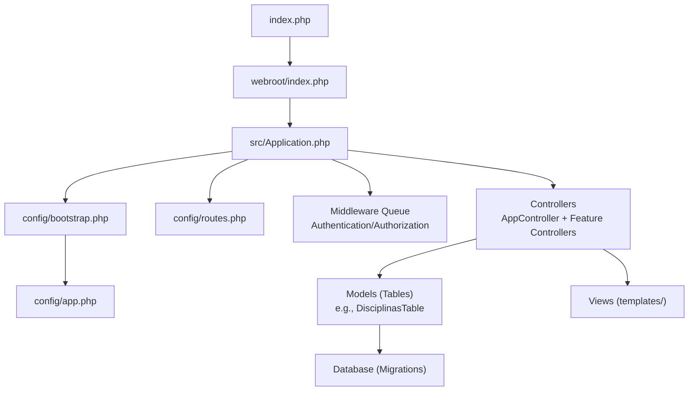
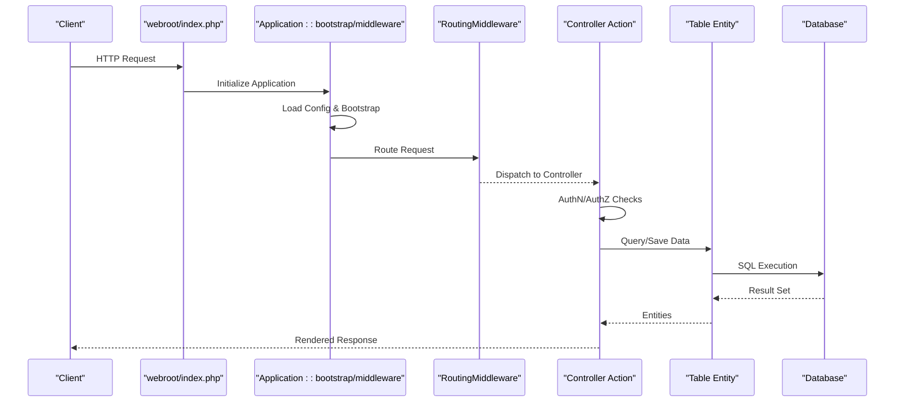
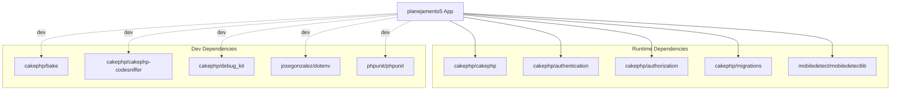

# Development Guide

<cite>
**Referenced Files in This Document**
- [README.md](file://README.md)
- [composer.json](file://composer.json)
- [phpunit.xml.dist](file://phpunit.xml.dist)
- [phpstan.neon](file://phpstan.neon)
- [psalm.xml](file://psalm.xml)
- [phpcs.xml](file://phpcs.xml)
- [src/Application.php](file://src/Application.php)
- [config/app.php](file://config/app.php)
- [config/bootstrap.php](file://config/bootstrap.php)
- [tests/bootstrap.php](file://tests/bootstrap.php)
- [.github/workflows/ci.yml](file://.github/workflows/ci.yml)
- [src/Controller/AppController.php](file://src/Controller/AppController.php)
- [src/Model/Table/DisciplinasTable.php](file://src/Model/Table/DisciplinasTable.php)
- [config/routes.php](file://config/routes.php)
</cite>

## Table of Contents
1. Introduction
2. Project Structure
3. Core Components
4. Architecture Overview
5. Detailed Component Analysis
6. Dependency Analysis
7. Performance Considerations
8. Troubleshooting Guide
9. Conclusion
10. Appendices

## Introduction
This guide provides comprehensive development documentation for contributing to the planejamento5 academic planning system, a CakePHP 5.x application. It covers environment setup, coding standards, testing strategy, static analysis, Git workflow, debugging and logging, performance profiling, CI pipeline, deployment automation, common scenarios, extension points, and plugin development patterns. The goal is to help contributors work efficiently and consistently across the codebase.

## Project Structure
The project follows standard CakePHP conventions:
- Application bootstrap and configuration are under config/ and src/Application.php.
- Controllers, Models (Tables), Entities, Policies, Views, and Middleware live under src/.
- Templates reside under templates/.
- Tests are under tests/, with PHPUnit configuration at phpunit.xml.dist.
- Static analysis and coding standards tools are configured via phpstan.neon, psalm.xml, and phpcs.xml.
- CI is defined in .github/workflows/ci.yml.

**Diagram sources**
- [index.php:1-17](file://index.php#L1-L17)
- [src/Application.php:1-191](file://src/Application.php#L1-L191)
- [config/bootstrap.php:1-241](file://config/bootstrap.php#L1-L241)
- [config/app.php:1-465](file://config/app.php#L1-L465)
- [config/routes.php:1-97](file://config/routes.php#L1-L97)
- [src/Controller/AppController.php:1-55](file://src/Controller/AppController.php#L1-L55)
- [src/Model/Table/DisciplinasTable.php:1-85](file://src/Model/Table/DisciplinasTable.php#L1-L85)

**Section sources**
- [README.md:1-59](file://README.md#L1-L59)
- [composer.json:1-60](file://composer.json#L1-L60)
- [src/Application.php:1-191](file://src/Application.php#L1-L191)
- [config/bootstrap.php:1-241](file://config/bootstrap.php#L1-L241)
- [config/app.php:1-465](file://config/app.php#L1-L465)
- [config/routes.php:1-97](file://config/routes.php#L1-L97)

## Core Components
- Application bootstrap and middleware:
  - src/Application.php defines middleware stack, authentication, authorization, and services.
  - config/bootstrap.php loads configuration, sets timezone/locale, error traps, and mobile detectors.
  - config/app.php centralizes app settings, cache, logging, email, datasources, sessions, DebugKit, and TestSuite options.
- Routing:
  - config/routes.php maps URLs to controllers/actions and sets default route class.
- Controllers:
  - src/Controller/AppController.php initializes global components like Flash, Authentication, Authorization, and unauthenticated actions.
- Models:
  - src/Model/Table/DisciplinasTable.php demonstrates table initialization, behaviors, associations, and validation rules.

Key responsibilities:
- Security: Host header validation, CSRF protection, authentication/authorization middleware.
- Configuration: Environment-driven settings via app.php and app_local.php.
- Testing: PHPUnit bootstrap and migrations for test DB schema.

**Section sources**
- [src/Application.php:1-191](file://src/Application.php#L1-L191)
- [config/bootstrap.php:1-241](file://config/bootstrap.php#L1-L241)
- [config/app.php:1-465](file://config/app.php#L1-L465)
- [config/routes.php:1-97](file://config/routes.php#L1-L97)
- [src/Controller/AppController.php:1-55](file://src/Controller/AppController.php#L1-L55)
- [src/Model/Table/DisciplinasTable.php:1-85](file://src/Model/Table/DisciplinasTable.php#L1-L85)

## Architecture Overview
High-level request flow through CakePHP’s middleware and controller layers, including authentication and authorization.

**Diagram sources**
- [src/Application.php:73-122](file://src/Application.php#L73-L122)
- [config/routes.php:32-79](file://config/routes.php#L32-L79)
- [src/Controller/AppController.php:40-53](file://src/Controller/AppController.php#L40-L53)
- [src/Model/Table/DisciplinasTable.php:15-27](file://src/Model/Table/DisciplinasTable.php#L15-L27)

## Detailed Component Analysis

### Development Environment Setup
- PHP version: >= 8.2 (per composer.json).
- Install dependencies:
  - Use Composer to install packages and run post-install scripts.
- Local server:
  - Start built-in server using bin/cake server.
- Database:
  - Configure Datasources in config/app.php or config/app_local.php.
  - Migrations are used by tests; ensure database credentials are set for local dev.
- Environment variables:
  - Optional .env loading is available but commented out by default; follow security guidance if enabling.

Recommended IDE configuration:
- Enable PSR-4 autoloading for App\ namespace mapped to src/.
- Configure PHPStan level 8 and Psalm errorLevel 2 per their configs.
- Enable CodeSniffer with CakePHP ruleset.
- Use DebugKit for development insights.

**Section sources**
- [composer.json:1-60](file://composer.json#L1-L60)
- [README.md:11-35](file://README.md#L11-L35)
- [config/app.php:277-343](file://config/app.php#L277-L343)
- [config/bootstrap.php:72-78](file://config/bootstrap.php#L72-L78)

### Coding Standards and PSR Conventions
- Code style:
  - PHP_CodeSniffer configured with CakePHP ruleset; excludes specific rule in Controllers.
- Autoloading:
  - PSR-4 for App\ and test namespaces.
- Scripts:
  - cs-check and cs-fix commands provided via composer scripts.

Guidelines:
- Follow PSR-12 and CakePHP conventions.
- Add type hints where applicable; avoid missing native return types outside Controllers per exclusion.
- Keep files under src/ and tests/ consistent with PSR-4 structure.

**Section sources**
- [phpcs.xml:1-11](file://phpcs.xml#L1-L11)
- [composer.json:29-47](file://composer.json#L29-L47)
- [composer.json:48-58](file://composer.json#L48-L58)

### Static Analysis Tools
- PHPStan:
  - Level 8, treats PHPDoc types as not certain, bootstraps config/bootstrap.php, analyzes src/.
- Psalm:
  - Error level 2, scans src/, ignores vendor/.
- Integration:
  - CI runs both tools; ensure local runs pass before committing.

Usage:
- Run PHPStan and Psalm locally to catch issues early.
- Address reported issues incrementally; consider lowering strictness temporarily only if justified.

**Section sources**
- [phpstan.neon:1-8](file://phpstan.neon#L1-L8)
- [psalm.xml:1-16](file://psalm.xml#L1-L16)
- [.github/workflows/ci.yml:56-82](file://.github/workflows/ci.yml#L56-L82)

### Testing Strategy with PHPUnit
- Configuration:
  - phpunit.xml.dist defines testsuite directory, extensions for fixtures, and source includes/excludes.
- Bootstrap:
  - tests/bootstrap.php loads autoload, app bootstrap, fixes time/session, adds test aliases, and runs migrations to build test DB schema.
- Fixtures:
  - CakePHP fixture extension is enabled; create fixtures under tests/Fixture/ as needed.
- Test database:
  - Use Datasources.test connection; CI uses SQLite via DATABASE_TEST_URL.

Workflow:
- Create unit/integration tests under tests/TestCase/.
- For DB-backed tests, rely on migrations executed during bootstrap.
- Use fixtures sparingly when appropriate; prefer migrations for schema consistency.

**Section sources**
- [phpunit.xml.dist:1-37](file://phpunit.xml.dist#L1-L37)
- [tests/bootstrap.php:1-61](file://tests/bootstrap.php#L1-L61)
- [config/app.php:331-343](file://config/app.php#L331-L343)
- [.github/workflows/ci.yml:51-55](file://.github/workflows/ci.yml#L51-L55)

### Authentication and Authorization
- Middleware:
  - AuthenticationMiddleware and AuthorizationMiddleware are added in Application::middleware.
- Services:
  - getAuthenticationService configures Session and Form authenticators with Orm resolver against Usuarioplanejamentos model.
  - getAuthorizationService uses OrmResolver for policy-based checks.
- Controller integration:
  - AppController loads Authentication and Authorization components and declares unauthenticated actions.

Security considerations:
- HostHeaderMiddleware enforces fullBaseUrl to prevent host header injection.
- CSRFProtectionMiddleware enabled with httponly cookie flag.

**Section sources**
- [src/Application.php:73-162](file://src/Application.php#L73-L162)
- [src/Controller/AppController.php:40-53](file://src/Controller/AppController.php#L40-L53)
- [config/app.php:40-44](file://config/app.php#L40-L44)

### Routing and Entry Points
- Entry point:
  - index.php delegates to webroot/index.php.
- Routes:
  - config/routes.php sets default route class, connects root to Planejamentos controller index, and enables fallbacks.

Best practices:
- Prefer explicit routes over fallbacks after prototyping.
- Scope API routes separately if needed.

**Section sources**
- [index.php:1-17](file://index.php#L1-L17)
- [config/routes.php:32-79](file://config/routes.php#L32-L79)

### Example Model: DisciplinasTable
- Initialization:
  - Sets table name, display field, primary key, Timestamp behavior, and hasMany association to Planejamentos.
- Validation:
  - Defines scalar, integer, boolean, and list constraints for fields like codigo, disciplina, creditos, periodo_diurno/noturno, optativa, etc.

Extension points:
- Add custom behaviors or validation rules here.
- Define additional associations as domain evolves.

**Section sources**
- [src/Model/Table/DisciplinasTable.php:15-27](file://src/Model/Table/DisciplinasTable.php#L15-L27)
- [src/Model/Table/DisciplinasTable.php:29-83](file://src/Model/Table/DisciplinasTable.php#L29-L83)

### Build Pipeline and Continuous Integration
- GitHub Actions:
  - Matrix builds across PHP versions and dependency versions.
  - Steps include checkout, PHP setup, Composer install, post-install script, PHPUnit execution, CodeSniffer, and PHPStan.
- Environment variables:
  - DATABASE_TEST_URL for SQLite in CI.
  - SECURITY_SALT for static analysis.

Recommendations:
- Add coverage reporting if desired.
- Pin tool versions for stability.

**Section sources**
- [.github/workflows/ci.yml:1-82](file://.github/workflows/ci.yml#L1-L82)

### Deployment Automation
- Production requirements:
  - Ensure App.fullBaseUrl is configured to prevent host header injection.
  - Disable debug mode and configure secure session/cache/log settings.
- Deployment steps:
  - Install dependencies with Composer.
  - Run migrations to apply schema changes.
  - Clear caches and warm up routing if caching is enabled.
  - Serve via a production-ready web server (e.g., Nginx/Apache) pointing to webroot.

[No sources needed since this section provides general guidance]

### Git Workflow, Branching, Commit Messages, and Pull Requests
- Branching:
  - Use feature branches off mainline; align with CI triggers on branches.
- Commit messages:
  - Follow conventional commit style (e.g., feat:, fix:, chore:) for clarity.
- Pull requests:
  - Use provided PR template; ensure tests and static analysis pass in CI.
  - Link related issues and describe impact.

**Section sources**
- [.github/PULL_REQUEST_TEMPLATE.md:1-15](file://.github/PULL_REQUEST_TEMPLATE.md#L1-L15)
- [.github/workflows/ci.yml:3-12](file://.github/workflows/ci.yml#L3-L12)

### Debugging Techniques, Logging, and Profiling
- Debugging:
  - Enable DebugKit in development; configure safe TLDs and ignore authorization for local TLDs if needed.
  - Use Debugger editor integration configured in app.php.
- Logging:
  - File-based logs for debug/error/queries; enable query logging by setting datasource log flag.
- Profiling:
  - Use DebugKit panels for queries, memory, and timing.
  - Consider external profilers (Xdebug, Blackfire) for deeper analysis.

**Section sources**
- [config/app.php:446-450](file://config/app.php#L446-L450)
- [config/app.php:199-201](file://config/app.php#L199-L201)
- [config/app.php:348-373](file://config/app.php#L348-L373)

### Common Development Scenarios and Extension Points
- Adding new entities:
  - Create Table, Entity, Policy, Controller, and Templates following CakePHP conventions.
- Extending authentication:
  - Add authenticators in Application::getAuthenticationService.
- Customizing views:
  - Override helpers or elements in src/View/Helper and templates/element.
- Plugin development:
  - Place plugins under plugins/; use cakephp/plugin-installer and define routes/services within plugin scope.

[No sources needed since this section doesn't analyze specific files]

## Dependency Analysis
Composer-managed dependencies include CakePHP core, Authentication, Authorization, Migrations, DebugKit, PHPUnit, and others. Dev tools provide baking, codesniffer, dotenv, and static analysis suggestions.

**Diagram sources**
- [composer.json:7-28](file://composer.json#L7-L28)

**Section sources**
- [composer.json:1-60](file://composer.json#L1-L60)

## Performance Considerations
- Cache:
  - Adjust durations for _cake_model_ and _cake_translations_ based on environment; shorter in development, longer in production.
- Routing:
  - Consider cached routing for large route sets in production.
- Database:
  - Enable query logging selectively for diagnostics; disable in production unless necessary.
- Sessions:
  - Choose appropriate handler (cache/database) for scalability.
- Assets:
  - Use timestamping or CDN strategies to bust browser caches.

[No sources needed since this section provides general guidance]

## Troubleshooting Guide
- Host Header Injection:
  - Ensure App.fullBaseUrl is set in production; HostHeaderMiddleware will reject invalid hosts.
- Authentication redirects:
  - Verify login URL and redirect query parameter configuration in AuthenticationService.
- Test failures:
  - Confirm DATABASE_TEST_URL is set; migrations must succeed during bootstrap.
- Static analysis errors:
  - Review PHPStan/Psalm reports; address type mismatches and missing return types.

**Section sources**
- [config/app.php:40-44](file://config/app.php#L40-L44)
- [src/Application.php:124-155](file://src/Application.php#L124-L155)
- [tests/bootstrap.php:49-61](file://tests/bootstrap.php#L49-L61)
- [.github/workflows/ci.yml:74-82](file://.github/workflows/ci.yml#L74-L82)

## Conclusion
This guide consolidates essential information for developing and maintaining the planejamento5 application. By adhering to coding standards, leveraging static analysis, writing robust tests, and following CI best practices, contributors can deliver high-quality features and improvements efficiently.

[No sources needed since this section summarizes without analyzing specific files]

## Appendices

### Quick Commands
- Install dependencies:
  - composer install
- Run tests:
  - composer test
- Check code style:
  - composer cs-check
- Fix code style:
  - composer cs-fix
- Start local server:
  - bin/cake server -p 8765

**Section sources**
- [composer.json:48-58](file://composer.json#L48-L58)
- [README.md:28-35](file://README.md#L28-L35)