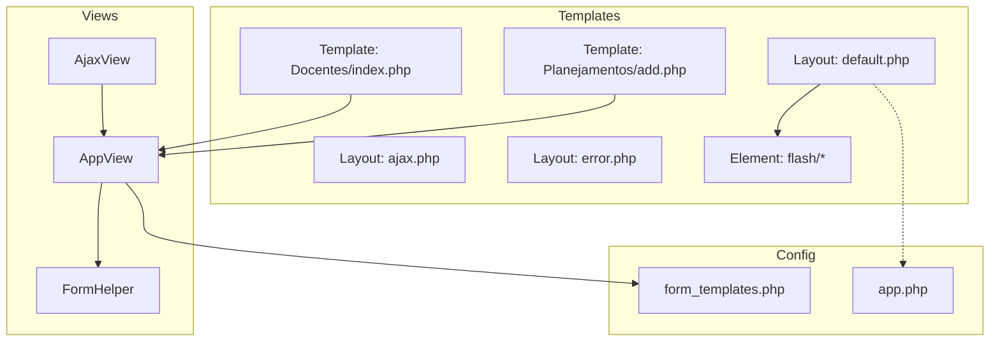
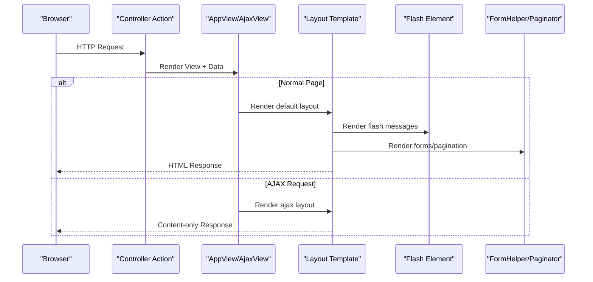
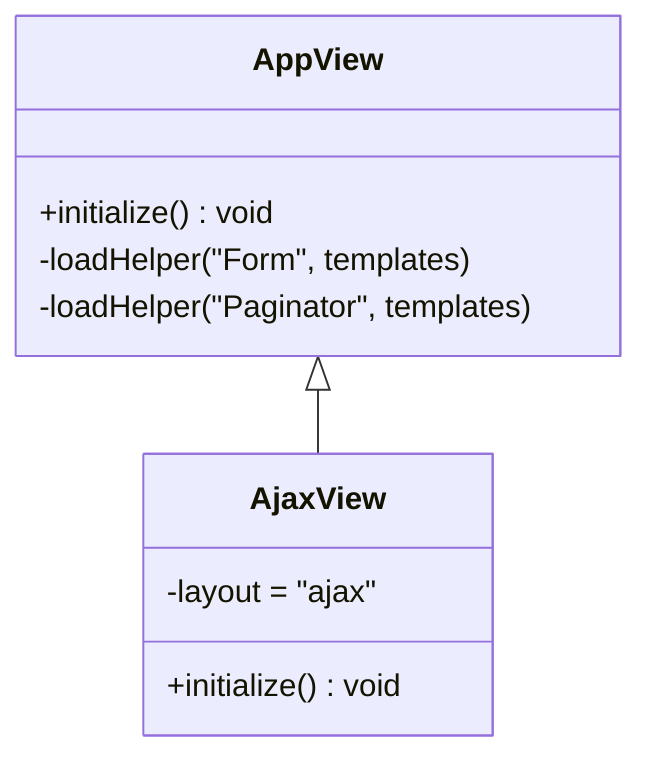
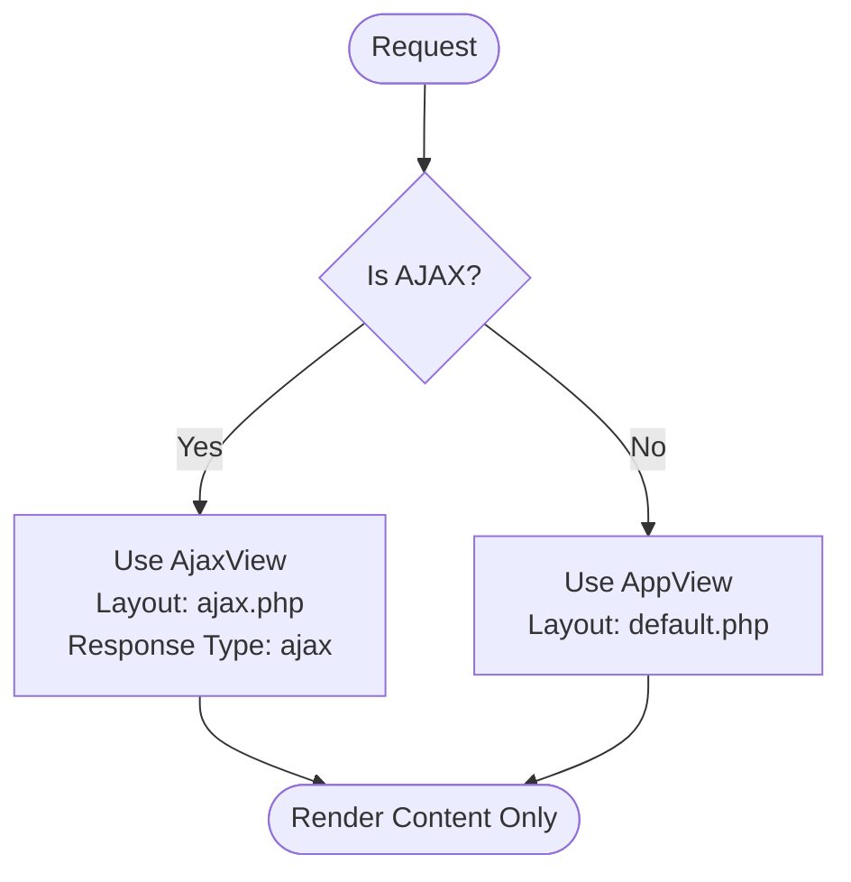
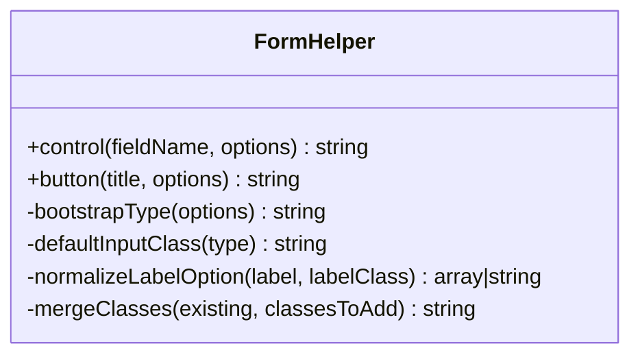
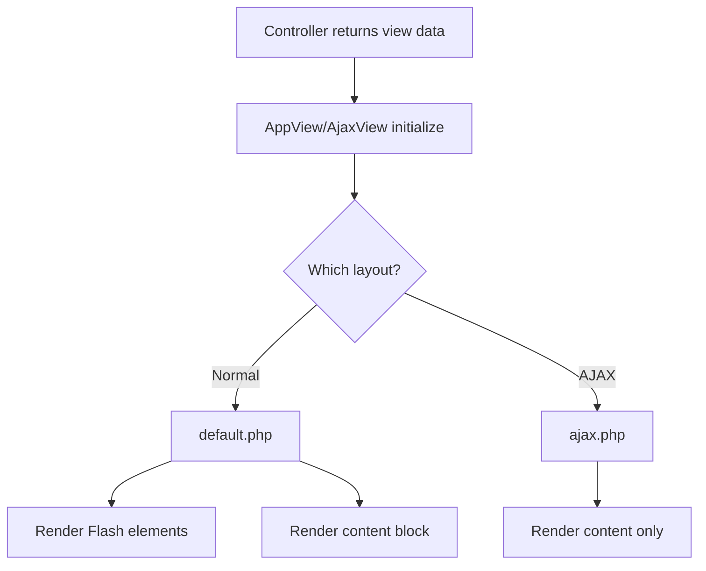
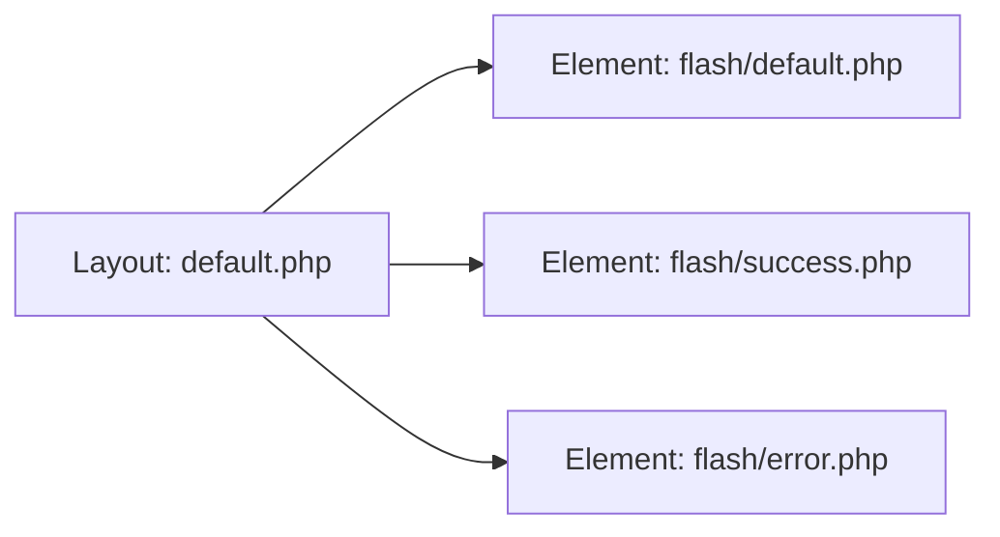
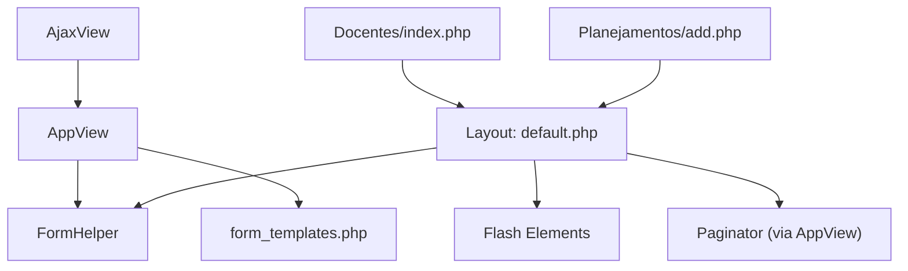

# Frontend Architecture

<cite>
**Referenced Files in This Document**
- [AppView.php](file://src/View/AppView.php)
- [AjaxView.php](file://src/View/AjaxView.php)
- [FormHelper.php](file://src/View/Helper/FormHelper.php)
- [default.php](file://templates/layout/default.php)
- [ajax.php](file://templates/layout/ajax.php)
- [error.php](file://templates/layout/error.php)
- [form_templates.php](file://config/form_templates.php)
- [index.php (Docentes)](file://templates/Docentes/index.php)
- [add.php (Planejamentos)](file://templates/Planejamentos/add.php)
- [default.php (Flash Element)](file://templates/element/flash/default.php)
- [success.php (Flash Element)](file://templates/element/flash/success.php)
- [error.php (Flash Element)](file://templates/element/flash/error.php)
- [app.php](file://config/app.php)
</cite>

## Table of Contents
1. [Introduction](#introduction)
2. [Project Structure](#project-structure)
3. [Core Components](#core-components)
4. [Architecture Overview](#architecture-overview)
5. [Detailed Component Analysis](#detailed-component-analysis)
6. [Dependency Analysis](#dependency-analysis)
7. [Performance Considerations](#performance-considerations)
8. [Troubleshooting Guide](#troubleshooting-guide)
9. [Conclusion](#conclusion)

## Introduction
This document describes the frontend architecture of the planejamento5 academic planning system built on CakePHP. It focuses on the view layer, layout system with Bootstrap 5 styling, form handling via a custom FormHelper and templates, AjaxView for AJAX responses, AppView customization, and template composition patterns. It also provides guidelines for responsive design, accessibility, cross-browser compatibility, animations/transitions, JavaScript interactions, API integration, and performance optimization techniques for assets and caching.

## Project Structure
The frontend is organized using CakePHP’s conventional structure:
- Views are under src/View with application-specific classes.
- Templates live under templates/, including layouts, elements, and feature folders per controller.
- Static assets reside under webroot/css and webroot/js.
- Configuration for forms and app behavior is under config/.

**Diagram sources**
- [AppView.php:1-62](file://src/View/AppView.php#L1-L62)
- [AjaxView.php:1-47](file://src/View/AjaxView.php#L1-L47)
- [FormHelper.php:1-91](file://src/View/Helper/FormHelper.php#L1-L91)
- [default.php:1-124](file://templates/layout/default.php#L1-L124)
- [ajax.php:1-18](file://templates/layout/ajax.php#L1-L18)
- [error.php:1-40](file://templates/layout/error.php#L1-L40)
- [form_templates.php:1-29](file://config/form_templates.php#L1-L29)
- [index.php (Docentes):1-166](file://templates/Docentes/index.php#L1-L166)
- [add.php (Planejamentos):1-32](file://templates/Planejamentos/add.php#L1-L32)
- [app.php:1-200](file://config/app.php#L1-L200)

**Section sources**
- [AppView.php:1-62](file://src/View/AppView.php#L1-L62)
- [AjaxView.php:1-47](file://src/View/AjaxView.php#L1-L47)
- [FormHelper.php:1-91](file://src/View/Helper/FormHelper.php#L1-L91)
- [default.php:1-124](file://templates/layout/default.php#L1-L124)
- [ajax.php:1-18](file://templates/layout/ajax.php#L1-L18)
- [error.php:1-40](file://templates/layout/error.php#L1-L40)
- [form_templates.php:1-29](file://config/form_templates.php#L1-L29)
- [index.php (Docentes):1-166](file://templates/Docentes/index.php#L1-L166)
- [add.php (Planejamentos):1-32](file://templates/Planejamentos/add.php#L1-L32)
- [app.php:1-200](file://config/app.php#L1-L200)

## Core Components
- AppView: Centralizes helper loading and global configuration. It loads the Form helper with custom templates and customizes Paginator templates to align with Bootstrap 5.
- AjaxView: Extends AppView to render with a minimal layout and sets an “ajax” response type for lightweight responses.
- Custom FormHelper: Enhances default controls with Bootstrap 5 classes, normalizes labels, and ensures consistent button styling.
- Layouts: default.php provides a full page shell with Bootstrap 5 navigation, Flash messages, and content slots; ajax.php renders only content; error.php uses a minimal style set for errors.
- Elements: Flash message elements provide reusable alert components with Bootstrap styling and accessibility attributes.
- Templates: Feature templates compose UI using helpers and elements, demonstrating pagination, filtering, and form creation.

**Section sources**
- [AppView.php:1-62](file://src/View/AppView.php#L1-L62)
- [AjaxView.php:1-47](file://src/View/AjaxView.php#L1-L47)
- [FormHelper.php:1-91](file://src/View/Helper/FormHelper.php#L1-L91)
- [default.php:1-124](file://templates/layout/default.php#L1-L124)
- [ajax.php:1-18](file://templates/layout/ajax.php#L1-L18)
- [error.php:1-40](file://templates/layout/error.php#L1-L40)
- [default.php (Flash Element):1-19](file://templates/element/flash/default.php#L1-L19)
- [success.php (Flash Element):1-19](file://templates/element/flash/success.php#L1-L19)
- [error.php (Flash Element):1-19](file://templates/element/flash/error.php#L1-L19)
- [index.php (Docentes):1-166](file://templates/Docentes/index.php#L1-L166)
- [add.php (Planejamentos):1-32](file://templates/Planejamentos/add.php#L1-L32)

## Architecture Overview
The frontend follows a layered approach:
- Controllers return views that are rendered by AppView or AjaxView.
- AppView configures helpers and templates globally.
- Layouts wrap content and include shared UI (navigation, footer, scripts).
- Elements encapsulate reusable fragments like flash alerts.
- Templates implement feature-specific logic and compose helpers and elements.

**Diagram sources**
- [AppView.php:1-62](file://src/View/AppView.php#L1-L62)
- [AjaxView.php:1-47](file://src/View/AjaxView.php#L1-L47)
- [default.php:1-124](file://templates/layout/default.php#L1-L124)
- [ajax.php:1-18](file://templates/layout/ajax.php#L1-L18)
- [default.php (Flash Element):1-19](file://templates/element/flash/default.php#L1-L19)
- [FormHelper.php:1-91](file://src/View/Helper/FormHelper.php#L1-L91)

## Detailed Component Analysis

### AppView and Global Helpers
- Loads Form helper with custom templates from config/form_templates.php.
- Overrides Paginator templates to produce Bootstrap 5-compatible markup.
- Serves as the base class for all views, ensuring consistent behavior across pages.

**Diagram sources**
- [AppView.php:1-62](file://src/View/AppView.php#L1-L62)
- [AjaxView.php:1-47](file://src/View/AjaxView.php#L1-L47)

**Section sources**
- [AppView.php:1-62](file://src/View/AppView.php#L1-L62)
- [form_templates.php:1-29](file://config/form_templates.php#L1-L29)

### AjaxView for AJAX Interactions
- Sets the default layout to a minimal one that outputs only content.
- Configures the response type to “ajax”, enabling lightweight responses suitable for DOM updates.

**Diagram sources**
- [AjaxView.php:1-47](file://src/View/AjaxView.php#L1-L47)
- [ajax.php:1-18](file://templates/layout/ajax.php#L1-L18)
- [default.php:1-124](file://templates/layout/default.php#L1-L124)

**Section sources**
- [AjaxView.php:1-47](file://src/View/AjaxView.php#L1-L47)
- [ajax.php:1-18](file://templates/layout/ajax.php#L1-L18)

### FormHelper Extensions and Bootstrap 5 Styling
- control(): Infers input type, applies Bootstrap classes, and normalizes label options for consistency.
- button(): Ensures buttons have primary styles unless explicitly overridden.
- Internal helpers determine default classes and merge existing classes safely.

**Diagram sources**
- [FormHelper.php:1-91](file://src/View/Helper/FormHelper.php#L1-L91)

**Section sources**
- [FormHelper.php:1-91](file://src/View/Helper/FormHelper.php#L1-L91)
- [form_templates.php:1-29](file://config/form_templates.php#L1-L29)

### Layout System and Template Composition
- default.php: Full-page layout with Bootstrap 5 navbar, containerized main content, Flash rendering, and footer. Uses fetch() blocks for title, meta, css, script, and content.
- ajax.php: Minimal layout echoing only content for AJAX responses.
- error.php: Error layout using minimal CSS assets and Flash rendering.

**Diagram sources**
- [default.php:1-124](file://templates/layout/default.php#L1-L124)
- [ajax.php:1-18](file://templates/layout/ajax.php#L1-L18)
- [error.php:1-40](file://templates/layout/error.php#L1-L40)

**Section sources**
- [default.php:1-124](file://templates/layout/default.php#L1-L124)
- [ajax.php:1-18](file://templates/layout/ajax.php#L1-L18)
- [error.php:1-40](file://templates/layout/error.php#L1-L40)

### Elements and Partial Rendering Patterns
- Flash elements provide reusable alert components with Bootstrap styling and accessible roles.
- The default layout renders flash messages centrally, while individual templates can include additional elements as needed.

**Diagram sources**
- [default.php:1-124](file://templates/layout/default.php#L1-L124)
- [default.php (Flash Element):1-19](file://templates/element/flash/default.php#L1-L19)
- [success.php (Flash Element):1-19](file://templates/element/flash/success.php#L1-L19)
- [error.php (Flash Element):1-19](file://templates/element/flash/error.php#L1-L19)

**Section sources**
- [default.php (Flash Element):1-19](file://templates/element/flash/default.php#L1-L19)
- [success.php (Flash Element):1-19](file://templates/element/flash/success.php#L1-L19)
- [error.php (Flash Element):1-19](file://templates/element/flash/error.php#L1-L19)
- [default.php:1-124](file://templates/layout/default.php#L1-L124)

### Usage Examples: Inheritance, Composition, and Partials
- Template inheritance: Feature templates rely on layouts to provide chrome (navbar, footer), while focusing on content.
- Element composition: Flash alerts are composed via elements for consistent UX.
- Partial rendering: Forms and tables are assembled using helpers and inline PHP constructs within templates.

Examples:
- Filtering and listing with pagination and filters in the Docentes index template.
- Creating forms with dynamic options and client-side behavior in the Planejamentos add template.

**Section sources**
- [index.php (Docentes):1-166](file://templates/Docentes/index.php#L1-L166)
- [add.php (Planejamentos):1-32](file://templates/Planejamentos/add.php#L1-L32)

## Dependency Analysis
- AppView depends on Form and Paginator helpers and form templates configuration.
- AjaxView extends AppView and overrides layout and response type.
- Layouts depend on helpers (Html, Flash, Form, Paginator) and may include elements.
- Templates depend on helpers and elements for UI composition.

**Diagram sources**
- [AppView.php:1-62](file://src/View/AppView.php#L1-L62)
- [AjaxView.php:1-47](file://src/View/AjaxView.php#L1-L47)
- [FormHelper.php:1-91](file://src/View/Helper/FormHelper.php#L1-L91)
- [form_templates.php:1-29](file://config/form_templates.php#L1-L29)
- [default.php:1-124](file://templates/layout/default.php#L1-L124)
- [index.php (Docentes):1-166](file://templates/Docentes/index.php#L1-L166)
- [add.php (Planejamentos):1-32](file://templates/Planejamentos/add.php#L1-L32)

**Section sources**
- [AppView.php:1-62](file://src/View/AppView.php#L1-L62)
- [AjaxView.php:1-47](file://src/View/AjaxView.php#L1-L47)
- [FormHelper.php:1-91](file://src/View/Helper/FormHelper.php#L1-L91)
- [form_templates.php:1-29](file://config/form_templates.php#L1-L29)
- [default.php:1-124](file://templates/layout/default.php#L1-L124)
- [index.php (Docentes):1-166](file://templates/Docentes/index.php#L1-L166)
- [add.php (Planejamentos):1-32](file://templates/Planejamentos/add.php#L1-L32)

## Performance Considerations
- Asset bundling and minification: Consolidate and minify CSS/JS files served from webroot to reduce requests and payload size.
- Browser caching: Enable cache headers for static assets and leverage versioned filenames or query strings for cache busting.
- CDN usage: Prefer local copies of Bootstrap over remote CDNs for reliability and performance; if using CDN, enable long-term caching with integrity checks.
- Debug mode: Disable debug in production to avoid overhead and expose fewer details.
- Pagination: Use server-side pagination to limit data transfer and rendering time.
- Lazy loading: Defer non-critical scripts and images to improve initial load time.
- Compression: Ensure server-level gzip/brotli compression for text-based assets.

[No sources needed since this section provides general guidance]

## Troubleshooting Guide
- Missing Bootstrap functionality: Verify that the layout includes Bootstrap CSS/JS and that IDs/data attributes match Bootstrap requirements.
- Form validation visuals: Ensure form templates and FormHelper apply correct classes for invalid states and feedback messages.
- Flash messages not showing: Confirm that the layout renders flash elements and that controllers set appropriate session messages.
- AJAX responses too large: Ensure AjaxView is used for endpoints returning partial content and that layouts do not include heavy assets.
- Accessibility issues: Validate that interactive elements have proper roles, aria-labels, and keyboard support.

**Section sources**
- [default.php:1-124](file://templates/layout/default.php#L1-L124)
- [ajax.php:1-18](file://templates/layout/ajax.php#L1-L18)
- [default.php (Flash Element):1-19](file://templates/element/flash/default.php#L1-L19)
- [FormHelper.php:1-91](file://src/View/Helper/FormHelper.php#L1-L91)

## Conclusion
The frontend architecture leverages CakePHP’s view layer with a clear separation between layouts, elements, and templates. AppView centralizes helper configuration, while AjaxView enables efficient AJAX responses. The custom FormHelper and form templates ensure consistent Bootstrap 5 styling and improved usability. By following the provided guidelines for responsiveness, accessibility, and performance, the system delivers a robust and maintainable user experience.