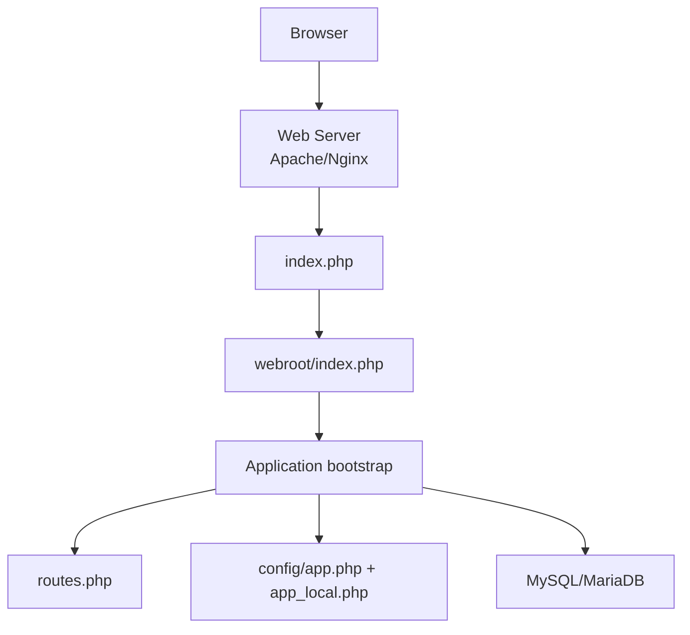
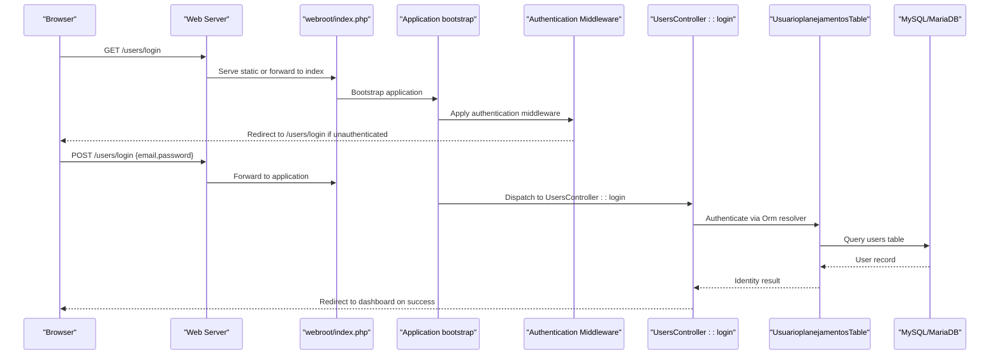
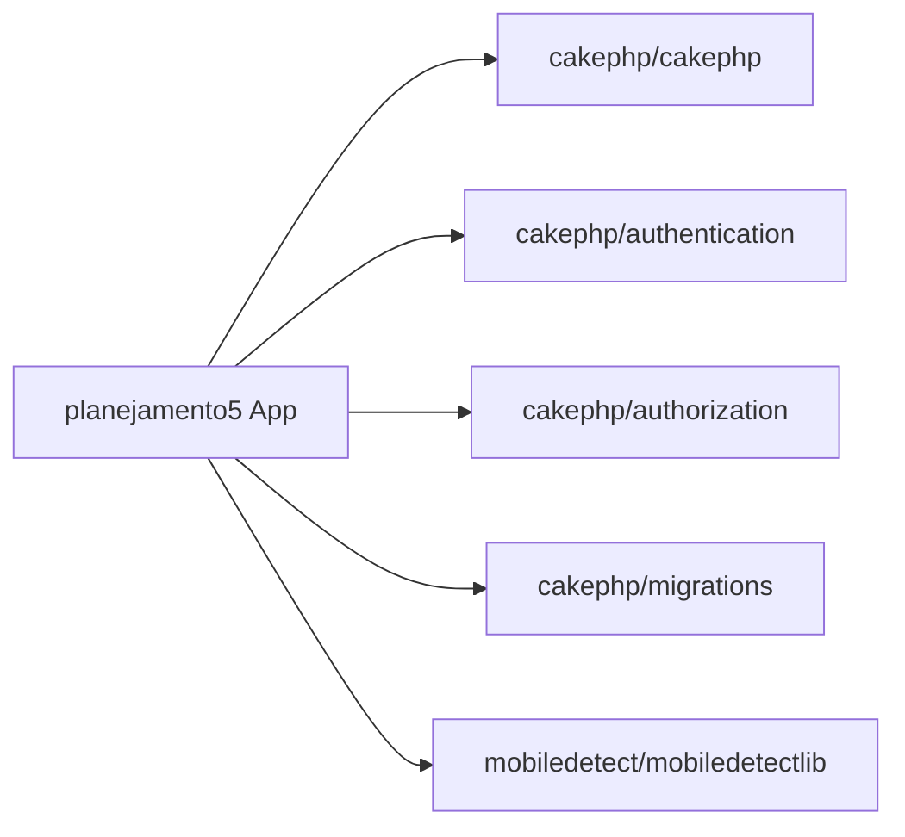

# Getting Started

<cite>
**Referenced Files in This Document**
- [README.md](file://README.md)
- [composer.json](file://composer.json)
- [config/app.php](file://config/app.php)
- [config/app_local.example.php](file://config/app_local.example.php)
- [index.php](file://index.php)
- [webroot/.htaccess](file://webroot/.htaccess)
- [src/Application.php](file://src/Application.php)
- [src/Controller/UsersController.php](file://src/Controller/UsersController.php)
- [templates/Users/login.php](file://templates/Users/login.php)
- [src/Model/Table/UsuarioplanejamentosTable.php](file://src/Model/Table/UsuarioplanejamentosTable.php)
- [config/Migrations/20260612021814_CreateUsers.php](file://config/Migrations/20260612021814_CreateUsers.php)
- [config/routes.php](file://config/routes.php)
</cite>

## Table of Contents
1. Introduction
2. Project Structure
3. Core Components
4. Architecture Overview
5. Detailed Component Analysis
6. Dependency Analysis
7. Performance Considerations
8. Troubleshooting Guide
9. Conclusion

## Introduction
This guide helps you install and run the planejamento5 academic planning system (a CakePHP 5 application). You will set up PHP 8.2+, MySQL/MariaDB, Composer dependencies, configure your web server, initialize the database with migrations, create an initial admin user, and access the application for the first time. The instructions are beginner-friendly but include enough technical detail for experienced developers to set up a robust development environment.

## Project Structure
The project follows standard CakePHP conventions:
- Application entry points route requests through webroot/index.php and index.php
- Configuration is split between app.php (shared) and app_local.php (local overrides)
- Database schema is managed via Migrations under config/Migrations
- Authentication uses CakePHP’s Authentication and Authorization plugins
- Default routes direct the root URL to the main planning module

**Diagram sources**
- [index.php:1-17](file://index.php#L1-L17)
- [webroot/.htaccess:1-6](file://webroot/.htaccess#L1-L6)
- [config/routes.php:52-79](file://config/routes.php#L52-L79)
- [config/app.php:277-343](file://config/app.php#L277-L343)

**Section sources**
- [README.md:11-35](file://README.md#L11-L35)
- [composer.json:1-28](file://composer.json#L1-L28)
- [config/app.php:52-71](file://config/app.php#L52-L71)
- [config/app_local.example.php:11-78](file://config/app_local.example.php#L11-L78)
- [config/routes.php:52-79](file://config/routes.php#L52-L79)

## Core Components
- Runtime requirements: PHP >= 8.2, MySQL/MariaDB, Composer
- Framework: CakePHP 5.x with Authentication and Authorization plugins
- Database: MySQL driver configured by default; connection details in local config
- Routing: Root path maps to the main planning controller
- Authentication: Form-based login using email/password against the users table

Key configuration areas:
- Datasources: MySQL connection settings
- Security: salt value for hashing
- Debug mode and logging
- Email transport (optional)

**Section sources**
- [composer.json:7-15](file://composer.json#L7-L15)
- [config/app.php:277-343](file://config/app.php#L277-L343)
- [config/app_local.example.php:40-78](file://config/app_local.example.php#L40-L78)
- [config/routes.php:58-59](file://config/routes.php#L58-L59)

## Architecture Overview
High-level request flow from browser to controllers and database:

**Diagram sources**
- [src/Application.php:124-155](file://src/Application.php#L124-L155)
- [src/Controller/UsersController.php:29-50](file://src/Controller/UsersController.php#L29-L50)
- [src/Model/Table/UsuarioplanejamentosTable.php:11-22](file://src/Model/Table/UsuarioplanejamentosTable.php#L11-L22)
- [config/Migrations/20260612021814_CreateUsers.php:16-48](file://config/Migrations/20260612021814_CreateUsers.php#L16-L48)

## Detailed Component Analysis

### Installation and Environment Setup
- Install PHP 8.2+ and enable required extensions (PDO, PDO_MySQL, mbstring, intl, etc.)
- Install Composer globally or use the provided phar
- Create a MySQL/MariaDB database and user with appropriate privileges
- Configure local application settings:
  - Copy config/app_local.example.php to config/app_local.php
  - Set Datasources.default host, username, password, database
  - Optionally set DATABASE_URL or EMAIL_TRANSPORT_DEFAULT_URL via environment variables
- Generate a secure SECURITY_SALT value and set it in app_local.php

Verification steps:
- Ensure web server points document root to the project’s webroot directory
- Confirm .htaccess rewrite rules are enabled for Apache
- For Nginx, ensure all non-static requests are forwarded to webroot/index.php

**Section sources**
- [composer.json:7-15](file://composer.json#L7-L15)
- [config/app_local.example.php:40-78](file://config/app_local.example.php#L40-L78)
- [config/app.php:277-343](file://config/app.php#L277-L343)
- [webroot/.htaccess:1-6](file://webroot/.htaccess#L1-L6)

### Web Server Configuration
- Apache:
  - Enable mod_rewrite
  - Ensure .htaccess files are allowed (AllowOverride All)
  - Point document root to webroot
- Nginx:
  - Use a server block that forwards all requests to webroot/index.php
  - Ensure PHP-FPM is configured and processing PHP files

**Section sources**
- [webroot/.htaccess:1-6](file://webroot/.htaccess#L1-L6)
- [index.php:15-17](file://index.php#L15-L17)

### Dependency Management with Composer
- Run composer install to download dependencies
- Post-install scripts will execute application installer tasks
- Development tools (DebugKit, Bake, PHPUnit) are available in require-dev

**Section sources**
- [composer.json:48-58](file://composer.json#L48-L58)
- [README.md:11-35](file://README.md#L11-L35)

### Database Initialization with Migrations
- Execute migrations to create tables (including users):
  - bin/cake migrations migrate
- Verify the users table exists and has expected columns (username, password, role, email, created, modified)

Notes:
- The users table is used by the authentication system
- The model UsuarioplanejamentosTable maps to the users table

**Section sources**
- [config/Migrations/20260612021814_CreateUsers.php:16-48](file://config/Migrations/20260612021814_CreateUsers.php#L16-L48)
- [src/Model/Table/UsuarioplanejamentosTable.php:11-22](file://src/Model/Table/UsuarioplanejamentosTable.php#L11-L22)

### First-Time Application Bootstrap and Admin User
- After migrations, create an initial administrator user:
  - Use the application’s user management features or a script to insert a user with role admin
  - Ensure the password is hashed according to CakePHP’s Password authenticator expectations
- Access the application at http://localhost (or your configured domain)
- Navigate to /users/login and sign in with the admin credentials

Default behavior:
- Root URL redirects to the main planning module
- Unauthenticated requests redirect to /users/login

**Section sources**
- [config/routes.php:58-59](file://config/routes.php#L58-L59)
- [src/Controller/UsersController.php:29-50](file://src/Controller/UsersController.php#L29-L50)
- [templates/Users/login.php:14-36](file://templates/Users/login.php#L14-L36)

### Basic Navigation
- Home page (/) shows the planning module index
- Login page (/users/login) accepts email and password
- After successful login, you are redirected to the planning module index
- Logout is handled by the Users controller

**Section sources**
- [config/routes.php:58-59](file://config/routes.php#L58-L59)
- [src/Controller/UsersController.php:55-60](file://src/Controller/UsersController.php#L55-L60)
- [templates/Users/login.php:14-36](file://templates/Users/login.php#L14-L36)

## Dependency Analysis
Core runtime dependencies and their roles:
- cakephp/cakephp: Core framework
- cakephp/authentication: Authentication service and form/session authenticators
- cakephp/authorization: Policy-based authorization
- cakephp/migrations: CLI-driven database migrations
- mobiledetect/mobiledetectlib: Mobile detection support

Development dependencies include DebugKit, Bake, CodeSniffer, and PHPUnit.

**Diagram sources**
- [composer.json:7-15](file://composer.json#L7-L15)

**Section sources**
- [composer.json:1-28](file://composer.json#L1-L28)

## Performance Considerations
- Enable production mode by setting debug to false in app_local.php
- Configure fullBaseUrl in production to prevent Host Header Injection
- Use a persistent cache backend (e.g., Redis/Memcached) instead of file cache for higher throughput
- Tune MySQL settings (innodb_stats_on_metadata) as needed
- Keep asset caching enabled and consider CDN for static assets

[No sources needed since this section provides general guidance]

## Troubleshooting Guide
Common issues and resolutions:
- Cannot connect to database:
  - Verify Datasources.default values in app_local.php
  - Check network connectivity and credentials
  - Ensure utf8mb4 encoding is supported by your MySQL/MariaDB version
- Blank pages or 500 errors:
  - Enable debug temporarily to view detailed errors
  - Check logs in the logs directory
- Login fails:
  - Confirm the users table exists and contains a valid user record
  - Ensure passwords are hashed correctly by CakePHP’s Password authenticator
- Rewrite rules not working (Apache):
  - Ensure mod_rewrite is enabled and AllowOverride All is set
  - Confirm .htaccess exists in webroot
- Nginx routing:
  - Ensure all requests are forwarded to webroot/index.php

Verification checklist:
- PHP version >= 8.2
- Composer dependencies installed
- Database created and migrations applied
- Local configuration present and correct
- Web server pointing to webroot
- Root URL accessible and redirects to planning module
- Login page accessible and functional

**Section sources**
- [config/app.php:277-343](file://config/app.php#L277-L343)
- [config/app_local.example.php:40-78](file://config/app_local.example.php#L40-L78)
- [webroot/.htaccess:1-6](file://webroot/.htaccess#L1-L6)
- [src/Controller/UsersController.php:29-50](file://src/Controller/UsersController.php#L29-L50)

## Conclusion
You now have the essential steps to install, configure, and run planejamento5. Start by preparing your environment, installing dependencies, configuring the database, running migrations, creating an admin user, and accessing the application. Use the troubleshooting guide to resolve common setup issues and refer to the architecture overview to understand how requests flow through the system.