# Academic Planning Management

<cite>
**Referenced Files in This Document**
- [PlanejamentosController.php](file://src/Controller/PlanejamentosController.php)
- [PlanejamentosTable.php](file://src/Model/Table/PlanejamentosTable.php)
- [Planejamento Entity.php](file://src/Model/Entity/Planejamento.php)
- [ConfiguraplanejamentosTable.php](file://src/Model/Table/ConfiguraplanejamentosTable.php)
- [Configuraplanejamento Entity.php](file://src/Model/Entity/Configuraplanejamento.php)
- [Disciplina Entity.php](file://src/Model/Entity/Disciplina.php)
- [Docente Entity.php](file://src/Model/Entity/Docente.php)
- [Sala Entity.php](file://src/Model/Entity/Sala.php)
- [Dia Entity.php](file://src/Model/Entity/Dia.php)
- [Horario Entity.php](file://src/Model/Entity/Horario.php)
- [CreateDias migration.php](file://config/Migrations/20260612030430_CreateDias.php)
- [CreateHorarios migration.php](file://config/Migrations/20260612030431_CreateHorarios.php)
- [CreateSalas migration.php](file://config/Migrations/20260612030432_CreateSalas.php)
</cite>

## Table of Contents
1. [Introduction](#introduction)
2. [Project Structure](#project-structure)
3. [Core Components](#core-components)
4. [Architecture Overview](#architecture-overview)
5. [Detailed Component Analysis](#detailed-component-analysis)
6. [Dependency Analysis](#dependency-analysis)
7. [Performance Considerations](#performance-considerations)
8. [Troubleshooting Guide](#troubleshooting-guide)
9. [Conclusion](#conclusion)

## Introduction
This document explains the academic planning management system with a focus on how the Planejamento entity acts as the central scheduling component. It links Disciplinas (courses), Docentes (faculty), Salas (classrooms), Horarios (time slots), and Dias (days) within Configuraplanejamentos (semester configurations). The documentation covers multi-semester filtering, automatic period assignment based on discipline configuration, the relationship between turno (day/night shift) and horario_id mapping, and the availability filtering system for faculty selection. It also provides workflow examples for creating and editing schedules and managing semester-specific planning data.

## Project Structure
The application follows a standard MVC structure:
- Controllers handle HTTP requests and orchestrate business logic.
- Tables define ORM relationships and validation rules.
- Entities represent domain objects and accessible fields.
- Migrations define database schema elements such as dias, horarios, and salas.

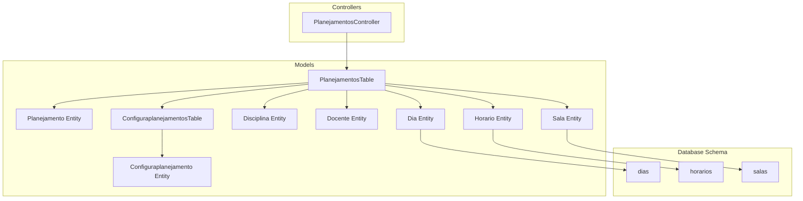

**Diagram sources**
- [PlanejamentosController.php:1-256](file://src/Controller/PlanejamentosController.php#L1-L256)
- [PlanejamentosTable.php:1-57](file://src/Model/Table/PlanejamentosTable.php#L1-L57)
- [ConfiguraplanejamentosTable.php:1-62](file://src/Model/Table/ConfiguraplanejamentosTable.php#L1-L62)
- [Planejamento Entity.php:1-27](file://src/Model/Entity/Planejamento.php#L1-L27)
- [Configuraplanejamento Entity.php:1-23](file://src/Model/Entity/Configuraplanejamento.php#L1-L23)
- [Disciplina Entity.php:1-49](file://src/Model/Entity/Disciplina.php#L1-L49)
- [Docente Entity.php:1-57](file://src/Model/Entity/Docente.php#L1-L57)
- [Sala Entity.php:1-29](file://src/Model/Entity/Sala.php#L1-L29)
- [Dia Entity.php:1-31](file://src/Model/Entity/Dia.php#L1-L31)
- [Horario Entity.php:1-31](file://src/Model/Entity/Horario.php#L1-L31)
- [CreateDias migration.php:1-40](file://config/Migrations/20260612030430_CreateDias.php#L1-L40)
- [CreateHorarios migration.php:1-40](file://config/Migrations/20260612030431_CreateHorarios.php#L1-L40)
- [CreateSalas migration.php:1-35](file://config/Migrations/20260612030432_CreateSalas.php#L1-L35)

**Section sources**
- [PlanejamentosController.php:17-67](file://src/Controller/PlanejamentosController.php#L17-L67)
- [PlanejamentosTable.php:11-40](file://src/Model/Table/PlanejamentosTable.php#L11-L40)
- [ConfiguraplanejamentosTable.php:11-31](file://src/Model/Table/ConfiguraplanejamentosTable.php#L11-L31)

## Core Components
- Planejamento (scheduling record): Links a course to a faculty member, classroom, day, time slot, and a specific semester configuration. It also stores an optional observation field and computed or derived values like periodo (period) and turno (shift).
- Configuraplanejamento (semester configuration): Represents a named semester version that groups planning records.
- Disciplina (course): Provides curriculum metadata including default periods for day and night shifts.
- Docente (faculty): Represents instructors; availability can be filtered per semester configuration.
- Sala (classroom), Dia (day), Horario (time slot): Reference entities used by Planejamento to schedule sessions.

Key responsibilities:
- Multi-semester filtering via Configuraplanejamento.semestre.
- Automatic assignment of periodo based on Disciplina.periodo_diurno or Disciplina.periodo_noturno depending on turno.
- Mapping of turno to horario_id ranges.
- Availability-based filtering of Docentes using DocenteDisponibilidades linked to Configuraplanejamento.

**Section sources**
- [Planejamento Entity.php:13-25](file://src/Model/Entity/Planejamento.php#L13-L25)
- [PlanejamentosTable.php:19-39](file://src/Model/Table/PlanejamentosTable.php#L19-L39)
- [Configuraplanejamento Entity.php:13-21](file://src/Model/Entity/Configuraplanejamento.php#L13-L21)
- [Disciplina Entity.php:16-17](file://src/Model/Entity/Disciplina.php#L16-L17)
- [Docente Entity.php:26](file://src/Model/Entity/Docente.php#L26)

## Architecture Overview
At runtime, the controller orchestrates queries across related tables and applies filters and transformations before rendering views. Relationships are defined in the table layer, while entities expose accessible fields.

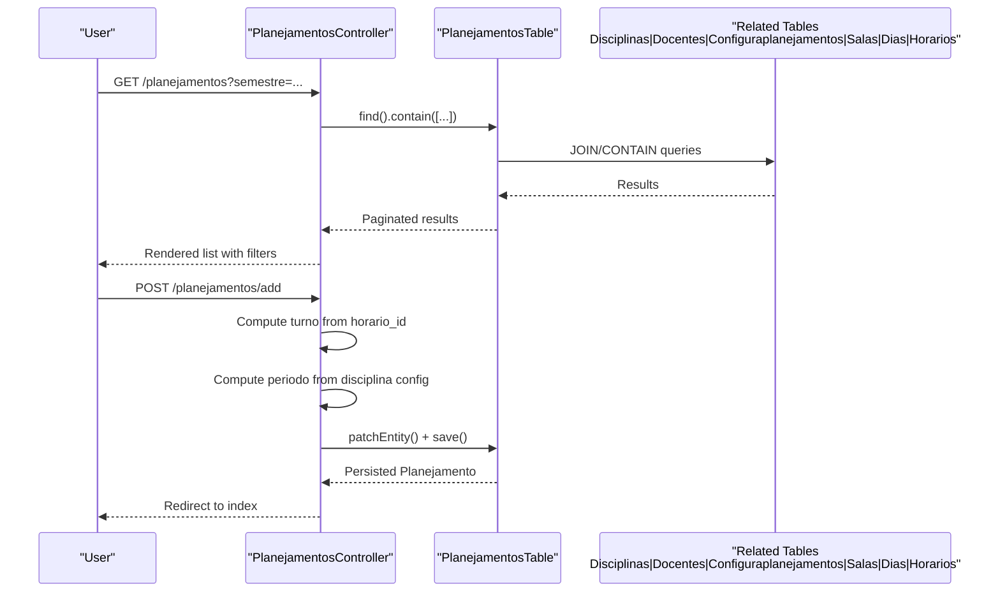

**Diagram sources**
- [PlanejamentosController.php:17-67](file://src/Controller/PlanejamentosController.php#L17-L67)
- [PlanejamentosController.php:83-127](file://src/Controller/PlanejamentosController.php#L83-L127)
- [PlanejamentosTable.php:11-40](file://src/Model/Table/PlanejamentosTable.php#L11-L40)

## Detailed Component Analysis

### Planejamento Entity and Table
- Fields: disciplina_id, docente_id, configuraplanejamento_id, periodo, turno, sala_id, dia_id, horario_id, observacoes, timestamps.
- Relationships: belongsTo Disciplinas, Docentes, Configuraplanejamentos, Salas, Dias, Horarios.
- Validation: Ensures required presence for core identifiers and allows optional fields where appropriate.

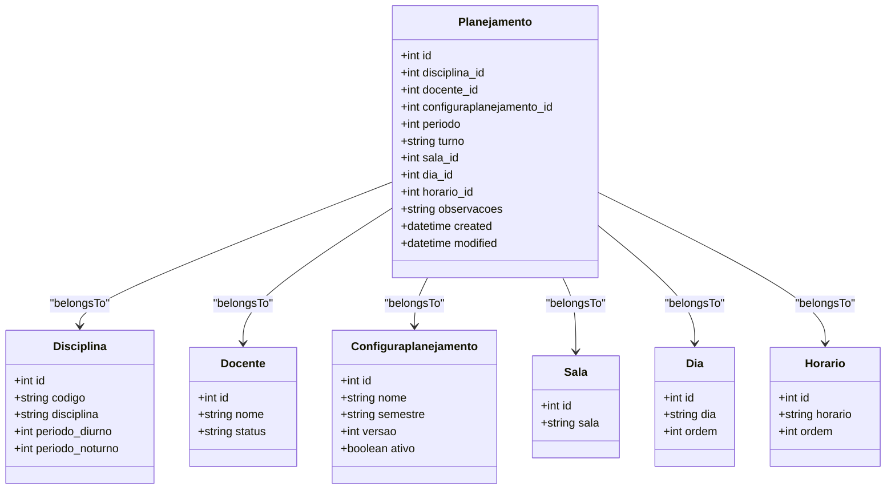

**Diagram sources**
- [Planejamento Entity.php:13-25](file://src/Model/Entity/Planejamento.php#L13-L25)
- [PlanejamentosTable.php:19-39](file://src/Model/Table/PlanejamentosTable.php#L19-L39)
- [Configuraplanejamento Entity.php:13-21](file://src/Model/Entity/Configuraplanejamento.php#L13-L21)
- [Disciplina Entity.php:16-17](file://src/Model/Entity/Disciplina.php#L16-L17)
- [Docente Entity.php:26](file://src/Model/Entity/Docente.php#L26)
- [Sala Entity.php:23-27](file://src/Model/Entity/Sala.php#L23-L27)
- [Dia Entity.php:24-29](file://src/Model/Entity/Dia.php#L24-L29)
- [Horario Entity.php:24-29](file://src/Model/Entity/Horario.php#L24-L29)

**Section sources**
- [Planejamento Entity.php:13-25](file://src/Model/Entity/Planejamento.php#L13-L25)
- [PlanejamentosTable.php:11-55](file://src/Model/Table/PlanejamentosTable.php#L11-L55)

### Multi-Semester Filtering
- The index action reads a query parameter semestre and filters Planejamento records by matching Configuraplanejamentos.semestre.
- A distinct list of semestres is provided for UI selection.

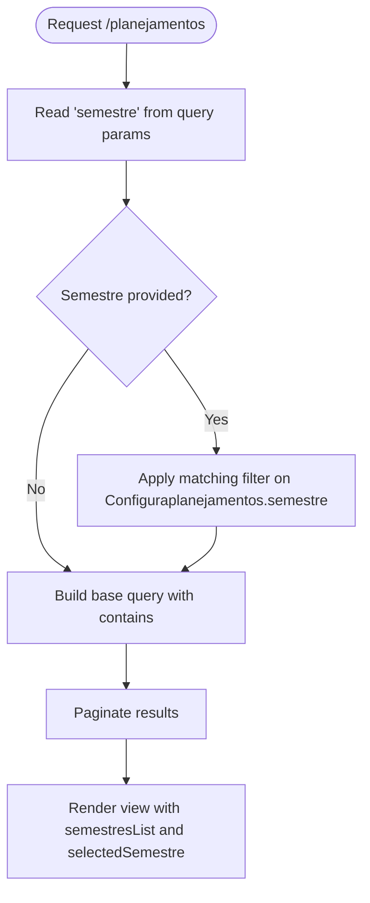

**Diagram sources**
- [PlanejamentosController.php:17-67](file://src/Controller/PlanejamentosController.php#L17-L67)

**Section sources**
- [PlanejamentosController.php:21-52](file://src/Controller/PlanejamentosController.php#L21-L52)

### Turno and Horario Mapping
- turno is automatically set based on horario_id:
  - IDs 1–4 map to diurno (day shift).
  - Other IDs map to noturno (night shift).
- This mapping ensures consistency between time slot selection and shift classification.

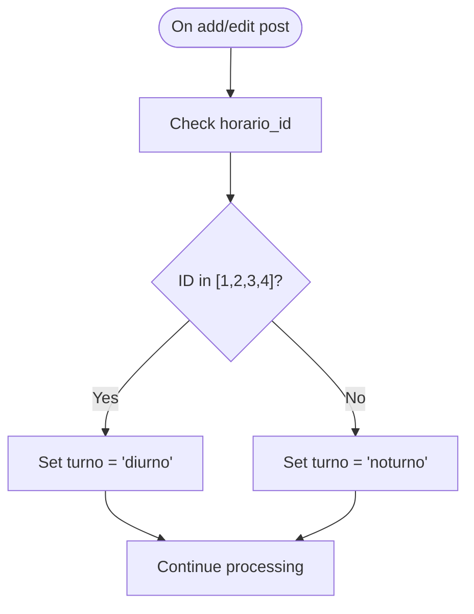

**Diagram sources**
- [PlanejamentosController.php:98-127](file://src/Controller/PlanejamentosController.php#L98-L127)
- [PlanejamentosController.php:144-173](file://src/Controller/PlanejamentosController.php#L144-L173)

**Section sources**
- [PlanejamentosController.php:100-105](file://src/Controller/PlanejamentosController.php#L100-L105)
- [PlanejamentosController.php:146-151](file://src/Controller/PlanejamentosController.php#L146-L151)

### Automatic Period Assignment Based on Discipline Configuration
- When a disciplina_id is present, the system selects the period based on the current turno:
  - If turno is diurno, use Disciplina.periodo_diurno.
  - Otherwise, use Disciplina.periodo_noturno.
- If no disciplina is selected, the request is rejected with a user-facing error.

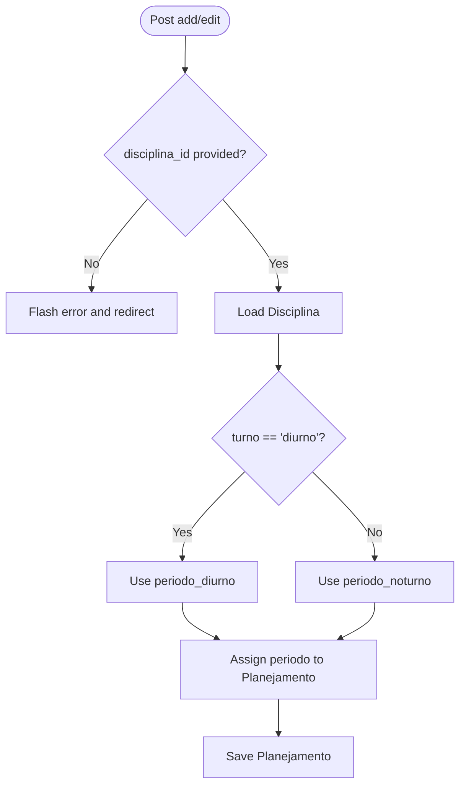

**Diagram sources**
- [PlanejamentosController.php:106-127](file://src/Controller/PlanejamentosController.php#L106-L127)
- [PlanejamentosController.php:152-173](file://src/Controller/PlanejamentosController.php#L152-L173)
- [Disciplina Entity.php:16-17](file://src/Model/Entity/Disciplina.php#L16-L17)

**Section sources**
- [PlanejamentosController.php:106-114](file://src/Controller/PlanejamentosController.php#L106-L114)
- [PlanejamentosController.php:152-160](file://src/Controller/PlanejamentosController.php#L152-L160)
- [Disciplina Entity.php:16-17](file://src/Model/Entity/Disciplina.php#L16-L17)

### Faculty Availability Filtering
- When a Configuraplanejamento is selected, the system filters Docentes to those marked available for that configuration.
- The filter uses a matching join on DocenteDisponibilidades where configuraplanejamento_id matches and disponivel is true.
- If the currently assigned docente is excluded by the filter, it is temporarily re-included to avoid losing context during edit.

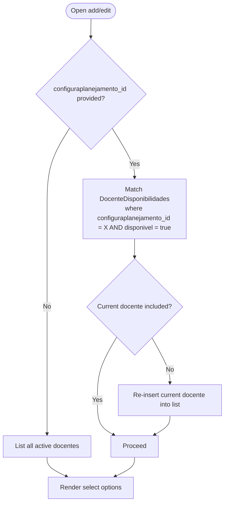

**Diagram sources**
- [PlanejamentosController.php:209-254](file://src/Controller/PlanejamentosController.php#L209-L254)

**Section sources**
- [PlanejamentosController.php:217-242](file://src/Controller/PlanejamentosController.php#L217-L242)

### Workflow Examples

#### Creating a New Schedule
- Navigate to add form.
- Optionally preselect a Configuraplanejamento via query parameter.
- Select a Disciplina; the system auto-computes periodo based on turno and Disciplina configuration.
- Select a Horario; the system sets turno accordingly.
- Choose a Docente (filtered by availability if a Configuraplanejamento is selected).
- Choose a Sala and Dia.
- Submit; the system persists the Planejamento and redirects to the index.

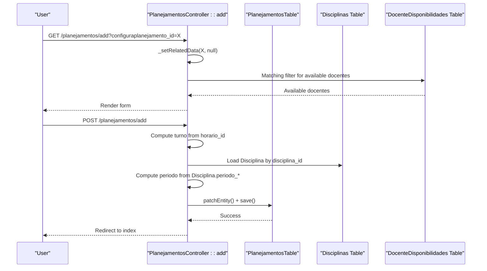

**Diagram sources**
- [PlanejamentosController.php:83-127](file://src/Controller/PlanejamentosController.php#L83-L127)
- [PlanejamentosController.php:209-254](file://src/Controller/PlanejamentosController.php#L209-L254)

**Section sources**
- [PlanejamentosController.php:83-127](file://src/Controller/PlanejamentosController.php#L83-L127)

#### Editing an Existing Schedule
- Open edit form with optional Configuraplanejamento override.
- System loads current Docente and applies availability filter if a Configuraplanejamento is specified.
- On submit, turno and periodo are recomputed similarly to add.
- Save updates the Planejamento and redirects.

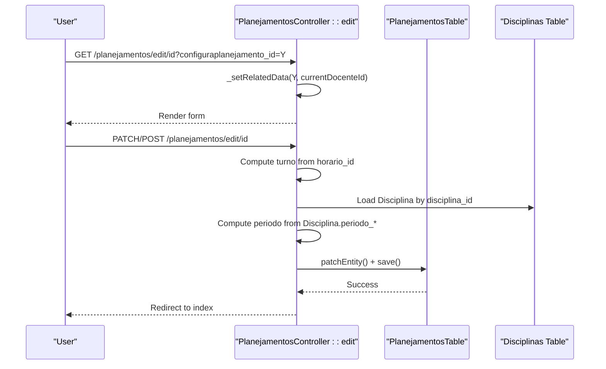

**Diagram sources**
- [PlanejamentosController.php:129-173](file://src/Controller/PlanejamentosController.php#L129-L173)
- [PlanejamentosController.php:209-254](file://src/Controller/PlanejamentosController.php#L209-L254)

**Section sources**
- [PlanejamentosController.php:129-173](file://src/Controller/PlanejamentosController.php#L129-L173)

#### Managing Semester-Specific Planning Data
- The index page supports filtering by semestre via query parameter.
- A list of unique semestres is built from Configuraplanejamentos and passed to the view.
- The listing respects sorting across key fields including semestre, disciplina, docente, dia, horario, and sala.

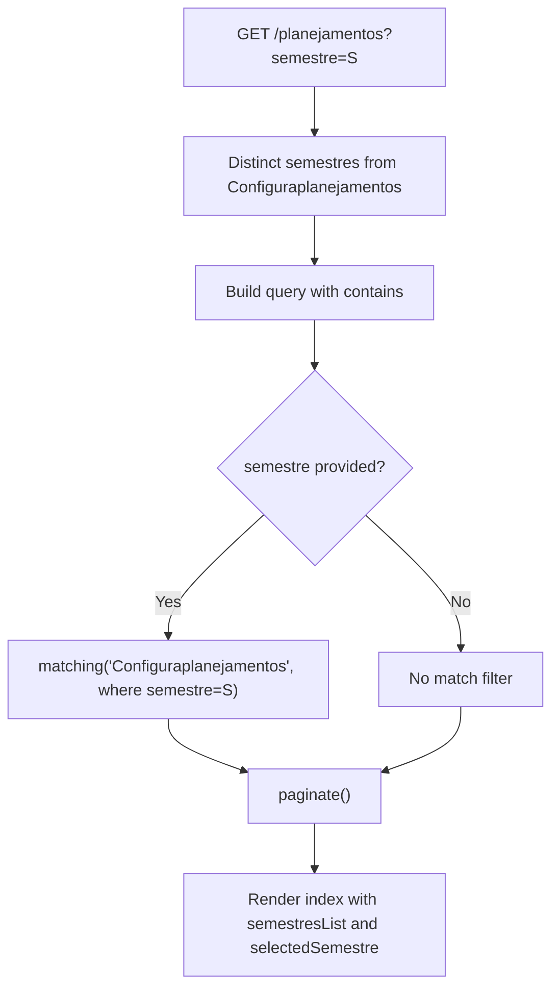

**Diagram sources**
- [PlanejamentosController.php:17-67](file://src/Controller/PlanejamentosController.php#L17-L67)

**Section sources**
- [PlanejamentosController.php:21-66](file://src/Controller/PlanejamentosController.php#L21-L66)

### Conflict Detection Logic
- There is no explicit conflict detection implemented in the analyzed files.
- To implement conflict detection, consider adding server-side checks that prevent overlapping assignments for the same Docente, Sala, Dia, and Horario within the same Configuraplanejamento.

[No sources needed since this section provides general guidance]

## Dependency Analysis
The following diagram shows key dependencies among controllers, tables, entities, and referenced schema components.

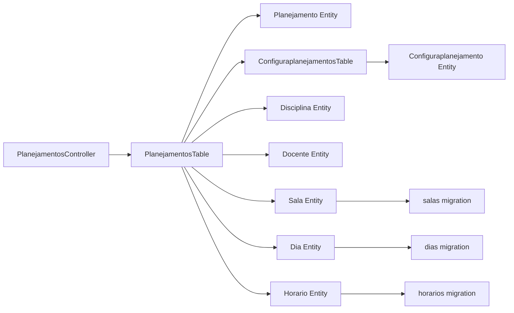

**Diagram sources**
- [PlanejamentosController.php:17-67](file://src/Controller/PlanejamentosController.php#L17-L67)
- [PlanejamentosTable.php:11-40](file://src/Model/Table/PlanejamentosTable.php#L11-L40)
- [ConfiguraplanejamentosTable.php:11-31](file://src/Model/Table/ConfiguraplanejamentosTable.php#L11-L31)
- [CreateDias migration.php:16-38](file://config/Migrations/20260612030430_CreateDias.php#L16-L38)
- [CreateHorarios migration.php:16-38](file://config/Migrations/20260612030431_CreateHorarios.php#L16-L38)
- [CreateSalas migration.php:16-33](file://config/Migrations/20260612030432_CreateSalas.php#L16-L33)

**Section sources**
- [PlanejamentosTable.php:19-39](file://src/Model/Table/PlanejamentosTable.php#L19-L39)
- [ConfiguraplanejamentosTable.php:19-31](file://src/Model/Table/ConfiguraplanejamentosTable.php#L19-L31)

## Performance Considerations
- Use pagination for large lists to reduce memory usage and improve response times.
- Prefer contain() over joins when only reading related data to minimize result set duplication.
- Cache reference lists (e.g., dias, horarios, salas) if they change infrequently.
- Avoid unnecessary matching joins unless filtering by availability is required.

[No sources needed since this section provides general guidance]

## Troubleshooting Guide
- Missing disciplina selection: The system returns an error and redirects when no disciplina is provided during add/edit.
- Unexpected turno value: Verify that horario_id falls within expected ranges; otherwise, turno defaults to noturno.
- Empty docente list after selecting a Configuraplanejamento: Ensure DocenteDisponibilidades entries exist and are marked available for the chosen configuration.
- Multi-semester filter not applied: Confirm the semestre query parameter is correctly passed and matches existing Configuraplanejamentos.semestre values.

**Section sources**
- [PlanejamentosController.php:106-114](file://src/Controller/PlanejamentosController.php#L106-L114)
- [PlanejamentosController.php:152-160](file://src/Controller/PlanejamentosController.php#L152-L160)
- [PlanejamentosController.php:217-242](file://src/Controller/PlanejamentosController.php#L217-L242)

## Conclusion
The Planejamento entity serves as the central scheduling component, linking courses, faculty, classrooms, days, and time slots within semester configurations. The controller enforces consistent turno-to-horario mapping, computes periodo automatically from discipline settings, and filters faculty by availability per semester. Multi-semester filtering is supported at the list level. While conflict detection is not implemented in the analyzed code, the architecture provides clear extension points to add robust overlap prevention.