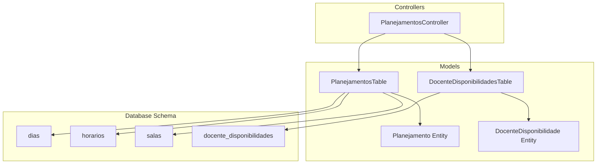
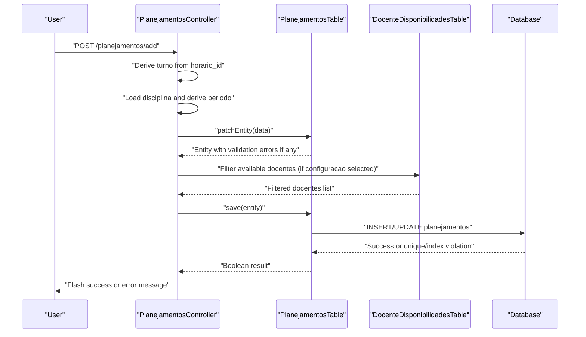
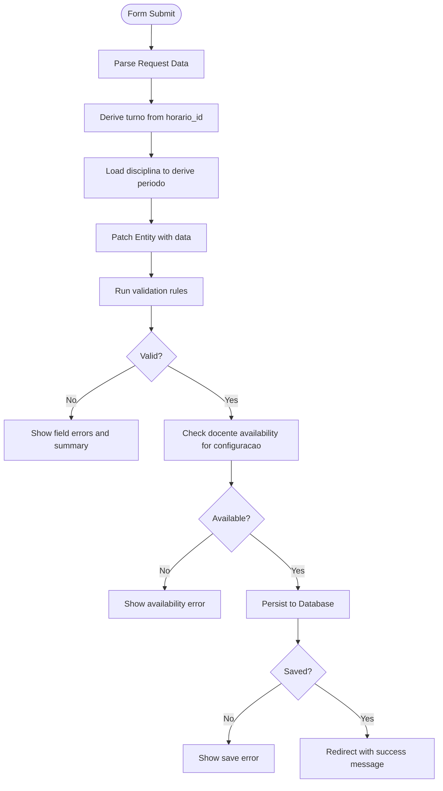
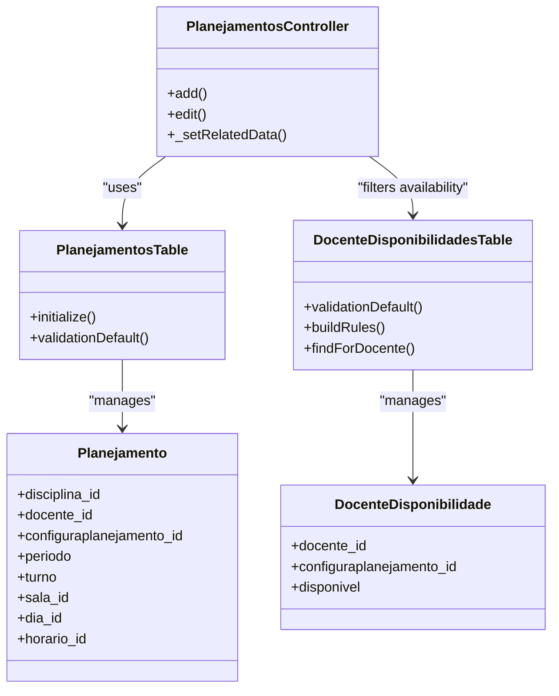

# Conflict Detection and Validation

<cite>
**Referenced Files in This Document**
- [PlanejamentosController.php](file://src/Controller/PlanejamentosController.php)
- [PlanejamentosTable.php](file://src/Model/Table/PlanejamentosTable.php)
- [Planejamento.php](file://src/Model/Entity/Planejamento.php)
- [DocenteDisponibilidadesTable.php](file://src/Model/Table/DocenteDisponibilidadesTable.php)
- [DocenteDisponibilidade.php](file://src/Model/Entity/DocenteDisponibilidade.php)
- [CreateDias.php](file://config/Migrations/20260612030430_CreateDias.php)
- [CreateHorarios.php](file://config/Migrations/20260612030431_CreateHorarios.php)
- [CreateSalas.php](file://config/Migrations/20260612030432_CreateSalas.php)
- [CreateDocenteDisponibilidades.php](file://config/Migrations/20260613100000_CreateDocenteDisponibilidades.php)
</cite>

## Table of Contents
1. [Introduction](#introduction)
2. [Project Structure](#project-structure)
3. [Core Components](#core-components)
4. [Architecture Overview](#architecture-overview)
5. [Detailed Component Analysis](#detailed-component-analysis)
6. [Dependency Analysis](#dependency-analysis)
7. [Performance Considerations](#performance-considerations)
8. [Troubleshooting Guide](#troubleshooting-guide)
9. [Conclusion](#conclusion)

## Introduction
This document explains how the academic planning system detects and prevents scheduling conflicts among faculty members, classrooms, and time slots. It focuses on validation rules for the Planejamento entity, availability-based filtering via DocenteDisponibilidades, and user feedback mechanisms when conflicts are detected. The goal is to maintain scheduling integrity by enforcing business rules at both the application layer and the database layer.

## Project Structure
The conflict detection and validation logic spans controllers, model tables, entities, and database migrations:
- Controller orchestrates form handling, pre-computation of derived fields (turno, periodo), and user feedback via flash messages.
- Model table defines relationships and basic field validations.
- Entities expose accessible fields and can host custom validation methods.
- Migrations define schema constraints and indexes that support uniqueness and referential integrity.

**Diagram sources**
- [PlanejamentosController.php](file://src/Controller/PlanejamentosController.php)
- [PlanejamentosTable.php](file://src/Model/Table/PlanejamentosTable.php)
- [Planejamento.php](file://src/Model/Entity/Planejamento.php)
- [DocenteDisponibilidadesTable.php](file://src/Model/Table/DocenteDisponibilidadesTable.php)
- [DocenteDisponibilidade.php](file://src/Model/Entity/DocenteDisponibilidade.php)
- [CreateDias.php](file://config/Migrations/20260612030430_CreateDias.php)
- [CreateHorarios.php](file://config/Migrations/20260612030431_CreateHorarios.php)
- [CreateSalas.php](file://config/Migrations/20260612030432_CreateSalas.php)
- [CreateDocenteDisponibilidades.php](file://config/Migrations/20260613100000_CreateDocenteDisponibilidades.php)

**Section sources**
- [PlanejamentosController.php](file://src/Controller/PlanejamentosController.php)
- [PlanejamentosTable.php](file://src/Model/Table/PlanejamentosTable.php)
- [Planejamento.php](file://src/Model/Entity/Planejamento.php)
- [DocenteDisponibilidadesTable.php](file://src/Model/Table/DocenteDisponibilidadesTable.php)
- [DocenteDisponibilidade.php](file://src/Model/Entity/DocenteDisponibilidade.php)
- [CreateDias.php](file://config/Migrations/20260612030430_CreateDias.php)
- [CreateHorarios.php](file://config/Migrations/20260612030431_CreateHorarios.php)
- [CreateSalas.php](file://config/Migrations/20260612030432_CreateSalas.php)
- [CreateDocenteDisponibilidades.php](file://config/Migrations/20260613100000_CreateDocenteDisponibilidades.php)

## Core Components
- Planejamento entity and table:
  - Relationships to Disciplinas, Docentes, Configuraplanejamentos, Salas, Dias, Horarios.
  - Basic field validation for required integers and optional scalars.
- DocenteDisponibilidades table and entity:
  - Availability flags per docente and configuracao.
  - Uniqueness constraint on (docente_id, configuraplanejamento_id).
- Controller add/edit flows:
  - Derives turno from horario_id.
  - Derives periodo from disciplina properties.
  - Uses flash messages for success and error feedback.

Key responsibilities:
- Validate input types and presence.
- Enforce availability-based filtering for docentes.
- Provide user-friendly feedback on save failures.

**Section sources**
- [PlanejamentosTable.php](file://src/Model/Table/PlanejamentosTable.php)
- [Planejamento.php](file://src/Model/Entity/Planejamento.php)
- [DocenteDisponibilidadesTable.php](file://src/Model/Table/DocenteDisponibilidadesTable.php)
- [DocenteDisponibilidade.php](file://src/Model/Entity/DocenteDisponibilidade.php)
- [PlanejamentosController.php](file://src/Controller/PlanejamentosController.php)

## Architecture Overview
The scheduling workflow integrates controller-driven data preparation with model-level validation and database constraints. Availability filtering ensures only available docentes are presented during planning creation or editing.

**Diagram sources**
- [PlanejamentosController.php](file://src/Controller/PlanejamentosController.php)
- [PlanejamentosTable.php](file://src/Model/Table/PlanejamentosTable.php)
- [DocenteDisponibilidadesTable.php](file://src/Model/Table/DocenteDisponibilidadesTable.php)

## Detailed Component Analysis

### Planejamento Validation Rules
- Required fields:
  - disciplina_id must be a non-empty integer.
  - configuraplanejamento_id must be a non-empty integer.
- Optional fields:
  - docente_id, sala_id, dia_id, horario_id may be empty but must be integers if provided.
  - turno and observacoes are scalar and may be empty.
- Derived fields:
  - turno is computed from horario_id in the controller.
  - periodo is computed from disciplina properties in the controller.

Custom validation opportunities:
- Unique same-time assignment: ensure no other planejamento exists for the same configuraplanejamento_id, dia_id, and horario_id with the same docente_id or sala_id.
- Faculty availability verification: validate that the selected docente has disponivel = true for the chosen configuraplanejamento_id.
- Classroom capacity validation: compare expected enrollment against sala capacity (requires adding capacity to Sala and validating in the table or behavior).

Implementation patterns:
- Add custom validators in the table’s validationDefault or buildRules.
- Use CakePHP’s RulesChecker for cross-field and cross-entity checks.
- Surface errors via $entity->getErrors() and display them in templates.

**Section sources**
- [PlanejamentosTable.php](file://src/Model/Table/PlanejamentosTable.php)
- [Planejamento.php](file://src/Model/Entity/Planejamento.php)

### Docente Disponibilidade Integration
- Availability records link docentes to configuracoes with a boolean flag disponivel.
- A unique index enforces one availability record per (docente_id, configuraplanejamento_id).
- The controller filters docentes by availability when a configuracao is selected, using matching queries.

Business rule:
- Only docentes marked available for the selected configuracao should be selectable during planning.

Integration points:
- Controller _setRelatedData applies availability filtering based on configuraplanejamento_id.
- DocenteDisponibilidadesTable provides findForDocente helper for additional filtering scenarios.

**Section sources**
- [PlanejamentosController.php](file://src/Controller/PlanejamentosController.php)
- [DocenteDisponibilidadesTable.php](file://src/Model/Table/DocenteDisponibilidadesTable.php)
- [CreateDocenteDisponibilidades.php](file://config/Migrations/20260613100000_CreateDocenteDisponibilidades.php)

### Time Slot and Room Constraints
- Time slots are represented by dias and horarios; rooms by salas.
- To prevent double-booking:
  - Ensure no two planejamentos share the same configuraplanejamento_id, dia_id, and horario_id for the same docente_id or sala_id.
  - Enforce this via database unique constraints or application-level validation.

Schema considerations:
- dias, horarios, and salas are defined in migrations without explicit capacity or ordering constraints beyond ordinal fields.
- Adding unique indexes on (configuraplanejamento_id, dia_id, horario_id, docente_id) and (configuraplanejamento_id, dia_id, horario_id, sala_id) would enforce hard constraints at the database level.

**Section sources**
- [CreateDias.php](file://config/Migrations/20260612030430_CreateDias.php)
- [CreateHorarios.php](file://config/Migrations/20260612030431_CreateHorarios.php)
- [CreateSalas.php](file://config/Migrations/20260612030432_CreateSalas.php)

### Custom Validation Methods and Error Handling
Recommended approach:
- In PlanejamentosTable::validationDefault, add:
  - NotEmptyString for critical fields.
  - Custom callbacks to check:
    - Same-time conflict for docente and/or sala within the same configuracao.
    - Docente availability for the configuracao.
    - Sala capacity vs. expected enrollment (requires capacity field in Sala).
- In PlanejamentosTable::buildRules, use RulesChecker to add:
  - ExistsIn for foreign keys.
  - Custom rule classes for complex cross-entity checks.

Error handling strategies:
- On patch/save failure, inspect $entity->getErrors() and map to user-friendly messages.
- Use Flash messages for high-level outcomes (success/failure).
- For specific conflicts, annotate form fields with targeted error messages.

User feedback mechanisms:
- Display field-specific errors next to inputs.
- Show summary errors at the top of the form.
- Provide hints about why a docente was filtered out (availability not set).

**Section sources**
- [PlanejamentosTable.php](file://src/Model/Table/PlanejamentosTable.php)
- [PlanejamentosController.php](file://src/Controller/PlanejamentosController.php)

### Data Flow and Processing Logic

**Diagram sources**
- [PlanejamentosController.php](file://src/Controller/PlanejamentosController.php)
- [PlanejamentosTable.php](file://src/Model/Table/PlanejamentosTable.php)

## Dependency Analysis
- Controller depends on:
  - PlanejamentosTable for persistence and validation.
  - DocenteDisponibilidadesTable for availability filtering.
- Tables depend on:
  - Entities for access control and structure.
  - Database schema defined by migrations.

**Diagram sources**
- [PlanejamentosController.php](file://src/Controller/PlanejamentosController.php)
- [PlanejamentosTable.php](file://src/Model/Table/PlanejamentosTable.php)
- [Planejamento.php](file://src/Model/Entity/Planejamento.php)
- [DocenteDisponibilidadesTable.php](file://src/Model/Table/DocenteDisponibilidadesTable.php)
- [DocenteDisponibilidade.php](file://src/Model/Entity/DocenteDisponibilidade.php)

**Section sources**
- [PlanejamentosController.php](file://src/Controller/PlanejamentosController.php)
- [PlanejamentosTable.php](file://src/Model/Table/PlanejamentosTable.php)
- [DocenteDisponibilidadesTable.php](file://src/Model/Table/DocenteDisponibilidadesTable.php)
- [Planejamento.php](file://src/Model/Entity/Planejamento.php)
- [DocenteDisponibilidade.php](file://src/Model/Entity/DocenteDisponibilidade.php)

## Performance Considerations
- Minimize N+1 queries by using contain in controller queries where needed.
- Leverage database indexes:
  - Ensure indexes exist on frequently filtered columns (e.g., configuraplanejamento_id, dia_id, horario_id, docente_id, sala_id).
- Avoid heavy validation in tight loops; prefer single-pass checks before save.
- Cache static lists (dias, horarios, salas) if they change infrequently.

[No sources needed since this section provides general guidance]

## Troubleshooting Guide
Common issues and resolutions:
- Duplicate time slot assignment:
  - Symptom: Save fails due to unique constraint or validation error.
  - Resolution: Implement unique constraints or custom validation to prevent overlapping assignments for the same docente/sala within the same time slot.
- Docente not available:
  - Symptom: Docente does not appear in dropdown or validation error on save.
  - Resolution: Create a DocenteDisponibilidade record with disponivel = true for the configuracao.
- Missing classroom capacity:
  - Symptom: Cannot validate room size vs. enrollment.
  - Resolution: Add capacity field to Sala and implement validation in PlanejamentosTable.

Error handling tips:
- Inspect $entity->getErrors() to identify failing fields.
- Map generic database errors to user-friendly messages.
- Use Flash messages for overall success/failure notifications.

**Section sources**
- [PlanejamentosController.php](file://src/Controller/PlanejamentosController.php)
- [PlanejamentosTable.php](file://src/Model/Table/PlanejamentosTable.php)

## Conclusion
To robustly prevent scheduling conflicts, combine application-layer validation with database-level constraints:
- Enforce availability via DocenteDisponibilidades and filter docentes accordingly.
- Prevent same-time overlaps for docentes and salas through unique constraints or custom validation.
- Validate classroom capacity by extending the schema and adding validation rules.
- Provide clear, actionable feedback to users through field-level errors and summary messages.

[No sources needed since this section summarizes without analyzing specific files]