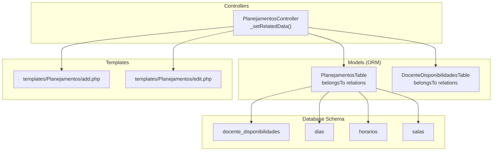
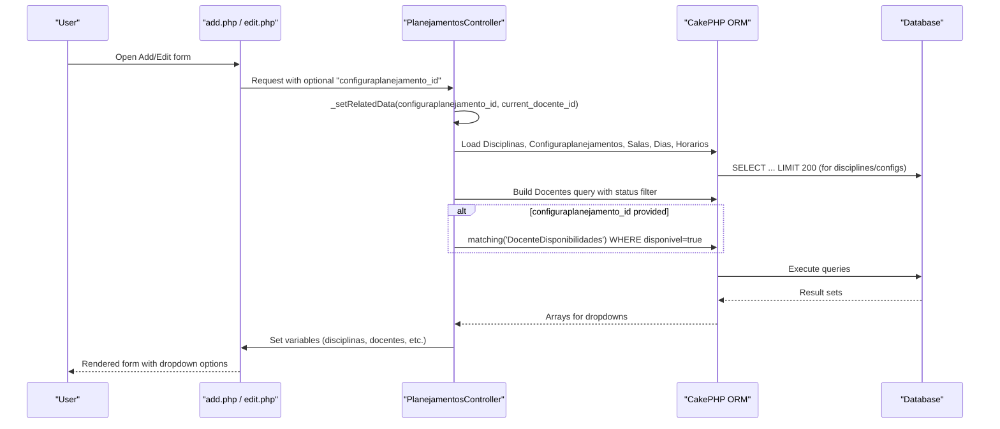
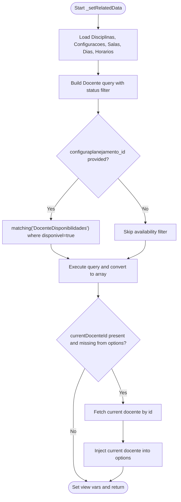
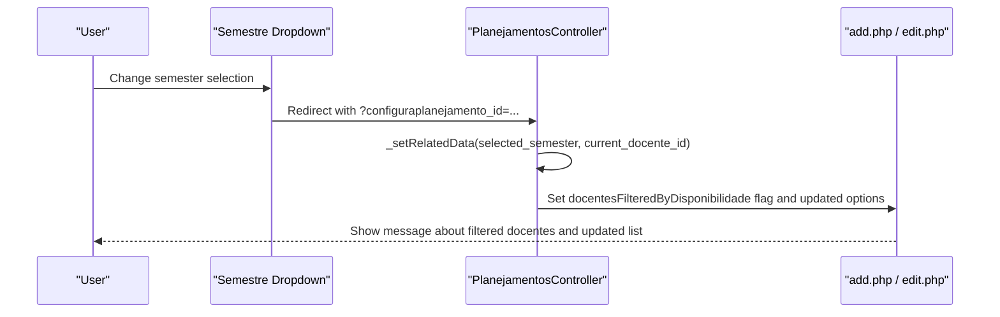
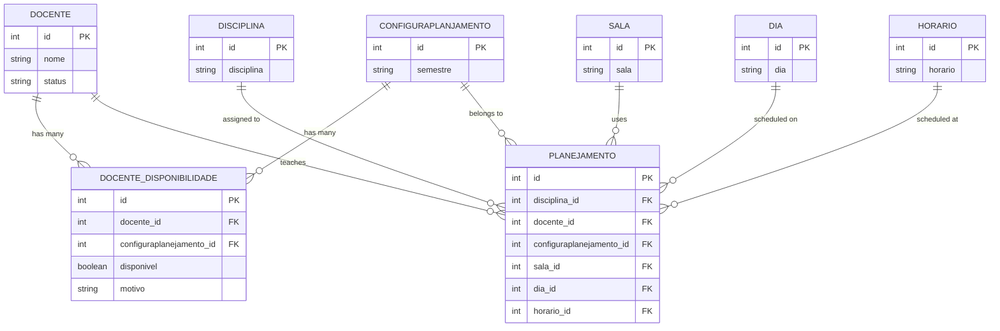
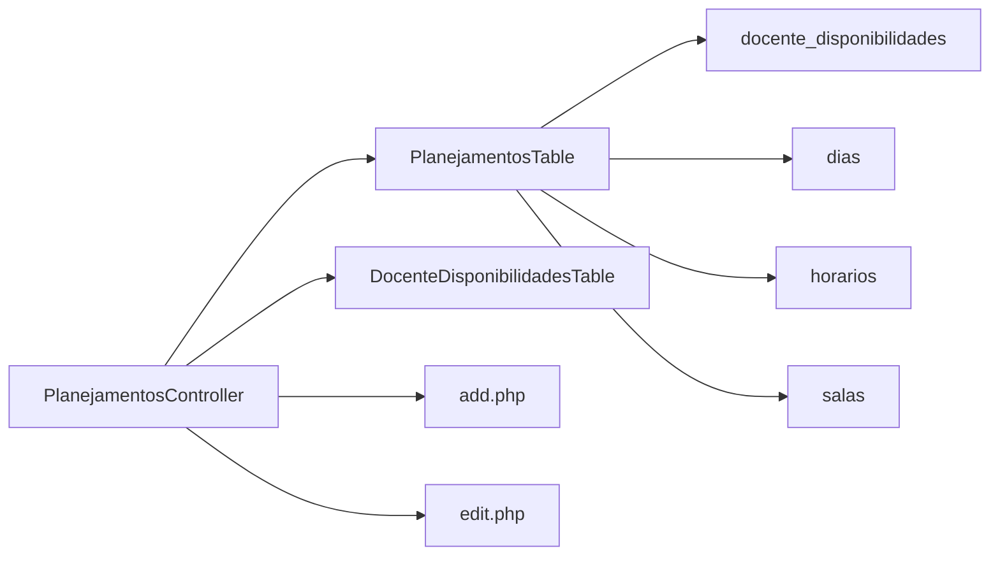

# Related Data Management

<cite>
**Referenced Files in This Document**
- [PlanejamentosController.php](file://src/Controller/PlanejamentosController.php)
- [add.php](file://templates/Planejamentos/add.php)
- [edit.php](file://templates/Planejamentos/edit.php)
- [PlanejamentosTable.php](file://src/Model/Table/PlanejamentosTable.php)
- [DocenteDisponibilidadesTable.php](file://src/Model/Table/DocenteDisponibilidadesTable.php)
- [CreateDocenteDisponibilidades.php](file://config/Migrations/20260613100000_CreateDocenteDisponibilidades.php)
- [CreateDias.php](file://config/Migrations/20260612030430_CreateDias.php)
- [CreateHorarios.php](file://config/Migrations/20260612030431_CreateHorarios.php)
- [CreateSalas.php](file://config/Migrations/20260612030432_CreateSalas.php)
</cite>

## Table of Contents
1. [Introduction](#introduction)
2. [Project Structure](#project-structure)
3. [Core Components](#core-components)
4. [Architecture Overview](#architecture-overview)
5. [Detailed Component Analysis](#detailed-component-analysis)
6. [Dependency Analysis](#dependency-analysis)
7. [Performance Considerations](#performance-considerations)
8. [Troubleshooting Guide](#troubleshooting-guide)
9. [Conclusion](#conclusion)

## Introduction
This document explains how related data is managed for dropdown options in the academic planning system, focusing on the _setRelatedData() method in the Planejamento controller. It covers:
- Populating dropdowns for disciplines, faculty members (docentes), classrooms (salas), days (dias), and time slots (horarios).
- Filtering faculty by availability per semester using the DocenteDisponibilidade configuration.
- Status-based filtering to include only active faculty members.
- Dynamic data loading patterns when a semester (semestre/configuraplanejamento_id) is selected.
- Fallback behavior that preserves the current faculty selection during edit operations even if it does not appear in the filtered list.
- Performance considerations for large datasets, including limit constraints.

## Project Structure
The related data management spans controllers, models, templates, and database migrations:
- Controller logic populates dropdown options and applies filters.
- Templates render form controls with the provided option arrays.
- ORM tables define relationships used for matching and listing.
- Migrations define the schema for availability and reference tables.

**Diagram sources**
- [PlanejamentosController.php:209-254](file://src/Controller/PlanejamentosController.php#L209-L254)
- [PlanejamentosTable.php:11-40](file://src/Model/Table/PlanejamentosTable.php#L11-L40)
- [DocenteDisponibilidadesTable.php:13-30](file://src/Model/Table/DocenteDisponibilidadesTable.php#L13-L30)
- [add.php:8-25](file://templates/Planejamentos/add.php#L8-L25)
- [edit.php:8-25](file://templates/Planejamentos/edit.php#L8-L25)
- [CreateDocenteDisponibilidades.php:10-45](file://config/Migrations/20260613100000_CreateDocenteDisponibilidades.php#L10-L45)
- [CreateDias.php:18-37](file://config/Migrations/20260612030430_CreateDias.php#L18-L37)
- [CreateHorarios.php:18-37](file://config/Migrations/20260612030431_CreateHorarios.php#L18-L37)
- [CreateSalas.php:18-32](file://config/Migrations/20260612030432_CreateSalas.php#L18-L32)

**Section sources**
- [PlanejamentosController.php:209-254](file://src/Controller/PlanejamentosController.php#L209-L254)
- [add.php:8-25](file://templates/Planejamentos/add.php#L8-L25)
- [edit.php:8-25](file://templates/Planejamentos/edit.php#L8-L25)
- [PlanejamentosTable.php:11-40](file://src/Model/Table/PlanejamentosTable.php#L11-L40)
- [DocenteDisponibilidadesTable.php:13-30](file://src/Model/Table/DocenteDisponibilidadesTable.php#L13-L30)
- [CreateDocenteDisponibilidades.php:10-45](file://config/Migrations/20260613100000_CreateDocenteDisponibilidades.php#L10-L45)
- [CreateDias.php:18-37](file://config/Migrations/20260612030430_CreateDias.php#L18-L37)
- [CreateHorarios.php:18-37](file://config/Migrations/20260612030431_CreateHorarios.php#L18-L37)
- [CreateSalas.php:18-32](file://config/Migrations/20260612030432_CreateSalas.php#L18-L32)

## Core Components
- _setRelatedData(): Central method that loads dropdown options and applies faculty filtering based on semester availability and status.
- Templates add.php and edit.php: Render dropdowns using the arrays populated by _setRelatedData().
- ORM Tables: Define belongsTo relationships enabling efficient joins and matching queries.
- Availability table (docente_disponibilidades): Stores per-semester availability flags for faculty.

Key responsibilities:
- Load small lists for dias, horarios, salas without limits.
- Limit disciplines and configuracoes lists to 200 items to control payload size.
- Filter docentes by status IN ('ativo', 'active', 'activo').
- Optionally match docente_disponibilidades where disponivel = true for the selected configuraplanejamento_id.
- Ensure the current docente remains selectable during edit via fallback logic.

**Section sources**
- [PlanejamentosController.php:209-254](file://src/Controller/PlanejamentosController.php#L209-L254)
- [add.php:8-25](file://templates/Planejamentos/add.php#L8-L25)
- [edit.php:8-25](file://templates/Planejamentos/edit.php#L8-L25)
- [PlanejamentosTable.php:11-40](file://src/Model/Table/PlanejamentosTable.php#L11-L40)
- [DocenteDisponibilidadesTable.php:13-30](file://src/Model/Table/DocenteDisponibilidadesTable.php#L13-L30)
- [CreateDocenteDisponibilidades.php:10-45](file://config/Migrations/20260613100000_CreateDocenteDisponibilidades.php#L10-L45)

## Architecture Overview
The flow from user interaction to server-side processing and back to the UI:

**Diagram sources**
- [PlanejamentosController.php:209-254](file://src/Controller/PlanejamentosController.php#L209-L254)
- [add.php:8-25](file://templates/Planejamentos/add.php#L8-L25)
- [edit.php:8-25](file://templates/Planejamentos/edit.php#L8-L25)

## Detailed Component Analysis

### _setRelatedData() Method
Responsibilities:
- Populate dropdown options for:
  - Disciplinas (limited to 200)
  - Configuraplanejamentos (limited to 200)
  - Salas, Dias, Horarios (no explicit limit)
- Build a Docente list filtered by:
  - Status IN ('ativo', 'active', 'activo')
  - Optional availability matching for the selected configuraplanejamento_id where disponivel = true
- Preserve current docente selection during edit via fallback logic.

Implementation highlights:
- Uses find('list') to generate key-value pairs for select controls.
- Applies ->where(['Docentes.status IN' => ['ativo', 'active', 'activo']]) to restrict to active faculty.
- Uses ->matching('DocenteDisponibilidades', ...) to join availability records and filter by disponivel = true for the given configuraplanejamento_id.
- After building the array, checks if the current docente_id exists; if not, fetches and injects it into the options so the existing selection remains valid.

**Diagram sources**
- [PlanejamentosController.php:209-254](file://src/Controller/PlanejamentosController.php#L209-L254)

**Section sources**
- [PlanejamentosController.php:209-254](file://src/Controller/PlanejamentosController.php#L209-L254)

### Faculty Availability Filtering Logic
- The availability filter uses a matching join to the DocenteDisponibilidades table.
- Conditions:
  - configuraplanejamento_id equals the selected semester configuration.
  - disponivel = true.
- This ensures only professors marked available for the chosen semester are shown.

Matching query pattern (conceptual):
- Select docentes where status IN ('ativo','active','activo') AND EXISTS (SELECT 1 FROM docente_disponibilidades WHERE docente_id = docentes.id AND configuraplanejamento_id = :id AND disponivel = true).

**Section sources**
- [PlanejamentosController.php:223-231](file://src/Controller/PlanejamentosController.php#L223-L231)
- [DocenteDisponibilidadesTable.php:13-30](file://src/Model/Table/DocenteDisponibilidadesTable.php#L13-L30)
- [CreateDocenteDisponibilidades.php:10-45](file://config/Migrations/20260613100000_CreateDocenteDisponibilidades.php#L10-L45)

### Status-Based Filtering for Active Faculty
- The Docente list is restricted to statuses considered active: 'ativo', 'active', 'activo'.
- This prevents retired or inactive faculty from appearing in dropdowns.

**Section sources**
- [PlanejamentosController.php:217-220](file://src/Controller/PlanejamentosController.php#L217-L220)

### Dynamic Data Loading Patterns
- When a semester (configuraplanejamento_id) is selected in the form, the page reloads with the parameter, triggering _setRelatedData() to rebuild the docente list with availability filtering.
- The templates pass the selected configuraplanejamento_id via URL parameters and set defaults accordingly.

**Diagram sources**
- [add.php:9-20](file://templates/Planejamentos/add.php#L9-L20)
- [edit.php:9-20](file://templates/Planejamentos/edit.php#L9-L20)
- [PlanejamentosController.php:209-254](file://src/Controller/PlanejamentosController.php#L209-L254)

**Section sources**
- [add.php:9-20](file://templates/Planejamentos/add.php#L9-L20)
- [edit.php:9-20](file://templates/Planejamentos/edit.php#L9-L20)
- [PlanejamentosController.php:209-254](file://src/Controller/PlanejamentosController.php#L209-L254)

### Fallback Mechanism for Current Faculty Selection During Edit
- If the current docente_id is not included in the filtered list (e.g., due to availability changes), the method fetches the current docente and injects it into the options array.
- This guarantees the existing assignment remains selectable even if it no longer matches the filter criteria.

**Section sources**
- [PlanejamentosController.php:234-242](file://src/Controller/PlanejamentosController.php#L234-L242)

### Database Relationships and Schema
- PlanejamentosTable defines belongsTo relationships to Disciplinas, Docentes, Configuraplanejamentos, Salas, Dias, and Horarios. These enable efficient joins and containments.
- DocenteDisponibilidadesTable defines belongsTo relationships to Docentes and Configuraplanejamentos and includes validation rules.
- Migrations define the structure and indexes for availability and reference tables.

**Diagram sources**
- [PlanejamentosTable.php:11-40](file://src/Model/Table/PlanejamentosTable.php#L11-L40)
- [DocenteDisponibilidadesTable.php:13-30](file://src/Model/Table/DocenteDisponibilidadesTable.php#L13-L30)
- [CreateDocenteDisponibilidades.php:10-45](file://config/Migrations/20260613100000_CreateDocenteDisponibilidades.php#L10-L45)
- [CreateDias.php:18-37](file://config/Migrations/20260612030430_CreateDias.php#L18-L37)
- [CreateHorarios.php:18-37](file://config/Migrations/20260612030431_CreateHorarios.php#L18-L37)
- [CreateSalas.php:18-32](file://config/Migrations/20260612030432_CreateSalas.php#L18-L32)

## Dependency Analysis
- Controller depends on ORM tables for data access and uses matching joins to apply availability filters.
- Templates depend on controller-provided arrays to render select options.
- Availability filtering depends on the existence of configured DocenteDisponibilidade records for the selected semester.

**Diagram sources**
- [PlanejamentosController.php:209-254](file://src/Controller/PlanejamentosController.php#L209-L254)
- [PlanejamentosTable.php:11-40](file://src/Model/Table/PlanejamentosTable.php#L11-L40)
- [DocenteDisponibilidadesTable.php:13-30](file://src/Model/Table/DocenteDisponibilidadesTable.php#L13-L30)
- [add.php:8-25](file://templates/Planejamentos/add.php#L8-L25)
- [edit.php:8-25](file://templates/Planejamentos/edit.php#L8-L25)

**Section sources**
- [PlanejamentosController.php:209-254](file://src/Controller/PlanejamentosController.php#L209-L254)
- [PlanejamentosTable.php:11-40](file://src/Model/Table/PlanejamentosTable.php#L11-L40)
- [DocenteDisponibilidadesTable.php:13-30](file://src/Model/Table/DocenteDisponibilidadesTable.php#L13-L30)
- [add.php:8-25](file://templates/Planejamentos/add.php#L8-L25)
- [edit.php:8-25](file://templates/Planejamentos/edit.php#L8-L25)

## Performance Considerations
- Limits applied:
  - Disciplinas and Configuraplanejamentos lists are limited to 200 items to reduce payload and improve rendering performance.
- Unbounded lists:
  - Salas, Dias, and Horarios are loaded without explicit limits; ensure these tables remain small or consider adding pagination or limits if they grow.
- Matching joins:
  - Availability filtering uses a matching join; ensure indexes exist on docente_disponibilidades(docente_id, configuraplanejamento_id) and configuraplanejamento_id to optimize query performance.
- Fallback fetch:
  - The fallback mechanism performs an additional query only when needed (when the current docente is missing from the filtered list). Keep this path minimal by ensuring the primary query returns the current selection whenever possible.

[No sources needed since this section provides general guidance]

## Troubleshooting Guide
- Missing current docente in dropdown:
  - Symptom: The currently assigned professor does not appear in the filtered list.
  - Cause: Availability filter excludes the professor for the selected semester.
  - Resolution: The fallback logic injects the current professor into the options; verify that the current docente_id is passed correctly to _setRelatedData() during edit.
- No docentes shown after selecting a semester:
  - Cause: No docentes have disponivel = true for the selected configuraplanejamento_id.
  - Resolution: Configure availability records for docentes in the selected semester.
- Slow form load times:
  - Cause: Large datasets for disciplinas/configuracoes or unbounded lists for salas/dias/horarios.
  - Resolution: Maintain limits (already applied to disciplinas/configuracoes); consider adding limits or pagination for other lists if they grow.

**Section sources**
- [PlanejamentosController.php:234-242](file://src/Controller/PlanejamentosController.php#L234-L242)
- [PlanejamentosController.php:209-254](file://src/Controller/PlanejamentosController.php#L209-L254)

## Conclusion
The _setRelatedData() method centralizes the population of dropdown options and enforces business rules for faculty selection:
- Filters by active status.
- Optionally filters by semester-specific availability.
- Preserves the current selection during edits through a fallback mechanism.
- Applies limits to large lists to maintain performance.
Together with well-defined ORM relationships and clear template usage, this approach delivers a robust and user-friendly experience for managing academic planning data.