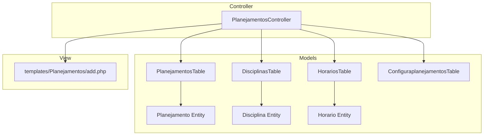
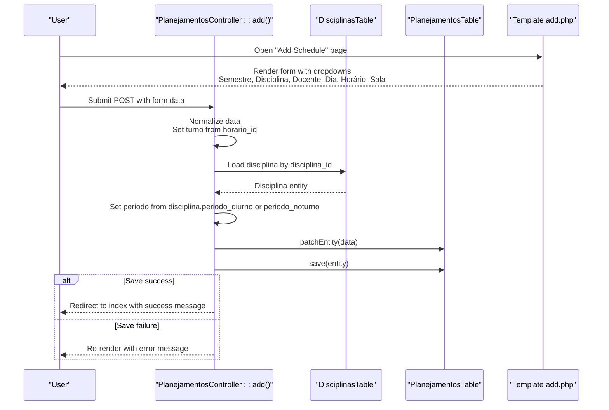
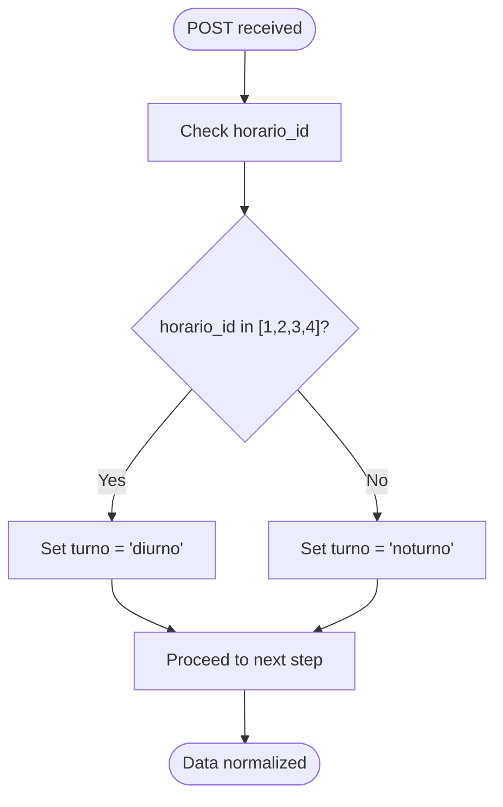
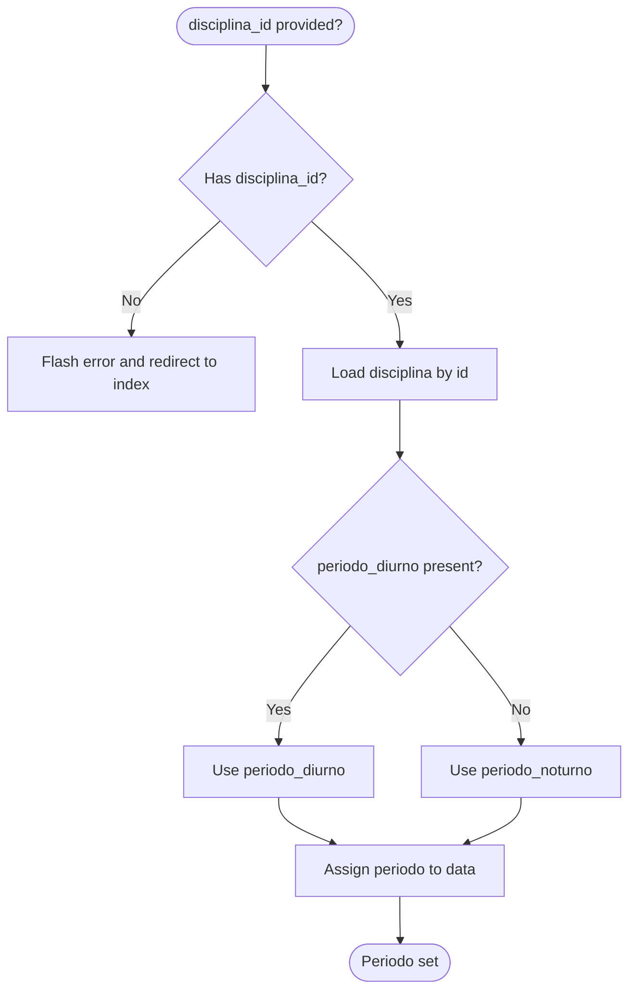
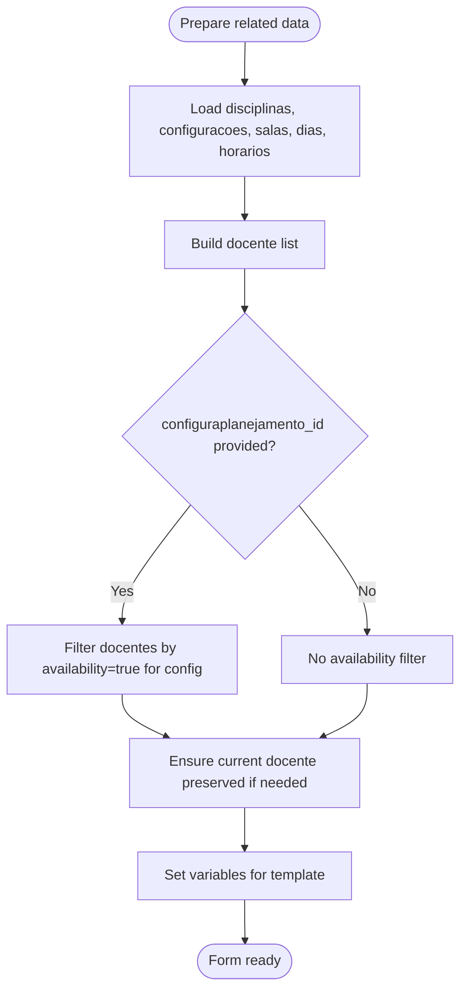
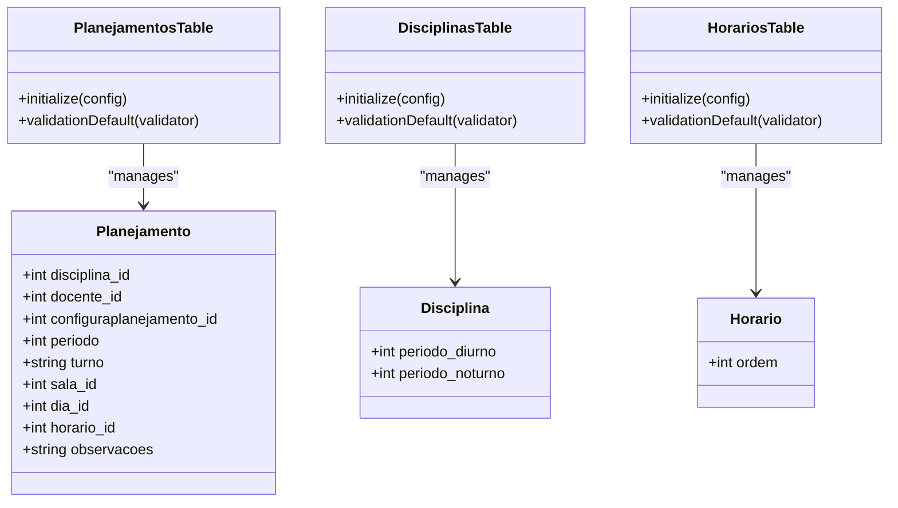
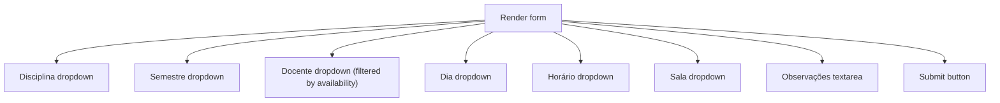
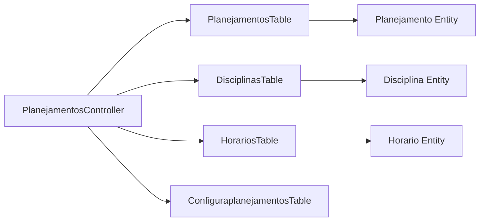

# Schedule Creation Workflow

<cite>
**Referenced Files in This Document**
- [PlanejamentosController.php](file://src/Controller/PlanejamentosController.php)
- [PlanejamentosTable.php](file://src/Model/Table/PlanejamentosTable.php)
- [Planejamento.php](file://src/Model/Entity/Planejamento.php)
- [DisciplinasTable.php](file://src/Model/Table/DisciplinasTable.php)
- [Disciplina.php](file://src/Model/Entity/Disciplina.php)
- [HorariosTable.php](file://src/Model/Table/HorariosTable.php)
- [Horario.php](file://src/Model/Entity/Horario.php)
- [ConfiguraplanejamentosTable.php](file://src/Model/Table/ConfiguraplanejamentosTable.php)
- [add.php](file://templates/Planejamentos/add.php)
</cite>

## Table of Contents
1. [Introduction](#introduction)
2. [Project Structure](#project-structure)
3. [Core Components](#core-components)
4. [Architecture Overview](#architecture-overview)
5. [Detailed Component Analysis](#detailed-component-analysis)
6. [Dependency Analysis](#dependency-analysis)
7. [Performance Considerations](#performance-considerations)
8. [Troubleshooting Guide](#troubleshooting-guide)
9. [Conclusion](#conclusion)

## Introduction
This document explains the end-to-end workflow for creating new academic schedules (planning entries) in the system. It covers:
- Semester selection and its effect on faculty availability filtering
- Discipline assignment and automatic period calculation
- Faculty availability filtering based on semester configuration
- Automatic turno (diurno/noturno) calculation based on horario_id mapping
- Form validation rules, data flow from user input to database storage, and template rendering
- Relationship between disciplina_id and periodo assignment and how consistency is ensured

## Project Structure
The schedule creation feature follows a standard MVC pattern:
- Controller orchestrates request handling, business logic, and response
- Tables define relationships and validation rules
- Entities define accessible fields
- Templates render forms and display messages

**Diagram sources**
- [PlanejamentosController.php:83-127](file://src/Controller/PlanejamentosController.php#L83-L127)
- [PlanejamentosTable.php:11-40](file://src/Model/Table/PlanejamentosTable.php#L11-L40)
- [DisciplinasTable.php:15-27](file://src/Model/Table/DisciplinasTable.php#L15-L27)
- [HorariosTable.php:33-41](file://src/Model/Table/HorariosTable.php#L33-L41)
- [ConfiguraplanejamentosTable.php:11-31](file://src/Model/Table/ConfiguraplanejamentosTable.php#L11-L31)
- [add.php:1-32](file://templates/Planejamentos/add.php#L1-L32)

**Section sources**
- [PlanejamentosController.php:83-127](file://src/Controller/PlanejamentosController.php#L83-L127)
- [PlanejamentosTable.php:11-40](file://src/Model/Table/PlanejamentosTable.php#L11-L40)
- [DisciplinasTable.php:15-27](file://src/Model/Table/DisciplinasTable.php#L15-L27)
- [HorariosTable.php:33-41](file://src/Model/Table/HorariosTable.php#L33-L41)
- [ConfiguraplanejamentosTable.php:11-31](file://src/Model/Table/ConfiguraplanejamentosTable.php#L11-L31)
- [add.php:1-32](file://templates/Planejamentos/add.php#L1-L32)

## Core Components
- Controller add() method handles form submission, sets derived fields (turno, periodo), validates via table validator, persists entity, and redirects with feedback.
- Table definitions enforce required fields and types; relationships ensure referential integrity.
- Template renders dropdowns for related entities and provides semester-driven faculty filtering hints.

Key responsibilities:
- Input normalization and derivation of turno and periodo
- Validation using table validators
- Data persistence and user feedback
- Preparing related lists for form rendering

**Section sources**
- [PlanejamentosController.php:83-127](file://src/Controller/PlanejamentosController.php#L83-L127)
- [PlanejamentosTable.php:42-55](file://src/Model/Table/PlanejamentosTable.php#L42-L55)
- [add.php:1-32](file://templates/Planejamentos/add.php#L1-L32)

## Architecture Overview
The schedule creation sequence involves selecting a semester, assigning a discipline, optionally filtering faculty by availability, choosing day/time/slot, and saving the record. The controller computes turno and periodo automatically before persisting.

**Diagram sources**
- [PlanejamentosController.php:83-127](file://src/Controller/PlanejamentosController.php#L83-L127)
- [DisciplinasTable.php:15-27](file://src/Model/Table/DisciplinasTable.php#L15-L27)
- [PlanejamentosTable.php:42-55](file://src/Model/Table/PlanejamentosTable.php#L42-L55)
- [add.php:1-32](file://templates/Planejamentos/add.php#L1-L32)

## Detailed Component Analysis

### Controller add() Method
Responsibilities:
- Accepts optional query parameter to preselect a semester configuration
- Normalizes incoming data:
  - Computes turno based on horario_id mapping
  - Loads disciplina and derives periodo from disciplina’s diurno/noturno fields
- Validates via table validator
- Persists and responds with flash messages and redirect

Important behaviors:
- If no disciplina selected, returns an error and redirects to index
- After patch/save, refreshes related data for dropdowns

**Section sources**
- [PlanejamentosController.php:83-127](file://src/Controller/PlanejamentosController.php#L83-L127)

#### Turno Calculation Logic
Turno is determined by horario_id:
- IDs 1–4 map to diurno
- Other IDs map to noturno

**Diagram sources**
- [PlanejamentosController.php:100-105](file://src/Controller/PlanejamentosController.php#L100-L105)

#### Periodo Assignment Based on disciplina_id
Periodo is derived from the selected disciplina:
- If disciplina has periodo_diurno set, use it
- Otherwise, use periodo_noturno
- Ensures consistency between selected discipline and planned period

**Diagram sources**
- [PlanejamentosController.php:106-114](file://src/Controller/PlanejamentosController.php#L106-L114)

### Related Data Preparation and Faculty Availability Filtering
Before rendering the form, the controller prepares dropdown options:
- Disciplinas list
- Configuraplanejamentos (semesters) list
- Salas, Dias, Horarios lists
- Docentes filtered by availability when a semester is selected

Faculty filtering:
- When configuraplanejamento_id is provided, only docentes marked available for that configuration are shown
- Status filter ensures only active docentes are included

**Diagram sources**
- [PlanejamentosController.php:209-254](file://src/Controller/PlanejamentosController.php#L209-L254)

**Section sources**
- [PlanejamentosController.php:209-254](file://src/Controller/PlanejamentosController.php#L209-L254)

### Entity and Table Definitions
- Planejamento entity exposes all necessary fields for mass assignment
- PlanejamentosTable defines relationships and validation rules:
  - Required: disciplina_id, configuraplanejamento_id
  - Optional: docente_id, periodo, turno, sala_id, dia_id, horario_id, observacoes
- DisciplinasTable enforces valid ranges for periodo_diurno and periodo_noturno
- HorariosTable defines basic structure used for turno mapping

**Diagram sources**
- [Planejamento.php:13-25](file://src/Model/Entity/Planejamento.php#L13-L25)
- [PlanejamentosTable.php:11-40](file://src/Model/Table/PlanejamentosTable.php#L11-L40)
- [Disciplina.php:33-47](file://src/Model/Entity/Disciplina.php#L33-L47)
- [DisciplinasTable.php:29-83](file://src/Model/Table/DisciplinasTable.php#L29-L83)
- [Horario.php:24-29](file://src/Model/Entity/Horario.php#L24-L29)
- [HorariosTable.php:49-63](file://src/Model/Table/HorariosTable.php#L49-L63)

**Section sources**
- [Planejamento.php:13-25](file://src/Model/Entity/Planejamento.php#L13-L25)
- [PlanejamentosTable.php:11-40](file://src/Model/Table/PlanejamentosTable.php#L11-L40)
- [Disciplina.php:33-47](file://src/Model/Entity/Disciplina.php#L33-L47)
- [DisciplinasTable.php:29-83](file://src/Model/Table/DisciplinasTable.php#L29-L83)
- [Horario.php:24-29](file://src/Model/Entity/Horario.php#L24-L29)
- [HorariosTable.php:49-63](file://src/Model/Table/HorariosTable.php#L49-L63)

### Template Rendering (add.php)
The add template:
- Renders dropdowns for disciplina, semestre (configuraplanejamento), docente, dia, horario, sala
- Displays contextual help about faculty filtering based on selected semester
- Submits to controller add() action

**Diagram sources**
- [add.php:1-32](file://templates/Planejamentos/add.php#L1-L32)

**Section sources**
- [add.php:1-32](file://templates/Planejamentos/add.php#L1-L32)

## Dependency Analysis
- Controller depends on multiple tables for data preparation and persistence
- Relationships defined in tables ensure referential integrity during queries and saves
- Validation rules in tables prevent invalid data entry

**Diagram sources**
- [PlanejamentosController.php:83-127](file://src/Controller/PlanejamentosController.php#L83-L127)
- [PlanejamentosTable.php:11-40](file://src/Model/Table/PlanejamentosTable.php#L11-L40)
- [DisciplinasTable.php:15-27](file://src/Model/Table/DisciplinasTable.php#L15-L27)
- [HorariosTable.php:33-41](file://src/Model/Table/HorariosTable.php#L33-L41)
- [ConfiguraplanejamentosTable.php:11-31](file://src/Model/Table/ConfiguraplanejamentosTable.php#L11-L31)

**Section sources**
- [PlanejamentosController.php:83-127](file://src/Controller/PlanejamentosController.php#L83-L127)
- [PlanejamentosTable.php:11-40](file://src/Model/Table/PlanejamentosTable.php#L11-L40)
- [DisciplinasTable.php:15-27](file://src/Model/Table/DisciplinasTable.php#L15-L27)
- [HorariosTable.php:33-41](file://src/Model/Table/HorariosTable.php#L33-L41)
- [ConfiguraplanejamentosTable.php:11-31](file://src/Model/Table/ConfiguraplanejamentosTable.php#L11-L31)

## Performance Considerations
- Dropdown lists are loaded with limits to avoid excessive memory usage
- Faculty filtering uses matching queries to reduce result sets
- Avoid unnecessary contains in list operations; only load required fields

[No sources needed since this section provides general guidance]

## Troubleshooting Guide
Common issues and resolutions:
- Missing disciplina selection:
  - Symptom: Error message prompting to select a discipline
  - Cause: disciplina_id not provided
  - Resolution: Ensure a disciplina is selected before submitting
- Invalid turno or periodo:
  - Symptom: Validation errors after save attempt
  - Cause: Inconsistent data or missing required fields
  - Resolution: Verify horario_id mapping and disciplina period fields
- Faculty not appearing:
  - Symptom: Docente dropdown empty or incomplete
  - Cause: Availability filter excludes current docente or status not active
  - Resolution: Check availability settings and docente status

**Section sources**
- [PlanejamentosController.php:106-114](file://src/Controller/PlanejamentosController.php#L106-L114)
- [PlanejamentosController.php:209-254](file://src/Controller/PlanejamentosController.php#L209-L254)

## Conclusion
The schedule creation workflow integrates user input with automated business rules to ensure consistent and valid academic scheduling. By deriving turno and periodo from selected values and enforcing validation at the model layer, the system maintains data integrity while providing a streamlined user experience.

[No sources needed since this section summarizes without analyzing specific files]