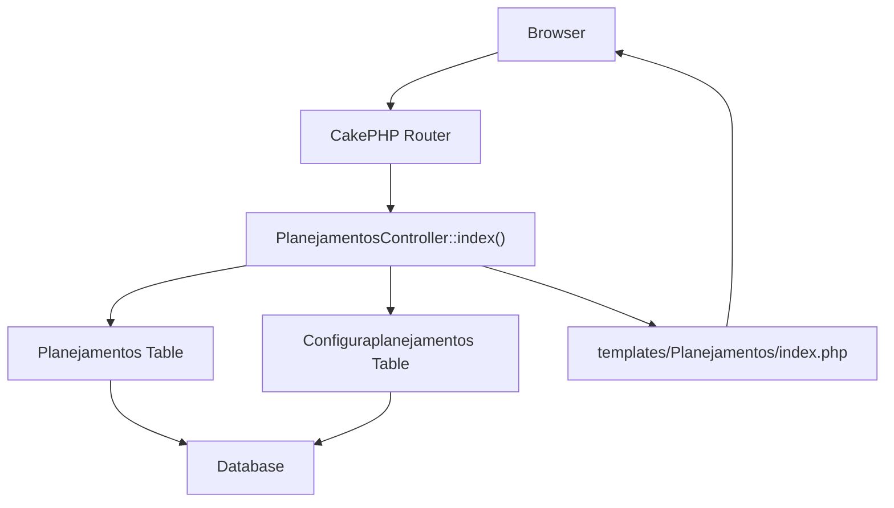
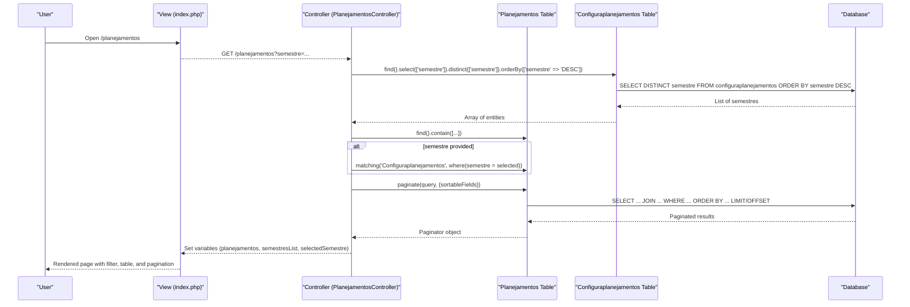
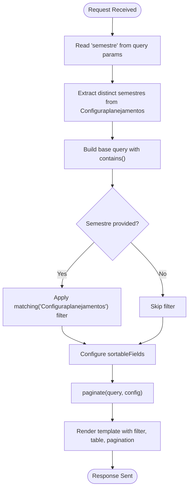
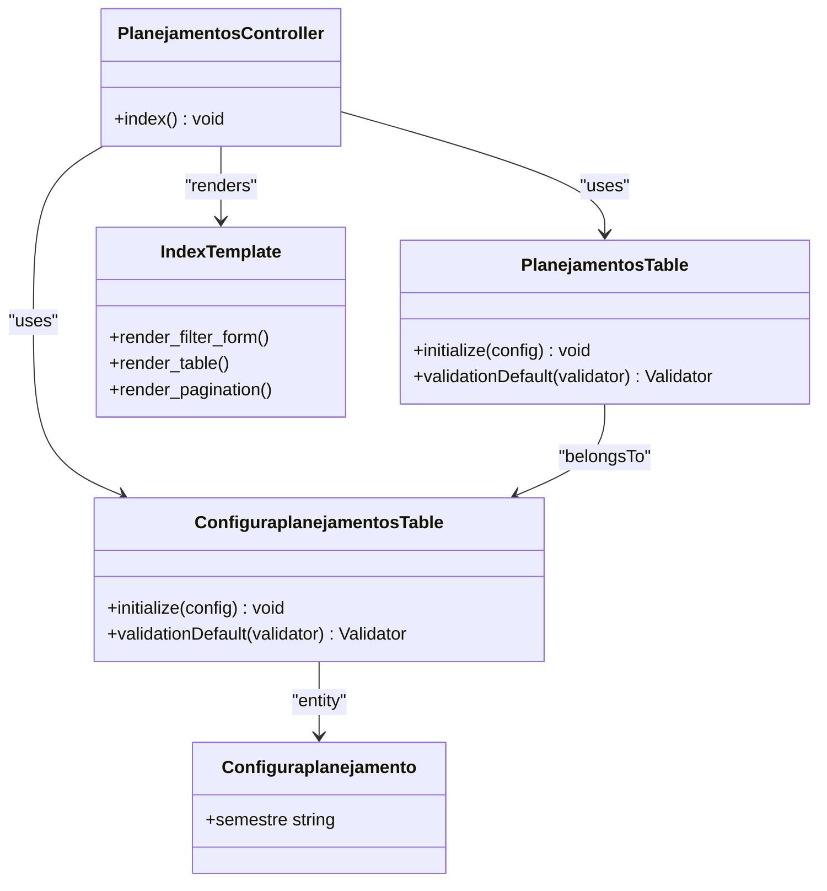

# Semester Filtering System

<cite>
**Referenced Files in This Document**
- [PlanejamentosController.php](file://src/Controller/PlanejamentosController.php)
- [index.php](file://templates/Planejamentos/index.php)
- [ConfiguraplanejamentosTable.php](file://src/Model/Table/ConfiguraplanejamentosTable.php)
- [Configuraplanejamento.php](file://src/Model/Entity/Configuraplanejamento.php)
- [PlanejamentosTable.php](file://src/Model/Table/PlanejamentosTable.php)
</cite>

## Table of Contents
1. [Introduction](#introduction)
2. [Project Structure](#project-structure)
3. [Core Components](#core-components)
4. [Architecture Overview](#architecture-overview)
5. [Detailed Component Analysis](#detailed-component-analysis)
6. [Dependency Analysis](#dependency-analysis)
7. [Performance Considerations](#performance-considerations)
8. [Troubleshooting Guide](#troubleshooting-guide)
9. [Conclusion](#conclusion)

## Introduction
This document explains the semester filtering system implemented in the academic planning interface. It focuses on how the index() method supports multi-semester filtering via query parameters, how distinct semestres are extracted from the Configuraplanejamentos table, and how the dynamic dropdown is rendered in the template. It also documents the matching() usage for filtering Planejamentos by selected semester, the sorting configuration across multiple fields, and pagination integration with filtered results. Examples include URL parameter formats, query construction behavior, and template rendering of filtered data views.

## Project Structure
The semester filtering feature spans a controller action, a view template, and model tables/entities that define relationships and validation rules:

- Controller: PlanejamentosController.index() handles request processing, filtering, sorting, and pagination.
- Template: templates/Planejamentos/index.php renders the filter form, table, and paginator.
- Models: ConfiguraplanejamentosTable and PlanejamentosTable define associations and field constraints used by the filtering logic.

**Diagram sources**
- [PlanejamentosController.php:17-67](file://src/Controller/PlanejamentosController.php#L17-L67)
- [index.php:1-85](file://templates/Planejamentos/index.php#L1-L85)
- [PlanejamentosTable.php:11-40](file://src/Model/Table/PlanejamentosTable.php#L11-L40)
- [ConfiguraplanejamentosTable.php:11-31](file://src/Model/Table/ConfiguraplanejamentosTable.php#L11-L31)

**Section sources**
- [PlanejamentosController.php:17-67](file://src/Controller/PlanejamentosController.php#L17-L67)
- [index.php:1-85](file://templates/Planejamentos/index.php#L1-L85)
- [PlanejamentosTable.php:11-40](file://src/Model/Table/PlanejamentosTable.php#L11-L40)
- [ConfiguraplanejamentosTable.php:11-31](file://src/Model/Table/ConfiguraplanejamentosTable.php#L11-L31)

## Core Components
- Request handling and filtering: The index() method reads the semestre query parameter, builds a query with contains(), conditionally applies matching() to filter by configured semester, configures sortable fields, and paginates the result set.
- Distinct semestres extraction: A separate query selects distinct semestre values from Configuraplanejamentos and orders them descending to populate the dropdown options.
- Template rendering: The view renders a GET form with a dropdown populated from the extracted semestres, auto-submits on change, and displays a clear-filter link when a filter is active. The table uses Paginator helpers to render sorted columns and pagination controls.

Key responsibilities:
- Controller: Query building, filtering, sorting, pagination, and passing variables to the view.
- View: Rendering the filter UI, table rows, and pagination links while preserving the current filter state.
- Models: Defining belongsTo/hasMany relationships and field validations that underpin the queries.

**Section sources**
- [PlanejamentosController.php:17-67](file://src/Controller/PlanejamentosController.php#L17-L67)
- [index.php:13-37](file://templates/Planejamentos/index.php#L13-L37)
- [index.php:38-84](file://templates/Planejamentos/index.php#L38-L84)
- [ConfiguraplanejamentosTable.php:11-31](file://src/Model/Table/ConfiguraplanejamentosTable.php#L11-L31)
- [PlanejamentosTable.php:11-40](file://src/Model/Table/PlanejamentosTable.php#L11-L40)

## Architecture Overview
The semester filtering workflow follows a standard MVC flow:

**Diagram sources**
- [PlanejamentosController.php:17-67](file://src/Controller/PlanejamentosController.php#L17-L67)
- [index.php:13-37](file://templates/Planejamentos/index.php#L13-L37)
- [index.php:38-84](file://templates/Planejamentos/index.php#L38-L84)
- [PlanejamentosTable.php:11-40](file://src/Model/Table/PlanejamentosTable.php#L11-L40)
- [ConfiguraplanejamentosTable.php:11-31](file://src/Model/Table/ConfiguraplanejamentosTable.php#L11-L31)

## Detailed Component Analysis

### Controller: index() Method
Responsibilities:
- Reads the semestre query parameter.
- Extracts distinct semestres from Configuraplanejamentos.
- Builds a base query with contains() for related entities.
- Applies matching() to filter Planejamentos by selected semester when present.
- Configures sortable fields for multiple columns.
- Paginates the query and sets view variables.

Behavioral notes:
- When no semestre is provided, all planejamentos are returned (subject to pagination).
- When semestre is provided, only planejamentos linked to a Configuraplanejamento with that semester are included.
- Sorting is enabled for several fields across associated tables.

Example URL parameters:
- All semestres: /planejamentos
- Filter by semester: /planejamentos?semestre=2024.1
- Combined with sort/pagination: /planejamentos?semestre=2024.1&page=2&sort=Disciplinas.disciplina&direction=asc

Query construction overview:
- Base query: find() with contains([Disciplinas, Docentes, Configuraplanejamentos, Salas, Dias, Horarios]).
- Optional filter: matching('Configuraplanejamentos', function($q){ return $q->where(['Configuraplanejamentos.semestre' => $selectedSemestre]); }).
- Pagination: paginate($query, ['sortableFields' => [...]]).

Sorting configuration:
- Fields include IDs and display names from Disciplinas, Docentes, Configuraplanejamentos, Dias, Horarios, and Salas.

Pagination integration:
- The Paginator helper in the template renders first/prev/numbers/next/last links and a counter.
- The filter form persists the selected semestre across pages via GET parameters.

**Section sources**
- [PlanejamentosController.php:17-67](file://src/Controller/PlanejamentosController.php#L17-L67)

### Model: ConfiguraplanejamentosTable and Entity
Purpose:
- Defines the configuraplanejamentos table mapping, primary key, display field, and behaviors.
- Declares relationships: belongsTo Usuarioplanejamentos; hasMany Planejamentos; hasMany DocenteDisponibilidades.
- Validates fields including nome, semestre, versao, and ativo.

Relevance to filtering:
- The semestre field is validated as a non-empty scalar with a maximum length, ensuring consistent input for filtering.
- The hasMany relationship to Planejamentos enables matching() to filter based on configured semestres.

**Section sources**
- [ConfiguraplanejamentosTable.php:11-31](file://src/Model/Table/ConfiguraplanejamentosTable.php#L11-L31)
- [ConfiguraplanejamentosTable.php:33-60](file://src/Model/Table/ConfiguraplanejamentosTable.php#L33-L60)
- [Configuraplanejamento.php:11-22](file://src/Model/Entity/Configuraplanejamento.php#L11-L22)

### Model: PlanejamentosTable
Purpose:
- Maps the planejamentos table and defines belongsTo relationships to Disciplinas, Docentes, Configuraplanejamentos, Salas, Dias, and Horarios.
- Validates required and optional fields for persistence.

Relevance to filtering:
- The belongsTo Configuraplanejamentos association allows the controller’s matching() to join and filter by semestre.
- The contains() in the controller leverages these associations to load related data efficiently.

**Section sources**
- [PlanejamentosTable.php:11-40](file://src/Model/Table/PlanejamentosTable.php#L11-L40)
- [PlanejamentosTable.php:42-55](file://src/Model/Table/PlanejamentosTable.php#L42-L55)

### Template: index.php
Rendering responsibilities:
- Displays a filter form using GET submission with a dropdown populated from semestresList.
- Auto-submits the form on selection change to apply the filter immediately.
- Shows a “Clear Filter” link when a filter is active.
- Renders a table with sortable headers using Paginator helpers.
- Renders pagination controls and a counter.

Filtering behavior:
- The dropdown includes an option for “All Semestres” plus each distinct semestre.
- The default value reflects the currently selected semestre, preserving user context.
- The table lists related fields (disciplina, docente, semestre, dia, horario, sala) and provides actions.

Examples of rendered elements:
- Filter form: GET form with control named “semestre”.
- Clear filter link: Points to the index action without parameters.
- Sortable headers: Use Paginator::sort() for multiple fields.
- Pagination: Uses Paginator::first/prev/numbers/next/last and counter.

**Section sources**
- [index.php:13-37](file://templates/Planejamentos/index.php#L13-L37)
- [index.php:38-84](file://templates/Planejamentos/index.php#L38-L84)

### Conceptual Overview
The semester filtering system integrates three layers:
- Data layer: Configuraplanejamentos stores semestres; Planejamentos references configurations via foreign keys.
- Logic layer: Controller builds queries, extracts distinct semestres, applies matching filters, and paginates results.
- Presentation layer: View renders the filter UI, table, and pagination, maintaining filter state across requests.

[No sources needed since this diagram shows conceptual workflow, not actual code structure]

## Dependency Analysis
Relationships and dependencies relevant to filtering:

- Controller depends on:
  - Planejamentos Table for main query and pagination.
  - Configuraplanejamentos Table for distinct semestres extraction.
  - Template for rendering.

- Model associations:
  - Planejamentos belongsTo Configuraplanejamentos (enables matching()).
  - Configuraplanejamentos hasMany Planejamentos (supports reverse lookups).

Potential coupling considerations:
- The matching() call relies on the configured belongsTo association between Planejamentos and Configuraplanejamentos.
- Sorting configuration references fields from multiple associated tables; ensure those associations remain intact.

**Diagram sources**
- [PlanejamentosController.php:17-67](file://src/Controller/PlanejamentosController.php#L17-L67)
- [PlanejamentosTable.php:11-40](file://src/Model/Table/PlanejamentosTable.php#L11-L40)
- [ConfiguraplanejamentosTable.php:11-31](file://src/Model/Table/ConfiguraplanejamentosTable.php#L11-L31)
- [Configuraplanejamento.php:11-22](file://src/Model/Entity/Configuraplanejamento.php#L11-L22)
- [index.php:13-37](file://templates/Planejamentos/index.php#L13-L37)

**Section sources**
- [PlanejamentosController.php:17-67](file://src/Controller/PlanejamentosController.php#L17-L67)
- [PlanejamentosTable.php:11-40](file://src/Model/Table/PlanejamentosTable.php#L11-L40)
- [ConfiguraplanejamentosTable.php:11-31](file://src/Model/Table/ConfiguraplanejamentosTable.php#L11-L31)
- [Configuraplanejamento.php:11-22](file://src/Model/Entity/Configuraplanejamento.php#L11-L22)
- [index.php:13-37](file://templates/Planejamentos/index.php#L13-L37)

## Performance Considerations
- Distinct extraction: Using distinct(['semestre']) reduces duplicate entries and minimizes dropdown size.
- Contains vs joins: The controller uses contains() to eagerly load related entities, which can improve performance by reducing N+1 queries during rendering.
- Matching filter: matching() generates a subquery join; ensure indexes exist on configuraplanejamentos.semestre and planejamentos.configuraplanejamento_id for efficient filtering.
- Pagination: Applying pagination after filtering ensures only a subset of records is loaded per page.
- Sorting: Enabling sortableFields across multiple tables may increase query complexity; consider limiting frequently sorted fields or adding database indexes on commonly sorted columns.

[No sources needed since this section provides general guidance]

## Troubleshooting Guide
Common issues and resolutions:
- No results when filtering:
  - Verify that the selected semestre exists in Configuraplanejamentos.semestre.
  - Ensure Planejamentos records have valid configuraplanejamento_id values pointing to existing configurations.
- Dropdown empty:
  - Confirm there are records in Configuraplanejamentos; the distinct query returns nothing if the table is empty.
- Sorting errors:
  - Check that the referenced fields exist in their respective tables and that associations are correctly defined.
- Pagination losing filter:
  - Ensure the filter form uses GET and that the semestre parameter is preserved in pagination links.

Validation checks:
- Configuraplanejamentos.semestre must be non-empty and within max length constraints.
- Planejamentos.configuraplanejamento_id must be present and valid.

**Section sources**
- [ConfiguraplanejamentosTable.php:33-60](file://src/Model/Table/ConfiguraplanejamentosTable.php#L33-L60)
- [PlanejamentosTable.php:42-55](file://src/Model/Table/PlanejamentosTable.php#L42-L55)
- [index.php:13-37](file://templates/Planejamentos/index.php#L13-L37)

## Conclusion
The semester filtering system provides a robust mechanism for browsing academic plans by semester. It leverages CakePHP’s ORM features—distinct selection, matching-based filtering, contains for eager loading, configurable sorting, and pagination—to deliver a responsive and maintainable interface. The controller orchestrates query building and filtering, the models define relationships and constraints, and the template renders an intuitive UI that preserves filter state across navigation. Proper indexing and careful field selection will further enhance performance as data grows.