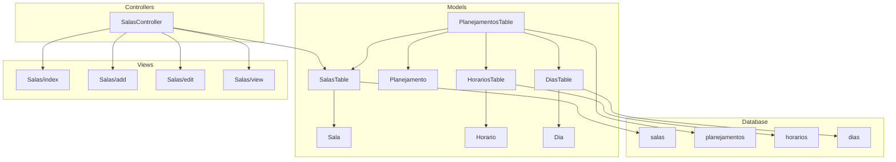
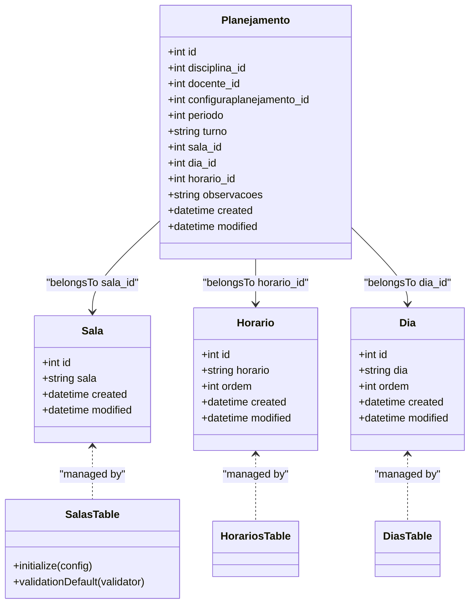
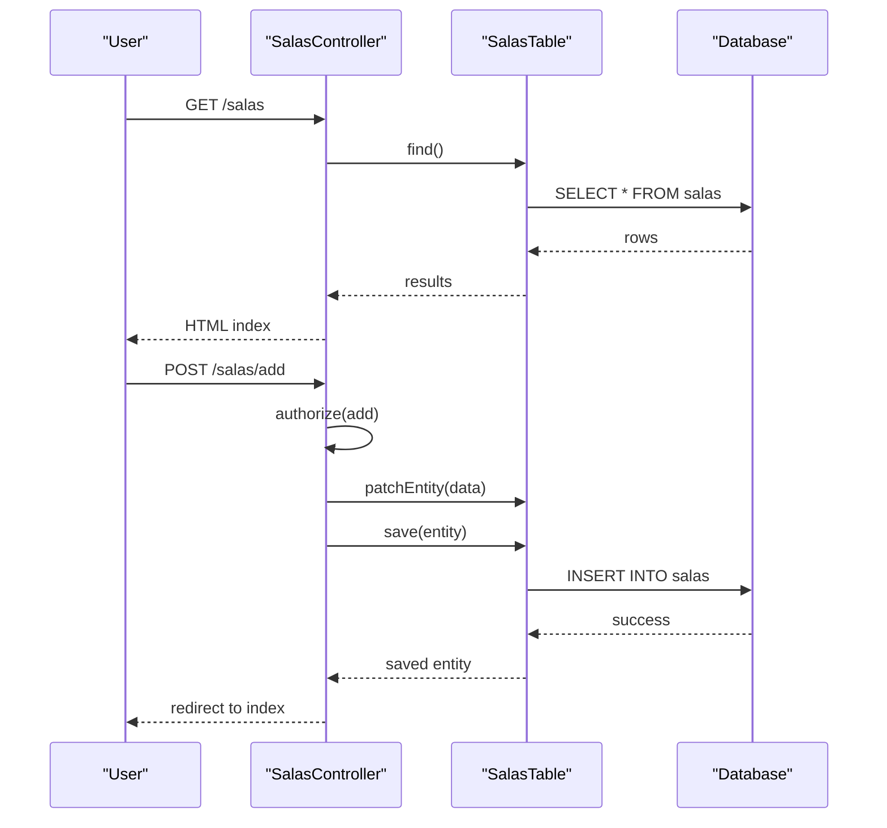
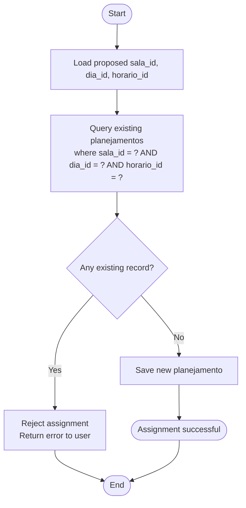
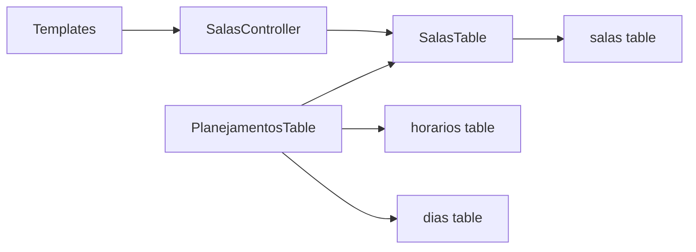

# Classroom Resource Management

<cite>
**Referenced Files in This Document**
- [SalasController.php](file://src/Controller/SalasController.php)
- [SalasTable.php](file://src/Model/Table/SalasTable.php)
- [Sala.php](file://src/Model/Entity/Sala.php)
- [20260612030432_CreateSalas.php](file://config/Migrations/20260612030432_CreateSalas.php)
- [add.php](file://templates/Salas/add.php)
- [edit.php](file://templates/Salas/edit.php)
- [index.php](file://templates/Salas/index.php)
- [view.php](file://templates/Salas/view.php)
- [PlanejamentosTable.php](file://src/Model/Table/PlanejamentosTable.php)
- [Planejamento.php](file://src/Model/Entity/Planejamento.php)
- [HorariosTable.php](file://src/Model/Table/HorariosTable.php)
- [Horario.php](file://src/Model/Entity/Horario.php)
- [20260612030431_CreateHorarios.php](file://config/Migrations/20260612030431_CreateHorarios.php)
- [DiasTable.php](file://src/Model/Table/DiasTable.php)
- [Dia.php](file://src/Model/Entity/Dia.php)
- [20260612030430_CreateDias.php](file://config/Migrations/20260612030430_CreateDias.php)
</cite>

## Table of Contents
1. [Introduction](#introduction)
2. [Project Structure](#project-structure)
3. [Core Components](#core-components)
4. [Architecture Overview](#architecture-overview)
5. [Detailed Component Analysis](#detailed-component-analysis)
6. [Dependency Analysis](#dependency-analysis)
7. [Performance Considerations](#performance-considerations)
8. [Troubleshooting Guide](#troubleshooting-guide)
9. [Conclusion](#conclusion)
10. [Appendices](#appendices)

## Introduction
This document explains the classroom resource management functionality centered on the Sala (room) entity and its integration with the scheduling system. It covers the data model, CRUD operations, UI flows, and how room assignments are linked to schedules. It also provides guidance for extending the model to support capacity, equipment, availability constraints, conflict prevention, and utilization reporting.

## Project Structure
The classroom management feature follows a standard MVC pattern:
- Controller handles HTTP requests and authorization for rooms.
- Model layer includes Table classes for persistence and Entity classes for domain behavior.
- Migrations define database schema.
- Templates render forms and lists for room management.
- Scheduling entities link rooms to days, time slots, and course plans.

**Diagram sources**
- [SalasController.php](file://src/Controller/SalasController.php)
- [SalasTable.php](file://src/Model/Table/SalasTable.php)
- [Sala.php](file://src/Model/Entity/Sala.php)
- [PlanejamentosTable.php](file://src/Model/Table/PlanejamentosTable.php)
- [Planejamento.php](file://src/Model/Entity/Planejamento.php)
- [HorariosTable.php](file://src/Model/Table/HorariosTable.php)
- [Horario.php](file://src/Model/Entity/Horario.php)
- [DiasTable.php](file://src/Model/Table/DiasTable.php)
- [Dia.php](file://src/Model/Entity/Dia.php)
- [20260612030432_CreateSalas.php](file://config/Migrations/20260612030432_CreateSalas.php)
- [20260612030431_CreateHorarios.php](file://config/Migrations/20260612030431_CreateHorarios.php)
- [20260612030430_CreateDias.php](file://config/Migrations/20260612030430_CreateDias.php)
- [index.php](file://templates/Salas/index.php)
- [add.php](file://templates/Salas/add.php)
- [edit.php](file://templates/Salas/edit.php)
- [view.php](file://templates/Salas/view.php)

**Section sources**
- [SalasController.php](file://src/Controller/SalasController.php)
- [SalasTable.php](file://src/Model/Table/SalasTable.php)
- [Sala.php](file://src/Model/Entity/Sala.php)
- [20260612030432_CreateSalas.php](file://config/Migrations/20260612030432_CreateSalas.php)
- [index.php](file://templates/Salas/index.php)
- [add.php](file://templates/Salas/add.php)
- [edit.php](file://templates/Salas/edit.php)
- [view.php](file://templates/Salas/view.php)
- [PlanejamentosTable.php](file://src/Model/Table/PlanejamentosTable.php)
- [Planejamento.php](file://src/Model/Entity/Planejamento.php)
- [HorariosTable.php](file://src/Model/Table/HorariosTable.php)
- [Horario.php](file://src/Model/Entity/Horario.php)
- [DiasTable.php](file://src/Model/Table/DiasTable.php)
- [Dia.php](file://src/Model/Entity/Dia.php)
- [20260612030431_CreateHorarios.php](file://config/Migrations/20260612030431_CreateHorarios.php)
- [20260612030430_CreateDias.php](file://config/Migrations/20260612030430_CreateDias.php)

## Core Components
- Sala Entity: Represents a room record. The current entity exposes basic fields and timestamps.
- SalasTable: Configures table mapping, display field, primary key, timestamp behavior, and validation rules for the sala name.
- SalasController: Provides index, view, add, edit, delete actions; allows public access for listing and viewing; enforces authorization for write operations.
- Room templates: Provide list, detail, create, and update interfaces. They reference additional fields such as location, capacity, resources, and notes.
- Scheduling integration: PlanejamentosTable links rooms to schedules via sala_id and joins with days and time slots.

Key responsibilities:
- Data persistence and validation for rooms.
- Authorization and request handling for CRUD.
- Presentation of room information and editing capabilities.
- Association of rooms to schedule entries.

**Section sources**
- [Sala.php](file://src/Model/Entity/Sala.php)
- [SalasTable.php](file://src/Model/Table/SalasTable.php)
- [SalasController.php](file://src/Controller/SalasController.php)
- [index.php](file://templates/Salas/index.php)
- [add.php](file://templates/Salas/add.php)
- [edit.php](file://templates/Salas/edit.php)
- [view.php](file://templates/Salas/view.php)
- [PlanejamentosTable.php](file://src/Model/Table/PlanejamentosTable.php)

## Architecture Overview
The room management subsystem integrates with the scheduling module through foreign keys. A room can be assigned to a schedule entry that references a day and a time slot. This structure enables conflict checks by querying existing assignments for the same room, day, and time.

**Diagram sources**
- [Sala.php](file://src/Model/Entity/Sala.php)
- [SalasTable.php](file://src/Model/Table/SalasTable.php)
- [Planejamento.php](file://src/Model/Entity/Planejamento.php)
- [Horario.php](file://src/Model/Entity/Horario.php)
- [Dia.php](file://src/Model/Entity/Dia.php)
- [PlanejamentosTable.php](file://src/Model/Table/PlanejamentosTable.php)
- [HorariosTable.php](file://src/Model/Table/HorariosTable.php)
- [DiasTable.php](file://src/Model/Table/DiasTable.php)

## Detailed Component Analysis

### Sala Entity and Database Schema
- Entity fields: id, sala, created, modified.
- Mass assignment is enabled for sala and timestamps.
- Migration defines salas table with columns: sala (string), created (datetime), modified (datetime).
- Note: The UI templates reference additional fields (localizacao, lotacao, recursos, observacoes) which are not present in the current migration or entity. These should be added to the schema and entity to match the interface.

Recommendations:
- Add fields for location, capacity, resources, and observations to the salas table and entity.
- Update validation rules to enforce non-empty names and optional numeric capacity.

**Section sources**
- [Sala.php](file://src/Model/Entity/Sala.php)
- [20260612030432_CreateSalas.php](file://config/Migrations/20260612030432_CreateSalas.php)
- [add.php](file://templates/Salas/add.php)
- [edit.php](file://templates/Salas/edit.php)
- [view.php](file://templates/Salas/view.php)
- [index.php](file://templates/Salas/index.php)

### SalasTable Validation and Behavior
- Table configuration sets table name, display field, primary key, and Timestamp behavior.
- Default validation requires a scalar sala name with max length and presence on create.

Best practices:
- Add uniqueness validation for sala names if needed.
- Introduce numeric validation for capacity when the field is added.

**Section sources**
- [SalasTable.php](file://src/Model/Table/SalasTable.php)

### SalasController CRUD Operations
- Public access allowed for index and view.
- Authorization enforced for add, edit, delete.
- Actions:
  - index: paginates all rooms.
  - view: loads a single room.
  - add: creates new room from POST data.
  - edit: updates an existing room.
  - delete: removes a room after confirmation.

Operational flow example:

**Diagram sources**
- [SalasController.php](file://src/Controller/SalasController.php)
- [SalasTable.php](file://src/Model/Table/SalasTable.php)
- [20260612030432_CreateSalas.php](file://config/Migrations/20260612030432_CreateSalas.php)

**Section sources**
- [SalasController.php](file://src/Controller/SalasController.php)

### Scheduling Integration and Conflict Prevention
- PlanejamentosTable has belongsTo relationships with Salas, Horarios, and Dias.
- Foreign keys: sala_id, dia_id, horario_id.
- To prevent conflicts, before saving a schedule entry, query existing entries where sala_id, dia_id, and horario_id match the proposed values. If any exist, reject the assignment.

Conflict check algorithm:

Implementation guidance:
- Add a custom validation rule or a Table-level beforeSave callback in PlanejamentosTable to perform the conflict check.
- Return clear error messages indicating the conflicting room/day/time combination.

**Diagram sources**
- [PlanejamentosTable.php](file://src/Model/Table/PlanejamentosTable.php)
- [HorariosTable.php](file://src/Model/Table/HorariosTable.php)
- [Horario.php](file://src/Model/Entity/Horario.php)
- [DiasTable.php](file://src/Model/Table/DiasTable.php)
- [Dia.php](file://src/Model/Entity/Dia.php)

**Section sources**
- [PlanejamentosTable.php](file://src/Model/Table/PlanejamentosTable.php)
- [HorariosTable.php](file://src/Model/Table/HorariosTable.php)
- [Horario.php](file://src/Model/Entity/Horario.php)
- [DiasTable.php](file://src/Model/Table/DiasTable.php)
- [Dia.php](file://src/Model/Entity/Dia.php)

### UI Forms and Fields
- The add and edit templates include fields for sala, localizacao, lotacao, recursos, and observacoes.
- The index and view templates display these fields alongside pagination and action buttons.

Action items:
- Ensure the database schema and entity expose these fields to avoid runtime errors.
- Add appropriate labels and placeholders consistent with English localization if required.

**Section sources**
- [add.php](file://templates/Salas/add.php)
- [edit.php](file://templates/Salas/edit.php)
- [index.php](file://templates/Salas/index.php)
- [view.php](file://templates/Salas/view.php)

## Dependency Analysis
- SalasController depends on SalasTable for persistence and uses CakePHP’s authentication/authorization components.
- SalasTable depends on the salas table defined by the migration.
- PlanejamentosTable depends on Salas, Horarios, and Dias tables via foreign keys.
- Views depend on controller-provided variables and use CakePHP helpers for rendering.

**Diagram sources**
- [SalasController.php](file://src/Controller/SalasController.php)
- [SalasTable.php](file://src/Model/Table/SalasTable.php)
- [20260612030432_CreateSalas.php](file://config/Migrations/20260612030432_CreateSalas.php)
- [PlanejamentosTable.php](file://src/Model/Table/PlanejamentosTable.php)
- [20260612030431_CreateHorarios.php](file://config/Migrations/20260612030431_CreateHorarios.php)
- [20260612030430_CreateDias.php](file://config/Migrations/20260612030430_CreateDias.php)

**Section sources**
- [SalasController.php](file://src/Controller/SalasController.php)
- [SalasTable.php](file://src/Model/Table/SalasTable.php)
- [PlanejamentosTable.php](file://src/Model/Table/PlanejamentosTable.php)
- [20260612030432_CreateSalas.php](file://config/Migrations/20260612030432_CreateSalas.php)
- [20260612030431_CreateHorarios.php](file://config/Migrations/20260612030431_CreateHorarios.php)
- [20260612030430_CreateDias.php](file://config/Migrations/20260612030430_CreateDias.php)

## Performance Considerations
- Use indexed foreign keys (sala_id, dia_id, horario_id) in the planejamentos table to speed up conflict checks and queries.
- Paginate room listings to avoid loading large datasets into memory.
- Cache frequently accessed room metadata (e.g., capacity and resources) if read-heavy workloads are expected.
- Avoid N+1 queries when displaying room details; use contain or select specific fields.

[No sources needed since this section provides general guidance]

## Troubleshooting Guide
Common issues and resolutions:
- Missing fields in forms: If the UI references localizacao, lotacao, recursos, or observacoes but the database lacks them, migrations must be updated and re-run.
- Validation failures: Ensure sala names meet length and presence requirements; add numeric validation for capacity once the field exists.
- Authorization errors: Write operations require authorization; confirm policies allow add/edit/delete for authenticated users.
- Scheduling conflicts: Implement conflict checks in PlanejamentosTable to prevent double-booking the same room at the same day/time.

**Section sources**
- [SalasTable.php](file://src/Model/Table/SalasTable.php)
- [SalasController.php](file://src/Controller/SalasController.php)
- [PlanejamentosTable.php](file://src/Model/Table/PlanejamentosTable.php)

## Conclusion
The classroom resource management feature provides a solid foundation for managing rooms and linking them to schedules. To fully support capacity, equipment, and availability constraints, extend the salas schema and entity, implement robust validation, and add conflict prevention logic in the scheduling layer. With proper indexing and caching, the system can scale to handle larger datasets and frequent scheduling operations.

[No sources needed since this section summarizes without analyzing specific files]

## Appendices

### Best Practices for Room Categorization and Capacity Planning
- Categorize rooms by type (lecture hall, lab, seminar room) using a dedicated field or tag in the salas table.
- Maintain accurate capacity values to guide automated room selection during scheduling.
- Document equipment and special resources per room to filter suitable rooms for specific courses.
- Enforce minimum capacity constraints when assigning rooms to ensure adequate space for enrolled students.

[No sources needed since this section provides general guidance]