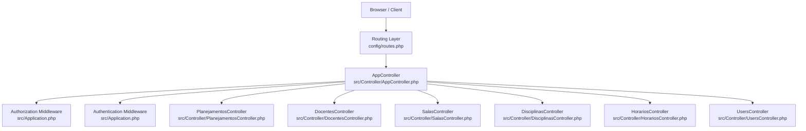
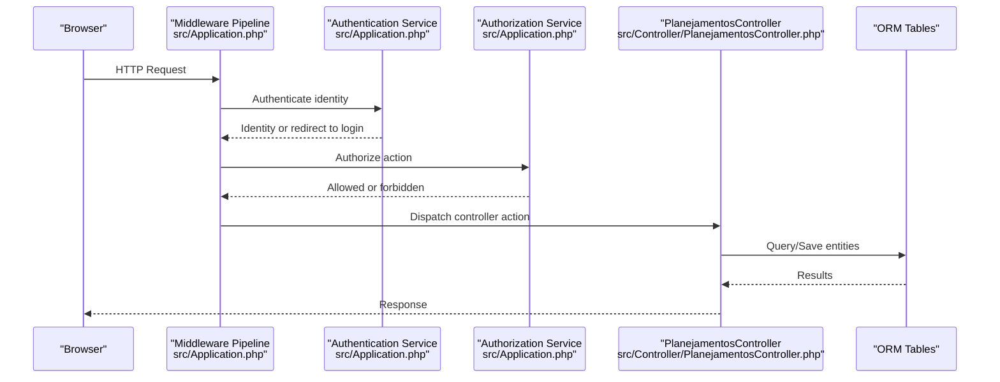
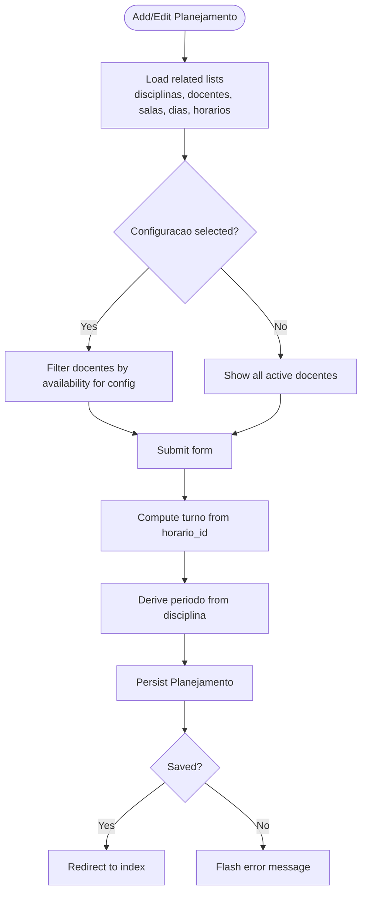
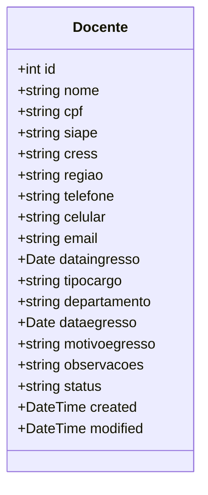
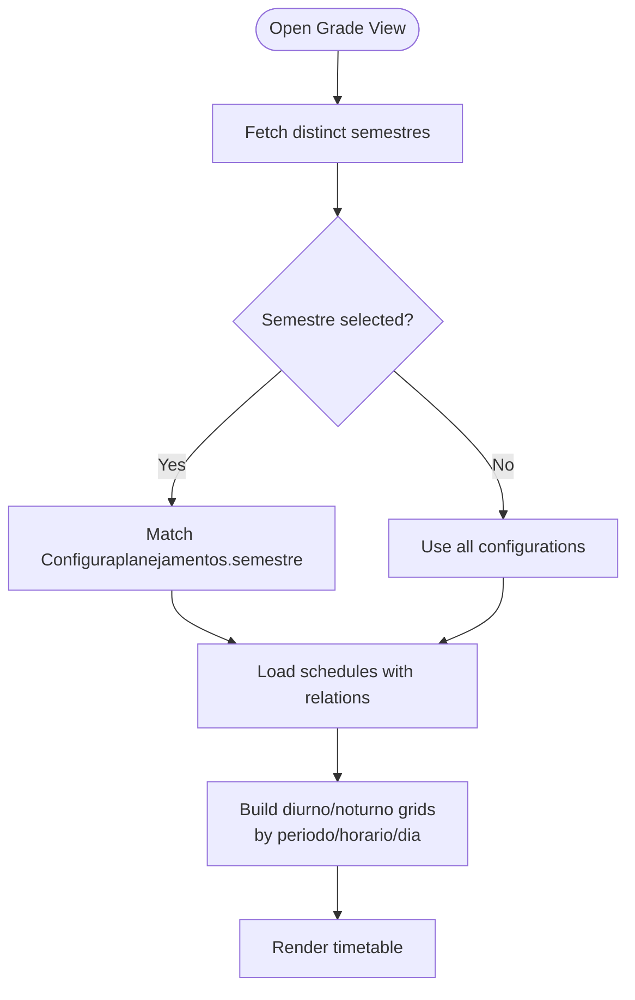
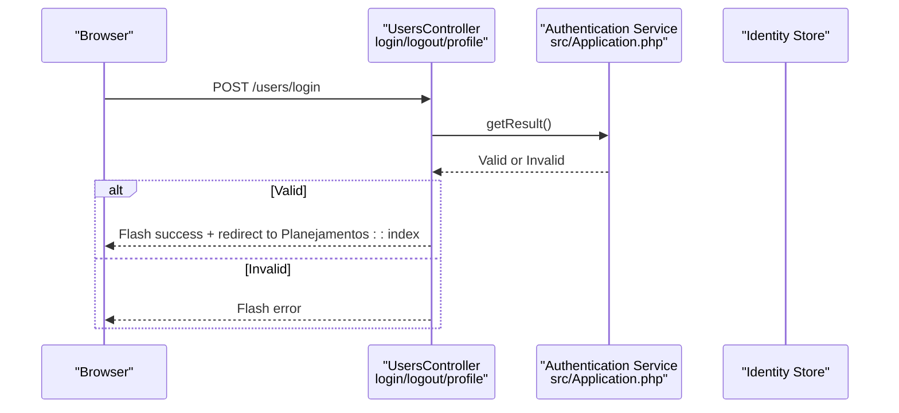
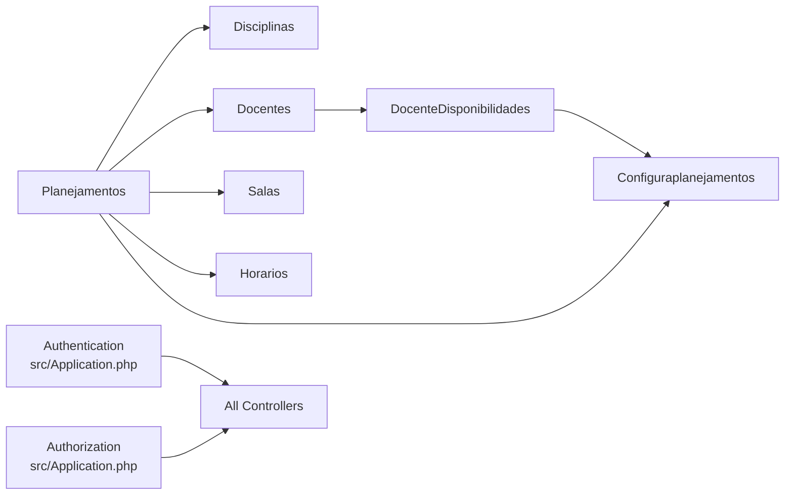

# Core Features Overview

<cite>
**Referenced Files in This Document**
- [Application.php](file://src/Application.php)
- [AppController.php](file://src/Controller/AppController.php)
- [routes.php](file://config/routes.php)
- [PlanejamentosController.php](file://src/Controller/PlanejamentosController.php)
- [DocentesController.php](file://src/Controller/DocentesController.php)
- [SalasController.php](file://src/Controller/SalasController.php)
- [DisciplinasController.php](file://src/Controller/DisciplinasController.php)
- [HorariosController.php](file://src/Controller/HorariosController.php)
- [UsersController.php](file://src/Controller/UsersController.php)
- [Planejamento.php](file://src/Model/Entity/Planejamento.php)
- [Docente.php](file://src/Model/Entity/Docente.php)
- [Sala.php](file://src/Model/Entity/Sala.php)
- [Disciplina.php](file://src/Model/Entity/Disciplina.php)
- [Horario.php](file://src/Model/Entity/Horario.php)
- [Usuarioplanejamento.php](file://src/Model/Entity/Usuarioplanejamento.php)
</cite>

## Table of Contents
1. Introduction
2. Project Structure
3. Core Components
4. Architecture Overview
5. Detailed Component Analysis
6. Dependency Analysis
7. Performance Considerations
8. Troubleshooting Guide
9. Conclusion

## Introduction
This document provides a comprehensive overview of the core features of planejamento5, a university scheduling system built on CakePHP 5. It explains how academic schedule management (planejamentos), faculty administration (docentes), classroom resource management (salas), course definitions (disciplinas), time slot scheduling (horarios), and user authentication work together to deliver complete scheduling capabilities. The system supports multi-semester planning via configuration entities and enforces role-based access control across all features.

## Project Structure
The application follows CakePHP conventions with controllers for each domain area, entity models defining data structures, and middleware handling security and authorization. Routes default to the academic schedule list view, while standard CRUD endpoints are available through fallback routing.

**Diagram sources**
- [routes.php:52-79](file://config/routes.php#L52-L79)
- [AppController.php:40-53](file://src/Controller/AppController.php#L40-L53)
- [Application.php:73-122](file://src/Application.php#L73-L122)
- [PlanejamentosController.php:1-20](file://src/Controller/PlanejamentosController.php#L1-L20)
- [DocentesController.php:1-20](file://src/Controller/DocentesController.php#L1-L20)
- [SalasController.php:1-20](file://src/Controller/SalasController.php#L1-L20)
- [DisciplinasController.php:1-20](file://src/Controller/DisciplinasController.php#L1-L20)
- [HorariosController.php:1-20](file://src/Controller/HorariosController.php#L1-L20)
- [UsersController.php:1-20](file://src/Controller/UsersController.php#L1-L20)

**Section sources**
- [routes.php:52-79](file://config/routes.php#L52-L79)
- [AppController.php:40-53](file://src/Controller/AppController.php#L40-L53)
- [Application.php:73-122](file://src/Application.php#L73-L122)

## Core Components
- Academic Schedule Management (Planejamentos): Create, edit, filter, and view scheduled sessions that link courses, professors, rooms, days, and time slots within a specific semester configuration. Supports filtering by semestre and auto-computing turno and periodo based on related entities.
- Faculty Administration (Docentes): Manage professor records with status normalization and availability per planning configuration. Provides filtering by department, status, and availability for a selected configuration.
- Classroom Resource Management (Salas): Maintain room inventory with full CRUD operations.
- Course Definitions (Disciplinas): Define courses with curriculum, workload, period constraints, and prerequisites. Includes a grade view that aggregates schedules into a timetable grid.
- Time Slot Scheduling (Horarios): Define ordered time slots used across schedules.
- User Authentication System: Session and form-based login using email/password against the Usuarioplanejamentos table, with password hashing and profile access.

Key workflows include creating a semester schedule by selecting a configuration (semestre), assigning a professor filtered by availability, choosing a room and day/time slot, and saving the schedule. The system also exposes public views for browsing schedules, classrooms, and courses.

**Section sources**
- [PlanejamentosController.php:17-127](file://src/Controller/PlanejamentosController.php#L17-L127)
- [DocentesController.php:34-171](file://src/Controller/DocentesController.php#L34-L171)
- [SalasController.php:32-97](file://src/Controller/SalasController.php#L32-L97)
- [DisciplinasController.php:20-171](file://src/Controller/DisciplinasController.php#L20-L171)
- [HorariosController.php:32-97](file://src/Controller/HorariosController.php#L32-L97)
- [UsersController.php:29-76](file://src/Controller/UsersController.php#L29-L76)

## Architecture Overview
The application uses CakePHP’s middleware pipeline to enforce host header validation, CSRF protection, body parsing, authentication, and authorization before requests reach controllers. Controllers coordinate business logic and delegate persistence to ORM tables. Entities define accessible fields and behaviors such as password hashing.

**Diagram sources**
- [Application.php:73-122](file://src/Application.php#L73-L122)
- [Application.php:124-162](file://src/Application.php#L124-L162)
- [PlanejamentosController.php:17-67](file://src/Controller/PlanejamentosController.php#L17-L67)

## Detailed Component Analysis

### Academic Schedule Management (Planejamentos)
Purpose:
- Model and manage academic sessions (planejamentos) linking disciplines, docentes, salas, dias, horarios, and a configuraplanejamento representing a semester version.
- Provide listing, viewing, adding, editing, and deleting of schedules.
- Support filtering by semestre and computing derived fields like turno and periodo.

Key workflows:
- Listing: Retrieve schedules with related entities; optionally filter by selected semestre.
- Adding/Editing: Validate inputs, compute turno from horario_id, derive periodo from disciplina attributes, persist changes, and flash feedback.
- Availability-aware selection: When a configuraplanejamento is selected, only docentes marked available for that configuration are shown.

Interdependencies:
- Disciplinas: Determines periodo constraints.
- Docentes: Filters by availability per configuration.
- Salas, Dias, Horarios: Provide resources and time slots.
- Configuraplanejamentos: Groups schedules by semester/version.

Typical scenario:
- Create a semester schedule: Select a semestre configuration, choose an available professor, pick a discipline, assign a room and day/time slot, then save.

**Diagram sources**
- [PlanejamentosController.php:83-127](file://src/Controller/PlanejamentosController.php#L83-L127)
- [PlanejamentosController.php:129-173](file://src/Controller/PlanejamentosController.php#L129-L173)
- [PlanejamentosController.php:209-254](file://src/Controller/PlanejamentosController.php#L209-L254)

**Section sources**
- [PlanejamentosController.php:17-127](file://src/Controller/PlanejamentosController.php#L17-L127)
- [PlanejamentosController.php:129-173](file://src/Controller/PlanejamentosController.php#L129-L173)
- [PlanejamentosController.php:209-254](file://src/Controller/PlanejamentosController.php#L209-L254)
- [Planejamento.php:11-26](file://src/Model/Entity/Planejamento.php#L11-L26)

### Faculty Administration (Docentes)
Purpose:
- Maintain professor records with normalized statuses and availability per planning configuration.
- Provide filtering by department, canonicalized status, and availability for a selected configuration.

Key workflows:
- Listing: Build filters for status, department, and availability; present dropdowns populated from distinct values.
- Status normalization: Map aliases to canonical labels for consistent UI and queries.
- Availability integration: Display availability state for the active or selected configuration.

Typical scenario:
- Assign professors to courses: Filter docentes by availability for a given semestre configuration, then select them when creating a schedule.

**Diagram sources**
- [Docente.php:30-56](file://src/Model/Entity/Docente.php#L30-L56)

**Section sources**
- [DocentesController.php:34-171](file://src/Controller/DocentesController.php#L34-L171)
- [Docente.php:30-56](file://src/Model/Entity/Docente.php#L30-L56)

### Classroom Resource Management (Salas)
Purpose:
- Manage classroom inventory with full CRUD operations.
- Publicly list and view rooms; authenticated users can add/edit/delete.

Typical scenario:
- Manage classroom availability: Add new rooms, update details, and ensure they are available for assignment in schedules.

**Section sources**
- [SalasController.php:32-97](file://src/Controller/SalasController.php#L32-L97)
- [Sala.php:16-28](file://src/Model/Entity/Sala.php#L16-L28)

### Course Definitions (Disciplinas)
Purpose:
- Define courses with curriculum, workload, period constraints, and optional notes.
- Provide filtering by curriculum and period options; expose a grade view aggregating schedules into a timetable grid.

Key workflows:
- Listing: Apply combinable filters for curriculo and periods; render dropdowns for quick filtering.
- Grade view: Aggregate planejamentos by semestre, organize into diurno/noturno grids keyed by periodo/horario/dia.

Typical scenario:
- Create a semester schedule: Choose a disciplina with appropriate period constraints; the system derives periodo automatically during schedule creation.

**Diagram sources**
- [DisciplinasController.php:73-171](file://src/Controller/DisciplinasController.php#L73-L171)

**Section sources**
- [DisciplinasController.php:20-171](file://src/Controller/DisciplinasController.php#L20-L171)
- [Disciplina.php:26-48](file://src/Model/Entity/Disciplina.php#L26-L48)

### Time Slot Scheduling (Horarios)
Purpose:
- Define ordered time slots used across schedules.
- Provide public listing and viewing; authenticated users can manage entries.

Typical scenario:
- Manage time slots: Add morning and afternoon/evening slots with ordering to support schedule construction.

**Section sources**
- [HorariosController.php:32-97](file://src/Controller/HorariosController.php#L32-L97)
- [Horario.php:17-30](file://src/Model/Entity/Horario.php#L17-L30)

### User Authentication System
Purpose:
- Provide session and form-based authentication using email/password against the Usuarioplanejamentos table.
- Enforce redirects for unauthenticated access and handle logout/profile actions.

Key workflows:
- Login: Attempt authentication; on success, redirect to the schedule index; on failure, show error.
- Logout: Clear session and redirect.
- Profile: Access current user information if authenticated.

Security:
- Passwords are hashed upon setting.
- Middleware enforces authentication and authorization policies.

**Diagram sources**
- [UsersController.php:29-76](file://src/Controller/UsersController.php#L29-L76)
- [Application.php:124-155](file://src/Application.php#L124-L155)

**Section sources**
- [UsersController.php:29-76](file://src/Controller/UsersController.php#L29-L76)
- [Usuarioplanejamento.php:12-37](file://src/Model/Entity/Usuarioplanejamento.php#L12-L37)
- [Application.php:124-155](file://src/Application.php#L124-L155)

## Dependency Analysis
High-level dependencies among core components:
- Planejamentos depends on Disciplinas, Docentes, Salas, Dias, Horarios, and Configuraplanejamentos.
- Docentes integrates with availability records tied to Configuraplanejamentos.
- Disciplinas drives period constraints used by Planejamentos.
- Horarios defines ordered slots referenced by Planejamentos.
- Authentication and Authorization middleware protect all controllers.

**Diagram sources**
- [PlanejamentosController.php:17-67](file://src/Controller/PlanejamentosController.php#L17-L67)
- [DocentesController.php:34-171](file://src/Controller/DocentesController.php#L34-L171)
- [Application.php:73-122](file://src/Application.php#L73-L122)

**Section sources**
- [PlanejamentosController.php:17-67](file://src/Controller/PlanejamentosController.php#L17-L67)
- [DocentesController.php:34-171](file://src/Controller/DocentesController.php#L34-L171)
- [Application.php:73-122](file://src/Application.php#L73-L122)

## Performance Considerations
- Pagination: Controllers use pagination for large datasets (e.g., Planejamentos, Docentes). Ensure indexes on frequently filtered columns (semestre, status, departamento, curriculo).
- Eager loading: Contain statements load related entities efficiently; avoid unnecessary contains in high-traffic paths.
- Filtering: Prefer server-side filtering via query parameters to reduce payload size.
- Grade view aggregation: Building grids involves grouping and iteration; consider caching aggregated results per semestre if needed.

[No sources needed since this section provides general guidance]

## Troubleshooting Guide
Common issues and resolutions:
- Unauthenticated access: If redirected to login, verify credentials and ensure the correct authenticator is configured. Check middleware order and unauthenticated actions.
- Forbidden errors: Authorization may deny actions; review policy enforcement and required roles.
- Missing related data: Ensure related entities exist (e.g., disciplina, docente, sala, dia, horario) before creating a schedule.
- Status normalization: For docentes, ensure status values map to canonical forms to display correctly in filters.

Operational checks:
- Verify routes point to expected controllers and actions.
- Confirm password hashing is applied for new users.
- Review flash messages for user-facing feedback on failures.

**Section sources**
- [Application.php:73-122](file://src/Application.php#L73-L122)
- [AppController.php:40-53](file://src/Controller/AppController.php#L40-L53)
- [UsersController.php:29-76](file://src/Controller/UsersController.php#L29-L76)
- [Usuarioplanejamento.php:30-37](file://src/Model/Entity/Usuarioplanejamento.php#L30-L37)

## Conclusion
planejamento5 delivers a robust university scheduling platform centered around academic schedules (planejamentos) that integrate courses (disciplinas), professors (docentes), rooms (salas), and time slots (horarios) under multi-semester configurations. Role-based access control and secure authentication ensure safe operation, while clear workflows enable typical tasks such as creating semester schedules, assigning professors, and managing classroom availability. The architecture leverages CakePHP’s middleware, routing, and ORM patterns for maintainability and scalability.