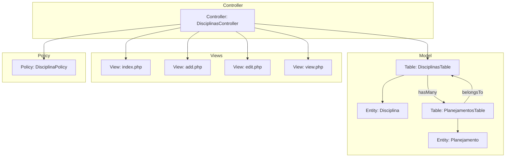
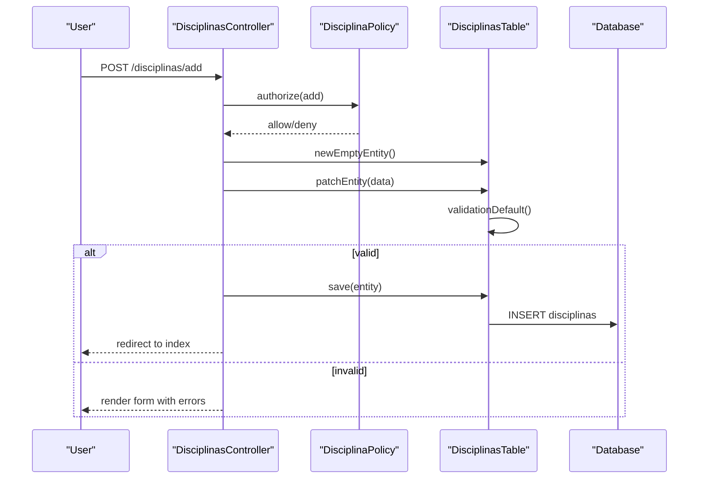
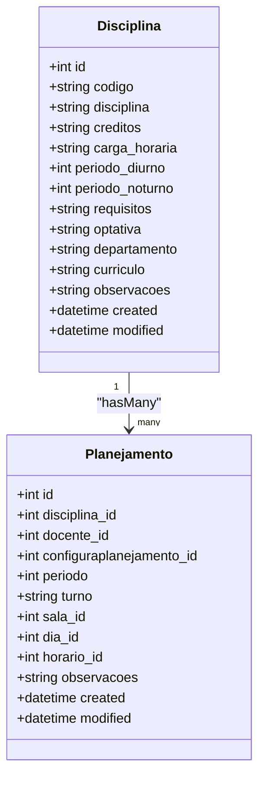
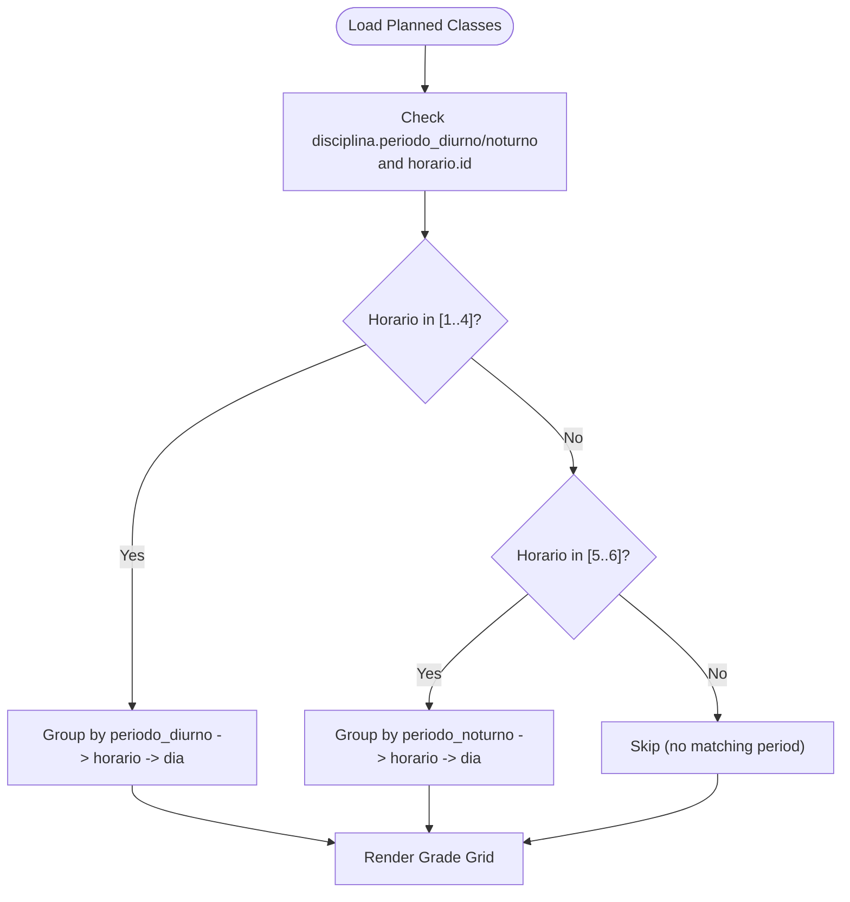
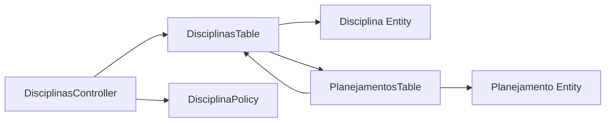

# Course Definitions and Properties

<cite>
**Referenced Files in This Document**
- [Disciplina.php](file://src/Model/Entity/Disciplina.php)
- [DisciplinasTable.php](file://src/Model/Table/DisciplinasTable.php)
- [DisciplinasController.php](file://src/Controller/DisciplinasController.php)
- [add.php](file://templates/Disciplinas/add.php)
- [edit.php](file://templates/Disciplinas/edit.php)
- [index.php](file://templates/Disciplinas/index.php)
- [view.php](file://templates/Disciplinas/view.php)
- [DisciplinaPolicy.php](file://src/Policy/DisciplinaPolicy.php)
- [PlanejamentosTable.php](file://src/Model/Table/PlanejamentosTable.php)
- [Planejamento.php](file://src/Model/Entity/Planejamento.php)
- [20260618004511_AddCurriculoToDisciplinas.php](file://config/Migrations/20260618004511_AddCurriculoToDisciplinas.php)
</cite>

## Table of Contents
1. [Introduction](#introduction)
2. [Project Structure](#project-structure)
3. [Core Components](#core-components)
4. [Architecture Overview](#architecture-overview)
5. [Detailed Component Analysis](#detailed-component-analysis)
6. [Dependency Analysis](#dependency-analysis)
7. [Performance Considerations](#performance-considerations)
8. [Troubleshooting Guide](#troubleshooting-guide)
9. [Conclusion](#conclusion)

## Introduction
This document explains how course definitions (Disciplina) are modeled, validated, and managed within the application. It covers all course properties, validation rules, business constraints, UI forms, controller actions, and integration with the scheduling system. It also provides guidance on creating courses via the user interface and outlines how course attributes influence scheduling behavior.

## Project Structure
Course management is implemented using a standard MVC pattern:
- Entity defines the data shape and accessibility
- Table defines persistence configuration, relationships, and validation
- Controller handles HTTP requests, authorization, and orchestration
- Templates render forms and lists for users
- Policy enforces role-based permissions
- Scheduling entities link courses to concrete class instances

**Diagram sources**
- [Disciplina.php:1-49](file://src/Model/Entity/Disciplina.php#L1-L49)
- [DisciplinasTable.php:1-85](file://src/Model/Table/DisciplinasTable.php#L1-L85)
- [DisciplinasController.php:1-231](file://src/Controller/DisciplinasController.php#L1-L231)
- [add.php:1-27](file://templates/Disciplinas/add.php#L1-L27)
- [edit.php:1-27](file://templates/Disciplinas/edit.php#L1-L27)
- [index.php:1-132](file://templates/Disciplinas/index.php#L1-L132)
- [view.php:1-65](file://templates/Disciplinas/view.php#L1-L65)
- [DisciplinaPolicy.php:1-36](file://src/Policy/DisciplinaPolicy.php#L1-L36)
- [PlanejamentosTable.php:1-57](file://src/Model/Table/PlanejamentosTable.php#L1-L57)
- [Planejamento.php:1-27](file://src/Model/Entity/Planejamento.php#L1-L27)

**Section sources**
- [Disciplina.php:1-49](file://src/Model/Entity/Disciplina.php#L1-L49)
- [DisciplinasTable.php:1-85](file://src/Model/Table/DisciplinasTable.php#L1-L85)
- [DisciplinasController.php:1-231](file://src/Controller/DisciplinasController.php#L1-L231)
- [add.php:1-27](file://templates/Disciplinas/add.php#L1-L27)
- [edit.php:1-27](file://templates/Disciplinas/edit.php#L1-L27)
- [index.php:1-132](file://templates/Disciplinas/index.php#L1-L132)
- [view.php:1-65](file://templates/Disciplinas/view.php#L1-L65)
- [DisciplinaPolicy.php:1-36](file://src/Policy/DisciplinaPolicy.php#L1-L36)
- [PlanejamentosTable.php:1-57](file://src/Model/Table/PlanejamentosTable.php#L1-L57)
- [Planejamento.php:1-27](file://src/Model/Entity/Planejamento.php#L1-L27)

## Core Components
- Disciplina entity: Declares all course fields and mass-assignment access.
- DisciplinasTable: Configures table mapping, timestamps, relationship to scheduling entries, and field-level validation.
- DisciplinasController: Provides CRUD endpoints, filtering, and grade listing; integrates authorization checks.
- Views: Provide forms for adding/editing courses, list with filters, and detail view.
- Policy: Role-based permissions for add/edit/delete operations.
- Scheduling integration: Courses are linked to planning entries that bind them to days, times, rooms, and academic periods.

Key responsibilities:
- Data integrity through validation rules
- Business constraints enforced by allowed values and presence requirements
- User-facing workflows for course creation and editing
- Integration points with scheduling via foreign keys and period mappings

**Section sources**
- [Disciplina.php:1-49](file://src/Model/Entity/Disciplina.php#L1-L49)
- [DisciplinasTable.php:1-85](file://src/Model/Table/DisciplinasTable.php#L1-L85)
- [DisciplinasController.php:1-231](file://src/Controller/DisciplinasController.php#L1-L231)
- [add.php:1-27](file://templates/Disciplinas/add.php#L1-L27)
- [edit.php:1-27](file://templates/Disciplinas/edit.php#L1-L27)
- [index.php:1-132](file://templates/Disciplinas/index.php#L1-L132)
- [view.php:1-65](file://templates/Disciplinas/view.php#L1-L65)
- [DisciplinaPolicy.php:1-36](file://src/Policy/DisciplinaPolicy.php#L1-L36)
- [PlanejamentosTable.php:1-57](file://src/Model/Table/PlanejamentosTable.php#L1-L57)
- [Planejamento.php:1-27](file://src/Model/Entity/Planejamento.php#L1-L27)

## Architecture Overview
The course definition subsystem follows CakePHP conventions:
- Requests hit DisciplinasController methods
- Authorization is checked via DisciplinaPolicy
- Data is persisted through DisciplinasTable, which validates input and manages relationships
- Views render forms and listings
- Scheduling uses PlanejamentosTable to associate a course with concrete time slots and resources

**Diagram sources**
- [DisciplinasController.php:180-195](file://src/Controller/DisciplinasController.php#L180-L195)
- [DisciplinaPolicy.php:21-24](file://src/Policy/DisciplinaPolicy.php#L21-L24)
- [DisciplinasTable.php:29-83](file://src/Model/Table/DisciplinasTable.php#L29-L83)

## Detailed Component Analysis

### Disciplina Entity and Fields
The Disciplina entity models a course with the following fields:
- id: integer primary key
- codigo: string, required on create, max length 50
- disciplina: string, required on create, max length 200
- creditos: optional integer-like value
- carga_horaria: optional scalar (e.g., hours string)
- periodo_diurno: integer from 1..8
- periodo_noturno: integer from 1..10
- requisitos: optional text describing prerequisites
- optativa: boolean flag indicating elective status
- departamento: optional department label
- curriculo: optional curriculum code, max length 4
- observacoes: optional free-form observations
- created, modified: timestamps

Validation and constraints summary:
- Presence and non-empty for codigo and disciplina on create
- Length limits for codigo and disciplina
- Allowed ranges for daytime and nighttime periods
- Boolean interpretation for optativa
- Optional fields can be empty on create or update depending on context

Data types and storage:
- Most fields are strings or integers
- Timestamps are handled by the Timestamp behavior
- The curriculo column was added via migration with a 4-character limit

**Section sources**
- [Disciplina.php:1-49](file://src/Model/Entity/Disciplina.php#L1-L49)
- [DisciplinasTable.php:29-83](file://src/Model/Table/DisciplinasTable.php#L29-L83)
- [20260618004511_AddCurriculoToDisciplinas.php:16-25](file://config/Migrations/20260618004511_AddCurriculoToDisciplinas.php#L16-L25)

### Validation Rules and Business Logic
Field-level validations include:
- codigo: scalar, required on create, not empty, max 50
- disciplina: scalar, required on create, not empty, max 200
- creditos: integer type allowed but empty permitted
- carga_horaria: scalar allowed, empty permitted
- periodo_diurno: integer restricted to 1..8
- periodo_noturno: integer restricted to 1..10
- requisitos: scalar allowed, empty permitted
- optativa: boolean conversion with message hint
- departamento: scalar allowed, empty permitted on create
- curriculo: scalar, max 4, empty permitted
- observacoes: scalar allowed, empty permitted on create

Business logic implications:
- Period codes map to scheduling windows used by the grade view
- Optativa indicates elective vs mandatory classification
- Prerequisites are stored as free text and may be referenced during planning

**Section sources**
- [DisciplinasTable.php:29-83](file://src/Model/Table/DisciplinasTable.php#L29-L83)

### UI Forms and Workflows
- Add form: Presents fields for codigo, disciplina, creditos, carga_horaria, periodo_diurno, periodo_noturno, requisitos, optativa, departamento (dropdown), curriculo, and observacoes (textarea).
- Edit form: Same fields as add for updating existing courses.
- Index page: Lists courses with sorting and filters for curriculo, periodo_diurno, and periodo_noturno. Includes links to edit and delete.
- View page: Displays all course details including credits, workload, periods, prerequisites, elective status, department, curriculum, and observations.

Form submission flow:
- Submitting the add/edit form posts to the controller
- Controller authorizes the action
- Controller patches entity and validates via table
- On success, redirects to index or view; otherwise re-renders form with errors

**Section sources**
- [add.php:1-27](file://templates/Disciplinas/add.php#L1-L27)
- [edit.php:1-27](file://templates/Disciplinas/edit.php#L1-L27)
- [index.php:1-132](file://templates/Disciplinas/index.php#L1-L132)
- [view.php:1-65](file://templates/Disciplinas/view.php#L1-L65)
- [DisciplinasController.php:180-214](file://src/Controller/DisciplinasController.php#L180-L214)

### API Endpoints and Access Control
Exposed routes (by convention):
- GET /disciplinas: List courses with optional query filters (curriculo, periodo_diurno, periodo_noturno)
- GET /disciplinas/view/{id}: View a single course
- GET /disciplinas/add: Render add form
- POST /disciplinas: Create a new course
- GET /disciplinas/edit/{id}: Render edit form
- PATCH/POST/PUT /disciplinas/{id}: Update a course
- DELETE /disciplinas/{id}: Delete a course (POST/DELETE method allowed)

Authorization:
- Index and view are public
- Add, edit require roles admin or editor
- Delete requires role admin

Filtering behavior:
- Filters are combinable and applied via WHERE clauses
- Dropdown options for periods are fixed ranges

**Section sources**
- [DisciplinasController.php:14-71](file://src/Controller/DisciplinasController.php#L14-L71)
- [DisciplinasController.php:180-229](file://src/Controller/DisciplinasController.php#L180-L229)
- [DisciplinaPolicy.php:11-34](file://src/Policy/DisciplinaPolicy.php#L11-L34)

### Relationship to Scheduling System
Courses integrate with scheduling through the Planejamento entity:
- A course (Disciplina) has many planning entries (Planejamentos)
- Each planning entry binds a course to a teacher, room, day, time slot, and academic period
- The grade view groups scheduled classes by course period codes and time slots

Integration highlights:
- Foreign key discipline_id connects Planejamento to Disciplina
- Day and time identifiers (dia_id, horario_id) determine placement
- Period codes (periodo_diurno, periodo_noturno) influence grouping in the grade view

**Diagram sources**
- [Disciplina.php:1-49](file://src/Model/Entity/Disciplina.php#L1-L49)
- [Planejamento.php:1-27](file://src/Model/Entity/Planejamento.php#L1-L27)
- [DisciplinasTable.php:24-27](file://src/Model/Table/DisciplinasTable.php#L24-L27)
- [PlanejamentosTable.php:19-22](file://src/Model/Table/PlanejamentosTable.php#L19-L22)

### Creating New Courses via UI
Steps:
- Navigate to the Disciplinas index page
- Click “New Course” (Nova Disciplina)
- Fill required fields: codigo and disciplina
- Optionally set creditos, carga_horaria, periods, department, curriculum, and observations
- Submit the form
- On success, you are redirected to the course list; on error, the form shows validation messages

Example scenarios:
- Mandatory course: Leave optativa unset or false; define periodo_diurno or periodo_noturno as applicable
- Elective course: Set optativa to true; still define periods if it will be scheduled
- Prerequisites: Use requisitos to describe required prior courses (free text)

**Section sources**
- [index.php:23-26](file://templates/Disciplinas/index.php#L23-L26)
- [add.php:1-27](file://templates/Disciplinas/add.php#L1-L27)
- [DisciplinasController.php:180-195](file://src/Controller/DisciplinasController.php#L180-L195)

### Defining Different Types of Courses
- Mandatory vs elective: Controlled by optativa; affects downstream reporting and possibly scheduling preferences
- Department assignment: Use departamento to categorize courses administratively
- Curriculum linkage: Use curriculo to associate courses with specific program curricula (max 4 characters)

Best practices:
- Keep codigo concise and unique per institution standards
- Use disciplina for a clear, human-readable title
- Populate periodo_diurno and/or periodo_noturno only when the course is intended to be scheduled in those periods

**Section sources**
- [DisciplinasTable.php:65-76](file://src/Model/Table/DisciplinasTable.php#L65-L76)
- [view.php:40-50](file://templates/Disciplinas/view.php#L40-L50)

### Setting Up Course Prerequisites
Prerequisites are captured in requisitos as free text. While there is no automated enforcement at the model level, this field supports:
- Manual verification during planning
- Student advising workflows
- Potential future enhancements for prerequisite checking

Recommendation:
- Maintain consistent notation in requisitos (e.g., “Requires: ABC123”)
- Reference course codes consistently to aid readability and future automation

**Section sources**
- [DisciplinasTable.php:61-63](file://src/Model/Table/DisciplinasTable.php#L61-L63)
- [view.php:35-38](file://templates/Disciplinas/view.php#L35-L38)

### Course Properties and Scheduling Integration
How course properties affect scheduling:
- periodo_diurno and periodo_noturno determine which time blocks a course can appear in the grade view
- The grade view groups planned sessions by these period codes and time slots
- Planning entries must reference valid days and times; the course’s period codes guide where they can be placed

Grade view behavior:
- Daytime slots (horario IDs 1–4) are grouped by periodo_diurno
- Nighttime slots (horario IDs 5–6) are grouped by periodo_noturno

**Diagram sources**
- [DisciplinasController.php:125-132](file://src/Controller/DisciplinasController.php#L125-L132)

**Section sources**
- [DisciplinasController.php:73-171](file://src/Controller/DisciplinasController.php#L73-L171)
- [PlanejamentosTable.php:19-39](file://src/Model/Table/PlanejamentosTable.php#L19-L39)

## Dependency Analysis
Component coupling and cohesion:
- DisciplinasController depends on DisciplinasTable and DisciplinaPolicy
- DisciplinasTable depends on Disciplina entity and defines a hasMany relationship to Planejamentos
- PlanejamentosTable defines belongsTo relationships back to Disciplinas and other scheduling entities
- Views depend on controller-provided variables and use CakePHP Form helpers

External dependencies:
- Database schema changes via migrations (e.g., curriculo column addition)
- Authentication and Authorization plugins for policy enforcement

Potential circular dependencies:
- None observed; relationships are one-directional at the ORM level (hasMany/belongsTo)

**Diagram sources**
- [DisciplinasController.php:1-231](file://src/Controller/DisciplinasController.php#L1-L231)
- [DisciplinasTable.php:1-85](file://src/Model/Table/DisciplinasTable.php#L1-L85)
- [PlanejamentosTable.php:1-57](file://src/Model/Table/PlanejamentosTable.php#L1-L57)
- [Disciplina.php:1-49](file://src/Model/Entity/Disciplina.php#L1-L49)
- [Planejamento.php:1-27](file://src/Model/Entity/Planejamento.php#L1-L27)

**Section sources**
- [DisciplinasController.php:1-231](file://src/Controller/DisciplinasController.php#L1-L231)
- [DisciplinasTable.php:1-85](file://src/Model/Table/DisciplinasTable.php#L1-L85)
- [PlanejamentosTable.php:1-57](file://src/Model/Table/PlanejamentosTable.php#L1-L57)
- [Disciplina.php:1-49](file://src/Model/Entity/Disciplina.php#L1-L49)
- [Planejamento.php:1-27](file://src/Model/Entity/Planejamento.php#L1-L27)

## Performance Considerations
- Filtering on index uses simple WHERE conditions; ensure database indexes exist on frequently filtered columns (e.g., curriculo, periodo_diurno, periodo_noturno) if datasets grow large.
- Avoid unnecessary contains in heavy list queries; current implementation selects only needed fields for filtering.
- Pagination is used for the index listing to prevent large result sets.

[No sources needed since this section provides general guidance]

## Troubleshooting Guide
Common issues and resolutions:
- Validation errors on submit: Check required fields (codigo, disciplina) and allowed ranges for periods. Review form error messages rendered by the framework.
- Unauthorized actions: Ensure your role is admin or editor for add/edit; admin for delete.
- Missing curriculo display: Confirm the migration has been run to add the curriculo column.
- Grade view missing entries: Verify that the course has periodo_diurno or periodo_noturno set and that planning entries reference valid horario IDs.

Where to look:
- Controller save/error handling paths
- Table validation rules
- Policy permission checks
- Migration history for schema changes

**Section sources**
- [DisciplinasController.php:180-214](file://src/Controller/DisciplinasController.php#L180-L214)
- [DisciplinasTable.php:29-83](file://src/Model/Table/DisciplinasTable.php#L29-L83)
- [DisciplinaPolicy.php:21-34](file://src/Policy/DisciplinaPolicy.php#L21-L34)
- [20260618004511_AddCurriculoToDisciplinas.php:16-25](file://config/Migrations/20260618004511_AddCurriculoToDisciplinas.php#L16-L25)

## Conclusion
The Disciplina entity provides a robust foundation for defining courses with comprehensive metadata and validation. Through well-defined controller actions, views, and policies, users can create, edit, and manage courses effectively. Integration with the scheduling system ensures that course properties directly influence how classes are organized and displayed. Following the best practices outlined here will help maintain data quality and streamline scheduling workflows.