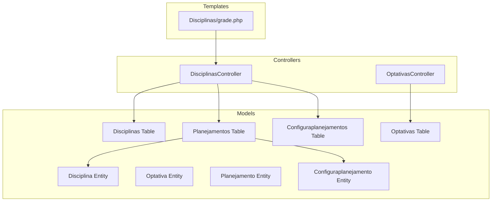
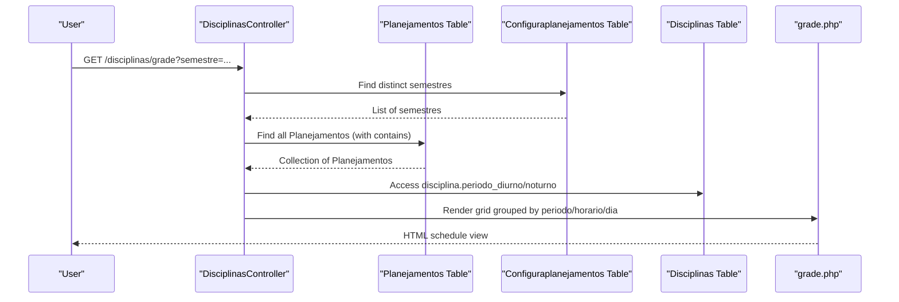
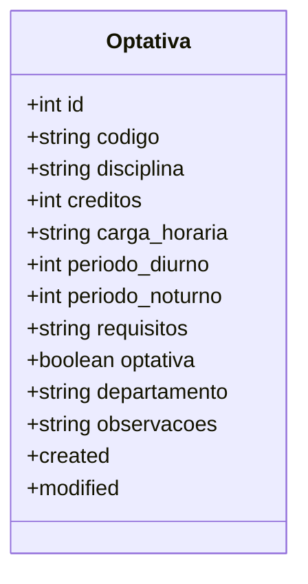
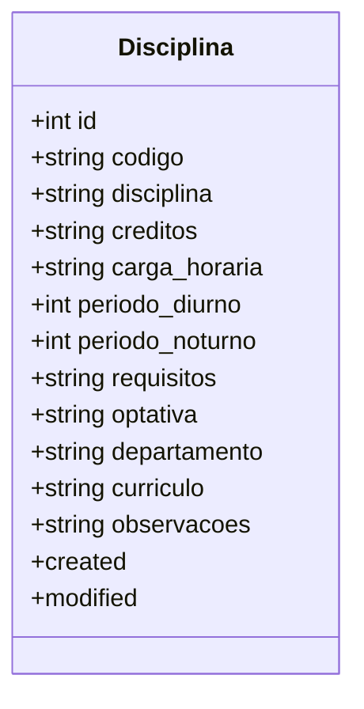
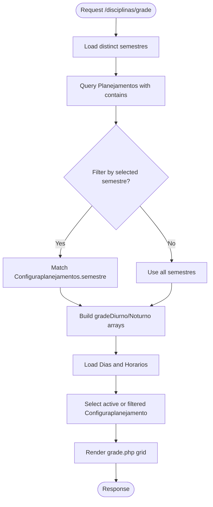
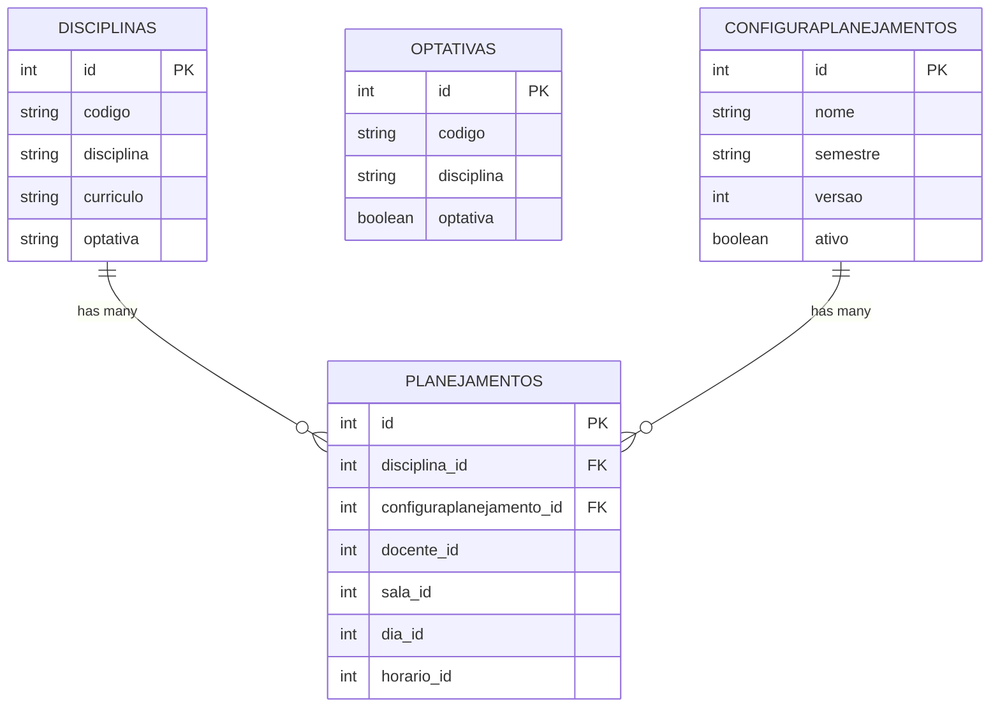

# Course Grading and Evaluation

<cite>
**Referenced Files in This Document**
- [Optativa.php](file://src/Model/Entity/Optativa.php)
- [OptativasTable.php](file://src/Model/Table/OptativasTable.php)
- [OptativasController.php](file://src/Controller/OptativasController.php)
- [Disciplina.php](file://src/Model/Entity/Disciplina.php)
- [DisciplinasTable.php](file://src/Model/Table/DisciplinasTable.php)
- [DisciplinasController.php](file://src/Controller/DisciplinasController.php)
- [grade.php](file://templates/Disciplinas/grade.php)
- [Planejamento.php](file://src/Model/Entity/Planejamento.php)
- [PlanejamentosTable.php](file://src/Model/Table/PlanejamentosTable.php)
- [Configuraplanejamento.php](file://src/Model/Entity/Configuraplanejamento.php)
- [ConfiguraplanejamentosTable.php](file://src/Model/Table/ConfiguraplanejamentosTable.php)
- [AddCurriculoToDisciplinas.php](file://config/Migrations/20260618004511_AddCurriculoToDisciplinas.php)
</cite>

## Table of Contents
1. [Introduction](#introduction)
2. [Project Structure](#project-structure)
3. [Core Components](#core-components)
4. [Architecture Overview](#architecture-overview)
5. [Detailed Component Analysis](#detailed-component-analysis)
6. [Dependency Analysis](#dependency-analysis)
7. [Performance Considerations](#performance-considerations)
8. [Troubleshooting Guide](#troubleshooting-guide)
9. [Conclusion](#conclusion)
10. [Appendices](#appendices)

## Introduction
This document explains the course grading and evaluation system with a focus on how optional/elective courses are modeled and integrated into the curriculum, and how scheduling and planning data support academic reporting. The system models:
- Courses (Disciplinas), including an elective flag and curriculum linkage
- Optional/elective catalog entries (Optativas)
- Planning records (Planejamentos) that bind courses to time slots, instructors, rooms, and planning configurations
- Planning configurations (Configuraplanejamentos) that represent semesters and versions

The current implementation provides robust scheduling and curriculum views. It does not include explicit grade scales, evaluation criteria, or assessment methods; those features would need to be added to extend the model and UI.

## Project Structure
The application follows CakePHP conventions with MVC layers:
- Controllers handle HTTP requests and orchestrate data access
- Models (Entities and Tables) define domain objects, validation, and relationships
- Templates render user interfaces for listing, viewing, and editing entities
- Migrations evolve the database schema

**Diagram sources**
- [DisciplinasController.php:1-231](file://src/Controller/DisciplinasController.php#L1-L231)
- [OptativasController.php:1-74](file://src/Controller/OptativasController.php#L1-L74)
- [DisciplinasTable.php:1-85](file://src/Model/Table/DisciplinasTable.php#L1-L85)
- [OptativasTable.php:1-37](file://src/Model/Table/OptativasTable.php#L1-L37)
- [PlanejamentosTable.php:1-57](file://src/Model/Table/PlanejamentosTable.php#L1-L57)
- [ConfiguraplanejamentosTable.php:1-61](file://src/Model/Table/ConfiguraplanejamentosTable.php#L1-L61)
- [grade.php:1-129](file://templates/Disciplinas/grade.php#L1-L129)

**Section sources**
- [DisciplinasController.php:1-231](file://src/Controller/DisciplinasController.php#L1-L231)
- [OptativasController.php:1-74](file://src/Controller/OptativasController.php#L1-L74)
- [DisciplinasTable.php:1-85](file://src/Model/Table/DisciplinasTable.php#L1-L85)
- [OptativasTable.php:1-37](file://src/Model/Table/OptativasTable.php#L1-L37)
- [PlanejamentosTable.php:1-57](file://src/Model/Table/PlanejamentosTable.php#L1-L57)
- [ConfiguraplanejamentosTable.php:1-61](file://src/Model/Table/ConfiguraplanejamentosTable.php#L1-L61)
- [grade.php:1-129](file://templates/Disciplinas/grade.php#L1-L129)

## Core Components
- Optativa entity and table: Represent optional/elective courses with attributes such as code, name, credits, workload, day/night periods, prerequisites, department, and notes. Validation ensures required fields and appropriate types.
- Disciplina entity and table: Represent core courses with similar attributes plus a curriculum identifier and an elective flag used to mark whether a course is optional.
- Planejamento entity and table: Represent scheduled teaching instances linking a course to a teacher, room, day/time slot, and a planning configuration (semester/version).
- Configuraplanejamento entity and table: Represent planning configurations identified by semester and version, with an active flag.

These components together enable curriculum management and scheduling. They do not currently implement grade scales, evaluation criteria, or assessment methods.

**Section sources**
- [Optativa.php:1-41](file://src/Model/Entity/Optativa.php#L1-L41)
- [OptativasTable.php:1-37](file://src/Model/Table/OptativasTable.php#L1-L37)
- [Disciplina.php:1-49](file://src/Model/Entity/Disciplina.php#L1-L49)
- [DisciplinasTable.php:1-85](file://src/Model/Table/DisciplinasTable.php#L1-L85)
- [Planejamento.php:1-27](file://src/Model/Entity/Planejamento.php#L1-L27)
- [PlanejamentosTable.php:1-57](file://src/Model/Table/PlanejamentosTable.php#L1-L57)
- [Configuraplanejamento.php:1-23](file://src/Model/Entity/Configuraplanejamento.php#L1-L23)
- [ConfiguraplanejamentosTable.php:1-61](file://src/Model/Table/ConfiguraplanejamentosTable.php#L1-L61)

## Architecture Overview
The system exposes controllers for managing disciplines and optativas, and a schedule view that aggregates planning data across days and time slots. The grade view organizes planned sessions by period and shift, enabling administrators to see where each course is taught.

**Diagram sources**
- [DisciplinasController.php:73-171](file://src/Controller/DisciplinasController.php#L73-L171)
- [grade.php:1-129](file://templates/Disciplinas/grade.php#L1-L129)
- [PlanejamentosTable.php:1-57](file://src/Model/Table/PlanejamentosTable.php#L1-L57)
- [ConfiguraplanejamentosTable.php:1-61](file://src/Model/Table/ConfiguraplanejamentosTable.php#L1-L61)
- [DisciplinasTable.php:1-85](file://src/Model/Table/DisciplinasTable.php#L1-L85)

## Detailed Component Analysis

### Optativa Entity and Role in Curriculum
The Optativa entity captures metadata for optional/elective courses. It includes fields for code, discipline name, credits, workload, day/night periods, prerequisites, department, and notes. The associated table enforces presence and length constraints and marks timestamps automatically.

Key responsibilities:
- Maintain a catalog of optional/elective offerings
- Provide basic metadata for scheduling and reporting
- Support administrative CRUD operations via its controller

Integration points:
- While there is no direct ORM relationship between Optativa and Disciplinas in the current tables, both share similar attributes and can be coordinated at the business layer when building reports or curriculum matrices.

**Section sources**
- [Optativa.php:1-41](file://src/Model/Entity/Optativa.php#L1-L41)
- [OptativasTable.php:1-37](file://src/Model/Table/OptativasTable.php#L1-L37)
- [OptativasController.php:1-74](file://src/Controller/OptativasController.php#L1-L74)

#### Class Diagram: Optativa

**Diagram sources**
- [Optativa.php:1-41](file://src/Model/Entity/Optativa.php#L1-L41)

### Disciplina Entity and Elective Flag
The Disciplina entity represents courses within the curriculum. It includes an elective flag and a curriculum identifier, allowing filtering and grouping by program. A migration adds the curriculo field to support curriculum-based organization.

Key responsibilities:
- Define course metadata and curriculum membership
- Indicate if a course is optional/elective
- Link to scheduled offerings via Planejamento

Validation highlights:
- Required code and name
- Period ranges for day/night shifts
- Optional elective flag and curriculum code

**Section sources**
- [Disciplina.php:1-49](file://src/Model/Entity/Disciplina.php#L1-L49)
- [DisciplinasTable.php:1-85](file://src/Model/Table/DisciplinasTable.php#L1-L85)
- [AddCurriculoToDisciplinas.php:1-27](file://config/Migrations/20260618004511_AddCurriculoToDisciplinas.php#L1-L27)

#### Class Diagram: Disciplina

**Diagram sources**
- [Disciplina.php:1-49](file://src/Model/Entity/Disciplina.php#L1-L49)

### Planejamento and Scheduling Grid
Planejamento binds a course to a teacher, room, day/time slot, and a planning configuration. The DisciplinasController’s grade action aggregates these records into a grid organized by period and shift, rendering them in templates.

Processing logic:
- Load available semestres from Configuraplanejamentos
- Fetch Planejamentos with related Disciplinas, Docentes, Salas, Dias, Horarios
- Group by periodo_diurno/noturno, horario, and dia
- Determine the active configuration for “add” links

**Diagram sources**
- [DisciplinasController.php:73-171](file://src/Controller/DisciplinasController.php#L73-L171)
- [grade.php:1-129](file://templates/Disciplinas/grade.php#L1-L129)
- [PlanejamentosTable.php:1-57](file://src/Model/Table/PlanejamentosTable.php#L1-L57)
- [ConfiguraplanejamentosTable.php:1-61](file://src/Model/Table/ConfiguraplanejamentosTable.php#L1-L61)

**Section sources**
- [DisciplinasController.php:73-171](file://src/Controller/DisciplinasController.php#L73-L171)
- [grade.php:1-129](file://templates/Disciplinas/grade.php#L1-L129)
- [PlanejamentosTable.php:1-57](file://src/Model/Table/PlanejamentosTable.php#L1-L57)
- [ConfiguraplanejamentosTable.php:1-61](file://src/Model/Table/ConfiguraplanejamentosTable.php#L1-L61)

### Configuraplanejamento (Planning Configuration)
Represents a planning instance defined by semester and version, with an active flag. It is linked to Planejamento records and DocenteDisponibilidades.

**Section sources**
- [Configuraplanejamento.php:1-23](file://src/Model/Entity/Configuraplanejamento.php#L1-L23)
- [ConfiguraplanejamentosTable.php:1-61](file://src/Model/Table/ConfiguraplanejamentosTable.php#L1-L61)

## Dependency Analysis
Relationships among key entities:
- Planejamento belongs to Disciplinas, Docentes, Configuraplanejamentos, Salas, Dias, Horarios
- Configuraplanejamentos has many Planejamentos and DocenteDisponibilidades
- Disciplinas has many Planejamentos

**Diagram sources**
- [DisciplinasTable.php:1-85](file://src/Model/Table/DisciplinasTable.php#L1-L85)
- [PlanejamentosTable.php:1-57](file://src/Model/Table/PlanejamentosTable.php#L1-L57)
- [ConfiguraplanejamentosTable.php:1-61](file://src/Model/Table/ConfiguraplanejamentosTable.php#L1-L61)

**Section sources**
- [DisciplinasTable.php:1-85](file://src/Model/Table/DisciplinasTable.php#L1-L85)
- [PlanejamentosTable.php:1-57](file://src/Model/Table/PlanejamentosTable.php#L1-L57)
- [ConfiguraplanejamentosTable.php:1-61](file://src/Model/Table/ConfiguraplanejamentosTable.php#L1-L61)

## Performance Considerations
- Use pagination for large lists (already applied in controllers).
- Prefer contains/associations to reduce N+1 queries when rendering grids.
- Cache frequently accessed reference data (e.g., Dias, Horarios) if needed.
- Avoid heavy client-side processing; keep grouping logic server-side as implemented.

[No sources needed since this section provides general guidance]

## Troubleshooting Guide
Common issues and checks:
- Missing associations: Ensure foreign keys exist for Planejamento references (disciplina_id, configuraplanejamento_id, etc.).
- Empty schedule cells: Verify that horarios and dias are correctly assigned and that periodo values match expected ranges.
- Active configuration selection: Confirm that the active Configuraplanejamento is set when generating “add” links.

Operational tips:
- Validate request parameters before saving entities.
- Inspect flash messages for success/failure feedback after create/update/delete actions.

**Section sources**
- [OptativasController.php:29-73](file://src/Controller/OptativasController.php#L29-L73)
- [DisciplinasController.php:180-229](file://src/Controller/DisciplinasController.php#L180-L229)

## Conclusion
The system provides strong foundations for curriculum and scheduling management, including clear modeling of optional/elective courses and their integration into planned schedules. Grade scales, evaluation criteria, and assessment methods are not present in the current codebase and would require additional entities, validations, and UI to implement. The existing architecture supports extending these areas while maintaining consistency with the established MVC patterns.

[No sources needed since this section summarizes without analyzing specific files]

## Appendices

### How Electives Integrate With the Curriculum
- Elective status is indicated by the optativa field in Disciplina and separately tracked in Optativas.
- The curriculo field enables grouping courses by program, facilitating elective selection rules at the curriculum level.

**Section sources**
- [Disciplina.php:1-49](file://src/Model/Entity/Disciplina.php#L1-L49)
- [DisciplinasTable.php:1-85](file://src/Model/Table/DisciplinasTable.php#L1-L85)
- [AddCurriculoToDisciplinas.php:1-27](file://config/Migrations/20260618004511_AddCurriculoToDisciplinas.php#L1-L27)
- [Optativa.php:1-41](file://src/Model/Entity/Optativa.php#L1-L41)

### Setting Up Grading Schemes, Evaluation Weights, and Assessment Methods
Not implemented in the current codebase. To add these features, consider:
- New entities for grading schemes, evaluation criteria, and assessment methods
- Associations to Disciplinas and/or Planejamentos
- UI for configuring weights and methods per course or per term
- Report generation endpoints to compute final grades based on configured schemes

[No sources needed since this section proposes future work]

### Generating Grade Reports and Integrating With Student Records/Transcripts
Not implemented in the current codebase. Potential approach:
- Extend entities to store student enrollments and grades
- Implement report generation services using configured grading schemes
- Provide export endpoints (CSV/PDF) for transcripts and integrate with external student information systems

[No sources needed since this section proposes future work]