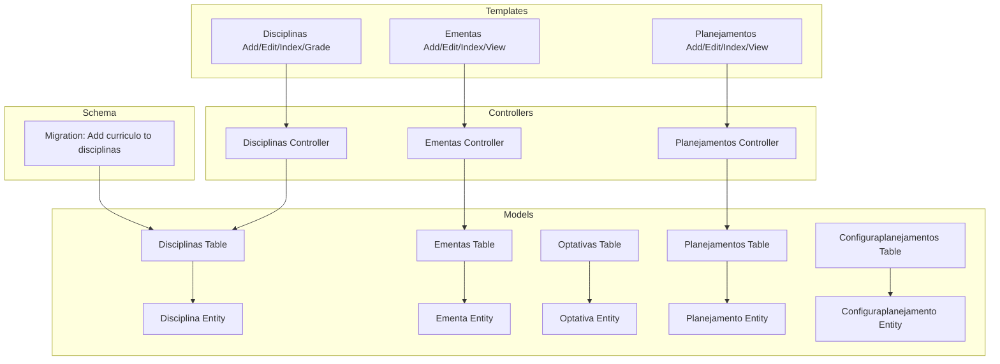
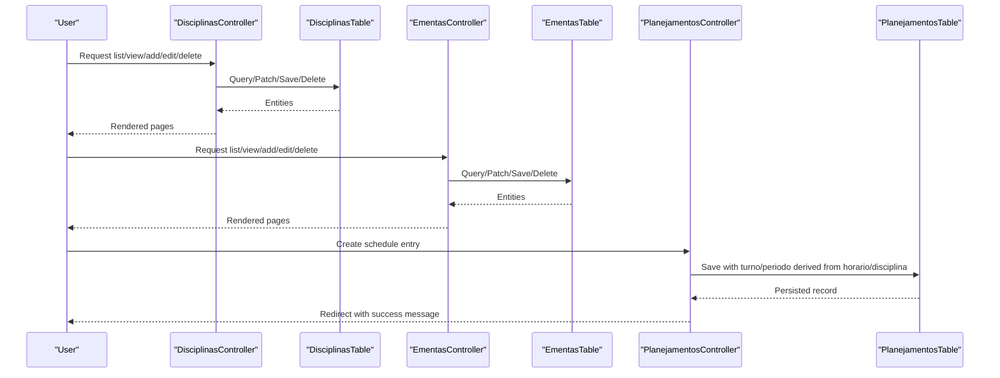
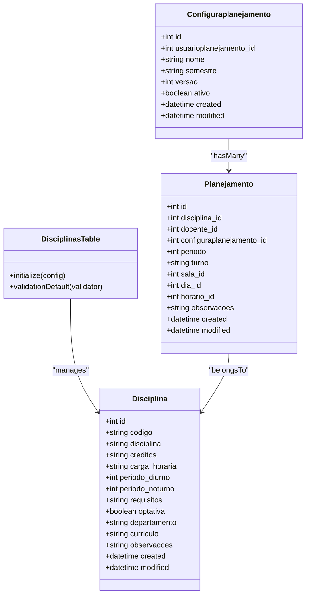
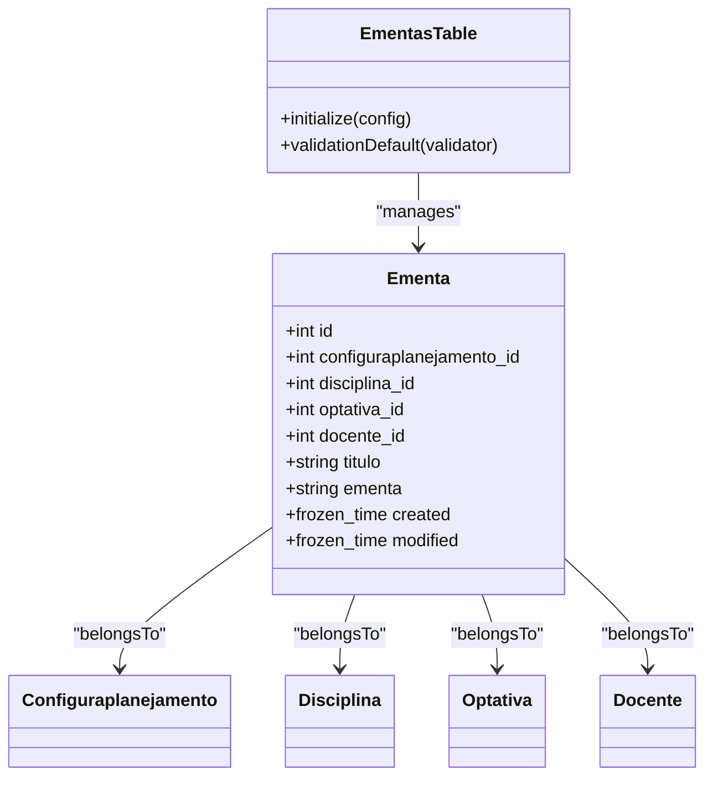
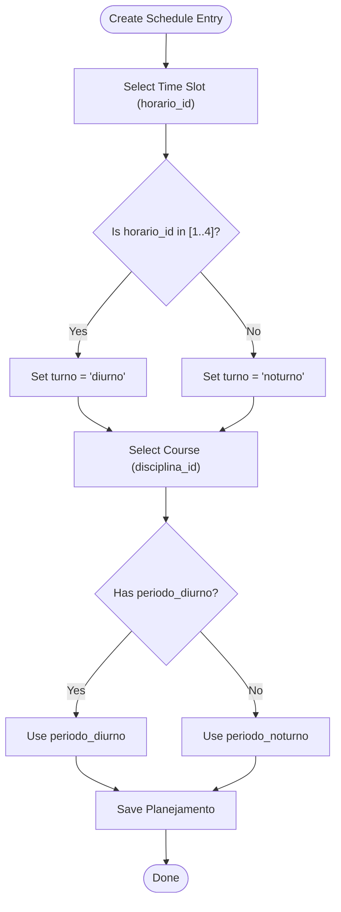
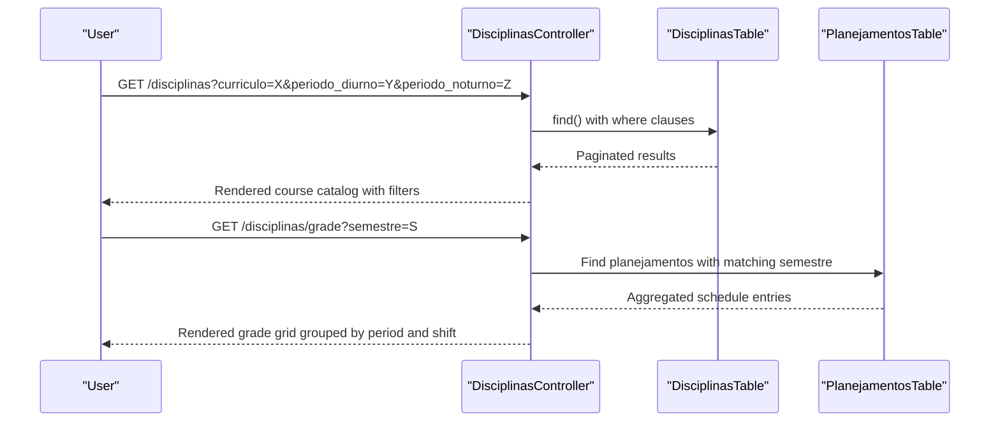
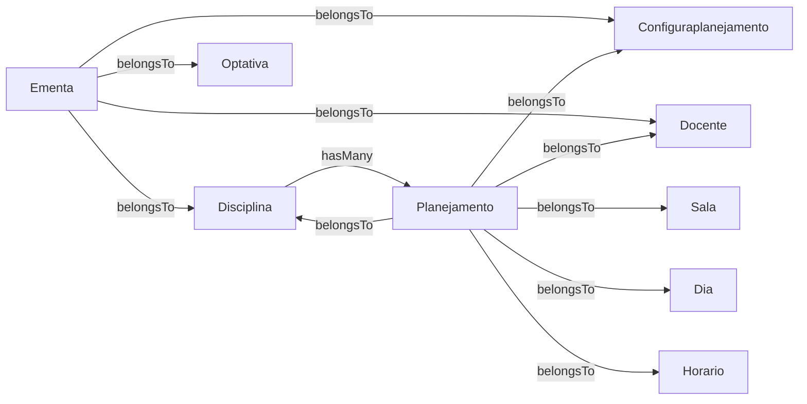

# Course and Curriculum Management

<cite>
**Referenced Files in This Document**
- [Disciplina.php](file://src/Model/Entity/Disciplina.php)
- [DisciplinasTable.php](file://src/Model/Table/DisciplinasTable.php)
- [Ementa.php](file://src/Model/Entity/Ementa.php)
- [EmentasTable.php](file://src/Model/Table/EmentasTable.php)
- [Optativa.php](file://src/Model/Entity/Optativa.php)
- [OptativasTable.php](file://src/Model/Table/OptativasTable.php)
- [Planejamento.php](file://src/Model/Entity/Planejamento.php)
- [PlanejamentosTable.php](file://src/Model/Table/PlanejamentosTable.php)
- [Configuraplanejamento.php](file://src/Model/Entity/Configuraplanejamento.php)
- [ConfiguraplanejamentosTable.php](file://src/Model/Table/ConfiguraplanejamentosTable.php)
- [DisciplinasController.php](file://src/Controller/DisciplinasController.php)
- [EmentasController.php](file://src/Controller/EmentasController.php)
- [PlanejamentosController.php](file://src/Controller/PlanejamentosController.php)
- [20260618004511_AddCurriculoToDisciplinas.php](file://config/Migrations/20260618004511_AddCurriculoToDisciplinas.php)
- [add.php (Disciplinas)](file://templates/Disciplinas/add.php)
- [index.php (Disciplinas)](file://templates/Disciplinas/index.php)
- [grade.php (Disciplinas)](file://templates/Disciplinas/grade.php)
- [add.php (Ementas)](file://templates/Ementas/add.php)
- [add.php (Planejamentos)](file://templates/Planejamentos/add.php)
</cite>

## Table of Contents
1. Introduction
2. Project Structure
3. Core Components
4. Architecture Overview
5. Detailed Component Analysis
6. Dependency Analysis
7. Performance Considerations
8. Troubleshooting Guide
9. Conclusion
10. Appendices

## Introduction
This document explains the course and curriculum management system with a focus on:
- The Disciplina entity structure, including course codes, names, credit hours, workload, period requirements for day and night shifts, prerequisites, optional status, department, curriculum code, and notes.
- The Ementa system for syllabus content management and its relationships to courses, instructors, and planning configurations.
- Grade tracking functionality via the academic schedule (grade) view that organizes offerings by period and shift.
- How course periods influence automatic period assignment when creating schedule entries.
- Examples of defining new courses, managing prerequisites, updating syllabus content, and generating course catalogs.
- The curriculum structure and how courses integrate with the broader academic planning system.

## Project Structure
The system follows a typical MVC architecture with CakePHP conventions:
- Models (Entities and Tables) define data structures, validation, and relationships.
- Controllers handle HTTP requests, orchestrate business logic, and prepare views.
- Templates render user interfaces for CRUD operations and reporting.
- Migrations manage database schema changes.

**Diagram sources**
- [Disciplina.php:1-49](file://src/Model/Entity/Disciplina.php#L1-L49)
- [DisciplinasTable.php:1-85](file://src/Model/Table/DisciplinasTable.php#L1-L85)
- [Ementa.php:1-34](file://src/Model/Entity/Ementa.php#L1-L34)
- [EmentasTable.php:1-55](file://src/Model/Table/EmentasTable.php#L1-L55)
- [Optativa.php:1-41](file://src/Model/Entity/Optativa.php#L1-L41)
- [OptativasTable.php:1-37](file://src/Model/Table/OptativasTable.php#L1-L37)
- [Planejamento.php:1-27](file://src/Model/Entity/Planejamento.php#L1-L27)
- [PlanejamentosTable.php:1-57](file://src/Model/Table/PlanejamentosTable.php#L1-L57)
- [Configuraplanejamento.php:1-23](file://src/Model/Entity/Configuraplanejamento.php#L1-L23)
- [ConfiguraplanejamentosTable.php:1-62](file://src/Model/Table/ConfiguraplanejamentosTable.php#L1-L62)
- [DisciplinasController.php:1-231](file://src/Controller/DisciplinasController.php#L1-L231)
- [EmentasController.php:1-102](file://src/Controller/EmentasController.php#L1-L102)
- [PlanejamentosController.php:134-160](file://src/Controller/PlanejamentosController.php#L134-L160)
- [20260618004511_AddCurriculoToDisciplinas.php:1-27](file://config/Migrations/20260618004511_AddCurriculoToDisciplinas.php#L1-L27)
- [add.php (Disciplinas):1-27](file://templates/Disciplinas/add.php#L1-L27)
- [index.php (Disciplinas):1-27](file://templates/Disciplinas/index.php#L1-L27)
- [grade.php (Disciplinas):93-128](file://templates/Disciplinas/grade.php#L93-L128)
- [add.php (Ementas):1-20](file://templates/Ementas/add.php#L1-L20)
- [add.php (Planejamentos):1-32](file://templates/Planejamentos/add.php#L1-L32)

**Section sources**
- [Disciplina.php:1-49](file://src/Model/Entity/Disciplina.php#L1-L49)
- [DisciplinasTable.php:1-85](file://src/Model/Table/DisciplinasTable.php#L1-L85)
- [Ementa.php:1-34](file://src/Model/Entity/Ementa.php#L1-L34)
- [EmentasTable.php:1-55](file://src/Model/Table/EmentasTable.php#L1-L55)
- [Optativa.php:1-41](file://src/Model/Entity/Optativa.php#L1-L41)
- [OptativasTable.php:1-37](file://src/Model/Table/OptativasTable.php#L1-L37)
- [Planejamento.php:1-27](file://src/Model/Entity/Planejamento.php#L1-L27)
- [PlanejamentosTable.php:1-57](file://src/Model/Table/PlanejamentosTable.php#L1-L57)
- [Configuraplanejamento.php:1-23](file://src/Model/Entity/Configuraplanejamento.php#L1-L23)
- [ConfiguraplanejamentosTable.php:1-62](file://src/Model/Table/ConfiguraplanejamentosTable.php#L1-L62)
- [DisciplinasController.php:1-231](file://src/Controller/DisciplinasController.php#L1-L231)
- [EmentasController.php:1-102](file://src/Controller/EmentasController.php#L1-L102)
- [PlanejamentosController.php:134-160](file://src/Controller/PlanejamentosController.php#L134-L160)
- [20260618004511_AddCurriculoToDisciplinas.php:1-27](file://config/Migrations/20260618004511_AddCurriculoToDisciplinas.php#L1-L27)
- [add.php (Disciplinas):1-27](file://templates/Disciplinas/add.php#L1-L27)
- [index.php (Disciplinas):1-27](file://templates/Disciplinas/index.php#L1-L27)
- [grade.php (Disciplinas):93-128](file://templates/Disciplinas/grade.php#L93-L128)
- [add.php (Ementas):1-20](file://templates/Ementas/add.php#L1-L20)
- [add.php (Planejamentos):1-32](file://templates/Planejamentos/add.php#L1-L32)

## Core Components
- Disciplina (Course): Represents a course with fields for code, name, credits, workload, allowed periods for day and night shifts, prerequisites, optional flag, department, curriculum code, and notes. Validation enforces presence and length constraints and restricts period values to defined ranges.
- Ementa (Syllabus): Stores syllabus title and content linked to a course or elective, an instructor, and a planning configuration (semester).
- Optativa (Elective): Similar to Disciplina but used for elective courses; includes similar attributes and validation.
- Planejamento (Schedule Entry): Links a course to an instructor, room, day, time slot, and planning configuration; also stores computed period and shift.
- Configuraplanejamento (Planning Configuration): Represents a semester/versioned planning instance.

Key behaviors:
- Timestamp behavior is applied to entities to track created/modified times.
- Relationships are declared in tables to support contains/contain queries across related entities.

**Section sources**
- [Disciplina.php:1-49](file://src/Model/Entity/Disciplina.php#L1-L49)
- [DisciplinasTable.php:1-85](file://src/Model/Table/DisciplinasTable.php#L1-L85)
- [Ementa.php:1-34](file://src/Model/Entity/Ementa.php#L1-L34)
- [EmentasTable.php:1-55](file://src/Model/Table/EmentasTable.php#L1-L55)
- [Optativa.php:1-41](file://src/Model/Entity/Optativa.php#L1-L41)
- [OptativasTable.php:1-37](file://src/Model/Table/OptativasTable.php#L1-L37)
- [Planejamento.php:1-27](file://src/Model/Entity/Planejamento.php#L1-L27)
- [PlanejamentosTable.php:1-57](file://src/Model/Table/PlanejamentosTable.php#L1-L57)
- [Configuraplanejamento.php:1-23](file://src/Model/Entity/Configuraplanejamento.php#L1-L23)
- [ConfiguraplanejamentosTable.php:1-62](file://src/Model/Table/ConfiguraplanejamentosTable.php#L1-L62)

## Architecture Overview
The system provides:
- Course catalog management (CRUD for Disciplina and Optativa).
- Syllabus management (CRUD for Ementa).
- Academic scheduling (CRUD for Planejamento) with automatic period assignment based on course period requirements.
- Grade view that aggregates scheduled courses into a grid organized by period and shift.

**Diagram sources**
- [DisciplinasController.php:1-231](file://src/Controller/DisciplinasController.php#L1-L231)
- [DisciplinasTable.php:1-85](file://src/Model/Table/DisciplinasTable.php#L1-L85)
- [EmentasController.php:1-102](file://src/Controller/EmentasController.php#L1-L102)
- [EmentasTable.php:1-55](file://src/Model/Table/EmentasTable.php#L1-L55)
- [PlanejamentosController.php:134-160](file://src/Controller/PlanejamentosController.php#L134-L160)
- [PlanejamentosTable.php:1-57](file://src/Model/Table/PlanejamentosTable.php#L1-L57)

## Detailed Component Analysis

### Disciplina (Course) Model and Validation
- Fields include code, name, credits, workload, period requirements for day and night shifts, prerequisites, optional flag, department, curriculum code, and notes.
- Validation ensures required fields, maximum lengths, integer checks, and allowed period ranges:
  - Day periods: 1–8
  - Night periods: 1–10
- A relationship to Planejamentos allows listing all schedule entries for a course.

**Diagram sources**
- [Disciplina.php:1-49](file://src/Model/Entity/Disciplina.php#L1-L49)
- [DisciplinasTable.php:1-85](file://src/Model/Table/DisciplinasTable.php#L1-L85)
- [Planejamento.php:1-27](file://src/Model/Entity/Planejamento.php#L1-L27)
- [Configuraplanejamento.php:1-23](file://src/Model/Entity/Configuraplanejamento.php#L1-L23)

**Section sources**
- [Disciplina.php:1-49](file://src/Model/Entity/Disciplina.php#L1-L49)
- [DisciplinasTable.php:1-85](file://src/Model/Table/DisciplinasTable.php#L1-L85)
- [Planejamento.php:1-27](file://src/Model/Entity/Planejamento.php#L1-L27)
- [Configuraplanejamento.php:1-23](file://src/Model/Entity/Configuraplanejamento.php#L1-L23)

### Ementa (Syllabus) System
- Stores syllabus title and content.
- Relationships allow linking to:
  - Planning configuration (semester/version)
  - Course (Disciplina)
  - Elective (Optativa)
  - Instructor (Docente)
- Controllers provide index, view, add, edit, delete actions with form dropdowns for related entities.

**Diagram sources**
- [Ementa.php:1-34](file://src/Model/Entity/Ementa.php#L1-L34)
- [EmentasTable.php:1-55](file://src/Model/Table/EmentasTable.php#L1-L55)
- [Configuraplanejamento.php:1-23](file://src/Model/Entity/Configuraplanejamento.php#L1-L23)
- [Disciplina.php:1-49](file://src/Model/Entity/Disciplina.php#L1-L49)
- [Optativa.php:1-41](file://src/Model/Entity/Optativa.php#L1-L41)

**Section sources**
- [Ementa.php:1-34](file://src/Model/Entity/Ementa.php#L1-L34)
- [EmentasTable.php:1-55](file://src/Model/Table/EmentasTable.php#L1-L55)
- [EmentasController.php:1-102](file://src/Controller/EmentasController.php#L1-L102)
- [add.php (Ementas):1-20](file://templates/Ementas/add.php#L1-L20)

### Grade Tracking and Period Assignment Logic
- The grade view aggregates scheduled offerings and groups them by period and shift:
  - Day shift uses horario IDs 1–4 and maps to the course’s periodo_diurno.
  - Night shift uses horario IDs 5–6 and maps to the course’s periodo_noturno.
- When creating a schedule entry, the controller automatically sets:
  - turno based on horario_id (day vs night).
  - periodo based on the selected course’s period requirement (prefers periodo_diurno if available, otherwise periodo_noturno).

**Diagram sources**
- [PlanejamentosController.php:134-160](file://src/Controller/PlanejamentosController.php#L134-L160)
- [DisciplinasController.php:125-132](file://src/Controller/DisciplinasController.php#L125-L132)

**Section sources**
- [DisciplinasController.php:125-132](file://src/Controller/DisciplinasController.php#L125-L132)
- [PlanejamentosController.php:134-160](file://src/Controller/PlanejamentosController.php#L134-L160)
- [grade.php (Disciplinas):93-128](file://templates/Disciplinas/grade.php#L93-L128)

### Curriculum Integration and Catalog Generation
- Courses can be associated with a curriculum code (curriculo), enabling filtering and grouping by curriculum.
- The course index supports filters by curriculum and by period requirements (day/night).
- The grade view can filter by semester (planning configuration) to generate a semester-specific catalog/grid.

**Diagram sources**
- [DisciplinasController.php:24-71](file://src/Controller/DisciplinasController.php#L24-L71)
- [DisciplinasController.php:73-171](file://src/Controller/DisciplinasController.php#L73-L171)
- [DisciplinasTable.php:1-85](file://src/Model/Table/DisciplinasTable.php#L1-L85)
- [PlanejamentosTable.php:1-57](file://src/Model/Table/PlanejamentosTable.php#L1-L57)

**Section sources**
- [DisciplinasController.php:24-71](file://src/Controller/DisciplinasController.php#L24-L71)
- [DisciplinasController.php:73-171](file://src/Controller/DisciplinasController.php#L73-L171)
- [index.php (Disciplinas):1-27](file://templates/Disciplinas/index.php#L1-L27)
- [grade.php (Disciplinas):93-128](file://templates/Disciplinas/grade.php#L93-L128)

### Practical Examples

- Defining a new course:
  - Use the course add form to set code, name, credits, workload, period requirements, prerequisites, optional flag, department, curriculum code, and notes.
  - The form fields map directly to entity properties.

  **Section sources**
  - [add.php (Disciplinas):1-27](file://templates/Disciplinas/add.php#L1-L27)
  - [DisciplinasTable.php:29-83](file://src/Model/Table/DisciplinasTable.php#L29-L83)

- Managing course prerequisites:
  - Prerequisites are stored as text in the course entity; they can be updated via the edit action.

  **Section sources**
  - [Disciplina.php:1-49](file://src/Model/Entity/Disciplina.php#L1-L49)
  - [DisciplinasController.php:197-214](file://src/Controller/DisciplinasController.php#L197-L214)

- Updating syllabus content:
  - Create or edit an Ementa record, selecting the relevant planning configuration, course/elective, and instructor, then save the title and content.

  **Section sources**
  - [EmentasController.php:41-87](file://src/Controller/EmentasController.php#L41-L87)
  - [add.php (Ementas):1-20](file://templates/Ementas/add.php#L1-L20)

- Generating course catalogs:
  - Filter courses by curriculum and period requirements using the course index page.
  - Generate a semester-specific grade grid by selecting a semester in the grade view.

  **Section sources**
  - [index.php (Disciplinas):1-27](file://templates/Disciplinas/index.php#L1-L27)
  - [DisciplinasController.php:24-71](file://src/Controller/DisciplinasController.php#L24-L71)
  - [grade.php (Disciplinas):93-128](file://templates/Disciplinas/grade.php#L93-L128)

- Automatic period assignment during schedule creation:
  - When saving a schedule entry, the system sets turno based on the chosen time slot and assigns periodo based on the selected course’s period requirement.

  **Section sources**
  - [PlanejamentosController.php:134-160](file://src/Controller/PlanejamentosController.php#L134-L160)
  - [add.php (Planejamentos):1-32](file://templates/Planejamentos/add.php#L1-L32)

## Dependency Analysis
- Disciplina has a one-to-many relationship with Planejamento, allowing retrieval of all schedule entries per course.
- Ementa belongs to multiple entities (planning configuration, course, elective, instructor), supporting flexible syllabus association.
- Planejamento belongs to Disciplina, Docente, Configuraplanejamento, Sala, Dia, and Horario, forming the core scheduling graph.
- Configuraplanejamento owns many Planejamentos and DocenteDisponibilidades, anchoring semester-based planning.

**Diagram sources**
- [DisciplinasTable.php:14-27](file://src/Model/Table/DisciplinasTable.php#L14-L27)
- [EmentasTable.php:11-34](file://src/Model/Table/EmentasTable.php#L11-L34)
- [PlanejamentosTable.php:11-40](file://src/Model/Table/PlanejamentosTable.php#L11-L40)
- [ConfiguraplanejamentosTable.php:11-31](file://src/Model/Table/ConfiguraplanejamentosTable.php#L11-L31)

**Section sources**
- [DisciplinasTable.php:14-27](file://src/Model/Table/DisciplinasTable.php#L14-L27)
- [EmentasTable.php:11-34](file://src/Model/Table/EmentasTable.php#L11-L34)
- [PlanejamentosTable.php:11-40](file://src/Model/Table/PlanejamentosTable.php#L11-L40)
- [ConfiguraplanejamentosTable.php:11-31](file://src/Model/Table/ConfiguraplanejamentosTable.php#L11-L31)

## Performance Considerations
- Use pagination for large lists (e.g., course index) to avoid loading entire datasets.
- Prefer contain/contains in queries to fetch only needed associations (e.g., grade view loads related entities efficiently).
- Keep validation rules minimal and targeted to reduce overhead during saves.
- Avoid unnecessary joins; use explicit foreign key lookups when appropriate.

[No sources needed since this section provides general guidance]

## Troubleshooting Guide
- Missing period assignment:
  - Ensure the selected course has either periodo_diurno or periodo_noturno set; otherwise, automatic assignment may fail.
- Incorrect turno mapping:
  - Verify horario_id selection aligns with expected shift (1–4 for day, 5–6 for night).
- Syllabus not linked:
  - Confirm that at least one of disciplina_id or optativa_id is provided when creating an Ementa.
- Filtering issues:
  - For curriculum or period filters, ensure query parameters match field names and valid ranges.

**Section sources**
- [PlanejamentosController.php:134-160](file://src/Controller/PlanejamentosController.php#L134-L160)
- [DisciplinasController.php:24-71](file://src/Controller/DisciplinasController.php#L24-L71)
- [EmentasController.php:41-87](file://src/Controller/EmentasController.php#L41-L87)

## Conclusion
The system provides robust tools for managing courses, syllabi, and academic schedules. The Disciplina model defines clear period requirements that drive automatic period assignment during scheduling. The Ementa system enables structured syllabus management tied to courses and instructors. The grade view offers a practical way to visualize and filter offerings by period and shift, while curriculum codes support catalog generation and organization.

[No sources needed since this section summarizes without analyzing specific files]

## Appendices

### Database Schema Notes
- Migration adds curriculo field to disciplinas table to support curriculum-based filtering and grouping.

**Section sources**
- [20260618004511_AddCurriculoToDisciplinas.php:1-27](file://config/Migrations/20260618004511_AddCurriculoToDisciplinas.php#L1-L27)