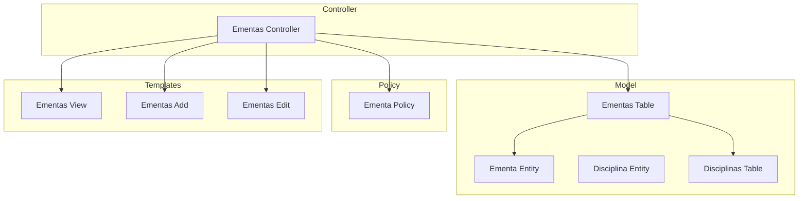
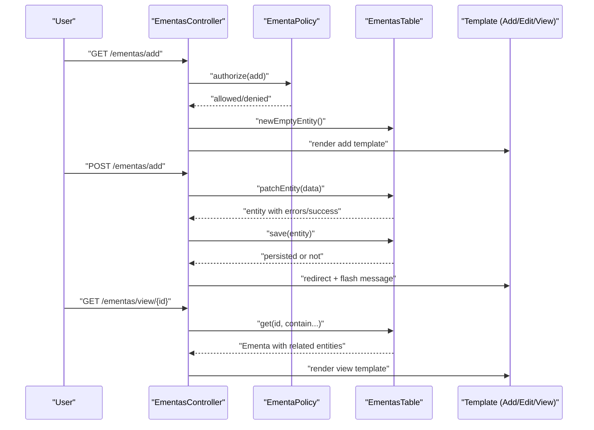
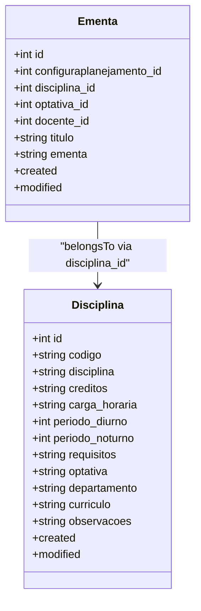
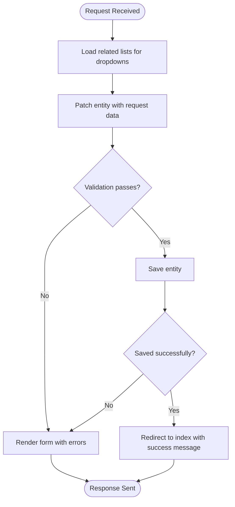
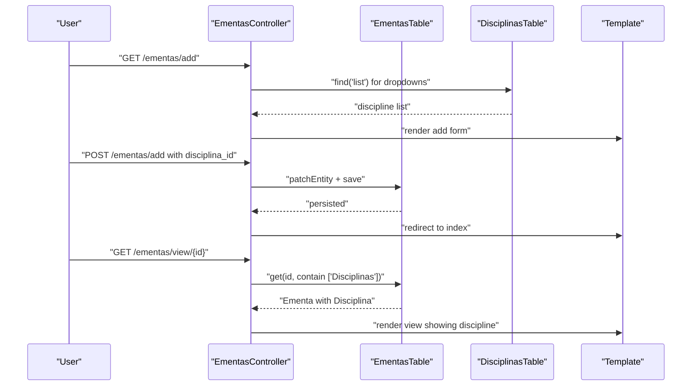
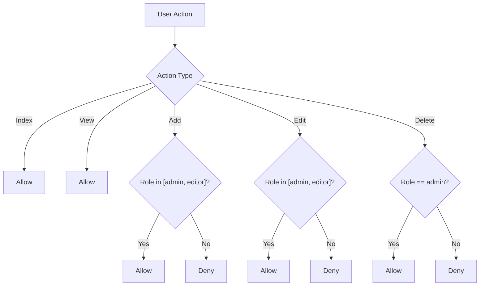
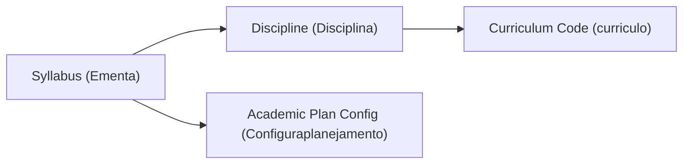
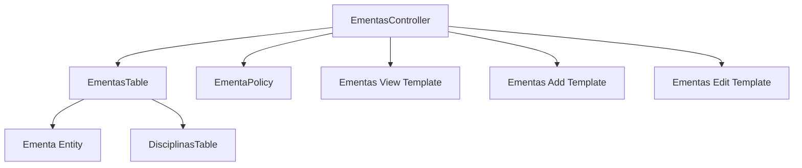

# Syllabus Management System

<cite>
**Referenced Files in This Document**
- [Ementa.php](file://src/Model/Entity/Ementa.php)
- [Disciplina.php](file://src/Model/Entity/Disciplina.php)
- [EmentasTable.php](file://src/Model/Table/EmentasTable.php)
- [DisciplinasTable.php](file://src/Model/Table/DisciplinasTable.php)
- [EmentasController.php](file://src/Controller/EmentasController.php)
- [EmentaPolicy.php](file://src/Policy/EmentaPolicy.php)
- [add.php](file://templates/Ementas/add.php)
- [edit.php](file://templates/Ementas/edit.php)
- [view.php](file://templates/Ementas/view.php)
- [20260618004511_AddCurriculoToDisciplinas.php](file://config/Migrations/20260618004511_AddCurriculoToDisciplinas.php)
</cite>

## Table of Contents
1. [Introduction](#introduction)
2. [Project Structure](#project-structure)
3. [Core Components](#core-components)
4. [Architecture Overview](#architecture-overview)
5. [Detailed Component Analysis](#detailed-component-analysis)
6. [Dependency Analysis](#dependency-analysis)
7. [Performance Considerations](#performance-considerations)
8. [Troubleshooting Guide](#troubleshooting-guide)
9. [Conclusion](#conclusion)

## Introduction
This document explains the syllabus management system centered on the Ementa entity and its relationship with the Disciplina entity. It covers how syllabus content is stored, edited, and displayed; the workflow for creating course syllabi and linking them to courses; access control; and integration points with course catalogs and academic planning systems. It also documents the user interface for syllabus creation and editing, including form fields and validation behavior.

## Project Structure
The syllabus feature follows a standard MVC pattern:
- Model layer: Entity and Table definitions for Ementa and Disciplinas
- Controller layer: CRUD operations for Ementas
- Policy layer: Authorization rules for viewing, adding, editing, and deleting syllabi
- Templates: Views for listing, viewing, adding, and editing syllabi

**Diagram sources**
- [EmentasController.php:1-102](file://src/Controller/EmentasController.php#L1-L102)
- [EmentasTable.php:1-55](file://src/Model/Table/EmentasTable.php#L1-L55)
- [Ementa.php:1-34](file://src/Model/Entity/Ementa.php#L1-L34)
- [DisciplinasTable.php:1-85](file://src/Model/Table/DisciplinasTable.php#L1-L85)
- [Disciplina.php:1-49](file://src/Model/Entity/Disciplina.php#L1-L49)
- [EmentaPolicy.php:1-36](file://src/Policy/EmentaPolicy.php#L1-L36)
- [view.php:1-54](file://templates/Ementas/view.php#L1-L54)
- [add.php:1-20](file://templates/Ementas/add.php#L1-L20)
- [edit.php:1-20](file://templates/Ementas/edit.php#L1-L20)

**Section sources**
- [EmentasController.php:1-102](file://src/Controller/EmentasController.php#L1-L102)
- [EmentasTable.php:1-55](file://src/Model/Table/EmentasTable.php#L1-L55)
- [Ementa.php:1-34](file://src/Model/Entity/Ementa.php#L1-L34)
- [DisciplinasTable.php:1-85](file://src/Model/Table/DisciplinasTable.php#L1-L85)
- [Disciplina.php:1-49](file://src/Model/Entity/Disciplina.php#L1-L49)
- [EmentaPolicy.php:1-36](file://src/Policy/EmentaPolicy.php#L1-L36)
- [view.php:1-54](file://templates/Ementas/view.php#L1-L54)
- [add.php:1-20](file://templates/Ementas/add.php#L1-L20)
- [edit.php:1-20](file://templates/Ementas/edit.php#L1-L20)

## Core Components
- Ementa Entity: Represents a syllabus record with title and content, and foreign keys to configuration, discipline, optional elective, and instructor.
- Ementas Table: Defines table mapping, display field, primary key, timestamp behavior, belongsTo relationships, and validation rules.
- Ementas Controller: Provides index, view, add, edit, delete actions with authorization checks and flash messages.
- Ementa Policy: Controls who can list, view, add, edit, or delete syllabi based on user roles.
- Templates: Provide forms for adding/editing and a detail view for displaying syllabus information.

Key responsibilities:
- Data modeling and relationships (EmentasTable)
- Business logic and request handling (EmentasController)
- Access control (EmentaPolicy)
- User interfaces (templates)

**Section sources**
- [Ementa.php:1-34](file://src/Model/Entity/Ementa.php#L1-L34)
- [EmentasTable.php:1-55](file://src/Model/Table/EmentasTable.php#L1-L55)
- [EmentasController.php:1-102](file://src/Controller/EmentasController.php#L1-L102)
- [EmentaPolicy.php:1-36](file://src/Policy/EmentaPolicy.php#L1-L36)
- [add.php:1-20](file://templates/Ementas/add.php#L1-L20)
- [edit.php:1-20](file://templates/Ementas/edit.php#L1-L20)
- [view.php:1-54](file://templates/Ementas/view.php#L1-L54)

## Architecture Overview
The system uses CakePHP conventions:
- Controllers orchestrate requests and delegate to Tables
- Tables manage ORM relationships and validation
- Policies enforce role-based access
- Templates render UI and handle form submissions

**Diagram sources**
- [EmentasController.php:41-63](file://src/Controller/EmentasController.php#L41-L63)
- [EmentasController.php:65-87](file://src/Controller/EmentasController.php#L65-L87)
- [EmentasController.php:29-39](file://src/Controller/EmentasController.php#L29-L39)
- [EmentasTable.php:11-34](file://src/Model/Table/EmentasTable.php#L11-L34)
- [EmentaPolicy.php:21-29](file://src/Policy/EmentaPolicy.php#L21-L29)
- [add.php:1-20](file://templates/Ementas/add.php#L1-L20)
- [edit.php:1-20](file://templates/Ementas/edit.php#L1-L20)
- [view.php:1-54](file://templates/Ementas/view.php#L1-L54)

## Detailed Component Analysis

### Ementa Entity and Relationship with Disciplina
- The Ementa entity stores syllabus metadata and content, including:
  - Title and programmatic content
  - Foreign keys to configuration, discipline, optional elective, and instructor
- The Ementas table defines belongsTo relationships to Disciplinas, enabling direct linkage between a syllabus and a specific course.
- The Disciplina entity holds course catalog attributes such as code, name, credits, workload, periods, prerequisites, department, curriculum code, and observations.

**Diagram sources**
- [Ementa.php:1-34](file://src/Model/Entity/Ementa.php#L1-L34)
- [EmentasTable.php:23-25](file://src/Model/Table/EmentasTable.php#L23-L25)
- [Disciplina.php:1-49](file://src/Model/Entity/Disciplina.php#L1-L49)

**Section sources**
- [Ementa.php:1-34](file://src/Model/Entity/Ementa.php#L1-L34)
- [EmentasTable.php:11-34](file://src/Model/Table/EmentasTable.php#L11-L34)
- [Disciplina.php:1-49](file://src/Model/Entity/Disciplina.php#L1-L49)

### Syllabus Content Storage, Editing, and Display
- Storage:
  - EmentasTable sets the table name, display field, primary key, and Timestamp behavior.
  - Validation rules define allowed types and lengths for fields like title and content.
- Editing:
  - EmentasController handles add/edit by patching entities from request data and saving them.
  - Related lists (configuration, discipline, elective, instructor) are loaded for dropdowns.
- Display:
  - View template renders syllabus details, including linked discipline and instructor names, and formats content with line breaks.

**Diagram sources**
- [EmentasController.php:41-63](file://src/Controller/EmentasController.php#L41-L63)
- [EmentasController.php:65-87](file://src/Controller/EmentasController.php#L65-L87)
- [EmentasTable.php:36-53](file://src/Model/Table/EmentasTable.php#L36-L53)
- [add.php:1-20](file://templates/Ementas/add.php#L1-L20)
- [edit.php:1-20](file://templates/Ementas/edit.php#L1-L20)
- [view.php:1-54](file://templates/Ementas/view.php#L1-L54)

**Section sources**
- [EmentasTable.php:11-53](file://src/Model/Table/EmentasTable.php#L11-L53)
- [EmentasController.php:41-87](file://src/Controller/EmentasController.php#L41-L87)
- [add.php:1-20](file://templates/Ementas/add.php#L1-L20)
- [edit.php:1-20](file://templates/Ementas/edit.php#L1-L20)
- [view.php:1-54](file://templates/Ementas/view.php#L1-L54)

### Workflow for Creating Course Syllabi and Linking to Courses
- Creation flow:
  - Navigate to add page, select a discipline (and optionally configuration/elective/instructor), enter title and content, then save.
- Linking to courses:
  - The disciplina_id foreign key links the syllabus to a specific course record.
- Viewing:
  - The view action loads the syllabus with related entities and displays the discipline name alongside other metadata.

**Diagram sources**
- [EmentasController.php:41-63](file://src/Controller/EmentasController.php#L41-L63)
- [EmentasController.php:29-39](file://src/Controller/EmentasController.php#L29-L39)
- [EmentasTable.php:23-25](file://src/Model/Table/EmentasTable.php#L23-L25)
- [DisciplinasTable.php:15-27](file://src/Model/Table/DisciplinasTable.php#L15-L27)
- [add.php:1-20](file://templates/Ementas/add.php#L1-L20)
- [view.php:1-54](file://templates/Ementas/view.php#L1-L54)

**Section sources**
- [EmentasController.php:41-63](file://src/Controller/EmentasController.php#L41-L63)
- [EmentasController.php:29-39](file://src/Controller/EmentasController.php#L29-L39)
- [EmentasTable.php:23-25](file://src/Model/Table/EmentasTable.php#L23-L25)
- [DisciplinasTable.php:15-27](file://src/Model/Table/DisciplinasTable.php#L15-L27)
- [add.php:1-20](file://templates/Ementas/add.php#L1-L20)
- [view.php:1-54](file://templates/Ementas/view.php#L1-L54)

### Managing Version History
- Current implementation does not include explicit versioning for syllabi.
- The Timestamp behavior records created and modified timestamps, which can be used for basic auditability.
- To implement version history, consider:
  - Adding a separate EmentasVersion table with a reference to the parent Ementa and storing diffs or full snapshots.
  - Using a behavior or service to create versions on updates.
  - Exposing a version list and diff view in the UI.

[No sources needed since this section provides general guidance]

### Examples of Syllabus Content Structure and Formatting Options
- Fields available for syllabus content:
  - Title (text)
  - Programmatic content (textarea)
- Formatting options:
  - The view template renders content with line breaks preserved.
  - For richer formatting, consider integrating a text editor and sanitizing output before rendering.

**Section sources**
- [add.php:1-20](file://templates/Ementas/add.php#L1-L20)
- [edit.php:1-20](file://templates/Ementas/edit.php#L1-L20)
- [view.php:33-35](file://templates/Ementas/view.php#L33-L35)

### Access Control
- Authorization policy enforces:
  - Index and view are open to all users
  - Add and edit require admin or editor roles
  - Delete requires admin role
- The controller skips authorization for index and view, relying on policy defaults for those actions.

**Diagram sources**
- [EmentaPolicy.php:11-34](file://src/Policy/EmentaPolicy.php#L11-L34)
- [EmentasController.php:11-15](file://src/Controller/EmentasController.php#L11-L15)

**Section sources**
- [EmentaPolicy.php:11-34](file://src/Policy/EmentaPolicy.php#L11-L34)
- [EmentasController.php:11-15](file://src/Controller/EmentasController.php#L11-L15)

### Integration with Course Catalogs and Academic Planning Systems
- Course catalog integration:
  - The disciplina_id foreign key links each syllabus to a course record, enabling retrieval of course metadata (code, name, credits, workload, etc.).
- Academic planning integration:
  - The configuraplanejamento_id foreign key allows associating a syllabus with an academic plan configuration, facilitating alignment with curriculum structures.
- Additional context:
  - The Disciplinas table includes a curriculo field that supports filtering and grouping by curriculum codes.

**Diagram sources**
- [EmentasTable.php:19-33](file://src/Model/Table/EmentasTable.php#L19-L33)
- [DisciplinasTable.php:15-27](file://src/Model/Table/DisciplinasTable.php#L15-L27)
- [20260618004511_AddCurriculoToDisciplinas.php:16-25](file://config/Migrations/20260618004511_AddCurriculoToDisciplinas.php#L16-L25)

**Section sources**
- [EmentasTable.php:19-33](file://src/Model/Table/EmentasTable.php#L19-L33)
- [DisciplinasTable.php:15-27](file://src/Model/Table/DisciplinasTable.php#L15-L27)
- [20260618004511_AddCurriculoToDisciplinas.php:16-25](file://config/Migrations/20260618004511_AddCurriculoToDisciplinas.php#L16-L25)

### User Interface for Syllabus Creation and Editing
- Forms:
  - Add and edit templates provide dropdowns for configuration, discipline, elective, and instructor, plus text inputs for title and content.
- Validation:
  - Server-side validation ensures integer foreign keys and scalar fields with length constraints.
- Feedback:
  - Controller flashes success or error messages after save/update attempts.

**Section sources**
- [add.php:1-20](file://templates/Ementas/add.php#L1-L20)
- [edit.php:1-20](file://templates/Ementas/edit.php#L1-L20)
- [EmentasTable.php:36-53](file://src/Model/Table/EmentasTable.php#L36-L53)
- [EmentasController.php:53-60](file://src/Controller/EmentasController.php#L53-L60)
- [EmentasController.php:77-84](file://src/Controller/EmentasController.php#L77-L84)

## Dependency Analysis
The following diagram shows core dependencies among model, controller, policy, and templates.

**Diagram sources**
- [EmentasController.php:1-102](file://src/Controller/EmentasController.php#L1-L102)
- [EmentasTable.php:1-55](file://src/Model/Table/EmentasTable.php#L1-L55)
- [Ementa.php:1-34](file://src/Model/Entity/Ementa.php#L1-L34)
- [DisciplinasTable.php:1-85](file://src/Model/Table/DisciplinasTable.php#L1-L85)
- [view.php:1-54](file://templates/Ementas/view.php#L1-L54)
- [add.php:1-20](file://templates/Ementas/add.php#L1-L20)
- [edit.php:1-20](file://templates/Ementas/edit.php#L1-L20)

**Section sources**
- [EmentasController.php:1-102](file://src/Controller/EmentasController.php#L1-L102)
- [EmentasTable.php:1-55](file://src/Model/Table/EmentasTable.php#L1-L55)
- [Ementa.php:1-34](file://src/Model/Entity/Ementa.php#L1-L34)
- [DisciplinasTable.php:1-85](file://src/Model/Table/DisciplinasTable.php#L1-L85)
- [view.php:1-54](file://templates/Ementas/view.php#L1-L54)
- [add.php:1-20](file://templates/Ementas/add.php#L1-L20)
- [edit.php:1-20](file://templates/Ementas/edit.php#L1-L20)

## Performance Considerations
- Use pagination for listing syllabi to avoid loading large datasets.
- Limit contains to only required associations when fetching lists.
- Cache dropdown lists (e.g., disciplines) if they change infrequently.
- Avoid excessive nested queries; prefer explicit contains with selective fields.

[No sources needed since this section provides general guidance]

## Troubleshooting Guide
- Common issues:
  - Missing foreign key values: Ensure dropdown selections are valid integers.
  - Validation failures: Check server-side validation rules for field types and lengths.
  - Authorization errors: Verify user roles match policy requirements for add/edit/delete.
- Debugging steps:
  - Inspect flash messages for success or error feedback.
  - Confirm that related entities are properly contained in view actions.
  - Review policy methods to ensure correct role checks.

**Section sources**
- [EmentasController.php:53-60](file://src/Controller/EmentasController.php#L53-L60)
- [EmentasController.php:77-84](file://src/Controller/EmentasController.php#L77-L84)
- [EmentasTable.php:36-53](file://src/Model/Table/EmentasTable.php#L36-L53)
- [EmentaPolicy.php:21-34](file://src/Policy/EmentaPolicy.php#L21-L34)

## Conclusion
The syllabus management system provides a clear separation of concerns across model, controller, policy, and templates. The Ementa entity links directly to the Disciplina entity through a foreign key, enabling robust integration with course catalogs and academic plans. While versioning is not implemented, timestamp behaviors offer basic auditability. Access control is enforced via policies, and the UI supports straightforward creation and editing workflows. Future enhancements may include rich-text editing, comprehensive version history, and advanced filtering for syllabus discovery.