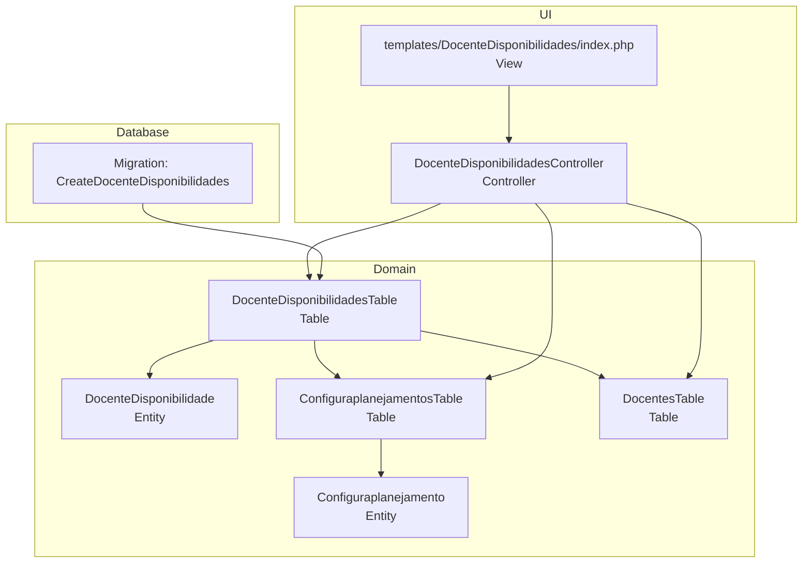
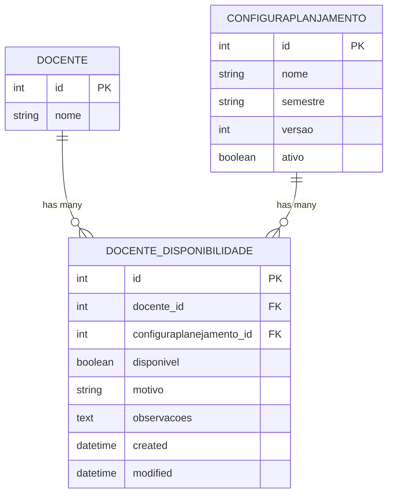
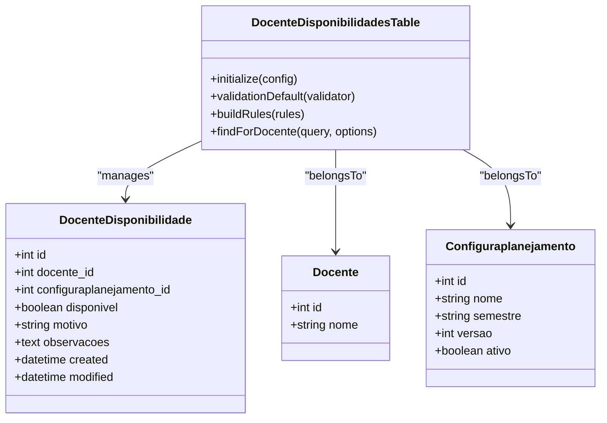
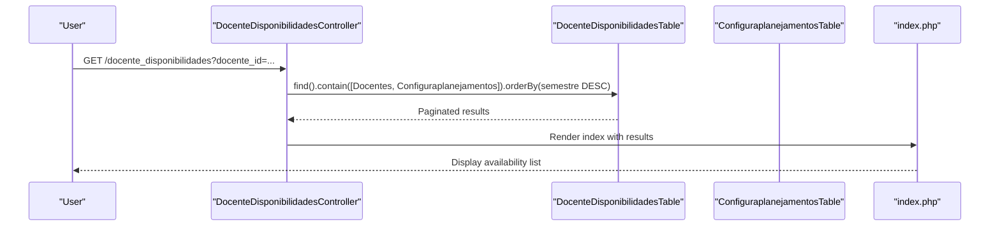
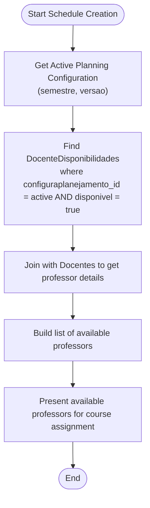
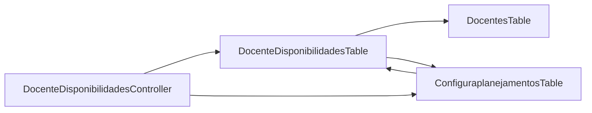

# Faculty Availability Tracking

<cite>
**Referenced Files in This Document**
- [DocenteDisponibilidade.php](file://src/Model/Entity/DocenteDisponibilidade.php)
- [DocenteDisponibilidadesTable.php](file://src/Model/Table/DocenteDisponibilidadesTable.php)
- [Configuraplanejamento.php](file://src/Model/Entity/Configuraplanejamento.php)
- [ConfiguraplanejamentosTable.php](file://src/Model/Table/ConfiguraplanejamentosTable.php)
- [CreateDocenteDisponibilidades.php](file://config/Migrations/20260613100000_CreateDocenteDisponibilidades.php)
- [DocenteDisponibilidadesController.php](file://src/Controller/DocenteDisponibilidadesController.php)
- [index.php](file://templates/DocenteDisponibilidades/index.php)
- [DocentesTable.php](file://src/Model/Table/DocentesTable.php)
</cite>

## Table of Contents
1. [Introduction](#introduction)
2. [Project Structure](#project-structure)
3. [Core Components](#core-components)
4. [Architecture Overview](#architecture-overview)
5. [Detailed Component Analysis](#detailed-component-analysis)
6. [Dependency Analysis](#dependency-analysis)
7. [Performance Considerations](#performance-considerations)
8. [Troubleshooting Guide](#troubleshooting-guide)
9. [Conclusion](#conclusion)
10. [Appendices](#appendices)

## Introduction
This document explains the faculty availability tracking system that manages professor availability per academic semester or planning configuration. It focuses on the DocenteDisponibilidade entity, its boolean disponivel field, and its relationship to Configuraplanejamento (planning configuration). The documentation covers how availability is linked to specific semesters and versions, enabling different availability settings across academic periods. It also describes integration points with the scheduling workflow where only available professors can be assigned to courses, provides examples for setting up availability across multiple semesters, and clarifies how active planning configurations influence availability display in the faculty index page.

## Project Structure
The availability feature spans models (entities and tables), a controller, templates, and database migrations:
- Entity and table definitions define the data model and relationships.
- Controller actions provide CRUD operations and listing views.
- Templates render the availability list and links to related entities.
- Migration defines the database schema and constraints.

**Diagram sources**
- [DocenteDisponibilidade.php:1-22](file://src/Model/Entity/DocenteDisponibilidade.php#L1-L22)
- [DocenteDisponibilidadesTable.php:1-77](file://src/Model/Table/DocenteDisponibilidadesTable.php#L1-L77)
- [Configuraplanejamento.php:1-23](file://src/Model/Entity/Configuraplanejamento.php#L1-L23)
- [ConfiguraplanejamentosTable.php:1-62](file://src/Model/Table/ConfiguraplanejamentosTable.php#L1-L62)
- [DocenteDisponibilidadesController.php:1-118](file://src/Controller/DocenteDisponibilidadesController.php#L1-L118)
- [index.php:1-61](file://templates/DocenteDisponibilidades/index.php#L1-L61)
- [CreateDocenteDisponibilidades.php:1-48](file://config/Migrations/20260613100000_CreateDocenteDisponibilidades.php#L1-L48)

**Section sources**
- [DocenteDisponibilidadesTable.php:13-30](file://src/Model/Table/DocenteDisponibilidadesTable.php#L13-L30)
- [ConfiguraplanejamentosTable.php:11-31](file://src/Model/Table/ConfiguraplanejamentosTable.php#L11-L31)
- [DocenteDisponibilidadesController.php:17-34](file://src/Controller/DocenteDisponibilidadesController.php#L17-L34)
- [index.php:17-44](file://templates/DocenteDisponibilidades/index.php#L17-L44)
- [CreateDocenteDisponibilidades.php:10-45](file://config/Migrations/20260613100000_CreateDocenteDisponibilidades.php#L10-L45)

## Core Components
- DocenteDisponibilidade entity: Represents a professor’s availability within a specific planning configuration (semester/version). Includes the boolean disponivel flag and optional reason/notes fields.
- DocenteDisponibilidadesTable: Defines belongsTo relationships to Docentes and Configuraplanejamentos, validation rules, and a finder method to filter by docente_id.
- Configuraplanejamento entity/table: Represents a planning configuration with fields such as nome, semestre, versao, and ativo. Has a hasMany relationship to DocenteDisponibilidades.
- DocenteDisponibilidadesController: Provides index, view, add, edit, delete actions; supports prefilling via query parameters and paginated listing ordered by semester descending.
- Template index view: Renders availability rows including the associated semester and disponivel status.

Key responsibilities:
- Data modeling and relationships (entity/table layers).
- Validation and referential integrity (table layer).
- User-facing operations and listing (controller/template).
- Database schema definition (migration).

**Section sources**
- [DocenteDisponibilidade.php:10-20](file://src/Model/Entity/DocenteDisponibilidade.php#L10-L20)
- [DocenteDisponibilidadesTable.php:22-30](file://src/Model/Table/DocenteDisponibilidadesTable.php#L22-L30)
- [DocenteDisponibilidadesTable.php:32-56](file://src/Model/Table/DocenteDisponibilidadesTable.php#L32-L56)
- [DocenteDisponibilidadesTable.php:66-74](file://src/Model/Table/DocenteDisponibilidadesTable.php#L66-L74)
- [Configuraplanejamento.php:13-21](file://src/Model/Entity/Configuraplanejamento.php#L13-L21)
- [ConfiguraplanejamentosTable.php:24-31](file://src/Model/Table/ConfiguraplanejamentosTable.php#L24-L31)
- [DocenteDisponibilidadesController.php:17-34](file://src/Controller/DocenteDisponibilidadesController.php#L17-L34)
- [index.php:17-44](file://templates/DocenteDisponibilidades/index.php#L17-L44)

## Architecture Overview
Availability is modeled as a many-to-one relationship from DocenteDisponibilidade to both Docente and Configuraplanejamento. A unique constraint ensures one availability record per professor per planning configuration. The controller lists and manages these records, while the template displays them alongside the associated semester.

**Diagram sources**
- [CreateDocenteDisponibilidades.php:10-45](file://config/Migrations/20260613100000_CreateDocenteDisponibilidades.php#L10-L45)
- [DocenteDisponibilidadesTable.php:22-30](file://src/Model/Table/DocenteDisponibilidadesTable.php#L22-L30)
- [ConfiguraplanejamentosTable.php:24-31](file://src/Model/Table/ConfiguraplanejamentosTable.php#L24-L31)

## Detailed Component Analysis

### DocenteDisponibilidade Entity and Table
- Fields:
  - Boolean disponivel indicates whether the professor is available for the selected planning configuration.
  - Optional motivo and observacoes allow explaining unavailability.
  - Timestamps created and modified are managed automatically.
- Relationships:
  - belongsTo Docente (docente_id).
  - belongsTo Configuraplanejamento (configuraplanejamento_id).
- Validation:
  - docente_id and configuraplanejamento_id are required integers.
  - disponivel must be a boolean.
  - motivo limited to 100 characters; observacoes optional.
- Rules:
  - Referential integrity enforced via existsIn rules for both foreign keys.
- Finder:
  - findForDocente filters availability records by docente_id when provided.

**Diagram sources**
- [DocenteDisponibilidade.php:10-20](file://src/Model/Entity/DocenteDisponibilidade.php#L10-L20)
- [DocenteDisponibilidadesTable.php:13-30](file://src/Model/Table/DocenteDisponibilidadesTable.php#L13-L30)
- [DocenteDisponibilidadesTable.php:32-56](file://src/Model/Table/DocenteDisponibilidadesTable.php#L32-L56)
- [DocenteDisponibilidadesTable.php:58-64](file://src/Model/Table/DocenteDisponibilidadesTable.php#L58-L64)
- [DocenteDisponibilidadesTable.php:66-74](file://src/Model/Table/DocenteDisponibilidadesTable.php#L66-L74)
- [Docente.php:37-55](file://src/Model/Entity/Docente.php#L37-L55)
- [Configuraplanejamento.php:13-21](file://src/Model/Entity/Configuraplanejamento.php#L13-L21)

**Section sources**
- [DocenteDisponibilidade.php:10-20](file://src/Model/Entity/DocenteDisponibilidade.php#L10-L20)
- [DocenteDisponibilidadesTable.php:22-30](file://src/Model/Table/DocenteDisponibilidadesTable.php#L22-L30)
- [DocenteDisponibilidadesTable.php:32-56](file://src/Model/Table/DocenteDisponibilidadesTable.php#L32-L56)
- [DocenteDisponibilidadesTable.php:58-64](file://src/Model/Table/DocenteDisponibilidadesTable.php#L58-L64)
- [DocenteDisponibilidadesTable.php:66-74](file://src/Model/Table/DocenteDisponibilidadesTable.php#L66-L74)

### Configuraplanejamento (Planning Configuration)
- Purpose: Represents an academic planning configuration identified by nome, semestre, versao, and optionally marked as ativo (active).
- Relationship: hasMany DocenteDisponibilidades, allowing each configuration to have multiple availability entries (one per professor).
- Usage: Semestre and versao enable distinguishing availability across academic periods and versions.

**Section sources**
- [Configuraplanejamento.php:13-21](file://src/Model/Entity/Configuraplanejamento.php#L13-L21)
- [ConfiguraplanejamentosTable.php:24-31](file://src/Model/Table/ConfiguraplanejamentosTable.php#L24-L31)

### Controller and View Integration
- Index action:
  - Lists availability records with contains for Docente and Configuraplanejamento.
  - Orders by Configuraplanejamentos.semestre DESC.
  - Supports filtering by docente_id via query parameter.
- Add/Edit actions:
  - Prefill docente_id and configuraplanejamento_id from query parameters.
  - Save/update with validation and flash messages.
- View action:
  - Displays a single availability record with related entities.
- Template index:
  - Shows columns for professor name, semester, disponivel status, motivo, and observacoes.
  - Provides actions to view, edit, and delete.

**Diagram sources**
- [DocenteDisponibilidadesController.php:17-34](file://src/Controller/DocenteDisponibilidadesController.php#L17-L34)
- [index.php:17-44](file://templates/DocenteDisponibilidades/index.php#L17-L44)

**Section sources**
- [DocenteDisponibilidadesController.php:17-34](file://src/Controller/DocenteDisponibilidadesController.php#L17-L34)
- [DocenteDisponibilidadesController.php:44-75](file://src/Controller/DocenteDisponibilidadesController.php#L44-L75)
- [DocenteDisponibilidadesController.php:77-98](file://src/Controller/DocenteDisponibilidadesController.php#L77-L98)
- [index.php:17-44](file://templates/DocenteDisponibilidades/index.php#L17-L44)

### Scheduling Integration: Filtering Available Professors
To ensure only available professors are assignable during schedule creation:
- Determine the active planning configuration (semestre and versao) used for scheduling.
- Query DocenteDisponibilidades where configuraplanejamento_id matches the active configuration and disponivel is true.
- Join with Docentes to retrieve the list of available professors.
- Use this filtered list when presenting assignment options for courses.

[No sources needed since this diagram shows conceptual workflow, not actual code structure]

### Multiple Semesters and Versions
- Create separate Configuraplanejamento records for each semester/version combination.
- For each professor, create a DocenteDisponibilidade entry per planning configuration to set their availability independently.
- The unique constraint on (docente_id, configuraplanejamento_id) prevents duplicate availability entries for the same professor and configuration.

**Section sources**
- [CreateDocenteDisponibilidades.php:42-45](file://config/Migrations/20260613100000_CreateDocenteDisponibilidades.php#L42-L45)
- [ConfiguraplanejamentosTable.php:45-57](file://src/Model/Table/ConfiguraplanejamentosTable.php#L45-L57)

### Active Planning Configuration and Availability Display
- The availability index orders by Configuraplanejamentos.semestre DESC, making recent semesters appear first.
- To reflect the active planning configuration in the UI, consider:
  - Adding a filter to show only availability for the active configuration.
  - Highlighting or marking rows corresponding to the active configuration.
- The template currently displays the semester for each availability row, aiding identification.

**Section sources**
- [DocenteDisponibilidadesController.php:24-26](file://src/Controller/DocenteDisponibilidadesController.php#L24-L26)
- [index.php:34-35](file://templates/DocenteDisponibilidades/index.php#L34-L35)

## Dependency Analysis
- DocenteDisponibilidadesTable depends on:
  - Docentes (via belongsTo).
  - Configuraplanejamentos (via belongsTo).
- ConfiguraplanejamentosTable declares hasMany DocenteDisponibilidades.
- Controller orchestrates queries using these relationships and renders the index view.

**Diagram sources**
- [DocenteDisponibilidadesTable.php:22-30](file://src/Model/Table/DocenteDisponibilidadesTable.php#L22-L30)
- [ConfiguraplanejamentosTable.php:24-31](file://src/Model/Table/ConfiguraplanejamentosTable.php#L24-L31)
- [DocenteDisponibilidadesController.php:17-34](file://src/Controller/DocenteDisponibilidadesController.php#L17-L34)

**Section sources**
- [DocenteDisponibilidadesTable.php:22-30](file://src/Model/Table/DocenteDisponibilidadesTable.php#L22-L30)
- [ConfiguraplanejamentosTable.php:24-31](file://src/Model/Table/ConfiguraplanejamentosTable.php#L24-L31)
- [DocenteDisponibilidadesController.php:17-34](file://src/Controller/DocenteDisponibilidadesController.php#L17-L34)

## Performance Considerations
- Unique index on (docente_id, configuraplanejamento_id) prevents duplicates and speeds up lookups per professor per configuration.
- Separate indexes on docente_id and configuraplanejamento_id improve filtering performance.
- Ordering by semestre DESC in the index may benefit from an additional index on configuraplanejamentos.semestre if the dataset grows large.
- Using contain() efficiently loads related entities without N+1 queries.

**Section sources**
- [CreateDocenteDisponibilidades.php:42-45](file://config/Migrations/20260613100000_CreateDocenteDisponibilidades.php#L42-L45)
- [DocenteDisponibilidadesController.php:24-26](file://src/Controller/DocenteDisponibilidadesController.php#L24-L26)

## Troubleshooting Guide
Common issues and resolutions:
- Duplicate availability entry:
  - Symptom: Save fails due to unique constraint violation on (docente_id, configuraplanejamento_id).
  - Resolution: Update existing record instead of creating a new one, or change the planning configuration.
- Missing professor or configuration:
  - Symptom: Validation error indicating foreign key does not exist.
  - Resolution: Ensure referenced Docente and Configuraplanejamento records exist before saving.
- Incorrect disponivel type:
  - Symptom: Validation error requiring a boolean value.
  - Resolution: Pass true/false explicitly in form submissions or API payloads.
- Listing not filtered:
  - Symptom: Availability list includes all records regardless of professor.
  - Resolution: Include docente_id query parameter to filter by professor.

**Section sources**
- [CreateDocenteDisponibilidades.php:42-45](file://config/Migrations/20260613100000_CreateDocenteDisponibilidades.php#L42-L45)
- [DocenteDisponibilidadesTable.php:32-56](file://src/Model/Table/DocenteDisponibilidadesTable.php#L32-L56)
- [DocenteDisponibilidadesTable.php:58-64](file://src/Model/Table/DocenteDisponibilidadesTable.php#L58-L64)
- [DocenteDisponibilidadesController.php:21-30](file://src/Controller/DocenteDisponibilidadesController.php#L21-L30)

## Conclusion
The faculty availability tracking system cleanly separates availability data from planning configurations, enabling per-semester and per-version control over professor availability. The boolean disponivel field drives scheduling decisions, ensuring only available professors are considered for course assignments. With clear relationships, validation, and indexing, the system supports scalable management of availability across academic periods and integrates smoothly into scheduling workflows.

## Appendices

### Example Workflows

- Setting up availability for multiple semesters:
  - Create Configuraplanejamento records for each semester/version.
  - For each professor, create a DocenteDisponibilidade entry per configuration, setting disponivel appropriately.
  - Reference: [CreateDocenteDisponibilidades.php:10-45](file://config/Migrations/20260613100000_CreateDocenteDisponibilidades.php#L10-L45), [ConfiguraplanejamentosTable.php:45-57](file://src/Model/Table/ConfiguraplanejamentosTable.php#L45-L57)

- Filtering available professors during schedule creation:
  - Identify the active planning configuration (semestre, versao).
  - Query DocenteDisponibilidades where configuraplanejamento_id equals the active configuration and disponivel is true.
  - Join with Docentes to obtain the final list of available professors.
  - Reference: [DocenteDisponibilidadesTable.php:22-30](file://src/Model/Table/DocenteDisponibilidadesTable.php#L22-L30)

- Understanding availability impact on course assignment:
  - Only professors with disponivel=true for the active configuration should appear in assignment dropdowns or suggestions.
  - Unavailable professors can still be viewed but excluded from selection.
  - Reference: [index.php:34-35](file://templates/DocenteDisponibilidades/index.php#L34-L35)