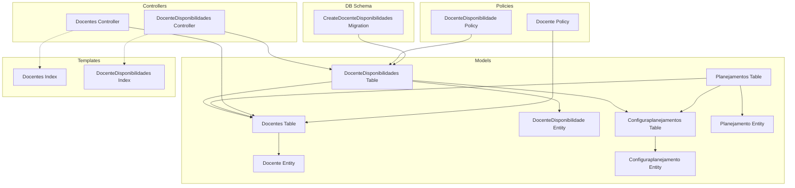
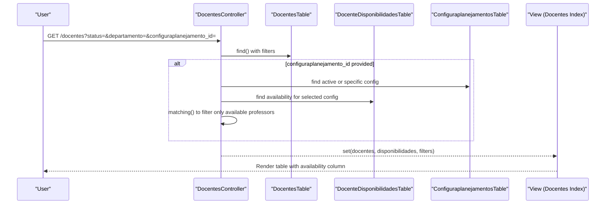
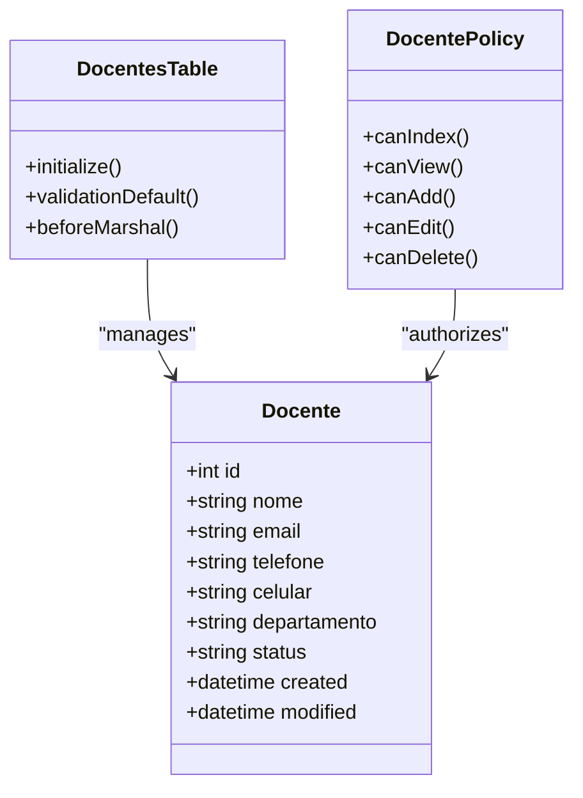
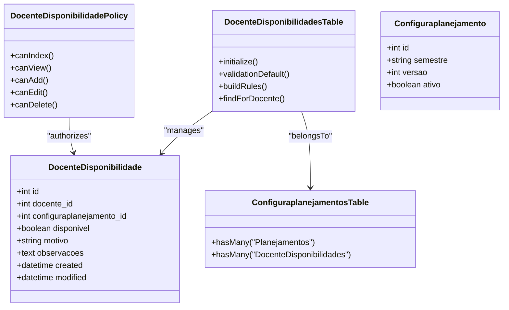
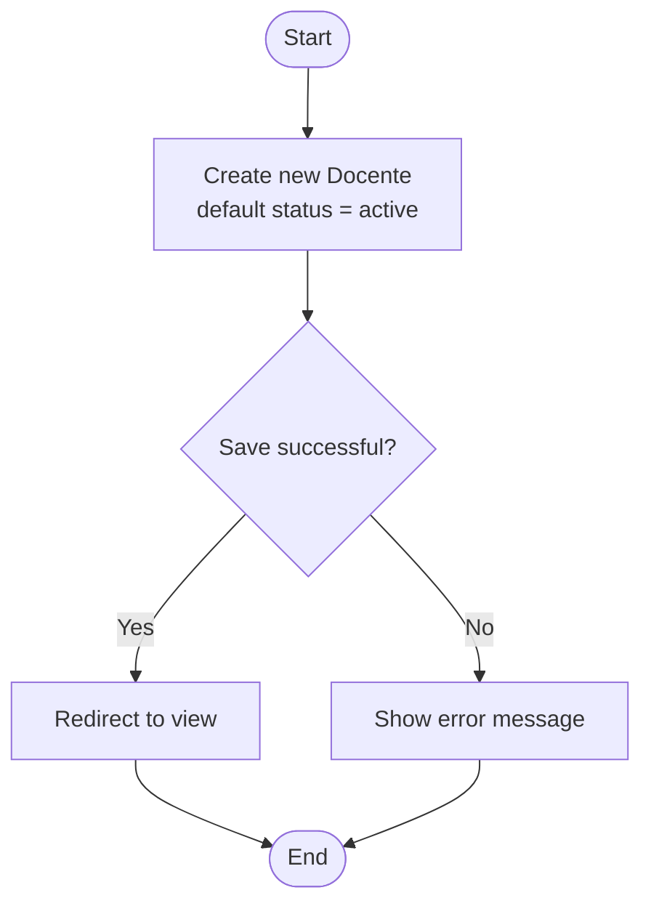
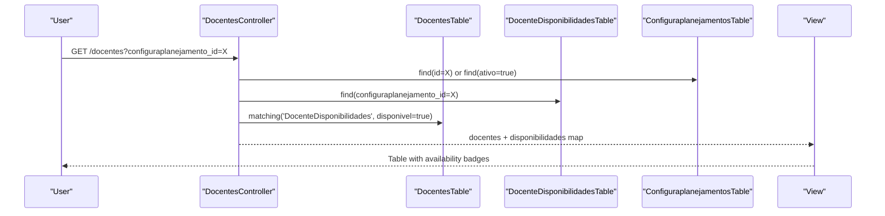
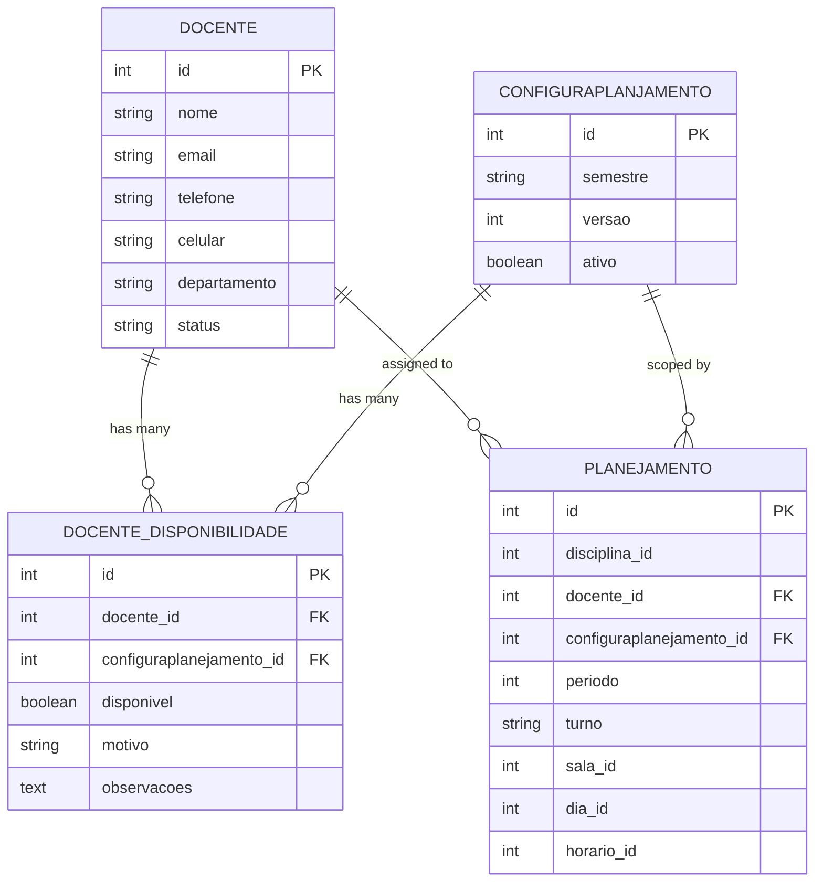
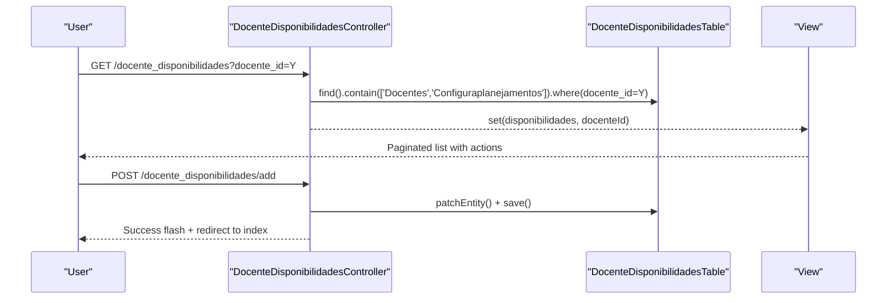
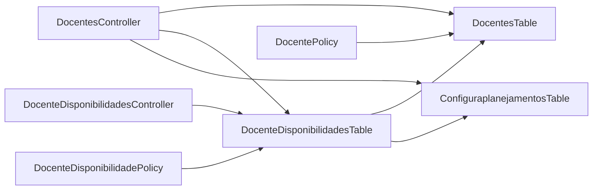

# Faculty Management

<cite>
**Referenced Files in This Document**
- [Docente.php](file://src/Model/Entity/Docente.php)
- [DocentesTable.php](file://src/Model/Table/DocentesTable.php)
- [DocentesController.php](file://src/Controller/DocentesController.php)
- [DocenteDisponibilidade.php](file://src/Model/Entity/DocenteDisponibilidade.php)
- [DocenteDisponibilidadesTable.php](file://src/Model/Table/DocenteDisponibilidadesTable.php)
- [DocenteDisponibilidadesController.php](file://src/Controller/DocenteDisponibilidadesController.php)
- [20260613100000_CreateDocenteDisponibilidades.php](file://config/Migrations/20260613100000_CreateDocenteDisponibilidades.php)
- [index.php (Docentes)](file://templates/Docentes/index.php)
- [index.php (DocenteDisponibilidades)](file://templates/DocenteDisponibilidades/index.php)
- [Planejamento.php](file://src/Model/Entity/Planejamento.php)
- [PlanejamentosTable.php](file://src/Model/Table/PlanejamentosTable.php)
- [Configuraplanejamento.php](file://src/Model/Entity/Configuraplanejamento.php)
- [ConfiguraplanejamentosTable.php](file://src/Model/Table/ConfiguraplanejamentosTable.php)
- [DocentePolicy.php](file://src/Policy/DocentePolicy.php)
- [DocenteDisponibilidadePolicy.php](file://src/Policy/DocenteDisponibilidadePolicy.php)
</cite>

## Table of Contents
1. Introduction
2. Project Structure
3. Core Components
4. Architecture Overview
5. Detailed Component Analysis
6. Dependency Analysis
7. Performance Considerations
8. Troubleshooting Guide
9. Conclusion

## Introduction
This document explains the faculty management system with a focus on professor profiles, status management, and availability tracking across planning semesters. It covers:
- The Docente entity structure and status normalization
- The DocenteDisponibilidade system for per-semester availability
- CRUD operations for faculty members and their availability
- Filtering available professors during schedule creation
- Relationship between faculty availability and course assignments
- Practical examples and troubleshooting guidance

## Project Structure
The faculty management feature spans entities, tables, controllers, policies, templates, and database migrations. Key areas:
- Entities define data shapes and access rules
- Tables define relationships, validation, and query helpers
- Controllers implement CRUD and filtering logic
- Policies enforce authorization
- Templates render lists, filters, and actions
- Migration defines the availability table schema

**Diagram sources**
- [Docente.php](file://src/Model/Entity/Docente.php)
- [DocentesTable.php](file://src/Model/Table/DocentesTable.php)
- [DocenteDisponibilidade.php](file://src/Model/Entity/DocenteDisponibilidade.php)
- [DocenteDisponibilidadesTable.php](file://src/Model/Table/DocenteDisponibilidadesTable.php)
- [Configuraplanejamento.php](file://src/Model/Entity/Configuraplanejamento.php)
- [ConfiguraplanejamentosTable.php](file://src/Model/Table/ConfiguraplanejamentosTable.php)
- [Planejamento.php](file://src/Model/Entity/Planejamento.php)
- [PlanejamentosTable.php](file://src/Model/Table/PlanejamentosTable.php)
- [DocentesController.php](file://src/Controller/DocentesController.php)
- [DocenteDisponibilidadesController.php](file://src/Controller/DocenteDisponibilidadesController.php)
- [DocentePolicy.php](file://src/Policy/DocentePolicy.php)
- [DocenteDisponibilidadePolicy.php](file://src/Policy/DocenteDisponibilidadePolicy.php)
- [index.php (Docentes)](file://templates/Docentes/index.php)
- [index.php (DocenteDisponibilidades)](file://templates/DocenteDisponibilidades/index.php)
- [20260613100000_CreateDocenteDisponibilidades.php](file://config/Migrations/20260613100000_CreateDocenteDisponibilidades.php)

**Section sources**
- [Docente.php](file://src/Model/Entity/Docente.php)
- [DocentesTable.php](file://src/Model/Table/DocentesTable.php)
- [DocenteDisponibilidade.php](file://src/Model/Entity/DocenteDisponibilidade.php)
- [DocenteDisponibilidadesTable.php](file://src/Model/Table/DocenteDisponibilidadesTable.php)
- [DocentesController.php](file://src/Controller/DocentesController.php)
- [DocenteDisponibilidadesController.php](file://src/Controller/DocenteDisponibilidadesController.php)
- [20260613100000_CreateDocenteDisponibilidades.php](file://config/Migrations/20260613100000_CreateDocenteDisponibilidades.php)
- [index.php (Docentes)](file://templates/Docentes/index.php)
- [index.php (DocenteDisponibilidades)](file://templates/DocenteDisponibilidades/index.php)
- [Planejamento.php](file://src/Model/Entity/Planejamento.php)
- [PlanejamentosTable.php](file://src/Model/Table/PlanejamentosTable.php)
- [Configuraplanejamento.php](file://src/Model/Entity/Configuraplanejamento.php)
- [ConfiguraplanejamentosTable.php](file://src/Model/Table/ConfiguraplanejamentosTable.php)
- [DocentePolicy.php](file://src/Policy/DocentePolicy.php)
- [DocenteDisponibilidadePolicy.php](file://src/Policy/DocenteDisponibilidadePolicy.php)

## Core Components
- Docente entity and table
  - Fields include name, email, phone/cell, department, status, and timestamps
  - Status normalization maps aliases to canonical values (e.g., active/inactive variants)
- DocenteDisponibilidade entity and table
  - Links a professor to a planning configuration (semester/version)
  - Boolean disponivel indicates whether the professor is available for scheduling in that period
  - Optional fields for reason and observations
- Scheduling integration
  - Planejamento links courses to professors, rooms, days, times, and planning configurations
  - Availability influences which professors can be assigned when creating schedules

Key responsibilities:
- DocentesTable: validation, status normalization, relationships
- DocenteDisponibilidadesTable: validation, existence rules, optional finder helper
- Controllers: list/filter/edit/add/delete flows; availability filtering by planning configuration
- Policies: role-based authorization for add/edit/delete

**Section sources**
- [Docente.php](file://src/Model/Entity/Docente.php)
- [DocentesTable.php](file://src/Model/Table/DocentesTable.php)
- [DocenteDisponibilidade.php](file://src/Model/Entity/DocenteDisponibilidade.php)
- [DocenteDisponibilidadesTable.php](file://src/Model/Table/DocenteDisponibilidadesTable.php)
- [Planejamento.php](file://src/Model/Entity/Planejamento.php)
- [PlanejamentosTable.php](file://src/Model/Table/PlanejamentosTable.php)

## Architecture Overview
The system follows MVC patterns with CakePHP conventions:
- Controllers orchestrate requests and delegate to Tables
- Tables encapsulate domain logic, validation, and relationships
- Entities represent records and field accessibility
- Policies gate operations based on user roles
- Templates present filtered lists and forms
- Migration ensures DB schema consistency

**Diagram sources**
- [DocentesController.php](file://src/Controller/DocentesController.php)
- [DocentesTable.php](file://src/Model/Table/DocentesTable.php)
- [DocenteDisponibilidadesTable.php](file://src/Model/Table/DocenteDisponibilidadesTable.php)
- [ConfiguraplanejamentosTable.php](file://src/Model/Table/ConfiguraplanejamentosTable.php)
- [index.php (Docentes)](file://templates/Docentes/index.php)

## Detailed Component Analysis

### Docente Profile and Status Management
- Entity fields
  - Name, email, phone/cell, department, status, and timestamps are accessible
- Status normalization
  - Incoming status values are normalized to canonical values before persistence
  - Canonical labels are used consistently in UI
- Validation
  - Required presence for name; optional email, phone, department, dates, and status
- Relationships
  - One-to-many with Planejamentos and DocenteDisponibilidades

**Diagram sources**
- [Docente.php](file://src/Model/Entity/Docente.php)
- [DocentesTable.php](file://src/Model/Table/DocentesTable.php)
- [DocentePolicy.php](file://src/Policy/DocentePolicy.php)

**Section sources**
- [Docente.php](file://src/Model/Entity/Docente.php)
- [DocentesTable.php](file://src/Model/Table/DocentesTable.php)
- [DocentePolicy.php](file://src/Policy/DocentePolicy.php)

### DocenteDisponibilidade System (Availability per Semester)
- Purpose
  - Tracks whether a professor is available for scheduling within a specific planning configuration (semester/version)
- Fields
  - docente_id, configuraplanejamento_id, boolean disponivel, motivo, observacoes, timestamps
- Constraints
  - Unique index on (docente_id, configuraplanejamento_id) prevents duplicate availability entries per professor per semester
- Relationships
  - Belongs to Docente and Configuraplanejamento
- Validation and rules
  - Non-empty foreign keys and boolean flag; existence rules enforced at table level

**Diagram sources**
- [DocenteDisponibilidade.php](file://src/Model/Entity/DocenteDisponibilidade.php)
- [DocenteDisponibilidadesTable.php](file://src/Model/Table/DocenteDisponibilidadesTable.php)
- [DocenteDisponibilidadePolicy.php](file://src/Policy/DocenteDisponibilidadePolicy.php)
- [Configuraplanejamento.php](file://src/Model/Entity/Configuraplanejamento.php)
- [ConfiguraplanejamentosTable.php](file://src/Model/Table/ConfiguraplanejamentosTable.php)
- [20260613100000_CreateDocenteDisponibilidades.php](file://config/Migrations/20260613100000_CreateDocenteDisponibilidades.php)

**Section sources**
- [DocenteDisponibilidade.php](file://src/Model/Entity/DocenteDisponibilidade.php)
- [DocenteDisponibilidadesTable.php](file://src/Model/Table/DocenteDisponibilidadesTable.php)
- [DocenteDisponibilidadePolicy.php](file://src/Policy/DocenteDisponibilidadePolicy.php)
- [Configuraplanejamento.php](file://src/Model/Entity/Configuraplanejamento.php)
- [ConfiguraplanejamentosTable.php](file://src/Model/Table/ConfiguraplanejamentosTable.php)
- [20260613100000_CreateDocenteDisponibilidades.php](file://config/Migrations/20260613100000_CreateDocenteDisponibilidades.php)

### CRUD Operations for Faculty Members
- Create
  - New Docente defaults to active status; form submission persists via patch/save
- Read
  - List supports filters by status, department, and availability for a planning configuration
  - View loads related planejamentos and disponibilidades
- Update
  - Edit normalizes status and saves changes
- Delete
  - Requires admin role; redirects after success/failure

**Diagram sources**
- [DocentesController.php](file://src/Controller/DocentesController.php)

**Section sources**
- [DocentesController.php](file://src/Controller/DocentesController.php)

### Filtering Available Professors During Schedule Creation
- Availability filter
  - When a planning configuration is selected, the list matches availability records where disponivel is true
- Active configuration selection
  - If no explicit configuration is provided, the currently active one is used for display
- UI integration
  - Availability column shows Yes/No and optional reason for the selected configuration

**Diagram sources**
- [DocentesController.php](file://src/Controller/DocentesController.php)
- [index.php (Docentes)](file://templates/Docentes/index.php)

**Section sources**
- [DocentesController.php](file://src/Controller/DocentesController.php)
- [index.php (Docentes)](file://templates/Docentes/index.php)

### Relationship Between Faculty Availability and Course Assignments
- Planning configuration context
  - Both availability and assignments are scoped to a planning configuration (semester/version)
- Assignment model
  - Planejamento links disciplina, docente, sala, dia, horario, and configuraplanejamento
- Integration point
  - Availability acts as a pre-filter for eligible professors when assigning courses to time slots

**Diagram sources**
- [Docente.php](file://src/Model/Entity/Docente.php)
- [DocenteDisponibilidade.php](file://src/Model/Entity/DocenteDisponibilidade.php)
- [Planejamento.php](file://src/Model/Entity/Planejamento.php)
- [Configuraplanejamento.php](file://src/Model/Entity/Configuraplanejamento.php)
- [20260613100000_CreateDocenteDisponibilidades.php](file://config/Migrations/20260613100000_CreateDocenteDisponibilidades.php)

**Section sources**
- [Planejamento.php](file://src/Model/Entity/Planejamento.php)
- [PlanejamentosTable.php](file://src/Model/Table/PlanejamentosTable.php)
- [Configuraplanejamento.php](file://src/Model/Entity/Configuraplanejamento.php)
- [ConfiguraplanejamentosTable.php](file://src/Model/Table/ConfiguraplanejamentosTable.php)

### Managing Availability Across Semesters
- Create/Edit/Delete
  - Dedicated controller provides full CRUD for availability records
  - Prefills docente_id and/or configuraplanejamento_id from query parameters
- Listing
  - Ordered by semester descending; supports filtering by professor
- UI
  - Shows professor name, semester, availability, reason, and notes

**Diagram sources**
- [DocenteDisponibilidadesController.php](file://src/Controller/DocenteDisponibilidadesController.php)
- [index.php (DocenteDisponibilidades)](file://templates/DocenteDisponibilidades/index.php)

**Section sources**
- [DocenteDisponibilidadesController.php](file://src/Controller/DocenteDisponibilidadesController.php)
- [index.php (DocenteDisponibilidades)](file://templates/DocenteDisponibilidades/index.php)

## Dependency Analysis
- Coupling
  - DocentesController depends on DocentesTable and indirectly on DocenteDisponibilidadesTable and ConfiguraplanejamentosTable for availability filtering
  - DocenteDisponibilidadesController depends on DocenteDisponibilidadesTable and contains relations to Docentes and Configuraplanejamentos
- Cohesion
  - Each Table encapsulates its own validation and relationships
  - Policies isolate authorization concerns
- External dependencies
  - Database schema defined by migration ensures referential integrity and uniqueness constraints

**Diagram sources**
- [DocentesController.php](file://src/Controller/DocentesController.php)
- [DocenteDisponibilidadesController.php](file://src/Controller/DocenteDisponibilidadesController.php)
- [DocentesTable.php](file://src/Model/Table/DocentesTable.php)
- [DocenteDisponibilidadesTable.php](file://src/Model/Table/DocenteDisponibilidadesTable.php)
- [ConfiguraplanejamentosTable.php](file://src/Model/Table/ConfiguraplanejamentosTable.php)
- [DocentePolicy.php](file://src/Policy/DocentePolicy.php)
- [DocenteDisponibilidadePolicy.php](file://src/Policy/DocenteDisponibilidadePolicy.php)

**Section sources**
- [DocentesController.php](file://src/Controller/DocentesController.php)
- [DocenteDisponibilidadesController.php](file://src/Controller/DocenteDisponibilidadesController.php)
- [DocentesTable.php](file://src/Model/Table/DocentesTable.php)
- [DocenteDisponibilidadesTable.php](file://src/Model/Table/DocenteDisponibilidadesTable.php)
- [ConfiguraplanejamentosTable.php](file://src/Model/Table/ConfiguraplanejamentosTable.php)
- [DocentePolicy.php](file://src/Policy/DocentePolicy.php)
- [DocenteDisponibilidadePolicy.php](file://src/Policy/DocenteDisponibilidadePolicy.php)

## Performance Considerations
- Use indexes
  - Ensure foreign key columns (docente_id, configuraplanejamento_id) are indexed; unique constraint on both already exists
- Minimize N+1 queries
  - Prefer contain() and matching() as implemented in controllers to reduce extra queries
- Pagination
  - All list endpoints use pagination to limit result sets
- Avoid heavy computations in views
  - Precompute availability maps in controllers and pass to views

[No sources needed since this section provides general guidance]

## Troubleshooting Guide
Common issues and resolutions:
- Professor not appearing in available list
  - Verify an availability record exists for the selected planning configuration with disponivel = true
  - Confirm the planning configuration is correct and active if using default selection
- Duplicate availability errors
  - The unique index on (docente_id, configuraplanejamento_id) prevents duplicates; delete existing record first
- Status not updating as expected
  - Check normalization mapping; input aliases are converted to canonical values before saving
- Authorization failures
  - Ensure user has required role (admin/editor for add/edit; admin for delete)

**Section sources**
- [DocentesController.php](file://src/Controller/DocentesController.php)
- [DocenteDisponibilidadesController.php](file://src/Controller/DocenteDisponibilidadesController.php)
- [DocenteDisponibilidadesTable.php](file://src/Model/Table/DocenteDisponibilidadesTable.php)
- [20260613100000_CreateDocenteDisponibilidades.php](file://config/Migrations/20260613100000_CreateDocenteDisponibilidades.php)
- [DocentePolicy.php](file://src/Policy/DocentePolicy.php)
- [DocenteDisponibilidadePolicy.php](file://src/Policy/DocenteDisponibilidadePolicy.php)

## Conclusion
The faculty management system provides robust tools for managing professor profiles, controlling their availability per semester, and integrating availability into scheduling workflows. Clear separation of concerns across entities, tables, controllers, and policies ensures maintainability and extensibility. Proper use of filters and availability records enables accurate assignment of professors to courses while preventing conflicts.