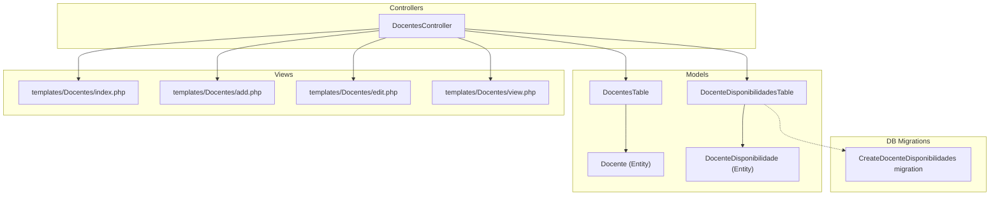
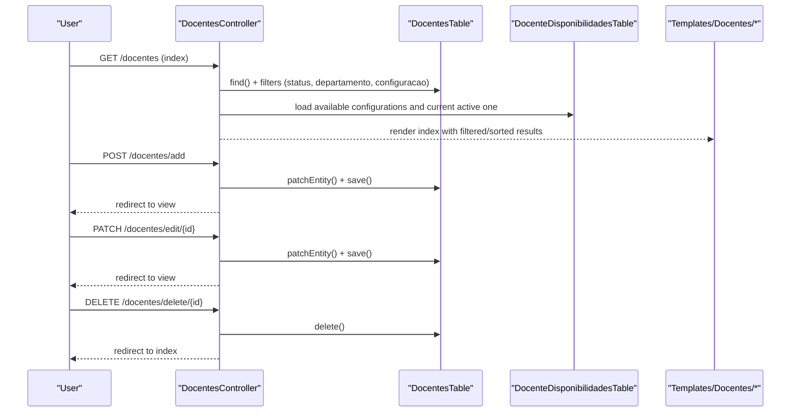
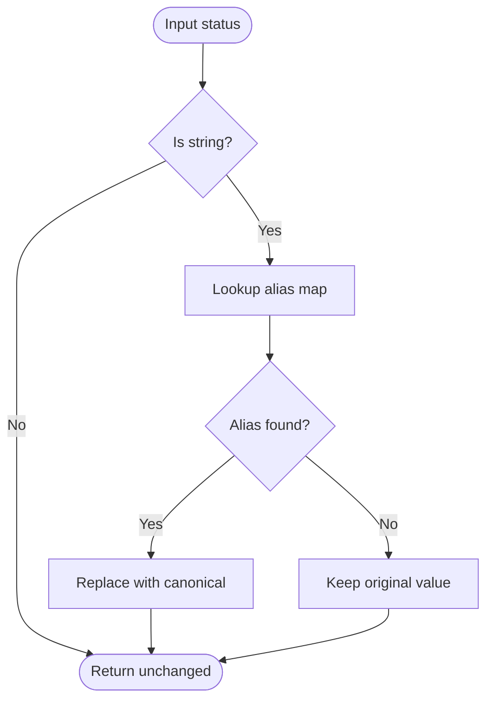
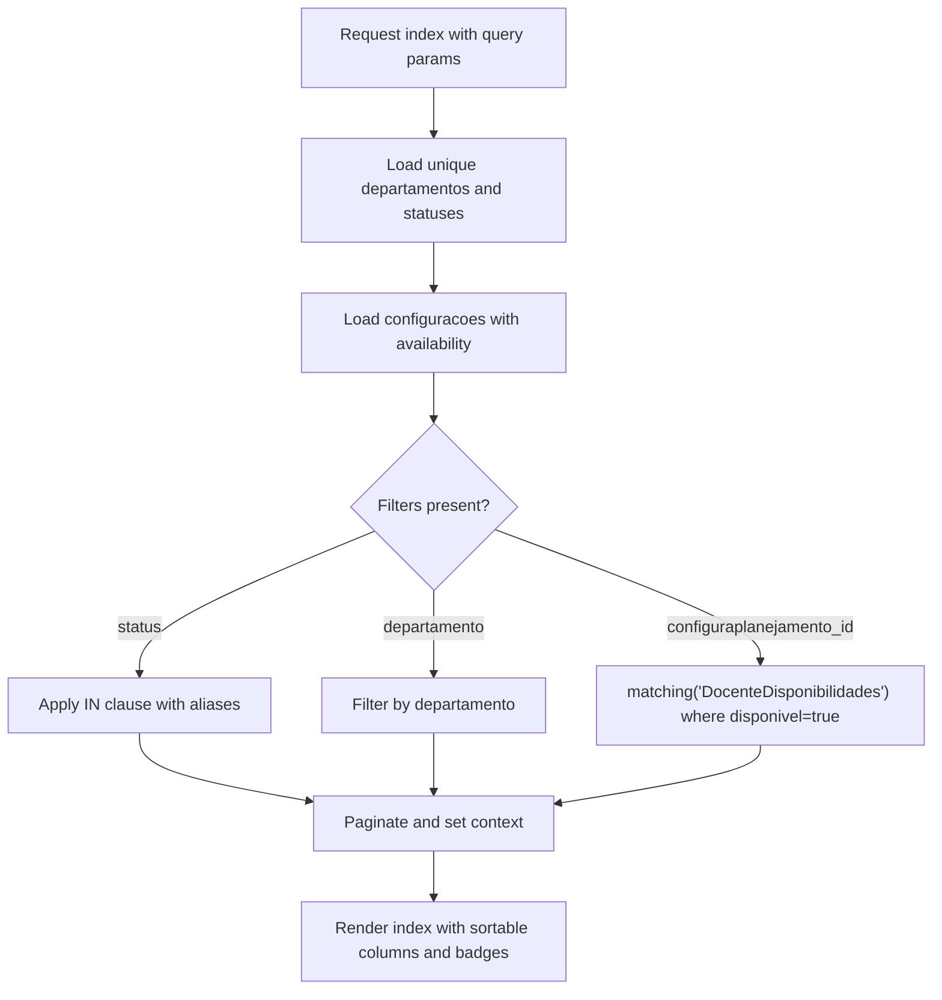
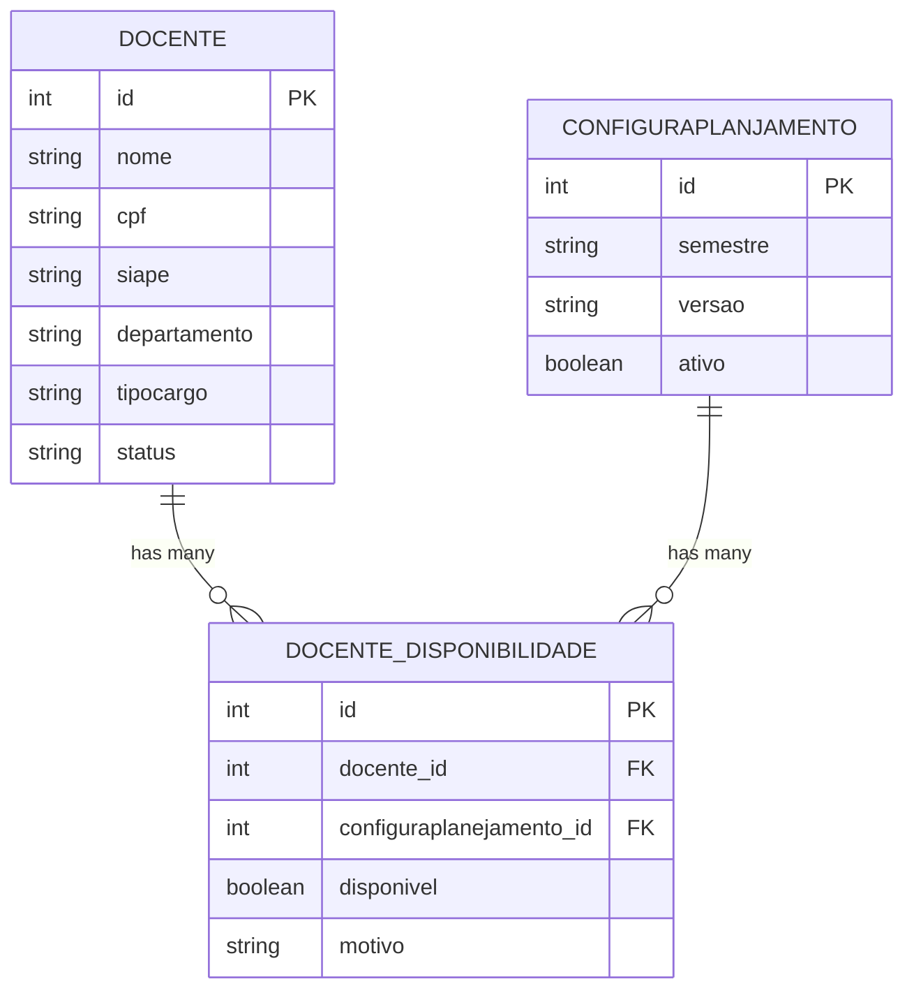
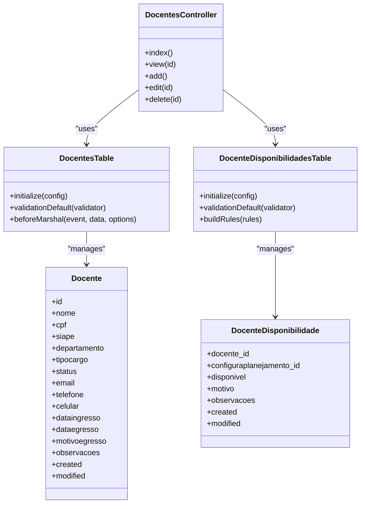

# Faculty Profile Management

<cite>
**Referenced Files in This Document**
- [Docente.php](file://src/Model/Entity/Docente.php)
- [DocentesTable.php](file://src/Model/Table/DocentesTable.php)
- [DocentesController.php](file://src/Controller/DocentesController.php)
- [index.php](file://templates/Docentes/index.php)
- [add.php](file://templates/Docentes/add.php)
- [edit.php](file://templates/Docentes/edit.php)
- [view.php](file://templates/Docentes/view.php)
- [CreateDocenteDisponibilidades.php](file://config/Migrations/20260613100000_CreateDocenteDisponibilidades.php)
- [DocenteDisponibilidade.php](file://src/Model/Entity/DocenteDisponibilidade.php)
- [DocenteDisponibilidadesTable.php](file://src/Model/Table/DocenteDisponibilidadesTable.php)
</cite>

## Table of Contents
1. [Introduction](#introduction)
2. [Project Structure](#project-structure)
3. [Core Components](#core-components)
4. [Architecture Overview](#architecture-overview)
5. [Detailed Component Analysis](#detailed-component-analysis)
6. [Dependency Analysis](#dependency-analysis)
7. [Performance Considerations](#performance-considerations)
8. [Troubleshooting Guide](#troubleshooting-guide)
9. [Conclusion](#conclusion)

## Introduction
This document explains the complete CRUD operations for managing faculty profiles (Docente). It covers:
- The Docente entity structure and fields
- Status management with canonical values and aliases
- Filtering by status, department, and planning availability
- Adding new faculty members, editing existing profiles, and deleting records
- Index page features including sorting and bulk actions via links
- Availability per planning configuration and how it integrates with filtering

The system is implemented using CakePHP conventions with an MVC architecture.

## Project Structure
Faculty profile management spans controllers, models, entities, views, and a related availability table:
- Controller: DocentesController handles index, view, add, edit, delete
- Model: DocentesTable defines validation, relationships, and status normalization
- Entity: Docente defines accessible fields and metadata
- Views: templates/Docentes/* provide UI for listing, viewing, adding, and editing
- Related model: DocenteDisponibilidades manages availability per planning configuration

**Diagram sources**
- [DocentesController.php:1-247](file://src/Controller/DocentesController.php#L1-L247)
- [DocentesTable.php:1-126](file://src/Model/Table/DocentesTable.php#L1-L126)
- [Docente.php:1-57](file://src/Model/Entity/Docente.php#L1-L57)
- [DocenteDisponibilidadesTable.php:1-77](file://src/Model/Table/DocenteDisponibilidadesTable.php#L1-L77)
- [DocenteDisponibilidade.php:1-22](file://src/Model/Entity/DocenteDisponibilidade.php#L1-L22)
- [CreateDocenteDisponibilidades.php:1-48](file://config/Migrations/20260613100000_CreateDocenteDisponibilidades.php#L1-L48)
- [index.php:1-166](file://templates/Docentes/index.php#L1-L166)
- [add.php:1-44](file://templates/Docentes/add.php#L1-L44)
- [edit.php:1-44](file://templates/Docentes/edit.php#L1-L44)
- [view.php:1-153](file://templates/Docentes/view.php#L1-L153)

**Section sources**
- [DocentesController.php:1-247](file://src/Controller/DocentesController.php#L1-L247)
- [DocentesTable.php:1-126](file://src/Model/Table/DocentesTable.php#L1-L126)
- [Docente.php:1-57](file://src/Model/Entity/Docente.php#L1-L57)
- [index.php:1-166](file://templates/Docentes/index.php#L1-L166)
- [add.php:1-44](file://templates/Docentes/add.php#L1-L44)
- [edit.php:1-44](file://templates/Docentes/edit.php#L1-L44)
- [view.php:1-153](file://templates/Docentes/view.php#L1-L153)
- [CreateDocenteDisponibilidades.php:1-48](file://config/Migrations/20260613100000_CreateDocenteDisponibilidades.php#L1-L48)
- [DocenteDisponibilidadesTable.php:1-77](file://src/Model/Table/DocenteDisponibilidadesTable.php#L1-L77)
- [DocenteDisponibilidade.php:1-22](file://src/Model/Entity/DocenteDisponibilidade.php#L1-L22)

## Core Components
- Docente entity: Defines all fields that can be mass-assigned and persisted. Includes identification, contact info, employment details, and status.
- DocentesTable: Provides validation rules, relationships to Planejamento and DocenteDisponibilidade, and status normalization on input.
- DocentesController: Implements full CRUD and advanced filtering on the index action.
- Templates: Provide forms and list views with sorting, pagination, and filters.

Key responsibilities:
- Data integrity through validation rules
- Canonical status handling across inputs and queries
- Filtering by status, department, and availability for a specific planning configuration
- Sorting and pagination on the index page

**Section sources**
- [Docente.php:1-57](file://src/Model/Entity/Docente.php#L1-L57)
- [DocentesTable.php:1-126](file://src/Model/Table/DocentesTable.php#L1-L126)
- [DocentesController.php:1-247](file://src/Controller/DocentesController.php#L1-L247)
- [index.php:1-166](file://templates/Docentes/index.php#L1-L166)
- [add.php:1-44](file://templates/Docentes/add.php#L1-L44)
- [edit.php:1-44](file://templates/Docentes/edit.php#L1-L44)
- [view.php:1-153](file://templates/Docentes/view.php#L1-L153)

## Architecture Overview
The application follows MVC:
- Requests hit DocentesController methods
- Controllers use DocentesTable to query/save data
- Entities represent rows and define accessibility
- Views render lists, forms, and detail pages
- Availability is managed via DocenteDisponibilidades linked to Docente and Configuraplanejamento

**Diagram sources**
- [DocentesController.php:34-171](file://src/Controller/DocentesController.php#L34-L171)
- [DocentesTable.php:26-42](file://src/Model/Table/DocentesTable.php#L26-L42)
- [DocenteDisponibilidadesTable.php:13-30](file://src/Model/Table/DocenteDisponibilidadesTable.php#L13-L30)
- [index.php:1-166](file://templates/Docentes/index.php#L1-L166)
- [add.php:1-44](file://templates/Docentes/add.php#L1-L44)
- [edit.php:1-44](file://templates/Docentes/edit.php#L1-L44)
- [view.php:1-153](file://templates/Docentes/view.php#L1-L153)

## Detailed Component Analysis

### Docente Entity Structure
Fields supported by the entity include:
- Identification: id, nome, cpf, siape, cress, regiao
- Contact: telefone, celular, email
- Employment: dataingresso, tipocargo, departamento, dataegresso, motivoegresso
- Status and notes: status, observacoes
- Audit: created, modified

All these fields are marked accessible for mass assignment.

Status field accepts canonical values and aliases:
- Canonical: ativo, aposentado, inativo
- Aliases normalized to canonical: active/activo -> ativo; retired -> aposentado; inactive/inactivo -> inativo

Normalization occurs during marshalling so stored values are always canonical.

**Section sources**
- [Docente.php:1-57](file://src/Model/Entity/Docente.php#L1-L57)
- [DocentesTable.php:15-21](file://src/Model/Table/DocentesTable.php#L15-L21)
- [DocentesTable.php:114-124](file://src/Model/Table/DocentesTable.php#L114-L124)

### Validation Rules
- nome: required on create, scalar, max length
- Email: optional, validated as email when present
- Dates: dataingresso and dataegresso are optional dates
- Other text fields: optional scalars
- status: optional scalar; normalized before persisting

These rules ensure consistent and safe data entry.

**Section sources**
- [DocentesTable.php:47-112](file://src/Model/Table/DocentesTable.php#L47-L112)

### Relationships
- One-to-many to Planejamentos via docente_id
- One-to-many to DocenteDisponibilidades via docente_id

Availability records link each docente to a planning configuration and indicate whether they are available.

**Section sources**
- [DocentesTable.php:35-42](file://src/Model/Table/DocentesTable.php#L35-L42)
- [DocenteDisponibilidadesTable.php:22-30](file://src/Model/Table/DocenteDisponibilidadesTable.php#L22-L30)
- [CreateDocenteDisponibilidades.php:10-45](file://config/Migrations/20260613100000_CreateDocenteDisponibilidades.php#L10-L45)

### Status Management and Aliases
Canonical statuses:
- ativo (active)
- aposentado (retired)
- inativo (inactive)

Aliases accepted from user input or external systems:
- ativo: ["ativo", "active", "activo"]
- aposentado: ["aposentado", "retired"]
- inativo: ["inativo", "inactive", "inactivo"]

Normalization happens in beforeMarshal, ensuring database consistency. Display labels map canonical values to human-friendly strings.

**Diagram sources**
- [DocentesTable.php:114-124](file://src/Model/Table/DocentesTable.php#L114-L124)
- [DocentesTable.php:15-21](file://src/Model/Table/DocentesTable.php#L15-L21)

**Section sources**
- [DocentesTable.php:15-21](file://src/Model/Table/DocentesTable.php#L15-L21)
- [DocentesTable.php:114-124](file://src/Model/Table/DocentesTable.php#L114-L124)
- [DocentesController.php:16-26](file://src/Controller/DocentesController.php#L16-L26)

### Filtering System
Index supports three filters:
- Status: uses canonical values and aliases; displays friendly labels
- Department: exact match against departamento
- Planning availability: shows docentes who have a disponivel=true record for the selected configuraplanejamento

The controller builds a query with optional where clauses and matching joins for availability.

**Diagram sources**
- [DocentesController.php:34-171](file://src/Controller/DocentesController.php#L34-L171)
- [index.php:40-94](file://templates/Docentes/index.php#L40-L94)

**Section sources**
- [DocentesController.php:34-171](file://src/Controller/DocentesController.php#L34-L171)
- [index.php:40-94](file://templates/Docentes/index.php#L40-L94)

### Index Page Features
- Sortable columns: id, nome, siape, departamento, tipocargo, status, email
- Availability column shows Yes/No for the active or selected planning configuration, with optional reason tooltip
- Active filter badges display current filters
- Pagination controls at the bottom

Note: While the prompt mentions periodo_diurno and periodo_noturno, the Docente entity does not include those fields. Availability is modeled via DocenteDisponibilidades instead.

**Section sources**
- [index.php:96-165](file://templates/Docentes/index.php#L96-L165)
- [DocentesController.php:107-123](file://src/Controller/DocentesController.php#L107-L123)

### Add New Faculty Member
- Default status is set to ativo
- Form includes all relevant fields with appropriate types and options
- On successful save, redirects to the view page

Example flow:
- User opens add form
- Submits data
- Controller patches entity, validates, saves
- Flash message displayed and redirect to view

**Section sources**
- [DocentesController.php:183-200](file://src/Controller/DocentesController.php#L183-L200)
- [add.php:1-44](file://templates/Docentes/add.php#L1-L44)

### Edit Existing Profile
- Loads existing record
- Normalizes status for display
- Accepts updates via patch/put/post
- Redirects to view after success

**Section sources**
- [DocentesController.php:213-230](file://src/Controller/DocentesController.php#L213-L230)
- [edit.php:1-44](file://templates/Docentes/edit.php#L1-L44)

### Delete Record
- Requires POST or DELETE method
- Authorizes deletion
- Deletes record and redirects to index with flash messages

**Section sources**
- [DocentesController.php:232-245](file://src/Controller/DocentesController.php#L232-L245)

### Managing Faculty Status Transitions
To change a professor’s status:
- Open the edit form
- Select the desired status (ativo, aposentado, inativo)
- Save changes
- The system normalizes any alias to canonical before saving

Bulk operations:
- The index provides individual delete links per row
- There is no explicit multi-select bulk action implementation in the provided files

**Section sources**
- [DocentesController.php:213-230](file://src/Controller/DocentesController.php#L213-L230)
- [index.php:140-147](file://templates/Docentes/index.php#L140-L147)

### Availability Per Planning Configuration
- Each docente can be marked available or unavailable for a specific planning configuration
- The index can filter docentes who are available for a given configuration
- The view page lists availability records with semester, availability flag, reason, and actions

**Diagram sources**
- [CreateDocenteDisponibilidades.php:10-45](file://config/Migrations/20260613100000_CreateDocenteDisponibilidades.php#L10-L45)
- [DocenteDisponibilidadesTable.php:22-30](file://src/Model/Table/DocenteDisponibilidadesTable.php#L22-L30)
- [DocenteDisponibilidade.php:10-20](file://src/Model/Entity/DocenteDisponibilidade.php#L10-L20)

**Section sources**
- [DocenteDisponibilidadesTable.php:1-77](file://src/Model/Table/DocenteDisponibilidadesTable.php#L1-L77)
- [DocenteDisponibilidade.php:1-22](file://src/Model/Entity/DocenteDisponibilidade.php#L1-L22)
- [CreateDocenteDisponibilidades.php:1-48](file://config/Migrations/20260613100000_CreateDocenteDisponibilidades.php#L1-L48)
- [view.php:100-144](file://templates/Docentes/view.php#L100-L144)

## Dependency Analysis
- DocentesController depends on DocentesTable and DocenteDisponibilidadesTable
- DocentesTable has relationships to Planejamentos and DocenteDisponibilidades
- Views depend on controller-provided variables for rendering filters, lists, and actions

**Diagram sources**
- [DocentesController.php:1-247](file://src/Controller/DocentesController.php#L1-L247)
- [DocentesTable.php:1-126](file://src/Model/Table/DocentesTable.php#L1-L126)
- [Docente.php:1-57](file://src/Model/Entity/Docente.php#L1-L57)
- [DocenteDisponibilidadesTable.php:1-77](file://src/Model/Table/DocenteDisponibilidadesTable.php#L1-L77)
- [DocenteDisponibilidade.php:1-22](file://src/Model/Entity/DocenteDisponibilidade.php#L1-L22)

**Section sources**
- [DocentesController.php:1-247](file://src/Controller/DocentesController.php#L1-L247)
- [DocentesTable.php:1-126](file://src/Model/Table/DocentesTable.php#L1-L126)
- [Docente.php:1-57](file://src/Model/Entity/Docente.php#L1-L57)
- [DocenteDisponibilidadesTable.php:1-77](file://src/Model/Table/DocenteDisponibilidadesTable.php#L1-L77)
- [DocenteDisponibilidade.php:1-22](file://src/Model/Entity/DocenteDisponibilidade.php#L1-L22)

## Performance Considerations
- Use distinct queries to populate dropdowns for departments, statuses, and configurations
- Apply filters early in the query builder to reduce result sets
- Leverage pagination to avoid loading large datasets into memory
- Avoid unnecessary contains in index; only fetch what is needed for display
- Ensure indexes exist on foreign keys and frequently filtered columns (e.g., status, departamento, configuraplanejamento_id)

[No sources needed since this section provides general guidance]

## Troubleshooting Guide
Common issues and resolutions:
- Status not saved as expected: Verify that input values are recognized aliases; the system normalizes them to canonical values during marshalling.
- Filter not returning results: Confirm that the selected planning configuration has availability records with disponivel=true for the intended docentes.
- Validation errors on submit: Check required fields like nome and ensure email format if provided.
- Missing availability information: Ensure availability records exist for the selected configuration; otherwise, the index will show “Not informed.”

**Section sources**
- [DocentesTable.php:114-124](file://src/Model/Table/DocentesTable.php#L114-L124)
- [DocentesController.php:88-105](file://src/Controller/DocentesController.php#L88-L105)
- [index.php:125-137](file://templates/Docentes/index.php#L125-L137)

## Conclusion
The faculty profile management module provides robust CRUD capabilities for docentes, with strong validation, canonical status handling, and flexible filtering by status, department, and planning availability. The index page supports sorting and pagination, while the view page exposes availability per planning configuration. The design cleanly separates concerns across controller, model, entity, and template layers, making maintenance and extension straightforward.

[No sources needed since this section summarizes without analyzing specific files]