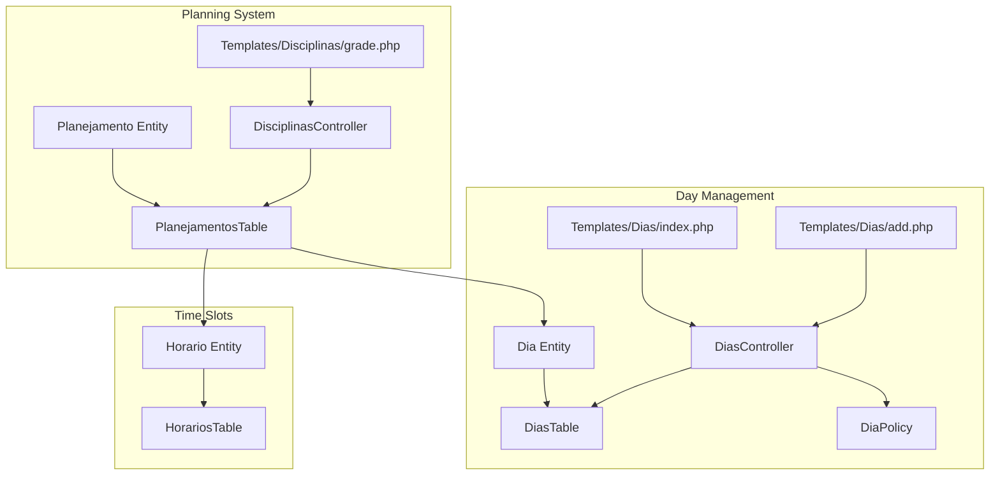
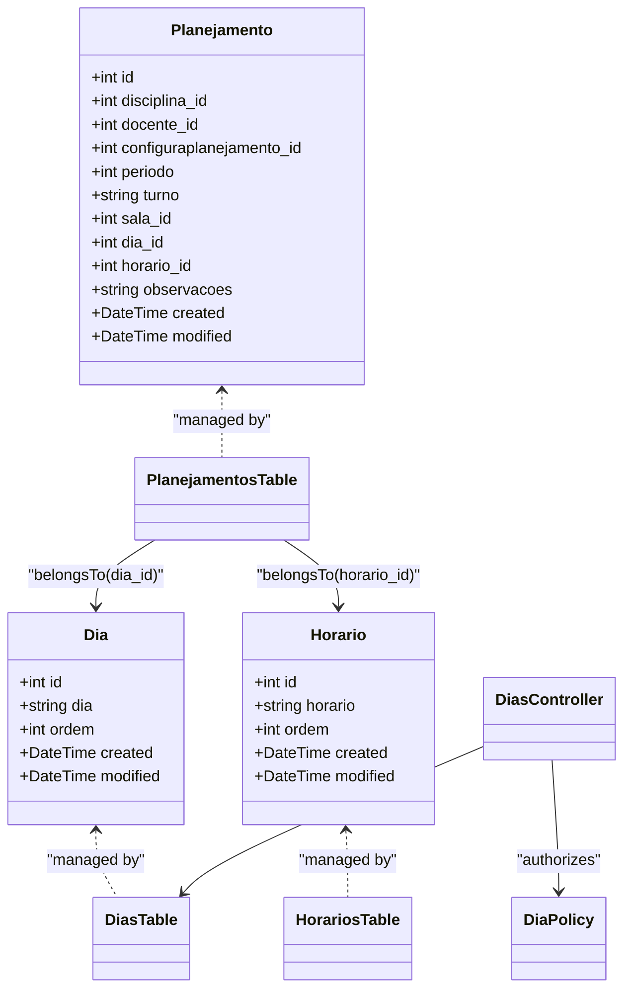
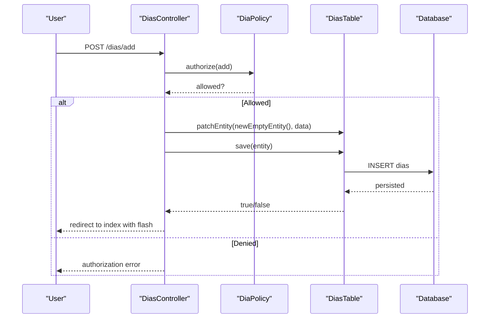
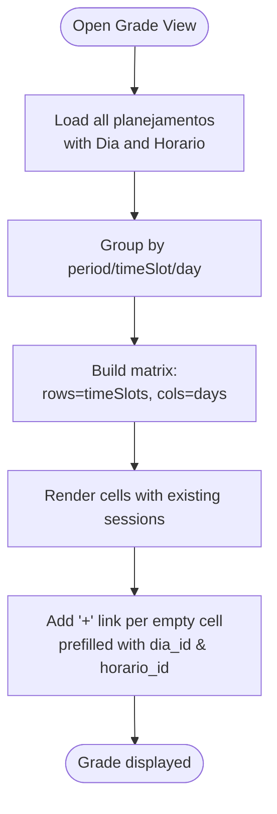
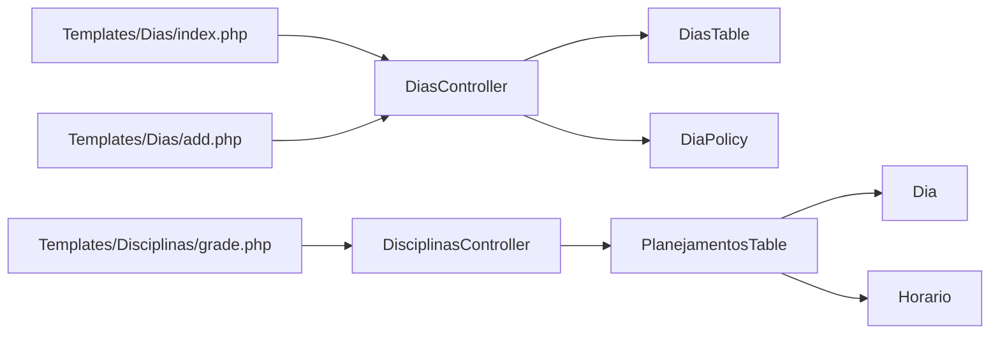

# Day Management

<cite>
**Referenced Files in This Document**
- [Dia.php](file://src/Model/Entity/Dia.php)
- [DiasTable.php](file://src/Model/Table/DiasTable.php)
- [20260612030430_CreateDias.php](file://config/Migrations/20260612030430_CreateDias.php)
- [DiasController.php](file://src/Controller/DiasController.php)
- [DiaPolicy.php](file://src/Policy/DiaPolicy.php)
- [index.php (Dias)](file://templates/Dias/index.php)
- [add.php (Dias)](file://templates/Dias/add.php)
- [Horario.php](file://src/Model/Entity/Horario.php)
- [HorariosTable.php](file://src/Model/Table/HorariosTable.php)
- [20260612030431_CreateHorarios.php](file://config/Migrations/20260612030431_CreateHorarios.php)
- [PlanejamentosTable.php](file://src/Model/Table/PlanejamentosTable.php)
- [Planejamento.php](file://src/Model/Entity/Planejamento.php)
- [DisciplinasController.php](file://src/Controller/DisciplinasController.php)
- [grade.php (Disciplinas)](file://templates/Disciplinas/grade.php)
</cite>

## Table of Contents
1. Introduction
2. Project Structure
3. Core Components
4. Architecture Overview
5. Detailed Component Analysis
6. Dependency Analysis
7. Performance Considerations
8. Troubleshooting Guide
9. Conclusion
10. Appendices

## Introduction
This document explains day-of-week management (Dias) within the scheduling system. It covers the Dia entity structure, its role and relationships, CRUD operations via DiasController, authorization policies, validation rules, and how days combine with time slots to form complete scheduling slots used by the planning system. Practical examples are provided for configuring weekly schedules, managing available days, and resolving conflicts through proper day-time slot combinations.

## Project Structure
The day management feature spans model, controller, policy, templates, and migrations:
- Data model: Dia entity and Dias table define the day definition and ordering.
- API surface: DiasController exposes index, view, add, edit, delete actions.
- Authorization: DiaPolicy restricts write operations to administrators.
- UI: Templates render listing and creation forms.
- Integration: The main planning system references days and time slots to build schedules.

**Diagram sources**
- [Dia.php:1-31](file://src/Model/Entity/Dia.php#L1-L31)
- [DiasTable.php:1-65](file://src/Model/Table/DiasTable.php#L1-L65)
- [DiasController.php:1-121](file://src/Controller/DiasController.php#L1-L121)
- [DiaPolicy.php:1-36](file://src/Policy/DiaPolicy.php#L1-L36)
- [index.php (Dias):1-55](file://templates/Dias/index.php#L1-L55)
- [add.php (Dias):1-17](file://templates/Dias/add.php#L1-L17)
- [Horario.php:1-31](file://src/Model/Entity/Horario.php#L1-L31)
- [HorariosTable.php:1-65](file://src/Model/Table/HorariosTable.php#L1-L65)
- [PlanejamentosTable.php:1-57](file://src/Model/Table/PlanejamentosTable.php#L1-L57)
- [Planejamento.php:1-27](file://src/Model/Entity/Planejamento.php#L1-L27)
- [DisciplinasController.php:92-143](file://src/Controller/DisciplinasController.php#L92-L143)
- [grade.php (Disciplinas):45-62](file://templates/Disciplinas/grade.php#L45-L62)

**Section sources**
- [Dia.php:1-31](file://src/Model/Entity/Dia.php#L1-L31)
- [DiasTable.php:1-65](file://src/Model/Table/DiasTable.php#L1-L65)
- [DiasController.php:1-121](file://src/Controller/DiasController.php#L1-L121)
- [DiaPolicy.php:1-36](file://src/Policy/DiaPolicy.php#L1-L36)
- [index.php (Dias):1-55](file://templates/Dias/index.php#L1-L55)
- [add.php (Dias):1-17](file://templates/Dias/add.php#L1-L17)
- [Horario.php:1-31](file://src/Model/Entity/Horario.php#L1-L31)
- [HorariosTable.php:1-65](file://src/Model/Table/HorariosTable.php#L1-L65)
- [PlanejamentosTable.php:1-57](file://src/Model/Table/PlanejamentosTable.php#L1-L57)
- [Planejamento.php:1-27](file://src/Model/Entity/Planejamento.php#L1-L27)
- [DisciplinasController.php:92-143](file://src/Controller/DisciplinasController.php#L92-L143)
- [grade.php (Disciplinas):45-62](file://templates/Disciplinas/grade.php#L45-L62)

## Core Components
- Dia entity: Represents a day-of-week entry with fields for display name and order.
- DiasTable: Configures table mapping, primary key, display field, timestamp behavior, and validation rules.
- DiasController: Implements CRUD endpoints with authentication and authorization controls.
- DiaPolicy: Restricts add/edit/delete to admin users; allows public read access.
- Horario entities/tables: Represent time slots that pair with days to create schedule cells.
- Planejamento integration: The planning model links to both Dia and Horario to define concrete class sessions.

Key responsibilities:
- Dia: Data carrier for day definitions.
- DiasTable: Persistence and validation for days.
- DiasController: HTTP interface for managing days.
- DiaPolicy: Role-based authorization.
- Horario: Time slot definition.
- Planejamento: Combines Dia + Horario (+ other context) into a scheduled session.

**Section sources**
- [Dia.php:1-31](file://src/Model/Entity/Dia.php#L1-L31)
- [DiasTable.php:1-65](file://src/Model/Table/DiasTable.php#L1-L65)
- [DiasController.php:1-121](file://src/Controller/DiasController.php#L1-L121)
- [DiaPolicy.php:1-36](file://src/Policy/DiaPolicy.php#L1-L36)
- [Horario.php:1-31](file://src/Model/Entity/Horario.php#L1-L31)
- [HorariosTable.php:1-65](file://src/Model/Table/HorariosTable.php#L1-L65)
- [PlanejamentosTable.php:1-57](file://src/Model/Table/PlanejamentosTable.php#L1-L57)
- [Planejamento.php:1-27](file://src/Model/Entity/Planejamento.php#L1-L27)

## Architecture Overview
Days and time slots are independent reference lists. The planning system composes them into concrete schedule entries. The grade view organizes sessions by period, time slot, and day.

**Diagram sources**
- [Dia.php:1-31](file://src/Model/Entity/Dia.php#L1-L31)
- [Horario.php:1-31](file://src/Model/Entity/Horario.php#L1-L31)
- [Planejamento.php:1-27](file://src/Model/Entity/Planejamento.php#L1-L27)
- [DiasTable.php:1-65](file://src/Model/Table/DiasTable.php#L1-L65)
- [HorariosTable.php:1-65](file://src/Model/Table/HorariosTable.php#L1-L65)
- [PlanejamentosTable.php:1-57](file://src/Model/Table/PlanejamentosTable.php#L1-L57)
- [DiasController.php:1-121](file://src/Controller/DiasController.php#L1-L121)
- [DiaPolicy.php:1-36](file://src/Policy/DiaPolicy.php#L1-L36)

## Detailed Component Analysis

### Dia Entity and Data Model
- Fields:
  - id: Primary key.
  - dia: Display name for the day (e.g., Monday).
  - ordem: Sorting order for consistent presentation.
  - created/modified: Timestamps managed by the Timestamp behavior.
- Validation:
  - dia: required on create, non-empty string, max length 50.
  - ordem: required on create, integer, non-empty.
- Database schema:
  - dias table includes dia (string), ordem (integer), created, modified.

Practical implications:
- Use ordem to control the sequence of days in UIs and grids.
- Keep dia values unique per institution semantics (enforced at application level if needed).

**Section sources**
- [Dia.php:1-31](file://src/Model/Entity/Dia.php#L1-L31)
- [DiasTable.php:49-63](file://src/Model/Table/DiasTable.php#L49-L63)
- [20260612030430_CreateDias.php:16-38](file://config/Migrations/20260612030430_CreateDias.php#L16-L38)

### DiasController: CRUD and Authorization
- beforeFilter:
  - Allows unauthenticated access to index and view.
- Actions:
  - index: Lists days with pagination; skips authorization.
  - view: Retrieves a single day; skips authorization.
  - add: Authorizes add, patches entity from request data, saves, flashes success/error, redirects.
  - edit: Authorizes edit, patches entity, saves, redirects.
  - delete: Authorizes delete, deletes record, redirects.
- Flash messages:
  - Success and error notifications guide user feedback.

Authorization:
- DiaPolicy enforces admin-only for add/edit/delete; read is open.

**Section sources**
- [DiasController.php:19-25](file://src/Controller/DiasController.php#L19-L25)
- [DiasController.php:32-39](file://src/Controller/DiasController.php#L32-L39)
- [DiasController.php:48-53](file://src/Controller/DiasController.php#L48-L53)
- [DiasController.php:60-74](file://src/Controller/DiasController.php#L60-L74)
- [DiasController.php:83-97](file://src/Controller/DiasController.php#L83-L97)
- [DiasController.php:106-119](file://src/Controller/DiasController.php#L106-L119)
- [DiaPolicy.php:11-34](file://src/Policy/DiaPolicy.php#L11-L34)

#### Sequence: Add a New Day

**Diagram sources**
- [DiasController.php:60-74](file://src/Controller/DiasController.php#L60-L74)
- [DiaPolicy.php:21-24](file://src/Policy/DiaPolicy.php#L21-L24)
- [DiasTable.php:33-41](file://src/Model/Table/DiasTable.php#L33-L41)

### Time Slots (Horario) and Combination with Days
- Horario entity mirrors Dia with fields for display name and order.
- Migrations define horarios table similarly to dias.
- Planning entries link to both Dia and Horario to represent a specific class session.

Integration patterns:
- Grade view builds a matrix where rows are time slots and columns are days.
- Each cell may contain one or more Planejamento entries.

**Section sources**
- [Horario.php:1-31](file://src/Model/Entity/Horario.php#L1-L31)
- [HorariosTable.php:1-65](file://src/Model/Table/HorariosTable.php#L1-L65)
- [20260612030431_CreateHorarios.php:16-38](file://config/Migrations/20260612030431_CreateHorarios.php#L16-L38)
- [PlanejamentosTable.php:34-39](file://src/Model/Table/PlanejamentosTable.php#L34-L39)
- [grade.php (Disciplinas):45-62](file://templates/Disciplinas/grade.php#L45-L62)

### Planning Integration: How Days Combine with Time Slots
- Planejamento entity holds foreign keys dia_id and horario_id.
- PlanejamentosTable defines belongsTo relationships to Dias and Horarios.
- DisciplinasController loads days and time slots ordered by ordem and groups sessions by period and time slot.
- The grade template uses dia and horario IDs to populate grid cells and provide quick-add links pre-filled with dia_id and horario_id.

**Diagram sources**
- [PlanejamentosTable.php:34-39](file://src/Model/Table/PlanejamentosTable.php#L34-L39)
- [DisciplinasController.php:92-143](file://src/Controller/DisciplinasController.php#L92-L143)
- [grade.php (Disciplinas):45-62](file://templates/Disciplinas/grade.php#L45-L62)

### Business Constraints and Validation Rules
- Day definition constraints:
  - dia must be present and non-empty on create, up to 50 characters.
  - ordem must be present and integer on create.
- Scheduling constraints (application-level):
  - A valid schedule requires both dia_id and horario_id.
  - The grade logic filters out entries missing either dimension.
  - Period grouping depends on discipline’s diurnal/nocturnal periods and predefined time slot ranges.

Operational guidance:
- Ensure ordem values reflect desired calendar order.
- Maintain distinct dia names to avoid ambiguity in UI.
- When adding sessions, always select both a day and a time slot to appear in the grade.

**Section sources**
- [DiasTable.php:49-63](file://src/Model/Table/DiasTable.php#L49-L63)
- [DisciplinasController.php:113-132](file://src/Controller/DisciplinasController.php#L113-L132)
- [grade.php (Disciplinas):45-62](file://templates/Disciplinas/grade.php#L45-L62)

### Practical Examples

- Configure weekly schedule:
  - Create days with appropriate ordem values (e.g., Monday=1, Tuesday=2, etc.).
  - Create time slots with ordem reflecting chronological order.
  - In the grade view, add sessions by clicking “+” in the desired day-time cell; the form will be pre-filled with dia_id and horario_id.

- Manage available days:
  - Admins can add/edit/delete days via DiasController.
  - Non-admins can list and view days but cannot modify.

- Resolve scheduling conflicts:
  - If two sessions share the same dia_id and horario_id, they conflict.
  - Adjust one session’s dia_id or horario_id to a different slot.
  - Use the grade view to visually detect overlaps and move sessions accordingly.

[No sources needed since this section provides practical usage guidance]

## Dependency Analysis
- Controller-to-table dependencies:
  - DiasController depends on DiasTable for persistence and on DiaPolicy for authorization.
- Model relationships:
  - PlanejamentosTable belongsTo Dias and Horarios.
- UI dependencies:
  - Templates rely on controller-provided variables and Cake helpers.

**Diagram sources**
- [DiasController.php:1-121](file://src/Controller/DiasController.php#L1-L121)
- [DiasTable.php:1-65](file://src/Model/Table/DiasTable.php#L1-L65)
- [DiaPolicy.php:1-36](file://src/Policy/DiaPolicy.php#L1-L36)
- [PlanejamentosTable.php:1-57](file://src/Model/Table/PlanejamentosTable.php#L1-L57)
- [index.php (Dias):1-55](file://templates/Dias/index.php#L1-L55)
- [add.php (Dias):1-17](file://templates/Dias/add.php#L1-L17)
- [DisciplinasController.php:92-143](file://src/Controller/DisciplinasController.php#L92-L143)
- [grade.php (Disciplinas):45-62](file://templates/Disciplinas/grade.php#L45-L62)

**Section sources**
- [DiasController.php:1-121](file://src/Controller/DiasController.php#L1-L121)
- [DiasTable.php:1-65](file://src/Model/Table/DiasTable.php#L1-L65)
- [DiaPolicy.php:1-36](file://src/Policy/DiaPolicy.php#L1-L36)
- [PlanejamentosTable.php:1-57](file://src/Model/Table/PlanejamentosTable.php#L1-L57)
- [index.php (Dias):1-55](file://templates/Dias/index.php#L1-L55)
- [add.php (Dias):1-17](file://templates/Dias/add.php#L1-L17)
- [DisciplinasController.php:92-143](file://src/Controller/DisciplinasController.php#L92-L143)
- [grade.php (Disciplinas):45-62](file://templates/Disciplinas/grade.php#L45-L62)

## Performance Considerations
- Pagination: DiasController uses pagination for efficient listing of days.
- Ordering: Use ordem to minimize sorting overhead in views.
- Containment: When building the grade, ensure contains only necessary associations to reduce query load.
- Indexing: Consider database indexes on frequently filtered fields such as ordem and foreign keys in related tables.

[No sources needed since this section provides general guidance]

## Troubleshooting Guide
- Cannot add/edit/delete a day:
  - Verify your role is admin; DiaPolicy restricts these actions to admins.
- Day not appearing in the grade:
  - Ensure the session has both dia_id and horario_id set.
  - Confirm the day exists and has a valid ordem value.
- Duplicate or misordered days:
  - Check ordem values for uniqueness and correct sequence.
- Validation errors when saving:
  - dia must be non-empty and within length limits.
  - ordem must be an integer and present on create.

**Section sources**
- [DiaPolicy.php:21-34](file://src/Policy/DiaPolicy.php#L21-L34)
- [DiasTable.php:49-63](file://src/Model/Table/DiasTable.php#L49-L63)
- [DisciplinasController.php:113-132](file://src/Controller/DisciplinasController.php#L113-L132)

## Conclusion
The Dia entity and DiasController provide a robust foundation for managing days-of-week in the scheduling system. Combined with time slots (Horario), they enable precise construction of weekly schedules via Planejamento entries. Clear validation rules and admin-only authorization ensure data integrity and security. Using the grade view, administrators can efficiently configure and resolve scheduling conflicts by selecting appropriate day-time combinations.

[No sources needed since this section summarizes without analyzing specific files]

## Appendices

### API Summary: DiasController Actions
- GET /dias/index: List days (public).
- GET /dias/view/:id: View a day (public).
- POST /dias/add: Create a new day (admin).
- PATCH/POST/PUT /dias/edit/:id: Update a day (admin).
- POST/DELETE /dias/delete/:id: Delete a day (admin).

**Section sources**
- [DiasController.php:19-25](file://src/Controller/DiasController.php#L19-L25)
- [DiasController.php:32-39](file://src/Controller/DiasController.php#L32-L39)
- [DiasController.php:48-53](file://src/Controller/DiasController.php#L48-L53)
- [DiasController.php:60-74](file://src/Controller/DiasController.php#L60-L74)
- [DiasController.php:83-97](file://src/Controller/DiasController.php#L83-L97)
- [DiasController.php:106-119](file://src/Controller/DiasController.php#L106-L119)
- [DiaPolicy.php:11-34](file://src/Policy/DiaPolicy.php#L11-L34)