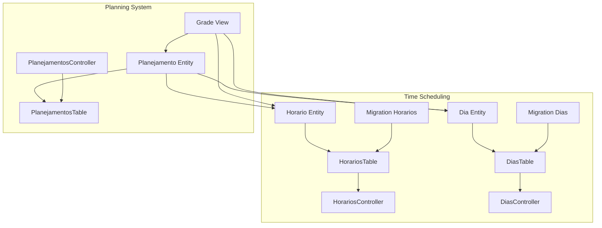
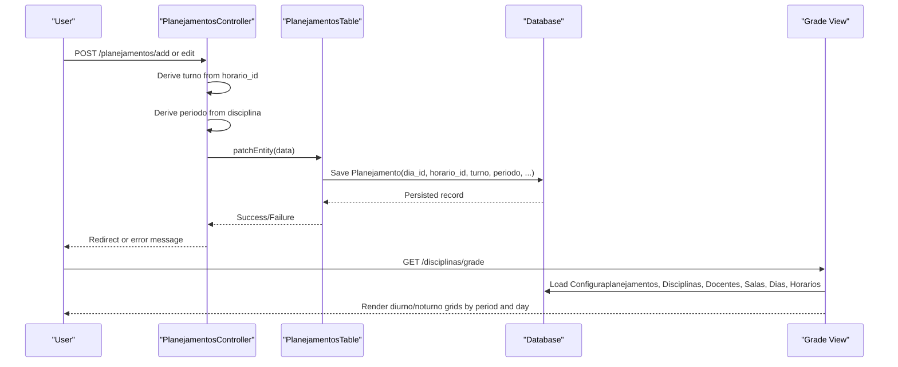
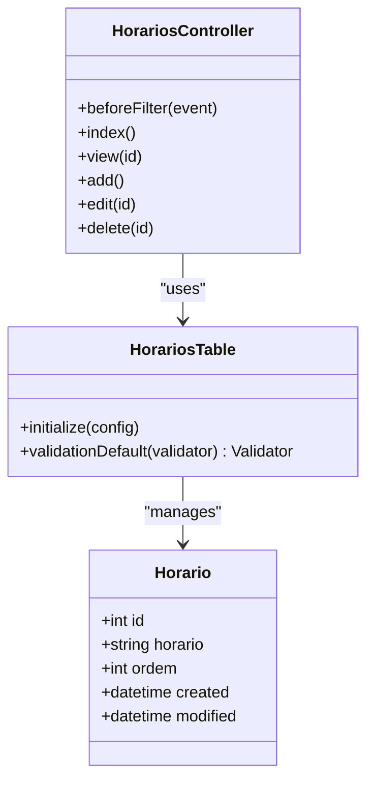
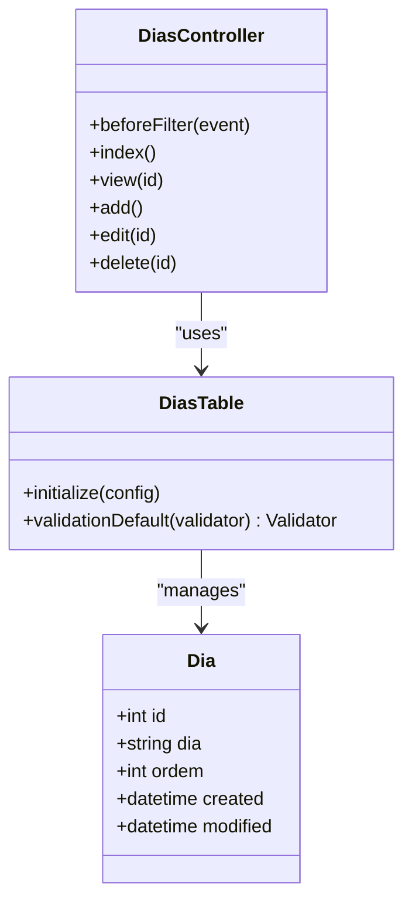
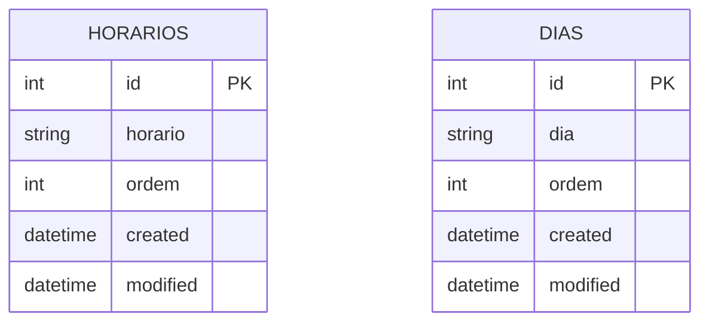
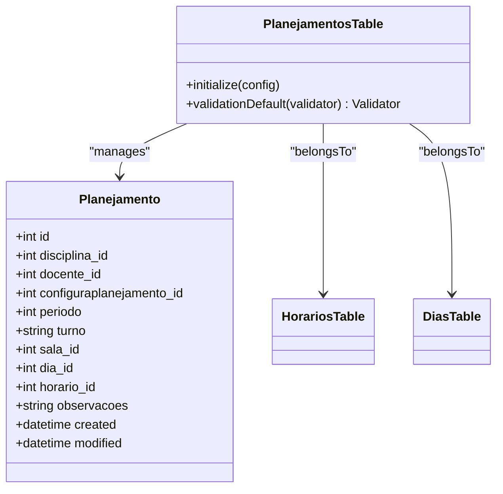
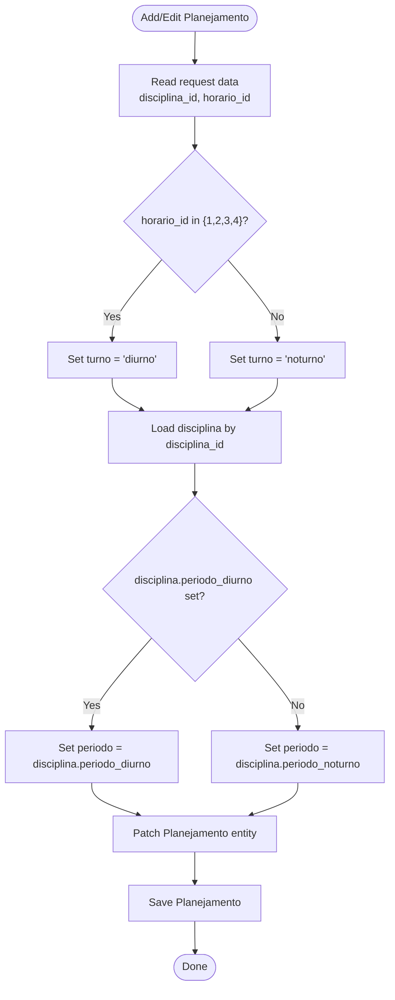
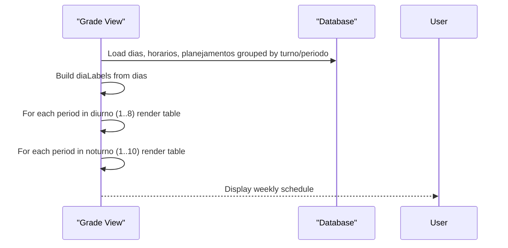
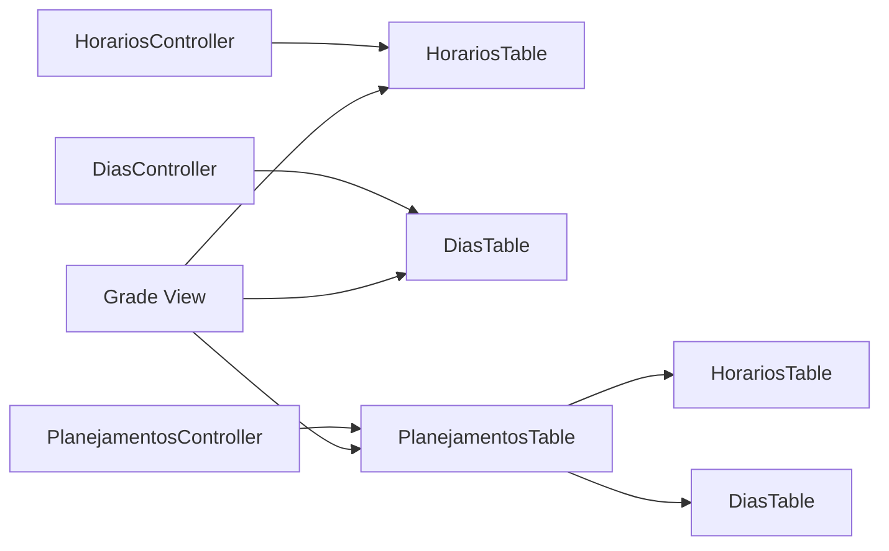

# Time Scheduling System

<cite>
**Referenced Files in This Document**
- [Horario.php](file://src/Model/Entity/Horario.php)
- [Dia.php](file://src/Model/Entity/Dia.php)
- [HorariosTable.php](file://src/Model/Table/HorariosTable.php)
- [DiasTable.php](file://src/Model/Table/DiasTable.php)
- [CreateHorarios.php](file://config/Migrations/20260612030431_CreateHorarios.php)
- [CreateDias.php](file://config/Migrations/20260612030430_CreateDias.php)
- [HorariosController.php](file://src/Controller/HorariosController.php)
- [DiasController.php](file://src/Controller/DiasController.php)
- [Planejamento.php](file://src/Model/Entity/Planejamento.php)
- [PlanejamentosTable.php](file://src/Model/Table/PlanejamentosTable.php)
- [PlanejamentosController.php](file://src/Controller/PlanejamentosController.php)
- [grade.php](file://templates/Disciplinas/grade.php)
</cite>

## Table of Contents
1. [Introduction](#introduction)
2. [Project Structure](#project-structure)
3. [Core Components](#core-components)
4. [Architecture Overview](#architecture-overview)
5. [Detailed Component Analysis](#detailed-component-analysis)
6. [Dependency Analysis](#dependency-analysis)
7. [Performance Considerations](#performance-considerations)
8. [Troubleshooting Guide](#troubleshooting-guide)
9. [Conclusion](#conclusion)

## Introduction
This document explains the time scheduling system focused on time slots (Horarios) and days of the week (Dias), and how they combine to form complete scheduling slots within the planning system. It covers entity structures, validation rules, automatic assignment of turn (shift) and period, integration points with the main scheduling entities, and guidance for configuring time periods and managing weekly schedules. It also addresses conflict detection mechanisms and best practices for resolving scheduling conflicts.

## Project Structure
The time scheduling system is implemented using CakePHP conventions:
- Entities define data models for Horario and Dia.
- Tables provide ORM configuration and validation.
- Controllers expose CRUD operations and integrate with authorization/authentication.
- Migrations define database schema for horarios and dias tables.
- The main scheduling entity Planejamento links to Dias and Horarios to represent a concrete class session.
- Views render the schedule grid by grouping into morning (diurno) and evening (noturno) shifts.

**Diagram sources**
- [Horario.php:1-31](file://src/Model/Entity/Horario.php#L1-L31)
- [Dia.php:1-31](file://src/Model/Entity/Dia.php#L1-L31)
- [HorariosTable.php:1-65](file://src/Model/Table/HorariosTable.php#L1-L65)
- [DiasTable.php:1-65](file://src/Model/Table/DiasTable.php#L1-L65)
- [HorariosController.php:1-121](file://src/Controller/HorariosController.php#L1-L121)
- [DiasController.php:1-121](file://src/Controller/DiasController.php#L1-L121)
- [CreateHorarios.php:1-40](file://config/Migrations/20260612030431_CreateHorarios.php#L1-L40)
- [CreateDias.php:1-40](file://config/Migrations/20260612030430_CreateDias.php#L1-L40)
- [Planejamento.php:1-27](file://src/Model/Entity/Planejamento.php#L1-L27)
- [PlanejamentosTable.php:1-57](file://src/Model/Table/PlanejamentosTable.php#L1-L57)
- [PlanejamentosController.php:1-256](file://src/Controller/PlanejamentosController.php#L1-L256)
- [grade.php:1-128](file://templates/Disciplinas/grade.php#L1-L128)

**Section sources**
- [Horario.php:1-31](file://src/Model/Entity/Horario.php#L1-L31)
- [Dia.php:1-31](file://src/Model/Entity/Dia.php#L1-L31)
- [HorariosTable.php:1-65](file://src/Model/Table/HorariosTable.php#L1-L65)
- [DiasTable.php:1-65](file://src/Model/Table/DiasTable.php#L1-L65)
- [CreateHorarios.php:1-40](file://config/Migrations/20260612030431_CreateHorarios.php#L1-L40)
- [CreateDias.php:1-40](file://config/Migrations/20260612030430_CreateDias.php#L1-L40)
- [HorariosController.php:1-121](file://src/Controller/HorariosController.php#L1-L121)
- [DiasController.php:1-121](file://src/Controller/DiasController.php#L1-L121)
- [Planejamento.php:1-27](file://src/Model/Entity/Planejamento.php#L1-L27)
- [PlanejamentosTable.php:1-57](file://src/Model/Table/PlanejamentosTable.php#L1-L57)
- [PlanejamentosController.php:1-256](file://src/Controller/PlanejamentosController.php#L1-L256)
- [grade.php:1-128](file://templates/Disciplinas/grade.php#L1-L128)

## Core Components
- Horario (time slot): Represents a time period entry with an identifier, a human-readable label, and an ordering field used to sort periods.
- Dia (day of week): Represents a day-of-week entry with an identifier, a human-readable label, and an ordering field used to sort weekdays.
- Planejamento (planning record): Links a course, teacher, room, day, and time slot; includes derived fields turno (shift) and periodo (period).

Key behaviors:
- Automatic turno assignment based on horario_id ranges: IDs 1–4 map to diurno (morning), IDs 5+ map to noturno (evening).
- Automatic periodo assignment based on the selected disciplina’s configured period preference.

Validation:
- Both Horario and Dia require presence and non-empty string values for their labels and integer values for ordering.

Integration:
- Planejamento has belongsTo relationships to Dias and Horarios, enabling full scheduling slots when combined.

**Section sources**
- [Horario.php:1-31](file://src/Model/Entity/Horario.php#L1-L31)
- [Dia.php:1-31](file://src/Model/Entity/Dia.php#L1-L31)
- [HorariosTable.php:49-63](file://src/Model/Table/HorariosTable.php#L49-L63)
- [DiasTable.php:49-63](file://src/Model/Table/DiasTable.php#L49-L63)
- [Planejamento.php:1-27](file://src/Model/Entity/Planejamento.php#L1-L27)
- [PlanejamentosTable.php:34-40](file://src/Model/Table/PlanejamentosTable.php#L34-L40)
- [PlanejamentosController.php:100-114](file://src/Controller/PlanejamentosController.php#L100-L114)
- [PlanejamentosController.php:146-160](file://src/Controller/PlanejamentosController.php#L146-L160)

## Architecture Overview
The scheduling architecture centers around two reference datasets (dias and horarios) that are combined with Planejamento records to produce a weekly timetable. The view layer renders separate grids for diurno and noturno shifts, iterating over periods and days.

**Diagram sources**
- [PlanejamentosController.php:98-127](file://src/Controller/PlanejamentosController.php#L98-L127)
- [PlanejamentosController.php:144-173](file://src/Controller/PlanejamentosController.php#L144-L173)
- [PlanejamentosTable.php:11-40](file://src/Model/Table/PlanejamentosTable.php#L11-L40)
- [grade.php:119-127](file://templates/Disciplinas/grade.php#L119-L127)

## Detailed Component Analysis

### Horario (Time Slot) Entity and Table
- Fields: id, horario (label), ordem (ordering), timestamps.
- Validation enforces required scalar label and integer ordering.
- Controller provides public index/view and admin-only add/edit/delete via policy.

**Diagram sources**
- [Horario.php:1-31](file://src/Model/Entity/Horario.php#L1-L31)
- [HorariosTable.php:33-63](file://src/Model/Table/HorariosTable.php#L33-L63)
- [HorariosController.php:19-121](file://src/Controller/HorariosController.php#L19-L121)

**Section sources**
- [Horario.php:1-31](file://src/Model/Entity/Horario.php#L1-L31)
- [HorariosTable.php:33-63](file://src/Model/Table/HorariosTable.php#L33-L63)
- [HorariosController.php:19-121](file://src/Controller/HorariosController.php#L19-L121)

### Dia (Day of Week) Entity and Table
- Fields: id, dia (label), ordem (ordering), timestamps.
- Validation enforces required scalar label and integer ordering.
- Controller provides public index/view and admin-only add/edit/delete via policy.

**Diagram sources**
- [Dia.php:1-31](file://src/Model/Entity/Dia.php#L1-L31)
- [DiasTable.php:33-63](file://src/Model/Table/DiasTable.php#L33-L63)
- [DiasController.php:19-121](file://src/Controller/DiasController.php#L19-L121)

**Section sources**
- [Dia.php:1-31](file://src/Model/Entity/Dia.php#L1-L31)
- [DiasTable.php:33-63](file://src/Model/Table/DiasTable.php#L33-L63)
- [DiasController.php:19-121](file://src/Controller/DiasController.php#L19-L121)

### Database Schema for Horarios and Dias
- horarios table: id, horario (string), ordem (integer), created, modified.
- dias table: id, dia (string), ordem (integer), created, modified.

**Diagram sources**
- [CreateHorarios.php:16-38](file://config/Migrations/20260612030431_CreateHorarios.php#L16-L38)
- [CreateDias.php:16-38](file://config/Migrations/20260612030430_CreateDias.php#L16-L38)

**Section sources**
- [CreateHorarios.php:16-38](file://config/Migrations/20260612030431_CreateHorarios.php#L16-L38)
- [CreateDias.php:16-38](file://config/Migrations/20260612030430_CreateDias.php#L16-L38)

### Integration with Planejamento (Scheduling Slots)
- Planejamento links to Dias and Horarios via foreign keys and contains additional fields like turno and periodo.
- Relationships are declared in PlanejamentosTable.

**Diagram sources**
- [Planejamento.php:1-27](file://src/Model/Entity/Planejamento.php#L1-L27)
- [PlanejamentosTable.php:11-40](file://src/Model/Table/PlanejamentosTable.php#L11-L40)

**Section sources**
- [Planejamento.php:1-27](file://src/Model/Entity/Planejamento.php#L1-L27)
- [PlanejamentosTable.php:11-40](file://src/Model/Table/PlanejamentosTable.php#L11-L40)

### Automatic Turn and Period Assignment Logic
- Turno derivation: If horario_id is in {1, 2, 3, 4}, then turno = diurno; otherwise turno = noturno.
- Periodo derivation: Based on the selected disciplina’s preferred period (periodo_diurno if set, else periodo_noturno).

**Diagram sources**
- [PlanejamentosController.php:98-127](file://src/Controller/PlanejamentosController.php#L98-L127)
- [PlanejamentosController.php:144-173](file://src/Controller/PlanejamentosController.php#L144-L173)

**Section sources**
- [PlanejamentosController.php:98-127](file://src/Controller/PlanejamentosController.php#L98-L127)
- [PlanejamentosController.php:144-173](file://src/Controller/PlanejamentosController.php#L144-L173)

### Rendering Weekly Schedule (Diurno/Noturno Grids)
- The grade view iterates periods for diurno (1–8) and noturno (1–10), rendering tables per period across days.
- Day labels are derived from dias entries.

**Diagram sources**
- [grade.php:15-18](file://templates/Disciplinas/grade.php#L15-L18)
- [grade.php:119-127](file://templates/Disciplinas/grade.php#L119-L127)

**Section sources**
- [grade.php:15-18](file://templates/Disciplinas/grade.php#L15-L18)
- [grade.php:119-127](file://templates/Disciplinas/grade.php#L119-L127)

## Dependency Analysis
- Controllers depend on their respective Tables for persistence and validation.
- Planejamento depends on Dias and Horarios through belongsTo associations.
- The grade view depends on loaded collections of Dias, Horarios, and Planejamento records to render the schedule.

**Diagram sources**
- [HorariosController.php:1-121](file://src/Controller/HorariosController.php#L1-L121)
- [DiasController.php:1-121](file://src/Controller/DiasController.php#L1-L121)
- [PlanejamentosController.php:1-256](file://src/Controller/PlanejamentosController.php#L1-L256)
- [PlanejamentosTable.php:11-40](file://src/Model/Table/PlanejamentosTable.php#L11-L40)
- [grade.php:1-128](file://templates/Disciplinas/grade.php#L1-L128)

**Section sources**
- [HorariosController.php:1-121](file://src/Controller/HorariosController.php#L1-L121)
- [DiasController.php:1-121](file://src/Controller/DiasController.php#L1-L121)
- [PlanejamentosController.php:1-256](file://src/Controller/PlanejamentosController.php#L1-L256)
- [PlanejamentosTable.php:11-40](file://src/Model/Table/PlanejamentosTable.php#L11-L40)
- [grade.php:1-128](file://templates/Disciplinas/grade.php#L1-L128)

## Performance Considerations
- Use pagination for large lists of horários and días to avoid loading entire datasets at once.
- Prefer indexed queries on frequently filtered fields (e.g., ordem, labels) to speed up list views.
- When rendering the grade view, ensure related data is loaded efficiently (containments) and consider caching static references (dias, horarios) if they change infrequently.

[No sources needed since this section provides general guidance]

## Troubleshooting Guide
Common issues and resolutions:
- Missing or invalid hora/dia labels: Ensure both horario and dia fields are present and non-empty during create/update.
- Incorrect turno assignment: Verify that horario_id values align with expected ranges (1–4 for diurno, 5+ for noturno).
- Wrong periodo selection: Confirm disciplina has a valid periodo_diurno or periodo_noturno configured.
- Conflicts detection: Implement checks before saving Planejamento to prevent overlapping assignments for the same resource (teacher, room, or discipline) on the same dia and horario.

Operational tips:
- Validate inputs early in controllers or via custom validators in Tables.
- Provide clear user feedback via flash messages when save fails due to validation or conflicts.
- Maintain consistent ordering (ordem) for predictable display in UI components.

**Section sources**
- [HorariosTable.php:49-63](file://src/Model/Table/HorariosTable.php#L49-L63)
- [DiasTable.php:49-63](file://src/Model/Table/DiasTable.php#L49-L63)
- [PlanejamentosController.php:100-114](file://src/Controller/PlanejamentosController.php#L100-L114)
- [PlanejamentosController.php:146-160](file://src/Controller/PlanejamentosController.php#L146-L160)

## Conclusion
The time scheduling system uses simple yet effective entities (Horario and Dia) to model time slots and weekdays, integrated with the Planejamento entity to build complete scheduling slots. Automatic assignment of turno and periodo streamlines data entry, while validation ensures data integrity. By following the guidelines above for configuration, management, and conflict resolution, administrators can maintain accurate and conflict-free weekly schedules.