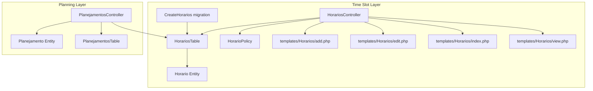
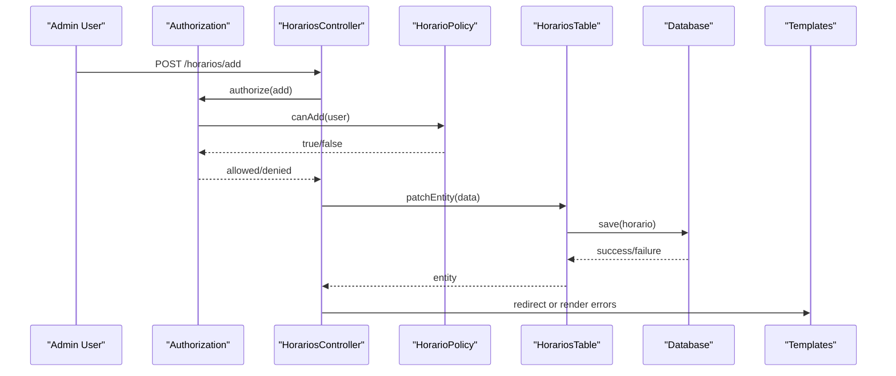
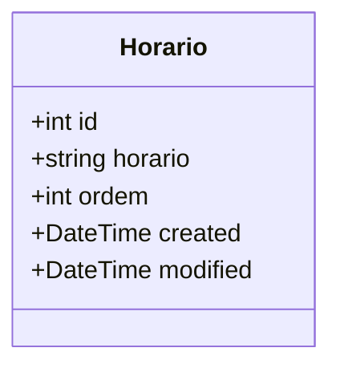
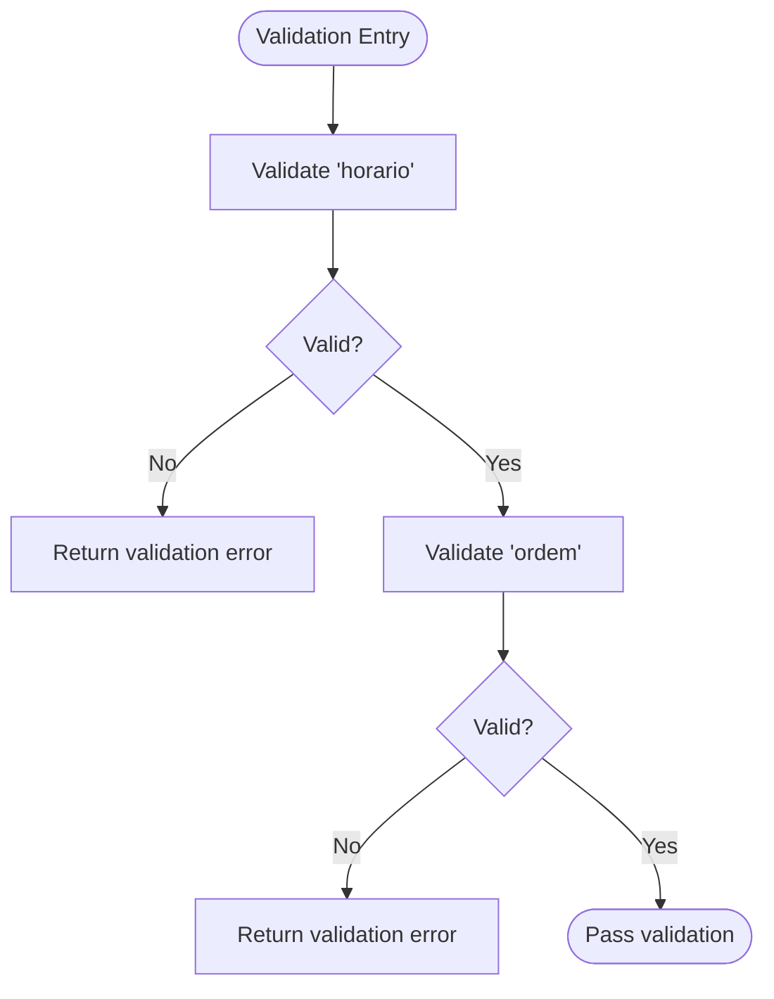
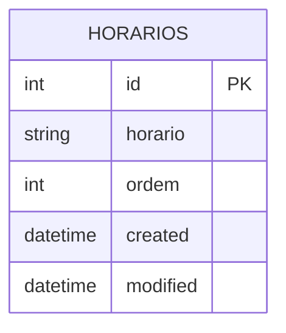
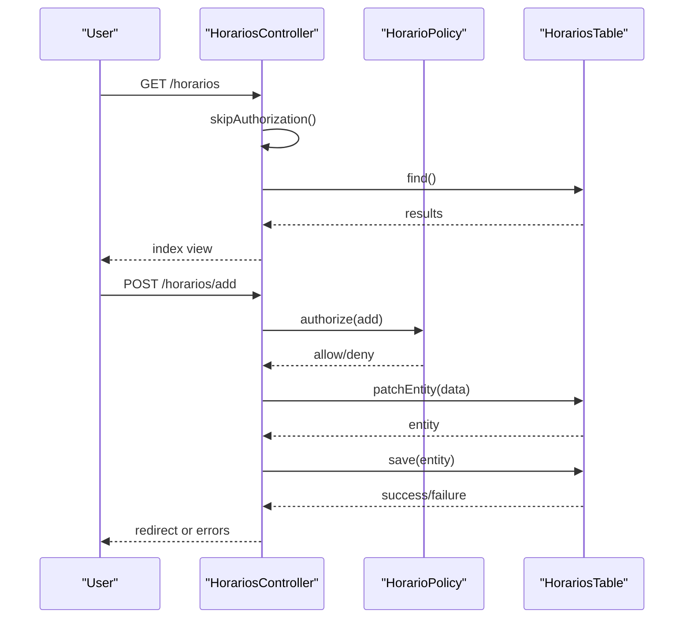
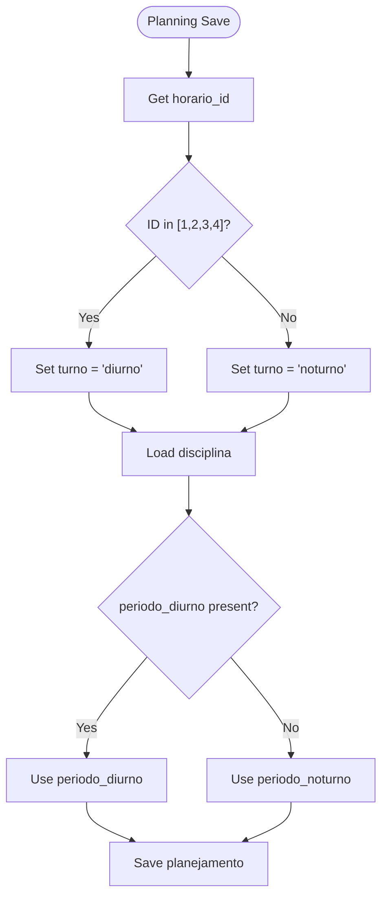
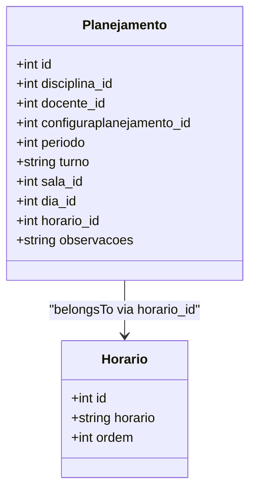
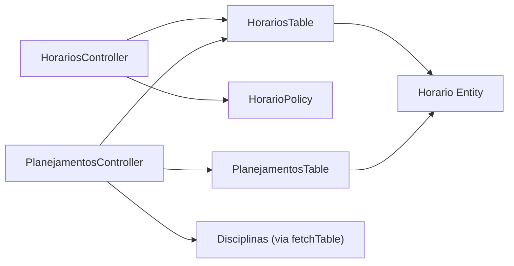

# Time Slots Management

<cite>
**Referenced Files in This Document**
- [Horario.php](file://src/Model/Entity/Horario.php)
- [HorariosTable.php](file://src/Model/Table/HorariosTable.php)
- [CreateHorarios.php](file://config/Migrations/20260612030431_CreateHorarios.php)
- [HorariosController.php](file://src/Controller/HorariosController.php)
- [HorarioPolicy.php](file://src/Policy/HorarioPolicy.php)
- [add.php](file://templates/Horarios/add.php)
- [edit.php](file://templates/Horarios/edit.php)
- [index.php](file://templates/Horarios/index.php)
- [view.php](file://templates/Horarios/view.php)
- [PlanejamentosController.php](file://src/Controller/PlanejamentosController.php)
- [Planejamento.php](file://src/Model/Entity/Planejamento.php)
- [PlanejamentosTable.php](file://src/Model/Table/PlanejamentosTable.php)
</cite>

## Table of Contents
1. [Introduction](#introduction)
2. [Project Structure](#project-structure)
3. [Core Components](#core-components)
4. [Architecture Overview](#architecture-overview)
5. [Detailed Component Analysis](#detailed-component-analysis)
6. [Dependency Analysis](#dependency-analysis)
7. [Performance Considerations](#performance-considerations)
8. [Troubleshooting Guide](#troubleshooting-guide)
9. [Conclusion](#conclusion)

## Introduction
This document explains the time slot management system (Horarios) used by the scheduling application. It covers the Horario entity structure, database schema, CRUD operations, authorization checks, validation rules, and how time slots integrate with the planning workflow. It also documents the time period classification: morning shift (diurno) for IDs 1–4 and evening shift (noturno) for IDs 5+, and how this drives automatic turn assignment during planning.

## Project Structure
The time slot feature follows a standard CakePHP MVC layout:
- Entity: defines data shape and accessibility
- Table: configures behavior, relationships, and validation
- Controller: handles HTTP requests, authorization, and persistence
- Policy: enforces role-based access control
- Templates: render forms and lists
- Migration: defines the database table
- Integration: Planejamento controller uses time slots to set turn and period automatically

**Diagram sources**
- [HorariosController.php:1-121](file://src/Controller/HorariosController.php#L1-L121)
- [HorariosTable.php:1-65](file://src/Model/Table/HorariosTable.php#L1-L65)
- [Horario.php:1-31](file://src/Model/Entity/Horario.php#L1-L31)
- [HorarioPolicy.php:1-36](file://src/Policy/HorarioPolicy.php#L1-L36)
- [CreateHorarios.php:1-40](file://config/Migrations/20260612030431_CreateHorarios.php#L1-L40)
- [add.php:1-17](file://templates/Horarios/add.php#L1-L17)
- [edit.php:1-17](file://templates/Horarios/edit.php#L1-L17)
- [index.php:1-55](file://templates/Horarios/index.php#L1-L55)
- [view.php:1-39](file://templates/Horarios/view.php#L1-L39)
- [PlanejamentosController.php:1-256](file://src/Controller/PlanejamentosController.php#L1-L256)
- [PlanejamentosTable.php:1-57](file://src/Model/Table/PlanejamentosTable.php#L1-L57)
- [Planejamento.php:1-27](file://src/Model/Entity/Planejamento.php#L1-L27)

**Section sources**
- [HorariosController.php:1-121](file://src/Controller/HorariosController.php#L1-L121)
- [HorariosTable.php:1-65](file://src/Model/Table/HorariosTable.php#L1-L65)
- [Horario.php:1-31](file://src/Model/Entity/Horario.php#L1-L31)
- [HorarioPolicy.php:1-36](file://src/Policy/HorarioPolicy.php#L1-L36)
- [CreateHorarios.php:1-40](file://config/Migrations/20260612030431_CreateHorarios.php#L1-L40)
- [add.php:1-17](file://templates/Horarios/add.php#L1-L17)
- [edit.php:1-17](file://templates/Horarios/edit.php#L1-L17)
- [index.php:1-55](file://templates/Horarios/index.php#L1-L55)
- [view.php:1-39](file://templates/Horarios/view.php#L1-L39)
- [PlanejamentosController.php:1-256](file://src/Controller/PlanejamentosController.php#L1-L256)
- [PlanejamentosTable.php:1-57](file://src/Model/Table/PlanejamentosTable.php#L1-L57)
- [Planejamento.php:1-27](file://src/Model/Entity/Planejamento.php#L1-L27)

## Core Components
- Horario Entity: Defines fields id, horario, ordem, created, modified and which fields are mass assignable.
- HorariosTable: Configures table name, display field, primary key, Timestamp behavior, and validation rules for horario and ordem.
- HorariosController: Provides index, view, add, edit, delete actions with authorization and flash messages.
- HorarioPolicy: Restricts add/edit/delete to admin users; allows public index/view.
- Templates: Provide UI for listing, viewing, adding, and editing time slots.
- CreateHorarios migration: Creates the horarios table with columns for horario, ordem, created, modified.
- Planejamento integration: The planning controller sets turno based on horario_id and derives periodo from the selected disciplina.

Key responsibilities:
- Data model and persistence configuration
- Request handling and authorization
- Validation and error feedback
- UI rendering and navigation
- Business logic for turn assignment and period derivation

**Section sources**
- [Horario.php:1-31](file://src/Model/Entity/Horario.php#L1-L31)
- [HorariosTable.php:1-65](file://src/Model/Table/HorariosTable.php#L1-L65)
- [HorariosController.php:1-121](file://src/Controller/HorariosController.php#L1-L121)
- [HorarioPolicy.php:1-36](file://src/Policy/HorarioPolicy.php#L1-L36)
- [CreateHorarios.php:1-40](file://config/Migrations/20260612030431_CreateHorarios.php#L1-L40)
- [add.php:1-17](file://templates/Horarios/add.php#L1-L17)
- [edit.php:1-17](file://templates/Horarios/edit.php#L1-L17)
- [index.php:1-55](file://templates/Horarios/index.php#L1-L55)
- [view.php:1-39](file://templates/Horarios/view.php#L1-L39)
- [PlanejamentosController.php:1-256](file://src/Controller/PlanejamentosController.php#L1-L256)
- [PlanejamentosTable.php:1-57](file://src/Model/Table/PlanejamentosTable.php#L1-L57)
- [Planejamento.php:1-27](file://src/Model/Entity/Planejamento.php#L1-L27)

## Architecture Overview
The time slot subsystem is a self-contained module that integrates into the broader planning system. Controllers orchestrate authorization, persistence, and user feedback. Policies enforce role-based access. The planning controller consumes time slots to compute derived attributes like turno and periodo.

**Diagram sources**
- [HorariosController.php:56-74](file://src/Controller/HorariosController.php#L56-L74)
- [HorarioPolicy.php:21-24](file://src/Policy/HorarioPolicy.php#L21-L24)
- [HorariosTable.php:49-63](file://src/Model/Table/HorariosTable.php#L49-L63)

## Detailed Component Analysis

### Horario Entity
- Purpose: Represents a single time slot with descriptive text and ordering.
- Fields:
  - id: integer primary key
  - horario: string label for the time slot
  - ordem: integer order position
  - created, modified: timestamps managed by behavior
- Accessibility: Allows mass assignment for horario, ordem, created, modified.

**Diagram sources**
- [Horario.php:1-31](file://src/Model/Entity/Horario.php#L1-L31)

**Section sources**
- [Horario.php:1-31](file://src/Model/Entity/Horario.php#L1-L31)

### HorariosTable
- Configuration:
  - Table name: horarios
  - Display field: horario
  - Primary key: id
  - Behavior: Timestamp (auto-manages created/modified)
- Validation:
  - horario: required scalar, max length 50, not empty on create
  - ordem: required integer, not empty on create

**Diagram sources**
- [HorariosTable.php:49-63](file://src/Model/Table/HorariosTable.php#L49-L63)

**Section sources**
- [HorariosTable.php:1-65](file://src/Model/Table/HorariosTable.php#L1-L65)

### Database Schema (Migration)
- Table: horarios
- Columns:
  - horario: string, not null
  - ordem: integer, not null
  - created: datetime, not null
  - modified: datetime, not null

**Diagram sources**
- [CreateHorarios.php:16-38](file://config/Migrations/20260612030431_CreateHorarios.php#L16-L38)

**Section sources**
- [CreateHorarios.php:1-40](file://config/Migrations/20260612030431_CreateHorarios.php#L1-L40)

### HorariosController
- Actions:
  - index: list all time slots with pagination
  - view: show details for a specific time slot
  - add: create new time slot with authorization check
  - edit: update existing time slot with authorization check
  - delete: remove time slot with authorization check
- Authorization:
  - beforeFilter allows public index and view
  - add/edit/delete require authorization via policy
- Persistence:
  - Uses patchEntity and save
  - Flash messages for success/error feedback

**Diagram sources**
- [HorariosController.php:19-25](file://src/Controller/HorariosController.php#L19-L25)
- [HorariosController.php:32-39](file://src/Controller/HorariosController.php#L32-L39)
- [HorariosController.php:60-74](file://src/Controller/HorariosController.php#L60-L74)
- [HorariosController.php:83-97](file://src/Controller/HorariosController.php#L83-L97)
- [HorariosController.php:106-119](file://src/Controller/HorariosController.php#L106-L119)
- [HorarioPolicy.php:11-34](file://src/Policy/HorarioPolicy.php#L11-L34)

**Section sources**
- [HorariosController.php:1-121](file://src/Controller/HorariosController.php#L1-L121)
- [HorarioPolicy.php:1-36](file://src/Policy/HorarioPolicy.php#L1-L36)

### Templates
- add.php: form fields for horario and ordem
- edit.php: form fields for horario and ordem
- index.php: paginated list with actions (view, edit, delete)
- view.php: displays details including timestamps

These templates bind to the controller’s entities and provide user interactions.

**Section sources**
- [add.php:1-17](file://templates/Horarios/add.php#L1-L17)
- [edit.php:1-17](file://templates/Horarios/edit.php#L1-L17)
- [index.php:1-55](file://templates/Horarios/index.php#L1-L55)
- [view.php:1-39](file://templates/Horarios/view.php#L1-L39)

### Time Period System and Automatic Turn Assignment
- Classification:
  - Morning shift (diurno): time slot IDs 1–4
  - Evening shift (noturno): time slot IDs 5+
- Automatic logic:
  - When creating or editing a planejamento, if horario_id is in [1,2,3,4], then turno is set to diurno; otherwise noturno.
  - Periodo is derived from the selected disciplina: use periodo_diurno if available, else periodo_noturno.

**Diagram sources**
- [PlanejamentosController.php:100-114](file://src/Controller/PlanejamentosController.php#L100-L114)
- [PlanejamentosController.php:146-160](file://src/Controller/PlanejamentosController.php#L146-L160)

**Section sources**
- [PlanejamentosController.php:83-127](file://src/Controller/PlanejamentosController.php#L83-L127)
- [PlanejamentosController.php:129-173](file://src/Controller/PlanejamentosController.php#L129-L173)

### Relationship Between Time Slots and Planning Entities
- Planejamento has a belongsTo relationship with Horarios via horario_id.
- Planejamento entity exposes turno and periodo fields used by the planning workflow.
- PlanejamentoTable declares the relationship to Horarios.

**Diagram sources**
- [Planejamento.php:1-27](file://src/Model/Entity/Planejamento.php#L1-L27)
- [PlanejamentosTable.php:37-39](file://src/Model/Table/PlanejamentosTable.php#L37-L39)

**Section sources**
- [Planejamento.php:1-27](file://src/Model/Entity/Planejamento.php#L1-L27)
- [PlanejamentosTable.php:1-57](file://src/Model/Table/PlanejamentosTable.php#L1-L57)

## Dependency Analysis
- Controller dependencies:
  - HorariosController depends on HorariosTable and HorarioPolicy
- Model dependencies:
  - HorariosTable depends on Horario Entity
- Planning integration:
  - PlanejamentosController depends on HorariosTable to load options and on Discipline to derive periodo
  - PlanejamentoTable declares belongsTo Horarios

**Diagram sources**
- [HorariosController.php:1-121](file://src/Controller/HorariosController.php#L1-L121)
- [HorariosTable.php:1-65](file://src/Model/Table/HorariosTable.php#L1-L65)
- [Horario.php:1-31](file://src/Model/Entity/Horario.php#L1-L31)
- [PlanejamentosController.php:1-256](file://src/Controller/PlanejamentosController.php#L1-L256)
- [PlanejamentosTable.php:1-57](file://src/Model/Table/PlanejamentosTable.php#L1-L57)

**Section sources**
- [HorariosController.php:1-121](file://src/Controller/HorariosController.php#L1-L121)
- [HorariosTable.php:1-65](file://src/Model/Table/HorariosTable.php#L1-L65)
- [Horario.php:1-31](file://src/Model/Entity/Horario.php#L1-L31)
- [PlanejamentosController.php:1-256](file://src/Controller/PlanejamentosController.php#L1-L256)
- [PlanejamentosTable.php:1-57](file://src/Model/Table/PlanejamentosTable.php#L1-L57)

## Performance Considerations
- Indexing: Ensure an index on horarios.id and optionally on ordem to optimize sorting and lookups.
- Pagination: The index action uses pagination; keep page sizes reasonable to avoid heavy queries.
- Eager loading: In planning views, contains are used to load related entities; ensure only necessary associations are loaded to reduce query overhead.
- Validation cost: Validation rules are lightweight; consider adding uniqueness constraints at the database level if duplicate time slots must be prevented.

[No sources needed since this section provides general guidance]

## Troubleshooting Guide
Common issues and resolutions:
- Unauthorized access when adding/editing/deleting:
  - Cause: User role is not admin.
  - Resolution: Assign admin role or adjust policy logic.
- Validation errors on creation/update:
  - Cause: Missing or invalid horario or ordem values.
  - Resolution: Provide valid non-empty strings/integers within limits.
- Incorrect turno assignment:
  - Cause: horario_id outside expected ranges.
  - Resolution: Ensure IDs 1–4 map to diurno and IDs ≥5 map to noturno.
- Periodo not set:
  - Cause: Selected disciplina lacks periodo_diurno and periodo_noturno.
  - Resolution: Configure disciplina periods appropriately.

**Section sources**
- [HorarioPolicy.php:21-34](file://src/Policy/HorarioPolicy.php#L21-L34)
- [HorariosTable.php:49-63](file://src/Model/Table/HorariosTable.php#L49-L63)
- [PlanejamentosController.php:100-114](file://src/Controller/PlanejamentosController.php#L100-L114)
- [PlanejamentosController.php:146-160](file://src/Controller/PlanejamentosController.php#L146-L160)

## Conclusion
The Horarios module provides robust time slot management with clear separation of concerns: entity/table for data and validation, controller for request handling and authorization, and templates for user interaction. Its integration with the planning system enables automatic turn assignment and period derivation, ensuring consistent scheduling workflows. Proper authorization and validation safeguard data integrity while maintaining usability.