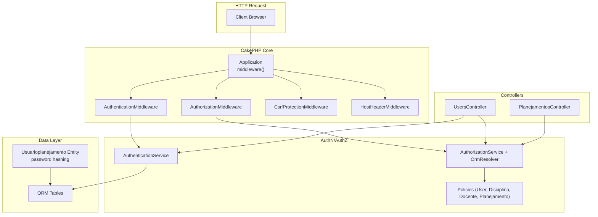
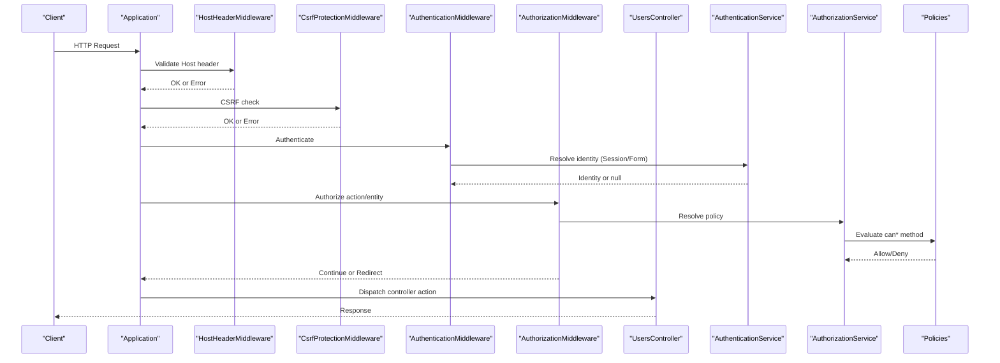
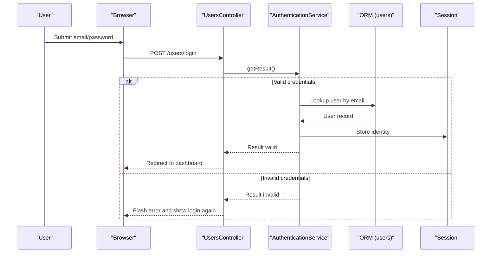
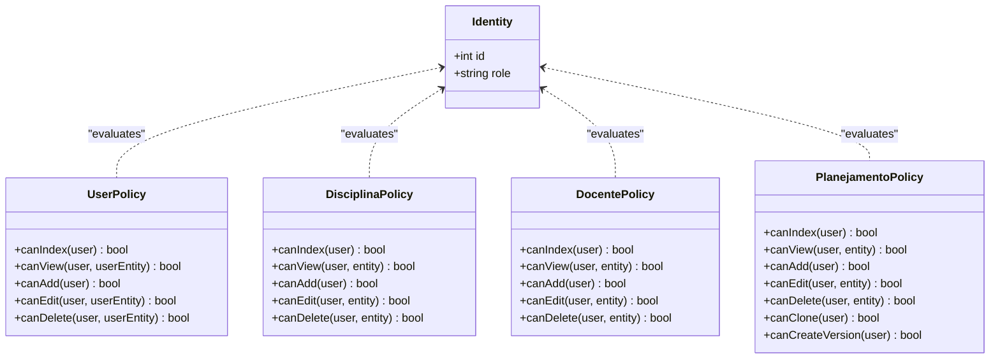
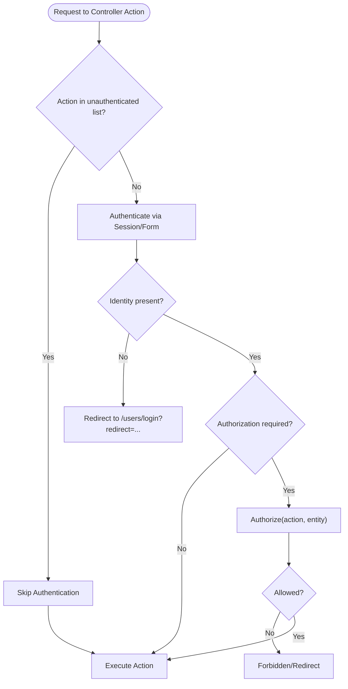
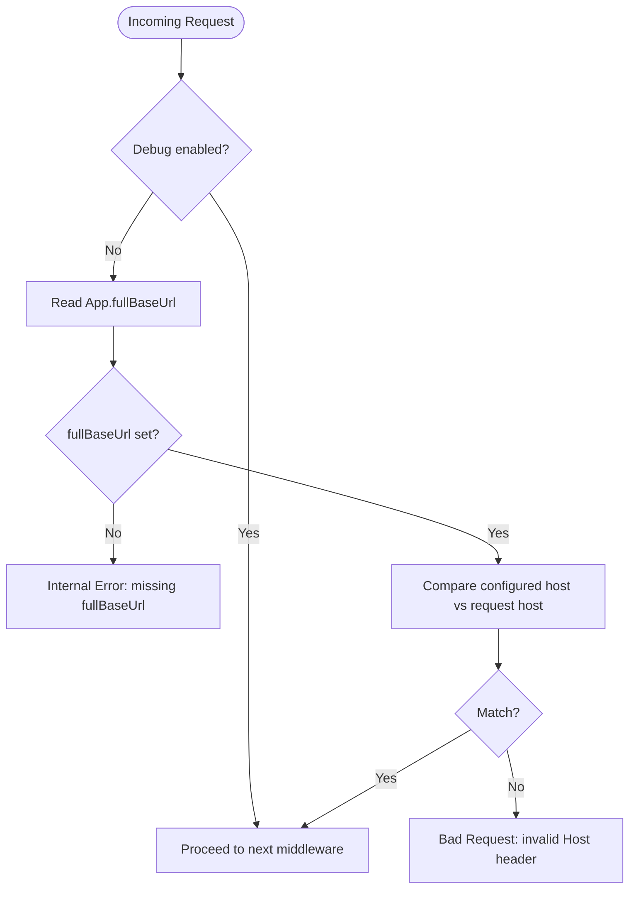
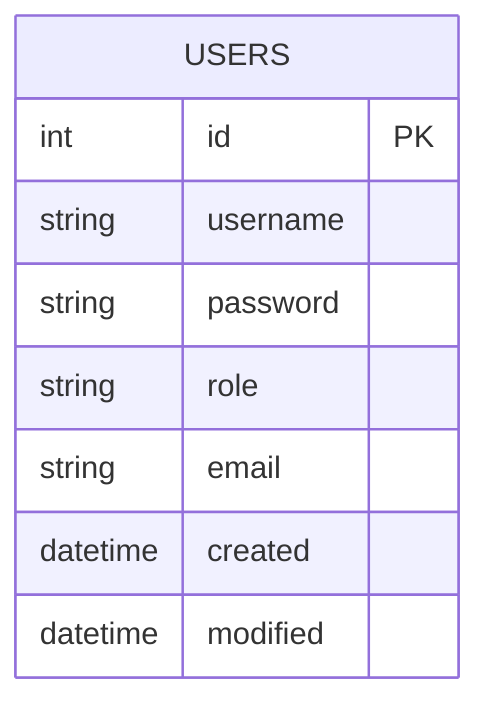
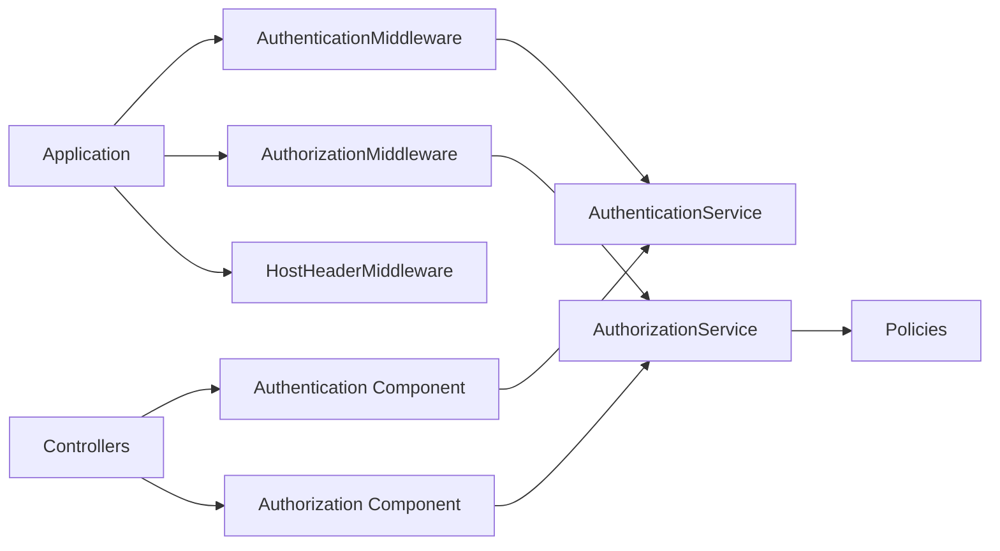

# User Authentication and Authorization

<cite>
**Referenced Files in This Document**
- [Application.php](file://src/Application.php)
- [AppController.php](file://src/Controller/AppController.php)
- [UsersController.php](file://src/Controller/UsersController.php)
- [PlanejamentosController.php](file://src/Controller/PlanejamentosController.php)
- [HostHeaderMiddleware.php](file://src/Middleware/HostHeaderMiddleware.php)
- [UserPolicy.php](file://src/Policy/UserPolicy.php)
- [DisciplinaPolicy.php](file://src/Policy/DisciplinaPolicy.php)
- [DocentePolicy.php](file://src/Policy/DocentePolicy.php)
- [PlanejamentoPolicy.php](file://src/Policy/PlanejamentoPolicy.php)
- [UsuarioplanejamentosTable.php](file://src/Model/Table/UsuarioplanejamentosTable.php)
- [Usuarioplanejamento.php](file://src/Model/Entity/Usuarioplanejamento.php)
- [20260612021814_CreateUsers.php](file://config/Migrations/20260612021814_CreateUsers.php)
- [app.php](file://config/app.php)
- [bootstrap.php](file://config/bootstrap.php)
- [login.php](file://templates/Users/login.php)
</cite>

## Table of Contents
1. [Introduction](#introduction)
2. [Project Structure](#project-structure)
3. [Core Components](#core-components)
4. [Architecture Overview](#architecture-overview)
5. [Detailed Component Analysis](#detailed-component-analysis)
6. [Dependency Analysis](#dependency-analysis)
7. [Performance Considerations](#performance-considerations)
8. [Troubleshooting Guide](#troubleshooting-guide)
9. [Conclusion](#conclusion)
10. [Appendices](#appendices)

## Introduction
This document explains the user authentication and authorization system implemented with CakePHP’s Authentication and Authorization plugins. It covers:
- User registration, login, and session management
- Role-based access control (RBAC) for admin and editor roles
- Policy enforcement across entities
- Security middleware including Host header validation
- Password hashing and session configuration best practices
- Guidance to extend the system for new features and roles

## Project Structure
The authentication and authorization logic is centered around:
- Application bootstrap and middleware pipeline
- Controllers that integrate Authentication and Authorization components
- Policies defining granular permissions per entity
- Entity behavior for password hashing
- Configuration for sessions, security salt, and base URL

**Diagram sources**
- [Application.php:73-122](file://src/Application.php#L73-L122)
- [AppController.php:40-53](file://src/Controller/AppController.php#L40-L53)
- [UsersController.php:20-24](file://src/Controller/UsersController.php#L20-L24)
- [PlanejamentosController.php:11-15](file://src/Controller/PlanejamentosController.php#L11-L15)
- [UserPolicy.php:9-37](file://src/Policy/UserPolicy.php#L9-L37)
- [DisciplinaPolicy.php:9-35](file://src/Policy/DisciplinaPolicy.php#L9-L35)
- [DocentePolicy.php:9-35](file://src/Policy/DocentePolicy.php#L9-L35)
- [PlanejamentoPolicy.php:9-45](file://src/Policy/PlanejamentoPolicy.php#L9-L45)
- [Usuarioplanejamento.php:30-36](file://src/Model/Entity/Usuarioplanejamento.php#L30-L36)

**Section sources**
- [Application.php:73-122](file://src/Application.php#L73-L122)
- [AppController.php:40-53](file://src/Controller/AppController.php#L40-L53)

## Core Components
- Authentication service: Configured in the application class with Session and Form authenticators; uses email/password fields and an ORM resolver bound to the users table.
- Authorization service: Uses an ORM resolver to map controller actions to policy methods by convention.
- Middleware pipeline: Includes host header validation, CSRF protection, authentication, and authorization.
- Policies: Define canIndex/canView/canAdd/canEdit/canDelete (and custom actions) based on user role and ownership rules.
- User entity: Hashes passwords using a secure hasher when set.
- Controller integration: Loads Authentication and Authorization components; marks unauthenticated actions as needed; authorizes mutating operations.

**Section sources**
- [Application.php:124-162](file://src/Application.php#L124-L162)
- [AppController.php:40-53](file://src/Controller/AppController.php#L40-L53)
- [UserPolicy.php:9-37](file://src/Policy/UserPolicy.php#L9-L37)
- [DisciplinaPolicy.php:9-35](file://src/Policy/DisciplinaPolicy.php#L9-L35)
- [DocentePolicy.php:9-35](file://src/Policy/DocentePolicy.php#L9-L35)
- [PlanejamentoPolicy.php:9-45](file://src/Policy/PlanejamentoPolicy.php#L9-L45)
- [Usuarioplanejamento.php:30-36](file://src/Model/Entity/Usuarioplanejamento.php#L30-L36)

## Architecture Overview
The request lifecycle integrates security and authorization early:
- Host header validation prevents Host Header Injection in production.
- CSRF protection secures state-changing requests.
- Authentication establishes identity via session or form login.
- Authorization enforces policies before controller actions execute.

**Diagram sources**
- [Application.php:73-122](file://src/Application.php#L73-L122)
- [HostHeaderMiddleware.php:32-57](file://src/Middleware/HostHeaderMiddleware.php#L32-L57)
- [UsersController.php:20-24](file://src/Controller/UsersController.php#L20-L24)

## Detailed Component Analysis

### Authentication Service and Login Flow
- The application configures:
  - Session authenticator first, then Form authenticator.
  - Form fields mapped to email and password.
  - Password identifier backed by an ORM resolver pointing to the users table.
- Unauthenticated redirects are configured to the login page with a redirect query parameter.
- UsersController exposes login/logout/profile actions and whitelists them from authentication checks.

**Diagram sources**
- [Application.php:124-155](file://src/Application.php#L124-L155)
- [UsersController.php:29-50](file://src/Controller/UsersController.php#L29-L50)
- [login.php:14-36](file://templates/Users/login.php#L14-L36)

**Section sources**
- [Application.php:124-155](file://src/Application.php#L124-L155)
- [UsersController.php:20-24](file://src/Controller/UsersController.php#L20-L24)
- [UsersController.php:29-60](file://src/Controller/UsersController.php#L29-L60)
- [login.php:14-36](file://templates/Users/login.php#L14-L36)

### Session Management
- Default session storage is configured to use PHP’s default handler.
- In production, ensure secure cookie settings and appropriate timeouts are applied via environment or app_local overrides.
- The authentication service persists identity into the session after successful login.

Best practices:
- Set secure cookie flags and HttpOnly where applicable.
- Configure idle timeout and revalidation for sensitive areas.
- Use database or cache-backed sessions for horizontal scaling.

**Section sources**
- [app.php:419-421](file://config/app.php#L419-L421)
- [Application.php:124-155](file://src/Application.php#L124-L155)

### Role-Based Access Control (RBAC) and Policies
- Roles used:
  - admin: full access to manage users and critical resources.
  - editor: allowed to add/edit certain resources but not delete users.
  - user: limited access depending on policy.
- Ownership checks:
  - Users can view/edit their own profile; admins can manage all users.
  - Some resources allow any authenticated user to create, while edit/delete require specific roles.

Key policies:
- UserPolicy: Admin-only index/add; view/edit self or admin; delete only admin and not self.
- DisciplinaPolicy: View/index open; add/edit for admin/editor; delete admin-only.
- DocentePolicy: Similar to DisciplinaPolicy.
- PlanejamentoPolicy: View/index open; add requires authenticated user; edit admin/editor; delete admin-only; custom actions clone/createVersion restricted.

**Diagram sources**
- [UserPolicy.php:9-37](file://src/Policy/UserPolicy.php#L9-L37)
- [DisciplinaPolicy.php:9-35](file://src/Policy/DisciplinaPolicy.php#L9-L35)
- [DocentePolicy.php:9-35](file://src/Policy/DocentePolicy.php#L9-L35)
- [PlanejamentoPolicy.php:9-45](file://src/Policy/PlanejamentoPolicy.php#L9-L45)

**Section sources**
- [UserPolicy.php:9-37](file://src/Policy/UserPolicy.php#L9-L37)
- [DisciplinaPolicy.php:9-35](file://src/Policy/DisciplinaPolicy.php#L9-L35)
- [DocentePolicy.php:9-35](file://src/Policy/DocentePolicy.php#L9-L35)
- [PlanejamentoPolicy.php:9-45](file://src/Policy/PlanejamentoPolicy.php#L9-L45)

### Securing Controller Actions
- Global components:
  - Authentication and Authorization components are loaded in the base controller.
  - Unauthenticated actions are explicitly declared where necessary.
- Example usage:
  - UsersController whitelists login/logout/profile.
  - PlanejamentosController skips authorization for public listing/viewing and authorizes mutations.

**Diagram sources**
- [AppController.php:40-53](file://src/Controller/AppController.php#L40-L53)
- [UsersController.php:20-24](file://src/Controller/UsersController.php#L20-L24)
- [PlanejamentosController.php:11-15](file://src/Controller/PlanejamentosController.php#L11-L15)
- [PlanejamentosController.php:83-87](file://src/Controller/PlanejamentosController.php#L83-L87)
- [PlanejamentosController.php:129-133](file://src/Controller/PlanejamentosController.php#L129-L133)
- [PlanejamentosController.php:175-179](file://src/Controller/PlanejamentosController.php#L175-L179)

**Section sources**
- [AppController.php:40-53](file://src/Controller/AppController.php#L40-L53)
- [UsersController.php:20-24](file://src/Controller/UsersController.php#L20-L24)
- [PlanejamentosController.php:11-15](file://src/Controller/PlanejamentosController.php#L11-L15)
- [PlanejamentosController.php:83-87](file://src/Controller/PlanejamentosController.php#L83-L87)
- [PlanejamentosController.php:129-133](file://src/Controller/PlanejamentosController.php#L129-L133)
- [PlanejamentosController.php:175-179](file://src/Controller/PlanejamentosController.php#L175-L179)

### Host Header Security Middleware
- Validates that the incoming Host header matches the configured full base URL in production.
- Throws explicit errors if App.fullBaseUrl is missing or mismatched.
- Development mode bypasses strict validation for convenience.

**Diagram sources**
- [HostHeaderMiddleware.php:32-57](file://src/Middleware/HostHeaderMiddleware.php#L32-L57)
- [app.php:52-71](file://config/app.php#L52-L71)

**Section sources**
- [HostHeaderMiddleware.php:32-57](file://src/Middleware/HostHeaderMiddleware.php#L32-L57)
- [app.php:52-71](file://config/app.php#L52-L71)

### Password Hashing and User Model
- The users table includes username, password, role, email, timestamps.
- The Usuarioplanejamento entity hashes passwords securely when set.
- Validation ensures presence and constraints for email, password, and role.

**Diagram sources**
- [20260612021814_CreateUsers.php:16-48](file://config/Migrations/20260612021814_CreateUsers.php#L16-L48)

**Section sources**
- [20260612021814_CreateUsers.php:16-48](file://config/Migrations/20260612021814_CreateUsers.php#L16-L48)
- [UsuarioplanejamentosTable.php:24-41](file://src/Model/Table/UsuarioplanejamentosTable.php#L24-L41)
- [Usuarioplanejamento.php:30-36](file://src/Model/Entity/Usuarioplanejamento.php#L30-L36)

## Dependency Analysis
- Application depends on:
  - Authentication and Authorization services and middlewares.
  - Custom HostHeaderMiddleware.
- Controllers depend on:
  - Authentication and Authorization components.
  - Entities and tables via ORM.
- Policies depend on:
  - Identity interface and entity types.

**Diagram sources**
- [Application.php:73-122](file://src/Application.php#L73-L122)
- [AppController.php:40-53](file://src/Controller/AppController.php#L40-L53)

**Section sources**
- [Application.php:73-122](file://src/Application.php#L73-L122)
- [AppController.php:40-53](file://src/Controller/AppController.php#L40-L53)

## Performance Considerations
- Prefer database-backed sessions for multi-node deployments.
- Cache metadata and translations appropriately in production.
- Avoid unnecessary authorization checks on read-only endpoints by skipping authorization where safe.
- Keep policies simple and efficient; avoid heavy queries inside policy methods.

[No sources needed since this section provides general guidance]

## Troubleshooting Guide
Common issues and resolutions:
- Missing App.fullBaseUrl in production:
  - Ensure APP_FULL_BASE_URL is set or configure App.fullBaseUrl.
  - HostHeaderMiddleware will reject requests otherwise.
- Unauthorized redirects loop:
  - Verify unauthenticated actions are correctly listed.
  - Confirm redirect query parameter handling.
- Login failures:
  - Check that the ORM resolver points to the correct user model and fields.
  - Ensure password hashing is applied consistently during creation/update.
- CSRF errors:
  - Ensure forms include CSRF tokens and cookies are accepted.

**Section sources**
- [HostHeaderMiddleware.php:32-57](file://src/Middleware/HostHeaderMiddleware.php#L32-L57)
- [app.php:52-71](file://config/app.php#L52-L71)
- [Application.php:124-155](file://src/Application.php#L124-L155)
- [UsersController.php:20-24](file://src/Controller/UsersController.php#L20-L24)

## Conclusion
The system implements a robust authentication and authorization stack:
- Secure login via session/form with email/password.
- RBAC enforced through per-entity policies with clear role semantics.
- Early security checks via middleware, including host header validation and CSRF protection.
- Secure password hashing at the entity level.
To extend the system, add new policies for new entities, update roles in policies, and adjust controller authorization calls accordingly.

[No sources needed since this section summarizes without analyzing specific files]

## Appendices

### Extending Authorization for New Features and Roles
- Add a new policy file under src/Policy/<Entity>Policy.php implementing canIndex/canView/canAdd/canEdit/canDelete and any custom actions.
- Update roles in policies to reflect business requirements.
- In controllers, call $this->Authorization->authorize($entity, 'action') before mutating operations.
- If exposing public endpoints, whitelist actions via addUnauthenticatedActions or skipAuthorization where appropriate.

[No sources needed since this section provides general guidance]