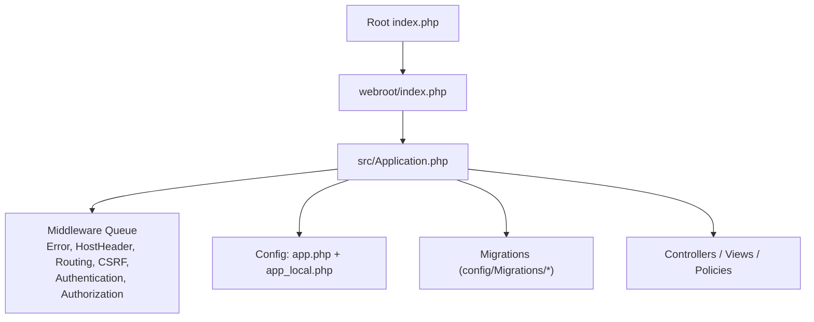
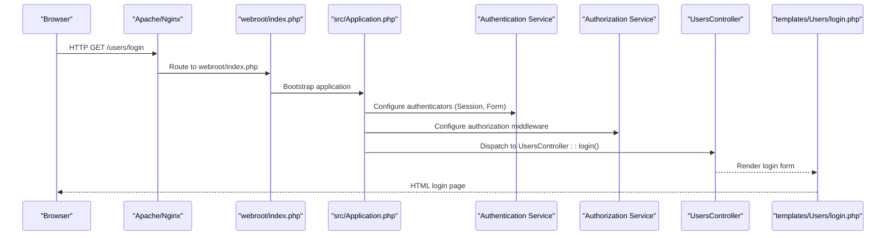
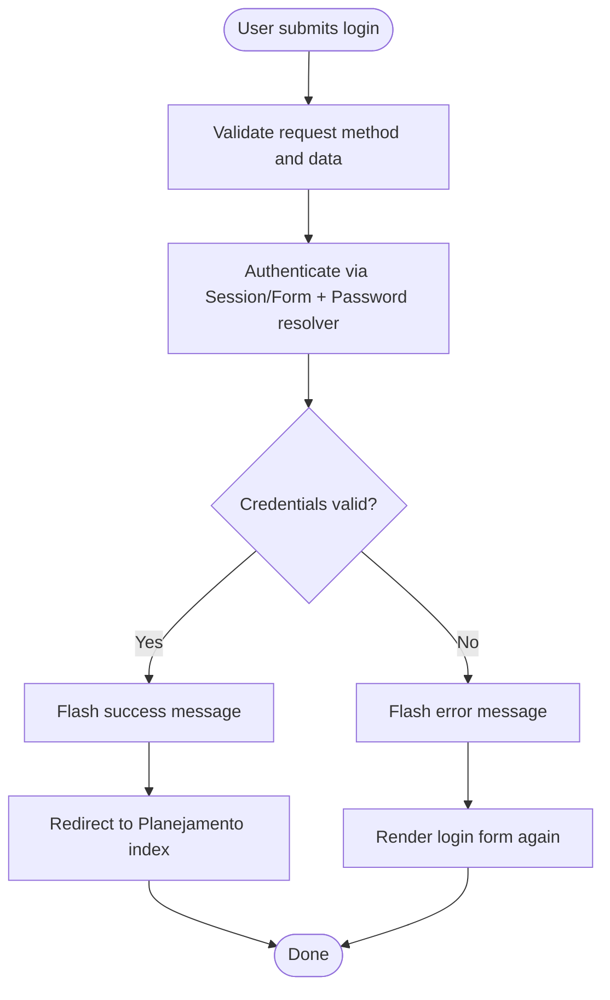
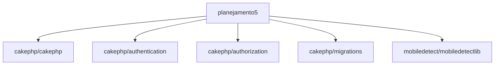

# Getting Started

<cite>
**Referenced Files in This Document**
- [README.md](file://README.md)
- [composer.json](file://composer.json)
- [config/app.php](file://config/app.php)
- [config/app_local.example.php](file://config/app_local.example.php)
- [index.php](file://index.php)
- [webroot/.htaccess](file://webroot/.htaccess)
- [.htaccess](file:.htaccess)
- [src/Application.php](file://src/Application.php)
- [src/Console/Installer.php](file://src/Console/Installer.php)
- [config/Migrations/20260612021814_CreateUsers.php](file://config/Migrations/20260612021814_CreateUsers.php)
- [src/Controller/UsersController.php](file://src/Controller/UsersController.php)
- [templates/Users/login.php](file://templates/Users/login.php)
- [src/Policy/UserPolicy.php](file://src/Policy/UserPolicy.php)
</cite>

## Table of Contents
1. Introduction
2. Project Structure
3. Core Components
4. Architecture Overview
5. Detailed Component Analysis
6. Dependency Analysis
7. Performance Considerations
8. Troubleshooting Guide
9. Conclusion

## Introduction
This guide helps you install and run the planejamento5 academic planning system, a CakePHP 5 application with authentication and authorization. You will set up PHP 8.2+, MySQL or MariaDB, Composer dependencies, web server configuration (Apache/Nginx), database migrations, environment configuration, and launch the app for the first time. You will also learn how to access the admin interface, create your first administrator user, and navigate the scheduling system.

## Project Structure
The project follows standard CakePHP conventions:
- Application entry points are at the repository root and under webroot.
- Configuration is split between shared settings (app.php) and local overrides (app_local.php).
- Database schema is managed via migrations under config/Migrations.
- Authentication and authorization are configured in the application bootstrap.

**Diagram sources**
- [index.php:1-17](file://index.php#L1-L17)
- [src/Application.php:73-122](file://src/Application.php#L73-L122)
- [config/app.php:277-343](file://config/app.php#L277-343)
- [config/app_local.example.php:40-78](file://config/app_local.example.php#L40-78)
- [config/Migrations/20260612021814_CreateUsers.php:16-48](file://config/Migrations/20260612021814_CreateUsers.php#L16-L48)

**Section sources**
- [README.md:11-35](file://README.md#L11-L35)
- [index.php:1-17](file://index.php#L1-L17)
- [config/app.php:10-71](file://config/app.php#L10-71)
- [config/app_local.example.php:1-21](file://config/app_local.example.php#L1-21)

## Core Components
- Web entry point: The root index.php delegates to webroot/index.php.
- Application bootstrap: src/Application.php sets up middleware, authentication, and authorization.
- Configuration: Shared settings in config/app.php; per-environment overrides in config/app_local.php.
- Database: Migrations under config/Migrations manage schema changes.
- Authentication: Form-based login using email/password against Usuarioplanejamentos table.
- Authorization: Policy-based access control (e.g., UserPolicy enforces role checks).

Key responsibilities:
- Middleware pipeline handles error handling, host header validation, routing, CSRF protection, authentication, and authorization.
- Authentication service uses Session and Form authenticators with Password identifier backed by ORM resolver.
- Authorization service uses an ORM resolver and policies to enforce permissions.

**Section sources**
- [index.php:1-17](file://index.php#L1-L17)
- [src/Application.php:73-122](file://src/Application.php#L73-L122)
- [src/Application.php:124-155](file://src/Application.php#L124-L155)
- [src/Application.php:157-162](file://src/Application.php#L157-L162)
- [config/app.php:277-343](file://config/app.php#L277-343)
- [config/app_local.example.php:40-78](file://config/app_local.example.php#L40-78)
- [src/Controller/UsersController.php:13-24](file://src/Controller/UsersController.php#L13-24)
- [src/Policy/UserPolicy.php:12-15](file://src/Policy/UserPolicy.php#L12-15)

## Architecture Overview
High-level request flow from browser to controllers and back:

**Diagram sources**
- [index.php:1-17](file://index.php#L1-L17)
- [src/Application.php:73-122](file://src/Application.php#L73-L122)
- [src/Application.php:124-155](file://src/Application.php#L124-L155)
- [src/Controller/UsersController.php:29-50](file://src/Controller/UsersController.php#L29-50)
- [templates/Users/login.php:1-48](file://templates/Users/login.php#L1-48)

## Detailed Component Analysis

### Installation and Environment Setup
- PHP version requirement: >= 8.2.
- Composer-managed dependencies include CakePHP core, authentication, authorization, and migrations.
- After installation, Composer runs post-install hooks that:
  - Create config/app_local.php from example template if missing.
  - Create writable directories (logs, tmp, caches, sessions).
  - Optionally set folder permissions interactively.
  - Generate and inject a secure Security.salt into app_local.php.

Steps:
1. Install Composer and ensure PHP >= 8.2.
2. Clone or copy the project into your web server directory.
3. Run composer install to fetch dependencies and execute post-install tasks.
4. Verify that config/app_local.php exists and writable directories were created.

**Section sources**
- [composer.json:7-15](file://composer.json#L7-L15)
- [composer.json:48-50](file://composer.json#L48-L50)
- [src/Console/Installer.php:58-73](file://src/Console/Installer.php#L58-73)
- [src/Console/Installer.php:82-90](file://src/Console/Installer.php#L82-90)
- [src/Console/Installer.php:99-108](file://src/Console/Installer.php#L99-108)
- [src/Console/Installer.php:119-174](file://src/Console/Installer.php#L119-174)
- [src/Console/Installer.php:183-223](file://src/Console/Installer.php#L183-223)

### Database Setup (MySQL/MariaDB)
- Default driver is MySQL with utf8mb4 encoding.
- Local connection details should be provided in config/app_local.php.
- Use migrations to create tables, including users.

Steps:
1. Create a database and user with appropriate privileges.
2. Configure Datasources.default in config/app_local.php with host, username, password, and database name.
3. Run migrations to apply schema changes.

Notes:
- If your MySQL server uses skip-character-set-client-handshake, configure flags accordingly in app.php.
- For testing, a separate test datasource is available.

**Section sources**
- [config/app.php:277-343](file://config/app.php#L277-343)
- [config/app_local.example.php:40-78](file://config/app_local.example.php#L40-78)
- [config/Migrations/20260612021814_CreateUsers.php:16-48](file://config/Migrations/20260612021814_CreateUsers.php#L16-L48)

### Web Server Configuration
- Apache:
  - Root .htaccess rewrites requests to webroot.
  - webroot/.htaccess forwards non-file requests to webroot/index.php.
  - Ensure mod_rewrite is enabled.
- Nginx:
  - Point the document root to the webroot directory.
  - Configure a rewrite rule to route all requests to webroot/index.php when the requested file does not exist.

Security note:
- In production, set App.fullBaseUrl to prevent Host Header Injection attacks.

**Section sources**
- [.htaccess:7-12](file:.htaccess#L7-L12)
- [webroot/.htaccess:1-6](file://webroot/.htaccess#L1-6)
- [config/app.php:39-44](file://config/app.php#L39-44)

### Initial Launch
- Start the built-in development server or use your web server.
- Access the application URL in your browser.
- On first visit, ensure migrations have been applied and app_local.php is configured.

**Section sources**
- [README.md:28-35](file://README.md#L28-L35)
- [index.php:1-17](file://index.php#L1-L17)

### Admin Interface and First Administrator User
- Login endpoint: /users/login renders a login form.
- Authentication uses email and password fields resolved against the Usuarioplanejamentos table.
- Authorization policies enforce role-based access (e.g., only users with role 'admin' can perform certain actions).

To create the first administrator:
1. Ensure the users table exists (migrations must be applied).
2. Insert a user record with role set to 'admin'.
3. Log in at /users/login using the email and password you set.

Navigation after login:
- Successful login redirects to the main scheduling area (Planejamentos controller index).
- Use the application menu to navigate scheduling entities (days, schedules, rooms, etc.).

**Section sources**
- [src/Controller/UsersController.php:29-50](file://src/Controller/UsersController.php#L29-50)
- [templates/Users/login.php:1-48](file://templates/Users/login.php#L1-48)
- [src/Application.php:134-152](file://src/Application.php#L134-L152)
- [src/Policy/UserPolicy.php:12-15](file://src/Policy/UserPolicy.php#L12-15)

### Data Flow: Login Process

**Diagram sources**
- [src/Controller/UsersController.php:29-50](file://src/Controller/UsersController.php#L29-50)
- [src/Application.php:134-152](file://src/Application.php#L134-L152)

## Dependency Analysis
Core runtime dependencies:
- PHP >= 8.2
- CakePHP framework and plugins:
  - cakephp/authentication
  - cakephp/authorization
  - cakephp/migrations
- Additional libraries such as mobiledetect.

Development dependencies include bake, debug kit, codesniffer, phpunit, and dotenv.

**Diagram sources**
- [composer.json:7-15](file://composer.json#L7-L15)

**Section sources**
- [composer.json:7-15](file://composer.json#L7-L15)
- [composer.json:16-22](file://composer.json#L16-L22)

## Performance Considerations
- Enable routes caching in production if you have many routes.
- Set App.fullBaseUrl in production to avoid Host Header Injection and improve security.
- Tune database flags if your MySQL server uses skip-character-set-client-handshake.
- Use appropriate session storage (e.g., cache or database) for multi-server deployments.

[No sources needed since this section provides general guidance]

## Troubleshooting Guide
Common issues and resolutions:
- Database connection errors:
  - Verify Datasources.default in config/app_local.php matches your MySQL/MariaDB credentials.
  - Confirm the database exists and the user has sufficient privileges.
  - Check character set flags if required by your server configuration.
- Permission errors:
  - Ensure logs and tmp directories exist and are writable by the web server process.
  - The installer can set permissions interactively; otherwise, adjust permissions manually.
- Missing dependencies:
  - Run composer install to fetch all packages.
  - Confirm PHP version meets the minimum requirement (>= 8.2).
- Host header injection warnings:
  - Set App.fullBaseUrl in production to a trusted base URL.
- Login failures:
  - Ensure migrations have been applied so the users table exists.
  - Verify the user record has a hashed password and correct role.

**Section sources**
- [config/app_local.example.php:40-78](file://config/app_local.example.php#L40-78)
- [config/app.php:299-304](file://config/app.php#L299-304)
- [src/Console/Installer.php:99-108](file://src/Console/Installer.php#L99-108)
- [src/Console/Installer.php:119-174](file://src/Console/Installer.php#L119-174)
- [config/app.php:39-44](file://config/app.php#L39-44)
- [config/Migrations/20260612021814_CreateUsers.php:16-48](file://config/Migrations/20260612021814_CreateUsers.php#L16-L48)

## Conclusion
You now have the steps to install, configure, and run planejamento5. With PHP 8.2+, MySQL/MariaDB, Composer, and proper web server setup, you can apply migrations, configure app_local.php, and launch the application. Use the admin interface to manage scheduling resources and rely on policy-based authorization to secure operations. Refer to the troubleshooting section for common pitfalls and best practices for production readiness.