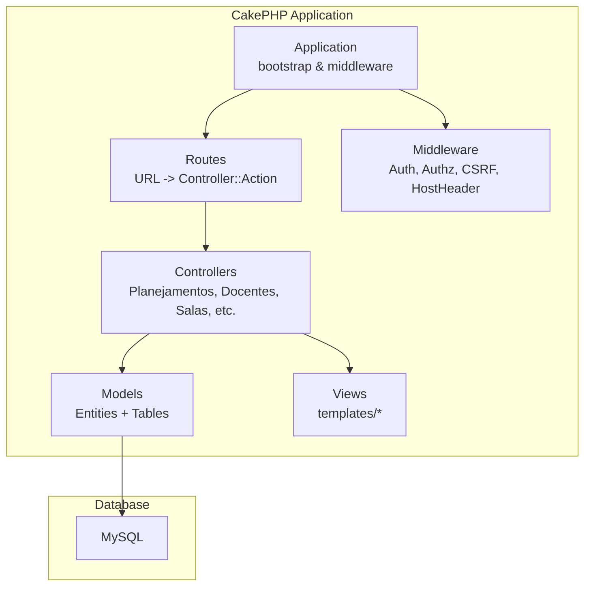
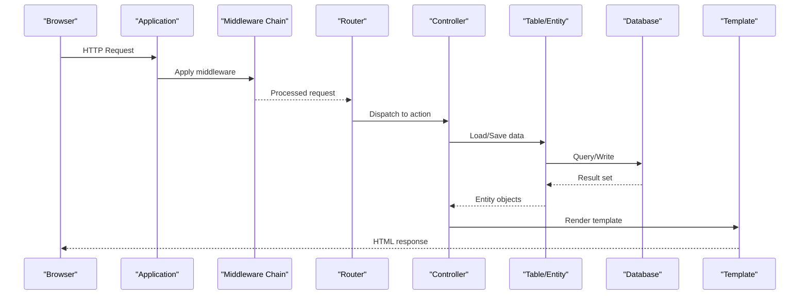
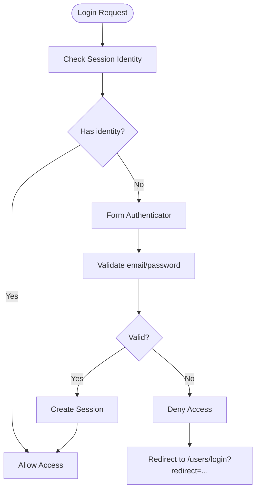
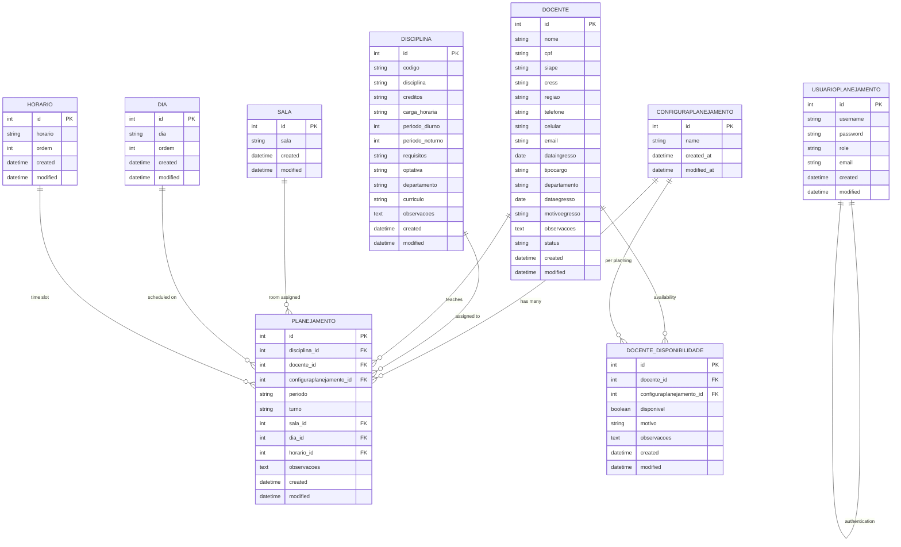
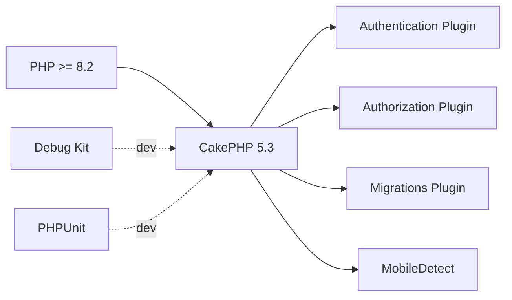

# Project Overview

<cite>
**Referenced Files in This Document**
- [README.md](file://README.md)
- [composer.json](file://composer.json)
- [src/Application.php](file://src/Application.php)
- [config/app.php](file://config/app.php)
- [config/routes.php](file://config/routes.php)
- [src/Model/Entity/Planejamento.php](file://src/Model/Entity/Planejamento.php)
- [src/Model/Entity/Docente.php](file://src/Model/Entity/Docente.php)
- [src/Model/Entity/Sala.php](file://src/Model/Entity/Sala.php)
- [src/Model/Entity/Disciplina.php](file://src/Model/Entity/Disciplina.php)
- [src/Model/Entity/Horario.php](file://src/Model/Entity/Horario.php)
- [config/Migrations/20260612021814_CreateUsers.php](file://config/Migrations/20260612021814_CreateUsers.php)
- [config/Migrations/20260612030430_CreateDias.php](file://config/Migrations/20260612030430_CreateDias.php)
- [config/Migrations/20260612030431_CreateHorarios.php](file://config/Migrations/20260612030431_CreateHorarios.php)
- [config/Migrations/20260612030432_CreateSalas.php](file://config/Migrations/20260612030432_CreateSalas.php)
- [config/Migrations/20260613100000_CreateDocenteDisponibilidades.php](file://config/Migrations/20260613100000_CreateDocenteDisponibilidades.php)
</cite>

## Table of Contents
1. [Introduction](#introduction)
2. [Project Structure](#project-structure)
3. [Core Components](#core-components)
4. [Architecture Overview](#architecture-overview)
5. [Detailed Component Analysis](#detailed-component-analysis)
6. [Dependency Analysis](#dependency-analysis)
7. [Performance Considerations](#performance-considerations)
8. [Troubleshooting Guide](#troubleshooting-guide)
9. [Conclusion](#conclusion)
10. [Appendices](#appendices)

## Introduction
planejamento5 is a university course scheduling and resource allocation management system built on CakePHP 5.3 using the MVC pattern. It enables academic administrators to create and manage academic schedules (planejamentos), assign docentes (faculty members), allocate salas (classrooms), and coordinate time slots across dias (days) and horarios (time periods). The system supports multi-semester planning via configuration entities, tracks docente availability per planning period, and provides user authentication and authorization for secure access.

Key concepts:
- planejamentos: academic schedule entries linking disciplines, faculty, classrooms, days, and time slots within a specific planning configuration and semester context.
- docentes: faculty records with contact and employment details; availability can be tracked per planning configuration.
- salas: classroom resources used for teaching sessions.
- dias/horarios: canonical lists of weekdays and class time slots used to build timetables.
- configuraplanejamento: represents a planning cycle or semester context that groups related data such as docente availability.

This document provides both conceptual overviews for beginners and technical details for experienced developers, including architecture diagrams, database relationships, and practical use cases.

## Project Structure
The application follows CakePHP’s standard MVC layout:
- Controllers handle HTTP requests and orchestrate business logic.
- Models (Entities and Tables) represent domain data and persistence.
- Views render templates for user interfaces.
- Configuration resides under config/, including routes, app settings, and migrations.
- Middleware in src/Middleware adds cross-cutting concerns like host validation and security.

**Diagram sources**
- [src/Application.php:73-122](file://src/Application.php#L73-L122)
- [config/routes.php:52-79](file://config/routes.php#L52-L79)

**Section sources**
- [README.md:1-59](file://README.md#L1-L59)
- [composer.json:1-60](file://composer.json#L1-L60)
- [src/Application.php:58-122](file://src/Application.php#L58-L122)
- [config/routes.php:52-79](file://config/routes.php#L52-L79)

## Core Components
- Authentication and Authorization:
  - Session-based login using email/password against the Usuarioplanejamentos model.
  - Authorization policies enforce access control per entity.
- Routing:
  - Default route points to Planejamentos index.
  - Fallbacks enable RESTful CRUD URLs for controllers.
- Domain Entities:
  - Planejamento links disciplina_id, docente_id, configuraplanejamento_id, periodo, turno, sala_id, dia_id, horario_id, and optional notes.
  - Docente captures personal and employment attributes.
  - Sala stores classroom identifiers.
  - Disciplina defines course metadata including credits and workload.
  - Horario defines ordered time slots.
- Migrations:
  - users table for authentication.
  - dias, horarios, salas for scheduling primitives.
  - docente_disponibilidades for tracking faculty availability per planning configuration.

Practical examples:
- Create an academic schedule (planejamento): select a disciplina, a docente, a sala, a dia, and a horario within a given configuraplanejamento and periodo.
- Manage faculty availability: mark a docente as available/unavailable for a specific configuraplanejamento and optionally add a reason or notes.
- Assign classrooms: ensure a sala is free at the selected dia/horario before finalizing a planejamento.

**Section sources**
- [src/Application.php:124-162](file://src/Application.php#L124-L162)
- [config/routes.php:52-79](file://config/routes.php#L52-L79)
- [src/Model/Entity/Planejamento.php:13-25](file://src/Model/Entity/Planejamento.php#L13-L25)
- [src/Model/Entity/Docente.php:37-55](file://src/Model/Entity/Docente.php#L37-L55)
- [src/Model/Entity/Sala.php:23-27](file://src/Model/Entity/Sala.php#L23-L27)
- [src/Model/Entity/Disciplina.php:33-47](file://src/Model/Entity/Disciplina.php#L33-L47)
- [src/Model/Entity/Horario.php:24-29](file://src/Model/Entity/Horario.php#L24-L29)
- [config/Migrations/20260612021814_CreateUsers.php:16-48](file://config/Migrations/20260612021814_CreateUsers.php#L16-L48)
- [config/Migrations/20260612030430_CreateDias.php:16-37](file://config/Migrations/20260612030430_CreateDias.php#L16-L37)
- [config/Migrations/20260612030431_CreateHorarios.php:16-37](file://config/Migrations/20260612030431_CreateHorarios.php#L16-L37)
- [config/Migrations/20260612030432_CreateSalas.php:16-32](file://config/Migrations/20260612030432_CreateSalas.php#L16-L32)
- [config/Migrations/20260613100000_CreateDocenteDisponibilidades.php:8-46](file://config/Migrations/20260613100000_CreateDocenteDisponibilidades.php#L8-L46)

## Architecture Overview
The system uses CakePHP 5.3 MVC with integrated authentication and authorization. Requests flow through middleware (error handling, host header validation, routing, body parsing, CSRF protection, authentication, authorization) to controllers, which interact with models and return views.

**Diagram sources**
- [src/Application.php:73-122](file://src/Application.php#L73-L122)
- [config/routes.php:52-79](file://config/routes.php#L52-L79)

## Detailed Component Analysis

### Authentication and Authorization
- Authentication service is configured to use session and form authenticators. Login fields map username to email and password to password, resolving users from the Usuarioplanejamentos ORM model.
- Authorization service uses an ORM resolver and redirects unauthorized users to the login page with a redirect query parameter.

**Diagram sources**
- [src/Application.php:124-162](file://src/Application.php#L124-L162)

**Section sources**
- [src/Application.php:124-162](file://src/Application.php#L124-L162)

### Scheduling Entities and Relationships
The core scheduling concept revolves around planejamentos, which connect courses (disciplinas), faculty (docentes), rooms (salas), days (dias), and time slots (horarios) within a planning configuration (configuraplanejamento) and a specific period (periodo).

Notes:
- The ER diagram reflects the entities present in the codebase and migrations. Some tables referenced by foreign keys (e.g., configuraplanejamento, disciplina) are implied by entity fields even if their migration files are not included here.
- Multi-semester support is modeled via configuraplanejamento_id and periodo fields on planejamento, allowing distinct planning cycles and semesters.

**Diagram sources**
- [src/Model/Entity/Planejamento.php:13-25](file://src/Model/Entity/Planejamento.php#L13-L25)
- [src/Model/Entity/Docente.php:37-55](file://src/Model/Entity/Docente.php#L37-L55)
- [src/Model/Entity/Sala.php:23-27](file://src/Model/Entity/Sala.php#L23-L27)
- [src/Model/Entity/Disciplina.php:33-47](file://src/Model/Entity/Disciplina.php#L33-L47)
- [src/Model/Entity/Horario.php:24-29](file://src/Model/Entity/Horario.php#L24-L29)
- [config/Migrations/20260612021814_CreateUsers.php:16-48](file://config/Migrations/20260612021814_CreateUsers.php#L16-L48)
- [config/Migrations/20260612030430_CreateDias.php:16-37](file://config/Migrations/20260612030430_CreateDias.php#L16-L37)
- [config/Migrations/20260612030431_CreateHorarios.php:16-37](file://config/Migrations/20260612030431_CreateHorarios.php#L16-L37)
- [config/Migrations/20260612030432_CreateSalas.php:16-32](file://config/Migrations/20260612030432_CreateSalas.php#L16-L32)
- [config/Migrations/20260613100000_CreateDocenteDisponibilidades.php:8-46](file://config/Migrations/20260613100000_CreateDocenteDisponibilidades.php#L8-L46)

**Section sources**
- [src/Model/Entity/Planejamento.php:13-25](file://src/Model/Entity/Planejamento.php#L13-L25)
- [src/Model/Entity/Docente.php:37-55](file://src/Model/Entity/Docente.php#L37-L55)
- [src/Model/Entity/Sala.php:23-27](file://src/Model/Entity/Sala.php#L23-L27)
- [src/Model/Entity/Disciplina.php:33-47](file://src/Model/Entity/Disciplina.php#L33-L47)
- [src/Model/Entity/Horario.php:24-29](file://src/Model/Entity/Horario.php#L24-L29)
- [config/Migrations/20260612030430_CreateDias.php:16-37](file://config/Migrations/20260612030430_CreateDias.php#L16-L37)
- [config/Migrations/20260612030431_CreateHorarios.php:16-37](file://config/Migrations/20260612030431_CreateHorarios.php#L16-L37)
- [config/Migrations/20260612030432_CreateSalas.php:16-32](file://config/Migrations/20260612030432_CreateSalas.php#L16-L32)
- [config/Migrations/20260613100000_CreateDocenteDisponibilidades.php:8-46](file://config/Migrations/20260613100000_CreateDocenteDisponibilidades.php#L8-L46)

### Practical Use Cases

#### Creating an Academic Schedule (Planejamento)
Steps:
1. Ensure a configuraplanejamento exists for the target semester/planning cycle.
2. Select a disciplina, a docente, a sala, a dia, and a horario.
3. Set periodo and turno to reflect the semester and shift.
4. Save the planejamento; validate constraints such as room and faculty conflicts.

Validation considerations:
- Faculty availability: check docente_disponibilidades for the chosen configuraplanejamento.
- Room conflict: ensure no other planejamento occupies the same sala/dia/horario.
- Time slot ordering: respect ordem values in dias/horarios.

**Section sources**
- [src/Model/Entity/Planejamento.php:13-25](file://src/Model/Entity/Planejamento.php#L13-L25)
- [config/Migrations/20260613100000_CreateDocenteDisponibilidades.php:8-46](file://config/Migrations/20260613100000_CreateDocenteDisponibilidades.php#L8-L46)

#### Managing Faculty Availability (Docente Disponibilidade)
Steps:
1. For a given configuraplanejamento, create or update a docente_disponibilidades record for a docente.
2. Mark disponivel as true/false and optionally provide motivo and observacoes.
3. Use this information when validating new planejamentos to avoid assigning unavailable docentes.

**Section sources**
- [config/Migrations/20260613100000_CreateDocenteDisponibilidades.php:8-46](file://config/Migrations/20260613100000_CreateDocenteDisponibilidades.php#L8-L46)

#### Assigning Classrooms (Sala)
Steps:
1. Maintain a list of salas via the Salas controller and templates.
2. When creating/editing a planejamento, choose a sala that matches capacity and equipment needs.
3. Enforce uniqueness constraints on sala/dia/horario combinations to prevent double bookings.

**Section sources**
- [src/Model/Entity/Sala.php:23-27](file://src/Model/Entity/Sala.php#L23-L27)
- [config/Migrations/20260612030432_CreateSalas.php:16-32](file://config/Migrations/20260612030432_CreateSalas.php#L16-L32)

## Dependency Analysis
External dependencies and framework components:
- PHP runtime >= 8.2.
- CakePHP 5.3 core and ecosystem packages:
  - cakephp/authentication for session/form auth.
  - cakephp/authorization for policy-based access control.
  - cakephp/migrations for schema versioning.
  - mobiledetect/mobiledetectlib for device detection.
- Development tools include bake, debug kit, phpunit, and static analysis helpers.

**Diagram sources**
- [composer.json:7-22](file://composer.json#L7-L22)

**Section sources**
- [composer.json:1-60](file://composer.json#L1-L60)

## Performance Considerations
- Enable routing cache in production if you have many routes.
- Use appropriate cache engines for translations and model metadata.
- Keep database connection flags optimized for your MySQL/MariaDB setup.
- Avoid excessive logging in high-throughput environments; selectively enable query logs for diagnostics.

[No sources needed since this section provides general guidance]

## Troubleshooting Guide
Common issues and resolutions:
- Host Header Injection:
  - Ensure fullBaseUrl is configured in production and HostHeaderMiddleware validates incoming hosts.
- Unauthorized Access:
  - Verify AuthorizationMiddleware redirection to /users/login and that policies exist for accessed entities.
- Database Connectivity:
  - Confirm Datasources.default driver and credentials in app_local.php override app.php defaults.
- Debugging:
  - Enable DebugKit panels and configure safe TLDs for local development.

**Section sources**
- [src/Application.php:73-122](file://src/Application.php#L73-L122)
- [config/app.php:277-343](file://config/app.php#L277-L343)
- [config/app.php:446-450](file://config/app.php#L446-L450)

## Conclusion
planejamento5 provides a robust foundation for university course scheduling and resource allocation using CakePHP 5.3 MVC. Its design cleanly separates concerns across controllers, models, and views while integrating authentication, authorization, and migrations. By leveraging entities like planejamento, docente, sala, and supporting structures like dias and horarios, the system supports multi-semester planning and precise resource management. Developers can extend validation rules, implement advanced conflict resolution, and integrate additional features such as notifications or reporting.

[No sources needed since this section summarizes without analyzing specific files]

## Appendices

### System Requirements
- PHP >= 8.2
- MySQL-compatible database (utf8mb4 recommended)
- Composer for dependency management
- Web server with URL rewriting enabled (for pretty URLs)

**Section sources**
- [composer.json:7-15](file://composer.json#L7-L15)
- [config/app.php:277-343](file://config/app.php#L277-L343)

### Public Interfaces and Routes
- Default landing route points to Planejamentos index.
- Fallback routes expose standard RESTful endpoints for all controllers (e.g., /planejamentos, /docentes, /salas).

**Section sources**
- [config/routes.php:52-79](file://config/routes.php#L52-L79)