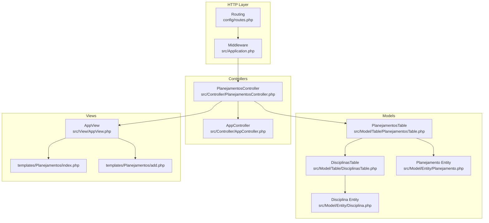
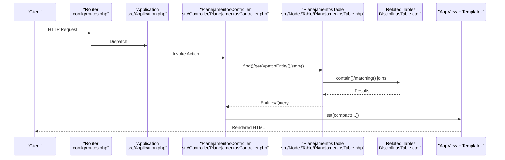
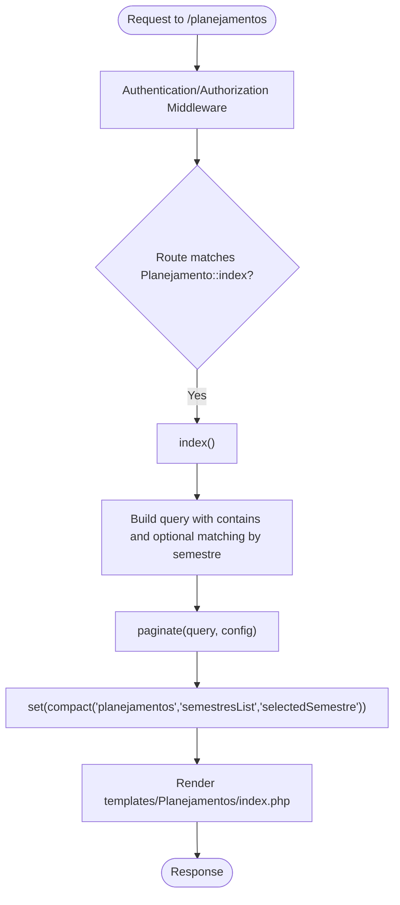
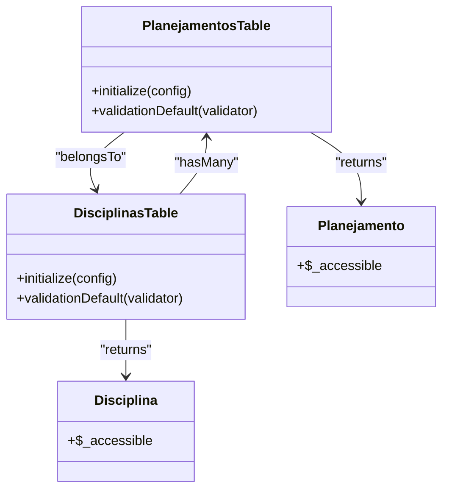
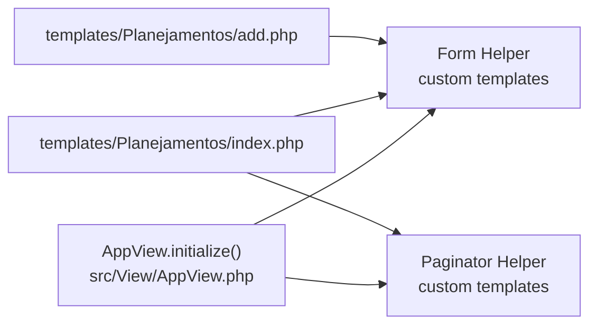
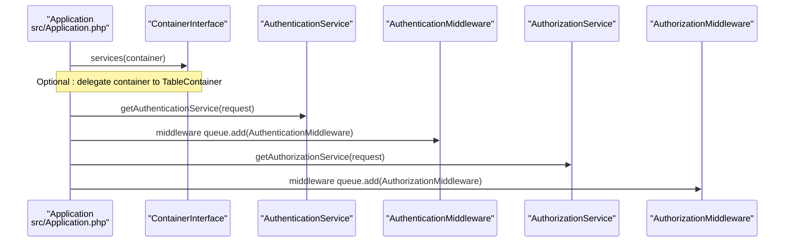
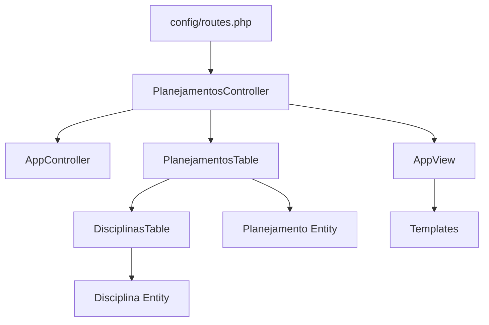

# MVC Pattern Implementation

<cite>
**Referenced Files in This Document**
- [Application.php](file://src/Application.php)
- [AppController.php](file://src/Controller/AppController.php)
- [PlanejamentosController.php](file://src/Controller/PlanejamentosController.php)
- [AppView.php](file://src/View/AppView.php)
- [PlanejamentosTable.php](file://src/Model/Table/PlanejamentosTable.php)
- [DisciplinasTable.php](file://src/Model/Table/DisciplinasTable.php)
- [Planejamento.php](file://src/Model/Entity/Planejamento.php)
- [Disciplina.php](file://src/Model/Entity/Disciplina.php)
- [index.php](file://templates/Planejamentos/index.php)
- [add.php](file://templates/Planejamentos/add.php)
- [routes.php](file://config/routes.php)
</cite>

## Table of Contents
1. [Introduction](#introduction)
2. [Project Structure](#project-structure)
3. [Core Components](#core-components)
4. [Architecture Overview](#architecture-overview)
5. [Detailed Component Analysis](#detailed-component-analysis)
6. [Dependency Analysis](#dependency-analysis)
7. [Performance Considerations](#performance-considerations)
8. [Troubleshooting Guide](#troubleshooting-guide)
9. [Conclusion](#conclusion)

## Introduction
This document explains how the CakePHP Model-View-Controller (MVC) pattern is implemented in planejamento5. It focuses on separation of concerns across controllers, models (Table and Entity), and views, and documents the base classes AppController, AppTable (via Table behavior usage), and AppView that provide shared functionality. It also covers how controllers interact with models through Table classes, how entities encapsulate business rules, and how templates render data using CakePHP’s view helpers. Finally, it addresses dependency injection container setup and service registration patterns used throughout the application.

## Project Structure
The project follows CakePHP conventions:
- Controllers under src/Controller handle HTTP requests and orchestrate logic.
- Models under src/Model/Table define data access and validation; Entities under src/Model/Entity represent domain objects and access rules.
- Views under templates render HTML using helpers provided by AppView.
- Application bootstrap and middleware are configured in src/Application.php.
- Routing maps URLs to controller actions in config/routes.php.

**Diagram sources**
- [routes.php:32-79](file://config/routes.php#L32-L79)
- [Application.php:73-122](file://src/Application.php#L73-L122)
- [AppController.php:29-54](file://src/Controller/AppController.php#L29-L54)
- [PlanejamentosController.php:9-17](file://src/Controller/PlanejamentosController.php#L9-L17)
- [PlanejamentosTable.php:9-40](file://src/Model/Table/PlanejamentosTable.php#L9-L40)
- [DisciplinasTable.php:13-27](file://src/Model/Table/DisciplinasTable.php#L13-L27)
- [Planejamento.php:11-26](file://src/Model/Entity/Planejamento.php#L11-L26)
- [Disciplina.php:26-48](file://src/Model/Entity/Disciplina.php#L26-L48)
- [AppView.php:28-61](file://src/View/AppView.php#L28-L61)
- [index.php:1-85](file://templates/Planejamentos/index.php#L1-L85)
- [add.php:1-32](file://templates/Planejamentos/add.php#L1-L32)

**Section sources**
- [routes.php:32-79](file://config/routes.php#L32-L79)
- [Application.php:73-122](file://src/Application.php#L73-L122)
- [AppController.php:29-54](file://src/Controller/AppController.php#L29-L54)
- [AppView.php:28-61](file://src/View/AppView.php#L28-L61)

## Core Components
- AppController: Base controller for all controllers. Initializes common components such as Flash, Authentication, and Authorization, and defines unauthenticated action lists.
- AppView: Base view class that loads global helpers (Form and Paginator) and applies custom templates.
- Table classes: Data access layer with associations, behaviors (e.g., Timestamp), and validation rules.
- Entities: Domain objects defining accessible fields and optional business logic.
- Templates: View files rendering UI using helpers from AppView.

Key responsibilities:
- Controllers manage request/response flow, authorization checks, and delegate persistence to Tables.
- Tables encapsulate queries, relationships, and validation.
- Entities enforce field accessibility and can host computed properties or business rules.
- Views render data safely and consistently via helpers.

**Section sources**
- [AppController.php:29-54](file://src/Controller/AppController.php#L29-L54)
- [AppView.php:28-61](file://src/View/AppView.php#L28-L61)
- [PlanejamentosTable.php:9-56](file://src/Model/Table/PlanejamentosTable.php#L9-L56)
- [DisciplinasTable.php:13-84](file://src/Model/Table/DisciplinasTable.php#L13-L84)
- [Planejamento.php:11-26](file://src/Model/Entity/Planejamento.php#L11-L26)
- [Disciplina.php:26-48](file://src/Model/Entity/Disciplina.php#L26-L48)

## Architecture Overview
CakePHP processes an incoming HTTP request through a well-defined pipeline:
- Routing resolves URL to controller/action.
- Middleware handles error handling, CSRF, authentication, and authorization.
- Controller orchestrates logic, interacts with Tables, and sets view variables.
- View renders templates using helpers.

**Diagram sources**
- [routes.php:32-79](file://config/routes.php#L32-L79)
- [Application.php:73-122](file://src/Application.php#L73-L122)
- [PlanejamentosController.php:17-67](file://src/Controller/PlanejamentosController.php#L17-L67)
- [PlanejamentosTable.php:9-40](file://src/Model/Table/PlanejamentosTable.php#L9-L40)
- [DisciplinasTable.php:13-27](file://src/Model/Table/DisciplinasTable.php#L13-L27)
- [AppView.php:28-61](file://src/View/AppView.php#L28-L61)

## Detailed Component Analysis

### Controllers: Separation of Concerns and HTTP Handling
- AppController initializes shared components (Flash, Authentication, Authorization) and configures unauthenticated actions globally.
- PlanejamentosController implements CRUD-like flows:
  - index: builds a paginated query with contains and optional filtering by semestre; uses pagination configuration for sortable fields.
  - add/edit: prepares related lists, derives turno and periodo from selected options, patches entities, persists changes, and provides user feedback via Flash messages.
  - delete: enforces allowed methods and performs deletion with feedback.
  - beforeFilter: extends unauthenticated actions for public listing and viewing.

**Diagram sources**
- [PlanejamentosController.php:11-15](file://src/Controller/PlanejamentosController.php#L11-L15)
- [PlanejamentosController.php:17-67](file://src/Controller/PlanejamentosController.php#L17-L67)
- [index.php:1-85](file://templates/Planejamentos/index.php#L1-L85)

**Section sources**
- [AppController.php:29-54](file://src/Controller/AppController.php#L29-L54)
- [PlanejamentosController.php:11-173](file://src/Controller/PlanejamentosController.php#L11-L173)

### Models: Table Classes and Entities
- PlanejamentosTable:
  - Configures table name, display field, primary key, and Timestamp behavior.
  - Declares belongsTo associations to Disciplinas, Docentes, Configuraplanejamentos, Salas, Dias, Horarios.
  - Provides validationDefault rules for required and optional fields.
- DisciplinasTable:
  - Configures table name, display field, primary key, and Timestamp behavior.
  - Declares hasMany relationship to Planejamentos.
  - Provides comprehensive validation rules for code, name, credits, hours, periods, requirements, optative flag, department, curriculum, and observations.
- Entities:
  - Planejamento and Disciplina define accessible fields for mass assignment.

**Diagram sources**
- [PlanejamentosTable.php:9-56](file://src/Model/Table/PlanejamentosTable.php#L9-L56)
- [DisciplinasTable.php:13-84](file://src/Model/Table/DisciplinasTable.php#L13-L84)
- [Planejamento.php:11-26](file://src/Model/Entity/Planejamento.php#L11-L26)
- [Disciplina.php:26-48](file://src/Model/Entity/Disciplina.php#L26-L48)

**Section sources**
- [PlanejamentosTable.php:9-56](file://src/Model/Table/PlanejamentosTable.php#L9-L56)
- [DisciplinasTable.php:13-84](file://src/Model/Table/DisciplinasTable.php#L13-L84)
- [Planejamento.php:11-26](file://src/Model/Entity/Planejamento.php#L11-L26)
- [Disciplina.php:26-48](file://src/Model/Entity/Disciplina.php#L26-L48)

### Views: Rendering and Helpers
- AppView:
  - Loads Form helper with custom templates from config/form_templates.php.
  - Loads Paginator helper with custom templates for next/prev/first/last/number/current/ellipsis.
- Templates:
  - templates/Planejamentos/index.php:
    - Uses Html, Form, Number, and Paginator helpers to render list, filters, sorting, and pagination controls.
  - templates/Planejamentos/add.php:
    - Uses Form helper to build inputs for related dropdowns and notes.

**Diagram sources**
- [AppView.php:39-60](file://src/View/AppView.php#L39-L60)
- [index.php:1-85](file://templates/Planejamentos/index.php#L1-L85)
- [add.php:1-32](file://templates/Planejamentos/add.php#L1-L32)

**Section sources**
- [AppView.php:39-60](file://src/View/AppView.php#L39-L60)
- [index.php:1-85](file://templates/Planejamentos/index.php#L1-L85)
- [add.php:1-32](file://templates/Planejamentos/add.php#L1-L32)

### Dependency Injection Container and Service Registration
- Application::services:
  - Provides a hook to register application-wide services into the DI container.
  - The example shows a commented delegation to a TableContainer to allow dependency injection of Tables.
- Application::bootstrap:
  - Disallows fallback Table classes via TableLocator to ensure explicit Table definitions.
- Authentication and Authorization:
  - Application implements provider interfaces and registers Authentication and Authorization middlewares.
  - getAuthenticationService configures session and form authenticators with Orm resolver pointing to Usuarioplanejamentos model.
  - getAuthorizationService returns an AuthorizationService with OrmResolver.

**Diagram sources**
- [Application.php:171-175](file://src/Application.php#L171-L175)
- [Application.php:58-65](file://src/Application.php#L58-L65)
- [Application.php:124-162](file://src/Application.php#L124-L162)
- [Application.php:73-122](file://src/Application.php#L73-L122)

**Section sources**
- [Application.php:58-65](file://src/Application.php#L58-L65)
- [Application.php:73-122](file://src/Application.php#L73-L122)
- [Application.php:124-162](file://src/Application.php#L124-L162)
- [Application.php:171-175](file://src/Application.php#L171-L175)

## Dependency Analysis
- Routing depends on routes.php to map URLs to controller actions.
- Controllers depend on AppController for shared initialization and on Table classes for data operations.
- Table classes depend on their respective Entities and may reference other Tables via associations.
- Views depend on AppView for helper availability and on template files for presentation.

**Diagram sources**
- [routes.php:32-79](file://config/routes.php#L32-L79)
- [PlanejamentosController.php:9-17](file://src/Controller/PlanejamentosController.php#L9-L17)
- [AppController.php:29-54](file://src/Controller/AppController.php#L29-L54)
- [PlanejamentosTable.php:9-40](file://src/Model/Table/PlanejamentosTable.php#L9-L40)
- [DisciplinasTable.php:13-27](file://src/Model/Table/DisciplinasTable.php#L13-L27)
- [Planejamento.php:11-26](file://src/Model/Entity/Planejamento.php#L11-L26)
- [Disciplina.php:26-48](file://src/Model/Entity/Disciplina.php#L26-L48)
- [AppView.php:28-61](file://src/View/AppView.php#L28-L61)

**Section sources**
- [routes.php:32-79](file://config/routes.php#L32-L79)
- [PlanejamentosController.php:9-17](file://src/Controller/PlanejamentosController.php#L9-L17)
- [AppController.php:29-54](file://src/Controller/AppController.php#L29-L54)
- [PlanejamentosTable.php:9-40](file://src/Model/Table/PlanejamentosTable.php#L9-L40)
- [DisciplinasTable.php:13-27](file://src/Model/Table/DisciplinasTable.php#L13-L27)
- [Planejamento.php:11-26](file://src/Model/Entity/Planejamento.php#L11-L26)
- [Disciplina.php:26-48](file://src/Model/Entity/Disciplina.php#L26-L48)
- [AppView.php:28-61](file://src/View/AppView.php#L28-L61)

## Performance Considerations
- Use contains and matching judiciously to avoid N+1 queries and excessive joins.
- Leverage pagination with sortableFields to minimize server-side processing.
- Prefer specific selects when retrieving large datasets to reduce payload size.
- Cache frequently accessed lookup lists (e.g., semestres, salas, dias, horarios) if they change infrequently.
- Ensure database indexes exist on foreign keys and commonly filtered columns (e.g., semestre).

[No sources needed since this section provides general guidance]

## Troubleshooting Guide
- Host Header Injection protection:
  - Ensure fullBaseUrl is configured in production to prevent security issues.
- Authentication/Authorization:
  - Verify that unauthenticated actions are correctly listed in AppController and controller-specific beforeFilter hooks.
  - Confirm that the Orm resolver points to the correct user model (Usuarioplanejamentos).
- Validation errors:
  - Check Table validationDefault methods for required fields and constraints.
- Missing Table classes:
  - Fallback classes are disabled; ensure all referenced tables have corresponding Table classes.

**Section sources**
- [Application.php:73-122](file://src/Application.php#L73-L122)
- [Application.php:124-162](file://src/Application.php#L124-L162)
- [AppController.php:40-53](file://src/Controller/AppController.php#L40-L53)
- [PlanejamentosTable.php:42-55](file://src/Model/Table/PlanejamentosTable.php#L42-L55)
- [DisciplinasTable.php:29-83](file://src/Model/Table/DisciplinasTable.php#L29-L83)

## Conclusion
planejamento5 implements CakePHP’s MVC pattern cleanly:
- Controllers handle HTTP concerns and orchestrate interactions with Tables.
- Tables encapsulate data access, relationships, and validation; Entities define accessible fields and potential business rules.
- Views leverage AppView’s helpers to render consistent UIs.
- Application-level configuration centralizes middleware, authentication, authorization, and DI container setup, ensuring secure and maintainable architecture.

[No sources needed since this section summarizes without analyzing specific files]