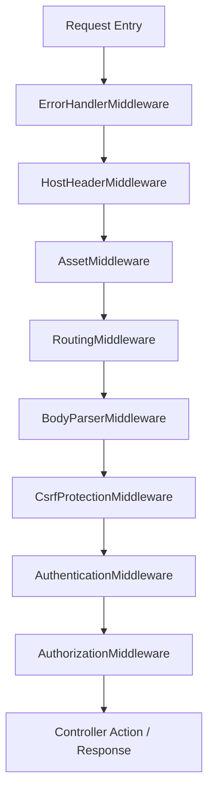
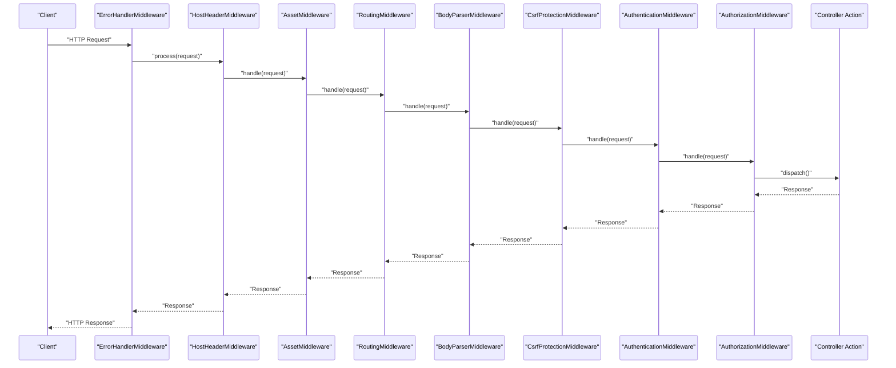
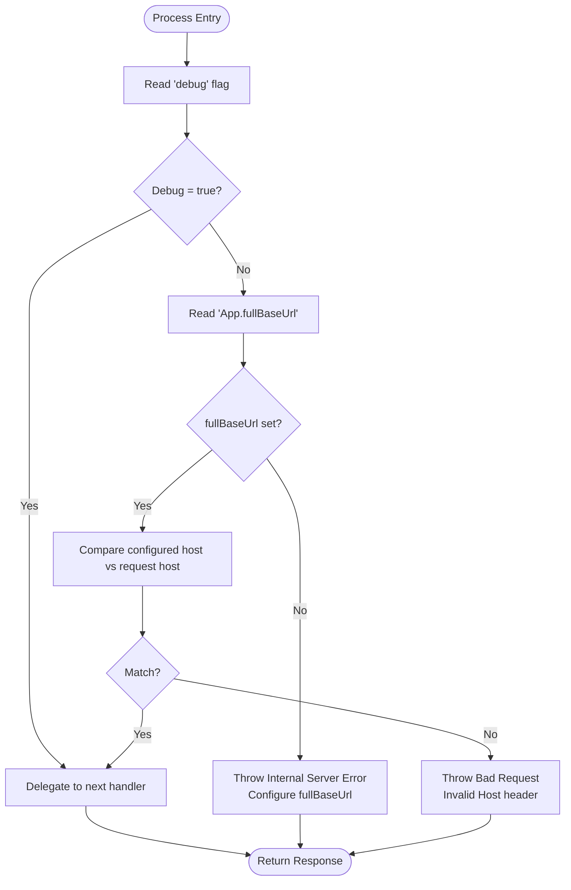
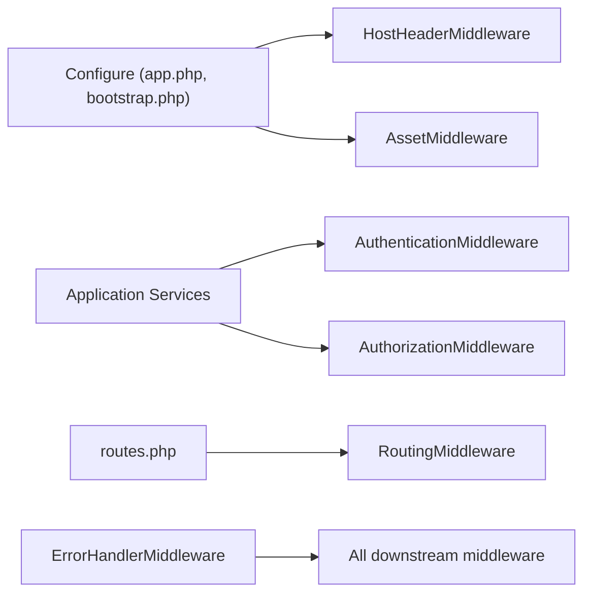

# Middleware Pipeline Architecture

<cite>
**Referenced Files in This Document**
- [Application.php](file://src/Application.php)
- [HostHeaderMiddleware.php](file://src/Middleware/HostHeaderMiddleware.php)
- [app.php](file://config/app.php)
- [bootstrap.php](file://config/bootstrap.php)
- [routes.php](file://config/routes.php)
</cite>

## Table of Contents
1. [Introduction](#introduction)
2. [Project Structure](#project-structure)
3. [Core Components](#core-components)
4. [Architecture Overview](#architecture-overview)
5. [Detailed Component Analysis](#detailed-component-analysis)
6. [Dependency Analysis](#dependency-analysis)
7. [Performance Considerations](#performance-considerations)
8. [Troubleshooting Guide](#troubleshooting-guide)
9. [Conclusion](#conclusion)

## Introduction
This document explains the middleware pipeline architecture in planejamento5, focusing on how requests flow through the middleware stack and how each layer contributes to security, routing, parsing, and authorization. It covers error handling, host header validation, asset serving, routing, body parsing, CSRF protection, authentication, and authorization layers. It also documents configuration options, execution order, and provides concrete examples from HostHeaderMiddleware to illustrate custom middleware patterns. Finally, it addresses security considerations, performance implications, and debugging techniques for middleware issues.

## Project Structure
The middleware pipeline is configured in the application bootstrap and registration points:
- Application class defines the middleware queue and integrates authentication and authorization services.
- Custom middleware (HostHeaderMiddleware) enforces host header validation.
- Configuration files define runtime behavior such as debug mode, base URL, and asset caching.
- Routes file connects URLs to controllers/actions after routing middleware resolves them.

**Diagram sources**
- [Application.php:73-122](file://src/Application.php#L73-L122)
- [HostHeaderMiddleware.php:32-57](file://src/Middleware/HostHeaderMiddleware.php#L32-L57)

**Section sources**
- [Application.php:73-122](file://src/Application.php#L73-L122)
- [HostHeaderMiddleware.php:32-57](file://src/Middleware/HostHeaderMiddleware.php#L32-L57)
- [app.php:52-71](file://config/app.php#L52-L71)
- [bootstrap.php:150-183](file://config/bootstrap.php#L150-L183)
- [routes.php:52-79](file://config/routes.php#L52-L79)

## Core Components
- ErrorHandlerMiddleware: Wraps lower layers to catch exceptions and render error responses.
- HostHeaderMiddleware: Validates Host header against App.fullBaseUrl in production; bypassed when debug is true.
- AssetMiddleware: Serves static assets with cache-time headers based on configuration.
- RoutingMiddleware: Resolves routes and dispatches to controller actions.
- BodyParserMiddleware: Parses request bodies into accessible data structures.
- CsrfProtectionMiddleware: Enforces CSRF token validation for state-changing requests.
- AuthenticationMiddleware: Authenticates users using configured authenticators and identity providers.
- AuthorizationMiddleware: Authorizes access via policies and redirects or blocks unauthorized requests.

Key configuration references:
- Debug mode toggles HostHeaderMiddleware behavior.
- App.fullBaseUrl drives host validation and URL generation.
- Asset.cacheTime controls static asset caching.
- CSRF httponly cookie flag is enabled by default.
- Authentication and Authorization services are provided by the Application class.

**Section sources**
- [Application.php:73-122](file://src/Application.php#L73-L122)
- [HostHeaderMiddleware.php:32-57](file://src/Middleware/HostHeaderMiddleware.php#L32-L57)
- [app.php:52-71](file://config/app.php#L52-L71)
- [app.php:92-95](file://config/app.php#L92-L95)

## Architecture Overview
The pipeline executes in a strict order. Each middleware can intercept the request before passing it down the chain and can modify the response on the way back up. Exceptions thrown at any stage bubble up to ErrorHandlerMiddleware, which converts them into HTTP responses.

**Diagram sources**
- [Application.php:73-122](file://src/Application.php#L73-L122)
- [HostHeaderMiddleware.php:32-57](file://src/Middleware/HostHeaderMiddleware.php#L32-L57)

## Detailed Component Analysis

### Error Handling Layer
- Purpose: Centralized exception capture and rendering.
- Behavior: Wraps all subsequent middleware; converts unhandled exceptions into appropriate HTTP responses.
- Configuration: Uses Error configuration array for logging, trace, and renderer settings.

Security and performance notes:
- In production, detailed traces should be disabled to avoid information leakage.
- Logging should be tuned to avoid excessive disk I/O.

**Section sources**
- [Application.php:73-78](file://src/Application.php#L73-L78)
- [app.php:176-183](file://config/app.php#L176-L183)

### Host Header Validation Layer
- Purpose: Prevents Host Header Injection attacks by validating the incoming Host header against App.fullBaseUrl in production.
- Behavior:
  - If debug is true, bypasses validation and proceeds directly to next middleware.
  - If App.fullBaseUrl is not set in production, throws an internal server error indicating misconfiguration.
  - Compares configured host with request host; if mismatched, returns a bad request error.
- Implementation pattern: Implements PSR-15 MiddlewareInterface, reads configuration, validates input, and either short-circuits with an error or delegates to the handler.

Configuration dependencies:
- debug flag from app configuration.
- App.fullBaseUrl from environment or config.

Security considerations:
- Critical for preventing malicious link generation and session hijacking vectors tied to host-based logic.
- Development convenience vs. production safety trade-off is explicitly handled by debug gating.

Example usage pattern:
- See HostHeaderMiddleware process method for conditional branching, configuration reading, and exception throwing.

**Section sources**
- [HostHeaderMiddleware.php:32-57](file://src/Middleware/HostHeaderMiddleware.php#L32-L57)
- [app.php:52-71](file://config/app.php#L52-L71)
- [bootstrap.php:150-183](file://config/bootstrap.php#L150-L183)

#### Host Header Validation Flowchart

**Diagram sources**
- [HostHeaderMiddleware.php:32-57](file://src/Middleware/HostHeaderMiddleware.php#L32-L57)

### Asset Serving Layer
- Purpose: Serve static assets (CSS, JS, images) with appropriate cache headers.
- Behavior: Checks requested paths under webroot and serves files directly if found.
- Configuration: Uses Asset.cacheTime to set cache duration.

Performance considerations:
- Proper cache times reduce bandwidth and improve load times.
- Avoid heavy processing in this layer; keep it fast.

**Section sources**
- [Application.php:85-88](file://src/Application.php#L85-L88)
- [app.php:92-95](file://config/app.php#L92-L95)

### Routing Layer
- Purpose: Resolve incoming URLs to controller/action pairs.
- Behavior: Matches routes defined in routes.php and prepares the request context for controllers.
- Configuration: Route classes and fallbacks are defined in routes.php.

Notes:
- For large route sets, consider enabling route caching in production to improve performance.

**Section sources**
- [Application.php:90-94](file://src/Application.php#L90-L94)
- [routes.php:52-79](file://config/routes.php#L52-L79)

### Body Parsing Layer
- Purpose: Parse various encoded request bodies (e.g., JSON, form data) into accessible arrays.
- Behavior: Populates request data so controllers can read structured inputs.

Security considerations:
- Ensure payload size limits are enforced upstream or within application logic to prevent DoS.

**Section sources**
- [Application.php:96-99](file://src/Application.php#L96-L99)

### CSRF Protection Layer
- Purpose: Protect state-changing requests from cross-site request forgery.
- Behavior: Validates CSRF tokens and sets secure cookies; httponly is enabled by default.

Configuration:
- httponly flag prevents client-side script access to the CSRF cookie.

**Section sources**
- [Application.php:101-105](file://src/Application.php#L101-L105)

### Authentication Layer
- Purpose: Identify users based on configured authenticators.
- Behavior: Loads Session and Form authenticators; maps username/password fields to email/password; uses ORM resolver for user lookup.
- Configuration: Provided via getAuthenticationService in Application class.

Security considerations:
- Use strong password hashing and enforce HTTPS.
- Redirect unauthenticated users to login with redirect query parameter preserved.

**Section sources**
- [Application.php:124-155](file://src/Application.php#L124-L155)

### Authorization Layer
- Purpose: Enforce policy-based access control over controller actions.
- Behavior: Uses OrmResolver to resolve policies; handles unauthorized exceptions by redirecting to login with optional redirect parameter.
- Configuration: Provided via getAuthorizationService and AuthorizationMiddleware options in Application class.

Security considerations:
- Policies should be explicit and least-privilege by default.
- UnauthorizedHandler ensures consistent redirection behavior.

**Section sources**
- [Application.php:157-162](file://src/Application.php#L157-L162)
- [Application.php:108-119](file://src/Application.php#L108-L119)

## Dependency Analysis
The middleware components depend on configuration and framework services:
- HostHeaderMiddleware depends on Configure for debug and App.fullBaseUrl.
- AssetMiddleware depends on Asset.cacheTime.
- Authentication and Authorization middlewares depend on services provided by Application.
- RoutingMiddleware depends on routes defined in routes.php.

**Diagram sources**
- [Application.php:73-122](file://src/Application.php#L73-L122)
- [HostHeaderMiddleware.php:32-57](file://src/Middleware/HostHeaderMiddleware.php#L32-L57)
- [app.php:52-71](file://config/app.php#L52-L71)
- [bootstrap.php:150-183](file://config/bootstrap.php#L150-L183)
- [routes.php:52-79](file://config/routes.php#L52-L79)

**Section sources**
- [Application.php:73-122](file://src/Application.php#L73-L122)
- [HostHeaderMiddleware.php:32-57](file://src/Middleware/HostHeaderMiddleware.php#L32-L57)
- [app.php:52-71](file://config/app.php#L52-L71)
- [bootstrap.php:150-183](file://config/bootstrap.php#L150-L183)
- [routes.php:52-79](file://config/routes.php#L52-L79)

## Performance Considerations
- Keep HostHeaderMiddleware early to fail fast on invalid hosts in production.
- Enable asset caching via Asset.cacheTime to reduce repeated file reads.
- Consider route caching for large applications to minimize route resolution overhead.
- Tune error logging levels to balance observability with I/O costs.
- Avoid heavy operations in early middleware; defer expensive work to later stages or background jobs.

[No sources needed since this section provides general guidance]

## Troubleshooting Guide
Common issues and diagnostics:
- Host Header Injection errors in production:
  - Ensure App.fullBaseUrl is configured via environment variable or config.
  - Verify that the Host header matches the configured host.
- Unexpected bypass of host validation:
  - Check debug flag; in development, HostHeaderMiddleware skips validation.
- CSRF failures:
  - Confirm CSRF tokens are present and cookies are correctly set with httponly.
- Authentication/Authorization redirects:
  - Review unauthenticatedRedirect and unauthorizedHandler configurations.
- Asset not served:
  - Validate path mapping and cacheTime configuration.

Debugging techniques:
- Inspect logs generated by ErrorHandlerMiddleware.
- Temporarily enable debug to observe request flow without host validation constraints.
- Add logging around middleware boundaries to trace request/response lifecycle.

**Section sources**
- [HostHeaderMiddleware.php:32-57](file://src/Middleware/HostHeaderMiddleware.php#L32-L57)
- [Application.php:108-119](file://src/Application.php#L108-L119)
- [Application.php:124-155](file://src/Application.php#L124-L155)
- [app.php:176-183](file://config/app.php#L176-L183)

## Conclusion
The middleware pipeline in planejamento5 follows a clear, layered approach: error handling, host validation, asset serving, routing, body parsing, CSRF protection, authentication, and authorization. Each component has well-defined responsibilities and configuration points. HostHeaderMiddleware exemplifies a secure custom middleware pattern that conditionally enforces host validation based on environment. By understanding the execution order, configuration dependencies, and security implications, developers can extend and maintain the pipeline effectively while ensuring robustness and performance.

[No sources needed since this section summarizes without analyzing specific files]