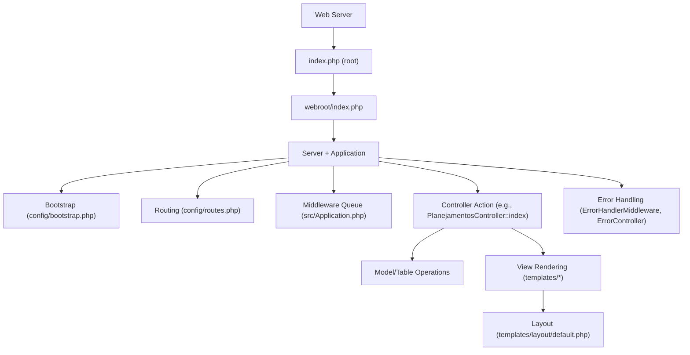
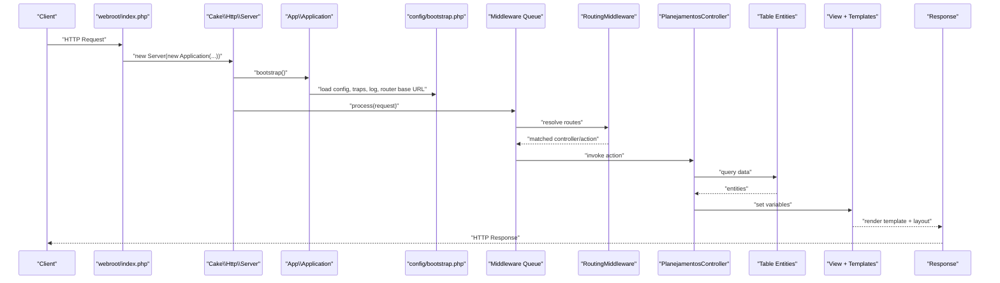
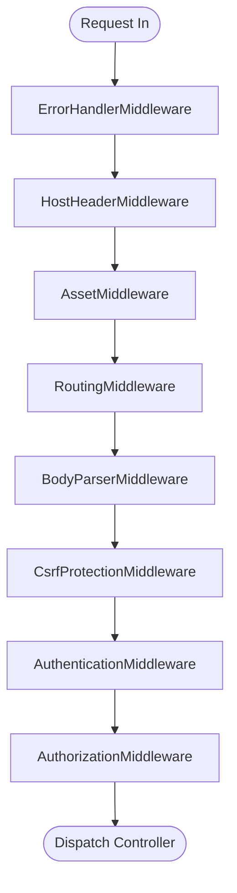
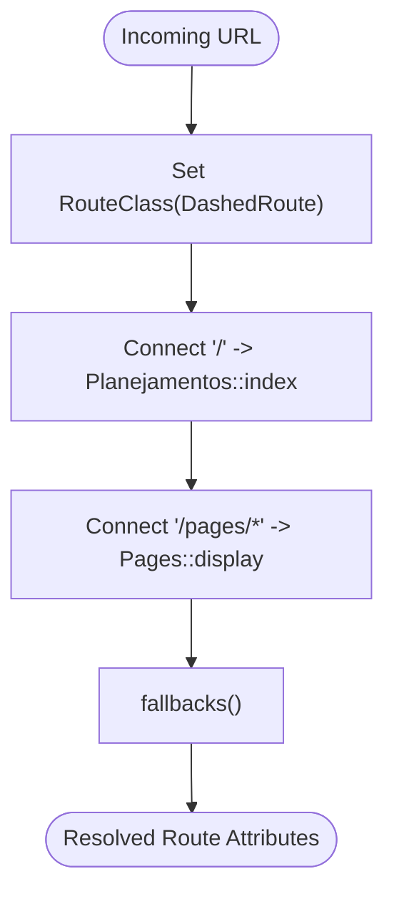
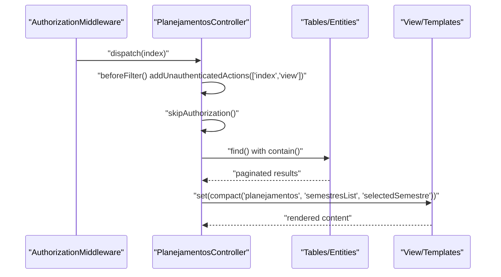
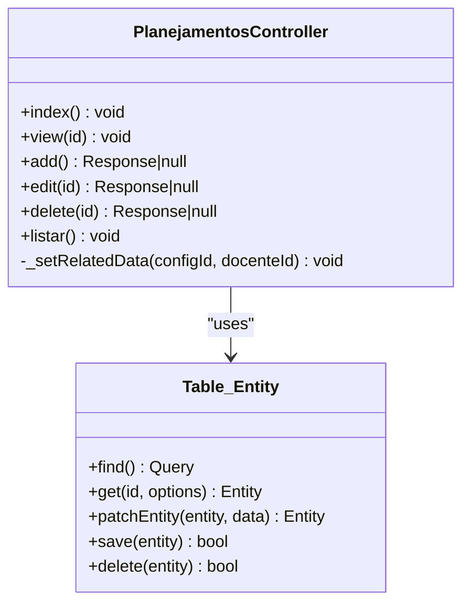
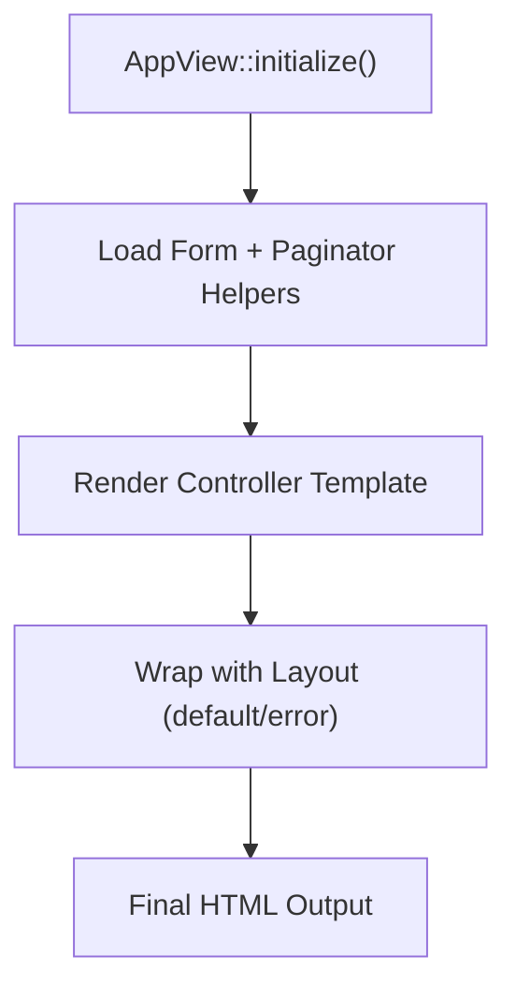
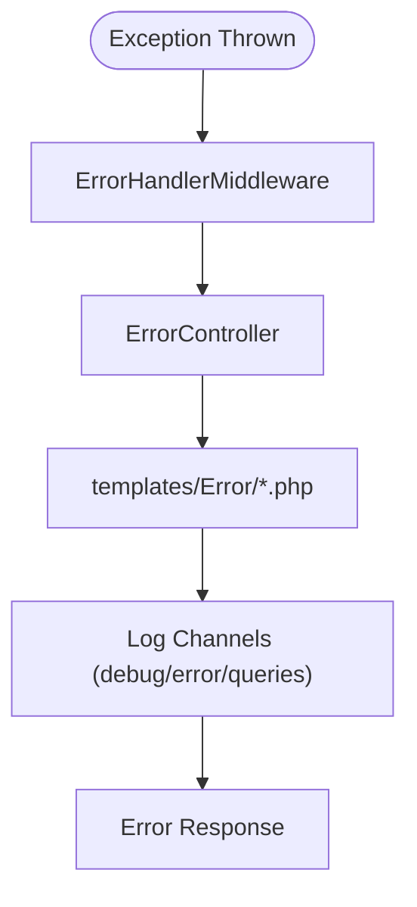
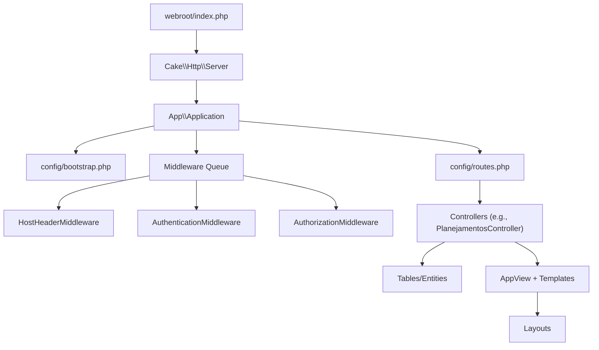

# Request-Response Processing Flow

<cite>
**Referenced Files in This Document**
- [index.php](file://index.php)
- [webroot/index.php](file://webroot/index.php)
- [src/Application.php](file://src/Application.php)
- [config/bootstrap.php](file://config/bootstrap.php)
- [config/routes.php](file://config/routes.php)
- [src/Middleware/HostHeaderMiddleware.php](file://src/Middleware/HostHeaderMiddleware.php)
- [src/Controller/AppController.php](file://src/Controller/AppController.php)
- [src/Controller/ErrorController.php](file://src/Controller/ErrorController.php)
- [src/Controller/PlanejamentosController.php](file://src/Controller/PlanejamentosController.php)
- [templates/Planejamentos/index.php](file://templates/Planejamentos/index.php)
- [src/View/AppView.php](file://src/View/AppView.php)
- [config/app.php](file://config/app.php)
- [templates/Error/error500.php](file://templates/Error/error500.php)
</cite>

## Table of Contents
1. [Introduction](#introduction)
2. [Project Structure](#project-structure)
3. [Core Components](#core-components)
4. [Architecture Overview](#architecture-overview)
5. [Detailed Component Analysis](#detailed-component-analysis)
6. [Dependency Analysis](#dependency-analysis)
7. [Performance Considerations](#performance-considerations)
8. [Troubleshooting Guide](#troubleshooting-guide)
9. [Conclusion](#conclusion)

## Introduction
This document traces the complete HTTP request-response lifecycle in the planejamento5 CakePHP application. It follows a request from the web server entry points through CakePHP’s bootstrap, routing resolution, middleware execution, controller action invocation, model operations, template rendering, and response emission. It also documents error handling, logging mechanisms, and performance monitoring points across the pipeline.

## Project Structure
The application uses standard CakePHP conventions:
- Entry points are at the repository root and under webroot.
- Application orchestration is defined in src/Application.php.
- Bootstrap logic initializes configuration, error traps, logging, and environment settings.
- Routes map URLs to controllers/actions in config/routes.php.
- Controllers live under src/Controller, views under templates, and custom view helpers in src/View.

**Diagram sources**
- [index.php:16-17](file://index.php#L16-L17)
- [webroot/index.php:28-37](file://webroot/index.php#L28-L37)
- [src/Application.php:58-122](file://src/Application.php#L58-L122)
- [config/bootstrap.php:87-194](file://config/bootstrap.php#L87-L194)
- [config/routes.php:32-79](file://config/routes.php#L32-L79)
- [src/Controller/PlanejamentosController.php:17-67](file://src/Controller/PlanejamentosController.php#L17-L67)
- [templates/Planejamentos/index.php:1-85](file://templates/Planejamentos/index.php#L1-L85)
- [src/View/AppView.php:39-60](file://src/View/AppView.php#L39-L60)
- [src/Controller/ErrorController.php:26-70](file://src/Controller/ErrorController.php#L26-L70)

**Section sources**
- [index.php:16-17](file://index.php#L16-L17)
- [webroot/index.php:18-37](file://webroot/index.php#L18-L37)
- [src/Application.php:58-122](file://src/Application.php#L58-L122)
- [config/bootstrap.php:87-194](file://config/bootstrap.php#L87-L194)
- [config/routes.php:32-79](file://config/routes.php#L32-L79)

## Core Components
- Entry Points
  - Root index.php delegates to webroot/index.php.
  - webroot/index.php bootstraps Composer autoload, constructs the Server with the Application, runs it, and emits the Response.
- Application Orchestration
  - src/Application.php defines bootstrap(), middleware(), authentication/authorization services, container registration, and event listeners.
- Bootstrap
  - config/bootstrap.php loads paths, core bootstrap, configuration files, timezone/locale, error/exception traps, base URL setup, cache/datasource/email/log/security configuration, and device detectors.
- Routing
  - config/routes.php sets default route class, connects home route to Planejamento::index, static pages, and fallbacks.
- Middleware Pipeline
  - ErrorHandlerMiddleware, HostHeaderMiddleware, AssetMiddleware, RoutingMiddleware, BodyParserMiddleware, CsrfProtectionMiddleware, AuthenticationMiddleware, AuthorizationMiddleware.
- Controllers and Views
  - AppController initializes common components (Flash, Authentication, Authorization).
  - Example controller PlanejamentosController implements actions that query models and set view variables.
  - AppView loads helpers and custom templates for Form and Paginator.
- Error Handling
  - ErrorController renders error templates; templates/Error/error500.php adapts output based on debug mode.

**Section sources**
- [index.php:16-17](file://index.php#L16-L17)
- [webroot/index.php:28-37](file://webroot/index.php#L28-L37)
- [src/Application.php:58-122](file://src/Application.php#L58-L122)
- [config/bootstrap.php:87-194](file://config/bootstrap.php#L87-L194)
- [config/routes.php:32-79](file://config/routes.php#L32-L79)
- [src/Controller/AppController.php:40-53](file://src/Controller/AppController.php#L40-L53)
- [src/Controller/PlanejamentosController.php:17-67](file://src/Controller/PlanejamentosController.php#L17-L67)
- [src/View/AppView.php:39-60](file://src/View/AppView.php#L39-L60)
- [src/Controller/ErrorController.php:26-70](file://src/Controller/ErrorController.php#L26-L70)
- [templates/Error/error500.php:10-36](file://templates/Error/error500.php#L10-L36)

## Architecture Overview
The following sequence diagram maps the end-to-end flow for a typical GET request to the home page, which resolves to PlanejamentosController::index.

**Diagram sources**
- [webroot/index.php:28-37](file://webroot/index.php#L28-L37)
- [src/Application.php:58-122](file://src/Application.php#L58-L122)
- [config/bootstrap.php:87-194](file://config/bootstrap.php#L87-L194)
- [config/routes.php:52-79](file://config/routes.php#L52-L79)
- [src/Controller/PlanejamentosController.php:17-67](file://src/Controller/PlanejamentosController.php#L17-L67)
- [templates/Planejamentos/index.php:1-85](file://templates/Planejamentos/index.php#L1-L85)

## Detailed Component Analysis

### Entry Points and Bootstrap
- Root index.php simply includes webroot/index.php, centralizing all requests into the front controller.
- webroot/index.php:
  - Handles built-in PHP server static file bypass.
  - Loads Composer autoloader.
  - Instantiates Server with Application(config path).
  - Runs the application and emits the response.
- Application::bootstrap():
  - Calls parent bootstrap to load config/bootstrap.php.
  - Disallows fallback Table classes for stricter behavior.
- config/bootstrap.php:
  - Loads paths and core bootstrap.
  - Initializes Configure, loads app.php and optional app_local.php.
  - Sets timezone, locale, mbstring encoding.
  - Registers ErrorTrap and ExceptionTrap.
  - Configures full base URL using APP_FULL_BASE_URL or HTTP_HOST fallback (development only).
  - Applies Cache, Datasources, Email, Log, Security configurations.
  - Adds mobile/tablet detectors.

**Section sources**
- [index.php:16-17](file://index.php#L16-L17)
- [webroot/index.php:18-37](file://webroot/index.php#L18-L37)
- [src/Application.php:58-65](file://src/Application.php#L58-L65)
- [config/bootstrap.php:87-194](file://config/bootstrap.php#L87-L194)

### Middleware Execution Order and Responsibilities
The middleware queue is configured in Application::middleware(). The order determines processing timing:
1. ErrorHandlerMiddleware: Catches exceptions early and produces error responses.
2. HostHeaderMiddleware: Validates Host header against configured fullBaseUrl in production.
3. AssetMiddleware: Serves plugin/theme assets directly when applicable.
4. RoutingMiddleware: Resolves routes and populates request attributes.
5. BodyParserMiddleware: Parses JSON/XML bodies into request data.
6. CsrfProtectionMiddleware: Enforces CSRF tokens for state-changing requests.
7. AuthenticationMiddleware: Authenticates identity using configured authenticators.
8. AuthorizationMiddleware: Authorizes access via policies and handlers.

**Diagram sources**
- [src/Application.php:73-122](file://src/Application.php#L73-L122)
- [src/Middleware/HostHeaderMiddleware.php:32-57](file://src/Middleware/HostHeaderMiddleware.php#L32-L57)

**Section sources**
- [src/Application.php:73-122](file://src/Application.php#L73-L122)
- [src/Middleware/HostHeaderMiddleware.php:32-57](file://src/Middleware/HostHeaderMiddleware.php#L32-L57)

### Routing Resolution
- Default route class is set to dashed inflection.
- Home route connects “/” to PlanejamentosController::index.
- Static pages route supports /pages/* mapping to Pages::display.
- Fallbacks() enables conventional RESTful routes for controllers/actions.

**Diagram sources**
- [config/routes.php:32-79](file://config/routes.php#L32-L79)

**Section sources**
- [config/routes.php:32-79](file://config/routes.php#L32-L79)

### Controller Lifecycle and Action Invocation
- AppController::initialize():
  - Loads Flash component.
  - Loads Authentication and Authorization components.
  - Declares unauthenticated actions (e.g., display).
- PlanejamentosController::beforeFilter():
  - Extends unauthenticated actions to include index and view.
- PlanejamentosController::index():
  - Skips authorization for listing.
  - Reads query parameter semestre.
  - Queries related Configuraplanejamentos for distinct semestres.
  - Builds a paginated query with contains for Disciplinas, Docentes, Configuraplanejamentos, Salas, Dias, Horarios.
  - Optionally filters by selected semestre.
  - Sets view variables for pagination and filter UI.

**Diagram sources**
- [src/Controller/AppController.php:40-53](file://src/Controller/AppController.php#L40-L53)
- [src/Controller/PlanejamentosController.php:11-15](file://src/Controller/PlanejamentosController.php#L11-L15)
- [src/Controller/PlanejamentosController.php:17-67](file://src/Controller/PlanejamentosController.php#L17-L67)

**Section sources**
- [src/Controller/AppController.php:40-53](file://src/Controller/AppController.php#L40-L53)
- [src/Controller/PlanejamentosController.php:11-15](file://src/Controller/PlanejamentosController.php#L11-L15)
- [src/Controller/PlanejamentosController.php:17-67](file://src/Controller/PlanejamentosController.php#L17-L67)

### Model Operations and Data Access
- The controller uses Table entities (via $this->Planejamentos) to build queries with contains for related tables.
- Filtering uses matching to join Configuraplanejamentos and apply where conditions.
- Pagination is handled via $this->paginate(query, config), enabling sortable fields and list presentation.

**Diagram sources**
- [src/Controller/PlanejamentosController.php:17-67](file://src/Controller/PlanejamentosController.php#L17-L67)
- [src/Controller/PlanejamentosController.php:69-81](file://src/Controller/PlanejamentosController.php#L69-L81)
- [src/Controller/PlanejamentosController.php:83-127](file://src/Controller/PlanejamentosController.php#L83-L127)
- [src/Controller/PlanejamentosController.php:129-173](file://src/Controller/PlanejamentosController.php#L129-L173)
- [src/Controller/PlanejamentosController.php:175-187](file://src/Controller/PlanejamentosController.php#L175-L187)
- [src/Controller/PlanejamentosController.php:189-207](file://src/Controller/PlanejamentosController.php#L189-L207)
- [src/Controller/PlanejamentosController.php:209-254](file://src/Controller/PlanejamentosController.php#L209-L254)

**Section sources**
- [src/Controller/PlanejamentosController.php:17-67](file://src/Controller/PlanejamentosController.php#L17-L67)
- [src/Controller/PlanejamentosController.php:69-81](file://src/Controller/PlanejamentosController.php#L69-L81)
- [src/Controller/PlanejamentosController.php:83-127](file://src/Controller/PlanejamentosController.php#L83-L127)
- [src/Controller/PlanejamentosController.php:129-173](file://src/Controller/PlanejamentosController.php#L129-L173)
- [src/Controller/PlanejamentosController.php:175-187](file://src/Controller/PlanejamentosController.php#L175-L187)
- [src/Controller/PlanejamentosController.php:189-207](file://src/Controller/PlanejamentosController.php#L189-L207)
- [src/Controller/PlanejamentosController.php:209-254](file://src/Controller/PlanejamentosController.php#L209-L254)

### Template Rendering and Layout Composition
- View initialization in AppView loads Form helper with custom templates and customizes Paginator templates.
- Controller sets view variables; templates render lists, forms, and links.
- Layouts wrap rendered content; error layouts are used during error handling.

**Diagram sources**
- [src/View/AppView.php:39-60](file://src/View/AppView.php#L39-L60)
- [templates/Planejamentos/index.php:1-85](file://templates/Planejamentos/index.php#L1-L85)

**Section sources**
- [src/View/AppView.php:39-60](file://src/View/AppView.php#L39-L60)
- [templates/Planejamentos/index.php:1-85](file://templates/Planejamentos/index.php#L1-L85)

### Error Handling and Logging
- ErrorHandlerMiddleware wraps the pipeline to catch exceptions and produce error responses.
- ErrorController sets template path to Error and avoids loading unsafe AppController hooks.
- templates/Error/error500.php switches to development layout when debug is enabled and shows detailed error context.
- Logging is configured in config/app.php with separate channels for debug, error, and queries.

**Diagram sources**
- [src/Application.php:73-78](file://src/Application.php#L73-L78)
- [src/Controller/ErrorController.php:26-70](file://src/Controller/ErrorController.php#L26-L70)
- [templates/Error/error500.php:10-36](file://templates/Error/error500.php#L10-L36)
- [config/app.php:348-373](file://config/app.php#L348-L373)

**Section sources**
- [src/Application.php:73-78](file://src/Application.php#L73-L78)
- [src/Controller/ErrorController.php:26-70](file://src/Controller/ErrorController.php#L26-L70)
- [templates/Error/error500.php:10-36](file://templates/Error/error500.php#L10-L36)
- [config/app.php:348-373](file://config/app.php#L348-L373)

## Dependency Analysis
The following diagram highlights key dependencies among core components involved in the request lifecycle.

**Diagram sources**
- [webroot/index.php:28-37](file://webroot/index.php#L28-L37)
- [src/Application.php:58-122](file://src/Application.php#L58-L122)
- [config/bootstrap.php:87-194](file://config/bootstrap.php#L87-L194)
- [config/routes.php:32-79](file://config/routes.php#L32-L79)
- [src/Controller/PlanejamentosController.php:17-67](file://src/Controller/PlanejamentosController.php#L17-L67)
- [src/View/AppView.php:39-60](file://src/View/AppView.php#L39-L60)

**Section sources**
- [webroot/index.php:28-37](file://webroot/index.php#L28-L37)
- [src/Application.php:58-122](file://src/Application.php#L58-L122)
- [config/bootstrap.php:87-194](file://config/bootstrap.php#L87-L194)
- [config/routes.php:32-79](file://config/routes.php#L32-L79)
- [src/Controller/PlanejamentosController.php:17-67](file://src/Controller/PlanejamentosController.php#L17-L67)
- [src/View/AppView.php:39-60](file://src/View/AppView.php#L39-L60)

## Performance Considerations
- Routing Cache: The comments in Application::middleware indicate that enabling routes caching can improve performance for large route sets. Consider integrating a cached routing solution in production.
- Debug Mode Impacts: config/bootstrap.php shortens cache durations for model and translations when debug is true, aiding development but reducing performance in production. Ensure debug is false in production.
- Database Query Logging: The datasource log flag is disabled by default; enable selectively for profiling and disable in production to avoid overhead.
- Asset Timestamping: Asset.timestamp and cacheTime can be tuned to balance cache busting and browser caching.
- Pagination and Contains: Use paginate with appropriate containments to minimize N+1 queries and reduce payload size.

[No sources needed since this section provides general guidance]

## Troubleshooting Guide
- Host Header Injection Protection:
  - In production, if App.fullBaseUrl is not configured, HostHeaderMiddleware throws an internal error. Set APP_FULL_BASE_URL or configure App.fullBaseUrl.
- Authentication Redirects:
  - Unauthenticated users are redirected to /users/login with a redirect query parameter. Verify loginUrl and unauthenticatedRedirect settings in Application::getAuthenticationService.
- Authorization Handlers:
  - Unauthorized access redirects to /users/login unless overridden. Check AuthorizationMiddleware configuration and policy implementations.
- Error Pages:
  - When debug is true, error500.php uses a development layout with editor links. In production, generic error messages are shown.
- Logging:
  - Check Log channels (debug, error, queries) configured in app.php. Enable query logging temporarily for performance analysis.

**Section sources**
- [src/Middleware/HostHeaderMiddleware.php:32-57](file://src/Middleware/HostHeaderMiddleware.php#L32-L57)
- [src/Application.php:124-155](file://src/Application.php#L124-L155)
- [src/Application.php:107-122](file://src/Application.php#L107-L122)
- [templates/Error/error500.php:10-36](file://templates/Error/error500.php#L10-L36)
- [config/app.php:348-373](file://config/app.php#L348-L373)

## Conclusion
The planejamento5 application follows CakePHP’s standard request lifecycle with clear separation of concerns:
- Entry points delegate to a single front controller.
- Application orchestrates bootstrap, middleware, and service providers.
- Middleware enforces security, parsing, routing, authentication, and authorization.
- Controllers coordinate model operations and view rendering.
- Error handling and logging provide robust diagnostics and user-friendly responses.

By understanding these stages and their interactions, developers can diagnose issues, optimize performance, and extend functionality safely within the framework’s architecture.