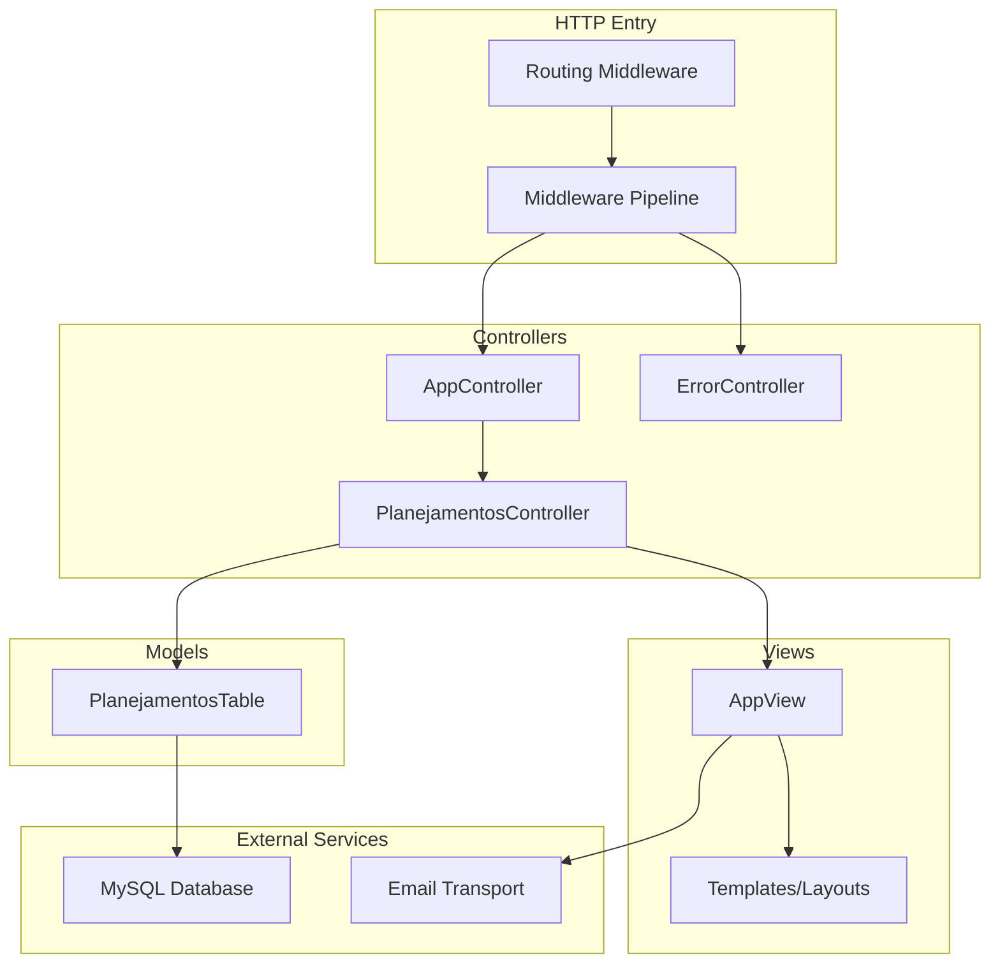
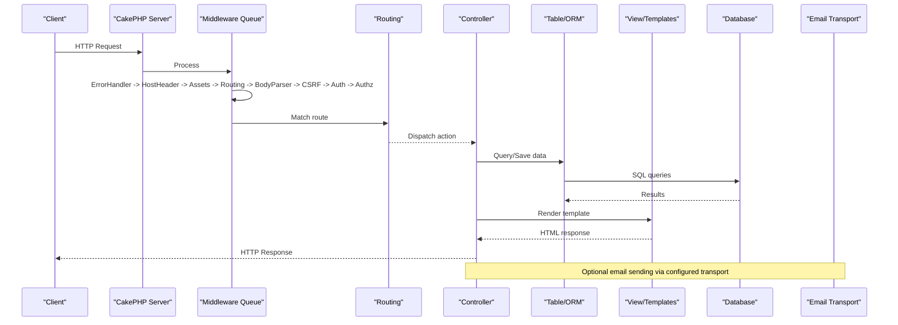
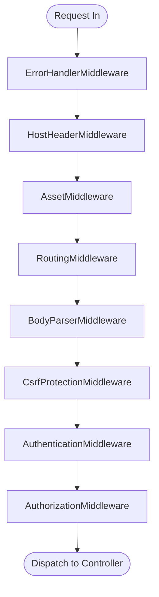
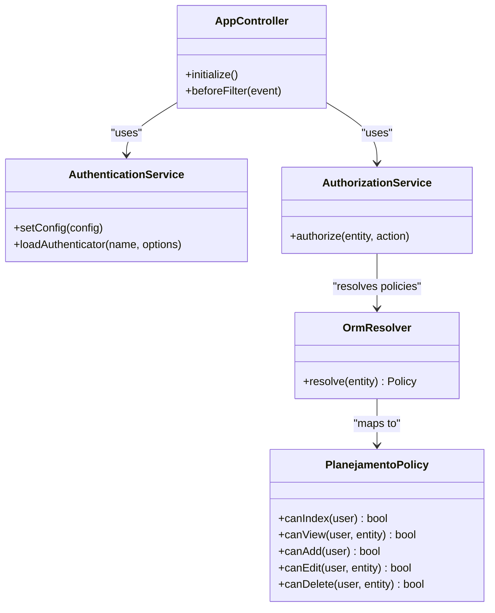
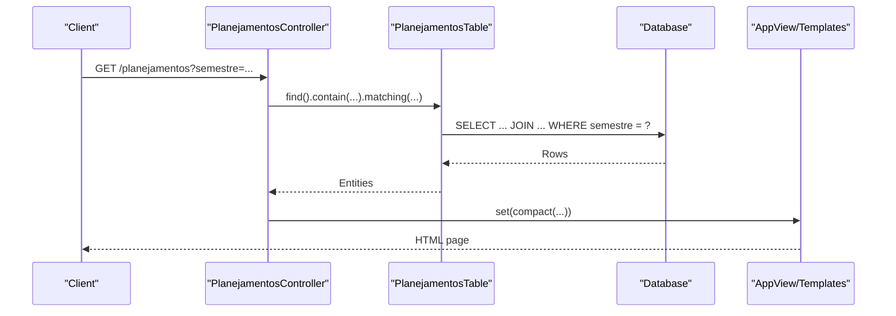
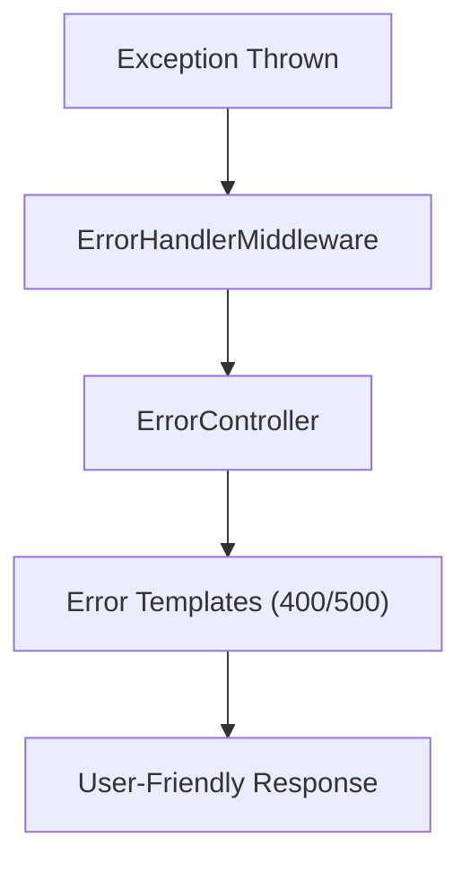
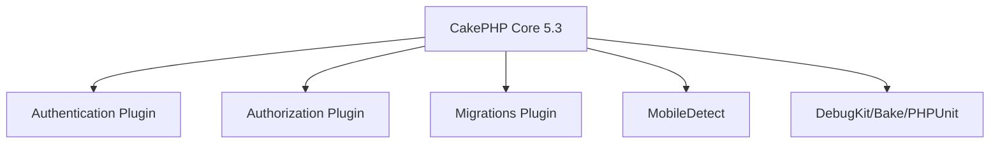

# System Architecture

<cite>
**Referenced Files in This Document**
- [Application.php](file://src/Application.php)
- [HostHeaderMiddleware.php](file://src/Middleware/HostHeaderMiddleware.php)
- [AppController.php](file://src/Controller/AppController.php)
- [PlanejamentosController.php](file://src/Controller/PlanejamentosController.php)
- [PlanejamentosTable.php](file://src/Model/Table/PlanejamentosTable.php)
- [PlanejamentoPolicy.php](file://src/Policy/PlanejamentoPolicy.php)
- [AppView.php](file://src/View/AppView.php)
- [ErrorController.php](file://src/Controller/ErrorController.php)
- [error400.php](file://templates/Error/error400.php)
- [error500.php](file://templates/Error/error500.php)
- [app.php](file://config/app.php)
- [bootstrap.php](file://config/bootstrap.php)
- [routes.php](file://config/routes.php)
- [composer.json](file://composer.json)
</cite>

## Table of Contents
1. [Introduction](#introduction)
2. [Project Structure](#project-structure)
3. [Core Components](#core-components)
4. [Architecture Overview](#architecture-overview)
5. [Detailed Component Analysis](#detailed-component-analysis)
6. [Dependency Analysis](#dependency-analysis)
7. [Performance Considerations](#performance-considerations)
8. [Troubleshooting Guide](#troubleshooting-guide)
9. [Conclusion](#conclusion)
10. [Appendices](#appendices)

## Introduction
This document describes the architecture of the planejamento5 system, a CakePHP 5.3 application implementing the MVC pattern with a robust middleware pipeline for security and cross-cutting concerns. It explains how HTTP requests are processed through routing, middleware (including authentication, authorization, and CSRF protection), controllers, models, and views. It also documents integration points with external services such as databases and email systems, and outlines deployment considerations.

## Project Structure
The application follows CakePHP conventions:
- src contains application code (controllers, models, policies, views, middleware).
- config holds configuration files for runtime behavior, database connections, logging, and email.
- templates hold view templates and layouts.
- webroot serves static assets.
- composer.json defines dependencies including CakePHP core, Authentication, Authorization, Migrations, and MobileDetect.

**Diagram sources**
- [Application.php:73-122](file://src/Application.php#L73-L122)
- [routes.php:32-79](file://config/routes.php#L32-L79)
- [AppController.php:29-54](file://src/Controller/AppController.php#L29-L54)
- [PlanejamentosController.php:9-17](file://src/Controller/PlanejamentosController.php#L9-L17)
- [PlanejamentosTable.php:9-40](file://src/Model/Table/PlanejamentosTable.php#L9-L40)
- [AppView.php:28-61](file://src/View/AppView.php#L28-L61)
- [ErrorController.php:26-70](file://src/Controller/ErrorController.php#L26-L70)
- [app.php:277-343](file://config/app.php#L277-L343)
- [app.php:222-262](file://config/app.php#L222-L262)

**Section sources**
- [composer.json:1-60](file://composer.json#L1-L60)
- [routes.php:32-79](file://config/routes.php#L32-L79)

## Core Components
- Application bootstrap and middleware pipeline:
  - Registers error handling, host header validation, asset serving, routing, body parsing, CSRF protection, authentication, and authorization.
  - Configures authentication using session and form authenticators with password hashing via ORM resolver against the user table.
  - Configures authorization using an ORM-based policy resolver with redirect handler for unauthorized access.
- Controllers:
  - AppController loads Flash, Authentication, and Authorization components and declares unauthenticated actions.
  - Domain controller (e.g., PlanejamentosController) implements CRUD operations, pagination, filtering, and authorization checks.
- Models:
  - Table classes define associations, behaviors, and validation rules.
- Views:
  - AppView initializes helpers and custom template configurations.
- Policies:
  - Role-based authorization decisions per entity/action.
- Error handling:
  - Custom ErrorController and templates render user-friendly errors and developer details in debug mode.

**Section sources**
- [Application.php:73-122](file://src/Application.php#L73-L122)
- [Application.php:124-162](file://src/Application.php#L124-L162)
- [AppController.php:29-54](file://src/Controller/AppController.php#L29-L54)
- [PlanejamentosController.php:9-17](file://src/Controller/PlanejamentosController.php#L9-L17)
- [PlanejamentosTable.php:9-40](file://src/Model/Table/PlanejamentosTable.php#L9-L40)
- [AppView.php:28-61](file://src/View/AppView.php#L28-L61)
- [PlanejamentoPolicy.php:9-45](file://src/Policy/PlanejamentoPolicy.php#L9-L45)
- [ErrorController.php:26-70](file://src/Controller/ErrorController.php#L26-L70)

## Architecture Overview
The request lifecycle is orchestrated by the Application class and CakePHP’s middleware stack. Requests pass through security and parsing layers before reaching routes and controllers. Responses are rendered by views and returned to clients. External integrations include MySQL via Datasources and email via configured transports.

**Diagram sources**
- [Application.php:73-122](file://src/Application.php#L73-L122)
- [routes.php:32-79](file://config/routes.php#L32-L79)
- [PlanejamentosController.php:17-67](file://src/Controller/PlanejamentosController.php#L17-L67)
- [PlanejamentosTable.php:11-40](file://src/Model/Table/PlanejamentosTable.php#L11-L40)
- [app.php:277-343](file://config/app.php#L277-L343)
- [app.php:222-262](file://config/app.php#L222-L262)

## Detailed Component Analysis

### Middleware Pipeline and Security Layers
- Error handling: Catches exceptions early and renders error responses.
- Host header validation: Prevents Host Header Injection by enforcing App.fullBaseUrl in production.
- Asset middleware: Serves plugin/theme assets with caching.
- Routing: Maps URLs to controllers/actions.
- Body parser: Parses JSON/XML bodies into request data.
- CSRF protection: Validates tokens on state-changing requests.
- Authentication: Session and Form authenticators; redirects unauthenticated users to login.
- Authorization: Policy-based access control; redirects unauthorized users.

**Diagram sources**
- [Application.php:73-122](file://src/Application.php#L73-L122)
- [HostHeaderMiddleware.php:23-58](file://src/Middleware/HostHeaderMiddleware.php#L23-L58)

**Section sources**
- [Application.php:73-122](file://src/Application.php#L73-L122)
- [HostHeaderMiddleware.php:23-58](file://src/Middleware/HostHeaderMiddleware.php#L23-L58)

### Authentication and Authorization
- Authentication service:
  - Uses Session authenticator first, then Form authenticator with Password identifier.
  - Identifies users via email field mapped to username.
  - Resolves users from the Usuarioplanejamentos table using ORM resolver.
- Authorization service:
  - Uses OrmResolver to map entities to policies.
  - Redirects unauthorized users to login with redirect query parameter.
- Controller-level enforcement:
  - AppController loads Authentication and Authorization components.
  - Specific actions can be marked as unauthenticated or explicitly authorized/skipped.

**Diagram sources**
- [Application.php:124-162](file://src/Application.php#L124-L162)
- [AppController.php:29-54](file://src/Controller/AppController.php#L29-L54)
- [PlanejamentoPolicy.php:9-45](file://src/Policy/PlanejamentoPolicy.php#L9-L45)

**Section sources**
- [Application.php:124-162](file://src/Application.php#L124-L162)
- [AppController.php:29-54](file://src/Controller/AppController.php#L29-L54)
- [PlanejamentoPolicy.php:9-45](file://src/Policy/PlanejamentoPolicy.php#L9-L45)

### MVC Interactions: Controller, Model, View
- Controller responsibilities:
  - Handle HTTP requests, orchestrate business logic, enforce authorization, and prepare view data.
  - Example: PlanejamentosController manages listing, viewing, adding, editing, deleting, and listing grouped results.
- Model responsibilities:
  - Define associations (belongsTo), behaviors (Timestamp), and validation rules.
  - Provide ORM queries used by controllers.
- View responsibilities:
  - Render templates with provided data.
  - AppView initializes helpers and custom templates for forms and pagination.

**Diagram sources**
- [PlanejamentosController.php:17-67](file://src/Controller/PlanejamentosController.php#L17-L67)
- [PlanejamentosTable.php:11-40](file://src/Model/Table/PlanejamentosTable.php#L11-L40)
- [AppView.php:28-61](file://src/View/AppView.php#L28-L61)

**Section sources**
- [PlanejamentosController.php:17-67](file://src/Controller/PlanejamentosController.php#L17-L67)
- [PlanejamentosTable.php:11-40](file://src/Model/Table/PlanejamentosTable.php#L11-L40)
- [AppView.php:28-61](file://src/View/AppView.php#L28-L61)

### Error Handling and User Experience
- ErrorController sets template path to Error layout and avoids loading full AppController initialization for safety.
- Templates provide user-friendly messages and detailed debugging information when debug is enabled.

**Diagram sources**
- [ErrorController.php:26-70](file://src/Controller/ErrorController.php#L26-L70)
- [error400.php:1-27](file://templates/Error/error400.php#L1-L27)
- [error500.php:1-37](file://templates/Error/error500.php#L1-L37)

**Section sources**
- [ErrorController.php:26-70](file://src/Controller/ErrorController.php#L26-L70)
- [error400.php:1-27](file://templates/Error/error400.php#L1-L27)
- [error500.php:1-37](file://templates/Error/error500.php#L1-L37)

## Dependency Analysis
- Framework and plugins:
  - cakephp/cakephp 5.3.x
  - cakephp/authentication ^3.0
  - cakephp/authorization ^3.5
  - cakephp/migrations ^5.0
  - mobiledetect/mobiledetectlib ^4.8.03
- Development tools:
  - bake, DebugKit, PHPUnit, PHPStan/Psalm suggestions.

**Diagram sources**
- [composer.json:1-60](file://composer.json#L1-L60)

**Section sources**
- [composer.json:1-60](file://composer.json#L1-L60)

## Performance Considerations
- Enable routing cache for large route sets in production.
- Use appropriate cache engines for translations and model metadata; adjust durations based on environment.
- Configure database connection flags and enable query logging only when needed.
- Leverage pagination and selective containments to reduce payload size.
- Set App.fullBaseUrl to avoid dynamic host resolution overhead and improve security.

[No sources needed since this section provides general guidance]

## Troubleshooting Guide
- Host Header Injection:
  - Ensure App.fullBaseUrl is configured in production; otherwise, HostHeaderMiddleware will reject requests.
- Authentication failures:
  - Verify session storage and form fields mapping (email/password).
  - Confirm user model name and resolver settings.
- Authorization denials:
  - Check policy methods and user roles; ensure identity is present.
- CSRF errors:
  - Validate that CSRF tokens are included in state-changing requests.
- Database connectivity:
  - Review Datasources configuration and credentials in app_local.php.
- Email delivery:
  - Inspect EmailTransport settings and network reachability.

**Section sources**
- [HostHeaderMiddleware.php:23-58](file://src/Middleware/HostHeaderMiddleware.php#L23-L58)
- [Application.php:124-162](file://src/Application.php#L124-L162)
- [app.php:277-343](file://config/app.php#L277-L343)
- [app.php:222-262](file://config/app.php#L222-L262)

## Conclusion
The planejamento5 system leverages CakePHP 5.3’s MVC architecture with a secure, extensible middleware pipeline. Authentication and authorization are enforced at both middleware and controller levels, while policies encapsulate fine-grained access control. The application integrates with MySQL and email services through well-defined configuration. Clear separation of concerns, robust error handling, and configurable performance features support maintainable and scalable development.

[No sources needed since this section summarizes without analyzing specific files]

## Appendices

### Technology Stack Decisions
- PHP >= 8.2 ensures modern language features and performance.
- CakePHP 5.3 provides a mature framework with strong conventions and ecosystem.
- Authentication and Authorization plugins offer flexible, policy-driven security.
- Migrations facilitate schema versioning and team collaboration.
- MobileDetect enables device-aware logic if needed.

**Section sources**
- [composer.json:1-60](file://composer.json#L1-L60)

### Deployment Topology Considerations
- Reverse proxy/web server should terminate TLS and forward correct Host headers.
- Environment variables should supply APP_FULL_BASE_URL, DATABASE_URL, EMAIL_TRANSPORT_DEFAULT_URL, and SECURITY_SALT.
- Cache directories must be writable; consider centralized cache backends for multi-instance deployments.
- Logs should be aggregated centrally; separate debug/error/query logs aid diagnostics.

**Section sources**
- [bootstrap.php:152-183](file://config/bootstrap.php#L152-L183)
- [app.php:277-343](file://config/app.php#L277-L343)
- [app.php:222-262](file://config/app.php#L222-L262)