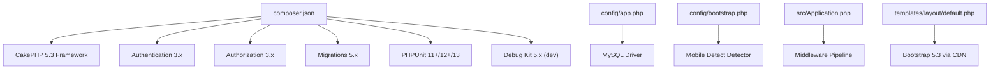
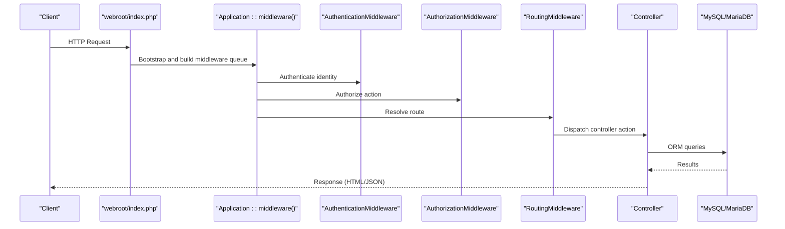
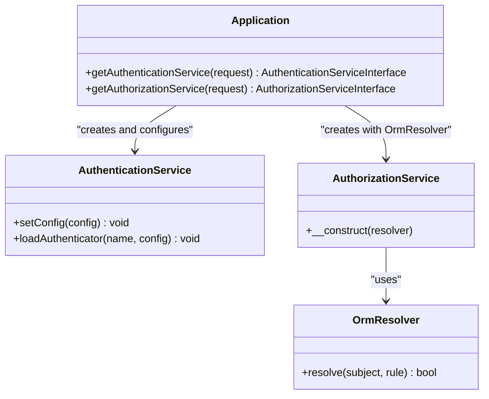
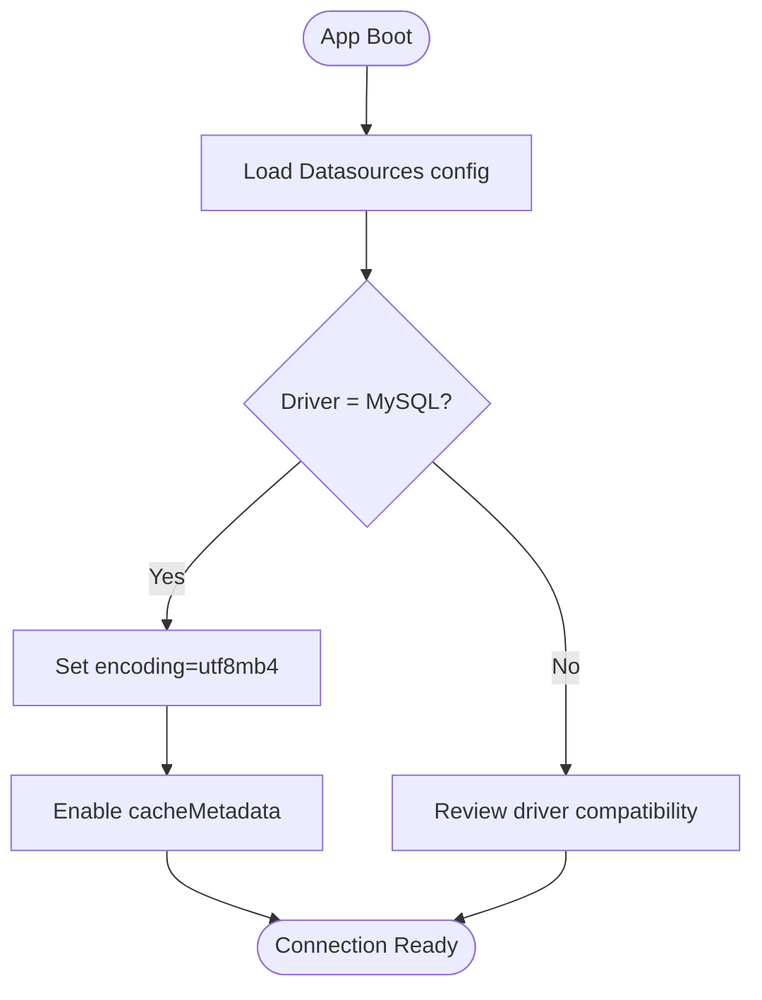
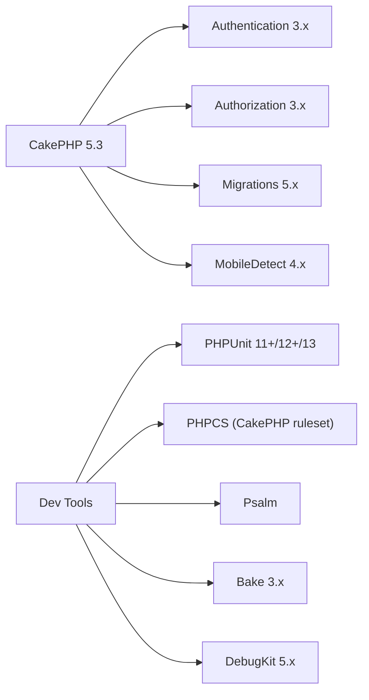

# Technology Stack

<cite>
**Referenced Files in This Document**
- [composer.json](file://composer.json)
- [README.md](file://README.md)
- [config/app.php](file://config/app.php)
- [config/bootstrap.php](file://config/bootstrap.php)
- [src/Application.php](file://src/Application.php)
- [templates/layout/default.php](file://templates/layout/default.php)
- [phpunit.xml.dist](file://phpunit.xml.dist)
- [phpstan.neon](file://phpstan.neon)
- [phpcs.xml](file://phpcs.xml)
- [psalm.xml](file://psalm.xml)
- [config/Migrations/20260612021814_CreateUsers.php](file://config/Migrations/20260612021814_CreateUsers.php)
</cite>

## Table of Contents
1. Introduction
2. Project Structure
3. Core Components
4. Architecture Overview
5. Detailed Component Analysis
6. Dependency Analysis
7. Performance Considerations
8. Troubleshooting Guide
9. Conclusion

## Introduction
This document describes the technology stack of the planejamento5 system, focusing on runtime requirements, framework components, security libraries, database backend, frontend design, and development tooling. It explains version compatibility, rationale for choices, upgrade paths, deployment considerations, performance implications, and maintenance requirements.

## Project Structure
The application follows CakePHP conventions with a clear separation between configuration, source code, templates, tests, and assets. Key areas:
- Configuration: app.php, bootstrap.php, migrations
- Application entry and middleware: src/Application.php
- Frontend layout: templates/layout/default.php
- Development and quality tools: phpunit.xml.dist, phpstan.neon, phpcs.xml, psalm.xml
- Dependencies: composer.json

**Diagram sources**
- [composer.json:7-22](file://composer.json#L7-L22)
- [config/app.php:288-343](file://config/app.php#L288-L343)
- [config/bootstrap.php:201-210](file://config/bootstrap.php#L201-L210)
- [src/Application.php:73-122](file://src/Application.php#L73-L122)
- [templates/layout/default.php:19-24](file://templates/layout/default.php#L19-L24)

**Section sources**
- [composer.json:1-60](file://composer.json#L1-L60)
- [config/app.php:1-465](file://config/app.php#L1-L465)
- [config/bootstrap.php:1-241](file://config/bootstrap.php#L1-L241)
- [src/Application.php:1-191](file://src/Application.php#L1-L191)
- [templates/layout/default.php:1-124](file://templates/layout/default.php#L1-L124)

## Core Components
- PHP Runtime: Requires PHP >= 8.2 to leverage modern language features and security improvements.
- Framework: CakePHP 5.3 provides MVC architecture, routing, middleware pipeline, ORM, caching, logging, and i18n.
- Authentication: cakephp/authentication ^3.0 implements session and form authenticators with password resolver against an ORM user model.
- Authorization: cakephp/authorization ^3.5 integrates policy-based access control with an ORM resolver and redirects unauthorized users.
- Database: MySQL driver configured with utf8mb4 encoding; MariaDB compatible due to shared MySQL protocol and charset support.
- Migrations: cakephp/migrations ^5.0 manages schema evolution with migration classes.
- Frontend: Bootstrap 5.3 loaded via CDN in the default layout for responsive UI components.
- Testing: PHPUnit configured with CakePHP fixture extension and test suite discovery.
- Static Analysis: PHPStan level 8 configured; Psalm configured at errorLevel 2.
- Code Standards: PHPCS using CakePHP ruleset with selective exclusions.

Rationale and compatibility:
- PHP 8.2+ ensures long-term support alignment with CakePHP 5.x and improved performance/security.
- Authentication 3.x and Authorization 3.x are the current stable series compatible with CakePHP 5.x.
- Migrations 5.x aligns with CakePHP 5.x plugin ecosystem.
- Bootstrap 5.3 via CDN simplifies delivery and updates without bundling assets.

Upgrade paths:
- Composer-driven upgrades for all packages; pin major versions as needed and review deprecations.
- For Bootstrap, update the CDN URL in the layout when moving to newer minor releases.
- For database drivers, ensure server-side MySQL/MariaDB versions meet utf8mb4 requirements.

Deployment considerations:
- Set App.fullBaseUrl in production to prevent Host Header Injection; enforced by custom middleware.
- Configure secure cookies and CSRF protection via middleware defaults.
- Use environment variables for secrets and per-environment overrides (app_local.php).

Performance implications:
- File cache engines used by default; consider Redis/Memcached in production for higher throughput.
- Query logging disabled by default; enable selectively for diagnostics.
- Asset timestamping can be enabled to bust caches.

Maintenance requirements:
- Keep PHP, CakePHP, and plugins updated regularly.
- Run static analysis and tests in CI.
- Monitor database engine versions and charset settings.

**Section sources**
- [composer.json:7-22](file://composer.json#L7-L22)
- [config/app.php:288-343](file://config/app.php#L288-L343)
- [src/Application.php:124-162](file://src/Application.php#L124-L162)
- [templates/layout/default.php:19-24](file://templates/layout/default.php#L19-L24)
- [phpunit.xml.dist:1-37](file://phpunit.xml.dist#L1-L37)
- [phpstan.neon:1-8](file://phpstan.neon#L1-L8)
- [psalm.xml:1-16](file://psalm.xml#L1-L16)
- [phpcs.xml:1-11](file://phpcs.xml#L1-L11)

## Architecture Overview
High-level runtime flow:
- HTTP request enters webroot/index.php and is handled by CakePHP’s BaseApplication.
- Middleware pipeline applies error handling, host header validation, asset serving, routing, body parsing, CSRF protection, authentication, and authorization.
- Controllers process requests using ORM tables and entities.
- Views render HTML using layouts and helpers; Bootstrap 5 styles and scripts are included from CDN.
- Database interactions use the configured MySQL driver with utf8mb4.

**Diagram sources**
- [src/Application.php:73-122](file://src/Application.php#L73-L122)
- [config/app.php:288-343](file://config/app.php#L288-L343)

**Section sources**
- [src/Application.php:73-122](file://src/Application.php#L73-L122)
- [config/app.php:288-343](file://config/app.php#L288-L343)

## Detailed Component Analysis

### PHP Runtime and Framework (CakePHP 5.3)
- Version requirement: PHP >= 8.2; CakePHP 5.3.* pinned.
- Benefits: Strong typing, modern syntax, robust middleware, ORM, caching, logging, i18n.
- Upgrade path: Follow CakePHP 5.x release notes; run static analysis and tests after upgrades.

**Section sources**
- [composer.json:7-12](file://composer.json#L7-L12)
- [README.md:1-59](file://README.md#L1-L59)

### Authentication (cakephp/authentication ^3.0)
- Implements session and form authenticators.
- Form authenticator uses Password identifier with Orm resolver bound to Usuarioplanejamentos user model.
- Redirects unauthenticated users to login page with redirect query parameter.

**Diagram sources**
- [src/Application.php:124-162](file://src/Application.php#L124-L162)

**Section sources**
- [src/Application.php:124-162](file://src/Application.php#L124-L162)

### Authorization (cakephp/authorization ^3.5)
- Policy-based access control integrated into middleware.
- Uses OrmResolver to map policies to ORM entities.
- UnauthorizedHandler redirects to login with redirect parameter for MissingIdentityException and ForbiddenException.

**Section sources**
- [src/Application.php:108-119](file://src/Application.php#L108-L119)
- [src/Application.php:157-162](file://src/Application.php#L157-L162)

### Database Backend (MySQL/MariaDB)
- Default connection uses MySQL driver with utf8mb4 encoding for full Unicode support.
- Test connection mirrors default settings for consistent behavior across environments.
- Metadata caching enabled; identifier quoting disabled by default for performance.

**Diagram sources**
- [config/app.php:288-343](file://config/app.php#L288-L343)

**Section sources**
- [config/app.php:288-343](file://config/app.php#L288-L343)

### Migrations (cakephp/migrations ^5.0)
- Schema evolution managed via migration classes under config/Migrations.
- Example migration creates users table with username, password, role, email, created, modified fields.

**Section sources**
- [config/Migrations/20260612021814_CreateUsers.php:1-50](file://config/Migrations/20260612021814_CreateUsers.php#L1-L50)

### Frontend Design (Bootstrap 5.3)
- Bootstrap CSS and JS loaded via jsDelivr CDN in the default layout.
- Provides responsive navigation, dropdowns, and utility classes.
- Update strategy: change CDN URLs in layout to newer versions as needed.

**Section sources**
- [templates/layout/default.php:19-24](file://templates/layout/default.php#L19-L24)
- [templates/layout/default.php:120-122](file://templates/layout/default.php#L120-L122)

### Testing (PHPUnit 11+/12+/13)
- PHPUnit configured with CakePHP Fixture Extension.
- Testsuite targets tests/TestCase directory; excludes installer script from coverage.
- Memory limit set to unlimited for test runs.

**Section sources**
- [phpunit.xml.dist:1-37](file://phpunit.xml.dist#L1-L37)
- [composer.json:16-22](file://composer.json#L16-L22)

### Static Analysis (PHPStan Level 8)
- Level 8 enforces strict type checks and catches subtle bugs.
- Bootstrap file included to load application context.
- Scans src/ directory.

**Section sources**
- [phpstan.neon:1-8](file://phpstan.neon#L1-L8)

### Code Quality (PHPCS and Psalm)
- PHPCS uses CakePHP ruleset with selective exclusion for missing native return type hints in controllers.
- Psalm configured at errorLevel 2, scanning src/ and ignoring vendor/.

**Section sources**
- [phpcs.xml:1-11](file://phpcs.xml#L1-L11)
- [psalm.xml:1-16](file://psalm.xml#L1-L16)

## Dependency Analysis
Core dependencies and their roles:
- cakephp/cakephp 5.3.*: Core framework providing MVC, middleware, ORM, caching, logging.
- cakephp/authentication ^3.0: Identity management and authentication flows.
- cakephp/authorization ^3.5: Policy-based authorization integration.
- cakephp/migrations ^5.0: Database schema versioning.
- mobiledetect/mobiledetectlib ^4.8.03: Device detection for mobile/tablet detectors.
- Dev tools: bake, codesniffer, debug_kit, dotenv, phpunit.

**Diagram sources**
- [composer.json:7-22](file://composer.json#L7-L22)

**Section sources**
- [composer.json:7-22](file://composer.json#L7-L22)

## Performance Considerations
- Cache Engines: FileEngine is default; consider switching to Redis or Memcached in production for better concurrency and persistence.
- Query Logging: Disabled by default; enable selectively during troubleshooting to avoid overhead.
- Identifier Quoting: Disabled by default; enabling increases query processing cost.
- Asset Timestamping: Can be enabled to improve cache busting for static assets.
- Mobile Detection: Adds minimal overhead; remove if not used.

[No sources needed since this section provides general guidance]

## Troubleshooting Guide
Common issues and resolutions:
- Host Header Injection: Ensure App.fullBaseUrl is configured in production; custom middleware enforces validation.
- Session Storage: Default uses PHP sessions; switch to cache/database handlers if scaling horizontally.
- Email Transport: Default MailTransport may not suit production; configure SMTP transport and credentials securely.
- Debug Mode: Disable debug in production to hide errors and reduce overhead; adjust Error and Debugger settings accordingly.
- Database Charset: Verify utf8mb4 support on MySQL/MariaDB; adjust flags if skip-character-set-client-handshake is enabled.

**Section sources**
- [config/app.php:199-201](file://config/app.php#L199-L201)
- [config/app.php:419-421](file://config/app.php#L419-L421)
- [config/app.php:222-241](file://config/app.php#L222-L241)
- [config/app.php:176-183](file://config/app.php#L176-L183)
- [config/app.php:294-306](file://config/app.php#L294-L306)

## Conclusion
The planejamento5 system leverages a modern, well-supported stack centered on CakePHP 5.3 with PHP 8.2+, secured by Authentication 3.x and Authorization 3.x, backed by MySQL/MariaDB with utf8mb4, and enhanced by Migrations 5.x for schema management. The frontend uses Bootstrap 5.3 via CDN for responsiveness. Development tooling includes PHPUnit, PHPStan level 8, PHPCS, and Psalm to ensure reliability and code quality. Upgrades should follow Composer-driven processes and framework release notes, with careful attention to security configurations and environment-specific overrides.