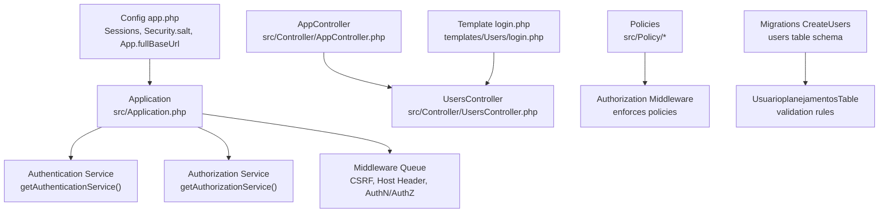
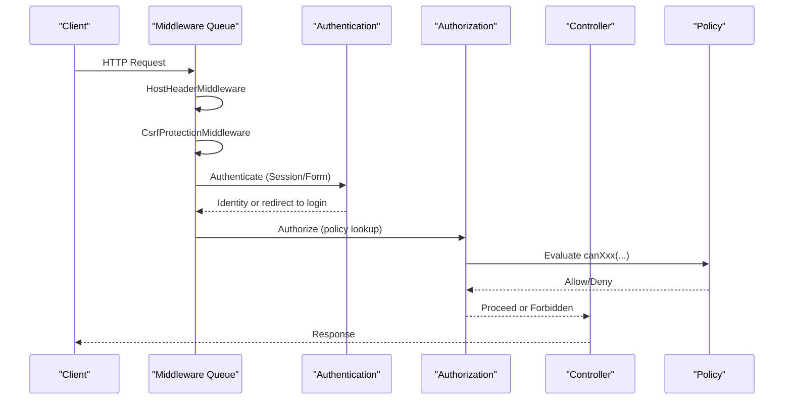
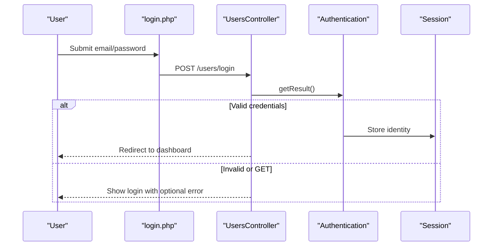
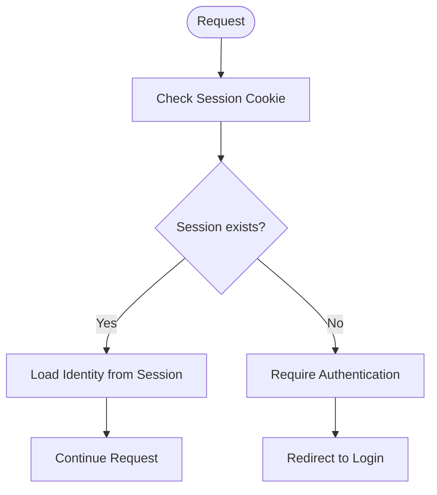
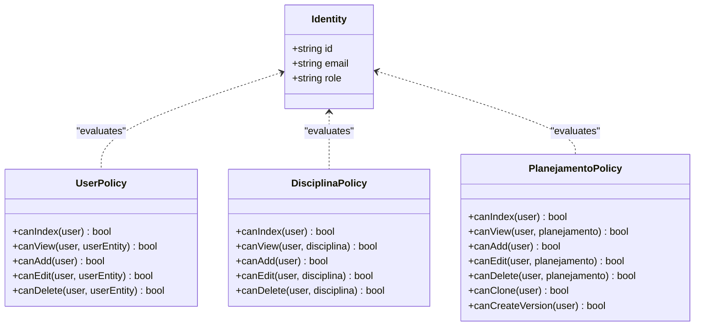
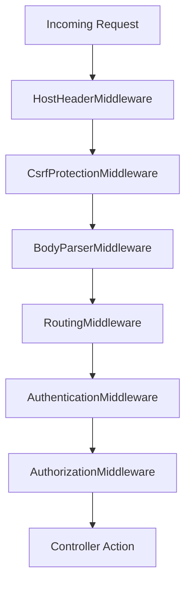
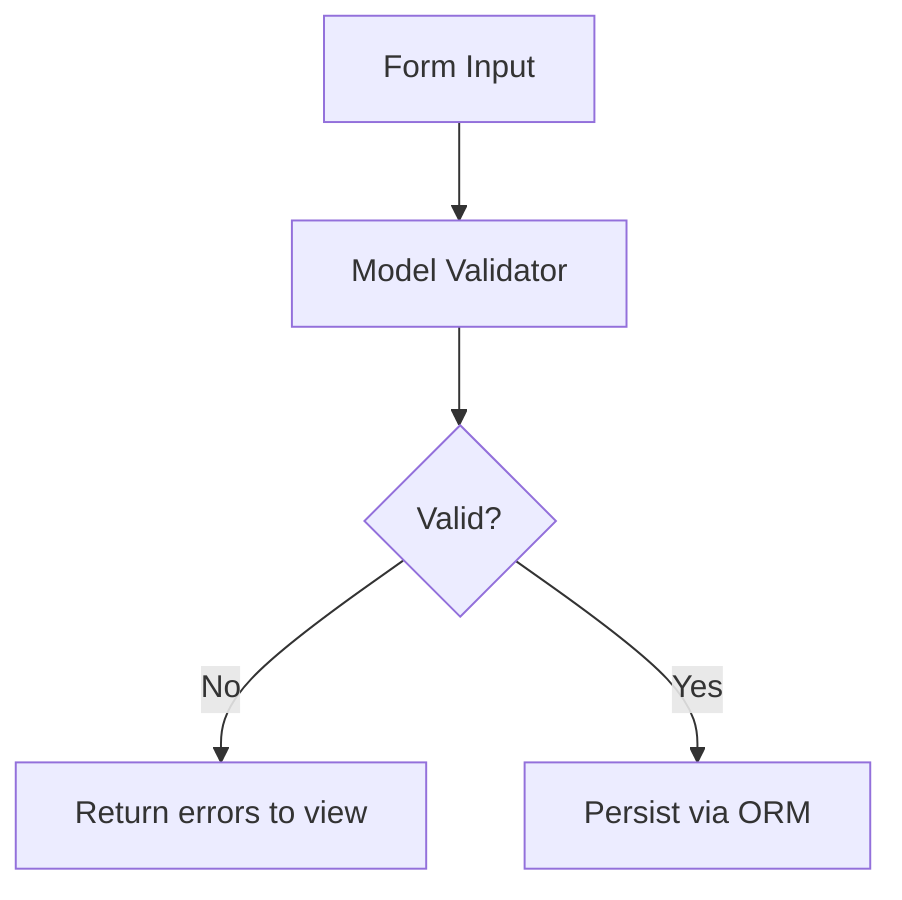
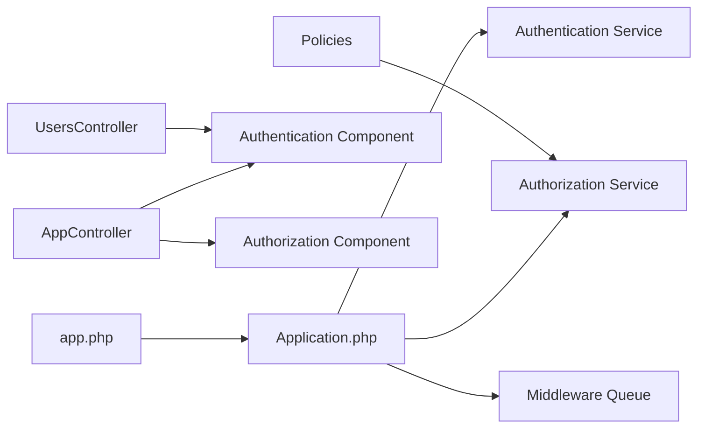

# Security & Authentication

<cite>
**Referenced Files in This Document**
- [Application.php](file://src/Application.php)
- [AppController.php](file://src/Controller/AppController.php)
- [UsersController.php](file://src/Controller/UsersController.php)
- [HostHeaderMiddleware.php](file://src/Middleware/HostHeaderMiddleware.php)
- [app.php](file://config/app.php)
- [sessions.sql](file://config/schema/sessions.sql)
- [CreateUsers.php](file://config/Migrations/20260612021814_CreateUsers.php)
- [UsuarioplanejamentosTable.php](file://src/Model/Table/UsuarioplanejamentosTable.php)
- [UserPolicy.php](file://src/Policy/UserPolicy.php)
- [DisciplinaPolicy.php](file://src/Policy/DisciplinaPolicy.php)
- [PlanejamentoPolicy.php](file://src/Policy/PlanejamentoPolicy.php)
- [login.php](file://templates/Users/login.php)
</cite>

## Table of Contents
1. Introduction
2. Project Structure
3. Core Components
4. Architecture Overview
5. Detailed Component Analysis
6. Dependency Analysis
7. Performance Considerations
8. Troubleshooting Guide
9. Conclusion
10. Appendices

## Introduction
This document explains the security and authentication design of the planejamento5 academic planning system. It covers:
- Authentication flow using CakePHP’s Authentication component (Session and Form authenticators)
- Session management configuration and storage options
- Password hashing via the framework’s default password hasher
- Authorization through Policies with role-based access control (RBAC) for admin, editor, and user roles
- Security middleware including CSRF protection and host header validation
- Secure coding practices such as SQL injection prevention, XSS protection, and input validation
- Guidance for implementing custom policies, securing new controllers, and handling sensitive operations
- Best practices, vulnerability mitigation, and monitoring approaches

## Project Structure
Security-related components are implemented across application bootstrap, middleware, controllers, models, policies, templates, and configuration:
- Application bootstraps Authentication and Authorization services and registers middleware
- Controllers use Authentication and Authorization components to enforce access
- Policies define fine-grained permissions per resource and action
- Configuration centralizes session, security salt, and base URL settings
- Migrations define the users table schema used by authentication

**Diagram sources**
- [Application.php:73-122](file://src/Application.php#L73-L122)
- [Application.php:124-162](file://src/Application.php#L124-L162)
- [AppController.php:40-53](file://src/Controller/AppController.php#L40-L53)
- [UsersController.php:20-24](file://src/Controller/UsersController.php#L20-L24)
- [UserPolicy.php:1-38](file://src/Policy/UserPolicy.php#L1-L38)
- [DisciplinaPolicy.php:1-36](file://src/Policy/DisciplinaPolicy.php#L1-L36)
- [PlanejamentoPolicy.php:1-46](file://src/Policy/PlanejamentoPolicy.php#L1-L46)
- [app.php:376-421](file://config/app.php#L376-L421)
- [CreateUsers.php:16-48](file://config/Migrations/20260612021814_CreateUsers.php#L16-L48)
- [UsuarioplanejamentosTable.php:24-41](file://src/Model/Table/UsuarioplanejamentosTable.php#L24-L41)
- [login.php:1-48](file://templates/Users/login.php#L1-L48)

**Section sources**
- [Application.php:73-122](file://src/Application.php#L73-L122)
- [Application.php:124-162](file://src/Application.php#L124-L162)
- [AppController.php:40-53](file://src/Controller/AppController.php#L40-L53)
- [UsersController.php:20-24](file://src/Controller/UsersController.php#L20-L24)
- [app.php:376-421](file://config/app.php#L376-L421)
- [CreateUsers.php:16-48](file://config/Migrations/20260612021814_CreateUsers.php#L16-L48)
- [UsuarioplanejamentosTable.php:24-41](file://src/Model/Table/UsuarioplanejamentosTable.php#L24-L41)
- [login.php:1-48](file://templates/Users/login.php#L1-L48)

## Core Components
- Authentication service: Configures Session and Form authenticators; maps form fields to email/password; uses ORM resolver against Usuarioplanejamentos table.
- Authorization service: Uses OrmResolver to locate matching Policy classes per entity/controller.
- Security middleware: CSRF protection, Host header validation, Body parsing, Routing, Asset handling.
- RBAC policies: Role checks (admin, editor, user) per resource and action; some resources allow public read, others require authenticated or admin-only actions.
- Sessions: Default PHP sessions configured; database-backed sessions available via provided schema.
- Password hashing: Framework default password hasher is used by Authentication component.

**Section sources**
- [Application.php:124-155](file://src/Application.php#L124-L155)
- [Application.php:157-162](file://src/Application.php#L157-L162)
- [Application.php:101-119](file://src/Application.php#L101-L119)
- [app.php:376-421](file://config/app.php#L376-L421)
- [sessions.sql:8-15](file://config/schema/sessions.sql#L8-L15)
- [UsuarioplanejamentosTable.php:24-41](file://src/Model/Table/UsuarioplanejamentosTable.php#L24-L41)

## Architecture Overview
The request lifecycle applies security layers before reaching controllers:
- Host header validation prevents Host Header Injection
- CSRF token validation protects state-changing requests
- Authentication identifies the user via Session or Form
- Authorization enforces policy decisions per controller/action/resource

**Diagram sources**
- [Application.php:73-122](file://src/Application.php#L73-L122)
- [Application.php:124-155](file://src/Application.php#L124-L155)
- [Application.php:157-162](file://src/Application.php#L157-L162)
- [HostHeaderMiddleware.php:32-57](file://src/Middleware/HostHeaderMiddleware.php#L32-L57)

## Detailed Component Analysis

### Authentication Flow (Login/Logout/Profile)
- Login template posts email/password to UsersController::login
- Authentication middleware attempts identification using Session first, then Form with Password identifier
- On success, identity is stored in session; on failure, error message is shown
- Logout clears identity and redirects
- Profile requires authentication and displays current user data

**Diagram sources**
- [login.php:1-48](file://templates/Users/login.php#L1-L48)
- [UsersController.php:29-50](file://src/Controller/UsersController.php#L29-L50)
- [Application.php:124-155](file://src/Application.php#L124-L155)

**Section sources**
- [UsersController.php:20-24](file://src/Controller/UsersController.php#L20-L24)
- [UsersController.php:29-50](file://src/Controller/UsersController.php#L29-L50)
- [UsersController.php:55-60](file://src/Controller/UsersController.php#L55-L60)
- [UsersController.php:65-76](file://src/Controller/UsersController.php#L65-L76)
- [Application.php:124-155](file://src/Application.php#L124-L155)

### Session Management
- Default session engine is PHP; database-backed sessions are supported via provided schema
- Session cookie lifetime and garbage collection should be tuned for production
- Ensure secure cookie flags and domain/path restrictions at the server level

**Diagram sources**
- [app.php:376-421](file://config/app.php#L376-L421)
- [sessions.sql:8-15](file://config/schema/sessions.sql#L8-L15)

**Section sources**
- [app.php:376-421](file://config/app.php#L376-L421)
- [sessions.sql:8-15](file://config/schema/sessions.sql#L8-L15)

### Password Hashing
- The Authentication component uses the framework’s default password hasher, which relies on secure native hashing functions
- Passwords are validated during login via the Password identifier
- Ensure passwords are never logged or echoed back in responses

**Section sources**
- [Application.php:134-152](file://src/Application.php#L134-L152)

### Authorization and RBAC (Policies)
- Policies implement canIndex/canView/canAdd/canEdit/canDelete methods per resource
- Roles include admin, editor, and user; some actions are open to all, some require authentication, and some are admin-only
- Example patterns:
  - User management restricted to admin (with self-view/edit allowed for users)
  - Disciplinas allows add/edit for admin/editor, delete for admin
  - Planejamentos allows add for any authenticated user, edit for admin/editor, delete for admin

**Diagram sources**
- [UserPolicy.php:1-38](file://src/Policy/UserPolicy.php#L1-L38)
- [DisciplinaPolicy.php:1-36](file://src/Policy/DisciplinaPolicy.php#L1-L36)
- [PlanejamentoPolicy.php:1-46](file://src/Policy/PlanejamentoPolicy.php#L1-L46)

**Section sources**
- [UserPolicy.php:1-38](file://src/Policy/UserPolicy.php#L1-L38)
- [DisciplinaPolicy.php:1-36](file://src/Policy/DisciplinaPolicy.php#L1-L36)
- [PlanejamentoPolicy.php:1-46](file://src/Policy/PlanejamentoPolicy.php#L1-L46)

### Security Middleware Configuration
- Host header validation prevents Host Header Injection in production when App.fullBaseUrl is set
- CSRF protection enabled with HttpOnly cookies
- Body parser ensures safe parsing of JSON/XML into arrays
- Error handler and routing middleware are included

**Diagram sources**
- [Application.php:73-122](file://src/Application.php#L73-L122)
- [HostHeaderMiddleware.php:32-57](file://src/Middleware/HostHeaderMiddleware.php#L32-L57)

**Section sources**
- [Application.php:73-122](file://src/Application.php#L73-L122)
- [HostHeaderMiddleware.php:32-57](file://src/Middleware/HostHeaderMiddleware.php#L32-L57)
- [app.php:39-44](file://config/app.php#L39-L44)

### Data Validation and Input Sanitization
- Model-level validation enforces email uniqueness, required fields, and length limits
- Forms render inputs with attributes that encourage browser-side validation
- Use CakePHP’s built-in validators and avoid manual string concatenation for queries

**Diagram sources**
- [UsuarioplanejamentosTable.php:24-41](file://src/Model/Table/UsuarioplanejamentosTable.php#L24-L41)
- [login.php:1-48](file://templates/Users/login.php#L1-L48)

**Section sources**
- [UsuarioplanejamentosTable.php:24-41](file://src/Model/Table/UsuarioplanejamentosTable.php#L24-L41)
- [login.php:1-48](file://templates/Users/login.php#L1-L48)

### Database Schema and Security
- Users table includes username, password, role, email, timestamps
- Use parameterized queries via ORM to prevent SQL injection
- Avoid logging sensitive fields like passwords

**Section sources**
- [CreateUsers.php:16-48](file://config/Migrations/20260612021814_CreateUsers.php#L16-L48)

## Dependency Analysis
- Application wires Authentication and Authorization services and registers middleware
- Controllers depend on Authentication and Authorization components loaded in AppController
- Policies depend on IdentityInterface and entity types to make authorization decisions
- Configuration drives session behavior and security-critical settings

**Diagram sources**
- [Application.php:73-122](file://src/Application.php#L73-L122)
- [Application.php:124-162](file://src/Application.php#L124-L162)
- [AppController.php:40-53](file://src/Controller/AppController.php#L40-L53)
- [UsersController.php:20-24](file://src/Controller/UsersController.php#L20-L24)
- [app.php:376-421](file://config/app.php#L376-L421)

**Section sources**
- [Application.php:73-122](file://src/Application.php#L73-L122)
- [Application.php:124-162](file://src/Application.php#L124-L162)
- [AppController.php:40-53](file://src/Controller/AppController.php#L40-L53)
- [UsersController.php:20-24](file://src/Controller/UsersController.php#L20-L24)
- [app.php:376-421](file://config/app.php#L376-L421)

## Performance Considerations
- Prefer database-backed sessions in multi-server environments for scalability
- Tune session timeout and cookie lifetime to balance security and UX
- Keep debug mode disabled in production to reduce overhead and information leakage
- Enable query logging only when necessary to avoid performance impact

[No sources needed since this section provides general guidance]

## Troubleshooting Guide
- Host Header Injection: Ensure App.fullBaseUrl is set in production; otherwise, HostHeaderMiddleware will reject requests
- CSRF failures: Verify forms include CSRF tokens and that cookies are accepted by the client
- Authentication loops: Confirm unauthenticated actions are declared where appropriate and login/logout routes are accessible
- Session issues: Validate session storage backend and ensure proper permissions for file/database storage

**Section sources**
- [HostHeaderMiddleware.php:32-57](file://src/Middleware/HostHeaderMiddleware.php#L32-L57)
- [Application.php:101-119](file://src/Application.php#L101-L119)
- [UsersController.php:20-24](file://src/Controller/UsersController.php#L20-L24)
- [app.php:376-421](file://config/app.php#L376-L421)

## Conclusion
The planejamento5 system implements a robust security posture using CakePHP’s Authentication and Authorization plugins, with clear RBAC policies, CSRF protection, and host header validation. By following the documented patterns for policies, controllers, and configuration, teams can extend the system securely while mitigating common web vulnerabilities.

[No sources needed since this section summarizes without analyzing specific files]

## Appendices

### Implementing Custom Policies
- Create a Policy class named after the entity/controller
- Implement canIndex/canView/canAdd/canEdit/canDelete methods returning booleans based on user role and ownership
- Reference IdentityInterface and the relevant entity type in method signatures

**Section sources**
- [UserPolicy.php:1-38](file://src/Policy/UserPolicy.php#L1-L38)
- [DisciplinaPolicy.php:1-36](file://src/Policy/DisciplinaPolicy.php#L1-L36)
- [PlanejamentoPolicy.php:1-46](file://src/Policy/PlanejamentoPolicy.php#L1-L46)

### Securing New Controllers
- Extend AppController to inherit Authentication and Authorization components
- Declare unauthenticated actions explicitly if needed
- Rely on policies for fine-grained access control instead of ad-hoc checks

**Section sources**
- [AppController.php:40-53](file://src/Controller/AppController.php#L40-L53)

### Handling Sensitive Operations
- Enforce admin-only actions via policies
- Log only non-sensitive metadata; never log passwords or tokens
- Use HTTPS and secure cookies in production

**Section sources**
- [PlanejamentoPolicy.php:31-44](file://src/Policy/PlanejamentoPolicy.php#L31-L44)
- [app.php:376-421](file://config/app.php#L376-L421)

### Security Best Practices Checklist
- Set App.fullBaseUrl in production
- Disable debug mode in production
- Use strong Security.salt and rotate periodically
- Enable CSRF and validate Host headers
- Apply model validation and ORM usage to prevent SQL injection
- Escape output in views to mitigate XSS
- Monitor logs for failed auth and authorization denials

**Section sources**
- [app.php:39-44](file://config/app.php#L39-L44)
- [app.php:80-82](file://config/app.php#L80-L82)
- [Application.php:101-119](file://src/Application.php#L101-L119)
- [HostHeaderMiddleware.php:32-57](file://src/Middleware/HostHeaderMiddleware.php#L32-L57)
- [UsuarioplanejamentosTable.php:24-41](file://src/Model/Table/UsuarioplanejamentosTable.php#L24-L41)